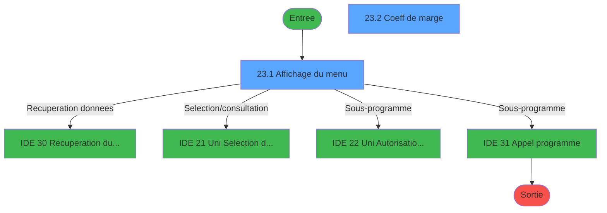
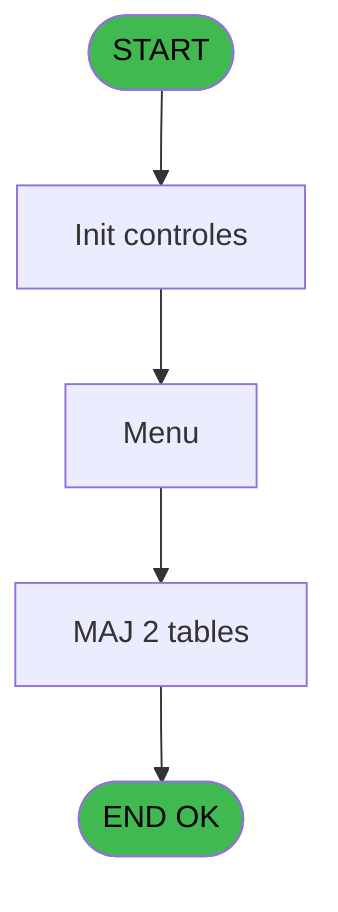
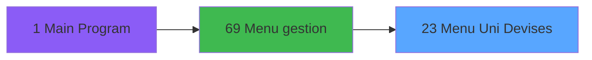
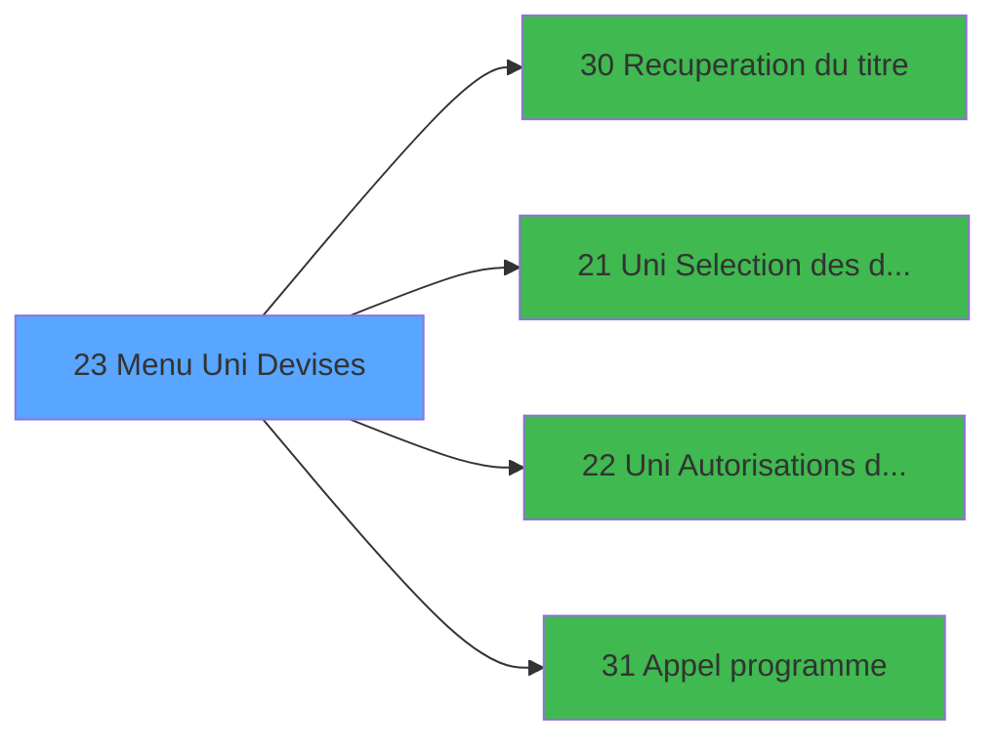

# GES IDE 23 - Menu Uni Devises

> **Analyse**: Phases 1-4 2026-02-03 11:31 -> 11:31 (15s) | Assemblage 11:31
> **Pipeline**: V7.2 Enrichi
> **Structure**: 4 onglets (Resume | Ecrans | Donnees | Connexions)

<!-- TAB:Resume -->

## 1. FICHE D'IDENTITE

| Attribut | Valeur |
|----------|--------|
| Projet | GES |
| IDE Position | 23 |
| Nom Programme | Menu Uni Devises |
| Fichier source | `Prg_23.xml` |
| Dossier IDE | Devises |
| Taches | 4 (2 ecrans visibles) |
| Tables modifiees | 2 |
| Programmes appeles | 4 |

## 2. DESCRIPTION FONCTIONNELLE

**Menu Uni Devises** assure la gestion complete de ce processus, accessible depuis [Menu gestion (IDE 69)](GES-IDE-69.md).

Le flux de traitement s'organise en **3 blocs fonctionnels** :

- **Traitement** (2 taches) : traitements metier divers
- **Calcul** (1 tache) : calculs de montants, stocks ou compteurs
- **Consultation** (1 tache) : ecrans de recherche, selection et consultation

**Donnees modifiees** : 2 tables en ecriture (moyens_reglement_mor, moyen_paiement___mop).

Detail : phases du traitement

#### Phase 1 : Traitement (2 taches)

- **23** - AC  Devise **[[ECRAN]](#ecran-t1)**
- **23.2** - Coeff de marge **[[ECRAN]](#ecran-t3)**

Delegue a : [Recuperation du titre (IDE 30)](GES-IDE-30.md), [ Uni Autorisations devises (IDE 22)](GES-IDE-22.md), [Appel programme (IDE 31)](GES-IDE-31.md)

#### Phase 2 : Consultation (1 tache)

- **23.1** - Affichage du menu **[[ECRAN]](#ecran-t2)**

Delegue a : [Recuperation du titre (IDE 30)](GES-IDE-30.md), [ Uni Selection des devises (IDE 21)](GES-IDE-21.md)

#### Phase 3 : Calcul (1 tache)

- **23.2.1** - Recalcul des taux de change

#### Tables impactees

| Table | Operations | Role metier |
|-------|-----------|-------------|
| moyen_paiement___mop | **W**/L (2 usages) |  |
| moyens_reglement_mor | **W** (1 usages) | Reglements / paiements |

## 3. BLOCS FONCTIONNELS

### 3.1 Traitement (2 taches)

Traitements internes.

---

#### 23 - AC  Devise [[ECRAN]](#ecran-t1)

**Role** : Traitement : AC  Devise.
**Ecran** : 477 x 12 DLU (MDI) | [Voir mockup](#ecran-t1)
**Variables liees** : B (P0 devise locale)
**Delegue a** : [Recuperation du titre (IDE 30)](GES-IDE-30.md), [ Uni Autorisations devises (IDE 22)](GES-IDE-22.md), [Appel programme (IDE 31)](GES-IDE-31.md)

---

#### 23.2 - Coeff de marge [[ECRAN]](#ecran-t3)

**Role** : Traitement : Coeff de marge.
**Ecran** : 595 x 206 DLU (MDI) | [Voir mockup](#ecran-t3)
**Delegue a** : [Recuperation du titre (IDE 30)](GES-IDE-30.md), [ Uni Autorisations devises (IDE 22)](GES-IDE-22.md), [Appel programme (IDE 31)](GES-IDE-31.md)

### 3.2 Consultation (1 tache)

Ecrans de recherche et consultation.

---

#### 23.1 - Affichage du menu [[ECRAN]](#ecran-t2)

**Role** : Reinitialisation : Affichage du menu.
**Ecran** : 733 x 145 DLU (MDI) | [Voir mockup](#ecran-t2)
**Delegue a** : [ Uni Selection des devises (IDE 21)](GES-IDE-21.md)

### 3.3 Calcul (1 tache)

Calculs metier : montants, stocks, compteurs.

---

#### 23.2.1 - Recalcul des taux de change

**Role** : Calcul : Recalcul des taux de change.

## 5. REGLES METIER

*(Aucune regle metier identifiee)*

## 6. CONTEXTE

- **Appele par**: [Menu gestion (IDE 69)](GES-IDE-69.md)
- **Appelle**: 4 programmes | **Tables**: 3 (W:2 R:0 L:2) | **Taches**: 4 | **Expressions**: 6

<!-- TAB:Ecrans -->

## 8. ECRANS

### 8.1 Forms visibles (2 / 4)

| # | Position | Tache | Nom | Type | Largeur | Hauteur | Bloc |
|---|----------|-------|-----|------|---------|---------|------|
| 1 | 23.1 | 23.1 | Affichage du menu | MDI | 733 | 145 | Consultation |
| 2 | 23.2 | 23.2 | Coeff de marge | MDI | 595 | 206 | Traitement |

### 8.2 Mockups Ecrans

---

#### 23.1 - Affichage du menu
**Tache** : [23.1](#t2) | **Type** : MDI | **Dimensions** : 733 x 145 DLU
**Bloc** : Consultation | **Titre IDE** : Affichage du menu

<!-- FORM-DATA:
{
    "width":  733,
    "vFactor":  8,
    "type":  "MDI",
    "hFactor":  8,
    "controls":  [
                     {
                         "x":  0,
                         "type":  "label",
                         "var":  "",
                         "y":  0,
                         "w":  727,
                         "fmt":  "",
                         "name":  "",
                         "h":  18,
                         "color":  "",
                         "text":  "",
                         "parent":  null
                     },
                     {
                         "x":  246,
                         "type":  "label",
                         "var":  "",
                         "y":  36,
                         "w":  482,
                         "fmt":  "",
                         "name":  "",
                         "h":  77,
                         "color":  "",
                         "text":  "",
                         "parent":  null
                     },
                     {
                         "x":  277,
                         "type":  "label",
                         "var":  "",
                         "y":  46,
                         "w":  424,
                         "fmt":  "",
                         "name":  "",
                         "h":  48,
                         "color":  "",
                         "text":  "",
                         "parent":  4
                     },
                     {
                         "x":  278,
                         "type":  "label",
                         "var":  "",
                         "y":  47,
                         "w":  47,
                         "fmt":  "",
                         "name":  "",
                         "h":  46,
                         "color":  "",
                         "text":  "",
                         "parent":  4
                     },
                     {
                         "x":  339,
                         "type":  "label",
                         "var":  "",
                         "y":  51,
                         "w":  347,
                         "fmt":  "",
                         "name":  "",
                         "h":  8,
                         "color":  "142",
                         "text":  "Sélection des devises",
                         "parent":  4
                     },
                     {
                         "x":  339,
                         "type":  "label",
                         "var":  "",
                         "y":  65,
                         "w":  347,
                         "fmt":  "",
                         "name":  "",
                         "h":  8,
                         "color":  "142",
                         "text":  "Coefficients de marge",
                         "parent":  4
                     },
                     {
                         "x":  339,
                         "type":  "label",
                         "var":  "",
                         "y":  79,
                         "w":  347,
                         "fmt":  "",
                         "name":  "",
                         "h":  8,
                         "color":  "142",
                         "text":  "Autorisations",
                         "parent":  4
                     },
                     {
                         "x":  399,
                         "type":  "label",
                         "var":  "",
                         "y":  98,
                         "w":  123,
                         "fmt":  "",
                         "name":  "",
                         "h":  10,
                         "color":  "",
                         "text":  "Votre choix",
                         "parent":  4
                     },
                     {
                         "x":  0,
                         "type":  "label",
                         "var":  "",
                         "y":  118,
                         "w":  727,
                         "fmt":  "",
                         "name":  "",
                         "h":  24,
                         "color":  "",
                         "text":  "",
                         "parent":  null
                     },
                     {
                         "x":  533,
                         "type":  "edit",
                         "var":  "",
                         "y":  98,
                         "w":  26,
                         "fmt":  "UA",
                         "name":  "W1 choix action",
                         "h":  10,
                         "color":  "6",
                         "text":  "",
                         "parent":  4
                     },
                     {
                         "x":  6,
                         "type":  "edit",
                         "var":  "",
                         "y":  4,
                         "w":  396,
                         "fmt":  "30",
                         "name":  "",
                         "h":  8,
                         "color":  "",
                         "text":  "",
                         "parent":  null
                     },
                     {
                         "x":  354,
                         "type":  "edit",
                         "var":  "",
                         "y":  4,
                         "w":  277,
                         "fmt":  "WWW DD MMM YYYYT",
                         "name":  "",
                         "h":  8,
                         "color":  "",
                         "text":  "",
                         "parent":  null
                     },
                     {
                         "x":  288,
                         "type":  "button",
                         "var":  "",
                         "y":  50,
                         "w":  26,
                         "fmt":  "1",
                         "name":  "1",
                         "h":  8,
                         "color":  "",
                         "text":  "",
                         "parent":  null
                     },
                     {
                         "x":  40,
                         "type":  "image",
                         "var":  "",
                         "y":  43,
                         "w":  141,
                         "fmt":  "",
                         "name":  "",
                         "h":  62,
                         "color":  "",
                         "text":  "",
                         "parent":  null
                     },
                     {
                         "x":  288,
                         "type":  "button",
                         "var":  "",
                         "y":  65,
                         "w":  26,
                         "fmt":  "2",
                         "name":  "2",
                         "h":  8,
                         "color":  "",
                         "text":  "",
                         "parent":  null
                     },
                     {
                         "x":  288,
                         "type":  "button",
                         "var":  "",
                         "y":  79,
                         "w":  26,
                         "fmt":  "3",
                         "name":  "3",
                         "h":  8,
                         "color":  "",
                         "text":  "",
                         "parent":  null
                     },
                     {
                         "x":  6,
                         "type":  "button",
                         "var":  "",
                         "y":  121,
                         "w":  154,
                         "fmt":  "\u0026Quitter",
                         "name":  "",
                         "h":  18,
                         "color":  "",
                         "text":  "",
                         "parent":  15
                     }
                 ],
    "taskId":  "23.1",
    "height":  145
}
-->

<strong>Champs : 3 champs</strong>

| Pos (x,y) | Nom | Variable | Type |
|-----------|-----|----------|------|
| 533,98 | W1 choix action | - | edit |
| 6,4 | 30 | - | edit |
| 354,4 | WWW DD MMM YYYYT | - | edit |

<strong>Boutons : 4 boutons</strong>

| Bouton | Pos (x,y) | Action |
|--------|-----------|--------|
| 1 | 288,50 | Bouton fonctionnel |
| 2 | 288,65 | Bouton fonctionnel |
| 3 | 288,79 | Bouton fonctionnel |
| Quitter | 6,121 | Quitte le programme |

---

#### 23.2 - Coeff de marge
**Tache** : [23.2](#t3) | **Type** : MDI | **Dimensions** : 595 x 206 DLU
**Bloc** : Traitement | **Titre IDE** : Coeff de marge

<!-- FORM-DATA:
{
    "width":  595,
    "vFactor":  8,
    "type":  "MDI",
    "hFactor":  8,
    "controls":  [
                     {
                         "x":  0,
                         "type":  "label",
                         "var":  "",
                         "y":  2,
                         "w":  594,
                         "fmt":  "",
                         "name":  "",
                         "h":  18,
                         "color":  "",
                         "text":  "",
                         "parent":  null
                     },
                     {
                         "x":  122,
                         "type":  "table",
                         "var":  "",
                         "name":  "",
                         "titleH":  12,
                         "color":  "110",
                         "w":  350,
                         "y":  33,
                         "fmt":  "",
                         "parent":  null,
                         "text":  "",
                         "rowH":  14,
                         "h":  115,
                         "cols":  [
                                      {
                                          "title":  "Code",
                                          "layer":  1,
                                          "w":  122
                                      },
                                      {
                                          "title":  "Coefficient Marge (Out)",
                                          "layer":  2,
                                          "w":  193
                                      }
                                  ],
                         "rows":  2
                     },
                     {
                         "x":  32,
                         "type":  "label",
                         "var":  "",
                         "y":  158,
                         "w":  530,
                         "fmt":  "",
                         "name":  "",
                         "h":  20,
                         "color":  "7",
                         "text":  "Le coefficient de marge modifie directement le montant de change.",
                         "parent":  null
                     },
                     {
                         "x":  0,
                         "type":  "label",
                         "var":  "",
                         "y":  182,
                         "w":  593,
                         "fmt":  "",
                         "name":  "",
                         "h":  24,
                         "color":  "",
                         "text":  "",
                         "parent":  null
                     },
                     {
                         "x":  142,
                         "type":  "edit",
                         "var":  "",
                         "y":  49,
                         "w":  64,
                         "fmt":  "",
                         "name":  "",
                         "h":  8,
                         "color":  "110",
                         "text":  "",
                         "parent":  4
                     },
                     {
                         "x":  312,
                         "type":  "edit",
                         "var":  "",
                         "y":  49,
                         "w":  64,
                         "fmt":  "#.###Z",
                         "name":  "",
                         "h":  8,
                         "color":  "110",
                         "text":  "",
                         "parent":  4
                     },
                     {
                         "x":  352,
                         "type":  "edit",
                         "var":  "",
                         "y":  7,
                         "w":  237,
                         "fmt":  "WWW DD MMM YYYYT",
                         "name":  "",
                         "h":  8,
                         "color":  "",
                         "text":  "",
                         "parent":  null
                     },
                     {
                         "x":  6,
                         "type":  "button",
                         "var":  "",
                         "y":  185,
                         "w":  154,
                         "fmt":  "\u0026Quitter",
                         "name":  "",
                         "h":  18,
                         "color":  "",
                         "text":  "",
                         "parent":  10
                     },
                     {
                         "x":  6,
                         "type":  "edit",
                         "var":  "",
                         "y":  6,
                         "w":  267,
                         "fmt":  "20",
                         "name":  "",
                         "h":  8,
                         "color":  "",
                         "text":  "",
                         "parent":  null
                     }
                 ],
    "taskId":  "23.2",
    "height":  206
}
-->

<strong>Champs : 4 champs</strong>

| Pos (x,y) | Nom | Variable | Type |
|-----------|-----|----------|------|
| 142,49 | (sans nom) | - | edit |
| 312,49 | #.###Z | - | edit |
| 352,7 | WWW DD MMM YYYYT | - | edit |
| 6,6 | 20 | - | edit |

<strong>Boutons : 1 boutons</strong>

| Bouton | Pos (x,y) | Action |
|--------|-----------|--------|
| Quitter | 6,185 | Quitte le programme |

## 9. NAVIGATION

### 9.1 Enchainement des ecrans

**Detail par enchainement :**

| Depuis | Action | Vers | Retour |
|--------|--------|------|--------|
| Affichage du menu | Recuperation donnees | [Recuperation du titre (IDE 30)](GES-IDE-30.md) | Retour ecran |
| Affichage du menu | Selection/consultation | [ Uni Selection des devises (IDE 21)](GES-IDE-21.md) | Retour ecran |
| Affichage du menu | Sous-programme | [ Uni Autorisations devises (IDE 22)](GES-IDE-22.md) | Retour ecran |
| Affichage du menu | Sous-programme | [Appel programme (IDE 31)](GES-IDE-31.md) | Retour ecran |

### 9.3 Structure hierarchique (4 taches)

| Position | Tache | Type | Dimensions | Bloc |
|----------|-------|------|------------|------|
| **23.1** | [**AC  Devise** (23)](#t1) [mockup](#ecran-t1) | MDI | 477x12 | Traitement |
| 23.1.1 | [Coeff de marge (23.2)](#t3) [mockup](#ecran-t3) | MDI | 595x206 | |
| **23.2** | [**Affichage du menu** (23.1)](#t2) [mockup](#ecran-t2) | MDI | 733x145 | Consultation |
| **23.3** | [**Recalcul des taux de change** (23.2.1)](#t5) | MDI | - | Calcul |

### 9.4 Algorigramme

> **Legende**: Vert = START/END OK | Rouge = END KO | Bleu = Decisions
> *Algorigramme auto-genere. Utiliser `/algorigramme` pour une synthese metier detaillee.*

<!-- TAB:Donnees -->

## 10. TABLES

### Tables utilisees (3)

| ID | Nom | Description | Type | R | W | L | Usages |
|----|-----|-------------|------|---|---|---|--------|
| 50 | moyens_reglement_mor | Reglements / paiements | DB |   | **W** |   | 1 |
| 89 | moyen_paiement___mop |  | DB |   | **W** | L | 2 |
| 90 | devises__________dev | Devises / taux de change | DB |   |   | L | 1 |

### Colonnes par table (1 / 2 tables avec colonnes identifiees)

Table 50 - moyens_reglement_mor (**W**) - 1 usages

*Table utilisee uniquement en Link ou aucune colonne Real identifiee dans le DataView.*

Table 89 - moyen_paiement___mop (**W**/L) - 2 usages

| Lettre | Variable | Acces | Type |
|--------|----------|-------|------|
| A | v. titre ecran | W | Alpha |
| B | W1 modif taux | W | Alpha |
| C | W1 choix recalcul | W | Numeric |

## 11. VARIABLES

### 11.1 Parametres entrants (2)

Variables recues du programme appelant ([Menu gestion (IDE 69)](GES-IDE-69.md)).

| Lettre | Nom | Type | Usage dans |
|--------|-----|------|-----------|
| A | P0 societe | Alpha | 1x parametre entrant |
| B | P0 devise locale | Alpha | - |

### 11.2 Autres (1)

Variables diverses.

| Lettre | Nom | Type | Usage dans |
|--------|-----|------|-----------|
| C | V0 choix action | Alpha | 4x refs |

## 12. EXPRESSIONS

**6 / 6 expressions decodees (100%)**

### 12.1 Repartition par type

| Type | Expressions | Regles |
|------|-------------|--------|
| CONSTANTE | 1 | 0 |
| CONDITION | 5 | 0 |

### 12.2 Expressions cles par type

#### CONSTANTE (1 expressions)

| Type | IDE | Expression | Regle |
|------|-----|------------|-------|
| CONSTANTE | 1 | `'C'` | - |

#### CONDITION (5 expressions)

| Type | IDE | Expression | Regle |
|------|-----|------------|-------|
| CONDITION | 5 | `V0 choix action [C]='2'` | - |
| CONDITION | 6 | `V0 choix action [C]='3'` | - |
| CONDITION | 4 | `V0 choix action [C]='1'` | - |
| CONDITION | 2 | `P0 societe [A]=''` | - |
| CONDITION | 3 | `V0 choix action [C]='F'` | - |

<!-- TAB:Connexions -->

## 13. GRAPHE D'APPELS

### 13.1 Chaine depuis Main (Callers)

Main -> ... -> [Menu gestion (IDE 69)](GES-IDE-69.md) -> **Menu Uni Devises (IDE 23)**

### 13.2 Callers

| IDE | Nom Programme | Nb Appels |
|-----|---------------|-----------|
| [69](GES-IDE-69.md) | Menu gestion | 1 |

### 13.3 Callees (programmes appeles)

### 13.4 Detail Callees avec contexte

| IDE | Nom Programme | Appels | Contexte |
|-----|---------------|--------|----------|
| [30](GES-IDE-30.md) | Recuperation du titre | 2 | Recuperation donnees |
| [21](GES-IDE-21.md) |  Uni Selection des devises | 1 | Selection/consultation |
| [22](GES-IDE-22.md) |  Uni Autorisations devises | 1 | Sous-programme |
| [31](GES-IDE-31.md) | Appel programme | 1 | Sous-programme |

## 14. RECOMMANDATIONS MIGRATION

### 14.1 Profil du programme

| Metrique | Valeur | Impact migration |
|----------|--------|-----------------|
| Lignes de logique | 61 | Programme compact |
| Expressions | 6 | Peu de logique |
| Tables WRITE | 2 | Impact faible |
| Sous-programmes | 4 | Peu de dependances |
| Ecrans visibles | 2 | Quelques ecrans |
| Code desactive | 0% (0 / 61) | Code sain |
| Regles metier | 0 | Pas de regle identifiee |

### 14.2 Plan de migration par bloc

#### Traitement (2 taches: 2 ecrans, 0 traitement)

- **Strategie** : 2 composant(s) UI (Razor/React) avec formulaires et validation.
- 4 sous-programme(s) a migrer ou a reutiliser depuis les services existants.
- Decomposer les taches en services unitaires testables.

#### Consultation (1 tache: 1 ecran, 0 traitement)

- **Strategie** : Composants de recherche/selection en modales.
- 1 ecran : Affichage du menu

#### Calcul (1 tache: 0 ecran, 1 traitement)

- **Strategie** : Services de calcul purs (Domain Services).
- Migrer la logique de calcul (stock, compteurs, montants)

### 14.3 Dependances critiques

| Dependance | Type | Appels | Impact |
|------------|------|--------|--------|
| moyens_reglement_mor | Table WRITE (Database) | 1x | Schema + repository |
| moyen_paiement___mop | Table WRITE (Database) | 1x | Schema + repository |
| [Recuperation du titre (IDE 30)](GES-IDE-30.md) | Sous-programme | 2x | Haute - Recuperation donnees |
| [Appel programme (IDE 31)](GES-IDE-31.md) | Sous-programme | 1x | Normale - Sous-programme |
| [ Uni Autorisations devises (IDE 22)](GES-IDE-22.md) | Sous-programme | 1x | Normale - Sous-programme |
| [ Uni Selection des devises (IDE 21)](GES-IDE-21.md) | Sous-programme | 1x | Normale - Selection/consultation |

---
*Spec DETAILED generee par Pipeline V7.2 - 2026-02-03 11:31*
