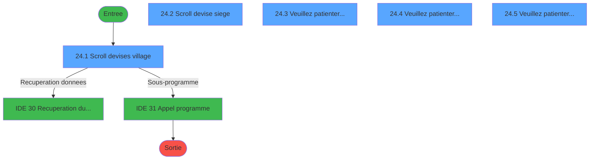
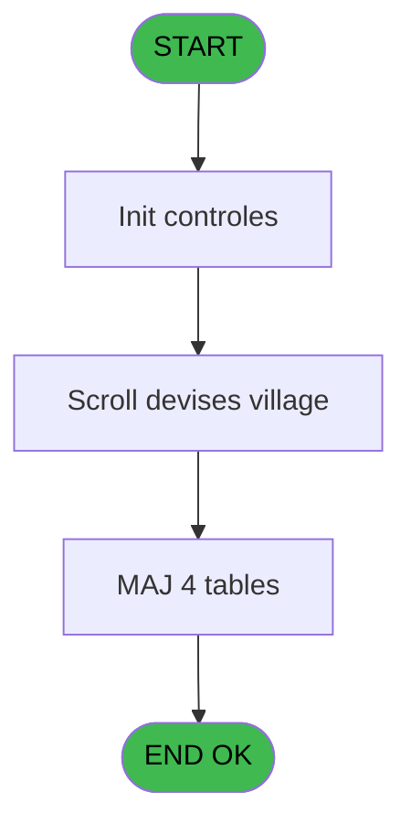
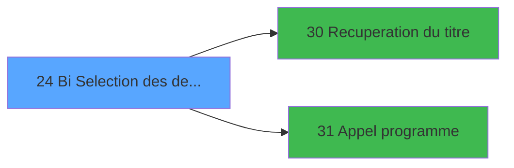

# GES IDE 24 - Bi  Selection des devises

> **Analyse**: Phases 1-4 2026-02-03 11:31 -> 11:32 (14s) | Assemblage 11:32
> **Pipeline**: V7.2 Enrichi
> **Structure**: 4 onglets (Resume | Ecrans | Donnees | Connexions)

<!-- TAB:Resume -->

## 1. FICHE D'IDENTITE

| Attribut | Valeur |
|----------|--------|
| Projet | GES |
| IDE Position | 24 |
| Nom Programme | Bi  Selection des devises |
| Fichier source | `Prg_24.xml` |
| Dossier IDE | Devises |
| Taches | 14 (5 ecrans visibles) |
| Tables modifiees | 4 |
| Programmes appeles | 2 |

## 2. DESCRIPTION FONCTIONNELLE

**Bi  Selection des devises** assure la gestion complete de ce processus, accessible depuis [Bi  Menu Devises (IDE 26)](GES-IDE-26.md).

Le flux de traitement s'organise en **4 blocs fonctionnels** :

- **Traitement** (10 taches) : traitements metier divers
- **Creation** (2 taches) : insertion d'enregistrements en base (mouvements, prestations)
- **Consultation** (1 tache) : ecrans de recherche, selection et consultation
- **Reglement** (1 tache) : gestion des moyens de paiement et reglements

**Donnees modifiees** : 4 tables en ecriture (devises_caisse___ddk, tables___________tab, moyens_reglement_mor, devises__________dev).

Detail : phases du traitement

#### Phase 1 : Traitement (10 taches)

- **24** - AC  Table devise village **[[ECRAN]](#ecran-t1)**
- **24.1** - Scroll devises village **[[ECRAN]](#ecran-t2)**
- **24.1.2** - Neutralisation MOR's
- **24.2** - Scroll devise siege **[[ECRAN]](#ecran-t5)**
- **24.3** - Veuillez patienter... **[[ECRAN]](#ecran-t6)**
- **24.3.1** - ICI
- **24.3.2** - ICI
- **24.3.3** - ICI
- **24.4** - Veuillez patienter... **[[ECRAN]](#ecran-t10)**
- **24.5** - Veuillez patienter... **[[ECRAN]](#ecran-t14)**

Delegue a : [Recuperation du titre (IDE 30)](GES-IDE-30.md), [Appel programme (IDE 31)](GES-IDE-31.md)

#### Phase 2 : Reglement (1 tache)

- **24.1.1** - Desactive MOP **[[ECRAN]](#ecran-t3)**

#### Phase 3 : Creation (2 taches)

- **24.4.1** - Creation MOR
- **24.4.2** - Creation MOR

#### Phase 4 : Consultation (1 tache)

- **24.4.2.1** - Recherche Accepte

Delegue a : [Recuperation du titre (IDE 30)](GES-IDE-30.md)

#### Tables impactees

| Table | Operations | Role metier |
|-------|-----------|-------------|
| devises__________dev | R/**W**/L (6 usages) | Devises / taux de change |
| moyens_reglement_mor | R/**W**/L (4 usages) | Reglements / paiements |
| tables___________tab | R/**W** (3 usages) |  |
| devises_caisse___ddk | **W** (1 usages) | Sessions de caisse |

## 3. BLOCS FONCTIONNELS

### 3.1 Traitement (10 taches)

Traitements internes.

---

#### 24 - AC  Table devise village [[ECRAN]](#ecran-t1)

**Role** : Tache d'orchestration : point d'entree du programme (10 sous-taches). Coordonne l'enchainement des traitements.
**Ecran** : 26 x 18 DLU (MDI) | [Voir mockup](#ecran-t1)

9 sous-taches directes

| Tache | Nom | Bloc |
|-------|-----|------|
| [24.1](#t2) | Scroll devises village **[[ECRAN]](#ecran-t2)** | Traitement |
| [24.1.2](#t4) | Neutralisation MOR's | Traitement |
| [24.2](#t5) | Scroll devise siege **[[ECRAN]](#ecran-t5)** | Traitement |
| [24.3](#t6) | Veuillez patienter... **[[ECRAN]](#ecran-t6)** | Traitement |
| [24.3.1](#t7) | ICI | Traitement |
| [24.3.2](#t8) | ICI | Traitement |
| [24.3.3](#t9) | ICI | Traitement |
| [24.4](#t10) | Veuillez patienter... **[[ECRAN]](#ecran-t10)** | Traitement |
| [24.5](#t14) | Veuillez patienter... **[[ECRAN]](#ecran-t14)** | Traitement |

**Variables liees** : D (W0 cherche-n° devise), F (W0 pas devise select), B (> devise locale)
**Delegue a** : [Recuperation du titre (IDE 30)](GES-IDE-30.md), [Appel programme (IDE 31)](GES-IDE-31.md)

---

#### 24.1 - Scroll devises village [[ECRAN]](#ecran-t2)

**Role** : Traitement : Scroll devises village.
**Ecran** : 960 x 262 DLU (MDI) | [Voir mockup](#ecran-t2)
**Variables liees** : E (W0 fin-scroll-BDEV)
**Delegue a** : [Recuperation du titre (IDE 30)](GES-IDE-30.md), [Appel programme (IDE 31)](GES-IDE-31.md)

---

#### 24.1.2 - Neutralisation MOR's

**Role** : Traitement : Neutralisation MOR's.
**Delegue a** : [Recuperation du titre (IDE 30)](GES-IDE-30.md), [Appel programme (IDE 31)](GES-IDE-31.md)

---

#### 24.2 - Scroll devise siege [[ECRAN]](#ecran-t5)

**Role** : Traitement : Scroll devise siege.
**Ecran** : 347 x 94 DLU (MDI) | [Voir mockup](#ecran-t5)
**Variables liees** : D (W0 cherche-n° devise), E (W0 fin-scroll-BDEV), F (W0 pas devise select), B (> devise locale)
**Delegue a** : [Recuperation du titre (IDE 30)](GES-IDE-30.md), [Appel programme (IDE 31)](GES-IDE-31.md)

---

#### 24.3 - Veuillez patienter... [[ECRAN]](#ecran-t6)

**Role** : Traitement : Veuillez patienter....
**Ecran** : 422 x 56 DLU (MDI) | [Voir mockup](#ecran-t6)
**Delegue a** : [Recuperation du titre (IDE 30)](GES-IDE-30.md), [Appel programme (IDE 31)](GES-IDE-31.md)

---

#### 24.3.1 - ICI

**Role** : Traitement interne.

---

#### 24.3.2 - ICI

**Role** : Traitement interne.

---

#### 24.3.3 - ICI

**Role** : Traitement interne.

---

#### 24.4 - Veuillez patienter... [[ECRAN]](#ecran-t10)

**Role** : Traitement : Veuillez patienter....
**Ecran** : 422 x 57 DLU (MDI) | [Voir mockup](#ecran-t10)
**Delegue a** : [Recuperation du titre (IDE 30)](GES-IDE-30.md), [Appel programme (IDE 31)](GES-IDE-31.md)

---

#### 24.5 - Veuillez patienter... [[ECRAN]](#ecran-t14)

**Role** : Traitement : Veuillez patienter....
**Ecran** : 422 x 56 DLU (MDI) | [Voir mockup](#ecran-t14)
**Delegue a** : [Recuperation du titre (IDE 30)](GES-IDE-30.md), [Appel programme (IDE 31)](GES-IDE-31.md)

### 3.2 Reglement (1 tache)

Gestion des moyens de paiement : 1 tache de reglement.

---

#### 24.1.1 - Desactive MOP [[ECRAN]](#ecran-t3)

**Role** : Traitement : Desactive MOP.
**Ecran** : 171 x 94 DLU (MDI) | [Voir mockup](#ecran-t3)

### 3.3 Creation (2 taches)

Insertion de nouveaux enregistrements en base.

---

#### 24.4.1 - Creation MOR

**Role** : Creation d'enregistrement : Creation MOR.

---

#### 24.4.2 - Creation MOR

**Role** : Creation d'enregistrement : Creation MOR.

### 3.4 Consultation (1 tache)

Ecrans de recherche et consultation.

---

#### 24.4.2.1 - Recherche Accepte

**Role** : Traitement : Recherche Accepte.

## 5. REGLES METIER

*(Aucune regle metier identifiee)*

## 6. CONTEXTE

- **Appele par**: [Bi  Menu Devises (IDE 26)](GES-IDE-26.md)
- **Appelle**: 2 programmes | **Tables**: 6 (W:4 R:5 L:2) | **Taches**: 14 | **Expressions**: 8

<!-- TAB:Ecrans -->

## 8. ECRANS

### 8.1 Forms visibles (5 / 14)

| # | Position | Tache | Nom | Type | Largeur | Hauteur | Bloc |
|---|----------|-------|-----|------|---------|---------|------|
| 1 | 24.1 | 24.1 | Scroll devises village | MDI | 960 | 262 | Traitement |
| 2 | 24.2 | 24.2 | Scroll devise siege | MDI | 347 | 94 | Traitement |
| 3 | 24.3 | 24.3 | Veuillez patienter... | MDI | 422 | 56 | Traitement |
| 4 | 24.4 | 24.4 | Veuillez patienter... | MDI | 422 | 57 | Traitement |
| 5 | 24.5 | 24.5 | Veuillez patienter... | MDI | 422 | 56 | Traitement |

### 8.2 Mockups Ecrans

---

#### 24.1 - Scroll devises village
**Tache** : [24.1](#t2) | **Type** : MDI | **Dimensions** : 960 x 262 DLU
**Bloc** : Traitement | **Titre IDE** : Scroll devises village

<!-- FORM-DATA:
{
    "width":  960,
    "vFactor":  8,
    "type":  "MDI",
    "hFactor":  8,
    "controls":  [
                     {
                         "x":  0,
                         "type":  "label",
                         "var":  "",
                         "y":  1,
                         "w":  959,
                         "fmt":  "",
                         "name":  "",
                         "h":  19,
                         "color":  "",
                         "text":  "",
                         "parent":  null
                     },
                     {
                         "x":  11,
                         "type":  "label",
                         "var":  "",
                         "y":  26,
                         "w":  564,
                         "fmt":  "",
                         "name":  "",
                         "h":  108,
                         "color":  "195",
                         "text":  "Devises acceptées",
                         "parent":  null
                     },
                     {
                         "x":  579,
                         "type":  "label",
                         "var":  "",
                         "y":  26,
                         "w":  367,
                         "fmt":  "",
                         "name":  "",
                         "h":  108,
                         "color":  "195",
                         "text":  "Devises",
                         "parent":  null
                     },
                     {
                         "x":  17,
                         "type":  "table",
                         "var":  "",
                         "name":  "",
                         "titleH":  12,
                         "color":  "110",
                         "w":  546,
                         "y":  37,
                         "fmt":  "",
                         "parent":  null,
                         "text":  "",
                         "rowH":  13,
                         "h":  91,
                         "cols":  [
                                      {
                                          "title":  "Numéro",
                                          "layer":  1,
                                          "w":  116
                                      },
                                      {
                                          "title":  "Code devise",
                                          "layer":  2,
                                          "w":  152
                                      },
                                      {
                                          "title":  "Libellé",
                                          "layer":  3,
                                          "w":  246
                                      }
                                  ],
                         "rows":  3
                     },
                     {
                         "x":  223,
                         "type":  "label",
                         "var":  "",
                         "y":  142,
                         "w":  514,
                         "fmt":  "",
                         "name":  "",
                         "h":  86,
                         "color":  "",
                         "text":  "",
                         "parent":  null
                     },
                     {
                         "x":  401,
                         "type":  "label",
                         "var":  "",
                         "y":  145,
                         "w":  330,
                         "fmt":  "",
                         "name":  "",
                         "h":  78,
                         "color":  "",
                         "text":  "",
                         "parent":  null
                     },
                     {
                         "x":  404,
                         "type":  "label",
                         "var":  "",
                         "y":  146,
                         "w":  324,
                         "fmt":  "",
                         "name":  "",
                         "h":  76,
                         "color":  "",
                         "text":  "",
                         "parent":  null
                     },
                     {
                         "x":  427,
                         "type":  "label",
                         "var":  "",
                         "y":  152,
                         "w":  281,
                         "fmt":  "",
                         "name":  "",
                         "h":  49,
                         "color":  "",
                         "text":  "",
                         "parent":  null
                     },
                     {
                         "x":  428,
                         "type":  "label",
                         "var":  "",
                         "y":  153,
                         "w":  58,
                         "fmt":  "",
                         "name":  "",
                         "h":  47,
                         "color":  "",
                         "text":  "",
                         "parent":  null
                     },
                     {
                         "x":  497,
                         "type":  "label",
                         "var":  "",
                         "y":  158,
                         "w":  96,
                         "fmt":  "",
                         "name":  "",
                         "h":  8,
                         "color":  "7",
                         "text":  "Création",
                         "parent":  null
                     },
                     {
                         "x":  431,
                         "type":  "line",
                         "var":  "",
                         "y":  170,
                         "w":  274,
                         "fmt":  "",
                         "name":  "",
                         "h":  0,
                         "color":  "",
                         "text":  "",
                         "parent":  null
                     },
                     {
                         "x":  497,
                         "type":  "label",
                         "var":  "",
                         "y":  175,
                         "w":  205,
                         "fmt":  "",
                         "name":  "",
                         "h":  8,
                         "color":  "7",
                         "text":  "Désactivation Achat",
                         "parent":  null
                     },
                     {
                         "x":  497,
                         "type":  "label",
                         "var":  "",
                         "y":  187,
                         "w":  205,
                         "fmt":  "",
                         "name":  "",
                         "h":  8,
                         "color":  "7",
                         "text":  "Désactivation Vente",
                         "parent":  null
                     },
                     {
                         "x":  481,
                         "type":  "label",
                         "var":  "",
                         "y":  207,
                         "w":  120,
                         "fmt":  "",
                         "name":  "",
                         "h":  9,
                         "color":  "",
                         "text":  "Votre choix",
                         "parent":  null
                     },
                     {
                         "x":  0,
                         "type":  "label",
                         "var":  "",
                         "y":  238,
                         "w":  959,
                         "fmt":  "",
                         "name":  "",
                         "h":  24,
                         "color":  "",
                         "text":  "",
                         "parent":  null
                     },
                     {
                         "x":  27,
                         "type":  "edit",
                         "var":  "",
                         "y":  52,
                         "w":  30,
                         "fmt":  "##",
                         "name":  "",
                         "h":  8,
                         "color":  "110",
                         "text":  "",
                         "parent":  6
                     },
                     {
                         "x":  158,
                         "type":  "edit",
                         "var":  "",
                         "y":  52,
                         "w":  42,
                         "fmt":  "",
                         "name":  "",
                         "h":  8,
                         "color":  "110",
                         "text":  "",
                         "parent":  6
                     },
                     {
                         "x":  298,
                         "type":  "edit",
                         "var":  "",
                         "y":  52,
                         "w":  232,
                         "fmt":  "",
                         "name":  "",
                         "h":  8,
                         "color":  "110",
                         "text":  "",
                         "parent":  6
                     },
                     {
                         "x":  615,
                         "type":  "edit",
                         "var":  "",
                         "y":  206,
                         "w":  26,
                         "fmt":  "",
                         "name":  "W1 action",
                         "h":  10,
                         "color":  "6",
                         "text":  "",
                         "parent":  null
                     },
                     {
                         "x":  10,
                         "type":  "edit",
                         "var":  "",
                         "y":  6,
                         "w":  267,
                         "fmt":  "20",
                         "name":  "",
                         "h":  8,
                         "color":  "",
                         "text":  "",
                         "parent":  1
                     },
                     {
                         "x":  686,
                         "type":  "edit",
                         "var":  "",
                         "y":  6,
                         "w":  267,
                         "fmt":  "WWW DD MMM YYYYT",
                         "name":  "",
                         "h":  8,
                         "color":  "",
                         "text":  "",
                         "parent":  null
                     },
                     {
                         "x":  69,
                         "type":  "edit",
                         "var":  "",
                         "y":  52,
                         "w":  64,
                         "fmt":  "5",
                         "name":  "",
                         "h":  8,
                         "color":  "110",
                         "text":  "",
                         "parent":  6
                     },
                     {
                         "x":  443,
                         "type":  "button",
                         "var":  "",
                         "y":  157,
                         "w":  27,
                         "fmt":  "C",
                         "name":  "C",
                         "h":  9,
                         "color":  "",
                         "text":  "",
                         "parent":  null
                     },
                     {
                         "x":  236,
                         "type":  "image",
                         "var":  "",
                         "y":  161,
                         "w":  153,
                         "fmt":  "",
                         "name":  "",
                         "h":  46,
                         "color":  "",
                         "text":  "",
                         "parent":  null
                     },
                     {
                         "x":  443,
                         "type":  "button",
                         "var":  "",
                         "y":  174,
                         "w":  27,
                         "fmt":  "A",
                         "name":  "A",
                         "h":  9,
                         "color":  "",
                         "text":  "",
                         "parent":  null
                     },
                     {
                         "x":  443,
                         "type":  "button",
                         "var":  "",
                         "y":  186,
                         "w":  27,
                         "fmt":  "V",
                         "name":  "V",
                         "h":  9,
                         "color":  "",
                         "text":  "",
                         "parent":  null
                     },
                     {
                         "x":  6,
                         "type":  "button",
                         "var":  "",
                         "y":  241,
                         "w":  154,
                         "fmt":  "\u0026Quitter",
                         "name":  "",
                         "h":  18,
                         "color":  "",
                         "text":  "",
                         "parent":  29
                     }
                 ],
    "taskId":  "24.1",
    "height":  262
}
-->

<strong>Champs : 7 champs</strong>

| Pos (x,y) | Nom | Variable | Type |
|-----------|-----|----------|------|
| 27,52 | ## | - | edit |
| 158,52 | (sans nom) | - | edit |
| 298,52 | (sans nom) | - | edit |
| 615,206 | W1 action | - | edit |
| 10,6 | 20 | - | edit |
| 686,6 | WWW DD MMM YYYYT | - | edit |
| 69,52 | 5 | - | edit |

<strong>Boutons : 4 boutons</strong>

| Bouton | Pos (x,y) | Action |
|--------|-----------|--------|
| C | 443,157 | Bouton fonctionnel |
| A | 443,174 | Bouton fonctionnel |
| V | 443,186 | Bouton fonctionnel |
| Quitter | 6,241 | Quitte le programme |

---

#### 24.2 - Scroll devise siege
**Tache** : [24.2](#t5) | **Type** : MDI | **Dimensions** : 347 x 94 DLU
**Bloc** : Traitement | **Titre IDE** : Scroll devise siege

<!-- FORM-DATA:
{
    "width":  347,
    "vFactor":  8,
    "type":  "MDI",
    "hFactor":  8,
    "controls":  [
                     {
                         "x":  0,
                         "type":  "table",
                         "var":  "",
                         "name":  "",
                         "titleH":  12,
                         "color":  "110",
                         "w":  347,
                         "y":  4,
                         "fmt":  "",
                         "parent":  null,
                         "text":  "",
                         "rowH":  12,
                         "h":  88,
                         "cols":  [
                                      {
                                          "title":  "Code",
                                          "layer":  1,
                                          "w":  62
                                      },
                                      {
                                          "title":  "TAB Code",
                                          "layer":  2,
                                          "w":  91
                                      },
                                      {
                                          "title":  "Libellé",
                                          "layer":  3,
                                          "w":  157
                                      }
                                  ],
                         "rows":  3
                     },
                     {
                         "x":  11,
                         "type":  "edit",
                         "var":  "",
                         "y":  19,
                         "w":  42,
                         "fmt":  "###Z",
                         "name":  "TAB code numeric6",
                         "h":  9,
                         "color":  "110",
                         "text":  "",
                         "parent":  1
                     },
                     {
                         "x":  75,
                         "type":  "edit",
                         "var":  "",
                         "y":  19,
                         "w":  42,
                         "fmt":  "3",
                         "name":  "",
                         "h":  9,
                         "color":  "110",
                         "text":  "",
                         "parent":  1
                     },
                     {
                         "x":  158,
                         "type":  "edit",
                         "var":  "",
                         "y":  19,
                         "w":  142,
                         "fmt":  "12",
                         "name":  "",
                         "h":  9,
                         "color":  "110",
                         "text":  "",
                         "parent":  1
                     }
                 ],
    "taskId":  "24.2",
    "height":  94
}
-->

<strong>Champs : 3 champs</strong>

| Pos (x,y) | Nom | Variable | Type |
|-----------|-----|----------|------|
| 11,19 | TAB code numeric6 | - | edit |
| 75,19 | 3 | - | edit |
| 158,19 | 12 | - | edit |

---

#### 24.3 - Veuillez patienter...
**Tache** : [24.3](#t6) | **Type** : MDI | **Dimensions** : 422 x 56 DLU
**Bloc** : Traitement | **Titre IDE** : Veuillez patienter...

<!-- FORM-DATA:
{
    "width":  422,
    "vFactor":  8,
    "type":  "MDI",
    "hFactor":  8,
    "controls":  [
                     {
                         "x":  0,
                         "type":  "label",
                         "var":  "",
                         "y":  0,
                         "w":  423,
                         "fmt":  "",
                         "name":  "",
                         "h":  29,
                         "color":  "",
                         "text":  "",
                         "parent":  null
                     },
                     {
                         "x":  120,
                         "type":  "label",
                         "var":  "",
                         "y":  10,
                         "w":  232,
                         "fmt":  "",
                         "name":  "",
                         "h":  8,
                         "color":  "7",
                         "text":  "Traitement en cours ...",
                         "parent":  null
                     },
                     {
                         "x":  0,
                         "type":  "label",
                         "var":  "",
                         "y":  29,
                         "w":  423,
                         "fmt":  "",
                         "name":  "",
                         "h":  27,
                         "color":  "",
                         "text":  "",
                         "parent":  null
                     },
                     {
                         "x":  72,
                         "type":  "label",
                         "var":  "",
                         "y":  38,
                         "w":  280,
                         "fmt":  "",
                         "name":  "",
                         "h":  8,
                         "color":  "",
                         "text":  "Creation devises village",
                         "parent":  null
                     },
                     {
                         "x":  4,
                         "type":  "image",
                         "var":  "",
                         "y":  2,
                         "w":  72,
                         "fmt":  "",
                         "name":  "",
                         "h":  25,
                         "color":  "",
                         "text":  "",
                         "parent":  null
                     }
                 ],
    "taskId":  "24.3",
    "height":  56
}
-->

---

#### 24.4 - Veuillez patienter...
**Tache** : [24.4](#t10) | **Type** : MDI | **Dimensions** : 422 x 57 DLU
**Bloc** : Traitement | **Titre IDE** : Veuillez patienter...

<!-- FORM-DATA:
{
    "width":  422,
    "vFactor":  8,
    "type":  "MDI",
    "hFactor":  8,
    "controls":  [
                     {
                         "x":  0,
                         "type":  "label",
                         "var":  "",
                         "y":  0,
                         "w":  423,
                         "fmt":  "",
                         "name":  "",
                         "h":  29,
                         "color":  "",
                         "text":  "",
                         "parent":  null
                     },
                     {
                         "x":  120,
                         "type":  "label",
                         "var":  "",
                         "y":  10,
                         "w":  234,
                         "fmt":  "",
                         "name":  "",
                         "h":  8,
                         "color":  "7",
                         "text":  "Traitement en cours ...",
                         "parent":  null
                     },
                     {
                         "x":  0,
                         "type":  "label",
                         "var":  "",
                         "y":  29,
                         "w":  423,
                         "fmt":  "",
                         "name":  "",
                         "h":  27,
                         "color":  "",
                         "text":  "",
                         "parent":  null
                     },
                     {
                         "x":  72,
                         "type":  "label",
                         "var":  "",
                         "y":  38,
                         "w":  280,
                         "fmt":  "",
                         "name":  "",
                         "h":  8,
                         "color":  "",
                         "text":  "Creation moyen de règlement",
                         "parent":  null
                     },
                     {
                         "x":  4,
                         "type":  "image",
                         "var":  "",
                         "y":  2,
                         "w":  72,
                         "fmt":  "",
                         "name":  "",
                         "h":  25,
                         "color":  "",
                         "text":  "",
                         "parent":  null
                     }
                 ],
    "taskId":  "24.4",
    "height":  57
}
-->

---

#### 24.5 - Veuillez patienter...
**Tache** : [24.5](#t14) | **Type** : MDI | **Dimensions** : 422 x 56 DLU
**Bloc** : Traitement | **Titre IDE** : Veuillez patienter...

<!-- FORM-DATA:
{
    "width":  422,
    "vFactor":  8,
    "type":  "MDI",
    "hFactor":  8,
    "controls":  [
                     {
                         "x":  0,
                         "type":  "label",
                         "var":  "",
                         "y":  0,
                         "w":  423,
                         "fmt":  "",
                         "name":  "",
                         "h":  29,
                         "color":  "",
                         "text":  "",
                         "parent":  null
                     },
                     {
                         "x":  120,
                         "type":  "label",
                         "var":  "",
                         "y":  10,
                         "w":  239,
                         "fmt":  "",
                         "name":  "",
                         "h":  8,
                         "color":  "7",
                         "text":  "Traitement en cours ...",
                         "parent":  null
                     },
                     {
                         "x":  0,
                         "type":  "label",
                         "var":  "",
                         "y":  29,
                         "w":  423,
                         "fmt":  "",
                         "name":  "",
                         "h":  27,
                         "color":  "",
                         "text":  "",
                         "parent":  null
                     },
                     {
                         "x":  72,
                         "type":  "label",
                         "var":  "",
                         "y":  38,
                         "w":  280,
                         "fmt":  "",
                         "name":  "",
                         "h":  8,
                         "color":  "",
                         "text":  "Effacement numeros BDEV",
                         "parent":  null
                     },
                     {
                         "x":  4,
                         "type":  "image",
                         "var":  "",
                         "y":  2,
                         "w":  72,
                         "fmt":  "",
                         "name":  "",
                         "h":  25,
                         "color":  "",
                         "text":  "",
                         "parent":  null
                     }
                 ],
    "taskId":  "24.5",
    "height":  56
}
-->

## 9. NAVIGATION

### 9.1 Enchainement des ecrans

**Detail par enchainement :**

| Depuis | Action | Vers | Retour |
|--------|--------|------|--------|
| Scroll devises village | Recuperation donnees | [Recuperation du titre (IDE 30)](GES-IDE-30.md) | Retour ecran |
| Scroll devises village | Sous-programme | [Appel programme (IDE 31)](GES-IDE-31.md) | Retour ecran |

### 9.3 Structure hierarchique (14 taches)

| Position | Tache | Type | Dimensions | Bloc |
|----------|-------|------|------------|------|
| **24.1** | [**AC  Table devise village** (24)](#t1) [mockup](#ecran-t1) | MDI | 26x18 | Traitement |
| 24.1.1 | [Scroll devises village (24.1)](#t2) [mockup](#ecran-t2) | MDI | 960x262 | |
| 24.1.2 | [Neutralisation MOR's (24.1.2)](#t4) | MDI | - | |
| 24.1.3 | [Scroll devise siege (24.2)](#t5) [mockup](#ecran-t5) | MDI | 347x94 | |
| 24.1.4 | [Veuillez patienter... (24.3)](#t6) [mockup](#ecran-t6) | MDI | 422x56 | |
| 24.1.5 | [ICI (24.3.1)](#t7) | MDI | - | |
| 24.1.6 | [ICI (24.3.2)](#t8) | MDI | - | |
| 24.1.7 | [ICI (24.3.3)](#t9) | MDI | - | |
| 24.1.8 | [Veuillez patienter... (24.4)](#t10) [mockup](#ecran-t10) | MDI | 422x57 | |
| 24.1.9 | [Veuillez patienter... (24.5)](#t14) [mockup](#ecran-t14) | MDI | 422x56 | |
| **24.2** | [**Desactive MOP** (24.1.1)](#t3) [mockup](#ecran-t3) | MDI | 171x94 | Reglement |
| **24.3** | [**Creation MOR** (24.4.1)](#t11) | MDI | - | Creation |
| 24.3.1 | [Creation MOR (24.4.2)](#t12) | MDI | - | |
| **24.4** | [**Recherche Accepte** (24.4.2.1)](#t13) | MDI | - | Consultation |

### 9.4 Algorigramme

> **Legende**: Vert = START/END OK | Rouge = END KO | Bleu = Decisions
> *Algorigramme auto-genere. Utiliser `/algorigramme` pour une synthese metier detaillee.*

<!-- TAB:Donnees -->

## 10. TABLES

### Tables utilisees (6)

| ID | Nom | Description | Type | R | W | L | Usages |
|----|-----|-------------|------|---|---|---|--------|
| 57 | devises_caisse___ddk | Sessions de caisse | DB |   | **W** |   | 1 |
| 67 | tables___________tab |  | DB | R | **W** |   | 3 |
| 124 | type_taux_change | Devises / taux de change | DB | R |   |   | 1 |
| 139 | moyens_reglement_mor | Reglements / paiements | DB | R | **W** | L | 4 |
| 140 | moyen_paiement___mop |  | DB | R |   |   | 2 |
| 141 | devises__________dev | Devises / taux de change | DB | R | **W** | L | 6 |

### Colonnes par table (2 / 6 tables avec colonnes identifiees)

Table 57 - devises_caisse___ddk (**W**) - 1 usages

*Table utilisee uniquement en Link ou aucune colonne Real identifiee dans le DataView.*

Table 67 - tables___________tab (R/**W**) - 3 usages

| Lettre | Variable | Acces | Type |
|--------|----------|-------|------|
| A | W1 ret. lien devise 1 | W | Numeric |
| B | W1 ret. lien devise 2 | W | Numeric |

Table 124 - type_taux_change (R) - 1 usages

*Table utilisee uniquement en Link ou aucune colonne Real identifiee dans le DataView.*

Table 139 - moyens_reglement_mor (R/**W**/L) - 4 usages

*Table utilisee uniquement en Link ou aucune colonne Real identifiee dans le DataView.*

Table 140 - moyen_paiement___mop (R) - 2 usages

*Table utilisee uniquement en Link ou aucune colonne Real identifiee dans le DataView.*

Table 141 - devises__________dev (R/**W**/L) - 6 usages

| Lettre | Variable | Acces | Type |
|--------|----------|-------|------|
| A | W1 action | W | Alpha |
| B | W1 fin-tâche | W | Alpha |
| C | v. titre | W | Alpha |

## 11. VARIABLES

### 11.1 Variables de travail (3)

Variables internes au programme.

| Lettre | Nom | Type | Usage dans |
|--------|-----|------|-----------|
| D | W0 cherche-n° devise | Numeric | [24](#t1), [24.1](#t2), [24.2](#t5) |
| E | W0 fin-scroll-BDEV | Alpha | - |
| F | W0 pas devise select | Logical | - |

### 11.2 Autres (3)

Variables diverses.

| Lettre | Nom | Type | Usage dans |
|--------|-----|------|-----------|
| A | > societe | Alpha | 1x refs |
| B | > devise locale | Alpha | [24](#t1), [24.1](#t2), [24.2](#t5) |
| C | V0 choix action | Alpha | - |

## 12. EXPRESSIONS

**8 / 8 expressions decodees (100%)**

### 12.1 Repartition par type

| Type | Expressions | Regles |
|------|-------------|--------|
| CONSTANTE | 3 | 0 |
| CONDITION | 5 | 0 |

### 12.2 Expressions cles par type

#### CONSTANTE (3 expressions)

| Type | IDE | Expression | Regle |
|------|-----|------------|-------|
| CONSTANTE | 8 | `'F'` | - |
| CONSTANTE | 4 | `'C'` | - |
| CONSTANTE | 3 | `'FRF'` | - |

#### CONDITION (5 expressions)

| Type | IDE | Expression | Regle |
|------|-----|------------|-------|
| CONDITION | 6 | `W0 cherche-n° devise [D]='O'` | - |
| CONDITION | 7 | `W0 cherche-n° devise [D]='F'` | - |
| CONDITION | 5 | `W0 cherche-n° devise [D]='C'` | - |
| CONDITION | 1 | `> devise locale [B]=''` | - |
| CONDITION | 2 | `> societe [A]=''` | - |

<!-- TAB:Connexions -->

## 13. GRAPHE D'APPELS

### 13.1 Chaine depuis Main (Callers)

Main -> ... -> [Bi  Menu Devises (IDE 26)](GES-IDE-26.md) -> **Bi  Selection des devises (IDE 24)**

### 13.2 Callers

| IDE | Nom Programme | Nb Appels |
|-----|---------------|-----------|
| [26](GES-IDE-26.md) | Bi  Menu Devises | 1 |

### 13.3 Callees (programmes appeles)

### 13.4 Detail Callees avec contexte

| IDE | Nom Programme | Appels | Contexte |
|-----|---------------|--------|----------|
| [30](GES-IDE-30.md) | Recuperation du titre | 1 | Recuperation donnees |
| [31](GES-IDE-31.md) | Appel programme | 1 | Sous-programme |

## 14. RECOMMANDATIONS MIGRATION

### 14.1 Profil du programme

| Metrique | Valeur | Impact migration |
|----------|--------|-----------------|
| Lignes de logique | 252 | Taille moyenne |
| Expressions | 8 | Peu de logique |
| Tables WRITE | 4 | Impact modere |
| Sous-programmes | 2 | Peu de dependances |
| Ecrans visibles | 5 | Quelques ecrans |
| Code desactive | 0.8% (2 / 252) | Code sain |
| Regles metier | 0 | Pas de regle identifiee |

### 14.2 Plan de migration par bloc

#### Traitement (10 taches: 6 ecrans, 4 traitements)

- **Strategie** : Orchestrateur avec 6 ecrans (Razor/React) et 4 traitements backend (services).
- Les ecrans deviennent des composants UI, les traitements invisibles deviennent des services injectables.
- 2 sous-programme(s) a migrer ou a reutiliser depuis les services existants.
- Decomposer les taches en services unitaires testables.

#### Reglement (1 tache: 1 ecran, 0 traitement)

- **Strategie** : Service `IReglementService` avec pattern Strategy par mode de paiement.
- Integration TPE si applicable

#### Creation (2 taches: 0 ecran, 2 traitements)

- **Strategie** : Repository pattern avec Entity Framework Core.
- Insertion via `IRepository<T>.CreateAsync()`

#### Consultation (1 tache: 0 ecran, 1 traitement)

- **Strategie** : Composants de recherche/selection en modales.

### 14.3 Dependances critiques

| Dependance | Type | Appels | Impact |
|------------|------|--------|--------|
| devises_caisse___ddk | Table WRITE (Database) | 1x | Schema + repository |
| tables___________tab | Table WRITE (Database) | 2x | Schema + repository |
| moyens_reglement_mor | Table WRITE (Database) | 1x | Schema + repository |
| devises__________dev | Table WRITE (Database) | 3x | Schema + repository |
| [Appel programme (IDE 31)](GES-IDE-31.md) | Sous-programme | 1x | Normale - Sous-programme |
| [Recuperation du titre (IDE 30)](GES-IDE-30.md) | Sous-programme | 1x | Normale - Recuperation donnees |

---
*Spec DETAILED generee par Pipeline V7.2 - 2026-02-03 11:32*
