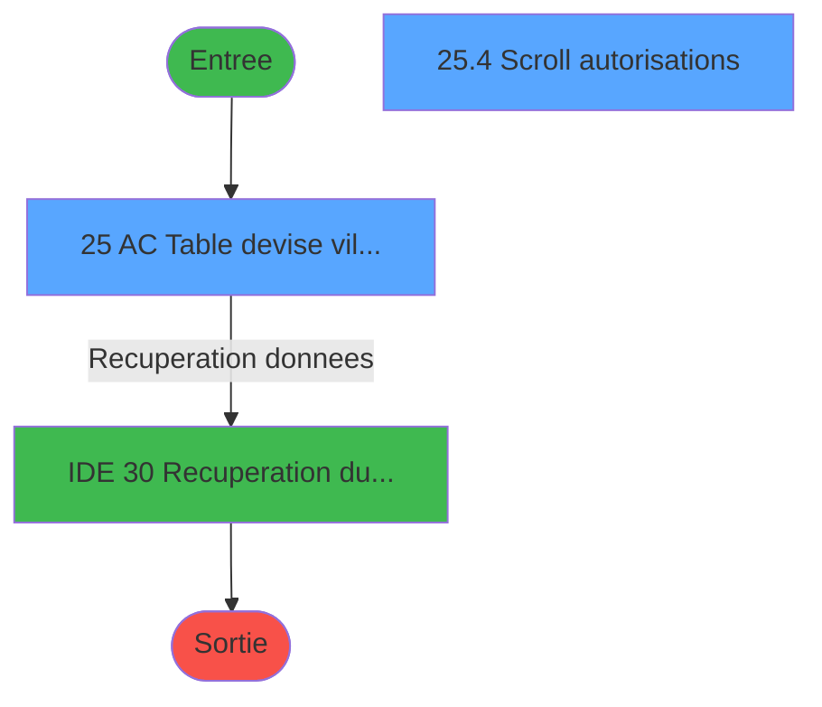
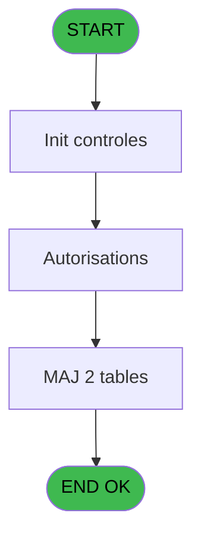
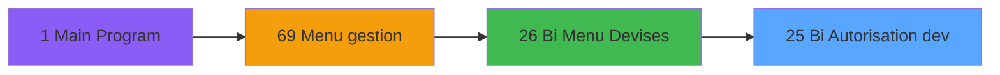
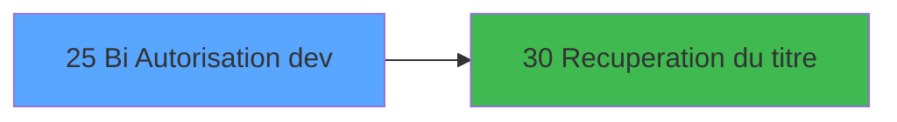

# GES IDE 25 - Bi Autorisation dev

> **Analyse**: Phases 1-4 2026-02-03 11:32 -> 11:32 (14s) | Assemblage 11:32
> **Pipeline**: V7.2 Enrichi
> **Structure**: 4 onglets (Resume | Ecrans | Donnees | Connexions)

<!-- TAB:Resume -->

## 1. FICHE D'IDENTITE

| Attribut | Valeur |
|----------|--------|
| Projet | GES |
| IDE Position | 25 |
| Nom Programme | Bi Autorisation dev |
| Fichier source | `Prg_25.xml` |
| Dossier IDE | Devises |
| Taches | 10 (2 ecrans visibles) |
| Tables modifiees | 2 |
| Programmes appeles | 1 |

## 2. DESCRIPTION FONCTIONNELLE

**Bi Autorisation dev** assure la gestion complete de ce processus, accessible depuis [Bi  Menu Devises (IDE 26)](GES-IDE-26.md).

Le flux de traitement s'organise en **3 blocs fonctionnels** :

- **Traitement** (5 taches) : traitements metier divers
- **Saisie** (4 taches) : ecrans de saisie utilisateur (formulaires, champs, donnees)
- **Creation** (1 tache) : insertion d'enregistrements en base (mouvements, prestations)

**Donnees modifiees** : 2 tables en ecriture (saisie_autorisations, moyens_reglement_mor).

**Logique metier** : 1 regles identifiees couvrant conditions metier.

Detail : phases du traitement

#### Phase 1 : Traitement (5 taches)

- **25** - AC  Table devise village **[[ECRAN]](#ecran-t1)**
- **25.3** - load autorisations
- **25.4** - Scroll autorisations **[[ECRAN]](#ecran-t7)**
- **25.4.1.1** - update 117
- **25.5.1** - update 117

Delegue a : [Recuperation du titre (IDE 30)](GES-IDE-30.md)

#### Phase 2 : Saisie (4 taches)

- **25.1** - raz saisie
- **25.2** - init saisie
- **25.4.1** - Lect saisie pour maj
- **25.5** - Lect saisie pour maj

#### Phase 3 : Creation (1 tache)

- **25.2.1** - creation

#### Tables impactees

| Table | Operations | Role metier |
|-------|-----------|-------------|
| saisie_autorisations | R/**W**/L (6 usages) |  |
| moyens_reglement_mor | R/**W** (4 usages) | Reglements / paiements |

## 3. BLOCS FONCTIONNELS

### 3.1 Traitement (5 taches)

Traitements internes.

---

#### 25 - AC  Table devise village [[ECRAN]](#ecran-t1)

**Role** : Traitement : AC  Table devise village.
**Ecran** : 1013 x 199 DLU (MDI) | [Voir mockup](#ecran-t1)

4 sous-taches directes

| Tache | Nom | Bloc |
|-------|-----|------|
| [25.3](#t5) | load autorisations | Traitement |
| [25.4](#t7) | Scroll autorisations **[[ECRAN]](#ecran-t7)** | Traitement |
| [25.4.1.1](#t9) | update 117 | Traitement |
| [25.5.1](#t11) | update 117 | Traitement |

**Variables liees** : B (> devise locale)
**Delegue a** : [Recuperation du titre (IDE 30)](GES-IDE-30.md)

---

#### 25.3 - load autorisations

**Role** : Traitement : load autorisations.
**Delegue a** : [Recuperation du titre (IDE 30)](GES-IDE-30.md)

---

#### 25.4 - Scroll autorisations [[ECRAN]](#ecran-t7)

**Role** : Traitement : Scroll autorisations.
**Ecran** : 400 x 128 DLU (Modal) | [Voir mockup](#ecran-t7)
**Delegue a** : [Recuperation du titre (IDE 30)](GES-IDE-30.md)

---

#### 25.4.1.1 - update 117

**Role** : Traitement : update 117.
**Delegue a** : [Recuperation du titre (IDE 30)](GES-IDE-30.md)

---

#### 25.5.1 - update 117

**Role** : Traitement : update 117.
**Delegue a** : [Recuperation du titre (IDE 30)](GES-IDE-30.md)

### 3.2 Saisie (4 taches)

Ce bloc traite la saisie des donnees de la transaction.

---

#### 25.1 - raz saisie

**Role** : Saisie des donnees : raz saisie.

---

#### 25.2 - init saisie

**Role** : Saisie des donnees : init saisie.

---

#### 25.4.1 - Lect saisie pour maj

**Role** : Saisie des donnees : Lect saisie pour maj.

---

#### 25.5 - Lect saisie pour maj

**Role** : Saisie des donnees : Lect saisie pour maj.

### 3.3 Creation (1 tache)

Insertion de nouveaux enregistrements en base.

---

#### 25.2.1 - creation

**Role** : Creation d'enregistrement : creation.

## 5. REGLES METIER

1 regles identifiees:

### Autres (1 regles)

#### [RM-001] Si [H]='O' alors IF ([I]='O' sinon 104,108),IF ([I]='O',107,141))

| Element | Detail |
|---------|--------|
| **Condition** | `[H]='O'` |
| **Si vrai** | IF ([I]='O' |
| **Si faux** | 104,108),IF ([I]='O',107,141)) |
| **Expression source** | Expression 11 : `IF ([H]='O',IF ([I]='O',104,108),IF ([I]='O',107,141))` |
| **Exemple** | Si [H]='O' → IF ([I]='O'. Sinon → 104,108),IF ([I]='O',107,141)) |

## 6. CONTEXTE

- **Appele par**: [Bi  Menu Devises (IDE 26)](GES-IDE-26.md)
- **Appelle**: 1 programmes | **Tables**: 3 (W:2 R:3 L:1) | **Taches**: 10 | **Expressions**: 13

<!-- TAB:Ecrans -->

## 8. ECRANS

### 8.1 Forms visibles (2 / 10)

| # | Position | Tache | Nom | Type | Largeur | Hauteur | Bloc |
|---|----------|-------|-----|------|---------|---------|------|
| 1 | 25 | 25 | AC  Table devise village | MDI | 1013 | 199 | Traitement |
| 2 | 25.4 | 25.4 | Scroll autorisations | Modal | 400 | 128 | Traitement |

### 8.2 Mockups Ecrans

---

#### 25 - AC  Table devise village
**Tache** : [25](#t1) | **Type** : MDI | **Dimensions** : 1013 x 199 DLU
**Bloc** : Traitement | **Titre IDE** : AC  Table devise village

<!-- FORM-DATA:
{
    "width":  1013,
    "vFactor":  8,
    "type":  "MDI",
    "hFactor":  8,
    "controls":  [
                     {
                         "x":  0,
                         "type":  "label",
                         "var":  "",
                         "y":  1,
                         "w":  1010,
                         "fmt":  "",
                         "name":  "",
                         "h":  19,
                         "color":  "",
                         "text":  "",
                         "parent":  null
                     },
                     {
                         "x":  18,
                         "type":  "label",
                         "var":  "",
                         "y":  25,
                         "w":  519,
                         "fmt":  "",
                         "name":  "",
                         "h":  143,
                         "color":  "151",
                         "text":  "Devises acceptees",
                         "parent":  null
                     },
                     {
                         "x":  565,
                         "type":  "label",
                         "var":  "",
                         "y":  25,
                         "w":  426,
                         "fmt":  "",
                         "name":  "",
                         "h":  143,
                         "color":  "151",
                         "text":  "Autorisations",
                         "parent":  null
                     },
                     {
                         "x":  52,
                         "type":  "table",
                         "var":  "",
                         "name":  "",
                         "titleH":  12,
                         "color":  "110",
                         "w":  471,
                         "y":  51,
                         "fmt":  "",
                         "parent":  null,
                         "text":  "",
                         "rowH":  12,
                         "h":  99,
                         "cols":  [
                                      {
                                          "title":  "Code devise",
                                          "layer":  1,
                                          "w":  110
                                      },
                                      {
                                          "title":  "Libellé",
                                          "layer":  2,
                                          "w":  328
                                      }
                                  ],
                         "rows":  2
                     },
                     {
                         "x":  0,
                         "type":  "label",
                         "var":  "",
                         "y":  174,
                         "w":  1010,
                         "fmt":  "",
                         "name":  "",
                         "h":  24,
                         "color":  "",
                         "text":  "",
                         "parent":  null
                     },
                     {
                         "x":  58,
                         "type":  "edit",
                         "var":  "",
                         "y":  65,
                         "w":  97,
                         "fmt":  "",
                         "name":  "DEV code devise",
                         "h":  10,
                         "color":  "110",
                         "text":  "",
                         "parent":  6
                     },
                     {
                         "x":  168,
                         "type":  "edit",
                         "var":  "",
                         "y":  65,
                         "w":  258,
                         "fmt":  "",
                         "name":  "",
                         "h":  10,
                         "color":  "110",
                         "text":  "",
                         "parent":  6
                     },
                     {
                         "x":  443,
                         "type":  "button",
                         "var":  "",
                         "y":  65,
                         "w":  39,
                         "fmt":  "\u003e\u003e\u003e",
                         "name":  "Bouton zoom",
                         "h":  10,
                         "color":  "",
                         "text":  "",
                         "parent":  6
                     },
                     {
                         "x":  8,
                         "type":  "edit",
                         "var":  "",
                         "y":  7,
                         "w":  267,
                         "fmt":  "20",
                         "name":  "",
                         "h":  8,
                         "color":  "",
                         "text":  "",
                         "parent":  1
                     },
                     {
                         "x":  730,
                         "type":  "edit",
                         "var":  "",
                         "y":  7,
                         "w":  267,
                         "fmt":  "WWW DD MMM YYYYT",
                         "name":  "",
                         "h":  8,
                         "color":  "",
                         "text":  "",
                         "parent":  null
                     },
                     {
                         "x":  8,
                         "type":  "button",
                         "var":  "",
                         "y":  177,
                         "w":  154,
                         "fmt":  "\u0026Quitter",
                         "name":  "",
                         "h":  18,
                         "color":  "",
                         "text":  "",
                         "parent":  11
                     }
                 ],
    "taskId":  "25",
    "height":  199
}
-->

<strong>Champs : 4 champs</strong>

| Pos (x,y) | Nom | Variable | Type |
|-----------|-----|----------|------|
| 58,65 | DEV code devise | - | edit |
| 168,65 | (sans nom) | - | edit |
| 8,7 | 20 | - | edit |
| 730,7 | WWW DD MMM YYYYT | - | edit |

<strong>Boutons : 2 boutons</strong>

| Bouton | Pos (x,y) | Action |
|--------|-----------|--------|
| >>> | 443,65 | Bouton fonctionnel |
| Quitter | 8,177 | Quitte le programme |

---

#### 25.4 - Scroll autorisations
**Tache** : [25.4](#t7) | **Type** : Modal | **Dimensions** : 400 x 128 DLU
**Bloc** : Traitement | **Titre IDE** : Scroll autorisations

<!-- FORM-DATA:
{
    "width":  400,
    "vFactor":  8,
    "type":  "Modal",
    "hFactor":  8,
    "controls":  [
                     {
                         "x":  25,
                         "type":  "table",
                         "var":  "",
                         "name":  "",
                         "titleH":  12,
                         "color":  "110",
                         "w":  375,
                         "y":  13,
                         "fmt":  "",
                         "parent":  null,
                         "text":  "",
                         "rowH":  12,
                         "h":  99,
                         "cols":  [
                                      {
                                          "title":  "MOP",
                                          "layer":  1,
                                          "w":  114
                                      },
                                      {
                                          "title":  "Achat",
                                          "layer":  2,
                                          "w":  106
                                      },
                                      {
                                          "title":  "Vente",
                                          "layer":  3,
                                          "w":  119
                                      }
                                  ],
                         "rows":  3
                     },
                     {
                         "x":  32,
                         "type":  "edit",
                         "var":  "",
                         "y":  27,
                         "w":  92,
                         "fmt":  "",
                         "name":  "",
                         "h":  10,
                         "color":  "110",
                         "text":  "",
                         "parent":  2
                     },
                     {
                         "x":  178,
                         "type":  "checkbox",
                         "var":  "",
                         "y":  27,
                         "w":  30,
                         "fmt":  "",
                         "name":  "",
                         "h":  10,
                         "color":  "110",
                         "text":  "",
                         "parent":  2
                     },
                     {
                         "x":  291,
                         "type":  "checkbox",
                         "var":  "",
                         "y":  27,
                         "w":  30,
                         "fmt":  "",
                         "name":  "",
                         "h":  10,
                         "color":  "110",
                         "text":  "",
                         "parent":  2
                     },
                     {
                         "x":  27,
                         "type":  "edit",
                         "var":  "",
                         "y":  2,
                         "w":  369,
                         "fmt":  "30",
                         "name":  "",
                         "h":  10,
                         "color":  "158",
                         "text":  "",
                         "parent":  null
                     }
                 ],
    "taskId":  "25.4",
    "height":  128
}
-->

<strong>Champs : 4 champs</strong>

| Pos (x,y) | Nom | Variable | Type |
|-----------|-----|----------|------|
| 32,27 | (sans nom) | - | edit |
| 178,27 | (sans nom) | - | checkbox |
| 291,27 | (sans nom) | - | checkbox |
| 27,2 | 30 | - | edit |

## 9. NAVIGATION

### 9.1 Enchainement des ecrans

**Detail par enchainement :**

| Depuis | Action | Vers | Retour |
|--------|--------|------|--------|
| AC  Table devise village | Recuperation donnees | [Recuperation du titre (IDE 30)](GES-IDE-30.md) | Retour ecran |

### 9.3 Structure hierarchique (10 taches)

| Position | Tache | Type | Dimensions | Bloc |
|----------|-------|------|------------|------|
| **25.1** | [**AC  Table devise village** (25)](#t1) [mockup](#ecran-t1) | MDI | 1013x199 | Traitement |
| 25.1.1 | [load autorisations (25.3)](#t5) | MDI | - | |
| 25.1.2 | [Scroll autorisations (25.4)](#t7) [mockup](#ecran-t7) | Modal | 400x128 | |
| 25.1.3 | [update 117 (25.4.1.1)](#t9) | MDI | - | |
| 25.1.4 | [update 117 (25.5.1)](#t11) | MDI | - | |
| **25.2** | [**raz saisie** (25.1)](#t2) | MDI | - | Saisie |
| 25.2.1 | [init saisie (25.2)](#t3) | MDI | - | |
| 25.2.2 | [Lect saisie pour maj (25.4.1)](#t8) | MDI | - | |
| 25.2.3 | [Lect saisie pour maj (25.5)](#t10) | MDI | - | |
| **25.3** | [**creation** (25.2.1)](#t4) | MDI | - | Creation |

### 9.4 Algorigramme

> **Legende**: Vert = START/END OK | Rouge = END KO | Bleu = Decisions
> *Algorigramme auto-genere. Utiliser `/algorigramme` pour une synthese metier detaillee.*

<!-- TAB:Donnees -->

## 10. TABLES

### Tables utilisees (3)

| ID | Nom | Description | Type | R | W | L | Usages |
|----|-----|-------------|------|---|---|---|--------|
| 6 | saisie_autorisations |  | TMP | R | **W** | L | 6 |
| 139 | moyens_reglement_mor | Reglements / paiements | DB | R | **W** |   | 4 |
| 141 | devises__________dev | Devises / taux de change | DB | R |   |   | 1 |

### Colonnes par table (1 / 3 tables avec colonnes identifiees)

Table 6 - saisie_autorisations (R/**W**/L) - 6 usages

*Table utilisee uniquement en Link ou aucune colonne Real identifiee dans le DataView.*

Table 139 - moyens_reglement_mor (R/**W**) - 4 usages

*Table utilisee uniquement en Link ou aucune colonne Real identifiee dans le DataView.*

Table 141 - devises__________dev (R) - 1 usages

| Lettre | Variable | Acces | Type |
|--------|----------|-------|------|
| A | > societe | R | Alpha |
| B | > devise locale | R | Alpha |
| C | W0 mode accès zoom | R | Alpha |
| D | W0 dans le zoom | R | Alpha |
| E | Bouton zoom | R | Alpha |
| F | v. titre | R | Alpha |
| G | v. curseur | R | Logical |

## 11. VARIABLES

### 11.1 Variables de session (2)

Variables persistantes pendant toute la session.

| Lettre | Nom | Type | Usage dans |
|--------|-----|------|-----------|
| F | v. titre | Alpha | - |
| G | v. curseur | Logical | - |

### 11.2 Variables de travail (2)

Variables internes au programme.

| Lettre | Nom | Type | Usage dans |
|--------|-----|------|-----------|
| C | W0 mode accès zoom | Alpha | - |
| D | W0 dans le zoom | Alpha | - |

### 11.3 Autres (3)

Variables diverses.

| Lettre | Nom | Type | Usage dans |
|--------|-----|------|-----------|
| A | > societe | Alpha | 1x refs |
| B | > devise locale | Alpha | - |
| E | Bouton zoom | Alpha | - |

## 12. EXPRESSIONS

**13 / 13 expressions decodees (100%)**

### 12.1 Repartition par type

| Type | Expressions | Regles |
|------|-------------|--------|
| CONDITION | 2 | 5 |
| CONSTANTE | 6 | 0 |
| DATE | 1 | 0 |
| REFERENCE_VG | 1 | 0 |
| CAST_LOGIQUE | 2 | 0 |
| STRING | 1 | 0 |

### 12.2 Expressions cles par type

#### CONDITION (2 expressions)

| Type | IDE | Expression | Regle |
|------|-----|------------|-------|
| CONDITION | 11 | `IF ([H]='O',IF ([I]='O',104,108),IF ([I]='O',107,141))` | [RM-001](#rm-RM-001) |
| CONDITION | 6 | `> societe [A]` | - |

#### CONSTANTE (6 expressions)

| Type | IDE | Expression | Regle |
|------|-----|------------|-------|
| CONSTANTE | 8 | `1` | - |
| CONSTANTE | 9 | `'F'` | - |
| CONSTANTE | 10 | `' '` | - |
| CONSTANTE | 1 | `'C'` | - |
| CONSTANTE | 5 | `45` | - |
| ... | | *+1 autres* | |

#### DATE (1 expressions)

| Type | IDE | Expression | Regle |
|------|-----|------------|-------|
| DATE | 3 | `Date ()` | - |

#### REFERENCE_VG (1 expressions)

| Type | IDE | Expression | Regle |
|------|-----|------------|-------|
| REFERENCE_VG | 2 | `VG2` | - |

#### CAST_LOGIQUE (2 expressions)

| Type | IDE | Expression | Regle |
|------|-----|------------|-------|
| CAST_LOGIQUE | 13 | `'FALSE'LOG` | - |
| CAST_LOGIQUE | 12 | `'TRUE'LOG` | - |

#### STRING (1 expressions)

| Type | IDE | Expression | Regle |
|------|-----|------------|-------|
| STRING | 4 | `Trim ([O])` | - |

<!-- TAB:Connexions -->

## 13. GRAPHE D'APPELS

### 13.1 Chaine depuis Main (Callers)

Main -> ... -> [Bi  Menu Devises (IDE 26)](GES-IDE-26.md) -> **Bi Autorisation dev (IDE 25)**

### 13.2 Callers

| IDE | Nom Programme | Nb Appels |
|-----|---------------|-----------|
| [26](GES-IDE-26.md) | Bi  Menu Devises | 1 |

### 13.3 Callees (programmes appeles)

### 13.4 Detail Callees avec contexte

| IDE | Nom Programme | Appels | Contexte |
|-----|---------------|--------|----------|
| [30](GES-IDE-30.md) | Recuperation du titre | 1 | Recuperation donnees |

## 14. RECOMMANDATIONS MIGRATION

### 14.1 Profil du programme

| Metrique | Valeur | Impact migration |
|----------|--------|-----------------|
| Lignes de logique | 138 | Programme compact |
| Expressions | 13 | Peu de logique |
| Tables WRITE | 2 | Impact faible |
| Sous-programmes | 1 | Peu de dependances |
| Ecrans visibles | 2 | Quelques ecrans |
| Code desactive | 0% (0 / 138) | Code sain |
| Regles metier | 1 | Quelques regles a preserver |

### 14.2 Plan de migration par bloc

#### Traitement (5 taches: 2 ecrans, 3 traitements)

- **Strategie** : Orchestrateur avec 2 ecrans (Razor/React) et 3 traitements backend (services).
- Les ecrans deviennent des composants UI, les traitements invisibles deviennent des services injectables.
- 1 sous-programme(s) a migrer ou a reutiliser depuis les services existants.
- Decomposer les taches en services unitaires testables.

#### Saisie (4 taches: 0 ecran, 4 traitements)

- **Strategie** : Formulaire React/Blazor avec validation Zod/FluentValidation.
- Validation temps reel cote client + serveur

#### Creation (1 tache: 0 ecran, 1 traitement)

- **Strategie** : Repository pattern avec Entity Framework Core.
- Insertion via `IRepository<T>.CreateAsync()`

### 14.3 Dependances critiques

| Dependance | Type | Appels | Impact |
|------------|------|--------|--------|
| saisie_autorisations | Table WRITE (Temp) | 3x | Schema + repository |
| moyens_reglement_mor | Table WRITE (Database) | 2x | Schema + repository |
| [Recuperation du titre (IDE 30)](GES-IDE-30.md) | Sous-programme | 1x | Normale - Recuperation donnees |

---
*Spec DETAILED generee par Pipeline V7.2 - 2026-02-03 11:32*
