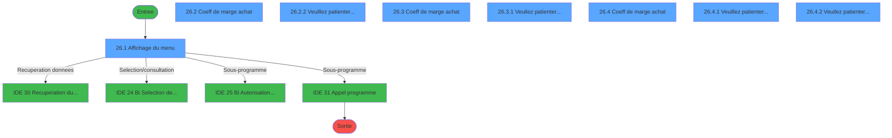
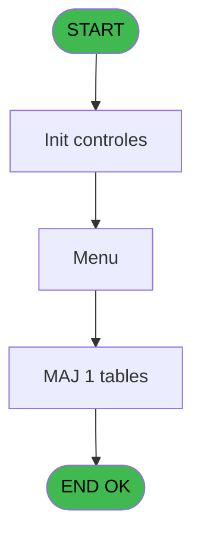
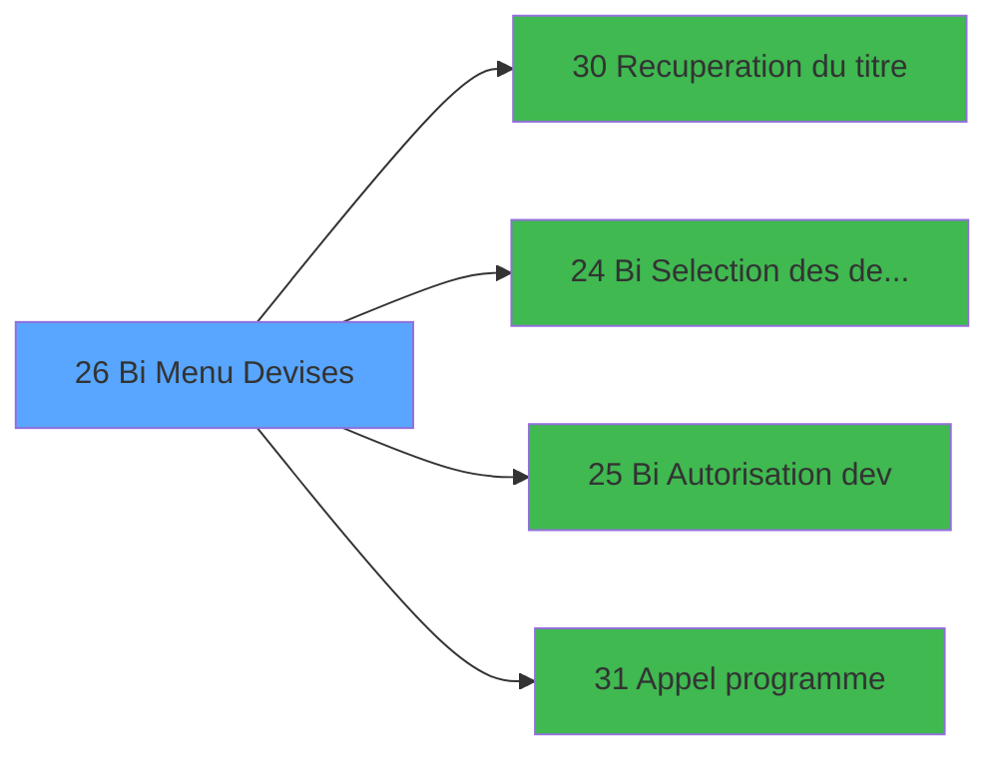

# GES IDE 26 - Bi  Menu Devises

> **Analyse**: Phases 1-4 2026-02-03 11:32 -> 11:32 (14s) | Assemblage 11:32
> **Pipeline**: V7.2 Enrichi
> **Structure**: 4 onglets (Resume | Ecrans | Donnees | Connexions)

<!-- TAB:Resume -->

## 1. FICHE D'IDENTITE

| Attribut | Valeur |
|----------|--------|
| Projet | GES |
| IDE Position | 26 |
| Nom Programme | Bi  Menu Devises |
| Fichier source | `Prg_26.xml` |
| Dossier IDE | Devises |
| Taches | 12 (8 ecrans visibles) |
| Tables modifiees | 1 |
| Programmes appeles | 4 |

## 2. DESCRIPTION FONCTIONNELLE

**Bi  Menu Devises** assure la gestion complete de ce processus, accessible depuis [Menu gestion (IDE 69)](GES-IDE-69.md).

Le flux de traitement s'organise en **3 blocs fonctionnels** :

- **Traitement** (8 taches) : traitements metier divers
- **Calcul** (3 taches) : calculs de montants, stocks ou compteurs
- **Consultation** (1 tache) : ecrans de recherche, selection et consultation

**Donnees modifiees** : 1 tables en ecriture (moyen_paiement___mop).

Detail : phases du traitement

#### Phase 1 : Traitement (8 taches)

- **26** - AC  Devise **[[ECRAN]](#ecran-t1)**
- **26.2** - Coeff de marge achat **[[ECRAN]](#ecran-t3)**
- **26.2.2** - Veuillez patienter... **[[ECRAN]](#ecran-t5)**
- **26.3** - Coeff de marge achat **[[ECRAN]](#ecran-t6)**
- **26.3.1** - Veuilez patienter... **[[ECRAN]](#ecran-t8)**
- **26.4** - Coeff de marge achat **[[ECRAN]](#ecran-t9)**
- **26.4.1** - Veuillez patienter... **[[ECRAN]](#ecran-t11)**
- **26.4.2** - Veuilez patienter... **[[ECRAN]](#ecran-t12)**

Delegue a : [Recuperation du titre (IDE 30)](GES-IDE-30.md), [Bi Autorisation dev (IDE 25)](GES-IDE-25.md), [Appel programme (IDE 31)](GES-IDE-31.md)

#### Phase 2 : Consultation (1 tache)

- **26.1** - Affichage du menu **[[ECRAN]](#ecran-t2)**

Delegue a : [Recuperation du titre (IDE 30)](GES-IDE-30.md), [ Bi  Selection des devises (IDE 24)](GES-IDE-24.md)

#### Phase 3 : Calcul (3 taches)

- **26.2.1** - Confirm recalcul **[[ECRAN]](#ecran-t4)**
- **26.3.2** - Confirm recalcul **[[ECRAN]](#ecran-t15)**
- **26.4.3** - Confirm recalcul **[[ECRAN]](#ecran-t18)**

#### Tables impactees

| Table | Operations | Role metier |
|-------|-----------|-------------|
| moyen_paiement___mop | R/**W** (7 usages) |  |

## 3. BLOCS FONCTIONNELS

### 3.1 Traitement (8 taches)

Traitements internes.

---

#### 26 - AC  Devise [[ECRAN]](#ecran-t1)

**Role** : Tache d'orchestration : point d'entree du programme (8 sous-taches). Coordonne l'enchainement des traitements.
**Ecran** : 640 x 184 DLU (MDI) | [Voir mockup](#ecran-t1)

7 sous-taches directes

| Tache | Nom | Bloc |
|-------|-----|------|
| [26.2](#t3) | Coeff de marge achat **[[ECRAN]](#ecran-t3)** | Traitement |
| [26.2.2](#t5) | Veuillez patienter... **[[ECRAN]](#ecran-t5)** | Traitement |
| [26.3](#t6) | Coeff de marge achat **[[ECRAN]](#ecran-t6)** | Traitement |
| [26.3.1](#t8) | Veuilez patienter... **[[ECRAN]](#ecran-t8)** | Traitement |
| [26.4](#t9) | Coeff de marge achat **[[ECRAN]](#ecran-t9)** | Traitement |
| [26.4.1](#t11) | Veuillez patienter... **[[ECRAN]](#ecran-t11)** | Traitement |
| [26.4.2](#t12) | Veuilez patienter... **[[ECRAN]](#ecran-t12)** | Traitement |

**Variables liees** : B (P0 devise locale)
**Delegue a** : [Recuperation du titre (IDE 30)](GES-IDE-30.md), [Bi Autorisation dev (IDE 25)](GES-IDE-25.md), [Appel programme (IDE 31)](GES-IDE-31.md)

---

#### 26.2 - Coeff de marge achat [[ECRAN]](#ecran-t3)

**Role** : Traitement : Coeff de marge achat.
**Ecran** : 549 x 184 DLU (MDI) | [Voir mockup](#ecran-t3)
**Delegue a** : [Recuperation du titre (IDE 30)](GES-IDE-30.md), [Bi Autorisation dev (IDE 25)](GES-IDE-25.md), [Appel programme (IDE 31)](GES-IDE-31.md)

---

#### 26.2.2 - Veuillez patienter... [[ECRAN]](#ecran-t5)

**Role** : Traitement : Veuillez patienter....
**Ecran** : 429 x 56 DLU (MDI) | [Voir mockup](#ecran-t5)
**Delegue a** : [Recuperation du titre (IDE 30)](GES-IDE-30.md), [Bi Autorisation dev (IDE 25)](GES-IDE-25.md), [Appel programme (IDE 31)](GES-IDE-31.md)

---

#### 26.3 - Coeff de marge achat [[ECRAN]](#ecran-t6)

**Role** : Traitement : Coeff de marge achat.
**Ecran** : 552 x 187 DLU (MDI) | [Voir mockup](#ecran-t6)
**Delegue a** : [Recuperation du titre (IDE 30)](GES-IDE-30.md), [Bi Autorisation dev (IDE 25)](GES-IDE-25.md), [Appel programme (IDE 31)](GES-IDE-31.md)

---

#### 26.3.1 - Veuilez patienter... [[ECRAN]](#ecran-t8)

**Role** : Traitement : Veuilez patienter....
**Ecran** : 426 x 57 DLU (MDI) | [Voir mockup](#ecran-t8)
**Delegue a** : [Recuperation du titre (IDE 30)](GES-IDE-30.md), [Bi Autorisation dev (IDE 25)](GES-IDE-25.md), [Appel programme (IDE 31)](GES-IDE-31.md)

---

#### 26.4 - Coeff de marge achat [[ECRAN]](#ecran-t9)

**Role** : Traitement : Coeff de marge achat.
**Ecran** : 554 x 186 DLU (MDI) | [Voir mockup](#ecran-t9)
**Delegue a** : [Recuperation du titre (IDE 30)](GES-IDE-30.md), [Bi Autorisation dev (IDE 25)](GES-IDE-25.md), [Appel programme (IDE 31)](GES-IDE-31.md)

---

#### 26.4.1 - Veuillez patienter... [[ECRAN]](#ecran-t11)

**Role** : Traitement : Veuillez patienter....
**Ecran** : 429 x 56 DLU (MDI) | [Voir mockup](#ecran-t11)
**Delegue a** : [Recuperation du titre (IDE 30)](GES-IDE-30.md), [Bi Autorisation dev (IDE 25)](GES-IDE-25.md), [Appel programme (IDE 31)](GES-IDE-31.md)

---

#### 26.4.2 - Veuilez patienter... [[ECRAN]](#ecran-t12)

**Role** : Traitement : Veuilez patienter....
**Ecran** : 426 x 57 DLU (MDI) | [Voir mockup](#ecran-t12)
**Delegue a** : [Recuperation du titre (IDE 30)](GES-IDE-30.md), [Bi Autorisation dev (IDE 25)](GES-IDE-25.md), [Appel programme (IDE 31)](GES-IDE-31.md)

### 3.2 Consultation (1 tache)

Ecrans de recherche et consultation.

---

#### 26.1 - Affichage du menu [[ECRAN]](#ecran-t2)

**Role** : Reinitialisation : Affichage du menu.
**Ecran** : 788 x 168 DLU (MDI) | [Voir mockup](#ecran-t2)
**Delegue a** : [ Bi  Selection des devises (IDE 24)](GES-IDE-24.md)

### 3.3 Calcul (3 taches)

Calculs metier : montants, stocks, compteurs.

---

#### 26.2.1 - Confirm recalcul [[ECRAN]](#ecran-t4)

**Role** : Calcul : Confirm recalcul.
**Ecran** : 140 x 32 DLU (MDI) | [Voir mockup](#ecran-t4)

---

#### 26.3.2 - Confirm recalcul [[ECRAN]](#ecran-t15)

**Role** : Calcul : Confirm recalcul.
**Ecran** : 140 x 32 DLU (MDI) | [Voir mockup](#ecran-t15)

---

#### 26.4.3 - Confirm recalcul [[ECRAN]](#ecran-t18)

**Role** : Calcul : Confirm recalcul.
**Ecran** : 140 x 32 DLU (MDI) | [Voir mockup](#ecran-t18)

## 5. REGLES METIER

*(Aucune regle metier identifiee)*

## 6. CONTEXTE

- **Appele par**: [Menu gestion (IDE 69)](GES-IDE-69.md)
- **Appelle**: 4 programmes | **Tables**: 3 (W:1 R:1 L:2) | **Taches**: 12 | **Expressions**: 4

<!-- TAB:Ecrans -->

## 8. ECRANS

### 8.1 Forms visibles (8 / 12)

| # | Position | Tache | Nom | Type | Largeur | Hauteur | Bloc |
|---|----------|-------|-----|------|---------|---------|------|
| 1 | 26.1 | 26.1 | Affichage du menu | MDI | 788 | 168 | Consultation |
| 2 | 26.2 | 26.2 | Coeff de marge achat | MDI | 549 | 184 | Traitement |
| 3 | 26.2.2 | 26.2.2 | Veuillez patienter... | MDI | 429 | 56 | Traitement |
| 4 | 26.3 | 26.3 | Coeff de marge achat | MDI | 552 | 187 | Traitement |
| 5 | 26.3.2 | 26.3.1 | Veuilez patienter... | MDI | 426 | 57 | Traitement |
| 6 | 26.4 | 26.4 | Coeff de marge achat | MDI | 554 | 186 | Traitement |
| 7 | 26.4.2 | 26.4.1 | Veuillez patienter... | MDI | 429 | 56 | Traitement |
| 8 | 26.4.3 | 26.4.2 | Veuilez patienter... | MDI | 426 | 57 | Traitement |

### 8.2 Mockups Ecrans

---

#### 26.1 - Affichage du menu
**Tache** : [26.1](#t2) | **Type** : MDI | **Dimensions** : 788 x 168 DLU
**Bloc** : Consultation | **Titre IDE** : Affichage du menu

<!-- FORM-DATA:
{
    "width":  788,
    "vFactor":  8,
    "type":  "MDI",
    "hFactor":  8,
    "controls":  [
                     {
                         "x":  0,
                         "type":  "label",
                         "var":  "",
                         "y":  0,
                         "w":  786,
                         "fmt":  "",
                         "name":  "",
                         "h":  18,
                         "color":  "",
                         "text":  "",
                         "parent":  null
                     },
                     {
                         "x":  251,
                         "type":  "label",
                         "var":  "",
                         "y":  44,
                         "w":  505,
                         "fmt":  "",
                         "name":  "",
                         "h":  76,
                         "color":  "",
                         "text":  "",
                         "parent":  null
                     },
                     {
                         "x":  277,
                         "type":  "label",
                         "var":  "",
                         "y":  54,
                         "w":  450,
                         "fmt":  "",
                         "name":  "",
                         "h":  47,
                         "color":  "",
                         "text":  "",
                         "parent":  4
                     },
                     {
                         "x":  278,
                         "type":  "label",
                         "var":  "",
                         "y":  55,
                         "w":  45,
                         "fmt":  "",
                         "name":  "",
                         "h":  45,
                         "color":  "",
                         "text":  "",
                         "parent":  4
                     },
                     {
                         "x":  339,
                         "type":  "label",
                         "var":  "",
                         "y":  59,
                         "w":  374,
                         "fmt":  "",
                         "name":  "",
                         "h":  8,
                         "color":  "142",
                         "text":  "Selection des devises",
                         "parent":  4
                     },
                     {
                         "x":  339,
                         "type":  "label",
                         "var":  "",
                         "y":  73,
                         "w":  374,
                         "fmt":  "",
                         "name":  "",
                         "h":  8,
                         "color":  "142",
                         "text":  "Coefficients de marge",
                         "parent":  4
                     },
                     {
                         "x":  339,
                         "type":  "label",
                         "var":  "",
                         "y":  87,
                         "w":  374,
                         "fmt":  "",
                         "name":  "",
                         "h":  8,
                         "color":  "142",
                         "text":  "Autorisations",
                         "parent":  4
                     },
                     {
                         "x":  391,
                         "type":  "label",
                         "var":  "",
                         "y":  105,
                         "w":  123,
                         "fmt":  "",
                         "name":  "",
                         "h":  10,
                         "color":  "",
                         "text":  "Votre choix",
                         "parent":  4
                     },
                     {
                         "x":  1,
                         "type":  "label",
                         "var":  "",
                         "y":  143,
                         "w":  787,
                         "fmt":  "",
                         "name":  "",
                         "h":  24,
                         "color":  "",
                         "text":  "",
                         "parent":  null
                     },
                     {
                         "x":  525,
                         "type":  "edit",
                         "var":  "",
                         "y":  105,
                         "w":  26,
                         "fmt":  "UA",
                         "name":  "W1 choix action",
                         "h":  10,
                         "color":  "6",
                         "text":  "",
                         "parent":  4
                     },
                     {
                         "x":  6,
                         "type":  "edit",
                         "var":  "",
                         "y":  4,
                         "w":  267,
                         "fmt":  "20",
                         "name":  "",
                         "h":  8,
                         "color":  "",
                         "text":  "",
                         "parent":  null
                     },
                     {
                         "x":  515,
                         "type":  "edit",
                         "var":  "",
                         "y":  4,
                         "w":  203,
                         "fmt":  "WWW DD MMM YYYYT",
                         "name":  "",
                         "h":  8,
                         "color":  "",
                         "text":  "",
                         "parent":  null
                     },
                     {
                         "x":  289,
                         "type":  "button",
                         "var":  "",
                         "y":  58,
                         "w":  26,
                         "fmt":  "1",
                         "name":  "1",
                         "h":  8,
                         "color":  "",
                         "text":  "",
                         "parent":  null
                     },
                     {
                         "x":  40,
                         "type":  "image",
                         "var":  "",
                         "y":  51,
                         "w":  141,
                         "fmt":  "",
                         "name":  "",
                         "h":  62,
                         "color":  "",
                         "text":  "",
                         "parent":  null
                     },
                     {
                         "x":  289,
                         "type":  "button",
                         "var":  "",
                         "y":  73,
                         "w":  26,
                         "fmt":  "2",
                         "name":  "2",
                         "h":  8,
                         "color":  "",
                         "text":  "",
                         "parent":  null
                     },
                     {
                         "x":  289,
                         "type":  "button",
                         "var":  "",
                         "y":  87,
                         "w":  26,
                         "fmt":  "3",
                         "name":  "3",
                         "h":  8,
                         "color":  "",
                         "text":  "",
                         "parent":  null
                     },
                     {
                         "x":  107,
                         "type":  "edit",
                         "var":  "",
                         "y":  128,
                         "w":  574,
                         "fmt":  "",
                         "name":  "",
                         "h":  10,
                         "color":  "143",
                         "text":  "",
                         "parent":  null
                     },
                     {
                         "x":  10,
                         "type":  "button",
                         "var":  "",
                         "y":  146,
                         "w":  154,
                         "fmt":  "\u0026Quitter",
                         "name":  "",
                         "h":  18,
                         "color":  "",
                         "text":  "",
                         "parent":  16
                     }
                 ],
    "taskId":  "26.1",
    "height":  168
}
-->

<strong>Champs : 4 champs</strong>

| Pos (x,y) | Nom | Variable | Type |
|-----------|-----|----------|------|
| 525,105 | W1 choix action | - | edit |
| 6,4 | 20 | - | edit |
| 515,4 | WWW DD MMM YYYYT | - | edit |
| 107,128 | (sans nom) | - | edit |

<strong>Boutons : 4 boutons</strong>

| Bouton | Pos (x,y) | Action |
|--------|-----------|--------|
| 1 | 289,58 | Bouton fonctionnel |
| 2 | 289,73 | Bouton fonctionnel |
| 3 | 289,87 | Bouton fonctionnel |
| Quitter | 10,146 | Quitte le programme |

---

#### 26.2 - Coeff de marge achat
**Tache** : [26.2](#t3) | **Type** : MDI | **Dimensions** : 549 x 184 DLU
**Bloc** : Traitement | **Titre IDE** : Coeff de marge achat

<!-- FORM-DATA:
{
    "width":  549,
    "vFactor":  8,
    "type":  "MDI",
    "hFactor":  8,
    "controls":  [
                     {
                         "x":  1,
                         "type":  "label",
                         "var":  "",
                         "y":  0,
                         "w":  546,
                         "fmt":  "",
                         "name":  "",
                         "h":  24,
                         "color":  "",
                         "text":  "",
                         "parent":  null
                     },
                     {
                         "x":  72,
                         "type":  "table",
                         "var":  "",
                         "name":  "",
                         "titleH":  12,
                         "color":  "110",
                         "w":  410,
                         "y":  34,
                         "fmt":  "",
                         "parent":  null,
                         "text":  "",
                         "rowH":  14,
                         "h":  114,
                         "cols":  [
                                      {
                                          "title":  "MOP",
                                          "layer":  1,
                                          "w":  83
                                      },
                                      {
                                          "title":  "Marge Achat Out",
                                          "layer":  2,
                                          "w":  159
                                      },
                                      {
                                          "title":  "Frais Achat In",
                                          "layer":  3,
                                          "w":  135
                                      }
                                  ],
                         "rows":  3
                     },
                     {
                         "x":  0,
                         "type":  "label",
                         "var":  "",
                         "y":  159,
                         "w":  547,
                         "fmt":  "",
                         "name":  "",
                         "h":  24,
                         "color":  "",
                         "text":  "",
                         "parent":  null
                     },
                     {
                         "x":  85,
                         "type":  "edit",
                         "var":  "",
                         "y":  50,
                         "w":  64,
                         "fmt":  "",
                         "name":  "",
                         "h":  8,
                         "color":  "110",
                         "text":  "",
                         "parent":  4
                     },
                     {
                         "x":  189,
                         "type":  "edit",
                         "var":  "",
                         "y":  50,
                         "w":  88,
                         "fmt":  "##.###Z",
                         "name":  "MOP Coef Marge Achat",
                         "h":  8,
                         "color":  "110",
                         "text":  "",
                         "parent":  4
                     },
                     {
                         "x":  339,
                         "type":  "edit",
                         "var":  "",
                         "y":  50,
                         "w":  88,
                         "fmt":  "",
                         "name":  "MOP Coef Marge Achat In",
                         "h":  8,
                         "color":  "110",
                         "text":  "",
                         "parent":  4
                     },
                     {
                         "x":  9,
                         "type":  "edit",
                         "var":  "",
                         "y":  8,
                         "w":  267,
                         "fmt":  "20",
                         "name":  "",
                         "h":  8,
                         "color":  "",
                         "text":  "",
                         "parent":  null
                     },
                     {
                         "x":  304,
                         "type":  "edit",
                         "var":  "",
                         "y":  8,
                         "w":  237,
                         "fmt":  "WWW DD MMM YYYYT",
                         "name":  "",
                         "h":  8,
                         "color":  "",
                         "text":  "",
                         "parent":  null
                     },
                     {
                         "x":  21,
                         "type":  "edit",
                         "var":  "",
                         "y":  157,
                         "w":  507,
                         "fmt":  "",
                         "name":  "",
                         "h":  10,
                         "color":  "143",
                         "text":  "",
                         "parent":  null
                     },
                     {
                         "x":  9,
                         "type":  "button",
                         "var":  "",
                         "y":  162,
                         "w":  154,
                         "fmt":  "\u0026Quitter",
                         "name":  "",
                         "h":  18,
                         "color":  "",
                         "text":  "",
                         "parent":  null
                     }
                 ],
    "taskId":  "26.2",
    "height":  184
}
-->

<strong>Champs : 6 champs</strong>

| Pos (x,y) | Nom | Variable | Type |
|-----------|-----|----------|------|
| 85,50 | (sans nom) | - | edit |
| 189,50 | MOP Coef Marge Achat | - | edit |
| 339,50 | MOP Coef Marge Achat In | - | edit |
| 9,8 | 20 | - | edit |
| 304,8 | WWW DD MMM YYYYT | - | edit |
| 21,157 | (sans nom) | - | edit |

<strong>Boutons : 1 boutons</strong>

| Bouton | Pos (x,y) | Action |
|--------|-----------|--------|
| Quitter | 9,162 | Quitte le programme |

---

#### 26.2.2 - Veuillez patienter...
**Tache** : [26.2.2](#t5) | **Type** : MDI | **Dimensions** : 429 x 56 DLU
**Bloc** : Traitement | **Titre IDE** : Veuillez patienter...

<!-- FORM-DATA:
{
    "width":  429,
    "vFactor":  8,
    "type":  "MDI",
    "hFactor":  8,
    "controls":  [
                     {
                         "x":  0,
                         "type":  "label",
                         "var":  "",
                         "y":  0,
                         "w":  423,
                         "fmt":  "",
                         "name":  "",
                         "h":  29,
                         "color":  "",
                         "text":  "",
                         "parent":  null
                     },
                     {
                         "x":  120,
                         "type":  "label",
                         "var":  "",
                         "y":  10,
                         "w":  221,
                         "fmt":  "",
                         "name":  "",
                         "h":  8,
                         "color":  "7",
                         "text":  "Traitement en cours ...",
                         "parent":  null
                     },
                     {
                         "x":  0,
                         "type":  "label",
                         "var":  "",
                         "y":  29,
                         "w":  423,
                         "fmt":  "",
                         "name":  "",
                         "h":  27,
                         "color":  "",
                         "text":  "",
                         "parent":  null
                     },
                     {
                         "x":  72,
                         "type":  "label",
                         "var":  "",
                         "y":  38,
                         "w":  280,
                         "fmt":  "",
                         "name":  "",
                         "h":  8,
                         "color":  "",
                         "text":  "Recalcul du taux de change",
                         "parent":  null
                     },
                     {
                         "x":  4,
                         "type":  "image",
                         "var":  "",
                         "y":  2,
                         "w":  72,
                         "fmt":  "",
                         "name":  "",
                         "h":  25,
                         "color":  "",
                         "text":  "",
                         "parent":  null
                     }
                 ],
    "taskId":  "26.2.2",
    "height":  56
}
-->

---

#### 26.3 - Coeff de marge achat
**Tache** : [26.3](#t6) | **Type** : MDI | **Dimensions** : 552 x 187 DLU
**Bloc** : Traitement | **Titre IDE** : Coeff de marge achat

<!-- FORM-DATA:
{
    "width":  552,
    "vFactor":  8,
    "type":  "MDI",
    "hFactor":  8,
    "controls":  [
                     {
                         "x":  0,
                         "type":  "label",
                         "var":  "",
                         "y":  0,
                         "w":  551,
                         "fmt":  "",
                         "name":  "",
                         "h":  18,
                         "color":  "",
                         "text":  "",
                         "parent":  null
                     },
                     {
                         "x":  81,
                         "type":  "table",
                         "var":  "",
                         "name":  "",
                         "titleH":  12,
                         "color":  "110",
                         "w":  416,
                         "y":  30,
                         "fmt":  "",
                         "parent":  null,
                         "text":  "",
                         "rowH":  14,
                         "h":  113,
                         "cols":  [
                                      {
                                          "title":  "MOP",
                                          "layer":  1,
                                          "w":  83
                                      },
                                      {
                                          "title":  "Marge Vente Out",
                                          "layer":  2,
                                          "w":  167
                                      },
                                      {
                                          "title":  "Frais Vente In",
                                          "layer":  3,
                                          "w":  136
                                      }
                                  ],
                         "rows":  3
                     },
                     {
                         "x":  0,
                         "type":  "label",
                         "var":  "",
                         "y":  162,
                         "w":  550,
                         "fmt":  "",
                         "name":  "",
                         "h":  24,
                         "color":  "",
                         "text":  "",
                         "parent":  null
                     },
                     {
                         "x":  93,
                         "type":  "edit",
                         "var":  "",
                         "y":  46,
                         "w":  64,
                         "fmt":  "",
                         "name":  "",
                         "h":  8,
                         "color":  "110",
                         "text":  "",
                         "parent":  4
                     },
                     {
                         "x":  189,
                         "type":  "edit",
                         "var":  "",
                         "y":  46,
                         "w":  74,
                         "fmt":  "#.###Z",
                         "name":  "MOP Coef Marge Vente",
                         "h":  8,
                         "color":  "110",
                         "text":  "",
                         "parent":  4
                     },
                     {
                         "x":  354,
                         "type":  "edit",
                         "var":  "",
                         "y":  46,
                         "w":  82,
                         "fmt":  "",
                         "name":  "MOP Coef Marge Vente In",
                         "h":  8,
                         "color":  "110",
                         "text":  "",
                         "parent":  4
                     },
                     {
                         "x":  6,
                         "type":  "edit",
                         "var":  "",
                         "y":  4,
                         "w":  267,
                         "fmt":  "20",
                         "name":  "",
                         "h":  8,
                         "color":  "",
                         "text":  "",
                         "parent":  null
                     },
                     {
                         "x":  304,
                         "type":  "edit",
                         "var":  "",
                         "y":  5,
                         "w":  237,
                         "fmt":  "WWW DD MMM YYYYT",
                         "name":  "",
                         "h":  8,
                         "color":  "",
                         "text":  "",
                         "parent":  null
                     },
                     {
                         "x":  21,
                         "type":  "edit",
                         "var":  "",
                         "y":  148,
                         "w":  507,
                         "fmt":  "",
                         "name":  "",
                         "h":  10,
                         "color":  "143",
                         "text":  "",
                         "parent":  null
                     },
                     {
                         "x":  9,
                         "type":  "button",
                         "var":  "",
                         "y":  165,
                         "w":  154,
                         "fmt":  "\u0026Quitter",
                         "name":  "",
                         "h":  18,
                         "color":  "",
                         "text":  "",
                         "parent":  null
                     }
                 ],
    "taskId":  "26.3",
    "height":  187
}
-->

<strong>Champs : 6 champs</strong>

| Pos (x,y) | Nom | Variable | Type |
|-----------|-----|----------|------|
| 93,46 | (sans nom) | - | edit |
| 189,46 | MOP Coef Marge Vente | - | edit |
| 354,46 | MOP Coef Marge Vente In | - | edit |
| 6,4 | 20 | - | edit |
| 304,5 | WWW DD MMM YYYYT | - | edit |
| 21,148 | (sans nom) | - | edit |

<strong>Boutons : 1 boutons</strong>

| Bouton | Pos (x,y) | Action |
|--------|-----------|--------|
| Quitter | 9,165 | Quitte le programme |

---

#### 26.3.2 - Veuilez patienter...
**Tache** : [26.3.1](#t8) | **Type** : MDI | **Dimensions** : 426 x 57 DLU
**Bloc** : Traitement | **Titre IDE** : Veuilez patienter...

<!-- FORM-DATA:
{
    "width":  426,
    "vFactor":  8,
    "type":  "MDI",
    "hFactor":  8,
    "controls":  [
                     {
                         "x":  0,
                         "type":  "label",
                         "var":  "",
                         "y":  0,
                         "w":  423,
                         "fmt":  "",
                         "name":  "",
                         "h":  29,
                         "color":  "",
                         "text":  "",
                         "parent":  null
                     },
                     {
                         "x":  120,
                         "type":  "label",
                         "var":  "",
                         "y":  10,
                         "w":  221,
                         "fmt":  "",
                         "name":  "",
                         "h":  8,
                         "color":  "7",
                         "text":  "Traitement en cours ...",
                         "parent":  null
                     },
                     {
                         "x":  0,
                         "type":  "label",
                         "var":  "",
                         "y":  29,
                         "w":  423,
                         "fmt":  "",
                         "name":  "",
                         "h":  27,
                         "color":  "",
                         "text":  "",
                         "parent":  null
                     },
                     {
                         "x":  72,
                         "type":  "label",
                         "var":  "",
                         "y":  38,
                         "w":  280,
                         "fmt":  "",
                         "name":  "",
                         "h":  8,
                         "color":  "",
                         "text":  "Recalcul du taux de change",
                         "parent":  null
                     },
                     {
                         "x":  4,
                         "type":  "image",
                         "var":  "",
                         "y":  2,
                         "w":  72,
                         "fmt":  "",
                         "name":  "",
                         "h":  25,
                         "color":  "",
                         "text":  "",
                         "parent":  null
                     }
                 ],
    "taskId":  "26.3.2",
    "height":  57
}
-->

---

#### 26.4 - Coeff de marge achat
**Tache** : [26.4](#t9) | **Type** : MDI | **Dimensions** : 554 x 186 DLU
**Bloc** : Traitement | **Titre IDE** : Coeff de marge achat

<!-- FORM-DATA:
{
    "width":  554,
    "vFactor":  8,
    "type":  "MDI",
    "hFactor":  8,
    "controls":  [
                     {
                         "x":  1,
                         "type":  "label",
                         "var":  "",
                         "y":  0,
                         "w":  546,
                         "fmt":  "",
                         "name":  "",
                         "h":  24,
                         "color":  "",
                         "text":  "",
                         "parent":  null
                     },
                     {
                         "x":  68,
                         "type":  "table",
                         "var":  "",
                         "name":  "",
                         "titleH":  12,
                         "color":  "110",
                         "w":  416,
                         "y":  41,
                         "fmt":  "",
                         "parent":  null,
                         "text":  "",
                         "rowH":  14,
                         "h":  100,
                         "cols":  [
                                      {
                                          "title":  "MOP",
                                          "layer":  1,
                                          "w":  83
                                      },
                                      {
                                          "title":  "Marge Achat",
                                          "layer":  2,
                                          "w":  169
                                      },
                                      {
                                          "title":  "Marge Vente",
                                          "layer":  3,
                                          "w":  129
                                      }
                                  ],
                         "rows":  3
                     },
                     {
                         "x":  0,
                         "type":  "label",
                         "var":  "",
                         "y":  159,
                         "w":  547,
                         "fmt":  "",
                         "name":  "",
                         "h":  24,
                         "color":  "",
                         "text":  "",
                         "parent":  null
                     },
                     {
                         "x":  80,
                         "type":  "edit",
                         "var":  "",
                         "y":  56,
                         "w":  64,
                         "fmt":  "",
                         "name":  "",
                         "h":  10,
                         "color":  "110",
                         "text":  "",
                         "parent":  4
                     },
                     {
                         "x":  186,
                         "type":  "edit",
                         "var":  "",
                         "y":  56,
                         "w":  88,
                         "fmt":  "##.###Z",
                         "name":  "MOP Coef Marge Achat",
                         "h":  10,
                         "color":  "110",
                         "text":  "",
                         "parent":  4
                     },
                     {
                         "x":  326,
                         "type":  "edit",
                         "var":  "",
                         "y":  56,
                         "w":  88,
                         "fmt":  "##.###Z",
                         "name":  "MOP Coef Marge Vente",
                         "h":  10,
                         "color":  "110",
                         "text":  "",
                         "parent":  4
                     },
                     {
                         "x":  9,
                         "type":  "edit",
                         "var":  "",
                         "y":  8,
                         "w":  267,
                         "fmt":  "20",
                         "name":  "",
                         "h":  8,
                         "color":  "",
                         "text":  "",
                         "parent":  1
                     },
                     {
                         "x":  304,
                         "type":  "edit",
                         "var":  "",
                         "y":  8,
                         "w":  237,
                         "fmt":  "WWW DD MMM YYYYT",
                         "name":  "",
                         "h":  8,
                         "color":  "",
                         "text":  "",
                         "parent":  1
                     },
                     {
                         "x":  21,
                         "type":  "edit",
                         "var":  "",
                         "y":  157,
                         "w":  507,
                         "fmt":  "",
                         "name":  "",
                         "h":  10,
                         "color":  "143",
                         "text":  "",
                         "parent":  null
                     },
                     {
                         "x":  9,
                         "type":  "button",
                         "var":  "",
                         "y":  162,
                         "w":  154,
                         "fmt":  "\u0026Quitter",
                         "name":  "",
                         "h":  18,
                         "color":  "",
                         "text":  "",
                         "parent":  null
                     }
                 ],
    "taskId":  "26.4",
    "height":  186
}
-->

<strong>Champs : 6 champs</strong>

| Pos (x,y) | Nom | Variable | Type |
|-----------|-----|----------|------|
| 80,56 | (sans nom) | - | edit |
| 186,56 | MOP Coef Marge Achat | - | edit |
| 326,56 | MOP Coef Marge Vente | - | edit |
| 9,8 | 20 | - | edit |
| 304,8 | WWW DD MMM YYYYT | - | edit |
| 21,157 | (sans nom) | - | edit |

<strong>Boutons : 1 boutons</strong>

| Bouton | Pos (x,y) | Action |
|--------|-----------|--------|
| Quitter | 9,162 | Quitte le programme |

---

#### 26.4.2 - Veuillez patienter...
**Tache** : [26.4.1](#t11) | **Type** : MDI | **Dimensions** : 429 x 56 DLU
**Bloc** : Traitement | **Titre IDE** : Veuillez patienter...

<!-- FORM-DATA:
{
    "width":  429,
    "vFactor":  8,
    "type":  "MDI",
    "hFactor":  8,
    "controls":  [
                     {
                         "x":  0,
                         "type":  "label",
                         "var":  "",
                         "y":  0,
                         "w":  423,
                         "fmt":  "",
                         "name":  "",
                         "h":  29,
                         "color":  "",
                         "text":  "",
                         "parent":  null
                     },
                     {
                         "x":  120,
                         "type":  "label",
                         "var":  "",
                         "y":  10,
                         "w":  221,
                         "fmt":  "",
                         "name":  "",
                         "h":  8,
                         "color":  "7",
                         "text":  "Traitement en cours ...",
                         "parent":  null
                     },
                     {
                         "x":  0,
                         "type":  "label",
                         "var":  "",
                         "y":  29,
                         "w":  423,
                         "fmt":  "",
                         "name":  "",
                         "h":  27,
                         "color":  "",
                         "text":  "",
                         "parent":  null
                     },
                     {
                         "x":  72,
                         "type":  "label",
                         "var":  "",
                         "y":  38,
                         "w":  280,
                         "fmt":  "",
                         "name":  "",
                         "h":  8,
                         "color":  "",
                         "text":  "Recalcul du taux de change",
                         "parent":  null
                     },
                     {
                         "x":  4,
                         "type":  "image",
                         "var":  "",
                         "y":  2,
                         "w":  72,
                         "fmt":  "",
                         "name":  "",
                         "h":  25,
                         "color":  "",
                         "text":  "",
                         "parent":  null
                     }
                 ],
    "taskId":  "26.4.2",
    "height":  56
}
-->

---

#### 26.4.3 - Veuilez patienter...
**Tache** : [26.4.2](#t12) | **Type** : MDI | **Dimensions** : 426 x 57 DLU
**Bloc** : Traitement | **Titre IDE** : Veuilez patienter...

<!-- FORM-DATA:
{
    "width":  426,
    "vFactor":  8,
    "type":  "MDI",
    "hFactor":  8,
    "controls":  [
                     {
                         "x":  0,
                         "type":  "label",
                         "var":  "",
                         "y":  0,
                         "w":  423,
                         "fmt":  "",
                         "name":  "",
                         "h":  29,
                         "color":  "",
                         "text":  "",
                         "parent":  null
                     },
                     {
                         "x":  120,
                         "type":  "label",
                         "var":  "",
                         "y":  10,
                         "w":  221,
                         "fmt":  "",
                         "name":  "",
                         "h":  8,
                         "color":  "7",
                         "text":  "Traitement en cours ...",
                         "parent":  null
                     },
                     {
                         "x":  0,
                         "type":  "label",
                         "var":  "",
                         "y":  29,
                         "w":  423,
                         "fmt":  "",
                         "name":  "",
                         "h":  27,
                         "color":  "",
                         "text":  "",
                         "parent":  null
                     },
                     {
                         "x":  72,
                         "type":  "label",
                         "var":  "",
                         "y":  38,
                         "w":  280,
                         "fmt":  "",
                         "name":  "",
                         "h":  8,
                         "color":  "",
                         "text":  "Recalcul du taux de change",
                         "parent":  null
                     },
                     {
                         "x":  4,
                         "type":  "image",
                         "var":  "",
                         "y":  2,
                         "w":  72,
                         "fmt":  "",
                         "name":  "",
                         "h":  25,
                         "color":  "",
                         "text":  "",
                         "parent":  null
                     }
                 ],
    "taskId":  "26.4.3",
    "height":  57
}
-->

## 9. NAVIGATION

### 9.1 Enchainement des ecrans

**Detail par enchainement :**

| Depuis | Action | Vers | Retour |
|--------|--------|------|--------|
| Affichage du menu | Recuperation donnees | [Recuperation du titre (IDE 30)](GES-IDE-30.md) | Retour ecran |
| Affichage du menu | Selection/consultation | [ Bi  Selection des devises (IDE 24)](GES-IDE-24.md) | Retour ecran |
| Affichage du menu | Sous-programme | [Bi Autorisation dev (IDE 25)](GES-IDE-25.md) | Retour ecran |
| Affichage du menu | Sous-programme | [Appel programme (IDE 31)](GES-IDE-31.md) | Retour ecran |

### 9.3 Structure hierarchique (12 taches)

| Position | Tache | Type | Dimensions | Bloc |
|----------|-------|------|------------|------|
| **26.1** | [**AC  Devise** (26)](#t1) [mockup](#ecran-t1) | MDI | 640x184 | Traitement |
| 26.1.1 | [Coeff de marge achat (26.2)](#t3) [mockup](#ecran-t3) | MDI | 549x184 | |
| 26.1.2 | [Veuillez patienter... (26.2.2)](#t5) [mockup](#ecran-t5) | MDI | 429x56 | |
| 26.1.3 | [Coeff de marge achat (26.3)](#t6) [mockup](#ecran-t6) | MDI | 552x187 | |
| 26.1.4 | [Veuilez patienter... (26.3.1)](#t8) [mockup](#ecran-t8) | MDI | 426x57 | |
| 26.1.5 | [Coeff de marge achat (26.4)](#t9) [mockup](#ecran-t9) | MDI | 554x186 | |
| 26.1.6 | [Veuillez patienter... (26.4.1)](#t11) [mockup](#ecran-t11) | MDI | 429x56 | |
| 26.1.7 | [Veuilez patienter... (26.4.2)](#t12) [mockup](#ecran-t12) | MDI | 426x57 | |
| **26.2** | [**Affichage du menu** (26.1)](#t2) [mockup](#ecran-t2) | MDI | 788x168 | Consultation |
| **26.3** | [**Confirm recalcul** (26.2.1)](#t4) [mockup](#ecran-t4) | MDI | 140x32 | Calcul |
| 26.3.1 | [Confirm recalcul (26.3.2)](#t15) [mockup](#ecran-t15) | MDI | 140x32 | |
| 26.3.2 | [Confirm recalcul (26.4.3)](#t18) [mockup](#ecran-t18) | MDI | 140x32 | |

### 9.4 Algorigramme

> **Legende**: Vert = START/END OK | Rouge = END KO | Bleu = Decisions
> *Algorigramme auto-genere. Utiliser `/algorigramme` pour une synthese metier detaillee.*

<!-- TAB:Donnees -->

## 10. TABLES

### Tables utilisees (3)

| ID | Nom | Description | Type | R | W | L | Usages |
|----|-----|-------------|------|---|---|---|--------|
| 139 | moyens_reglement_mor | Reglements / paiements | DB |   |   | L | 4 |
| 140 | moyen_paiement___mop |  | DB | R | **W** |   | 7 |
| 141 | devises__________dev | Devises / taux de change | DB |   |   | L | 4 |

### Colonnes par table (1 / 1 tables avec colonnes identifiees)

Table 140 - moyen_paiement___mop (R/**W**) - 7 usages

| Lettre | Variable | Acces | Type |
|--------|----------|-------|------|
| A | v. titre ecran | W | Alpha |
| B | W1 modif taux | W | Alpha |
| C | W1 recalcul | W | Alpha |

## 11. VARIABLES

### 11.1 Parametres entrants (2)

Variables recues du programme appelant ([Menu gestion (IDE 69)](GES-IDE-69.md)).

| Lettre | Nom | Type | Usage dans |
|--------|-----|------|-----------|
| A | P0 societe | Alpha | - |
| B | P0 devise locale | Alpha | - |

### 11.2 Variables de travail (1)

Variables internes au programme.

| Lettre | Nom | Type | Usage dans |
|--------|-----|------|-----------|
| D | W0 message | Alpha | 4x calcul interne |

### 11.3 Autres (1)

Variables diverses.

| Lettre | Nom | Type | Usage dans |
|--------|-----|------|-----------|
| C | V0 choix action | Alpha | - |

## 12. EXPRESSIONS

**4 / 4 expressions decodees (100%)**

### 12.1 Repartition par type

| Type | Expressions | Regles |
|------|-------------|--------|
| CONDITION | 4 | 0 |

### 12.2 Expressions cles par type

#### CONDITION (4 expressions)

| Type | IDE | Expression | Regle |
|------|-----|------------|-------|
| CONDITION | 3 | `W0 message [D]='2'` | - |
| CONDITION | 4 | `W0 message [D]='3'` | - |
| CONDITION | 1 | `W0 message [D]='F'` | - |
| CONDITION | 2 | `W0 message [D]='1'` | - |

<!-- TAB:Connexions -->

## 13. GRAPHE D'APPELS

### 13.1 Chaine depuis Main (Callers)

Main -> ... -> [Menu gestion (IDE 69)](GES-IDE-69.md) -> **Bi  Menu Devises (IDE 26)**

### 13.2 Callers

| IDE | Nom Programme | Nb Appels |
|-----|---------------|-----------|
| [69](GES-IDE-69.md) | Menu gestion | 1 |

### 13.3 Callees (programmes appeles)

### 13.4 Detail Callees avec contexte

| IDE | Nom Programme | Appels | Contexte |
|-----|---------------|--------|----------|
| [30](GES-IDE-30.md) | Recuperation du titre | 4 | Recuperation donnees |
| [24](GES-IDE-24.md) |  Bi  Selection des devises | 1 | Selection/consultation |
| [25](GES-IDE-25.md) | Bi Autorisation dev | 1 | Sous-programme |
| [31](GES-IDE-31.md) | Appel programme | 1 | Sous-programme |

## 14. RECOMMANDATIONS MIGRATION

### 14.1 Profil du programme

| Metrique | Valeur | Impact migration |
|----------|--------|-----------------|
| Lignes de logique | 203 | Taille moyenne |
| Expressions | 4 | Peu de logique |
| Tables WRITE | 1 | Impact faible |
| Sous-programmes | 4 | Peu de dependances |
| Ecrans visibles | 8 | Interface complexe multi-ecrans |
| Code desactive | 0% (0 / 203) | Code sain |
| Regles metier | 0 | Pas de regle identifiee |

### 14.2 Plan de migration par bloc

#### Traitement (8 taches: 8 ecrans, 0 traitement)

- **Strategie** : 8 composant(s) UI (Razor/React) avec formulaires et validation.
- 4 sous-programme(s) a migrer ou a reutiliser depuis les services existants.
- Decomposer les taches en services unitaires testables.

#### Consultation (1 tache: 1 ecran, 0 traitement)

- **Strategie** : Composants de recherche/selection en modales.
- 1 ecran : Affichage du menu

#### Calcul (3 taches: 3 ecrans, 0 traitement)

- **Strategie** : Services de calcul purs (Domain Services).
- Migrer la logique de calcul (stock, compteurs, montants)

### 14.3 Dependances critiques

| Dependance | Type | Appels | Impact |
|------------|------|--------|--------|
| moyen_paiement___mop | Table WRITE (Database) | 3x | Schema + repository |
| [Recuperation du titre (IDE 30)](GES-IDE-30.md) | Sous-programme | 4x | **CRITIQUE** - Recuperation donnees |
| [Appel programme (IDE 31)](GES-IDE-31.md) | Sous-programme | 1x | Normale - Sous-programme |
| [Bi Autorisation dev (IDE 25)](GES-IDE-25.md) | Sous-programme | 1x | Normale - Sous-programme |
| [ Bi  Selection des devises (IDE 24)](GES-IDE-24.md) | Sous-programme | 1x | Normale - Selection/consultation |

---
*Spec DETAILED generee par Pipeline V7.2 - 2026-02-03 11:32*
