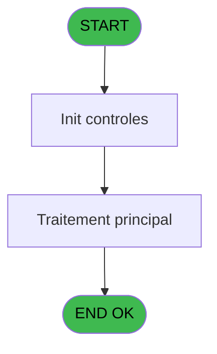
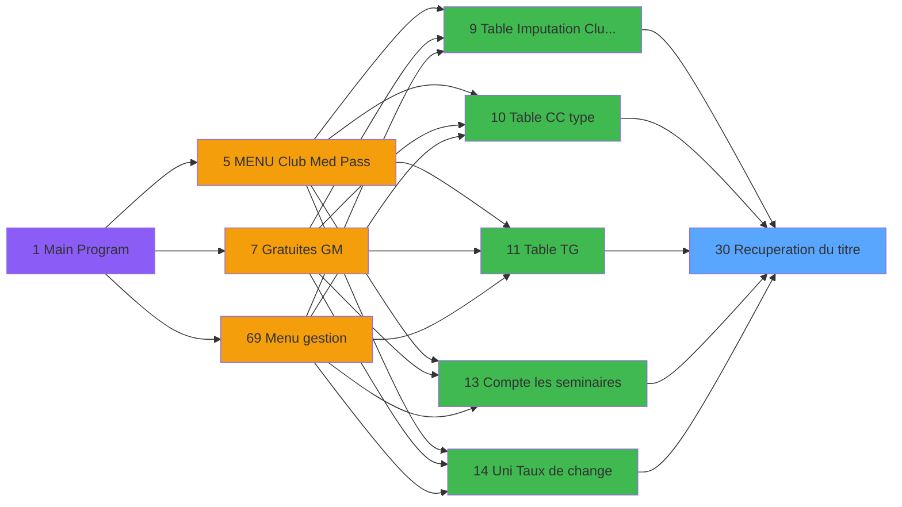

# GES IDE 30 - Recuperation du titre

> **Analyse**: Phases 1-4 2026-02-03 11:33 -> 11:34 (13s) | Assemblage 11:34
> **Pipeline**: V7.2 Enrichi
> **Structure**: 4 onglets (Resume | Ecrans | Donnees | Connexions)

<!-- TAB:Resume -->

## 1. FICHE D'IDENTITE

| Attribut | Valeur |
|----------|--------|
| Projet | GES |
| IDE Position | 30 |
| Nom Programme | Recuperation du titre |
| Fichier source | `Prg_30.xml` |
| Dossier IDE | Divers |
| Taches | 1 (0 ecrans visibles) |
| Tables modifiees | 0 |
| Programmes appeles | 0 |

## 2. DESCRIPTION FONCTIONNELLE

**Recuperation du titre** assure la gestion complete de ce processus, accessible depuis [Menu paramètres (IDE 58)](GES-IDE-58.md), [Initialisations (IDE 47)](GES-IDE-47.md), [Initialisations (FTV 2.00) (IDE 120)](GES-IDE-120.md), [Bi  Menu Devises (IDE 26)](GES-IDE-26.md), [Table CC type (IDE 10)](GES-IDE-10.md), [Compte les seminaires (IDE 13)](GES-IDE-13.md), [Menu Uni Devises (IDE 23)](GES-IDE-23.md), [Comptes speciaux (IDE 48)](GES-IDE-48.md), [CM  Maintenance service/user (IDE 78)](GES-IDE-78.md), [  CM  Table des types d'ID (IDE 82)](GES-IDE-82.md), [  CM  Table depôts devise (IDE 85)](GES-IDE-85.md), [  CM  Table Gratuits (IDE 86)](GES-IDE-86.md), [Menu Telephone (IDE 107)](GES-IDE-107.md), [Table Imputation Club Med Pass (IDE 9)](GES-IDE-9.md), [Table TG (IDE 11)](GES-IDE-11.md), [Uni Taux de change (IDE 14)](GES-IDE-14.md), [Bi  Menu Change (IDE 16)](GES-IDE-16.md), [ Bi  Taux de Change Achat (IDE 17)](GES-IDE-17.md), [ Bi  Taux de Change Vente (IDE 18)](GES-IDE-18.md), [Type de Change (UNI / BI) (IDE 19)](GES-IDE-19.md).

Le flux de traitement s'organise en **1 blocs fonctionnels** :

- **Traitement** (1 tache) : traitements metier divers

## 3. BLOCS FONCTIONNELS

### 3.1 Traitement (1 tache)

Traitements internes.

---

#### 30 - Recuperation du titre

**Role** : Consultation/chargement : Recuperation du titre.

## 5. REGLES METIER

*(Aucune regle metier identifiee)*

## 6. CONTEXTE

- **Appele par**: [Menu paramètres (IDE 58)](GES-IDE-58.md), [Initialisations (IDE 47)](GES-IDE-47.md), [Initialisations (FTV 2.00) (IDE 120)](GES-IDE-120.md), [Bi  Menu Devises (IDE 26)](GES-IDE-26.md), [Table CC type (IDE 10)](GES-IDE-10.md), [Compte les seminaires (IDE 13)](GES-IDE-13.md), [Menu Uni Devises (IDE 23)](GES-IDE-23.md), [Comptes speciaux (IDE 48)](GES-IDE-48.md), [CM  Maintenance service/user (IDE 78)](GES-IDE-78.md), [  CM  Table des types d'ID (IDE 82)](GES-IDE-82.md), [  CM  Table depôts devise (IDE 85)](GES-IDE-85.md), [  CM  Table Gratuits (IDE 86)](GES-IDE-86.md), [Menu Telephone (IDE 107)](GES-IDE-107.md), [Table Imputation Club Med Pass (IDE 9)](GES-IDE-9.md), [Table TG (IDE 11)](GES-IDE-11.md), [Uni Taux de change (IDE 14)](GES-IDE-14.md), [Bi  Menu Change (IDE 16)](GES-IDE-16.md), [ Bi  Taux de Change Achat (IDE 17)](GES-IDE-17.md), [ Bi  Taux de Change Vente (IDE 18)](GES-IDE-18.md), [Type de Change (UNI / BI) (IDE 19)](GES-IDE-19.md)
- **Appelle**: 0 programmes | **Tables**: 1 (W:0 R:1 L:0) | **Taches**: 1 | **Expressions**: 4

<!-- TAB:Ecrans -->

## 8. ECRANS

*(Programme sans ecran visible)*

## 9. NAVIGATION

### 9.3 Structure hierarchique (1 tache)

| Position | Tache | Type | Dimensions | Bloc |
|----------|-------|------|------------|------|
| **30.1** | [**Recuperation du titre** (30)](#t1) | MDI | - | Traitement |

### 9.4 Algorigramme

> **Legende**: Vert = START/END OK | Rouge = END KO | Bleu = Decisions
> *Algorigramme auto-genere. Utiliser `/algorigramme` pour une synthese metier detaillee.*

<!-- TAB:Donnees -->

## 10. TABLES

### Tables utilisees (1)

| ID | Nom | Description | Type | R | W | L | Usages |
|----|-----|-------------|------|---|---|---|--------|
| 719 | arc_transac_detail_bar |  | DB | R |   |   | 1 |

### Colonnes par table (1 / 1 tables avec colonnes identifiees)

Table 719 - arc_transac_detail_bar (R) - 1 usages

| Lettre | Variable | Acces | Type |
|--------|----------|-------|------|
| A | > code ecran | R | Numeric |
| B | < nom ecran | R | Alpha |

## 11. VARIABLES

### 11.1 Autres (2)

Variables diverses.

| Lettre | Nom | Type | Usage dans |
|--------|-----|------|-----------|
| A | > code ecran | Numeric | 1x refs |
| B | < nom ecran | Alpha | - |

## 12. EXPRESSIONS

**4 / 4 expressions decodees (100%)**

### 12.1 Repartition par type

| Type | Expressions | Regles |
|------|-------------|--------|
| CONCATENATION | 1 | 0 |
| CONSTANTE | 1 | 0 |
| OTHER | 1 | 0 |
| CONDITION | 1 | 0 |

### 12.2 Expressions cles par type

#### CONCATENATION (1 expressions)

| Type | IDE | Expression | Regle |
|------|-----|------------|-------|
| CONCATENATION | 4 | `Trim ([F])&' - '&Trim ([G])` | - |

#### CONSTANTE (1 expressions)

| Type | IDE | Expression | Regle |
|------|-----|------------|-------|
| CONSTANTE | 3 | `'CG'` | - |

#### OTHER (1 expressions)

| Type | IDE | Expression | Regle |
|------|-----|------------|-------|
| OTHER | 1 | `GetParam ('CODELANGUE')` | - |

#### CONDITION (1 expressions)

| Type | IDE | Expression | Regle |
|------|-----|------------|-------|
| CONDITION | 2 | `> code ecran [A]` | - |

<!-- TAB:Connexions -->

## 13. GRAPHE D'APPELS

### 13.1 Chaine depuis Main (Callers)

Main -> ... -> [Menu paramètres (IDE 58)](GES-IDE-58.md) -> **Recuperation du titre (IDE 30)**

Main -> ... -> [Initialisations (IDE 47)](GES-IDE-47.md) -> **Recuperation du titre (IDE 30)**

Main -> ... -> [Initialisations (FTV 2.00) (IDE 120)](GES-IDE-120.md) -> **Recuperation du titre (IDE 30)**

Main -> ... -> [Bi  Menu Devises (IDE 26)](GES-IDE-26.md) -> **Recuperation du titre (IDE 30)**

Main -> ... -> [Table CC type (IDE 10)](GES-IDE-10.md) -> **Recuperation du titre (IDE 30)**

Main -> ... -> [Compte les seminaires (IDE 13)](GES-IDE-13.md) -> **Recuperation du titre (IDE 30)**

Main -> ... -> [Menu Uni Devises (IDE 23)](GES-IDE-23.md) -> **Recuperation du titre (IDE 30)**

Main -> ... -> [Comptes speciaux (IDE 48)](GES-IDE-48.md) -> **Recuperation du titre (IDE 30)**

Main -> ... -> [CM  Maintenance service/user (IDE 78)](GES-IDE-78.md) -> **Recuperation du titre (IDE 30)**

Main -> ... -> [  CM  Table des types d'ID (IDE 82)](GES-IDE-82.md) -> **Recuperation du titre (IDE 30)**

Main -> ... -> [  CM  Table depôts devise (IDE 85)](GES-IDE-85.md) -> **Recuperation du titre (IDE 30)**

Main -> ... -> [  CM  Table Gratuits (IDE 86)](GES-IDE-86.md) -> **Recuperation du titre (IDE 30)**

Main -> ... -> [Menu Telephone (IDE 107)](GES-IDE-107.md) -> **Recuperation du titre (IDE 30)**

Main -> ... -> [Table Imputation Club Med Pass (IDE 9)](GES-IDE-9.md) -> **Recuperation du titre (IDE 30)**

Main -> ... -> [Table TG (IDE 11)](GES-IDE-11.md) -> **Recuperation du titre (IDE 30)**

Main -> ... -> [Uni Taux de change (IDE 14)](GES-IDE-14.md) -> **Recuperation du titre (IDE 30)**

Main -> ... -> [Bi  Menu Change (IDE 16)](GES-IDE-16.md) -> **Recuperation du titre (IDE 30)**

Main -> ... -> [ Bi  Taux de Change Achat (IDE 17)](GES-IDE-17.md) -> **Recuperation du titre (IDE 30)**

Main -> ... -> [ Bi  Taux de Change Vente (IDE 18)](GES-IDE-18.md) -> **Recuperation du titre (IDE 30)**

Main -> ... -> [Type de Change (UNI / BI) (IDE 19)](GES-IDE-19.md) -> **Recuperation du titre (IDE 30)**

### 13.2 Callers

| IDE | Nom Programme | Nb Appels |
|-----|---------------|-----------|
| [58](GES-IDE-58.md) | Menu paramètres | 15 |
| [47](GES-IDE-47.md) | Initialisations | 9 |
| [120](GES-IDE-120.md) | Initialisations (FTV 2.00) | 9 |
| [26](GES-IDE-26.md) | Bi  Menu Devises | 4 |
| [10](GES-IDE-10.md) | Table CC type | 2 |
| [13](GES-IDE-13.md) | Compte les seminaires | 2 |
| [23](GES-IDE-23.md) | Menu Uni Devises | 2 |
| [48](GES-IDE-48.md) | Comptes speciaux | 2 |
| [78](GES-IDE-78.md) | CM  Maintenance service/user | 2 |
| [82](GES-IDE-82.md) |   CM  Table des types d'ID | 2 |
| [85](GES-IDE-85.md) |   CM  Table depôts devise | 2 |
| [86](GES-IDE-86.md) |   CM  Table Gratuits | 2 |
| [107](GES-IDE-107.md) | Menu Telephone | 2 |
| [9](GES-IDE-9.md) | Table Imputation Club Med Pass | 1 |
| [11](GES-IDE-11.md) | Table TG | 1 |
| [14](GES-IDE-14.md) | Uni Taux de change | 1 |
| [16](GES-IDE-16.md) | Bi  Menu Change | 1 |
| [17](GES-IDE-17.md) |  Bi  Taux de Change Achat | 1 |
| [18](GES-IDE-18.md) |  Bi  Taux de Change Vente | 1 |
| [19](GES-IDE-19.md) | Type de Change (UNI / BI) | 1 |

### 13.3 Callees (programmes appeles)

### 13.4 Detail Callees avec contexte

| IDE | Nom Programme | Appels | Contexte |
|-----|---------------|--------|----------|
| - | (aucun) | - | - |

## 14. RECOMMANDATIONS MIGRATION

### 14.1 Profil du programme

| Metrique | Valeur | Impact migration |
|----------|--------|-----------------|
| Lignes de logique | 12 | Programme compact |
| Expressions | 4 | Peu de logique |
| Tables WRITE | 0 | Impact faible |
| Sous-programmes | 0 | Peu de dependances |
| Ecrans visibles | 0 | Ecran unique ou traitement batch |
| Code desactive | 0% (0 / 12) | Code sain |
| Regles metier | 0 | Pas de regle identifiee |

### 14.2 Plan de migration par bloc

#### Traitement (1 tache: 0 ecran, 1 traitement)

- **Strategie** : 1 service(s) backend injectable(s) (Domain Services).
- Decomposer les taches en services unitaires testables.

### 14.3 Dependances critiques

| Dependance | Type | Appels | Impact |
|------------|------|--------|--------|

---
*Spec DETAILED generee par Pipeline V7.2 - 2026-02-03 11:34*
