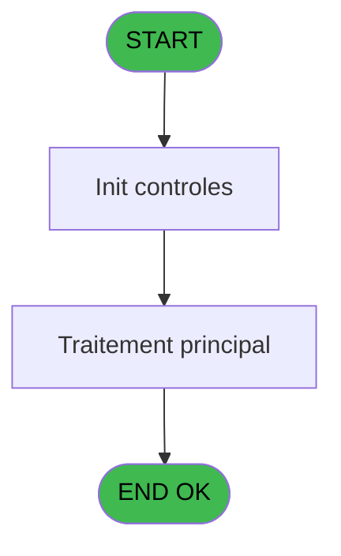
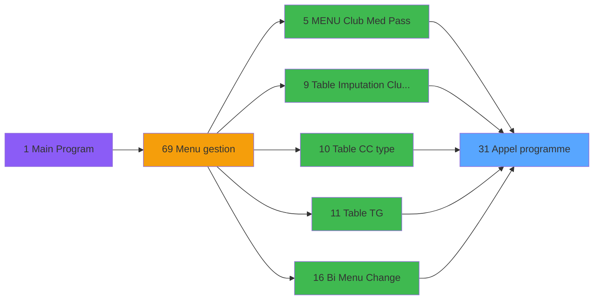

# GES IDE 31 - Appel programme

> **Analyse**: Phases 1-4 2026-02-03 11:34 -> 11:34 (13s) | Assemblage 11:34
> **Pipeline**: V7.2 Enrichi
> **Structure**: 4 onglets (Resume | Ecrans | Donnees | Connexions)

<!-- TAB:Resume -->

## 1. FICHE D'IDENTITE

| Attribut | Valeur |
|----------|--------|
| Projet | GES |
| IDE Position | 31 |
| Nom Programme | Appel programme |
| Fichier source | `Prg_31.xml` |
| Dossier IDE | Divers |
| Taches | 1 (0 ecrans visibles) |
| Tables modifiees | 0 |
| Programmes appeles | 0 |

## 2. DESCRIPTION FONCTIONNELLE

**Appel programme** assure la gestion complete de ce processus, accessible depuis [Menu Telephone (IDE 107)](GES-IDE-107.md), [MENU  Club Med Pass (IDE 5)](GES-IDE-5.md), [Table Imputation Club Med Pass (IDE 9)](GES-IDE-9.md), [Table CC type (IDE 10)](GES-IDE-10.md), [Table TG (IDE 11)](GES-IDE-11.md), [Bi  Menu Change (IDE 16)](GES-IDE-16.md), [Type de Change (UNI / BI) (IDE 19)](GES-IDE-19.md), [ Uni Selection des devises (IDE 21)](GES-IDE-21.md), [Menu Uni Devises (IDE 23)](GES-IDE-23.md), [ Bi  Selection des devises (IDE 24)](GES-IDE-24.md), [Bi  Menu Devises (IDE 26)](GES-IDE-26.md), [Extrait de compte GRAT (IDE 44)](GES-IDE-44.md), [Initialisations (IDE 47)](GES-IDE-47.md), [Comptes speciaux (IDE 48)](GES-IDE-48.md), [Affichage menu (IDE 51)](GES-IDE-51.md), [Menu paramètres (IDE 58)](GES-IDE-58.md), [Menu gestion (IDE 69)](GES-IDE-69.md), [CM  Maintenance service/user (IDE 78)](GES-IDE-78.md), [CM  Menu Services village (IDE 79)](GES-IDE-79.md), [CM  Menu Autres tables (IDE 81)](GES-IDE-81.md).

Le flux de traitement s'organise en **1 blocs fonctionnels** :

- **Traitement** (1 tache) : traitements metier divers

## 3. BLOCS FONCTIONNELS

### 3.1 Traitement (1 tache)

Traitements internes.

---

#### 31 - Appel programme

**Role** : Traitement : Appel programme.

## 5. REGLES METIER

*(Aucune regle metier identifiee)*

## 6. CONTEXTE

- **Appele par**: [Menu Telephone (IDE 107)](GES-IDE-107.md), [MENU  Club Med Pass (IDE 5)](GES-IDE-5.md), [Table Imputation Club Med Pass (IDE 9)](GES-IDE-9.md), [Table CC type (IDE 10)](GES-IDE-10.md), [Table TG (IDE 11)](GES-IDE-11.md), [Bi  Menu Change (IDE 16)](GES-IDE-16.md), [Type de Change (UNI / BI) (IDE 19)](GES-IDE-19.md), [ Uni Selection des devises (IDE 21)](GES-IDE-21.md), [Menu Uni Devises (IDE 23)](GES-IDE-23.md), [ Bi  Selection des devises (IDE 24)](GES-IDE-24.md), [Bi  Menu Devises (IDE 26)](GES-IDE-26.md), [Extrait de compte GRAT (IDE 44)](GES-IDE-44.md), [Initialisations (IDE 47)](GES-IDE-47.md), [Comptes speciaux (IDE 48)](GES-IDE-48.md), [Affichage menu (IDE 51)](GES-IDE-51.md), [Menu paramètres (IDE 58)](GES-IDE-58.md), [Menu gestion (IDE 69)](GES-IDE-69.md), [CM  Maintenance service/user (IDE 78)](GES-IDE-78.md), [CM  Menu Services village (IDE 79)](GES-IDE-79.md), [CM  Menu Autres tables (IDE 81)](GES-IDE-81.md)
- **Appelle**: 0 programmes | **Tables**: 0 (W:0 R:0 L:0) | **Taches**: 1 | **Expressions**: 1

<!-- TAB:Ecrans -->

## 8. ECRANS

*(Programme sans ecran visible)*

## 9. NAVIGATION

### 9.3 Structure hierarchique (1 tache)

| Position | Tache | Type | Dimensions | Bloc |
|----------|-------|------|------------|------|
| **31.1** | [**Appel programme** (31)](#t1) | MDI | - | Traitement |

### 9.4 Algorigramme

> **Legende**: Vert = START/END OK | Rouge = END KO | Bleu = Decisions
> *Algorigramme auto-genere. Utiliser `/algorigramme` pour une synthese metier detaillee.*

<!-- TAB:Donnees -->

## 10. TABLES

### Tables utilisees (0)

| ID | Nom | Description | Type | R | W | L | Usages |
|----|-----|-------------|------|---|---|---|--------|

### Colonnes par table (0 / 0 tables avec colonnes identifiees)

## 11. VARIABLES

*(Programme sans variables locales mappees)*

## 12. EXPRESSIONS

**1 / 1 expressions decodees (100%)**

### 12.1 Repartition par type

| Type | Expressions | Regles |
|------|-------------|--------|
| OTHER | 1 | 0 |

### 12.2 Expressions cles par type

#### OTHER (1 expressions)

| Type | IDE | Expression | Regle |
|------|-----|------------|-------|
| OTHER | 1 | `LastClicked ()` | - |

<!-- TAB:Connexions -->

## 13. GRAPHE D'APPELS

### 13.1 Chaine depuis Main (Callers)

Main -> ... -> [Menu Telephone (IDE 107)](GES-IDE-107.md) -> **Appel programme (IDE 31)**

Main -> ... -> [MENU  Club Med Pass (IDE 5)](GES-IDE-5.md) -> **Appel programme (IDE 31)**

Main -> ... -> [Table Imputation Club Med Pass (IDE 9)](GES-IDE-9.md) -> **Appel programme (IDE 31)**

Main -> ... -> [Table CC type (IDE 10)](GES-IDE-10.md) -> **Appel programme (IDE 31)**

Main -> ... -> [Table TG (IDE 11)](GES-IDE-11.md) -> **Appel programme (IDE 31)**

Main -> ... -> [Bi  Menu Change (IDE 16)](GES-IDE-16.md) -> **Appel programme (IDE 31)**

Main -> ... -> [Type de Change (UNI / BI) (IDE 19)](GES-IDE-19.md) -> **Appel programme (IDE 31)**

Main -> ... -> [ Uni Selection des devises (IDE 21)](GES-IDE-21.md) -> **Appel programme (IDE 31)**

Main -> ... -> [Menu Uni Devises (IDE 23)](GES-IDE-23.md) -> **Appel programme (IDE 31)**

Main -> ... -> [ Bi  Selection des devises (IDE 24)](GES-IDE-24.md) -> **Appel programme (IDE 31)**

Main -> ... -> [Bi  Menu Devises (IDE 26)](GES-IDE-26.md) -> **Appel programme (IDE 31)**

Main -> ... -> [Extrait de compte GRAT (IDE 44)](GES-IDE-44.md) -> **Appel programme (IDE 31)**

Main -> ... -> [Initialisations (IDE 47)](GES-IDE-47.md) -> **Appel programme (IDE 31)**

Main -> ... -> [Comptes speciaux (IDE 48)](GES-IDE-48.md) -> **Appel programme (IDE 31)**

Main -> ... -> [Affichage menu (IDE 51)](GES-IDE-51.md) -> **Appel programme (IDE 31)**

Main -> ... -> [Menu paramètres (IDE 58)](GES-IDE-58.md) -> **Appel programme (IDE 31)**

Main -> ... -> [Menu gestion (IDE 69)](GES-IDE-69.md) -> **Appel programme (IDE 31)**

Main -> ... -> [CM  Maintenance service/user (IDE 78)](GES-IDE-78.md) -> **Appel programme (IDE 31)**

Main -> ... -> [CM  Menu Services village (IDE 79)](GES-IDE-79.md) -> **Appel programme (IDE 31)**

Main -> ... -> [CM  Menu Autres tables (IDE 81)](GES-IDE-81.md) -> **Appel programme (IDE 31)**

### 13.2 Callers

| IDE | Nom Programme | Nb Appels |
|-----|---------------|-----------|
| [107](GES-IDE-107.md) | Menu Telephone | 2 |
| [5](GES-IDE-5.md) | MENU  Club Med Pass | 1 |
| [9](GES-IDE-9.md) | Table Imputation Club Med Pass | 1 |
| [10](GES-IDE-10.md) | Table CC type | 1 |
| [11](GES-IDE-11.md) | Table TG | 1 |
| [16](GES-IDE-16.md) | Bi  Menu Change | 1 |
| [19](GES-IDE-19.md) | Type de Change (UNI / BI) | 1 |
| [21](GES-IDE-21.md) |  Uni Selection des devises | 1 |
| [23](GES-IDE-23.md) | Menu Uni Devises | 1 |
| [24](GES-IDE-24.md) |  Bi  Selection des devises | 1 |
| [26](GES-IDE-26.md) | Bi  Menu Devises | 1 |
| [44](GES-IDE-44.md) | Extrait de compte GRAT | 1 |
| [47](GES-IDE-47.md) | Initialisations | 1 |
| [48](GES-IDE-48.md) | Comptes speciaux | 1 |
| [51](GES-IDE-51.md) | Affichage menu | 1 |
| [58](GES-IDE-58.md) | Menu paramètres | 1 |
| [69](GES-IDE-69.md) | Menu gestion | 1 |
| [78](GES-IDE-78.md) | CM  Maintenance service/user | 1 |
| [79](GES-IDE-79.md) | CM  Menu Services village | 1 |
| [81](GES-IDE-81.md) | CM  Menu Autres tables | 1 |

### 13.3 Callees (programmes appeles)

### 13.4 Detail Callees avec contexte

| IDE | Nom Programme | Appels | Contexte |
|-----|---------------|--------|----------|
| - | (aucun) | - | - |

## 14. RECOMMANDATIONS MIGRATION

### 14.1 Profil du programme

| Metrique | Valeur | Impact migration |
|----------|--------|-----------------|
| Lignes de logique | 4 | Programme compact |
| Expressions | 1 | Peu de logique |
| Tables WRITE | 0 | Impact faible |
| Sous-programmes | 0 | Peu de dependances |
| Ecrans visibles | 0 | Ecran unique ou traitement batch |
| Code desactive | 0% (0 / 4) | Code sain |
| Regles metier | 0 | Pas de regle identifiee |

### 14.2 Plan de migration par bloc

#### Traitement (1 tache: 0 ecran, 1 traitement)

- **Strategie** : 1 service(s) backend injectable(s) (Domain Services).
- Decomposer les taches en services unitaires testables.

### 14.3 Dependances critiques

| Dependance | Type | Appels | Impact |
|------------|------|--------|--------|

---
*Spec DETAILED generee par Pipeline V7.2 - 2026-02-03 11:34*
