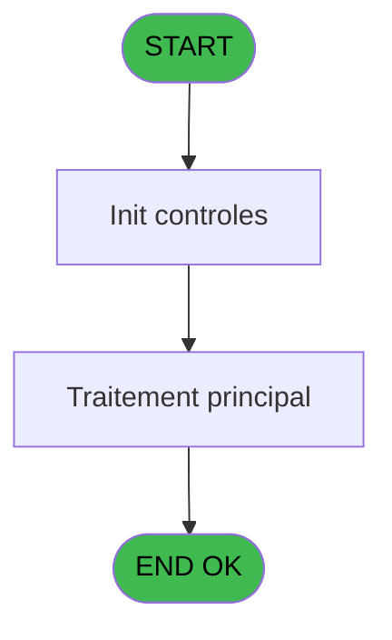
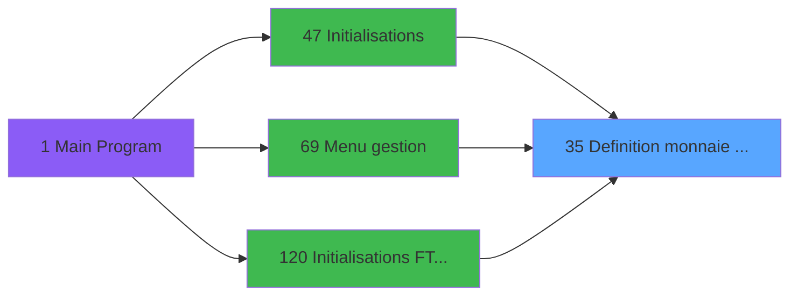

# GES IDE 35 - Definition monnaie de'enregist

> **Analyse**: Phases 1-4 2026-02-03 11:35 -> 11:36 (17s) | Assemblage 11:36
> **Pipeline**: V7.2 Enrichi
> **Structure**: 4 onglets (Resume | Ecrans | Donnees | Connexions)

<!-- TAB:Resume -->

## 1. FICHE D'IDENTITE

| Attribut | Valeur |
|----------|--------|
| Projet | GES |
| IDE Position | 35 |
| Nom Programme | Definition monnaie de'enregist |
| Fichier source | `Prg_35.xml` |
| Dossier IDE | Divers |
| Taches | 1 (0 ecrans visibles) |
| Tables modifiees | 0 |
| Programmes appeles | 0 |

## 2. DESCRIPTION FONCTIONNELLE

**Definition monnaie de'enregist** assure la gestion complete de ce processus, accessible depuis [Initialisations (IDE 47)](GES-IDE-47.md), [Menu gestion (IDE 69)](GES-IDE-69.md), [Initialisations (FTV 2.00) (IDE 120)](GES-IDE-120.md).

Le flux de traitement s'organise en **1 blocs fonctionnels** :

- **Initialisation** (1 tache) : reinitialisation d'etats et de variables de travail

## 3. BLOCS FONCTIONNELS

### 3.1 Initialisation (1 tache)

Reinitialisation d'etats et variables de travail.

---

#### 35 - Definition monnaie de'enregist

**Role** : Reinitialisation : Definition monnaie de'enregist.

## 5. REGLES METIER

*(Aucune regle metier identifiee)*

## 6. CONTEXTE

- **Appele par**: [Initialisations (IDE 47)](GES-IDE-47.md), [Menu gestion (IDE 69)](GES-IDE-69.md), [Initialisations (FTV 2.00) (IDE 120)](GES-IDE-120.md)
- **Appelle**: 0 programmes | **Tables**: 1 (W:0 R:1 L:0) | **Taches**: 1 | **Expressions**: 4

<!-- TAB:Ecrans -->

## 8. ECRANS

*(Programme sans ecran visible)*

## 9. NAVIGATION

### 9.3 Structure hierarchique (1 tache)

| Position | Tache | Type | Dimensions | Bloc |
|----------|-------|------|------------|------|
| **35.1** | [**Definition monnaie de'enregist** (35)](#t1) | MDI | - | Initialisation |

### 9.4 Algorigramme

> **Legende**: Vert = START/END OK | Rouge = END KO | Bleu = Decisions
> *Algorigramme auto-genere. Utiliser `/algorigramme` pour une synthese metier detaillee.*

<!-- TAB:Donnees -->

## 10. TABLES

### Tables utilisees (1)

| ID | Nom | Description | Type | R | W | L | Usages |
|----|-----|-------------|------|---|---|---|--------|
| 69 | initialisation___ini |  | DB | R |   |   | 1 |

### Colonnes par table (0 / 1 tables avec colonnes identifiees)

Table 69 - initialisation___ini (R) - 1 usages

*Table utilisee uniquement en Link ou aucune colonne Real identifiee dans le DataView.*

## 11. VARIABLES

*(Programme sans variables locales mappees)*

## 12. EXPRESSIONS

**4 / 4 expressions decodees (100%)**

### 12.1 Repartition par type

| Type | Expressions | Regles |
|------|-------------|--------|
| OTHER | 4 | 0 |

### 12.2 Expressions cles par type

#### OTHER (4 expressions)

| Type | IDE | Expression | Regle |
|------|-----|------------|-------|
| OTHER | 3 | `SetParam ('DEVISELOCAL_IN','N')` | - |
| OTHER | 4 | `SetParam ('CODEDEVISELOCAL',[A])` | - |
| OTHER | 1 | `SetCrsr (2)` | - |
| OTHER | 2 | `SetCrsr (1)` | - |

<!-- TAB:Connexions -->

## 13. GRAPHE D'APPELS

### 13.1 Chaine depuis Main (Callers)

Main -> ... -> [Initialisations (IDE 47)](GES-IDE-47.md) -> **Definition monnaie de'enregist (IDE 35)**

Main -> ... -> [Menu gestion (IDE 69)](GES-IDE-69.md) -> **Definition monnaie de'enregist (IDE 35)**

Main -> ... -> [Initialisations (FTV 2.00) (IDE 120)](GES-IDE-120.md) -> **Definition monnaie de'enregist (IDE 35)**

### 13.2 Callers

| IDE | Nom Programme | Nb Appels |
|-----|---------------|-----------|
| [47](GES-IDE-47.md) | Initialisations | 1 |
| [69](GES-IDE-69.md) | Menu gestion | 1 |
| [120](GES-IDE-120.md) | Initialisations (FTV 2.00) | 1 |

### 13.3 Callees (programmes appeles)

### 13.4 Detail Callees avec contexte

| IDE | Nom Programme | Appels | Contexte |
|-----|---------------|--------|----------|
| - | (aucun) | - | - |

## 14. RECOMMANDATIONS MIGRATION

### 14.1 Profil du programme

| Metrique | Valeur | Impact migration |
|----------|--------|-----------------|
| Lignes de logique | 7 | Programme compact |
| Expressions | 4 | Peu de logique |
| Tables WRITE | 0 | Impact faible |
| Sous-programmes | 0 | Peu de dependances |
| Ecrans visibles | 0 | Ecran unique ou traitement batch |
| Code desactive | 0% (0 / 7) | Code sain |
| Regles metier | 0 | Pas de regle identifiee |

### 14.2 Plan de migration par bloc

#### Initialisation (1 tache: 0 ecran, 1 traitement)

- **Strategie** : Constructeur/methode `InitAsync()` dans l'orchestrateur.

### 14.3 Dependances critiques

| Dependance | Type | Appels | Impact |
|------------|------|--------|--------|

---
*Spec DETAILED generee par Pipeline V7.2 - 2026-02-03 11:36*
