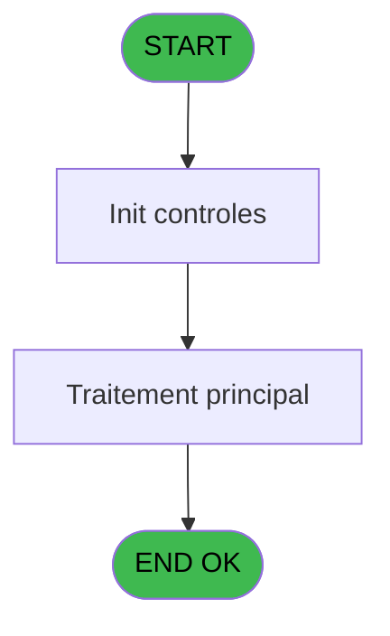
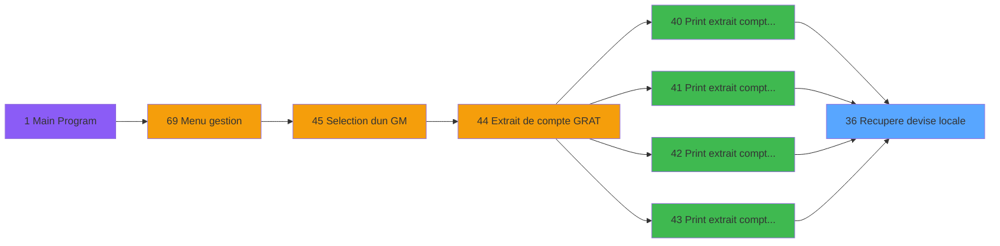

# GES IDE 36 - Recupere devise locale

> **Analyse**: Phases 1-4 2026-02-03 11:36 -> 11:36 (15s) | Assemblage 11:36
> **Pipeline**: V7.2 Enrichi
> **Structure**: 4 onglets (Resume | Ecrans | Donnees | Connexions)

<!-- TAB:Resume -->

## 1. FICHE D'IDENTITE

| Attribut | Valeur |
|----------|--------|
| Projet | GES |
| IDE Position | 36 |
| Nom Programme | Recupere devise locale |
| Fichier source | `Prg_36.xml` |
| Dossier IDE | Divers |
| Taches | 1 (0 ecrans visibles) |
| Tables modifiees | 0 |
| Programmes appeles | 0 |

## 2. DESCRIPTION FONCTIONNELLE

**Recupere devise locale** assure la gestion complete de ce processus, accessible depuis [ Print extrait compte /Nom G (IDE 40)](GES-IDE-40.md), [ Print extrait compte /Date G (IDE 41)](GES-IDE-41.md), [ Print extrait compte cumule G (IDE 42)](GES-IDE-42.md), [ Print extrait compte /imput G (IDE 43)](GES-IDE-43.md).

Le flux de traitement s'organise en **1 blocs fonctionnels** :

- **Traitement** (1 tache) : traitements metier divers

## 3. BLOCS FONCTIONNELS

### 3.1 Traitement (1 tache)

Traitements internes.

---

#### 36 - Recupere devise local

**Role** : Consultation/chargement : Recupere devise local.
**Variables liees** : A (< devise local)

## 5. REGLES METIER

*(Aucune regle metier identifiee)*

## 6. CONTEXTE

- **Appele par**: [ Print extrait compte /Nom G (IDE 40)](GES-IDE-40.md), [ Print extrait compte /Date G (IDE 41)](GES-IDE-41.md), [ Print extrait compte cumule G (IDE 42)](GES-IDE-42.md), [ Print extrait compte /imput G (IDE 43)](GES-IDE-43.md)
- **Appelle**: 0 programmes | **Tables**: 1 (W:0 R:1 L:0) | **Taches**: 1 | **Expressions**: 1

<!-- TAB:Ecrans -->

## 8. ECRANS

*(Programme sans ecran visible)*

## 9. NAVIGATION

### 9.3 Structure hierarchique (1 tache)

| Position | Tache | Type | Dimensions | Bloc |
|----------|-------|------|------------|------|
| **36.1** | [**Recupere devise local** (36)](#t1) | MDI | - | Traitement |

### 9.4 Algorigramme

> **Legende**: Vert = START/END OK | Rouge = END KO | Bleu = Decisions
> *Algorigramme auto-genere. Utiliser `/algorigramme` pour une synthese metier detaillee.*

<!-- TAB:Donnees -->

## 10. TABLES

### Tables utilisees (1)

| ID | Nom | Description | Type | R | W | L | Usages |
|----|-----|-------------|------|---|---|---|--------|
| 69 | initialisation___ini |  | DB | R |   |   | 1 |

### Colonnes par table (0 / 1 tables avec colonnes identifiees)

Table 69 - initialisation___ini (R) - 1 usages

*Table utilisee uniquement en Link ou aucune colonne Real identifiee dans le DataView.*

## 11. VARIABLES

*(Programme sans variables locales mappees)*

## 12. EXPRESSIONS

**1 / 1 expressions decodees (100%)**

### 12.1 Repartition par type

| Type | Expressions | Regles |
|------|-------------|--------|
| OTHER | 1 | 0 |

### 12.2 Expressions cles par type

#### OTHER (1 expressions)

| Type | IDE | Expression | Regle |
|------|-----|------------|-------|
| OTHER | 1 | `[B]` | - |

<!-- TAB:Connexions -->

## 13. GRAPHE D'APPELS

### 13.1 Chaine depuis Main (Callers)

Main -> ... -> [ Print extrait compte /Nom G (IDE 40)](GES-IDE-40.md) -> **Recupere devise locale (IDE 36)**

Main -> ... -> [ Print extrait compte /Date G (IDE 41)](GES-IDE-41.md) -> **Recupere devise locale (IDE 36)**

Main -> ... -> [ Print extrait compte cumule G (IDE 42)](GES-IDE-42.md) -> **Recupere devise locale (IDE 36)**

Main -> ... -> [ Print extrait compte /imput G (IDE 43)](GES-IDE-43.md) -> **Recupere devise locale (IDE 36)**

### 13.2 Callers

| IDE | Nom Programme | Nb Appels |
|-----|---------------|-----------|
| [40](GES-IDE-40.md) |  Print extrait compte /Nom G | 1 |
| [41](GES-IDE-41.md) |  Print extrait compte /Date G | 1 |
| [42](GES-IDE-42.md) |  Print extrait compte cumule G | 1 |
| [43](GES-IDE-43.md) |  Print extrait compte /imput G | 1 |

### 13.3 Callees (programmes appeles)

### 13.4 Detail Callees avec contexte

| IDE | Nom Programme | Appels | Contexte |
|-----|---------------|--------|----------|
| - | (aucun) | - | - |

## 14. RECOMMANDATIONS MIGRATION

### 14.1 Profil du programme

| Metrique | Valeur | Impact migration |
|----------|--------|-----------------|
| Lignes de logique | 5 | Programme compact |
| Expressions | 1 | Peu de logique |
| Tables WRITE | 0 | Impact faible |
| Sous-programmes | 0 | Peu de dependances |
| Ecrans visibles | 0 | Ecran unique ou traitement batch |
| Code desactive | 0% (0 / 5) | Code sain |
| Regles metier | 0 | Pas de regle identifiee |

### 14.2 Plan de migration par bloc

#### Traitement (1 tache: 0 ecran, 1 traitement)

- **Strategie** : 1 service(s) backend injectable(s) (Domain Services).
- Decomposer les taches en services unitaires testables.

### 14.3 Dependances critiques

| Dependance | Type | Appels | Impact |
|------------|------|--------|--------|

---
*Spec DETAILED generee par Pipeline V7.2 - 2026-02-03 11:36*
