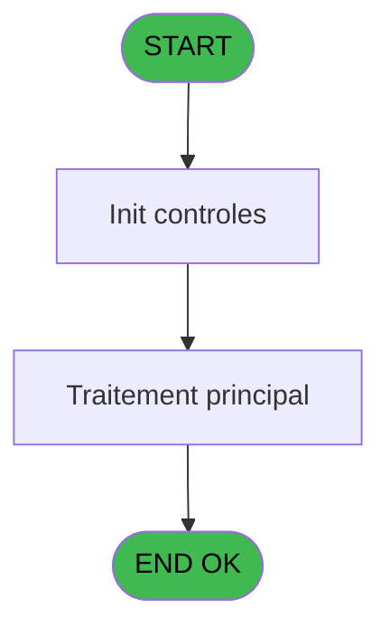
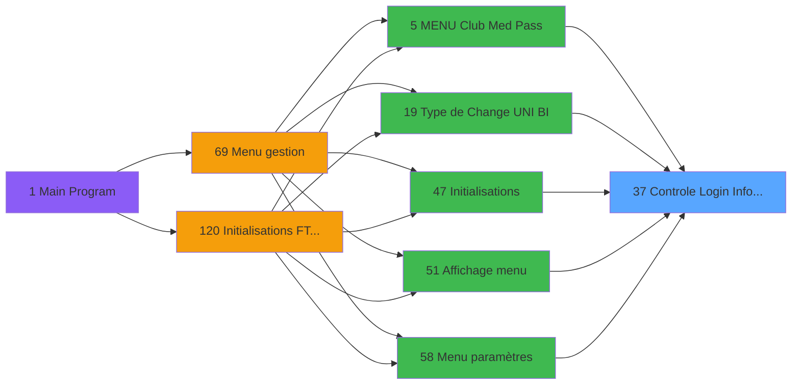

# GES IDE 37 - Controle Login Informaticien

> **Analyse**: Phases 1-4 2026-02-03 11:36 -> 11:36 (15s) | Assemblage 11:36
> **Pipeline**: V7.2 Enrichi
> **Structure**: 4 onglets (Resume | Ecrans | Donnees | Connexions)

<!-- TAB:Resume -->

## 1. FICHE D'IDENTITE

| Attribut | Valeur |
|----------|--------|
| Projet | GES |
| IDE Position | 37 |
| Nom Programme | Controle Login Informaticien |
| Fichier source | `Prg_37.xml` |
| Dossier IDE | Divers |
| Taches | 1 (0 ecrans visibles) |
| Tables modifiees | 0 |
| Programmes appeles | 0 |

## 2. DESCRIPTION FONCTIONNELLE

**Controle Login Informaticien** assure la gestion complete de ce processus, accessible depuis [Initialisations (IDE 47)](GES-IDE-47.md), [Initialisations (FTV 2.00) (IDE 120)](GES-IDE-120.md), [MENU  Club Med Pass (IDE 5)](GES-IDE-5.md), [Type de Change (UNI / BI) (IDE 19)](GES-IDE-19.md), [Affichage menu (IDE 51)](GES-IDE-51.md), [Menu paramètres (IDE 58)](GES-IDE-58.md).

Le flux de traitement s'organise en **1 blocs fonctionnels** :

- **Validation** (1 tache) : controles et verifications de coherence

## 3. BLOCS FONCTIONNELS

### 3.1 Validation (1 tache)

Controles de coherence : 1 tache verifie les donnees et conditions.

---

#### 37 - Controle Login Informaticien

**Role** : Verification : Controle Login Informaticien.

## 5. REGLES METIER

*(Aucune regle metier identifiee)*

## 6. CONTEXTE

- **Appele par**: [Initialisations (IDE 47)](GES-IDE-47.md), [Initialisations (FTV 2.00) (IDE 120)](GES-IDE-120.md), [MENU  Club Med Pass (IDE 5)](GES-IDE-5.md), [Type de Change (UNI / BI) (IDE 19)](GES-IDE-19.md), [Affichage menu (IDE 51)](GES-IDE-51.md), [Menu paramètres (IDE 58)](GES-IDE-58.md)
- **Appelle**: 0 programmes | **Tables**: 1 (W:0 R:1 L:0) | **Taches**: 1 | **Expressions**: 6

<!-- TAB:Ecrans -->

## 8. ECRANS

*(Programme sans ecran visible)*

## 9. NAVIGATION

### 9.3 Structure hierarchique (1 tache)

| Position | Tache | Type | Dimensions | Bloc |
|----------|-------|------|------------|------|
| **37.1** | [**Controle Login Informaticien** (37)](#t1) | MDI | - | Validation |

### 9.4 Algorigramme

> **Legende**: Vert = START/END OK | Rouge = END KO | Bleu = Decisions
> *Algorigramme auto-genere. Utiliser `/algorigramme` pour une synthese metier detaillee.*

<!-- TAB:Donnees -->

## 10. TABLES

### Tables utilisees (1)

| ID | Nom | Description | Type | R | W | L | Usages |
|----|-----|-------------|------|---|---|---|--------|
| 740 | pv_stock_movements | Articles et stock | DB | R |   |   | 1 |

### Colonnes par table (1 / 1 tables avec colonnes identifiees)

Table 740 - pv_stock_movements (R) - 1 usages

| Lettre | Variable | Acces | Type |
|--------|----------|-------|------|
| A | P in societe | R | Alpha |
| B | P out Accès OK | R | Logical |

## 11. VARIABLES

### 11.1 Parametres entrants (2)

Variables recues du programme appelant ([Initialisations (IDE 47)](GES-IDE-47.md)).

| Lettre | Nom | Type | Usage dans |
|--------|-----|------|-----------|
| A | P in societe | Alpha | 1x parametre entrant |
| B | P out Accès OK | Logical | - |

## 12. EXPRESSIONS

**6 / 6 expressions decodees (100%)**

### 12.1 Repartition par type

| Type | Expressions | Regles |
|------|-------------|--------|
| CAST_LOGIQUE | 2 | 0 |
| OTHER | 1 | 0 |
| REFERENCE_VG | 1 | 0 |
| CONDITION | 2 | 0 |

### 12.2 Expressions cles par type

#### CAST_LOGIQUE (2 expressions)

| Type | IDE | Expression | Regle |
|------|-----|------------|-------|
| CAST_LOGIQUE | 4 | `'TRUE'LOG` | - |
| CAST_LOGIQUE | 1 | `'FALSE'LOG` | - |

#### OTHER (1 expressions)

| Type | IDE | Expression | Regle |
|------|-----|------------|-------|
| OTHER | 2 | `P in societe [A]` | - |

#### REFERENCE_VG (1 expressions)

| Type | IDE | Expression | Regle |
|------|-----|------------|-------|
| REFERENCE_VG | 3 | `VG1` | - |

#### CONDITION (2 expressions)

| Type | IDE | Expression | Regle |
|------|-----|------------|-------|
| CONDITION | 6 | `[E]<>'INFORMATICIEN'` | - |
| CONDITION | 5 | `[E]='INFORMATICIEN'` | - |

<!-- TAB:Connexions -->

## 13. GRAPHE D'APPELS

### 13.1 Chaine depuis Main (Callers)

Main -> ... -> [Initialisations (IDE 47)](GES-IDE-47.md) -> **Controle Login Informaticien (IDE 37)**

Main -> ... -> [Initialisations (FTV 2.00) (IDE 120)](GES-IDE-120.md) -> **Controle Login Informaticien (IDE 37)**

Main -> ... -> [MENU  Club Med Pass (IDE 5)](GES-IDE-5.md) -> **Controle Login Informaticien (IDE 37)**

Main -> ... -> [Type de Change (UNI / BI) (IDE 19)](GES-IDE-19.md) -> **Controle Login Informaticien (IDE 37)**

Main -> ... -> [Affichage menu (IDE 51)](GES-IDE-51.md) -> **Controle Login Informaticien (IDE 37)**

Main -> ... -> [Menu paramètres (IDE 58)](GES-IDE-58.md) -> **Controle Login Informaticien (IDE 37)**

### 13.2 Callers

| IDE | Nom Programme | Nb Appels |
|-----|---------------|-----------|
| [47](GES-IDE-47.md) | Initialisations | 2 |
| [120](GES-IDE-120.md) | Initialisations (FTV 2.00) | 2 |
| [5](GES-IDE-5.md) | MENU  Club Med Pass | 1 |
| [19](GES-IDE-19.md) | Type de Change (UNI / BI) | 1 |
| [51](GES-IDE-51.md) | Affichage menu | 1 |
| [58](GES-IDE-58.md) | Menu paramètres | 1 |

### 13.3 Callees (programmes appeles)

### 13.4 Detail Callees avec contexte

| IDE | Nom Programme | Appels | Contexte |
|-----|---------------|--------|----------|
| - | (aucun) | - | - |

## 14. RECOMMANDATIONS MIGRATION

### 14.1 Profil du programme

| Metrique | Valeur | Impact migration |
|----------|--------|-----------------|
| Lignes de logique | 12 | Programme compact |
| Expressions | 6 | Peu de logique |
| Tables WRITE | 0 | Impact faible |
| Sous-programmes | 0 | Peu de dependances |
| Ecrans visibles | 0 | Ecran unique ou traitement batch |
| Code desactive | 0% (0 / 12) | Code sain |
| Regles metier | 0 | Pas de regle identifiee |

### 14.2 Plan de migration par bloc

#### Validation (1 tache: 0 ecran, 1 traitement)

- **Strategie** : FluentValidation avec validators specifiques.
- Chaque tache de validation -> un validator injectable

### 14.3 Dependances critiques

| Dependance | Type | Appels | Impact |
|------------|------|--------|--------|

---
*Spec DETAILED generee par Pipeline V7.2 - 2026-02-03 11:36*
