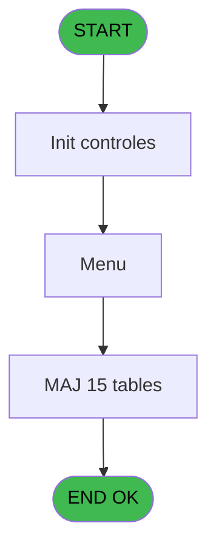
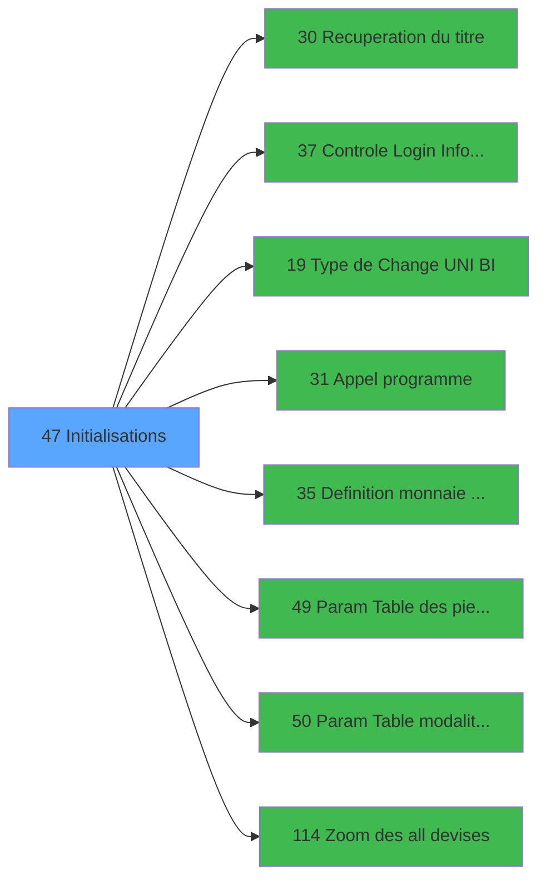

# GES IDE 47 - Initialisations

> **Analyse**: Phases 1-4 2026-02-03 11:37 -> 11:38 (14s) | Assemblage 11:38
> **Pipeline**: V7.2 Enrichi
> **Structure**: 4 onglets (Resume | Ecrans | Donnees | Connexions)

<!-- TAB:Resume -->

## 1. FICHE D'IDENTITE

| Attribut | Valeur |
|----------|--------|
| Projet | GES |
| IDE Position | 47 |
| Nom Programme | Initialisations |
| Fichier source | `Prg_47.xml` |
| Dossier IDE | Généralités |
| Taches | 61 (15 ecrans visibles) |
| Tables modifiees | 15 |
| Programmes appeles | 8 |

## 2. DESCRIPTION FONCTIONNELLE

**Initialisations** assure la gestion complete de ce processus, accessible depuis [Menu gestion (IDE 69)](GES-IDE-69.md).

Le flux de traitement s'organise en **7 blocs fonctionnels** :

- **Traitement** (40 taches) : traitements metier divers
- **Initialisation** (5 taches) : reinitialisation d'etats et de variables de travail
- **Calcul** (4 taches) : calculs de montants, stocks ou compteurs
- **Creation** (4 taches) : insertion d'enregistrements en base (mouvements, prestations)
- **Consultation** (3 taches) : ecrans de recherche, selection et consultation
- **Reglement** (3 taches) : gestion des moyens de paiement et reglements
- **Validation** (2 taches) : controles et verifications de coherence

**Donnees modifiees** : 15 tables en ecriture (reseau_cloture___rec, solde_caisse_____sks, modif__caisse____mks, parametres___par, compteurs________cpt, initialisation___ini, date_comptable___dat, param__telephone_tel, param_purge______ppu, moyen_paiement___mop, devises__________dev, table_menus_planning, tables_imports, moyen_paiement___mop, Table_1048).

Detail : phases du traitement

#### Phase 1 : Initialisation (5 taches)

- **47** - init **[[ECRAN]](#ecran-t1)**
- **47.6.1** - Lecture fichier INIT
- **47.9** - Initialisation Club **[[ECRAN]](#ecran-t47)**
- **47.6.10.1** - Init param biking
- **47.6.10.2** - Raz param

Delegue a : [Definition monnaie de'enregist (IDE 35)](GES-IDE-35.md)

#### Phase 2 : Consultation (3 taches)

- **47.1** - Affichage du menu **[[ECRAN]](#ecran-t2)**
- **47.4.4** - Zoom telephone **[[ECRAN]](#ecran-t11)**
- **47.6** - Affichage paramètres effect **[[ECRAN]](#ecran-t20)**

Delegue a : [Recuperation du titre (IDE 30)](GES-IDE-30.md), [Zoom des all devises (IDE 114)](GES-IDE-114.md)

#### Phase 3 : Traitement (40 taches)

- **47.2** - Services Informatises **[[ECRAN]](#ecran-t3)**
- **47.3** - Existe code 3536
- **47.4** - Configuration **[[ECRAN]](#ecran-t7)**
- **47.4.1** - Modif Menu Planning
- **47.4.2** - Cle electronique **[[ECRAN]](#ecran-t9)**
- **47.4.3** - Mise à Non des infos
- **47.4.5** - Modif Menu Planning
- **47.4.6** - Scroll Infos **[[ECRAN]](#ecran-t13)**
- **47.4.7** - Mise à Non des infos
- **47.4.8** - Modif Menu Planning
- **47.5** - Paramètres de purge **[[ECRAN]](#ecran-t16)**
- **47.5.1** - Affectation des Virtuelles
- **47.5.3** - Mise à Jour
- **47.6.3** - enregistrement paramètres
- **47.6.3.1** - Inhova IP Address
- **47.6.3.1.1** - Read IPCONGIG v1
- **47.6.3.1.1.1** - Trace Read
- **47.6.4** - Veuillez patienter... **[[ECRAN]](#ecran-t27)**
- **47.6.4.1** - Generation CTPID pour societe
- **47.6.4.2** - Generation $CLAS pour societe
- **47.6.4.3** - Generation $GAR  pour societe
- **47.6.4.4** - Generation DOBJ  pour societe
- **47.6.4.6.1** - Generation car 1ère fois
- **47.6.4.7.1** - Generation car 1ère fois
- **47.6.7** - CLE MAGIC **[[ECRAN]](#ecran-t40)**
- **47.9.1** - Lecture ancien solde
- **47.9.2** - ² **[[ECRAN]](#ecran-t49)**
- **47.9.4** - Mise à jour solde caisse
- **47.9.5** - Ecriture MKS
- **47.10** - Deblocage traitement v1
- **47.12** - Lecture Param Change
- **47.13** - Gestion TAI
- **47.14** - Blocage des traitements v1
- **47.6.8** - Budgets par lieu de séjour **[[ECRAN]](#ecran-t64)**
- **47.6.9** - Nombre de lit / lieu séjour **[[ECRAN]](#ecran-t68)**
- **47.15** - Blocage des traitements v1
- **47.16** - Deblocage traitement v1
- **47.6.10** - Biking **[[ECRAN]](#ecran-t86)**
- **47.6.10.3** - Màj param
- **47.6.3.2** - Màj heure libération chambre

Delegue a : [Recuperation du titre (IDE 30)](GES-IDE-30.md), [Type de Change (UNI / BI) (IDE 19)](GES-IDE-19.md), [Appel programme (IDE 31)](GES-IDE-31.md), [Param Table des pied recu (IDE 49)](GES-IDE-49.md), [Param Table modalite TVA (IDE 50)](GES-IDE-50.md)

#### Phase 4 : Creation (4 taches)

- **47.3.1** - Creation code 35
- **47.3.2** - Creation code 36
- **47.6.5** - Creat devise locale
- **47.6.6** - Creat devise locale

#### Phase 5 : Validation (2 taches)

- **47.5.2** - Validation **[[ECRAN]](#ecran-t18)**
- **47.6.2** - validation **[[ECRAN]](#ecran-t22)**

Delegue a : [Controle Login Informaticien (IDE 37)](GES-IDE-37.md)

#### Phase 6 : Reglement (3 taches)

- **47.6.4.5** - Generation DMOP  pour societe
- **47.6.4.6** - Generation $MOP  pour societe
- **47.6.4.7** - Generation $MOP  pour societe

#### Phase 7 : Calcul (4 taches)

- **47.7** - Lecture date comptable
- **47.8** - Test si ecritures comptables
- **47.9.3** - Mise à jour date comptable
- **47.11** - Mise à jour des compteurs **[[ECRAN]](#ecran-t54)**

#### Tables impactees

| Table | Operations | Role metier |
|-------|-----------|-------------|
| parametres___par | R/**W** (10 usages) |  |
| reseau_cloture___rec | **W** (4 usages) | Donnees reseau/cloture |
| Table_1048 | **W** (3 usages) |  |
| table_menus_planning | **W** (3 usages) |  |
| date_comptable___dat | R/**W** (2 usages) |  |
| tables_imports | **W** (2 usages) |  |
| initialisation___ini | R/**W** (2 usages) |  |
| param_purge______ppu | R/**W** (2 usages) |  |
| solde_caisse_____sks | R/**W** (2 usages) | Sessions de caisse |
| moyen_paiement___mop | **W**/L (2 usages) |  |
| moyen_paiement___mop | **W**/L (2 usages) |  |
| compteurs________cpt | **W** (1 usages) | Comptes GM (generaux) |
| devises__________dev | **W** (1 usages) | Devises / taux de change |
| param__telephone_tel | **W** (1 usages) |  |
| modif__caisse____mks | **W** (1 usages) | Sessions de caisse |

## 3. BLOCS FONCTIONNELS

### 3.1 Initialisation (5 taches)

Reinitialisation d'etats et variables de travail.

---

#### 47 - init [[ECRAN]](#ecran-t1)

**Role** : Reinitialisation : init.
**Ecran** : 640 x 22 DLU (MDI) | [Voir mockup](#ecran-t1)

4 sous-taches directes

| Tache | Nom | Bloc |
|-------|-----|------|
| [47.6.1](#t21) | Lecture fichier INIT | Initialisation |
| [47.9](#t47) | Initialisation Club **[[ECRAN]](#ecran-t47)** | Initialisation |
| [47.6.10.1](#t87) | Init param biking | Initialisation |
| [47.6.10.2](#t88) | Raz param | Initialisation |

**Variables liees** : CP (W1 devise initiale)
**Delegue a** : [Definition monnaie de'enregist (IDE 35)](GES-IDE-35.md)

---

#### 47.6.1 - Lecture fichier INIT

**Role** : Reinitialisation : Lecture fichier INIT.
**Variables liees** : CP (W1 devise initiale)
**Delegue a** : [Definition monnaie de'enregist (IDE 35)](GES-IDE-35.md)

---

#### 47.9 - Initialisation Club [[ECRAN]](#ecran-t47)

**Role** : Reinitialisation : Initialisation Club.
**Ecran** : 552 x 114 DLU (MDI) | [Voir mockup](#ecran-t47)
**Variables liees** : CW (W1 Nb Arrivants garantie club)
**Delegue a** : [Definition monnaie de'enregist (IDE 35)](GES-IDE-35.md)

---

#### 47.6.10.1 - Init param biking

**Role** : Reinitialisation : Init param biking.
**Variables liees** : CP (W1 devise initiale)
**Delegue a** : [Definition monnaie de'enregist (IDE 35)](GES-IDE-35.md)

---

#### 47.6.10.2 - Raz param

**Role** : Reinitialisation : Raz param.
**Delegue a** : [Definition monnaie de'enregist (IDE 35)](GES-IDE-35.md)

### 3.2 Consultation (3 taches)

Ecrans de recherche et consultation.

---

#### 47.1 - Affichage du menu [[ECRAN]](#ecran-t2)

**Role** : Reinitialisation : Affichage du menu.
**Ecran** : 797 x 217 DLU (MDI) | [Voir mockup](#ecran-t2)
**Delegue a** : [Zoom des all devises (IDE 114)](GES-IDE-114.md)

---

#### 47.4.4 - Zoom telephone [[ECRAN]](#ecran-t11)

**Role** : Selection par l'operateur : Zoom telephone.
**Ecran** : 406 x 82 DLU (MDI) | [Voir mockup](#ecran-t11)
**Variables liees** : Q (W1 telephone)
**Delegue a** : [Zoom des all devises (IDE 114)](GES-IDE-114.md)

---

#### 47.6 - Affichage paramètres effect [[ECRAN]](#ecran-t20)

**Role** : Reinitialisation : Affichage paramètres effect.
**Ecran** : 1226 x 496 DLU (MDI) | [Voir mockup](#ecran-t20)
**Delegue a** : [Zoom des all devises (IDE 114)](GES-IDE-114.md)

### 3.3 Traitement (40 taches)

Traitements internes.

---

#### 47.2 - Services Informatises [[ECRAN]](#ecran-t3)

**Role** : Traitement : Services Informatises.
**Ecran** : 552 x 216 DLU (MDI) | [Voir mockup](#ecran-t3)

---

#### 47.3 - Existe code 3536

**Role** : Traitement : Existe code 3536.
**Variables liees** : BZ (W1 Code AXIS)

---

#### 47.4 - Configuration [[ECRAN]](#ecran-t7)

**Role** : Traitement : Configuration.
**Ecran** : 549 x 227 DLU (MDI) | [Voir mockup](#ecran-t7)

---

#### 47.4.1 - Modif Menu Planning

**Role** : Traitement : Modif Menu Planning.
**Variables liees** : CQ (W1 modif ?)

---

#### 47.4.2 - Cle electronique [[ECRAN]](#ecran-t9)

**Role** : Traitement : Cle electronique.
**Ecran** : 571 x 147 DLU (MDI) | [Voir mockup](#ecran-t9)

---

#### 47.4.3 - Mise à Non des infos

**Role** : Traitement : Mise à Non des infos.

---

#### 47.4.5 - Modif Menu Planning

**Role** : Traitement : Modif Menu Planning.
**Variables liees** : CQ (W1 modif ?)

---

#### 47.4.6 - Scroll Infos [[ECRAN]](#ecran-t13)

**Role** : Traitement : Scroll Infos.
**Ecran** : 589 x 168 DLU (MDI) | [Voir mockup](#ecran-t13)
**Variables liees** : BL (W1 scroll gm od light)

---

#### 47.4.7 - Mise à Non des infos

**Role** : Traitement : Mise à Non des infos.

---

#### 47.4.8 - Modif Menu Planning

**Role** : Traitement : Modif Menu Planning.
**Variables liees** : CQ (W1 modif ?)

---

#### 47.5 - Paramètres de purge [[ECRAN]](#ecran-t16)

**Role** : Traitement : Paramètres de purge.
**Ecran** : 640 x 129 DLU (MDI) | [Voir mockup](#ecran-t16)

---

#### 47.5.1 - Affectation des Virtuelles

**Role** : Traitement : Affectation des Virtuelles.

---

#### 47.5.3 - Mise à Jour

**Role** : Traitement : Mise à Jour.
**Variables liees** : CE (W1 Jours controle), CT (b.Nb lit / lieu sejour)

---

#### 47.6.3 - enregistrement paramètres

**Role** : Traitement : enregistrement paramètres.

---

#### 47.6.3.1 - Inhova IP Address

**Role** : Traitement : Inhova IP Address.
**Variables liees** : N (W1 ADDRESS2), O (W1 ADDRESS3), BW (W1 Inhova is active)

---

#### 47.6.3.1.1 - Read IPCONGIG v1

**Role** : Traitement : Read IPCONGIG v1.

---

#### 47.6.3.1.1.1 - Trace Read

**Role** : Traitement : Trace Read.

---

#### 47.6.4 - Veuillez patienter... [[ECRAN]](#ecran-t27)

**Role** : Traitement : Veuillez patienter....
**Ecran** : 426 x 58 DLU (MDI) | [Voir mockup](#ecran-t27)

---

#### 47.6.4.1 - Generation CTPID pour societe

**Role** : Traitement : Generation CTPID pour societe.
**Variables liees** : A (P0 societe)

---

#### 47.6.4.2 - Generation $CLAS pour societe

**Role** : Traitement : Generation $CLAS pour societe.
**Variables liees** : A (P0 societe)

---

#### 47.6.4.3 - Generation $GAR  pour societe

**Role** : Traitement : Generation $GAR  pour societe.
**Variables liees** : A (P0 societe)

---

#### 47.6.4.4 - Generation DOBJ  pour societe

**Role** : Traitement : Generation DOBJ  pour societe.
**Variables liees** : A (P0 societe)

---

#### 47.6.4.6.1 - Generation car 1ère fois

**Role** : Traitement : Generation car 1ère fois.

---

#### 47.6.4.7.1 - Generation car 1ère fois

**Role** : Traitement : Generation car 1ère fois.

---

#### 47.6.7 - CLE MAGIC [[ECRAN]](#ecran-t40)

**Role** : Traitement : CLE MAGIC.
**Ecran** : 132 x 44 DLU (MDI) | [Voir mockup](#ecran-t40)
**Variables liees** : BR (W1 CLE MAGIC OK BarLimit)

---

#### 47.9.1 - Lecture ancien solde

**Role** : Consultation/chargement : Lecture ancien solde.

---

#### 47.9.2 - ² [[ECRAN]](#ecran-t49)

**Role** : Traitement interne.
**Ecran** : 76 x 8 DLU (MDI) | [Voir mockup](#ecran-t49)

---

#### 47.9.4 - Mise à jour solde caisse

**Role** : Consultation/chargement : Mise à jour solde caisse.
**Variables liees** : CE (W1 Jours controle), CT (b.Nb lit / lieu sejour)

---

#### 47.9.5 - Ecriture MKS

**Role** : Traitement : Ecriture MKS.

---

#### 47.10 - Deblocage traitement v1

**Role** : Traitement : Deblocage traitement v1.

---

#### 47.12 - Lecture Param Change

**Role** : Traitement : Lecture Param Change.
**Variables liees** : CN (W1 ret lien Change A), CO (W1 ret lien Change V), CX (W1.Taux Change Gift Pass)

---

#### 47.13 - Gestion TAI

**Role** : Gestion du moyen de paiement : Gestion TAI.

---

#### 47.14 - Blocage des traitements v1

**Role** : Traitement : Blocage des traitements v1.

---

#### 47.6.8 - Budgets par lieu de séjour [[ECRAN]](#ecran-t64)

**Role** : Consultation/chargement : Budgets par lieu de séjour.
**Ecran** : 1556 x 122 DLU (MDI) | [Voir mockup](#ecran-t64)
**Variables liees** : CS (W1 Edition eff par lieu sej ?), CT (b.Nb lit / lieu sejour)

---

#### 47.6.9 - Nombre de lit / lieu séjour [[ECRAN]](#ecran-t68)

**Role** : Calcul : Nombre de lit / lieu séjour.
**Ecran** : 658 x 122 DLU (MDI) | [Voir mockup](#ecran-t68)
**Variables liees** : CS (W1 Edition eff par lieu sej ?), CT (b.Nb lit / lieu sejour)

---

#### 47.15 - Blocage des traitements v1

**Role** : Traitement : Blocage des traitements v1.

---

#### 47.16 - Deblocage traitement v1

**Role** : Traitement : Deblocage traitement v1.

---

#### 47.6.10 - Biking [[ECRAN]](#ecran-t86)

**Role** : Traitement : Biking.
**Ecran** : 1378 x 178 DLU (MDI) | [Voir mockup](#ecran-t86)

---

#### 47.6.10.3 - Màj param

**Role** : Traitement : Màj param.

---

#### 47.6.3.2 - Màj heure libération chambre

**Role** : Traitement : Màj heure libération chambre.
**Variables liees** : U (W1 Heure libération chambre), CF (W1 Heure Debut), CG (W1 Heure Fin)

### 3.4 Creation (4 taches)

Insertion de nouveaux enregistrements en base.

---

#### 47.3.1 - Creation code 35

**Role** : Creation d'enregistrement : Creation code 35.
**Variables liees** : BZ (W1 Code AXIS)

---

#### 47.3.2 - Creation code 36

**Role** : Creation d'enregistrement : Creation code 36.
**Variables liees** : BZ (W1 Code AXIS)

---

#### 47.6.5 - Creat devise locale

**Role** : Traitement : Creat devise locale.
**Variables liees** : B (P0 devise locale), BH (W1 devise locale), CM (W1 test-lien-devise), CP (W1 devise initiale)

---

#### 47.6.6 - Creat devise locale

**Role** : Traitement : Creat devise locale.
**Variables liees** : B (P0 devise locale), BH (W1 devise locale), CM (W1 test-lien-devise), CP (W1 devise initiale)

### 3.5 Validation (2 taches)

Controles de coherence : 2 taches verifient les donnees et conditions.

---

#### 47.5.2 - Validation [[ECRAN]](#ecran-t18)

**Role** : Verification : Validation.
**Ecran** : 80 x 8 DLU (MDI) | [Voir mockup](#ecran-t18)
**Variables liees** : CK (W1 validation)
**Delegue a** : [Controle Login Informaticien (IDE 37)](GES-IDE-37.md)

---

#### 47.6.2 - validation [[ECRAN]](#ecran-t22)

**Role** : Verification : validation.
**Ecran** : 140 x 24 DLU (MDI) | [Voir mockup](#ecran-t22)
**Variables liees** : CK (W1 validation)
**Delegue a** : [Controle Login Informaticien (IDE 37)](GES-IDE-37.md)

### 3.6 Reglement (3 taches)

Gestion des moyens de paiement : 3 taches de reglement.

---

#### 47.6.4.5 - Generation DMOP  pour societe

**Role** : Traitement : Generation DMOP  pour societe.
**Variables liees** : A (P0 societe)

---

#### 47.6.4.6 - Generation $MOP  pour societe

**Role** : Traitement : Generation $MOP  pour societe.
**Variables liees** : A (P0 societe)

---

#### 47.6.4.7 - Generation $MOP  pour societe

**Role** : Traitement : Generation $MOP  pour societe.
**Variables liees** : A (P0 societe)

### 3.7 Calcul (4 taches)

Calculs metier : montants, stocks, compteurs.

---

#### 47.7 - Lecture date comptable

**Role** : Traitement : Lecture date comptable.
**Variables liees** : L (W0 Ecrit. comptable), M (W0 date comptable)

---

#### 47.8 - Test si ecritures comptables

**Role** : Verification : Test si ecritures comptables.
**Variables liees** : CM (W1 test-lien-devise)

---

#### 47.9.3 - Mise à jour date comptable

**Role** : Traitement : Mise à jour date comptable.
**Variables liees** : L (W0 Ecrit. comptable), M (W0 date comptable), CE (W1 Jours controle), CT (b.Nb lit / lieu sejour)

---

#### 47.11 - Mise à jour des compteurs [[ECRAN]](#ecran-t54)

**Role** : Calcul : Mise à jour des compteurs.
**Ecran** : 555 x 214 DLU (MDI) | [Voir mockup](#ecran-t54)
**Variables liees** : CE (W1 Jours controle), CT (b.Nb lit / lieu sejour)

## 5. REGLES METIER

*(Aucune regle metier identifiee)*

## 6. CONTEXTE

- **Appele par**: [Menu gestion (IDE 69)](GES-IDE-69.md)
- **Appelle**: 8 programmes | **Tables**: 31 (W:15 R:10 L:14) | **Taches**: 61 | **Expressions**: 19

<!-- TAB:Ecrans -->

## 8. ECRANS

### 8.1 Forms visibles (15 / 61)

| # | Position | Tache | Nom | Type | Largeur | Hauteur | Bloc |
|---|----------|-------|-----|------|---------|---------|------|
| 1 | 47.1 | 47.1 | Affichage du menu | MDI | 797 | 217 | Consultation |
| 2 | 47.2 | 47.2 | Services Informatises | MDI | 552 | 216 | Traitement |
| 3 | 47.4 | 47.4 | Configuration | MDI | 549 | 227 | Traitement |
| 4 | 47.4.2 | 47.4.2 | Cle electronique | MDI | 571 | 147 | Traitement |
| 5 | 47.4.4 | 47.4.4 | Zoom telephone | MDI | 406 | 82 | Consultation |
| 6 | 47.4.6 | 47.4.6 | Scroll Infos | MDI | 589 | 168 | Traitement |
| 7 | 47.5 | 47.5 | Paramètres de purge | MDI | 640 | 129 | Traitement |
| 8 | 47.6 | 47.6 | Affichage paramètres effect | MDI | 1226 | 496 | Consultation |
| 9 | 47.6.5 | 47.6.4 | Veuillez patienter... | MDI | 426 | 58 | Traitement |
| 10 | 47.6.8 | 47.6.7 | CLE MAGIC | MDI | 132 | 44 | Traitement |
| 11 | 47.11 | 47.9 | Initialisation Club | MDI | 552 | 114 | Initialisation |
| 12 | 47.14 | 47.11 | Mise à jour des compteurs | MDI | 555 | 214 | Calcul |
| 13 | 47.6.1 | 47.6.8 | Budgets par lieu de séjour | MDI | 1556 | 122 | Traitement |
| 14 | 47.6.9 | 47.6.9 | Nombre de lit / lieu séjour | MDI | 658 | 122 | Traitement |
| 15 | 47.6.10 | 47.6.10 | Biking | MDI | 1378 | 178 | Traitement |

### 8.2 Mockups Ecrans

---

#### 47.1 - Affichage du menu
**Tache** : [47.1](#t2) | **Type** : MDI | **Dimensions** : 797 x 217 DLU
**Bloc** : Consultation | **Titre IDE** : Affichage du menu

<!-- FORM-DATA:
{
    "width":  797,
    "vFactor":  8,
    "type":  "MDI",
    "hFactor":  8,
    "controls":  [
                     {
                         "x":  0,
                         "type":  "label",
                         "var":  "",
                         "y":  0,
                         "w":  796,
                         "fmt":  "",
                         "name":  "",
                         "h":  18,
                         "color":  "",
                         "text":  "",
                         "parent":  null
                     },
                     {
                         "x":  24,
                         "type":  "label",
                         "var":  "",
                         "y":  33,
                         "w":  748,
                         "fmt":  "",
                         "name":  "",
                         "h":  144,
                         "color":  "",
                         "text":  "",
                         "parent":  null
                     },
                     {
                         "x":  26,
                         "type":  "label",
                         "var":  "",
                         "y":  34,
                         "w":  745,
                         "fmt":  "",
                         "name":  "",
                         "h":  142,
                         "color":  "",
                         "text":  "",
                         "parent":  null
                     },
                     {
                         "x":  225,
                         "type":  "label",
                         "var":  "",
                         "y":  46,
                         "w":  514,
                         "fmt":  "",
                         "name":  "",
                         "h":  106,
                         "color":  "",
                         "text":  "",
                         "parent":  null
                     },
                     {
                         "x":  228,
                         "type":  "label",
                         "var":  "",
                         "y":  47,
                         "w":  45,
                         "fmt":  "",
                         "name":  "",
                         "h":  104,
                         "color":  "",
                         "text":  "",
                         "parent":  null
                     },
                     {
                         "x":  289,
                         "type":  "label",
                         "var":  "",
                         "y":  51,
                         "w":  274,
                         "fmt":  "",
                         "name":  "",
                         "h":  8,
                         "color":  "7",
                         "text":  "Services informatisés",
                         "parent":  null
                     },
                     {
                         "x":  289,
                         "type":  "label",
                         "var":  "",
                         "y":  65,
                         "w":  274,
                         "fmt":  "",
                         "name":  "",
                         "h":  8,
                         "color":  "7",
                         "text":  "Configuration",
                         "parent":  null
                     },
                     {
                         "x":  289,
                         "type":  "label",
                         "var":  "",
                         "y":  79,
                         "w":  274,
                         "fmt":  "",
                         "name":  "",
                         "h":  8,
                         "color":  "7",
                         "text":  "Paramètres de Purge",
                         "parent":  null
                     },
                     {
                         "x":  289,
                         "type":  "label",
                         "var":  "",
                         "y":  93,
                         "w":  274,
                         "fmt":  "",
                         "name":  "",
                         "h":  8,
                         "color":  "7",
                         "text":  "Initialisation Village",
                         "parent":  null
                     },
                     {
                         "x":  289,
                         "type":  "label",
                         "var":  "",
                         "y":  107,
                         "w":  274,
                         "fmt":  "",
                         "name":  "",
                         "h":  8,
                         "color":  "7",
                         "text":  "Initialisation Caisse",
                         "parent":  null
                     },
                     {
                         "x":  289,
                         "type":  "label",
                         "var":  "",
                         "y":  121,
                         "w":  274,
                         "fmt":  "",
                         "name":  "",
                         "h":  8,
                         "color":  "7",
                         "text":  "Type de change",
                         "parent":  null
                     },
                     {
                         "x":  289,
                         "type":  "label",
                         "var":  "",
                         "y":  135,
                         "w":  274,
                         "fmt":  "",
                         "name":  "",
                         "h":  8,
                         "color":  "7",
                         "text":  "Maj des compteurs",
                         "parent":  null
                     },
                     {
                         "x":  361,
                         "type":  "label",
                         "var":  "",
                         "y":  160,
                         "w":  123,
                         "fmt":  "",
                         "name":  "",
                         "h":  10,
                         "color":  "",
                         "text":  "Votre choix",
                         "parent":  null
                     },
                     {
                         "x":  0,
                         "type":  "label",
                         "var":  "",
                         "y":  194,
                         "w":  795,
                         "fmt":  "",
                         "name":  "",
                         "h":  23,
                         "color":  "",
                         "text":  "",
                         "parent":  null
                     },
                     {
                         "x":  495,
                         "type":  "edit",
                         "var":  "",
                         "y":  160,
                         "w":  26,
                         "fmt":  "UA",
                         "name":  "W1 choix action",
                         "h":  10,
                         "color":  "6",
                         "text":  "",
                         "parent":  null
                     },
                     {
                         "x":  6,
                         "type":  "edit",
                         "var":  "",
                         "y":  4,
                         "w":  267,
                         "fmt":  "20",
                         "name":  "",
                         "h":  8,
                         "color":  "",
                         "text":  "",
                         "parent":  null
                     },
                     {
                         "x":  587,
                         "type":  "edit",
                         "var":  "",
                         "y":  4,
                         "w":  203,
                         "fmt":  "WWW DD MMM YYYYT",
                         "name":  "",
                         "h":  8,
                         "color":  "",
                         "text":  "",
                         "parent":  null
                     },
                     {
                         "x":  45,
                         "type":  "image",
                         "var":  "",
                         "y":  40,
                         "w":  160,
                         "fmt":  "",
                         "name":  "",
                         "h":  35,
                         "color":  "",
                         "text":  "",
                         "parent":  null
                     },
                     {
                         "x":  239,
                         "type":  "button",
                         "var":  "",
                         "y":  50,
                         "w":  26,
                         "fmt":  "1",
                         "name":  "1",
                         "h":  8,
                         "color":  "",
                         "text":  "",
                         "parent":  null
                     },
                     {
                         "x":  239,
                         "type":  "button",
                         "var":  "",
                         "y":  65,
                         "w":  26,
                         "fmt":  "2",
                         "name":  "2",
                         "h":  8,
                         "color":  "",
                         "text":  "",
                         "parent":  null
                     },
                     {
                         "x":  573,
                         "type":  "image",
                         "var":  "",
                         "y":  72,
                         "w":  147,
                         "fmt":  "",
                         "name":  "",
                         "h":  62,
                         "color":  "",
                         "text":  "",
                         "parent":  7
                     },
                     {
                         "x":  239,
                         "type":  "button",
                         "var":  "",
                         "y":  79,
                         "w":  26,
                         "fmt":  "3",
                         "name":  "3",
                         "h":  8,
                         "color":  "",
                         "text":  "",
                         "parent":  null
                     },
                     {
                         "x":  239,
                         "type":  "button",
                         "var":  "",
                         "y":  93,
                         "w":  26,
                         "fmt":  "4",
                         "name":  "4",
                         "h":  8,
                         "color":  "",
                         "text":  "",
                         "parent":  null
                     },
                     {
                         "x":  239,
                         "type":  "button",
                         "var":  "",
                         "y":  107,
                         "w":  26,
                         "fmt":  "5",
                         "name":  "5",
                         "h":  8,
                         "color":  "",
                         "text":  "",
                         "parent":  null
                     },
                     {
                         "x":  239,
                         "type":  "button",
                         "var":  "",
                         "y":  121,
                         "w":  26,
                         "fmt":  "6",
                         "name":  "6",
                         "h":  8,
                         "color":  "",
                         "text":  "",
                         "parent":  null
                     },
                     {
                         "x":  239,
                         "type":  "button",
                         "var":  "",
                         "y":  135,
                         "w":  26,
                         "fmt":  "7",
                         "name":  "7",
                         "h":  8,
                         "color":  "",
                         "text":  "",
                         "parent":  null
                     },
                     {
                         "x":  117,
                         "type":  "edit",
                         "var":  "",
                         "y":  182,
                         "w":  562,
                         "fmt":  "",
                         "name":  "",
                         "h":  8,
                         "color":  "143",
                         "text":  "",
                         "parent":  null
                     },
                     {
                         "x":  8,
                         "type":  "button",
                         "var":  "",
                         "y":  196,
                         "w":  168,
                         "fmt":  "\u0026Quitter",
                         "name":  "",
                         "h":  18,
                         "color":  "",
                         "text":  "",
                         "parent":  null
                     }
                 ],
    "taskId":  "47.1",
    "height":  217
}
-->

<strong>Champs : 4 champs</strong>

| Pos (x,y) | Nom | Variable | Type |
|-----------|-----|----------|------|
| 495,160 | W1 choix action | - | edit |
| 6,4 | 20 | - | edit |
| 587,4 | WWW DD MMM YYYYT | - | edit |
| 117,182 | (sans nom) | - | edit |

<strong>Boutons : 8 boutons</strong>

| Bouton | Pos (x,y) | Action |
|--------|-----------|--------|
| 1 | 239,50 | Bouton fonctionnel |
| 2 | 239,65 | Bouton fonctionnel |
| 3 | 239,79 | Bouton fonctionnel |
| 4 | 239,93 | Bouton fonctionnel |
| 5 | 239,107 | Bouton fonctionnel |
| 6 | 239,121 | Bouton fonctionnel |
| 7 | 239,135 | Bouton fonctionnel |
| Quitter | 8,196 | Quitte le programme |

---

#### 47.2 - Services Informatises
**Tache** : [47.2](#t3) | **Type** : MDI | **Dimensions** : 552 x 216 DLU
**Bloc** : Traitement | **Titre IDE** : Services Informatises

<!-- FORM-DATA:
{
    "width":  552,
    "vFactor":  8,
    "type":  "MDI",
    "hFactor":  8,
    "controls":  [
                     {
                         "x":  0,
                         "type":  "label",
                         "var":  "",
                         "y":  2,
                         "w":  551,
                         "fmt":  "",
                         "name":  "",
                         "h":  18,
                         "color":  "",
                         "text":  "",
                         "parent":  null
                     },
                     {
                         "x":  28,
                         "type":  "table",
                         "var":  "",
                         "name":  "",
                         "titleH":  12,
                         "color":  "110",
                         "w":  496,
                         "y":  25,
                         "fmt":  "",
                         "parent":  null,
                         "text":  "",
                         "rowH":  14,
                         "h":  157,
                         "cols":  [
                                      {
                                          "title":  "Intitulé",
                                          "layer":  1,
                                          "w":  365
                                      },
                                      {
                                          "title":  "Utilisation",
                                          "layer":  2,
                                          "w":  97
                                      }
                                  ],
                         "rows":  2
                     },
                     {
                         "x":  0,
                         "type":  "label",
                         "var":  "",
                         "y":  192,
                         "w":  551,
                         "fmt":  "",
                         "name":  "",
                         "h":  24,
                         "color":  "",
                         "text":  "",
                         "parent":  null
                     },
                     {
                         "x":  35,
                         "type":  "edit",
                         "var":  "",
                         "y":  41,
                         "w":  344,
                         "fmt":  "",
                         "name":  "",
                         "h":  8,
                         "color":  "110",
                         "text":  "",
                         "parent":  4
                     },
                     {
                         "x":  440,
                         "type":  "edit",
                         "var":  "",
                         "y":  41,
                         "w":  19,
                         "fmt":  "",
                         "name":  "PAR utilis. village",
                         "h":  8,
                         "color":  "110",
                         "text":  "",
                         "parent":  4
                     },
                     {
                         "x":  6,
                         "type":  "edit",
                         "var":  "",
                         "y":  6,
                         "w":  267,
                         "fmt":  "20",
                         "name":  "",
                         "h":  8,
                         "color":  "",
                         "text":  "",
                         "parent":  null
                     },
                     {
                         "x":  304,
                         "type":  "edit",
                         "var":  "",
                         "y":  7,
                         "w":  237,
                         "fmt":  "WWW DD MMM YYYYZ",
                         "name":  "",
                         "h":  8,
                         "color":  "",
                         "text":  "",
                         "parent":  null
                     },
                     {
                         "x":  7,
                         "type":  "button",
                         "var":  "",
                         "y":  195,
                         "w":  154,
                         "fmt":  "\u0026Quitter",
                         "name":  "",
                         "h":  18,
                         "color":  "",
                         "text":  "",
                         "parent":  null
                     }
                 ],
    "taskId":  "47.2",
    "height":  216
}
-->

<strong>Champs : 4 champs</strong>

| Pos (x,y) | Nom | Variable | Type |
|-----------|-----|----------|------|
| 35,41 | (sans nom) | - | edit |
| 440,41 | PAR utilis. village | - | edit |
| 6,6 | 20 | - | edit |
| 304,7 | WWW DD MMM YYYYZ | - | edit |

<strong>Boutons : 1 boutons</strong>

| Bouton | Pos (x,y) | Action |
|--------|-----------|--------|
| Quitter | 7,195 | Quitte le programme |

---

#### 47.4 - Configuration
**Tache** : [47.4](#t7) | **Type** : MDI | **Dimensions** : 549 x 227 DLU
**Bloc** : Traitement | **Titre IDE** : Configuration

<!-- FORM-DATA:
{
    "width":  549,
    "vFactor":  8,
    "type":  "MDI",
    "hFactor":  8,
    "controls":  [
                     {
                         "x":  0,
                         "type":  "label",
                         "var":  "",
                         "y":  2,
                         "w":  548,
                         "fmt":  "",
                         "name":  "",
                         "h":  18,
                         "color":  "",
                         "text":  "",
                         "parent":  null
                     },
                     {
                         "x":  0,
                         "type":  "label",
                         "var":  "",
                         "y":  203,
                         "w":  549,
                         "fmt":  "",
                         "name":  "",
                         "h":  24,
                         "color":  "",
                         "text":  "",
                         "parent":  null
                     },
                     {
                         "x":  30,
                         "type":  "table",
                         "var":  "",
                         "name":  "",
                         "titleH":  12,
                         "color":  "110",
                         "w":  497,
                         "y":  27,
                         "fmt":  "",
                         "parent":  null,
                         "text":  "",
                         "rowH":  14,
                         "h":  171,
                         "cols":  [
                                      {
                                          "title":  "Intitulé",
                                          "layer":  1,
                                          "w":  365
                                      },
                                      {
                                          "title":  "Utilisation",
                                          "layer":  2,
                                          "w":  97
                                      }
                                  ],
                         "rows":  2
                     },
                     {
                         "x":  8,
                         "type":  "edit",
                         "var":  "",
                         "y":  7,
                         "w":  267,
                         "fmt":  "20",
                         "name":  "",
                         "h":  8,
                         "color":  "",
                         "text":  "",
                         "parent":  null
                     },
                     {
                         "x":  304,
                         "type":  "edit",
                         "var":  "",
                         "y":  7,
                         "w":  237,
                         "fmt":  "WWW DD MMM YYYYT",
                         "name":  "",
                         "h":  8,
                         "color":  "",
                         "text":  "",
                         "parent":  null
                     },
                     {
                         "x":  8,
                         "type":  "button",
                         "var":  "",
                         "y":  206,
                         "w":  154,
                         "fmt":  "\u0026Quitter",
                         "name":  "",
                         "h":  18,
                         "color":  "",
                         "text":  "",
                         "parent":  null
                     },
                     {
                         "x":  36,
                         "type":  "edit",
                         "var":  "",
                         "y":  43,
                         "w":  344,
                         "fmt":  "",
                         "name":  "par_intitule",
                         "h":  8,
                         "color":  "110",
                         "text":  "",
                         "parent":  25
                     },
                     {
                         "x":  441,
                         "type":  "edit",
                         "var":  "",
                         "y":  43,
                         "w":  19,
                         "fmt":  "",
                         "name":  "PAR utilis. village",
                         "h":  8,
                         "color":  "110",
                         "text":  "",
                         "parent":  25
                     }
                 ],
    "taskId":  "47.4",
    "height":  227
}
-->

<strong>Champs : 4 champs</strong>

| Pos (x,y) | Nom | Variable | Type |
|-----------|-----|----------|------|
| 8,7 | 20 | - | edit |
| 304,7 | WWW DD MMM YYYYT | - | edit |
| 36,43 | par_intitule | - | edit |
| 441,43 | PAR utilis. village | - | edit |

<strong>Boutons : 1 boutons</strong>

| Bouton | Pos (x,y) | Action |
|--------|-----------|--------|
| Quitter | 8,206 | Quitte le programme |

---

#### 47.4.2 - Cle electronique
**Tache** : [47.4.2](#t9) | **Type** : MDI | **Dimensions** : 571 x 147 DLU
**Bloc** : Traitement | **Titre IDE** : Cle electronique

<!-- FORM-DATA:
{
    "width":  571,
    "vFactor":  8,
    "type":  "MDI",
    "hFactor":  8,
    "controls":  [
                     {
                         "x":  1,
                         "type":  "label",
                         "var":  "",
                         "y":  122,
                         "w":  568,
                         "fmt":  "",
                         "name":  "",
                         "h":  24,
                         "color":  "",
                         "text":  "",
                         "parent":  null
                     },
                     {
                         "x":  7,
                         "type":  "table",
                         "var":  "",
                         "name":  "",
                         "titleH":  12,
                         "color":  "110",
                         "w":  555,
                         "y":  4,
                         "fmt":  "",
                         "parent":  null,
                         "text":  "",
                         "rowH":  14,
                         "h":  114,
                         "cols":  [
                                      {
                                          "title":  "Intitulé",
                                          "layer":  1,
                                          "w":  365
                                      },
                                      {
                                          "title":  "Utilisation Village",
                                          "layer":  2,
                                          "w":  158
                                      }
                                  ],
                         "rows":  2
                     },
                     {
                         "x":  8,
                         "type":  "button",
                         "var":  "",
                         "y":  125,
                         "w":  154,
                         "fmt":  "\u0026Quitter",
                         "name":  "",
                         "h":  18,
                         "color":  "",
                         "text":  "",
                         "parent":  null
                     },
                     {
                         "x":  13,
                         "type":  "edit",
                         "var":  "",
                         "y":  20,
                         "w":  344,
                         "fmt":  "",
                         "name":  "par_intitule",
                         "h":  8,
                         "color":  "110",
                         "text":  "",
                         "parent":  19
                     },
                     {
                         "x":  418,
                         "type":  "edit",
                         "var":  "",
                         "y":  20,
                         "w":  19,
                         "fmt":  "",
                         "name":  "PAR utilis. village",
                         "h":  8,
                         "color":  "110",
                         "text":  "",
                         "parent":  19
                     }
                 ],
    "taskId":  "47.4.2",
    "height":  147
}
-->

<strong>Champs : 2 champs</strong>

| Pos (x,y) | Nom | Variable | Type |
|-----------|-----|----------|------|
| 13,20 | par_intitule | - | edit |
| 418,20 | PAR utilis. village | - | edit |

<strong>Boutons : 1 boutons</strong>

| Bouton | Pos (x,y) | Action |
|--------|-----------|--------|
| Quitter | 8,125 | Quitte le programme |

---

#### 47.4.4 - Zoom telephone
**Tache** : [47.4.4](#t11) | **Type** : MDI | **Dimensions** : 406 x 82 DLU
**Bloc** : Consultation | **Titre IDE** : Zoom telephone

<!-- FORM-DATA:
{
    "width":  406,
    "vFactor":  8,
    "type":  "MDI",
    "hFactor":  8,
    "controls":  [
                     {
                         "x":  9,
                         "type":  "label",
                         "var":  "",
                         "y":  2,
                         "w":  388,
                         "fmt":  "",
                         "name":  "",
                         "h":  49,
                         "color":  "",
                         "text":  "",
                         "parent":  null
                     },
                     {
                         "x":  65,
                         "type":  "label",
                         "var":  "",
                         "y":  21,
                         "w":  232,
                         "fmt":  "",
                         "name":  "",
                         "h":  8,
                         "color":  "",
                         "text":  "Téléphone carte mémoire",
                         "parent":  null
                     },
                     {
                         "x":  1,
                         "type":  "label",
                         "var":  "",
                         "y":  58,
                         "w":  403,
                         "fmt":  "",
                         "name":  "",
                         "h":  24,
                         "color":  "",
                         "text":  "",
                         "parent":  null
                     },
                     {
                         "x":  315,
                         "type":  "edit",
                         "var":  "",
                         "y":  21,
                         "w":  26,
                         "fmt":  "UA",
                         "name":  "TEL telephone CAM",
                         "h":  10,
                         "color":  "6",
                         "text":  "",
                         "parent":  null
                     },
                     {
                         "x":  9,
                         "type":  "button",
                         "var":  "",
                         "y":  61,
                         "w":  154,
                         "fmt":  "\u0026Ok",
                         "name":  "",
                         "h":  18,
                         "color":  "",
                         "text":  "",
                         "parent":  null
                     }
                 ],
    "taskId":  "47.4.4",
    "height":  82
}
-->

<strong>Champs : 1 champs</strong>

| Pos (x,y) | Nom | Variable | Type |
|-----------|-----|----------|------|
| 315,21 | TEL telephone CAM | - | edit |

<strong>Boutons : 1 boutons</strong>

| Bouton | Pos (x,y) | Action |
|--------|-----------|--------|
| Ok | 9,61 | Valide la saisie et enregistre |

---

#### 47.4.6 - Scroll Infos
**Tache** : [47.4.6](#t13) | **Type** : MDI | **Dimensions** : 589 x 168 DLU
**Bloc** : Traitement | **Titre IDE** : Scroll Infos

<!-- FORM-DATA:
{
    "width":  589,
    "vFactor":  8,
    "type":  "MDI",
    "hFactor":  8,
    "controls":  [
                     {
                         "x":  1,
                         "type":  "label",
                         "var":  "",
                         "y":  144,
                         "w":  586,
                         "fmt":  "",
                         "name":  "",
                         "h":  24,
                         "color":  "",
                         "text":  "",
                         "parent":  null
                     },
                     {
                         "x":  16,
                         "type":  "table",
                         "var":  "",
                         "name":  "",
                         "titleH":  12,
                         "color":  "110",
                         "w":  555,
                         "y":  5,
                         "fmt":  "",
                         "parent":  null,
                         "text":  "",
                         "rowH":  14,
                         "h":  128,
                         "cols":  [
                                      {
                                          "title":  "Intitulé",
                                          "layer":  1,
                                          "w":  365
                                      },
                                      {
                                          "title":  "Utilisation Village",
                                          "layer":  2,
                                          "w":  158
                                      }
                                  ],
                         "rows":  2
                     },
                     {
                         "x":  11,
                         "type":  "button",
                         "var":  "",
                         "y":  147,
                         "w":  154,
                         "fmt":  "\u0026Quitter",
                         "name":  "",
                         "h":  18,
                         "color":  "",
                         "text":  "",
                         "parent":  null
                     },
                     {
                         "x":  22,
                         "type":  "edit",
                         "var":  "",
                         "y":  21,
                         "w":  344,
                         "fmt":  "",
                         "name":  "par_intitule",
                         "h":  8,
                         "color":  "110",
                         "text":  "",
                         "parent":  19
                     },
                     {
                         "x":  427,
                         "type":  "edit",
                         "var":  "",
                         "y":  21,
                         "w":  19,
                         "fmt":  "",
                         "name":  "PAR utilis. village",
                         "h":  8,
                         "color":  "110",
                         "text":  "",
                         "parent":  19
                     }
                 ],
    "taskId":  "47.4.6",
    "height":  168
}
-->

<strong>Champs : 2 champs</strong>

| Pos (x,y) | Nom | Variable | Type |
|-----------|-----|----------|------|
| 22,21 | par_intitule | - | edit |
| 427,21 | PAR utilis. village | - | edit |

<strong>Boutons : 1 boutons</strong>

| Bouton | Pos (x,y) | Action |
|--------|-----------|--------|
| Quitter | 11,147 | Quitte le programme |

---

#### 47.5 - Paramètres de purge
**Tache** : [47.5](#t16) | **Type** : MDI | **Dimensions** : 640 x 129 DLU
**Bloc** : Traitement | **Titre IDE** : Paramètres de purge

<!-- FORM-DATA:
{
    "width":  640,
    "vFactor":  8,
    "type":  "MDI",
    "hFactor":  8,
    "controls":  [
                     {
                         "x":  4,
                         "type":  "label",
                         "var":  "",
                         "y":  2,
                         "w":  634,
                         "fmt":  "",
                         "name":  "",
                         "h":  16,
                         "color":  "",
                         "text":  "",
                         "parent":  null
                     },
                     {
                         "x":  8,
                         "type":  "label",
                         "var":  "",
                         "y":  29,
                         "w":  625,
                         "fmt":  "",
                         "name":  "",
                         "h":  36,
                         "color":  "",
                         "text":  "",
                         "parent":  null
                     },
                     {
                         "x":  20,
                         "type":  "label",
                         "var":  "",
                         "y":  35,
                         "w":  461,
                         "fmt":  "",
                         "name":  "",
                         "h":  8,
                         "color":  "4",
                         "text":  "Nb de Jours de garde",
                         "parent":  null
                     },
                     {
                         "x":  353,
                         "type":  "label",
                         "var":  "",
                         "y":  42,
                         "w":  48,
                         "fmt":  "",
                         "name":  "",
                         "h":  8,
                         "color":  "",
                         "text":  " Jours",
                         "parent":  null
                     },
                     {
                         "x":  20,
                         "type":  "label",
                         "var":  "",
                         "y":  43,
                         "w":  234,
                         "fmt":  "",
                         "name":  "",
                         "h":  8,
                         "color":  "4",
                         "text":  "des sauvegardes avant purge",
                         "parent":  null
                     },
                     {
                         "x":  8,
                         "type":  "label",
                         "var":  "",
                         "y":  65,
                         "w":  625,
                         "fmt":  "",
                         "name":  "",
                         "h":  34,
                         "color":  "",
                         "text":  "",
                         "parent":  null
                     },
                     {
                         "x":  341,
                         "type":  "label",
                         "var":  "",
                         "y":  76,
                         "w":  48,
                         "fmt":  "",
                         "name":  "",
                         "h":  10,
                         "color":  "",
                         "text":  " Jours",
                         "parent":  13
                     },
                     {
                         "x":  28,
                         "type":  "label",
                         "var":  "",
                         "y":  76,
                         "w":  264,
                         "fmt":  "",
                         "name":  "",
                         "h":  10,
                         "color":  "4",
                         "text":  "Délai Minimum entre 2 Purges",
                         "parent":  13
                     },
                     {
                         "x":  0,
                         "type":  "label",
                         "var":  "",
                         "y":  104,
                         "w":  639,
                         "fmt":  "",
                         "name":  "",
                         "h":  24,
                         "color":  "",
                         "text":  "",
                         "parent":  null
                     },
                     {
                         "x":  292,
                         "type":  "edit",
                         "var":  "",
                         "y":  42,
                         "w":  59,
                         "fmt":  "",
                         "name":  "",
                         "h":  10,
                         "color":  "6",
                         "text":  "",
                         "parent":  null
                     },
                     {
                         "x":  302,
                         "type":  "edit",
                         "var":  "",
                         "y":  76,
                         "w":  37,
                         "fmt":  "",
                         "name":  "",
                         "h":  10,
                         "color":  "6",
                         "text":  "",
                         "parent":  13
                     },
                     {
                         "x":  5,
                         "type":  "button",
                         "var":  "",
                         "y":  107,
                         "w":  154,
                         "fmt":  "\u0026Ok",
                         "name":  "",
                         "h":  18,
                         "color":  "",
                         "text":  "",
                         "parent":  17
                     },
                     {
                         "x":  429,
                         "type":  "edit",
                         "var":  "",
                         "y":  5,
                         "w":  203,
                         "fmt":  "WWW DD MMM YYYYT",
                         "name":  "",
                         "h":  8,
                         "color":  "",
                         "text":  "",
                         "parent":  null
                     },
                     {
                         "x":  166,
                         "type":  "button",
                         "var":  "",
                         "y":  107,
                         "w":  154,
                         "fmt":  "A\u0026bandonner",
                         "name":  "",
                         "h":  18,
                         "color":  "",
                         "text":  "",
                         "parent":  17
                     },
                     {
                         "x":  8,
                         "type":  "edit",
                         "var":  "",
                         "y":  5,
                         "w":  267,
                         "fmt":  "20",
                         "name":  "",
                         "h":  8,
                         "color":  "",
                         "text":  "",
                         "parent":  null
                     }
                 ],
    "taskId":  "47.5",
    "height":  129
}
-->

<strong>Champs : 4 champs</strong>

| Pos (x,y) | Nom | Variable | Type |
|-----------|-----|----------|------|
| 292,42 | (sans nom) | - | edit |
| 302,76 | (sans nom) | - | edit |
| 429,5 | WWW DD MMM YYYYT | - | edit |
| 8,5 | 20 | - | edit |

<strong>Boutons : 2 boutons</strong>

| Bouton | Pos (x,y) | Action |
|--------|-----------|--------|
| Ok | 5,107 | Valide la saisie et enregistre |
| Abandonner | 166,107 | Annule et retour au menu |

---

#### 47.6 - Affichage paramètres effect
**Tache** : [47.6](#t20) | **Type** : MDI | **Dimensions** : 1226 x 496 DLU
**Bloc** : Consultation | **Titre IDE** : Affichage paramètres effect

<!-- FORM-DATA:
{
    "width":  1226,
    "vFactor":  8,
    "type":  "MDI",
    "hFactor":  8,
    "controls":  [
                     {
                         "x":  0,
                         "type":  "label",
                         "var":  "",
                         "y":  0,
                         "w":  1221,
                         "fmt":  "",
                         "name":  "",
                         "h":  16,
                         "color":  "",
                         "text":  "",
                         "parent":  null
                     },
                     {
                         "x":  2,
                         "type":  "label",
                         "var":  "",
                         "y":  16,
                         "w":  600,
                         "fmt":  "",
                         "name":  "",
                         "h":  448,
                         "color":  "",
                         "text":  "",
                         "parent":  null
                     },
                     {
                         "x":  601,
                         "type":  "line",
                         "var":  "",
                         "y":  16,
                         "w":  0,
                         "fmt":  "",
                         "name":  "",
                         "h":  448,
                         "color":  "",
                         "text":  "",
                         "parent":  null
                     },
                     {
                         "x":  603,
                         "type":  "label",
                         "var":  "",
                         "y":  16,
                         "w":  619,
                         "fmt":  "",
                         "name":  "",
                         "h":  453,
                         "color":  "",
                         "text":  "",
                         "parent":  null
                     },
                     {
                         "x":  11,
                         "type":  "label",
                         "var":  "",
                         "y":  19,
                         "w":  320,
                         "fmt":  "",
                         "name":  "",
                         "h":  10,
                         "color":  "142",
                         "text":  "   VILLAGE IDENTIFICATION",
                         "parent":  null
                     },
                     {
                         "x":  618,
                         "type":  "label",
                         "var":  "",
                         "y":  19,
                         "w":  315,
                         "fmt":  "",
                         "name":  "",
                         "h":  10,
                         "color":  "142",
                         "text":  "   SPECIFIC PARAMETERS",
                         "parent":  null
                     },
                     {
                         "x":  8,
                         "type":  "label",
                         "var":  "",
                         "y":  29,
                         "w":  584,
                         "fmt":  "",
                         "name":  "",
                         "h":  237,
                         "color":  "195",
                         "text":  "Adress.",
                         "parent":  null
                     },
                     {
                         "x":  627,
                         "type":  "label",
                         "var":  "",
                         "y":  52,
                         "w":  576,
                         "fmt":  "",
                         "name":  "",
                         "h":  22,
                         "color":  "195",
                         "text":  "Od.",
                         "parent":  254
                     },
                     {
                         "x":  640,
                         "type":  "label",
                         "var":  "",
                         "y":  60,
                         "w":  144,
                         "fmt":  "",
                         "name":  "",
                         "h":  12,
                         "color":  "",
                         "text":  "Edition des Ods",
                         "parent":  11
                     },
                     {
                         "x":  877,
                         "type":  "label",
                         "var":  "",
                         "y":  60,
                         "w":  219,
                         "fmt":  "",
                         "name":  "",
                         "h":  12,
                         "color":  "",
                         "text":  "Liste des GM dans OD Light",
                         "parent":  11
                     },
                     {
                         "x":  19,
                         "type":  "label",
                         "var":  "",
                         "y":  39,
                         "w":  149,
                         "fmt":  "",
                         "name":  "",
                         "h":  9,
                         "color":  "",
                         "text":  "Code comptabilité",
                         "parent":  10
                     },
                     {
                         "x":  19,
                         "type":  "label",
                         "var":  "",
                         "y":  51,
                         "w":  149,
                         "fmt":  "",
                         "name":  "",
                         "h":  9,
                         "color":  "",
                         "text":  "Code lieu de sejour",
                         "parent":  10
                     },
                     {
                         "x":  627,
                         "type":  "label",
                         "var":  "",
                         "y":  79,
                         "w":  576,
                         "fmt":  "",
                         "name":  "",
                         "h":  36,
                         "color":  "195",
                         "text":  "Versionning.",
                         "parent":  254
                     },
                     {
                         "x":  640,
                         "type":  "label",
                         "var":  "",
                         "y":  89,
                         "w":  240,
                         "fmt":  "",
                         "name":  "",
                         "h":  12,
                         "color":  "",
                         "text":  "Gestion des versions",
                         "parent":  19
                     },
                     {
                         "x":  19,
                         "type":  "label",
                         "var":  "",
                         "y":  63,
                         "w":  149,
                         "fmt":  "",
                         "name":  "",
                         "h":  9,
                         "color":  "",
                         "text":  "Club Med",
                         "parent":  10
                     },
                     {
                         "x":  640,
                         "type":  "label",
                         "var":  "",
                         "y":  101,
                         "w":  240,
                         "fmt":  "",
                         "name":  "",
                         "h":  12,
                         "color":  "",
                         "text":  "Gestion des locks",
                         "parent":  19
                     },
                     {
                         "x":  19,
                         "type":  "label",
                         "var":  "",
                         "y":  124,
                         "w":  149,
                         "fmt":  "",
                         "name":  "",
                         "h":  9,
                         "color":  "",
                         "text":  "Nom",
                         "parent":  10
                     },
                     {
                         "x":  19,
                         "type":  "label",
                         "var":  "",
                         "y":  136,
                         "w":  149,
                         "fmt":  "",
                         "name":  "",
                         "h":  9,
                         "color":  "",
                         "text":  "Address 1",
                         "parent":  10
                     },
                     {
                         "x":  627,
                         "type":  "label",
                         "var":  "",
                         "y":  120,
                         "w":  576,
                         "fmt":  "",
                         "name":  "",
                         "h":  131,
                         "color":  "195",
                         "text":  "Divers.",
                         "parent":  254
                     },
                     {
                         "x":  640,
                         "type":  "label",
                         "var":  "",
                         "y":  131,
                         "w":  240,
                         "fmt":  "",
                         "name":  "",
                         "h":  12,
                         "color":  "",
                         "text":  "Fiscalisation Grecque",
                         "parent":  28
                     },
                     {
                         "x":  19,
                         "type":  "label",
                         "var":  "",
                         "y":  148,
                         "w":  149,
                         "fmt":  "",
                         "name":  "",
                         "h":  9,
                         "color":  "",
                         "text":  "Address 2",
                         "parent":  10
                     },
                     {
                         "x":  640,
                         "type":  "label",
                         "var":  "",
                         "y":  146,
                         "w":  240,
                         "fmt":  "",
                         "name":  "",
                         "h":  12,
                         "color":  "",
                         "text":  "Synchronisation Date / Heure",
                         "parent":  28
                     },
                     {
                         "x":  19,
                         "type":  "label",
                         "var":  "",
                         "y":  160,
                         "w":  149,
                         "fmt":  "",
                         "name":  "",
                         "h":  9,
                         "color":  "",
                         "text":  "Address 3",
                         "parent":  10
                     },
                     {
                         "x":  19,
                         "type":  "label",
                         "var":  "",
                         "y":  172,
                         "w":  149,
                         "fmt":  "",
                         "name":  "",
                         "h":  9,
                         "color":  "",
                         "text":  "Zip \u0026 City",
                         "parent":  10
                     },
                     {
                         "x":  640,
                         "type":  "label",
                         "var":  "",
                         "y":  161,
                         "w":  134,
                         "fmt":  "",
                         "name":  "",
                         "h":  12,
                         "color":  "",
                         "text":  "Age for alcohol",
                         "parent":  28
                     },
                     {
                         "x":  891,
                         "type":  "label",
                         "var":  "",
                         "y":  161,
                         "w":  245,
                         "fmt":  "",
                         "name":  "",
                         "h":  12,
                         "color":  "",
                         "text":  "Nombre jours contrôle integrité",
                         "parent":  28
                     },
                     {
                         "x":  19,
                         "type":  "label",
                         "var":  "",
                         "y":  184,
                         "w":  149,
                         "fmt":  "",
                         "name":  "",
                         "h":  9,
                         "color":  "",
                         "text":  "Tel",
                         "parent":  10
                     },
                     {
                         "x":  19,
                         "type":  "label",
                         "var":  "",
                         "y":  196,
                         "w":  149,
                         "fmt":  "",
                         "name":  "",
                         "h":  9,
                         "color":  "",
                         "text":  "Fax",
                         "parent":  10
                     },
                     {
                         "x":  627,
                         "type":  "label",
                         "var":  "",
                         "y":  256,
                         "w":  576,
                         "fmt":  "",
                         "name":  "",
                         "h":  25,
                         "color":  "195",
                         "text":  " Bar Limit.",
                         "parent":  254
                     },
                     {
                         "x":  761,
                         "type":  "label",
                         "var":  "",
                         "y":  266,
                         "w":  152,
                         "fmt":  "",
                         "name":  "",
                         "h":  12,
                         "color":  "2",
                         "text":  "Bar Limit Activation",
                         "parent":  46
                     },
                     {
                         "x":  1016,
                         "type":  "label",
                         "var":  "",
                         "y":  266,
                         "w":  132,
                         "fmt":  "",
                         "name":  "",
                         "h":  12,
                         "color":  "2",
                         "text":  "Age for Bar Limit",
                         "parent":  46
                     },
                     {
                         "x":  19,
                         "type":  "label",
                         "var":  "",
                         "y":  208,
                         "w":  149,
                         "fmt":  "",
                         "name":  "",
                         "h":  9,
                         "color":  "",
                         "text":  "Siret",
                         "parent":  10
                     },
                     {
                         "x":  19,
                         "type":  "label",
                         "var":  "",
                         "y":  220,
                         "w":  149,
                         "fmt":  "",
                         "name":  "",
                         "h":  9,
                         "color":  "",
                         "text":  "Email",
                         "parent":  10
                     },
                     {
                         "x":  627,
                         "type":  "label",
                         "var":  "",
                         "y":  286,
                         "w":  576,
                         "fmt":  "",
                         "name":  "",
                         "h":  23,
                         "color":  "195",
                         "text":  " Tai.",
                         "parent":  254
                     },
                     {
                         "x":  8,
                         "type":  "label",
                         "var":  "",
                         "y":  347,
                         "w":  584,
                         "fmt":  "",
                         "name":  "",
                         "h":  62,
                         "color":  "195",
                         "text":  "Vat.",
                         "parent":  null
                     },
                     {
                         "x":  627,
                         "type":  "label",
                         "var":  "",
                         "y":  313,
                         "w":  576,
                         "fmt":  "",
                         "name":  "",
                         "h":  25,
                         "color":  "195",
                         "text":  "Ski Insurance.",
                         "parent":  254
                     },
                     {
                         "x":  19,
                         "type":  "label",
                         "var":  "",
                         "y":  357,
                         "w":  106,
                         "fmt":  "",
                         "name":  "",
                         "h":  9,
                         "color":  "",
                         "text":  "Vat number",
                         "parent":  55
                     },
                     {
                         "x":  640,
                         "type":  "label",
                         "var":  "",
                         "y":  323,
                         "w":  141,
                         "fmt":  "",
                         "name":  "",
                         "h":  10,
                         "color":  "",
                         "text":  "Insurance number",
                         "parent":  56
                     },
                     {
                         "x":  19,
                         "type":  "label",
                         "var":  "",
                         "y":  370,
                         "w":  106,
                         "fmt":  "",
                         "name":  "",
                         "h":  9,
                         "color":  "",
                         "text":  "Vat value",
                         "parent":  55
                     },
                     {
                         "x":  8,
                         "type":  "label",
                         "var":  "",
                         "y":  409,
                         "w":  584,
                         "fmt":  "",
                         "name":  "",
                         "h":  49,
                         "color":  "195",
                         "text":  "Currency.",
                         "parent":  null
                     },
                     {
                         "x":  626,
                         "type":  "label",
                         "var":  "",
                         "y":  48,
                         "w":  576,
                         "fmt":  "",
                         "name":  "",
                         "h":  98,
                         "color":  "195",
                         "text":  "Interfaces.",
                         "parent":  254
                     },
                     {
                         "x":  19,
                         "type":  "label",
                         "var":  "",
                         "y":  419,
                         "w":  149,
                         "fmt":  "",
                         "name":  "",
                         "h":  10,
                         "color":  "",
                         "text":  "Devise locale",
                         "parent":  63
                     },
                     {
                         "x":  635,
                         "type":  "label",
                         "var":  "",
                         "y":  58,
                         "w":  110,
                         "fmt":  "",
                         "name":  "",
                         "h":  12,
                         "color":  "",
                         "text":  "Room Lock",
                         "parent":  64
                     },
                     {
                         "x":  1051,
                         "type":  "label",
                         "var":  "",
                         "y":  58,
                         "w":  49,
                         "fmt":  "",
                         "name":  "",
                         "h":  12,
                         "color":  "",
                         "text":  "TPE",
                         "parent":  64
                     },
                     {
                         "x":  19,
                         "type":  "label",
                         "var":  "",
                         "y":  432,
                         "w":  170,
                         "fmt":  "",
                         "name":  "",
                         "h":  10,
                         "color":  "",
                         "text":  "Nombre de décimales",
                         "parent":  63
                     },
                     {
                         "x":  0,
                         "type":  "label",
                         "var":  "",
                         "y":  470,
                         "w":  1221,
                         "fmt":  "",
                         "name":  "",
                         "h":  24,
                         "color":  "",
                         "text":  "",
                         "parent":  null
                     },
                     {
                         "x":  10,
                         "type":  "label",
                         "var":  "",
                         "y":  267,
                         "w":  584,
                         "fmt":  "",
                         "name":  "",
                         "h":  80,
                         "color":  "195",
                         "text":  "Budget",
                         "parent":  null
                     },
                     {
                         "x":  21,
                         "type":  "label",
                         "var":  "",
                         "y":  289,
                         "w":  78,
                         "fmt":  "",
                         "name":  "",
                         "h":  9,
                         "color":  "",
                         "text":  "Total JHP",
                         "parent":  177
                     },
                     {
                         "x":  21,
                         "type":  "label",
                         "var":  "",
                         "y":  300,
                         "w":  106,
                         "fmt":  "",
                         "name":  "",
                         "h":  9,
                         "color":  "",
                         "text":  "Total JH VRL",
                         "parent":  177
                     },
                     {
                         "x":  21,
                         "type":  "label",
                         "var":  "",
                         "y":  311,
                         "w":  80,
                         "fmt":  "",
                         "name":  "",
                         "h":  9,
                         "color":  "",
                         "text":  "Total JHD",
                         "parent":  177
                     },
                     {
                         "x":  19,
                         "type":  "label",
                         "var":  "",
                         "y":  75,
                         "w":  152,
                         "fmt":  "",
                         "name":  "",
                         "h":  12,
                         "color":  "2",
                         "text":  "Village saisonnier",
                         "parent":  10
                     },
                     {
                         "x":  19,
                         "type":  "label",
                         "var":  "",
                         "y":  88,
                         "w":  149,
                         "fmt":  "",
                         "name":  "",
                         "h":  9,
                         "color":  "",
                         "text":  "Date ouverture",
                         "parent":  10
                     },
                     {
                         "x":  19,
                         "type":  "label",
                         "var":  "",
                         "y":  100,
                         "w":  149,
                         "fmt":  "",
                         "name":  "",
                         "h":  9,
                         "color":  "",
                         "text":  "Date fermeture",
                         "parent":  10
                     },
                     {
                         "x":  19,
                         "type":  "label",
                         "var":  "",
                         "y":  112,
                         "w":  165,
                         "fmt":  "",
                         "name":  "",
                         "h":  9,
                         "color":  "",
                         "text":  "Nb lits commercialisés",
                         "parent":  10
                     },
                     {
                         "x":  626,
                         "type":  "label",
                         "var":  "",
                         "y":  148,
                         "w":  576,
                         "fmt":  "",
                         "name":  "",
                         "h":  24,
                         "color":  "195",
                         "text":  "Exclusion Interfaces VOD.",
                         "parent":  254
                     },
                     {
                         "x":  635,
                         "type":  "label",
                         "var":  "",
                         "y":  158,
                         "w":  162,
                         "fmt":  "",
                         "name":  "",
                         "h":  10,
                         "color":  "",
                         "text":  "Heure Début",
                         "parent":  194
                     },
                     {
                         "x":  928,
                         "type":  "label",
                         "var":  "",
                         "y":  158,
                         "w":  106,
                         "fmt":  "",
                         "name":  "",
                         "h":  10,
                         "color":  "",
                         "text":  "Heure Fin",
                         "parent":  194
                     },
                     {
                         "x":  635,
                         "type":  "label",
                         "var":  "",
                         "y":  74,
                         "w":  110,
                         "fmt":  "",
                         "name":  "",
                         "h":  10,
                         "color":  "",
                         "text":  "Code Psp",
                         "parent":  64
                     },
                     {
                         "x":  635,
                         "type":  "label",
                         "var":  "",
                         "y":  87,
                         "w":  81,
                         "fmt":  "",
                         "name":  "",
                         "h":  12,
                         "color":  "",
                         "text":  "Code Axis",
                         "parent":  64
                     },
                     {
                         "x":  635,
                         "type":  "label",
                         "var":  "",
                         "y":  101,
                         "w":  205,
                         "fmt":  "",
                         "name":  "",
                         "h":  12,
                         "color":  "",
                         "text":  "Numéro commerçant EMV",
                         "parent":  64
                     },
                     {
                         "x":  625,
                         "type":  "label",
                         "var":  "",
                         "y":  173,
                         "w":  576,
                         "fmt":  "",
                         "name":  "",
                         "h":  30,
                         "color":  "195",
                         "text":  "Pilotage Hebdomadaire",
                         "parent":  254
                     },
                     {
                         "x":  635,
                         "type":  "label",
                         "var":  "",
                         "y":  184,
                         "w":  120,
                         "fmt":  "",
                         "name":  "",
                         "h":  12,
                         "color":  "",
                         "text":  "Type Boutique",
                         "parent":  208
                     },
                     {
                         "x":  936,
                         "type":  "label",
                         "var":  "",
                         "y":  184,
                         "w":  69,
                         "fmt":  "",
                         "name":  "",
                         "h":  12,
                         "color":  "",
                         "text":  "Service",
                         "parent":  208
                     },
                     {
                         "x":  635,
                         "type":  "label",
                         "var":  "",
                         "y":  117,
                         "w":  214,
                         "fmt":  "",
                         "name":  "",
                         "h":  12,
                         "color":  "",
                         "text":  "Numéro commerçant AMEX",
                         "parent":  64
                     },
                     {
                         "x":  635,
                         "type":  "label",
                         "var":  "",
                         "y":  132,
                         "w":  205,
                         "fmt":  "",
                         "name":  "",
                         "h":  12,
                         "color":  "",
                         "text":  "Numéro commerçant VAD",
                         "parent":  64
                     },
                     {
                         "x":  625,
                         "type":  "label",
                         "var":  "",
                         "y":  204,
                         "w":  576,
                         "fmt":  "",
                         "name":  "",
                         "h":  38,
                         "color":  "195",
                         "text":  "Porte-monnaie électronique",
                         "parent":  254
                     },
                     {
                         "x":  635,
                         "type":  "label",
                         "var":  "",
                         "y":  215,
                         "w":  246,
                         "fmt":  "",
                         "name":  "",
                         "h":  12,
                         "color":  "",
                         "text":  "Montant maximum / versement",
                         "parent":  221
                     },
                     {
                         "x":  635,
                         "type":  "label",
                         "var":  "",
                         "y":  228,
                         "w":  246,
                         "fmt":  "",
                         "name":  "",
                         "h":  12,
                         "color":  "",
                         "text":  "Total  maximum de versement",
                         "parent":  221
                     },
                     {
                         "x":  192,
                         "type":  "label",
                         "var":  "",
                         "y":  278,
                         "w":  88,
                         "fmt":  "",
                         "name":  "",
                         "h":  9,
                         "color":  "",
                         "text":  "Semestre 1",
                         "parent":  177
                     },
                     {
                         "x":  421,
                         "type":  "label",
                         "var":  "",
                         "y":  278,
                         "w":  88,
                         "fmt":  "",
                         "name":  "",
                         "h":  9,
                         "color":  "",
                         "text":  "Semestre 2",
                         "parent":  177
                     },
                     {
                         "x":  19,
                         "type":  "label",
                         "var":  "",
                         "y":  444,
                         "w":  200,
                         "fmt":  "",
                         "name":  "",
                         "h":  10,
                         "color":  "",
                         "text":  "Taux de change Gift Pass",
                         "parent":  63
                     },
                     {
                         "x":  19,
                         "type":  "label",
                         "var":  "",
                         "y":  395,
                         "w":  242,
                         "fmt":  "",
                         "name":  "",
                         "h":  12,
                         "color":  "",
                         "text":  "Edition sur extrait de compte ?",
                         "parent":  55
                     },
                     {
                         "x":  19,
                         "type":  "label",
                         "var":  "",
                         "y":  381,
                         "w":  242,
                         "fmt":  "",
                         "name":  "",
                         "h":  12,
                         "color":  "",
                         "text":  "Edition sur vente réception ?",
                         "parent":  55
                     },
                     {
                         "x":  640,
                         "type":  "label",
                         "var":  "",
                         "y":  176,
                         "w":  510,
                         "fmt":  "",
                         "name":  "",
                         "h":  12,
                         "color":  "",
                         "text":  "Nombre de comptes pour affecter automatiquement la garantie club",
                         "parent":  28
                     },
                     {
                         "x":  640,
                         "type":  "label",
                         "var":  "",
                         "y":  191,
                         "w":  317,
                         "fmt":  "",
                         "name":  "",
                         "h":  12,
                         "color":  "",
                         "text":  "Délai d\u0027enregistrement d\u0027un VSL (en jours)",
                         "parent":  28
                     },
                     {
                         "x":  19,
                         "type":  "label",
                         "var":  "",
                         "y":  233,
                         "w":  165,
                         "fmt":  "",
                         "name":  "",
                         "h":  9,
                         "color":  "",
                         "text":  "Email Assurance",
                         "parent":  10
                     },
                     {
                         "x":  628,
                         "type":  "label",
                         "var":  "",
                         "y":  245,
                         "w":  576,
                         "fmt":  "",
                         "name":  "",
                         "h":  23,
                         "color":  "195",
                         "text":  "VAD",
                         "parent":  254
                     },
                     {
                         "x":  638,
                         "type":  "label",
                         "var":  "",
                         "y":  254,
                         "w":  386,
                         "fmt":  "",
                         "name":  "",
                         "h":  12,
                         "color":  "",
                         "text":  "Délai d\u0027expiration des paiements VAD (jours)",
                         "parent":  244
                     },
                     {
                         "x":  640,
                         "type":  "label",
                         "var":  "",
                         "y":  206,
                         "w":  286,
                         "fmt":  "",
                         "name":  "",
                         "h":  12,
                         "color":  "",
                         "text":  "Montant plafond AAJ (devise locale)",
                         "parent":  28
                     },
                     {
                         "x":  640,
                         "type":  "label",
                         "var":  "",
                         "y":  221,
                         "w":  286,
                         "fmt":  "",
                         "name":  "",
                         "h":  12,
                         "color":  "",
                         "text":  "Plafond FDR",
                         "parent":  28
                     },
                     {
                         "x":  640,
                         "type":  "label",
                         "var":  "",
                         "y":  236,
                         "w":  286,
                         "fmt":  "",
                         "name":  "",
                         "h":  12,
                         "color":  "",
                         "text":  "Plafond FDR Coffre 2",
                         "parent":  28
                     },
                     {
                         "x":  11,
                         "type":  "button",
                         "var":  "",
                         "y":  475,
                         "w":  196,
                         "fmt":  "\u0026Ok",
                         "name":  "Bouton Ok",
                         "h":  18,
                         "color":  "",
                         "text":  "",
                         "parent":  72
                     },
                     {
                         "x":  191,
                         "type":  "edit",
                         "var":  "",
                         "y":  39,
                         "w":  80,
                         "fmt":  "",
                         "name":  "W1 code village 3",
                         "h":  10,
                         "color":  "6",
                         "text":  "",
                         "parent":  10
                     },
                     {
                         "x":  191,
                         "type":  "edit",
                         "var":  "",
                         "y":  51,
                         "w":  80,
                         "fmt":  "",
                         "name":  "W1 code village 6",
                         "h":  10,
                         "color":  "6",
                         "text":  "",
                         "parent":  10
                     },
                     {
                         "x":  191,
                         "type":  "edit",
                         "var":  "",
                         "y":  63,
                         "w":  200,
                         "fmt":  "30",
                         "name":  "W1 CLUBMED",
                         "h":  10,
                         "color":  "6",
                         "text":  "",
                         "parent":  10
                     },
                     {
                         "x":  191,
                         "type":  "combobox",
                         "var":  "",
                         "y":  75,
                         "w":  80,
                         "fmt":  "",
                         "name":  "W1.Village saisonnier ?_0001",
                         "h":  12,
                         "color":  "",
                         "text":  "O,N",
                         "parent":  10
                     },
                     {
                         "x":  189,
                         "type":  "edit",
                         "var":  "",
                         "y":  88,
                         "w":  126,
                         "fmt":  "##/##/####Z",
                         "name":  "W1.Date ouverture_0001",
                         "h":  10,
                         "color":  "6",
                         "text":  "",
                         "parent":  10
                     },
                     {
                         "x":  318,
                         "type":  "button",
                         "var":  "",
                         "y":  88,
                         "w":  38,
                         "fmt":  "...",
                         "name":  "b.Date ouverture",
                         "h":  10,
                         "color":  "",
                         "text":  "",
                         "parent":  10
                     },
                     {
                         "x":  189,
                         "type":  "edit",
                         "var":  "",
                         "y":  100,
                         "w":  126,
                         "fmt":  "##/##/####Z",
                         "name":  "W1.Date fermeture_0001",
                         "h":  10,
                         "color":  "6",
                         "text":  "",
                         "parent":  10
                     },
                     {
                         "x":  318,
                         "type":  "button",
                         "var":  "",
                         "y":  100,
                         "w":  38,
                         "fmt":  "...",
                         "name":  "b.Date fermeture",
                         "h":  10,
                         "color":  "",
                         "text":  "",
                         "parent":  10
                     },
                     {
                         "x":  189,
                         "type":  "edit",
                         "var":  "",
                         "y":  112,
                         "w":  80,
                         "fmt":  "5Z",
                         "name":  "W1.Nb lit commercialisés_0001",
                         "h":  10,
                         "color":  "6",
                         "text":  "",
                         "parent":  10
                     },
                     {
                         "x":  189,
                         "type":  "edit",
                         "var":  "",
                         "y":  124,
                         "w":  400,
                         "fmt":  "",
                         "name":  "W1 nom village",
                         "h":  10,
                         "color":  "6",
                         "text":  "",
                         "parent":  10
                     },
                     {
                         "x":  189,
                         "type":  "edit",
                         "var":  "",
                         "y":  136,
                         "w":  400,
                         "fmt":  "128",
                         "name":  "W1 ADDRESS1",
                         "h":  10,
                         "color":  "6",
                         "text":  "",
                         "parent":  10
                     },
                     {
                         "x":  189,
                         "type":  "edit",
                         "var":  "",
                         "y":  148,
                         "w":  400,
                         "fmt":  "128",
                         "name":  "W1 ADDRESS2",
                         "h":  10,
                         "color":  "6",
                         "text":  "",
                         "parent":  10
                     },
                     {
                         "x":  189,
                         "type":  "edit",
                         "var":  "",
                         "y":  160,
                         "w":  400,
                         "fmt":  "128",
                         "name":  "W1 ADDRESS3",
                         "h":  10,
                         "color":  "6",
                         "text":  "",
                         "parent":  10
                     },
                     {
                         "x":  189,
                         "type":  "edit",
                         "var":  "",
                         "y":  172,
                         "w":  400,
                         "fmt":  "128",
                         "name":  "W1 ZIPCITY",
                         "h":  10,
                         "color":  "6",
                         "text":  "",
                         "parent":  10
                     },
                     {
                         "x":  189,
                         "type":  "edit",
                         "var":  "",
                         "y":  184,
                         "w":  400,
                         "fmt":  "30",
                         "name":  "W1 telephone",
                         "h":  10,
                         "color":  "6",
                         "text":  "",
                         "parent":  10
                     },
                     {
                         "x":  189,
                         "type":  "edit",
                         "var":  "",
                         "y":  196,
                         "w":  400,
                         "fmt":  "30",
                         "name":  "W1 fax",
                         "h":  10,
                         "color":  "6",
                         "text":  "",
                         "parent":  10
                     },
                     {
                         "x":  189,
                         "type":  "edit",
                         "var":  "",
                         "y":  208,
                         "w":  400,
                         "fmt":  "128",
                         "name":  "W1 SIRET",
                         "h":  10,
                         "color":  "6",
                         "text":  "",
                         "parent":  10
                     },
                     {
                         "x":  189,
                         "type":  "edit",
                         "var":  "",
                         "y":  220,
                         "w":  400,
                         "fmt":  "128",
                         "name":  "W1 ADRESSEMAIL",
                         "h":  10,
                         "color":  "6",
                         "text":  "",
                         "parent":  10
                     },
                     {
                         "x":  189,
                         "type":  "edit",
                         "var":  "",
                         "y":  233,
                         "w":  400,
                         "fmt":  "128",
                         "name":  "W1.Email Assurance_0001",
                         "h":  10,
                         "color":  "6",
                         "text":  "",
                         "parent":  10
                     },
                     {
                         "x":  438,
                         "type":  "edit",
                         "var":  "",
                         "y":  256,
                         "w":  74,
                         "fmt":  "HH:MMZ A",
                         "name":  "W1 Heure libération chambre",
                         "h":  10,
                         "color":  "6",
                         "text":  "",
                         "parent":  10
                     },
                     {
                         "x":  146,
                         "type":  "edit",
                         "var":  "",
                         "y":  289,
                         "w":  200,
                         "fmt":  "N12.3Z",
                         "name":  "W1.Budget total JHP_0001",
                         "h":  10,
                         "color":  "6",
                         "text":  "",
                         "parent":  177
                     },
                     {
                         "x":  146,
                         "type":  "edit",
                         "var":  "",
                         "y":  300,
                         "w":  200,
                         "fmt":  "N12.3Z",
                         "name":  "W1.Budget total JH VRL_0001",
                         "h":  10,
                         "color":  "6",
                         "text":  "",
                         "parent":  177
                     },
                     {
                         "x":  146,
                         "type":  "edit",
                         "var":  "",
                         "y":  311,
                         "w":  200,
                         "fmt":  "N12.3Z",
                         "name":  "W1.Budget total JHD_0001",
                         "h":  10,
                         "color":  "6",
                         "text":  "",
                         "parent":  177
                     },
                     {
                         "x":  146,
                         "type":  "edit",
                         "var":  "",
                         "y":  357,
                         "w":  200,
                         "fmt":  "30",
                         "name":  "W1 VAT NUMBER",
                         "h":  10,
                         "color":  "6",
                         "text":  "",
                         "parent":  55
                     },
                     {
                         "x":  146,
                         "type":  "edit",
                         "var":  "",
                         "y":  369,
                         "w":  200,
                         "fmt":  "2.2Z",
                         "name":  "W1 VAT VALUE",
                         "h":  10,
                         "color":  "6",
                         "text":  "",
                         "parent":  55
                     },
                     {
                         "x":  230,
                         "type":  "edit",
                         "var":  "",
                         "y":  419,
                         "w":  40,
                         "fmt":  "",
                         "name":  "W1 devise locale",
                         "h":  10,
                         "color":  "6",
                         "text":  "",
                         "parent":  63
                     },
                     {
                         "x":  333,
                         "type":  "edit",
                         "var":  "",
                         "y":  419,
                         "w":  232,
                         "fmt":  "",
                         "name":  "",
                         "h":  10,
                         "color":  "7",
                         "text":  "",
                         "parent":  63
                     },
                     {
                         "x":  230,
                         "type":  "edit",
                         "var":  "",
                         "y":  432,
                         "w":  40,
                         "fmt":  "1A",
                         "name":  "W1 nbre decimales",
                         "h":  10,
                         "color":  "6",
                         "text":  "",
                         "parent":  63
                     },
                     {
                         "x":  768,
                         "type":  "combobox",
                         "var":  "",
                         "y":  60,
                         "w":  88,
                         "fmt":  "",
                         "name":  "W1 edition des ods",
                         "h":  12,
                         "color":  "",
                         "text":  "",
                         "parent":  11
                     },
                     {
                         "x":  1099,
                         "type":  "combobox",
                         "var":  "",
                         "y":  60,
                         "w":  88,
                         "fmt":  "",
                         "name":  "W1 scroll gm od light",
                         "h":  12,
                         "color":  "",
                         "text":  "",
                         "parent":  11
                     },
                     {
                         "x":  889,
                         "type":  "combobox",
                         "var":  "",
                         "y":  89,
                         "w":  88,
                         "fmt":  "",
                         "name":  "W1 version",
                         "h":  12,
                         "color":  "",
                         "text":  "",
                         "parent":  19
                     },
                     {
                         "x":  889,
                         "type":  "combobox",
                         "var":  "",
                         "y":  101,
                         "w":  88,
                         "fmt":  "",
                         "name":  "W1 locks",
                         "h":  12,
                         "color":  "",
                         "text":  "",
                         "parent":  19
                     },
                     {
                         "x":  891,
                         "type":  "combobox",
                         "var":  "",
                         "y":  133,
                         "w":  88,
                         "fmt":  "",
                         "name":  "W1 fiscalisation grec",
                         "h":  12,
                         "color":  "",
                         "text":  "",
                         "parent":  28
                     },
                     {
                         "x":  891,
                         "type":  "combobox",
                         "var":  "",
                         "y":  147,
                         "w":  88,
                         "fmt":  "",
                         "name":  "W1 net Time",
                         "h":  12,
                         "color":  "",
                         "text":  "",
                         "parent":  28
                     },
                     {
                         "x":  768,
                         "type":  "edit",
                         "var":  "",
                         "y":  161,
                         "w":  39,
                         "fmt":  "",
                         "name":  "W1 Age mineur",
                         "h":  12,
                         "color":  "6",
                         "text":  "",
                         "parent":  28
                     },
                     {
                         "x":  1144,
                         "type":  "edit",
                         "var":  "",
                         "y":  161,
                         "w":  45,
                         "fmt":  "",
                         "name":  "W1 Jours controle",
                         "h":  12,
                         "color":  "6",
                         "text":  "",
                         "parent":  28
                     },
                     {
                         "x":  640,
                         "type":  "button",
                         "var":  "",
                         "y":  266,
                         "w":  120,
                         "fmt":  "",
                         "name":  "Bouton Bar Limit",
                         "h":  12,
                         "color":  "",
                         "text":  "",
                         "parent":  46
                     },
                     {
                         "x":  921,
                         "type":  "combobox",
                         "var":  "",
                         "y":  266,
                         "w":  88,
                         "fmt":  "",
                         "name":  "W1 Activation Bar Limit",
                         "h":  12,
                         "color":  "",
                         "text":  "",
                         "parent":  46
                     },
                     {
                         "x":  1152,
                         "type":  "edit",
                         "var":  "",
                         "y":  266,
                         "w":  31,
                         "fmt":  "",
                         "name":  "W1 Age Bar Limit",
                         "h":  12,
                         "color":  "6",
                         "text":  "",
                         "parent":  46
                     },
                     {
                         "x":  805,
                         "type":  "combobox",
                         "var":  "",
                         "y":  294,
                         "w":  376,
                         "fmt":  "",
                         "name":  "W1 TAI Obligatoire",
                         "h":  12,
                         "color":  "",
                         "text":  "",
                         "parent":  54
                     },
                     {
                         "x":  806,
                         "type":  "edit",
                         "var":  "",
                         "y":  323,
                         "w":  376,
                         "fmt":  "",
                         "name":  "W1 SKI INSURANCE",
                         "h":  10,
                         "color":  "6",
                         "text":  "",
                         "parent":  56
                     },
                     {
                         "x":  854,
                         "type":  "combobox",
                         "var":  "",
                         "y":  58,
                         "w":  88,
                         "fmt":  "",
                         "name":  "W1 Inhova is active",
                         "h":  12,
                         "color":  "",
                         "text":  "",
                         "parent":  64
                     },
                     {
                         "x":  1107,
                         "type":  "combobox",
                         "var":  "",
                         "y":  58,
                         "w":  88,
                         "fmt":  "",
                         "name":  "W1 Interfaces TPE",
                         "h":  12,
                         "color":  "",
                         "text":  "",
                         "parent":  64
                     },
                     {
                         "x":  854,
                         "type":  "edit",
                         "var":  "",
                         "y":  72,
                         "w":  342,
                         "fmt":  "",
                         "name":  "W1 PSP Id",
                         "h":  12,
                         "color":  "6",
                         "text":  "",
                         "parent":  64
                     },
                     {
                         "x":  854,
                         "type":  "edit",
                         "var":  "",
                         "y":  87,
                         "w":  62,
                         "fmt":  "",
                         "name":  "W1 Code AXIS",
                         "h":  12,
                         "color":  "6",
                         "text":  "",
                         "parent":  64
                     },
                     {
                         "x":  854,
                         "type":  "edit",
                         "var":  "",
                         "y":  102,
                         "w":  342,
                         "fmt":  "",
                         "name":  "W1 Numero commercant EMV",
                         "h":  12,
                         "color":  "6",
                         "text":  "",
                         "parent":  64
                     },
                     {
                         "x":  854,
                         "type":  "edit",
                         "var":  "",
                         "y":  117,
                         "w":  342,
                         "fmt":  "",
                         "name":  "W1 Numero commercant AMEX",
                         "h":  12,
                         "color":  "6",
                         "text":  "",
                         "parent":  64
                     },
                     {
                         "x":  854,
                         "type":  "edit",
                         "var":  "",
                         "y":  132,
                         "w":  342,
                         "fmt":  "",
                         "name":  "W1 Numero commercant VAD",
                         "h":  12,
                         "color":  "6",
                         "text":  "",
                         "parent":  64
                     },
                     {
                         "x":  810,
                         "type":  "edit",
                         "var":  "",
                         "y":  158,
                         "w":  88,
                         "fmt":  "",
                         "name":  "W1 Heure Debut",
                         "h":  10,
                         "color":  "6",
                         "text":  "",
                         "parent":  194
                     },
                     {
                         "x":  1051,
                         "type":  "edit",
                         "var":  "",
                         "y":  158,
                         "w":  88,
                         "fmt":  "",
                         "name":  "W1 Heure Fin",
                         "h":  10,
                         "color":  "6",
                         "text":  "",
                         "parent":  194
                     },
                     {
                         "x":  757,
                         "type":  "combobox",
                         "var":  "",
                         "y":  184,
                         "w":  173,
                         "fmt":  "",
                         "name":  "W1.Type boutique",
                         "h":  12,
                         "color":  "",
                         "text":  "I,M,C",
                         "parent":  208
                     },
                     {
                         "x":  1008,
                         "type":  "combobox",
                         "var":  "",
                         "y":  184,
                         "w":  183,
                         "fmt":  "",
                         "name":  "W1.Service manage",
                         "h":  12,
                         "color":  "",
                         "text":  "",
                         "parent":  208
                     },
                     {
                         "x":  11,
                         "type":  "edit",
                         "var":  "",
                         "y":  3,
                         "w":  267,
                         "fmt":  "20",
                         "name":  "",
                         "h":  8,
                         "color":  "",
                         "text":  "",
                         "parent":  null
                     },
                     {
                         "x":  480,
                         "type":  "edit",
                         "var":  "",
                         "y":  3,
                         "w":  240,
                         "fmt":  "14",
                         "name":  "",
                         "h":  8,
                         "color":  "7",
                         "text":  "",
                         "parent":  null
                     },
                     {
                         "x":  989,
                         "type":  "edit",
                         "var":  "",
                         "y":  3,
                         "w":  203,
                         "fmt":  "WWW DD MMM YYYYT",
                         "name":  "",
                         "h":  8,
                         "color":  "",
                         "text":  "",
                         "parent":  null
                     },
                     {
                         "x":  467,
                         "type":  "image",
                         "var":  "",
                         "y":  37,
                         "w":  112,
                         "fmt":  "",
                         "name":  "",
                         "h":  35,
                         "color":  "",
                         "text":  "",
                         "parent":  10
                     },
                     {
                         "x":  992,
                         "type":  "button",
                         "var":  "",
                         "y":  475,
                         "w":  196,
                         "fmt":  "\u0026Abandonner",
                         "name":  "",
                         "h":  18,
                         "color":  "",
                         "text":  "",
                         "parent":  72
                     },
                     {
                         "x":  785,
                         "type":  "button",
                         "var":  "",
                         "y":  475,
                         "w":  196,
                         "fmt":  "\u0026Pied reçu",
                         "name":  "",
                         "h":  18,
                         "color":  "",
                         "text":  "",
                         "parent":  72
                     },
                     {
                         "x":  578,
                         "type":  "button",
                         "var":  "",
                         "y":  475,
                         "w":  196,
                         "fmt":  "Pied \u0026Facture TVA",
                         "name":  "",
                         "h":  18,
                         "color":  "",
                         "text":  "",
                         "parent":  72
                     },
                     {
                         "x":  134,
                         "type":  "button",
                         "var":  "",
                         "y":  325,
                         "w":  169,
                         "fmt":  "Par \u0026lieu séjour",
                         "name":  "",
                         "h":  18,
                         "color":  "",
                         "text":  "",
                         "parent":  177
                     },
                     {
                         "x":  411,
                         "type":  "button",
                         "var":  "",
                         "y":  109,
                         "w":  169,
                         "fmt":  "Par lieu \u0026séjour",
                         "name":  "b.Nb lit / lieu sejour",
                         "h":  13,
                         "color":  "",
                         "text":  "",
                         "parent":  10
                     },
                     {
                         "x":  896,
                         "type":  "edit",
                         "var":  "",
                         "y":  215,
                         "w":  170,
                         "fmt":  "",
                         "name":  "W1 Montant Max / Versement",
                         "h":  12,
                         "color":  "6",
                         "text":  "",
                         "parent":  221
                     },
                     {
                         "x":  896,
                         "type":  "edit",
                         "var":  "",
                         "y":  228,
                         "w":  170,
                         "fmt":  "",
                         "name":  "W1 Total Max Versement",
                         "h":  12,
                         "color":  "6",
                         "text":  "",
                         "parent":  221
                     },
                     {
                         "x":  365,
                         "type":  "edit",
                         "var":  "",
                         "y":  289,
                         "w":  200,
                         "fmt":  "N12.3Z",
                         "name":  "W1.Budget JHP S2",
                         "h":  10,
                         "color":  "6",
                         "text":  "",
                         "parent":  177
                     },
                     {
                         "x":  365,
                         "type":  "edit",
                         "var":  "",
                         "y":  300,
                         "w":  200,
                         "fmt":  "N12.3Z",
                         "name":  "W1.Budget JH VRL S2",
                         "h":  10,
                         "color":  "6",
                         "text":  "",
                         "parent":  177
                     },
                     {
                         "x":  365,
                         "type":  "edit",
                         "var":  "",
                         "y":  311,
                         "w":  200,
                         "fmt":  "N12.3Z",
                         "name":  "W1.Budget JHD S2",
                         "h":  10,
                         "color":  "6",
                         "text":  "",
                         "parent":  177
                     },
                     {
                         "x":  230,
                         "type":  "edit",
                         "var":  "",
                         "y":  444,
                         "w":  200,
                         "fmt":  "N9.6Z",
                         "name":  "W1.Taux Change Gift Pass_0001",
                         "h":  10,
                         "color":  "6",
                         "text":  "",
                         "parent":  63
                     },
                     {
                         "x":  258,
                         "type":  "combobox",
                         "var":  "",
                         "y":  395,
                         "w":  88,
                         "fmt":  "",
                         "name":  "W1 TVA Extrait Compte_0001",
                         "h":  12,
                         "color":  "",
                         "text":  "Oui,Non",
                         "parent":  55
                     },
                     {
                         "x":  258,
                         "type":  "combobox",
                         "var":  "",
                         "y":  381,
                         "w":  88,
                         "fmt":  "",
                         "name":  "W1 Edition  Extrait de com",
                         "h":  12,
                         "color":  "",
                         "text":  "Oui,Non",
                         "parent":  55
                     },
                     {
                         "x":  1144,
                         "type":  "edit",
                         "var":  "",
                         "y":  176,
                         "w":  45,
                         "fmt":  "4Z",
                         "name":  "W1 Nb Arrivants garantie club",
                         "h":  12,
                         "color":  "6",
                         "text":  "",
                         "parent":  28
                     },
                     {
                         "x":  960,
                         "type":  "edit",
                         "var":  "",
                         "y":  191,
                         "w":  45,
                         "fmt":  "2Z",
                         "name":  "W1.DelaiSaisieVSL_0001",
                         "h":  12,
                         "color":  "6",
                         "text":  "",
                         "parent":  28
                     },
                     {
                         "x":  1027,
                         "type":  "edit",
                         "var":  "",
                         "y":  254,
                         "w":  39,
                         "fmt":  "",
                         "name":  "W1 Timeout VAD_0001",
                         "h":  12,
                         "color":  "6",
                         "text":  "",
                         "parent":  244
                     },
                     {
                         "x":  369,
                         "type":  "button",
                         "var":  "",
                         "y":  475,
                         "w":  196,
                         "fmt":  "Biking",
                         "name":  "",
                         "h":  18,
                         "color":  "",
                         "text":  "",
                         "parent":  72
                     },
                     {
                         "x":  931,
                         "type":  "edit",
                         "var":  "",
                         "y":  206,
                         "w":  137,
                         "fmt":  "12",
                         "name":  "",
                         "h":  12,
                         "color":  "6",
                         "text":  "",
                         "parent":  28
                     },
                     {
                         "x":  931,
                         "type":  "edit",
                         "var":  "",
                         "y":  221,
                         "w":  137,
                         "fmt":  "12",
                         "name":  "W1 plafond FDR",
                         "h":  12,
                         "color":  "6",
                         "text":  "",
                         "parent":  28
                     },
                     {
                         "x":  931,
                         "type":  "edit",
                         "var":  "",
                         "y":  236,
                         "w":  137,
                         "fmt":  "12",
                         "name":  "W1 plafond FDR Coffre 2",
                         "h":  12,
                         "color":  "6",
                         "text":  "",
                         "parent":  28
                     },
                     {
                         "x":  616,
                         "type":  "tab",
                         "var":  "",
                         "y":  31,
                         "w":  598,
                         "fmt":  "",
                         "name":  "V.Onglet",
                         "h":  437,
                         "color":  "",
                         "text":  "Specific 1, Interfaces",
                         "parent":  null
                     }
                 ],
    "taskId":  "47.6",
    "height":  496
}
-->

<strong>Champs : 66 champs</strong>

| Pos (x,y) | Nom | Variable | Type |
|-----------|-----|----------|------|
| 191,39 | W1 code village 3 | - | edit |
| 191,51 | W1 code village 6 | - | edit |
| 191,63 | W1 CLUBMED | - | edit |
| 191,75 | W1.Village saisonnier ?_0001 | - | combobox |
| 189,88 | W1.Date ouverture_0001 | - | edit |
| 189,100 | W1.Date fermeture_0001 | - | edit |
| 189,112 | W1.Nb lit commercialisés_0001 | - | edit |
| 189,124 | W1 nom village | - | edit |
| 189,136 | W1 ADDRESS1 | - | edit |
| 189,148 | W1 ADDRESS2 | - | edit |
| 189,160 | W1 ADDRESS3 | - | edit |
| 189,172 | W1 ZIPCITY | - | edit |
| 189,184 | W1 telephone | - | edit |
| 189,196 | W1 fax | - | edit |
| 189,208 | W1 SIRET | - | edit |
| 189,220 | W1 ADRESSEMAIL | - | edit |
| 189,233 | W1.Email Assurance_0001 | - | edit |
| 438,256 | W1 Heure libération chambre | - | edit |
| 146,289 | W1.Budget total JHP_0001 | - | edit |
| 146,300 | W1.Budget total JH VRL_0001 | - | edit |
| 146,311 | W1.Budget total JHD_0001 | - | edit |
| 146,357 | W1 VAT NUMBER | - | edit |
| 146,369 | W1 VAT VALUE | - | edit |
| 230,419 | W1 devise locale | - | edit |
| 333,419 | (sans nom) | - | edit |
| 230,432 | W1 nbre decimales | - | edit |
| 768,60 | W1 edition des ods | - | combobox |
| 1099,60 | W1 scroll gm od light | - | combobox |
| 889,89 | W1 version | - | combobox |
| 889,101 | W1 locks | - | combobox |
| 891,133 | W1 fiscalisation grec | - | combobox |
| 891,147 | W1 net Time | - | combobox |
| 768,161 | W1 Age mineur | - | edit |
| 1144,161 | W1 Jours controle | - | edit |
| 921,266 | W1 Activation Bar Limit | - | combobox |
| 1152,266 | W1 Age Bar Limit | - | edit |
| 805,294 | W1 TAI Obligatoire | - | combobox |
| 806,323 | W1 SKI INSURANCE | - | edit |
| 854,58 | W1 Inhova is active | - | combobox |
| 1107,58 | W1 Interfaces TPE | - | combobox |
| 854,72 | W1 PSP Id | - | edit |
| 854,87 | W1 Code AXIS | - | edit |
| 854,102 | W1 Numero commercant EMV | - | edit |
| 854,117 | W1 Numero commercant AMEX | - | edit |
| 854,132 | W1 Numero commercant VAD | - | edit |
| 810,158 | W1 Heure Debut | - | edit |
| 1051,158 | W1 Heure Fin | - | edit |
| 757,184 | W1.Type boutique | - | combobox |
| 1008,184 | W1.Service manage | - | combobox |
| 11,3 | 20 | - | edit |
| 480,3 | 14 | - | edit |
| 989,3 | WWW DD MMM YYYYT | - | edit |
| 896,215 | W1 Montant Max / Versement | - | edit |
| 896,228 | W1 Total Max Versement | - | edit |
| 365,289 | W1.Budget JHP S2 | - | edit |
| 365,300 | W1.Budget JH VRL S2 | - | edit |
| 365,311 | W1.Budget JHD S2 | - | edit |
| 230,444 | W1.Taux Change Gift Pass_0001 | - | edit |
| 258,395 | W1 TVA Extrait Compte_0001 | - | combobox |
| 258,381 | W1 Edition  Extrait de com | - | combobox |
| 1144,176 | W1 Nb Arrivants garantie club | - | edit |
| 960,191 | W1.DelaiSaisieVSL_0001 | - | edit |
| 1027,254 | W1 Timeout VAD_0001 | - | edit |
| 931,206 | 12 | - | edit |
| 931,221 | W1 plafond FDR | - | edit |
| 931,236 | W1 plafond FDR Coffre 2 | - | edit |

<strong>Boutons : 10 boutons</strong>

| Bouton | Pos (x,y) | Action |
|--------|-----------|--------|
| Ok | 11,475 | Valide la saisie et enregistre |
| ... | 318,88 | Bouton fonctionnel |
| ... | 318,100 | Bouton fonctionnel |
| Bar Limit | 640,266 | Bouton fonctionnel |
| Abandonner | 992,475 | Annule et retour au menu |
| Pied reçu | 785,475 | Appel [Param Table des pied recu (IDE 49)](GES-IDE-49.md) |
| Pied Facture TVA | 578,475 | Appel [Param Table des pied recu (IDE 49)](GES-IDE-49.md) |
| Par lieu séjour | 134,325 | Bouton fonctionnel |
| Par lieu séjour | 411,109 | Bouton fonctionnel |
| Biking | 369,475 | Bouton fonctionnel |

---

#### 47.6.5 - Veuillez patienter...
**Tache** : [47.6.4](#t27) | **Type** : MDI | **Dimensions** : 426 x 58 DLU
**Bloc** : Traitement | **Titre IDE** : Veuillez patienter...

<!-- FORM-DATA:
{
    "width":  426,
    "vFactor":  8,
    "type":  "MDI",
    "hFactor":  8,
    "controls":  [
                     {
                         "x":  0,
                         "type":  "label",
                         "var":  "",
                         "y":  0,
                         "w":  423,
                         "fmt":  "",
                         "name":  "",
                         "h":  29,
                         "color":  "",
                         "text":  "",
                         "parent":  null
                     },
                     {
                         "x":  120,
                         "type":  "label",
                         "var":  "",
                         "y":  10,
                         "w":  221,
                         "fmt":  "",
                         "name":  "",
                         "h":  8,
                         "color":  "7",
                         "text":  "Traitement en cours ...",
                         "parent":  null
                     },
                     {
                         "x":  0,
                         "type":  "label",
                         "var":  "",
                         "y":  29,
                         "w":  423,
                         "fmt":  "",
                         "name":  "",
                         "h":  27,
                         "color":  "",
                         "text":  "",
                         "parent":  null
                     },
                     {
                         "x":  72,
                         "type":  "label",
                         "var":  "",
                         "y":  38,
                         "w":  280,
                         "fmt":  "",
                         "name":  "",
                         "h":  8,
                         "color":  "",
                         "text":  "Generation Table",
                         "parent":  null
                     },
                     {
                         "x":  4,
                         "type":  "image",
                         "var":  "",
                         "y":  2,
                         "w":  72,
                         "fmt":  "",
                         "name":  "",
                         "h":  25,
                         "color":  "",
                         "text":  "",
                         "parent":  null
                     }
                 ],
    "taskId":  "47.6.5",
    "height":  58
}
-->

---

#### 47.6.8 - CLE MAGIC
**Tache** : [47.6.7](#t40) | **Type** : MDI | **Dimensions** : 132 x 44 DLU
**Bloc** : Traitement | **Titre IDE** : CLE MAGIC

<!-- FORM-DATA:
{
    "width":  132,
    "vFactor":  8,
    "type":  "MDI",
    "hFactor":  4,
    "controls":  [
                     {
                         "x":  32,
                         "type":  "button",
                         "var":  "",
                         "y":  16,
                         "w":  77,
                         "fmt":  "",
                         "name":  "bouton",
                         "h":  14,
                         "color":  "",
                         "text":  "",
                         "parent":  null
                     }
                 ],
    "taskId":  "47.6.8",
    "height":  44
}
-->

<strong>Boutons : 1 boutons</strong>

| Bouton | Pos (x,y) | Action |
|--------|-----------|--------|
| (sans nom) | 32,16 | Action declenchee |

---

#### 47.11 - Initialisation Club
**Tache** : [47.9](#t47) | **Type** : MDI | **Dimensions** : 552 x 114 DLU
**Bloc** : Initialisation | **Titre IDE** : Initialisation Club

<!-- FORM-DATA:
{
    "width":  552,
    "vFactor":  8,
    "type":  "MDI",
    "hFactor":  8,
    "controls":  [
                     {
                         "x":  2,
                         "type":  "label",
                         "var":  "",
                         "y":  0,
                         "w":  543,
                         "fmt":  "",
                         "name":  "",
                         "h":  16,
                         "color":  "",
                         "text":  "",
                         "parent":  null
                     },
                     {
                         "x":  4,
                         "type":  "label",
                         "var":  "",
                         "y":  21,
                         "w":  544,
                         "fmt":  "",
                         "name":  "",
                         "h":  59,
                         "color":  "",
                         "text":  "",
                         "parent":  null
                     },
                     {
                         "x":  79,
                         "type":  "label",
                         "var":  "",
                         "y":  31,
                         "w":  128,
                         "fmt":  "",
                         "name":  "",
                         "h":  10,
                         "color":  "",
                         "text":  "Date comptable",
                         "parent":  4
                     },
                     {
                         "x":  79,
                         "type":  "label",
                         "var":  "",
                         "y":  60,
                         "w":  104,
                         "fmt":  "",
                         "name":  "",
                         "h":  10,
                         "color":  "4",
                         "text":  "Solde caisse",
                         "parent":  4
                     },
                     {
                         "x":  4,
                         "type":  "label",
                         "var":  "",
                         "y":  84,
                         "w":  544,
                         "fmt":  "",
                         "name":  "",
                         "h":  24,
                         "color":  "",
                         "text":  "",
                         "parent":  null
                     },
                     {
                         "x":  257,
                         "type":  "edit",
                         "var":  "",
                         "y":  31,
                         "w":  216,
                         "fmt":  "##/##/####",
                         "name":  "W1 date de depart",
                         "h":  10,
                         "color":  "6",
                         "text":  "",
                         "parent":  4
                     },
                     {
                         "x":  257,
                         "type":  "edit",
                         "var":  "",
                         "y":  60,
                         "w":  216,
                         "fmt":  "",
                         "name":  "W1 caisse initiale",
                         "h":  10,
                         "color":  "6",
                         "text":  "",
                         "parent":  4
                     },
                     {
                         "x":  8,
                         "type":  "button",
                         "var":  "",
                         "y":  88,
                         "w":  154,
                         "fmt":  "\u0026Ok",
                         "name":  "Bouton Ok",
                         "h":  18,
                         "color":  "",
                         "text":  "",
                         "parent":  9
                     },
                     {
                         "x":  6,
                         "type":  "edit",
                         "var":  "",
                         "y":  3,
                         "w":  267,
                         "fmt":  "20",
                         "name":  "",
                         "h":  8,
                         "color":  "",
                         "text":  "",
                         "parent":  null
                     },
                     {
                         "x":  339,
                         "type":  "edit",
                         "var":  "",
                         "y":  3,
                         "w":  203,
                         "fmt":  "WWW DD MMM YYYYT",
                         "name":  "",
                         "h":  8,
                         "color":  "",
                         "text":  "",
                         "parent":  null
                     },
                     {
                         "x":  169,
                         "type":  "button",
                         "var":  "",
                         "y":  88,
                         "w":  154,
                         "fmt":  "A\u0026bandonner",
                         "name":  "",
                         "h":  18,
                         "color":  "",
                         "text":  "",
                         "parent":  9
                     }
                 ],
    "taskId":  "47.11",
    "height":  114
}
-->

<strong>Champs : 4 champs</strong>

| Pos (x,y) | Nom | Variable | Type |
|-----------|-----|----------|------|
| 257,31 | W1 date de depart | - | edit |
| 257,60 | W1 caisse initiale | - | edit |
| 6,3 | 20 | - | edit |
| 339,3 | WWW DD MMM YYYYT | - | edit |

<strong>Boutons : 2 boutons</strong>

| Bouton | Pos (x,y) | Action |
|--------|-----------|--------|
| Ok | 8,88 | Valide la saisie et enregistre |
| Abandonner | 169,88 | Annule et retour au menu |

---

#### 47.14 - Mise à jour des compteurs
**Tache** : [47.11](#t54) | **Type** : MDI | **Dimensions** : 555 x 214 DLU
**Bloc** : Calcul | **Titre IDE** : Mise à jour des compteurs

<!-- FORM-DATA:
{
    "width":  555,
    "vFactor":  8,
    "type":  "MDI",
    "hFactor":  8,
    "controls":  [
                     {
                         "x":  4,
                         "type":  "label",
                         "var":  "",
                         "y":  2,
                         "w":  546,
                         "fmt":  "",
                         "name":  "",
                         "h":  18,
                         "color":  "",
                         "text":  "",
                         "parent":  null
                     },
                     {
                         "x":  24,
                         "type":  "table",
                         "var":  "",
                         "name":  "",
                         "titleH":  12,
                         "color":  "110",
                         "w":  504,
                         "y":  30,
                         "fmt":  "",
                         "parent":  null,
                         "text":  "",
                         "rowH":  15,
                         "h":  148,
                         "cols":  [
                                      {
                                          "title":  "Id Compteur",
                                          "layer":  1,
                                          "w":  111
                                      },
                                      {
                                          "title":  "Libellé",
                                          "layer":  2,
                                          "w":  235
                                      },
                                      {
                                          "title":  "Dernier Num.",
                                          "layer":  3,
                                          "w":  124
                                      }
                                  ],
                         "rows":  3
                     },
                     {
                         "x":  4,
                         "type":  "label",
                         "var":  "",
                         "y":  188,
                         "w":  546,
                         "fmt":  "",
                         "name":  "",
                         "h":  24,
                         "color":  "",
                         "text":  "",
                         "parent":  null
                     },
                     {
                         "x":  45,
                         "type":  "edit",
                         "var":  "",
                         "y":  46,
                         "w":  75,
                         "fmt":  "",
                         "name":  "",
                         "h":  8,
                         "color":  "110",
                         "text":  "",
                         "parent":  4
                     },
                     {
                         "x":  168,
                         "type":  "edit",
                         "var":  "",
                         "y":  46,
                         "w":  176,
                         "fmt":  "",
                         "name":  "",
                         "h":  8,
                         "color":  "110",
                         "text":  "",
                         "parent":  4
                     },
                     {
                         "x":  381,
                         "type":  "edit",
                         "var":  "",
                         "y":  46,
                         "w":  98,
                         "fmt":  "########",
                         "name":  "CPT dernier code",
                         "h":  8,
                         "color":  "110",
                         "text":  "",
                         "parent":  4
                     },
                     {
                         "x":  10,
                         "type":  "edit",
                         "var":  "",
                         "y":  6,
                         "w":  267,
                         "fmt":  "20",
                         "name":  "",
                         "h":  8,
                         "color":  "",
                         "text":  "",
                         "parent":  1
                     },
                     {
                         "x":  308,
                         "type":  "edit",
                         "var":  "",
                         "y":  6,
                         "w":  237,
                         "fmt":  "WWW DD MMM YYYYT",
                         "name":  "",
                         "h":  8,
                         "color":  "",
                         "text":  "",
                         "parent":  1
                     },
                     {
                         "x":  11,
                         "type":  "button",
                         "var":  "",
                         "y":  191,
                         "w":  154,
                         "fmt":  "\u0026Quitter",
                         "name":  "",
                         "h":  18,
                         "color":  "",
                         "text":  "",
                         "parent":  11
                     }
                 ],
    "taskId":  "47.14",
    "height":  214
}
-->

<strong>Champs : 5 champs</strong>

| Pos (x,y) | Nom | Variable | Type |
|-----------|-----|----------|------|
| 45,46 | (sans nom) | - | edit |
| 168,46 | (sans nom) | - | edit |
| 381,46 | CPT dernier code | - | edit |
| 10,6 | 20 | - | edit |
| 308,6 | WWW DD MMM YYYYT | - | edit |

<strong>Boutons : 1 boutons</strong>

| Bouton | Pos (x,y) | Action |
|--------|-----------|--------|
| Quitter | 11,191 | Quitte le programme |

---

#### 47.6.1 - Budgets par lieu de séjour
**Tache** : [47.6.8](#t64) | **Type** : MDI | **Dimensions** : 1556 x 122 DLU
**Bloc** : Traitement | **Titre IDE** : Budgets par lieu de séjour

<!-- FORM-DATA:
{
    "width":  1556,
    "vFactor":  8,
    "type":  "MDI",
    "hFactor":  8,
    "controls":  [
                     {
                         "x":  4,
                         "type":  "label",
                         "var":  "",
                         "y":  2,
                         "w":  1543,
                         "fmt":  "",
                         "name":  "",
                         "h":  18,
                         "color":  "",
                         "text":  "",
                         "parent":  null
                     },
                     {
                         "x":  6,
                         "type":  "table",
                         "var":  "",
                         "name":  "",
                         "titleH":  12,
                         "color":  "110",
                         "w":  1544,
                         "y":  30,
                         "fmt":  "",
                         "parent":  null,
                         "text":  "",
                         "rowH":  15,
                         "h":  63,
                         "cols":  [
                                      {
                                          "title":  "Code lieu",
                                          "layer":  1,
                                          "w":  111
                                      },
                                      {
                                          "title":  "Nom",
                                          "layer":  2,
                                          "w":  235
                                      },
                                      {
                                          "title":  "Budget JHP",
                                          "layer":  3,
                                          "w":  182
                                      },
                                      {
                                          "title":  "Budget JH VRL",
                                          "layer":  4,
                                          "w":  182
                                      },
                                      {
                                          "title":  "Budget JHD",
                                          "layer":  5,
                                          "w":  182
                                      },
                                      {
                                          "title":  "Budget JHP Semestre 2",
                                          "layer":  6,
                                          "w":  199
                                      },
                                      {
                                          "title":  "Budget JH VRL Semestre 2",
                                          "layer":  7,
                                          "w":  219
                                      },
                                      {
                                          "title":  "Budget JHD Semestre 2",
                                          "layer":  8,
                                          "w":  201
                                      }
                                  ],
                         "rows":  8
                     },
                     {
                         "x":  4,
                         "type":  "label",
                         "var":  "",
                         "y":  95,
                         "w":  1543,
                         "fmt":  "",
                         "name":  "",
                         "h":  24,
                         "color":  "",
                         "text":  "",
                         "parent":  null
                     },
                     {
                         "x":  53,
                         "type":  "edit",
                         "var":  "",
                         "y":  45,
                         "w":  27,
                         "fmt":  "",
                         "name":  "code_lieu_de_sejour",
                         "h":  10,
                         "color":  "110",
                         "text":  "",
                         "parent":  4
                     },
                     {
                         "x":  130,
                         "type":  "edit",
                         "var":  "",
                         "y":  45,
                         "w":  216,
                         "fmt":  "",
                         "name":  "nom_import",
                         "h":  10,
                         "color":  "110",
                         "text":  "",
                         "parent":  4
                     },
                     {
                         "x":  10,
                         "type":  "edit",
                         "var":  "",
                         "y":  6,
                         "w":  267,
                         "fmt":  "20",
                         "name":  "",
                         "h":  8,
                         "color":  "",
                         "text":  "",
                         "parent":  1
                     },
                     {
                         "x":  1302,
                         "type":  "edit",
                         "var":  "",
                         "y":  6,
                         "w":  237,
                         "fmt":  "WWW DD MMM YYYYT",
                         "name":  "",
                         "h":  8,
                         "color":  "",
                         "text":  "",
                         "parent":  1
                     },
                     {
                         "x":  11,
                         "type":  "button",
                         "var":  "",
                         "y":  98,
                         "w":  154,
                         "fmt":  "\u0026Quitter",
                         "name":  "",
                         "h":  18,
                         "color":  "",
                         "text":  "",
                         "parent":  11
                     },
                     {
                         "x":  358,
                         "type":  "edit",
                         "var":  "",
                         "y":  45,
                         "w":  170,
                         "fmt":  "N12.3Z",
                         "name":  "budget_jhp",
                         "h":  10,
                         "color":  "110",
                         "text":  "",
                         "parent":  4
                     },
                     {
                         "x":  541,
                         "type":  "edit",
                         "var":  "",
                         "y":  45,
                         "w":  170,
                         "fmt":  "N12.3Z",
                         "name":  "budget_jhvrl",
                         "h":  10,
                         "color":  "110",
                         "text":  "",
                         "parent":  4
                     },
                     {
                         "x":  723,
                         "type":  "edit",
                         "var":  "",
                         "y":  45,
                         "w":  170,
                         "fmt":  "N12.3Z",
                         "name":  "budget_jhd",
                         "h":  10,
                         "color":  "110",
                         "text":  "",
                         "parent":  4
                     },
                     {
                         "x":  904,
                         "type":  "edit",
                         "var":  "",
                         "y":  45,
                         "w":  170,
                         "fmt":  "",
                         "name":  "budget_jhp_s2",
                         "h":  10,
                         "color":  "110",
                         "text":  "",
                         "parent":  4
                     },
                     {
                         "x":  1104,
                         "type":  "edit",
                         "var":  "",
                         "y":  45,
                         "w":  170,
                         "fmt":  "",
                         "name":  "budget_jhvrl_s2",
                         "h":  10,
                         "color":  "110",
                         "text":  "",
                         "parent":  4
                     },
                     {
                         "x":  1323,
                         "type":  "edit",
                         "var":  "",
                         "y":  45,
                         "w":  170,
                         "fmt":  "",
                         "name":  "budget_jhd_s2",
                         "h":  10,
                         "color":  "110",
                         "text":  "",
                         "parent":  4
                     }
                 ],
    "taskId":  "47.6.1",
    "height":  122
}
-->

<strong>Champs : 10 champs</strong>

| Pos (x,y) | Nom | Variable | Type |
|-----------|-----|----------|------|
| 53,45 | code_lieu_de_sejour | - | edit |
| 130,45 | nom_import | - | edit |
| 10,6 | 20 | - | edit |
| 1302,6 | WWW DD MMM YYYYT | - | edit |
| 358,45 | budget_jhp | - | edit |
| 541,45 | budget_jhvrl | - | edit |
| 723,45 | budget_jhd | - | edit |
| 904,45 | budget_jhp_s2 | - | edit |
| 1104,45 | budget_jhvrl_s2 | - | edit |
| 1323,45 | budget_jhd_s2 | - | edit |

<strong>Boutons : 1 boutons</strong>

| Bouton | Pos (x,y) | Action |
|--------|-----------|--------|
| Quitter | 11,98 | Quitte le programme |

---

#### 47.6.9 - Nombre de lit / lieu séjour
**Tache** : [47.6.9](#t68) | **Type** : MDI | **Dimensions** : 658 x 122 DLU
**Bloc** : Traitement | **Titre IDE** : Nombre de lit / lieu séjour

<!-- FORM-DATA:
{
    "width":  658,
    "vFactor":  8,
    "type":  "MDI",
    "hFactor":  8,
    "controls":  [
                     {
                         "x":  4,
                         "type":  "label",
                         "var":  "",
                         "y":  2,
                         "w":  647,
                         "fmt":  "",
                         "name":  "",
                         "h":  18,
                         "color":  "",
                         "text":  "",
                         "parent":  null
                     },
                     {
                         "x":  24,
                         "type":  "table",
                         "var":  "",
                         "name":  "",
                         "titleH":  12,
                         "color":  "110",
                         "w":  627,
                         "y":  30,
                         "fmt":  "",
                         "parent":  null,
                         "text":  "",
                         "rowH":  15,
                         "h":  63,
                         "cols":  [
                                      {
                                          "title":  "Code lieu",
                                          "layer":  1,
                                          "w":  111
                                      },
                                      {
                                          "title":  "Nom",
                                          "layer":  2,
                                          "w":  235
                                      },
                                      {
                                          "title":  "Nb de lits ",
                                          "layer":  3,
                                          "w":  182
                                      }
                                  ],
                         "rows":  3
                     },
                     {
                         "x":  4,
                         "type":  "label",
                         "var":  "",
                         "y":  95,
                         "w":  647,
                         "fmt":  "",
                         "name":  "",
                         "h":  24,
                         "color":  "",
                         "text":  "",
                         "parent":  null
                     },
                     {
                         "x":  71,
                         "type":  "edit",
                         "var":  "",
                         "y":  45,
                         "w":  27,
                         "fmt":  "",
                         "name":  "code_lieu_de_sejour",
                         "h":  10,
                         "color":  "110",
                         "text":  "",
                         "parent":  4
                     },
                     {
                         "x":  147,
                         "type":  "edit",
                         "var":  "",
                         "y":  45,
                         "w":  216,
                         "fmt":  "",
                         "name":  "nom_import",
                         "h":  10,
                         "color":  "110",
                         "text":  "",
                         "parent":  4
                     },
                     {
                         "x":  10,
                         "type":  "edit",
                         "var":  "",
                         "y":  6,
                         "w":  267,
                         "fmt":  "20",
                         "name":  "",
                         "h":  8,
                         "color":  "",
                         "text":  "",
                         "parent":  1
                     },
                     {
                         "x":  404,
                         "type":  "edit",
                         "var":  "",
                         "y":  7,
                         "w":  237,
                         "fmt":  "WWW DD MMM YYYYT",
                         "name":  "",
                         "h":  8,
                         "color":  "",
                         "text":  "",
                         "parent":  1
                     },
                     {
                         "x":  11,
                         "type":  "button",
                         "var":  "",
                         "y":  98,
                         "w":  154,
                         "fmt":  "\u0026Quitter",
                         "name":  "",
                         "h":  18,
                         "color":  "",
                         "text":  "",
                         "parent":  11
                     },
                     {
                         "x":  376,
                         "type":  "edit",
                         "var":  "",
                         "y":  45,
                         "w":  170,
                         "fmt":  "5",
                         "name":  "nb_lit_comm",
                         "h":  10,
                         "color":  "110",
                         "text":  "",
                         "parent":  4
                     }
                 ],
    "taskId":  "47.6.9",
    "height":  122
}
-->

<strong>Champs : 5 champs</strong>

| Pos (x,y) | Nom | Variable | Type |
|-----------|-----|----------|------|
| 71,45 | code_lieu_de_sejour | - | edit |
| 147,45 | nom_import | - | edit |
| 10,6 | 20 | - | edit |
| 404,7 | WWW DD MMM YYYYT | - | edit |
| 376,45 | nb_lit_comm | - | edit |

<strong>Boutons : 1 boutons</strong>

| Bouton | Pos (x,y) | Action |
|--------|-----------|--------|
| Quitter | 11,98 | Quitte le programme |

---

#### 47.6.10 - Biking
**Tache** : [47.6.10](#t86) | **Type** : MDI | **Dimensions** : 1378 x 178 DLU
**Bloc** : Traitement | **Titre IDE** : Biking

<!-- FORM-DATA:
{
    "width":  1378,
    "vFactor":  8,
    "type":  "MDI",
    "hFactor":  8,
    "controls":  [
                     {
                         "x":  4,
                         "type":  "label",
                         "var":  "",
                         "y":  2,
                         "w":  1364,
                         "fmt":  "",
                         "name":  "",
                         "h":  18,
                         "color":  "",
                         "text":  "",
                         "parent":  null
                     },
                     {
                         "x":  4,
                         "type":  "label",
                         "var":  "",
                         "y":  151,
                         "w":  1364,
                         "fmt":  "",
                         "name":  "",
                         "h":  24,
                         "color":  "",
                         "text":  "",
                         "parent":  null
                     },
                     {
                         "x":  16,
                         "type":  "label",
                         "var":  "",
                         "y":  43,
                         "w":  1346,
                         "fmt":  "",
                         "name":  "",
                         "h":  54,
                         "color":  "",
                         "text":  "Groupes du matin",
                         "parent":  null
                     },
                     {
                         "x":  43,
                         "type":  "label",
                         "var":  "",
                         "y":  55,
                         "w":  142,
                         "fmt":  "",
                         "name":  "",
                         "h":  12,
                         "color":  "",
                         "text":  "Email à",
                         "parent":  37
                     },
                     {
                         "x":  43,
                         "type":  "label",
                         "var":  "",
                         "y":  69,
                         "w":  154,
                         "fmt":  "",
                         "name":  "",
                         "h":  12,
                         "color":  "",
                         "text":  "Destinataires",
                         "parent":  37
                     },
                     {
                         "x":  16,
                         "type":  "label",
                         "var":  "",
                         "y":  100,
                         "w":  1346,
                         "fmt":  "",
                         "name":  "",
                         "h":  46,
                         "color":  "",
                         "text":  "Groupes de l\u0027après-midi",
                         "parent":  null
                     },
                     {
                         "x":  51,
                         "type":  "label",
                         "var":  "",
                         "y":  112,
                         "w":  142,
                         "fmt":  "",
                         "name":  "",
                         "h":  12,
                         "color":  "",
                         "text":  "Email à",
                         "parent":  44
                     },
                     {
                         "x":  51,
                         "type":  "label",
                         "var":  "",
                         "y":  126,
                         "w":  154,
                         "fmt":  "",
                         "name":  "",
                         "h":  12,
                         "color":  "",
                         "text":  "Destinataires",
                         "parent":  44
                     },
                     {
                         "x":  323,
                         "type":  "label",
                         "var":  "",
                         "y":  54,
                         "w":  53,
                         "fmt":  "",
                         "name":  "",
                         "h":  12,
                         "color":  "",
                         "text":  "Pour",
                         "parent":  37
                     },
                     {
                         "x":  323,
                         "type":  "label",
                         "var":  "",
                         "y":  112,
                         "w":  53,
                         "fmt":  "",
                         "name":  "",
                         "h":  12,
                         "color":  "",
                         "text":  "Pour",
                         "parent":  44
                     },
                     {
                         "x":  213,
                         "type":  "label",
                         "var":  "",
                         "y":  82,
                         "w":  873,
                         "fmt":  "",
                         "name":  "",
                         "h":  9,
                         "color":  "21",
                         "text":  "Séparateur point virgule (;)",
                         "parent":  37
                     },
                     {
                         "x":  10,
                         "type":  "edit",
                         "var":  "",
                         "y":  6,
                         "w":  267,
                         "fmt":  "20",
                         "name":  "",
                         "h":  8,
                         "color":  "",
                         "text":  "",
                         "parent":  1
                     },
                     {
                         "x":  1121,
                         "type":  "edit",
                         "var":  "",
                         "y":  7,
                         "w":  237,
                         "fmt":  "WWW DD MMM YYYYT",
                         "name":  "",
                         "h":  8,
                         "color":  "",
                         "text":  "",
                         "parent":  1
                     },
                     {
                         "x":  11,
                         "type":  "button",
                         "var":  "",
                         "y":  154,
                         "w":  154,
                         "fmt":  "\u0026Quitter",
                         "name":  "",
                         "h":  18,
                         "color":  "",
                         "text":  "",
                         "parent":  11
                     },
                     {
                         "x":  213,
                         "type":  "edit",
                         "var":  "",
                         "y":  54,
                         "w":  93,
                         "fmt":  "HH:MM",
                         "name":  "v.Heure mail matin",
                         "h":  12,
                         "color":  "",
                         "text":  "",
                         "parent":  37
                     },
                     {
                         "x":  213,
                         "type":  "edit",
                         "var":  "",
                         "y":  68,
                         "w":  1132,
                         "fmt":  "",
                         "name":  "v.Liste emails matins",
                         "h":  12,
                         "color":  "",
                         "text":  "",
                         "parent":  37
                     },
                     {
                         "x":  213,
                         "type":  "edit",
                         "var":  "",
                         "y":  112,
                         "w":  93,
                         "fmt":  "HH:MM",
                         "name":  "v.Heure mail après midi_0001",
                         "h":  12,
                         "color":  "",
                         "text":  "",
                         "parent":  44
                     },
                     {
                         "x":  375,
                         "type":  "edit",
                         "var":  "",
                         "y":  126,
                         "w":  970,
                         "fmt":  "",
                         "name":  "v.Liste emails matins_0001",
                         "h":  12,
                         "color":  "",
                         "text":  "",
                         "parent":  44
                     },
                     {
                         "x":  213,
                         "type":  "checkbox",
                         "var":  "",
                         "y":  126,
                         "w":  146,
                         "fmt":  "",
                         "name":  "v.Idem matin",
                         "h":  12,
                         "color":  "",
                         "text":  "Idem matin",
                         "parent":  44
                     },
                     {
                         "x":  43,
                         "type":  "checkbox",
                         "var":  "",
                         "y":  26,
                         "w":  1020,
                         "fmt":  "",
                         "name":  "v.Envoyer des emails ?",
                         "h":  12,
                         "color":  "",
                         "text":  "Envoyer des emails à la gestion des locations de VAE ?",
                         "parent":  null
                     },
                     {
                         "x":  385,
                         "type":  "combobox",
                         "var":  "",
                         "y":  54,
                         "w":  235,
                         "fmt":  "",
                         "name":  "v.Jour matin",
                         "h":  12,
                         "color":  "",
                         "text":  "J,J+1",
                         "parent":  37
                     },
                     {
                         "x":  385,
                         "type":  "combobox",
                         "var":  "",
                         "y":  112,
                         "w":  235,
                         "fmt":  "",
                         "name":  "v.Jour après midi_0001",
                         "h":  12,
                         "color":  "",
                         "text":  "J,J+1",
                         "parent":  44
                     },
                     {
                         "x":  631,
                         "type":  "edit",
                         "var":  "",
                         "y":  54,
                         "w":  712,
                         "fmt":  "100",
                         "name":  "",
                         "h":  12,
                         "color":  "21",
                         "text":  "",
                         "parent":  37
                     },
                     {
                         "x":  631,
                         "type":  "edit",
                         "var":  "",
                         "y":  112,
                         "w":  712,
                         "fmt":  "100",
                         "name":  "",
                         "h":  12,
                         "color":  "21",
                         "text":  "",
                         "parent":  44
                     }
                 ],
    "taskId":  "47.6.10",
    "height":  178
}
-->

<strong>Champs : 12 champs</strong>

| Pos (x,y) | Nom | Variable | Type |
|-----------|-----|----------|------|
| 10,6 | 20 | - | edit |
| 1121,7 | WWW DD MMM YYYYT | - | edit |
| 213,54 | v.Heure mail matin | - | edit |
| 213,68 | v.Liste emails matins | - | edit |
| 213,112 | v.Heure mail après midi_0001 | - | edit |
| 375,126 | v.Liste emails matins_0001 | - | edit |
| 213,126 | v.Idem matin | - | checkbox |
| 43,26 | v.Envoyer des emails ? | - | checkbox |
| 385,54 | v.Jour matin | - | combobox |
| 385,112 | v.Jour après midi_0001 | - | combobox |
| 631,54 | 100 | - | edit |
| 631,112 | 100 | - | edit |

<strong>Boutons : 1 boutons</strong>

| Bouton | Pos (x,y) | Action |
|--------|-----------|--------|
| Quitter | 11,154 | Quitte le programme |

## 9. NAVIGATION

### 9.1 Enchainement des ecrans

```mermaid
flowchart TD
    START([Entree])
    style START fill:#3fb950
    VF2[47.1 Affichage du menu]
    style VF2 fill:#58a6ff
    VF3[47.2 Services Informatises]
    style VF3 fill:#58a6ff
    VF7[47.4 Configuration]
    style VF7 fill:#58a6ff
    VF9[47.4.2 Cle electronique]
    style VF9 fill:#58a6ff
    VF11[47.4.4 Zoom telephone]
    style VF11 fill:#58a6ff
    VF13[47.4.6 Scroll Infos]
    style VF13 fill:#58a6ff
    VF16[47.5 Paramètres de purge]
    style VF16 fill:#58a6ff
    VF20[47.6 Affichage paramètr...]
    style VF20 fill:#58a6ff
    VF27[47.6.4 Veuillez patienter...]
    style VF27 fill:#58a6ff
    VF40[47.6.7 CLE MAGIC]
    style VF40 fill:#58a6ff
    VF47[47.9 Initialisation Club]
    style VF47 fill:#58a6ff
    VF54[47.11 Mise à jour des co...]
    style VF54 fill:#58a6ff
    VF64[47.6.8 Budgets par lieu d...]
    style VF64 fill:#58a6ff
    VF68[47.6.9 Nombre de lit lieu...]
    style VF68 fill:#58a6ff
    VF86[47.6.10 Biking]
    style VF86 fill:#58a6ff
    EXT30[IDE 30 Recuperation du...]
    style EXT30 fill:#3fb950
    EXT37[IDE 37 Controle Login ...]
    style EXT37 fill:#3fb950
    EXT19[IDE 19 Type de Change ...]
    style EXT19 fill:#3fb950
    EXT31[IDE 31 Appel programme]
    style EXT31 fill:#3fb950
    EXT35[IDE 35 Definition monn...]
    style EXT35 fill:#3fb950
    EXT49[IDE 49 Param Table des...]
    style EXT49 fill:#3fb950
    EXT50[IDE 50 Param Table mod...]
    style EXT50 fill:#3fb950
    EXT114[IDE 114 Zoom des all d...]
    style EXT114 fill:#3fb950
    FIN([Sortie])
    style FIN fill:#f85149
    START --> VF2
    VF2 -->|Recuperation donnees| EXT30
    VF2 -->|Controle/validation| EXT37
    VF2 -->|Sous-programme| EXT19
    VF2 -->|Sous-programme| EXT31
    VF2 -->|Reinitialisation| EXT35
    VF2 -->|Sous-programme| EXT49
    VF2 -->|Sous-programme| EXT50
    VF2 -->|Selection/consultation| EXT114
    EXT114 --> FIN
```

**Detail par enchainement :**

| Depuis | Action | Vers | Retour |
|--------|--------|------|--------|
| Affichage du menu | Recuperation donnees | [Recuperation du titre (IDE 30)](GES-IDE-30.md) | Retour ecran |
| Affichage du menu | Controle/validation | [Controle Login Informaticien (IDE 37)](GES-IDE-37.md) | Retour ecran |
| Affichage du menu | Sous-programme | [Type de Change (UNI / BI) (IDE 19)](GES-IDE-19.md) | Retour ecran |
| Affichage du menu | Sous-programme | [Appel programme (IDE 31)](GES-IDE-31.md) | Retour ecran |
| Affichage du menu | Reinitialisation | [Definition monnaie de'enregist (IDE 35)](GES-IDE-35.md) | Retour ecran |
| Affichage du menu | Sous-programme | [Param Table des pied recu (IDE 49)](GES-IDE-49.md) | Retour ecran |
| Affichage du menu | Sous-programme | [Param Table modalite TVA (IDE 50)](GES-IDE-50.md) | Retour ecran |
| Affichage du menu | Selection/consultation | [Zoom des all devises (IDE 114)](GES-IDE-114.md) | Retour ecran |

### 9.3 Structure hierarchique (61 taches)

| Position | Tache | Type | Dimensions | Bloc |
|----------|-------|------|------------|------|
| **47.1** | [**init** (47)](#t1) [mockup](#ecran-t1) | MDI | 640x22 | Initialisation |
| 47.1.1 | [Lecture fichier INIT (47.6.1)](#t21) | MDI | - | |
| 47.1.2 | [Initialisation Club (47.9)](#t47) [mockup](#ecran-t47) | MDI | 552x114 | |
| 47.1.3 | [Init param biking (47.6.10.1)](#t87) | - | - | |
| 47.1.4 | [Raz param (47.6.10.2)](#t88) | - | - | |
| **47.2** | [**Affichage du menu** (47.1)](#t2) [mockup](#ecran-t2) | MDI | 797x217 | Consultation |
| 47.2.1 | [Zoom telephone (47.4.4)](#t11) [mockup](#ecran-t11) | MDI | 406x82 | |
| 47.2.2 | [Affichage paramètres effect (47.6)](#t20) [mockup](#ecran-t20) | MDI | 1226x496 | |
| **47.3** | [**Services Informatises** (47.2)](#t3) [mockup](#ecran-t3) | MDI | 552x216 | Traitement |
| 47.3.1 | [Existe code 3536 (47.3)](#t4) | MDI | - | |
| 47.3.2 | [Configuration (47.4)](#t7) [mockup](#ecran-t7) | MDI | 549x227 | |
| 47.3.3 | [Modif Menu Planning (47.4.1)](#t8) | MDI | - | |
| 47.3.4 | [Cle electronique (47.4.2)](#t9) [mockup](#ecran-t9) | MDI | 571x147 | |
| 47.3.5 | [Mise à Non des infos (47.4.3)](#t10) | MDI | - | |
| 47.3.6 | [Modif Menu Planning (47.4.5)](#t12) | MDI | - | |
| 47.3.7 | [Scroll Infos (47.4.6)](#t13) [mockup](#ecran-t13) | MDI | 589x168 | |
| 47.3.8 | [Mise à Non des infos (47.4.7)](#t14) | MDI | - | |
| 47.3.9 | [Modif Menu Planning (47.4.8)](#t15) | MDI | - | |
| 47.3.10 | [Paramètres de purge (47.5)](#t16) [mockup](#ecran-t16) | MDI | 640x129 | |
| 47.3.11 | [Affectation des Virtuelles (47.5.1)](#t17) | MDI | - | |
| 47.3.12 | [Mise à Jour (47.5.3)](#t19) | MDI | - | |
| 47.3.13 | [enregistrement paramètres (47.6.3)](#t23) | MDI | - | |
| 47.3.14 | [Inhova IP Address (47.6.3.1)](#t24) | MDI | - | |
| 47.3.15 | [Read IPCONGIG v1 (47.6.3.1.1)](#t25) | MDI | - | |
| 47.3.16 | [Trace Read (47.6.3.1.1.1)](#t26) | MDI | - | |
| 47.3.17 | [Veuillez patienter... (47.6.4)](#t27) [mockup](#ecran-t27) | MDI | 426x58 | |
| 47.3.18 | [Generation CTPID pour societe (47.6.4.1)](#t28) | MDI | - | |
| 47.3.19 | [Generation $CLAS pour societe (47.6.4.2)](#t29) | MDI | - | |
| 47.3.20 | [Generation $GAR  pour societe (47.6.4.3)](#t30) | MDI | - | |
| 47.3.21 | [Generation DOBJ  pour societe (47.6.4.4)](#t31) | MDI | - | |
| 47.3.22 | [Generation car 1ère fois (47.6.4.6.1)](#t34) | MDI | - | |
| 47.3.23 | [Generation car 1ère fois (47.6.4.7.1)](#t36) | MDI | - | |
| 47.3.24 | [CLE MAGIC (47.6.7)](#t40) [mockup](#ecran-t40) | MDI | 132x44 | |
| 47.3.25 | [Lecture ancien solde (47.9.1)](#t48) | MDI | - | |
| 47.3.26 | [² (47.9.2)](#t49) [mockup](#ecran-t49) | MDI | 76x8 | |
| 47.3.27 | [Mise à jour solde caisse (47.9.4)](#t51) | MDI | - | |
| 47.3.28 | [Ecriture MKS (47.9.5)](#t52) | MDI | - | |
| 47.3.29 | [Deblocage traitement v1 (47.10)](#t53) | MDI | - | |
| 47.3.30 | [Lecture Param Change (47.12)](#t57) | MDI | - | |
| 47.3.31 | [Gestion TAI (47.13)](#t58) | MDI | - | |
| 47.3.32 | [Blocage des traitements v1 (47.14)](#t61) | MDI | - | |
| 47.3.33 | [Budgets par lieu de séjour (47.6.8)](#t64) [mockup](#ecran-t64) | MDI | 1556x122 | |
| 47.3.34 | [Nombre de lit / lieu séjour (47.6.9)](#t68) [mockup](#ecran-t68) | MDI | 658x122 | |
| 47.3.35 | [Blocage des traitements v1 (47.15)](#t80) | MDI | - | |
| 47.3.36 | [Deblocage traitement v1 (47.16)](#t83) | MDI | - | |
| 47.3.37 | [Biking (47.6.10)](#t86) [mockup](#ecran-t86) | MDI | 1378x178 | |
| 47.3.38 | [Màj param (47.6.10.3)](#t89) | - | - | |
| 47.3.39 | [Màj heure libération chambre (47.6.3.2)](#t90) | - | - | |
| **47.4** | [**Creation code 35** (47.3.1)](#t5) | MDI | - | Creation |
| 47.4.1 | [Creation code 36 (47.3.2)](#t6) | MDI | - | |
| 47.4.2 | [Creat devise locale (47.6.5)](#t38) | MDI | - | |
| 47.4.3 | [Creat devise locale (47.6.6)](#t39) | MDI | - | |
| **47.5** | [**Validation** (47.5.2)](#t18) [mockup](#ecran-t18) | MDI | 80x8 | Validation |
| 47.5.1 | [validation (47.6.2)](#t22) [mockup](#ecran-t22) | MDI | 140x24 | |
| **47.6** | [**Generation DMOP  pour societe** (47.6.4.5)](#t32) | MDI | - | Reglement |
| 47.6.1 | [Generation $MOP  pour societe (47.6.4.6)](#t33) | MDI | - | |
| 47.6.2 | [Generation $MOP  pour societe (47.6.4.7)](#t35) | MDI | - | |
| **47.7** | [**Lecture date comptable** (47.7)](#t45) | MDI | - | Calcul |
| 47.7.1 | [Test si ecritures comptables (47.8)](#t46) | MDI | - | |
| 47.7.2 | [Mise à jour date comptable (47.9.3)](#t50) | MDI | - | |
| 47.7.3 | [Mise à jour des compteurs (47.11)](#t54) [mockup](#ecran-t54) | MDI | 555x214 | |

### 9.4 Algorigramme

> **Legende**: Vert = START/END OK | Rouge = END KO | Bleu = Decisions
> *Algorigramme auto-genere. Utiliser `/algorigramme` pour une synthese metier detaillee.*

<!-- TAB:Donnees -->

## 10. TABLES

### Tables utilisees (31)

| ID | Nom | Description | Type | R | W | L | Usages |
|----|-----|-------------|------|---|---|---|--------|
| 23 | reseau_cloture___rec | Donnees reseau/cloture | DB |   | **W** |   | 4 |
| 27 | donnees_village__dvi |  | DB |   |   | L | 2 |
| 40 | comptable________cte |  | DB | R |   |   | 1 |
| 44 | change___________chg |  | DB |   |   | L | 1 |
| 55 | solde_caisse_____sks | Sessions de caisse | DB | R | **W** |   | 2 |
| 56 | modif__caisse____mks | Sessions de caisse | DB |   | **W** |   | 1 |
| 63 | parametres___par |  | DB | R | **W** |   | 10 |
| 67 | tables___________tab |  | DB | R |   |   | 8 |
| 68 | compteurs________cpt | Comptes GM (generaux) | DB |   | **W** |   | 1 |
| 69 | initialisation___ini |  | DB | R | **W** |   | 2 |
| 70 | date_comptable___dat |  | DB | R | **W** |   | 2 |
| 78 | param__telephone_tel |  | DB |   | **W** |   | 1 |
| 81 | societe__________soc |  | DB | R |   | L | 5 |
| 82 | param_purge______ppu |  | DB | R | **W** |   | 2 |
| 89 | moyen_paiement___mop |  | DB |   | **W** | L | 2 |
| 90 | devises__________dev | Devises / taux de change | DB |   | **W** |   | 1 |
| 91 | garantie_________gar | Depots et garanties | DB |   |   | L | 1 |
| 98 | piece_d_identite_pid |  | DB |   |   | L | 1 |
| 99 | depot_objet______obj | Depots et garanties | DB |   |   | L | 1 |
| 100 | depot_devise_____ddv | Depots et garanties | DB |   |   | L | 1 |
| 101 | classe_monetaire_cla |  | DB |   |   | L | 1 |
| 114 | table_menus_planning |  | DB |   | **W** |   | 3 |
| 118 | tables_imports |  | DB |   | **W** |   | 2 |
| 122 | unilateral_bilateral |  | DB | R |   |   | 1 |
| 140 | moyen_paiement___mop |  | DB |   | **W** | L | 2 |
| 141 | devises__________dev | Devises / taux de change | DB |   |   | L | 1 |
| 147 | change_vente_____chg | Donnees de ventes | DB |   |   | L | 1 |
| 372 | pv_budget |  | DB |   |   | L | 2 |
| 728 | arc_cc_total |  | DB |   |   | L | 2 |
| 740 | pv_stock_movements | Articles et stock | DB | R |   |   | 1 |
| 1048 | Table_1048 |  | MEM |   | **W** |   | 3 |

### Colonnes par table (23 / 20 tables avec colonnes identifiees)

Table 23 - reseau_cloture___rec (**W**) - 4 usages

| Lettre | Variable | Acces | Type |
|--------|----------|-------|------|
| BP | W1 operation durant cloture | W | Logical |

Table 40 - comptable________cte (R) - 1 usages

| Lettre | Variable | Acces | Type |
|--------|----------|-------|------|
| L | W0 Ecrit. comptable | R | Alpha |
| M | W0 date comptable | R | Date |

Table 55 - solde_caisse_____sks (R/**W**) - 2 usages

| Lettre | Variable | Acces | Type |
|--------|----------|-------|------|
| B | W1 solde caisse old | W | Numeric |
| E | W1 caisse initiale | W | Numeric |

Table 56 - modif__caisse____mks (**W**) - 1 usages

| Lettre | Variable | Acces | Type |
|--------|----------|-------|------|
| B | W1 solde caisse old | W | Numeric |
| CQ | W1 modif ? | W | Alpha |
| E | W1 caisse initiale | W | Numeric |

Table 63 - parametres___par (R/**W**) - 10 usages

| Lettre | Variable | Acces | Type |
|--------|----------|-------|------|
| A | v. titre ecran | W | Alpha |
| B | Existe_code_36 | W | Logical |

Table 67 - tables___________tab (R) - 8 usages

| Lettre | Variable | Acces | Type |
|--------|----------|-------|------|
| A | v. titre ecran | R | Alpha |
| B | V.Onglet | R | Unicode |
| C | W1 code village 3 | R | Alpha |
| D | W1 code village 6 | R | Alpha |
| E | W1 CLUBMED | R | Alpha |
| F | W1.Village saisonnier ? | R | Alpha |
| G | W1.Date ouverture | R | Date |
| H | b.Date ouverture | R | Alpha |
| I | W1.Date fermeture | R | Date |
| J | b.Date fermeture | R | Alpha |
| K | W1.Nb lit commercialisés | R | Numeric |
| L | W1 nom village | R | Alpha |
| M | W1 ADDRESS1 | R | Alpha |
| N | W1 ADDRESS2 | R | Alpha |
| O | W1 ADDRESS3 | R | Alpha |
| P | W1 ZIPCITY | R | Alpha |
| Q | W1 telephone | R | Alpha |
| R | W1 fax | R | Alpha |
| S | W1 SIRET | R | Alpha |
| T | W1 ADRESSEMAIL | R | Alpha |
| U | W1 Heure libération chambre | R | Time |
| V | W1.Budget total JHP | R | Numeric |
| W | W1.Budget total JH VRL | R | Numeric |
| X | W1.Budget total JHD | R | Numeric |
| Y | W1.Budget JHP S2 | R | Numeric |
| Z | W1.Budget JH VRL S2 | R | Numeric |
| BA | W1.Budget JHD S2 | R | Numeric |
| BB | W1.Budget total JH VRL S2 | R | Numeric |
| BC | W1.Budget total JHD S2 | R | Numeric |
| BD | W1 VAT NUMBER | R | Alpha |
| BE | W1 VAT VALUE | R | Numeric |
| BF | W1 TVA Extrait Compte | R | Logical |
| BG | W1 TVA Reçu Vente | R | Logical |
| BH | W1 devise locale | R | Alpha |
| BI | W1 nbre decimales | R | Numeric |
| BJ | W1 SKI INSURANCE | R | Alpha |
| BK | W1 edition des ods | R | Logical |
| BL | W1 scroll gm od light | R | Logical |
| BM | W1 version | R | Logical |
| BN | W1 locks | R | Logical |
| BO | W1 fiscalisation grec | R | Logical |
| BP | W1 operation durant cloture | R | Logical |
| BQ | W1 Age mineur | R | Alpha |
| BR | W1 CLE MAGIC OK BarLimit | R | Logical |
| BS | Bouton Bar Limit | R | Alpha |
| BT | W1 Activation Bar Limit | R | Alpha |
| BU | W1 Age Bar Limit | R | Alpha |
| BV | W1 TAI Obligatoire | R | Alpha |
| BW | W1 Inhova is active | R | Alpha |
| BX | W1 Interfaces TPE | R | Alpha |
| BY | W1 PSP Id | R | Alpha |
| BZ | W1 Code AXIS | R | Alpha |
| CA | W1 Numero commercant | R | Alpha |
| CB | W1 Numero commercant EMV | R | Alpha |
| CC | W1 Numero commercant AMEX | R | Alpha |
| CD | W1 Numero commercant VAD | R | Alpha |
| CE | W1 Jours controle | R | Alpha |
| CF | W1 Heure Debut | R | Time |
| CG | W1 Heure Fin | R | Time |
| CH | W1.Type boutique | R | Alpha |
| CI | W1.Service manage | R | Alpha |
| CJ | W1 net Time | R | Logical |
| CK | W1 validation | R | Alpha |
| CL | W1 ctrl valid | R | Alpha |
| CM | W1 test-lien-devise | R | Numeric |
| CN | W1 ret lien Change A | R | Numeric |
| CO | W1 ret lien Change V | R | Numeric |
| CP | W1 devise initiale | R | Alpha |
| CQ | W1 modif ? | R | Alpha |
| CR | Bouton Ok | R | Alpha |
| CS | W1 Edition eff par lieu sej ? | R | Alpha |
| CT | b.Nb lit / lieu sejour | R | Alpha |
| CU | W1 Montant Max / Versement | R | Numeric |
| CV | W1 Total Max Versement | R | Numeric |
| CW | W1 Nb Arrivants garantie club | R | Numeric |
| CX | W1.Taux Change Gift Pass | R | Numeric |
| CY | W1.DelaiSaisieVSL | R | Numeric |
| CZ | W1.Email Assurance | R | Unicode |
| DA | W1 Timeout VAD | R | Numeric |
| DB | W1 Montant autorisation Pks | R | Numeric |
| DC | W1 plafond FDR | R | Numeric |
| DD | W1 plafond FDR Coffre 2 | R | Numeric |

Table 68 - compteurs________cpt (**W**) - 1 usages

| Lettre | Variable | Acces | Type |
|--------|----------|-------|------|
| A | v. titre ecran | W | Alpha |
| B | W1 valeur initiale | W | Numeric |
| C | W1 acces OK ? | W | Alpha |
| D | W1 accesLoginInformaticien | W | Logical |

Table 69 - initialisation___ini (R/**W**) - 2 usages

*Table utilisee uniquement en Link ou aucune colonne Real identifiee dans le DataView.*

Table 70 - date_comptable___dat (R/**W**) - 2 usages

| Lettre | Variable | Acces | Type |
|--------|----------|-------|------|
| D | W1 date de depart | W | Date |
| G | W1.Date ouverture | W | Date |
| H | b.Date ouverture | W | Alpha |
| I | W1.Date fermeture | W | Date |
| J | b.Date fermeture | W | Alpha |
| L | W0 Ecrit. comptable | W | Alpha |
| M | W0 date comptable | W | Date |

Table 78 - param__telephone_tel (**W**) - 1 usages

| Lettre | Variable | Acces | Type |
|--------|----------|-------|------|
| A | v. titre ecran | W | Alpha |
| B | W2 fin tache | W | Alpha |

Table 81 - societe__________soc (R/L) - 5 usages

| Lettre | Variable | Acces | Type |
|--------|----------|-------|------|
| A | P0 societe | R | Alpha |

Table 82 - param_purge______ppu (R/**W**) - 2 usages

*Table utilisee uniquement en Link ou aucune colonne Real identifiee dans le DataView.*

Table 89 - moyen_paiement___mop (**W**/L) - 2 usages

| Lettre | Variable | Acces | Type |
|--------|----------|-------|------|
| A | W3 ret lien MOP | W | Numeric |
| B | W3 fin tache | W | Alpha |

Table 90 - devises__________dev (**W**) - 1 usages

*Table utilisee uniquement en Link ou aucune colonne Real identifiee dans le DataView.*

Table 114 - table_menus_planning (**W**) - 3 usages

| Lettre | Variable | Acces | Type |
|--------|----------|-------|------|
| L | W0 Ecrit. comptable | W | Alpha |
| M | W0 date comptable | W | Date |

Table 118 - tables_imports (**W**) - 2 usages

*Table utilisee uniquement en Link ou aucune colonne Real identifiee dans le DataView.*

Table 122 - unilateral_bilateral (R) - 1 usages

| Lettre | Variable | Acces | Type |
|--------|----------|-------|------|
| G | P0 Uni/Bilateral | R | Alpha |

Table 140 - moyen_paiement___mop (**W**/L) - 2 usages

| Lettre | Variable | Acces | Type |
|--------|----------|-------|------|
| A | W3 ret lien MOP | W | Numeric |
| B | W3 fin tache | W | Alpha |

Table 740 - pv_stock_movements (R) - 1 usages

| Lettre | Variable | Acces | Type |
|--------|----------|-------|------|
| A | P0 societe | R | Alpha |
| B | P0 devise locale | R | Alpha |
| C | P0 nbre decimales | R | Numeric |
| D | P0 Village CAM | R | Alpha |
| E | P0 Village TEL | R | Alpha |
| F | P0 Utilisation Bouti | R | Alpha |
| G | P0 Uni/Bilateral | R | Alpha |
| H | P0 Village TAI | R | Alpha |
| I | V0 choix action | R | Alpha |
| J | W0 message | R | Alpha |
| K | W0 trait. en cours | R | Alpha |
| L | W0 Ecrit. comptable | R | Alpha |
| M | W0 date comptable | R | Date |

Table 1048 - Table_1048 (**W**) - 3 usages

| Lettre | Variable | Acces | Type |
|--------|----------|-------|------|
| A | v.AM trouvé ? | W | Logical |
| B | v.PM trouvé ? | W | Logical |

## 11. VARIABLES

### 11.1 Parametres entrants (8)

Variables recues du programme appelant ([Menu gestion (IDE 69)](GES-IDE-69.md)).

| Lettre | Nom | Type | Usage dans |
|--------|-----|------|-----------|
| A | P0 societe | Alpha | [47.6.4.1](#t28), [47.6.4.2](#t29), [47.6.4.3](#t30) |
| B | P0 devise locale | Alpha | - |
| C | P0 nbre decimales | Numeric | - |
| D | P0 Village CAM | Alpha | - |
| E | P0 Village TEL | Alpha | - |
| F | P0 Utilisation Bouti | Alpha | - |
| G | P0 Uni/Bilateral | Alpha | - |
| H | P0 Village TAI | Alpha | - |

### 11.2 Variables de travail (4)

Variables internes au programme.

| Lettre | Nom | Type | Usage dans |
|--------|-----|------|-----------|
| J | W0 message | Alpha | - |
| K | W0 trait. en cours | Alpha | 2x calcul interne |
| L | W0 Ecrit. comptable | Alpha | [47.7](#t45), [47.8](#t46), [47.9.3](#t50) |
| M | W0 date comptable | Date | - |

### 11.3 Autres (70)

Variables diverses.

| Lettre | Nom | Type | Usage dans |
|--------|-----|------|-----------|
| I | V0 choix action | Alpha | 8x refs |
| N | W1 ADDRESS2 | Alpha | - |
| O | W1 ADDRESS3 | Alpha | - |
| P | W1 ZIPCITY | Alpha | - |
| Q | W1 telephone | Alpha | - |
| R | W1 fax | Alpha | - |
| S | W1 SIRET | Alpha | - |
| T | W1 ADRESSEMAIL | Alpha | - |
| U | W1 Heure libération chambre | Time | - |
| V | W1.Budget total JHP | Numeric | - |
| W | W1.Budget total JH VRL | Numeric | - |
| X | W1.Budget total JHD | Numeric | - |
| Y | W1.Budget JHP S2 | Numeric | - |
| Z | W1.Budget JH VRL S2 | Numeric | - |
| BA | W1.Budget JHD S2 | Numeric | - |
| BB | W1.Budget total JH VRL S2 | Numeric | - |
| BC | W1.Budget total JHD S2 | Numeric | - |
| BD | W1 VAT NUMBER | Alpha | - |
| BE | W1 VAT VALUE | Numeric | - |
| BF | W1 TVA Extrait Compte | Logical | - |
| BG | W1 TVA Reçu Vente | Logical | - |
| BH | W1 devise locale | Alpha | - |
| BI | W1 nbre decimales | Numeric | - |
| BJ | W1 SKI INSURANCE | Alpha | - |
| BK | W1 edition des ods | Logical | - |
| BL | W1 scroll gm od light | Logical | - |
| BM | W1 version | Logical | - |
| BN | W1 locks | Logical | - |
| BO | W1 fiscalisation grec | Logical | - |
| BP | W1 operation durant cloture | Logical | - |
| BQ | W1 Age mineur | Alpha | - |
| BR | W1 CLE MAGIC OK BarLimit | Logical | - |
| BS | Bouton Bar Limit | Alpha | - |
| BT | W1 Activation Bar Limit | Alpha | - |
| BU | W1 Age Bar Limit | Alpha | - |
| BV | W1 TAI Obligatoire | Alpha | - |
| BW | W1 Inhova is active | Alpha | - |
| BX | W1 Interfaces TPE | Alpha | - |
| BY | W1 PSP Id | Alpha | - |
| BZ | W1 Code AXIS | Alpha | - |
| CA | W1 Numero commercant | Alpha | - |
| CB | W1 Numero commercant EMV | Alpha | - |
| CC | W1 Numero commercant AMEX | Alpha | - |
| CD | W1 Numero commercant VAD | Alpha | - |
| CE | W1 Jours controle | Alpha | - |
| CF | W1 Heure Debut | Time | - |
| CG | W1 Heure Fin | Time | - |
| CH | W1.Type boutique | Alpha | - |
| CI | W1.Service manage | Alpha | - |
| CJ | W1 net Time | Logical | - |
| CK | W1 validation | Alpha | - |
| CL | W1 ctrl valid | Alpha | - |
| CM | W1 test-lien-devise | Numeric | - |
| CN | W1 ret lien Change A | Numeric | - |
| CO | W1 ret lien Change V | Numeric | - |
| CP | W1 devise initiale | Alpha | - |
| CQ | W1 modif ? | Alpha | - |
| CR | Bouton Ok | Alpha | - |
| CS | W1 Edition eff par lieu sej ? | Alpha | - |
| CT | b.Nb lit / lieu sejour | Alpha | - |
| CU | W1 Montant Max / Versement | Numeric | - |
| CV | W1 Total Max Versement | Numeric | - |
| CW | W1 Nb Arrivants garantie club | Numeric | - |
| CX | W1.Taux Change Gift Pass | Numeric | - |
| CY | W1.DelaiSaisieVSL | Numeric | - |
| CZ | W1.Email Assurance | Unicode | - |
| DA | W1 Timeout VAD | Numeric | - |
| DB | W1 Montant autorisation Pks | Numeric | - |
| DC | W1 plafond FDR | Numeric | - |
| DD | W1 plafond FDR Coffre 2 | Numeric | - |

Toutes les 82 variables (liste complete)

| Cat | Lettre | Nom Variable | Type |
|-----|--------|--------------|------|
| P0 | **A** | P0 societe | Alpha |
| P0 | **B** | P0 devise locale | Alpha |
| P0 | **C** | P0 nbre decimales | Numeric |
| P0 | **D** | P0 Village CAM | Alpha |
| P0 | **E** | P0 Village TEL | Alpha |
| P0 | **F** | P0 Utilisation Bouti | Alpha |
| P0 | **G** | P0 Uni/Bilateral | Alpha |
| P0 | **H** | P0 Village TAI | Alpha |
| W0 | **J** | W0 message | Alpha |
| W0 | **K** | W0 trait. en cours | Alpha |
| W0 | **L** | W0 Ecrit. comptable | Alpha |
| W0 | **M** | W0 date comptable | Date |
| Autre | **I** | V0 choix action | Alpha |
| Autre | **N** | W1 ADDRESS2 | Alpha |
| Autre | **O** | W1 ADDRESS3 | Alpha |
| Autre | **P** | W1 ZIPCITY | Alpha |
| Autre | **Q** | W1 telephone | Alpha |
| Autre | **R** | W1 fax | Alpha |
| Autre | **S** | W1 SIRET | Alpha |
| Autre | **T** | W1 ADRESSEMAIL | Alpha |
| Autre | **U** | W1 Heure libération chambre | Time |
| Autre | **V** | W1.Budget total JHP | Numeric |
| Autre | **W** | W1.Budget total JH VRL | Numeric |
| Autre | **X** | W1.Budget total JHD | Numeric |
| Autre | **Y** | W1.Budget JHP S2 | Numeric |
| Autre | **Z** | W1.Budget JH VRL S2 | Numeric |
| Autre | **BA** | W1.Budget JHD S2 | Numeric |
| Autre | **BB** | W1.Budget total JH VRL S2 | Numeric |
| Autre | **BC** | W1.Budget total JHD S2 | Numeric |
| Autre | **BD** | W1 VAT NUMBER | Alpha |
| Autre | **BE** | W1 VAT VALUE | Numeric |
| Autre | **BF** | W1 TVA Extrait Compte | Logical |
| Autre | **BG** | W1 TVA Reçu Vente | Logical |
| Autre | **BH** | W1 devise locale | Alpha |
| Autre | **BI** | W1 nbre decimales | Numeric |
| Autre | **BJ** | W1 SKI INSURANCE | Alpha |
| Autre | **BK** | W1 edition des ods | Logical |
| Autre | **BL** | W1 scroll gm od light | Logical |
| Autre | **BM** | W1 version | Logical |
| Autre | **BN** | W1 locks | Logical |
| Autre | **BO** | W1 fiscalisation grec | Logical |
| Autre | **BP** | W1 operation durant cloture | Logical |
| Autre | **BQ** | W1 Age mineur | Alpha |
| Autre | **BR** | W1 CLE MAGIC OK BarLimit | Logical |
| Autre | **BS** | Bouton Bar Limit | Alpha |
| Autre | **BT** | W1 Activation Bar Limit | Alpha |
| Autre | **BU** | W1 Age Bar Limit | Alpha |
| Autre | **BV** | W1 TAI Obligatoire | Alpha |
| Autre | **BW** | W1 Inhova is active | Alpha |
| Autre | **BX** | W1 Interfaces TPE | Alpha |
| Autre | **BY** | W1 PSP Id | Alpha |
| Autre | **BZ** | W1 Code AXIS | Alpha |
| Autre | **CA** | W1 Numero commercant | Alpha |
| Autre | **CB** | W1 Numero commercant EMV | Alpha |
| Autre | **CC** | W1 Numero commercant AMEX | Alpha |
| Autre | **CD** | W1 Numero commercant VAD | Alpha |
| Autre | **CE** | W1 Jours controle | Alpha |
| Autre | **CF** | W1 Heure Debut | Time |
| Autre | **CG** | W1 Heure Fin | Time |
| Autre | **CH** | W1.Type boutique | Alpha |
| Autre | **CI** | W1.Service manage | Alpha |
| Autre | **CJ** | W1 net Time | Logical |
| Autre | **CK** | W1 validation | Alpha |
| Autre | **CL** | W1 ctrl valid | Alpha |
| Autre | **CM** | W1 test-lien-devise | Numeric |
| Autre | **CN** | W1 ret lien Change A | Numeric |
| Autre | **CO** | W1 ret lien Change V | Numeric |
| Autre | **CP** | W1 devise initiale | Alpha |
| Autre | **CQ** | W1 modif ? | Alpha |
| Autre | **CR** | Bouton Ok | Alpha |
| Autre | **CS** | W1 Edition eff par lieu sej ? | Alpha |
| Autre | **CT** | b.Nb lit / lieu sejour | Alpha |
| Autre | **CU** | W1 Montant Max / Versement | Numeric |
| Autre | **CV** | W1 Total Max Versement | Numeric |
| Autre | **CW** | W1 Nb Arrivants garantie club | Numeric |
| Autre | **CX** | W1.Taux Change Gift Pass | Numeric |
| Autre | **CY** | W1.DelaiSaisieVSL | Numeric |
| Autre | **CZ** | W1.Email Assurance | Unicode |
| Autre | **DA** | W1 Timeout VAD | Numeric |
| Autre | **DB** | W1 Montant autorisation Pks | Numeric |
| Autre | **DC** | W1 plafond FDR | Numeric |
| Autre | **DD** | W1 plafond FDR Coffre 2 | Numeric |

## 12. EXPRESSIONS

**19 / 19 expressions decodees (100%)**

### 12.1 Repartition par type

| Type | Expressions | Regles |
|------|-------------|--------|
| CONSTANTE | 1 | 0 |
| CONDITION | 12 | 0 |
| CAST_LOGIQUE | 2 | 0 |
| OTHER | 1 | 0 |
| REFERENCE_VG | 2 | 0 |
| NEGATION | 1 | 0 |

### 12.2 Expressions cles par type

#### CONSTANTE (1 expressions)

| Type | IDE | Expression | Regle |
|------|-----|------------|-------|
| CONSTANTE | 2 | `'C'` | - |

#### CONDITION (12 expressions)

| Type | IDE | Expression | Regle |
|------|-----|------------|-------|
| CONDITION | 12 | `V0 choix action [I]='7'` | - |
| CONDITION | 11 | `V0 choix action [I]='6'` | - |
| CONDITION | 10 | `V0 choix action [I]='5'` | - |
| CONDITION | 15 | `W0 trait. en cours [K]<>'O' AND W0 Ecrit. comptable [L]<>'O'` | - |
| CONDITION | 14 | `W0 Ecrit. comptable [L]='O'` | - |
| ... | | *+7 autres* | |

#### CAST_LOGIQUE (2 expressions)

| Type | IDE | Expression | Regle |
|------|-----|------------|-------|
| CAST_LOGIQUE | 4 | `INIPut ('AllowCreateInModify = Y','FALSE'LOG)` | - |
| CAST_LOGIQUE | 3 | `INIPut ('AllowCreateInModify = N','FALSE'LOG)` | - |

#### OTHER (1 expressions)

| Type | IDE | Expression | Regle |
|------|-----|------------|-------|
| OTHER | 16 | `P0 societe [A]` | - |

#### REFERENCE_VG (2 expressions)

| Type | IDE | Expression | Regle |
|------|-----|------------|-------|
| REFERENCE_VG | 19 | `VG35` | - |
| REFERENCE_VG | 17 | `VG1` | - |

#### NEGATION (1 expressions)

| Type | IDE | Expression | Regle |
|------|-----|------------|-------|
| NEGATION | 18 | `NOT VG35` | - |

<!-- TAB:Connexions -->

## 13. GRAPHE D'APPELS

### 13.1 Chaine depuis Main (Callers)

Main -> ... -> [Menu gestion (IDE 69)](GES-IDE-69.md) -> **Initialisations (IDE 47)**

### 13.2 Callers

| IDE | Nom Programme | Nb Appels |
|-----|---------------|-----------|
| [69](GES-IDE-69.md) | Menu gestion | 1 |

### 13.3 Callees (programmes appeles)

### 13.4 Detail Callees avec contexte

| IDE | Nom Programme | Appels | Contexte |
|-----|---------------|--------|----------|
| [30](GES-IDE-30.md) | Recuperation du titre | 9 | Recuperation donnees |
| [37](GES-IDE-37.md) | Controle Login Informaticien | 2 | Controle/validation |
| [19](GES-IDE-19.md) | Type de Change (UNI / BI) | 1 | Sous-programme |
| [31](GES-IDE-31.md) | Appel programme | 1 | Sous-programme |
| [35](GES-IDE-35.md) | Definition monnaie de'enregist | 1 | Reinitialisation |
| [49](GES-IDE-49.md) | Param Table des pied recu | 1 | Sous-programme |
| [50](GES-IDE-50.md) | Param Table modalite TVA | 1 | Sous-programme |
| [114](GES-IDE-114.md) | Zoom des all devises | 1 | Selection/consultation |

## 14. RECOMMANDATIONS MIGRATION

### 14.1 Profil du programme

| Metrique | Valeur | Impact migration |
|----------|--------|-----------------|
| Lignes de logique | 1229 | Programme volumineux |
| Expressions | 19 | Peu de logique |
| Tables WRITE | 15 | Fort impact donnees |
| Sous-programmes | 8 | Dependances moderees |
| Ecrans visibles | 15 | Interface complexe multi-ecrans |
| Code desactive | 0.2% (2 / 1229) | Code sain |
| Regles metier | 0 | Pas de regle identifiee |

### 14.2 Plan de migration par bloc

#### Initialisation (5 taches: 2 ecrans, 3 traitements)

- **Strategie** : Constructeur/methode `InitAsync()` dans l'orchestrateur.

#### Consultation (3 taches: 3 ecrans, 0 traitement)

- **Strategie** : Composants de recherche/selection en modales.
- 3 ecrans : Affichage du menu, Zoom telephone, Affichage paramètres effect

#### Traitement (40 taches: 11 ecrans, 29 traitements)

- **Strategie** : Orchestrateur avec 11 ecrans (Razor/React) et 29 traitements backend (services).
- Les ecrans deviennent des composants UI, les traitements invisibles deviennent des services injectables.
- 8 sous-programme(s) a migrer ou a reutiliser depuis les services existants.
- Decomposer les taches en services unitaires testables.

#### Creation (4 taches: 0 ecran, 4 traitements)

- **Strategie** : Repository pattern avec Entity Framework Core.
- Insertion via `IRepository<T>.CreateAsync()`

#### Validation (2 taches: 2 ecrans, 0 traitement)

- **Strategie** : FluentValidation avec validators specifiques.
- Chaque tache de validation -> un validator injectable

#### Reglement (3 taches: 0 ecran, 3 traitements)

- **Strategie** : Service `IReglementService` avec pattern Strategy par mode de paiement.
- Integration TPE si applicable

#### Calcul (4 taches: 1 ecran, 3 traitements)

- **Strategie** : Services de calcul purs (Domain Services).
- Migrer la logique de calcul (stock, compteurs, montants)

### 14.3 Dependances critiques

| Dependance | Type | Appels | Impact |
|------------|------|--------|--------|
| reseau_cloture___rec | Table WRITE (Database) | 4x | Schema + repository |
| solde_caisse_____sks | Table WRITE (Database) | 1x | Schema + repository |
| modif__caisse____mks | Table WRITE (Database) | 1x | Schema + repository |
| parametres___par | Table WRITE (Database) | 9x | Schema + repository |
| compteurs________cpt | Table WRITE (Database) | 1x | Schema + repository |
| initialisation___ini | Table WRITE (Database) | 1x | Schema + repository |
| date_comptable___dat | Table WRITE (Database) | 1x | Schema + repository |
| param__telephone_tel | Table WRITE (Database) | 1x | Schema + repository |
| param_purge______ppu | Table WRITE (Database) | 1x | Schema + repository |
| moyen_paiement___mop | Table WRITE (Database) | 1x | Schema + repository |
| devises__________dev | Table WRITE (Database) | 1x | Schema + repository |
| table_menus_planning | Table WRITE (Database) | 3x | Schema + repository |
| tables_imports | Table WRITE (Database) | 2x | Schema + repository |
| moyen_paiement___mop | Table WRITE (Database) | 1x | Schema + repository |
| Table_1048 | Table WRITE (Memory) | 3x | Schema + repository |
| [Recuperation du titre (IDE 30)](GES-IDE-30.md) | Sous-programme | 9x | **CRITIQUE** - Recuperation donnees |
| [Controle Login Informaticien (IDE 37)](GES-IDE-37.md) | Sous-programme | 2x | Haute - Controle/validation |
| [Param Table des pied recu (IDE 49)](GES-IDE-49.md) | Sous-programme | 1x | Normale - Sous-programme |
| [Param Table modalite TVA (IDE 50)](GES-IDE-50.md) | Sous-programme | 1x | Normale - Sous-programme |
| [Zoom des all devises (IDE 114)](GES-IDE-114.md) | Sous-programme | 1x | Normale - Selection/consultation |
| [Type de Change (UNI / BI) (IDE 19)](GES-IDE-19.md) | Sous-programme | 1x | Normale - Sous-programme |
| [Appel programme (IDE 31)](GES-IDE-31.md) | Sous-programme | 1x | Normale - Sous-programme |
| [Definition monnaie de'enregist (IDE 35)](GES-IDE-35.md) | Sous-programme | 1x | Normale - Reinitialisation |

---
*Spec DETAILED generee par Pipeline V7.2 - 2026-02-03 11:38*
