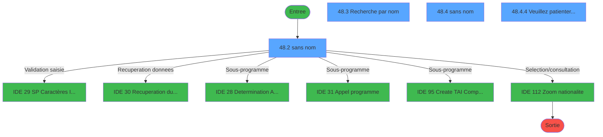
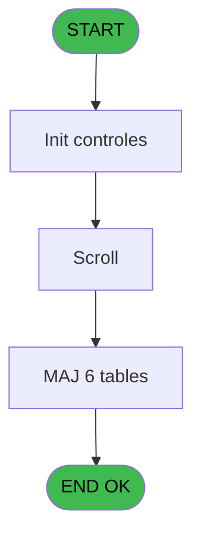
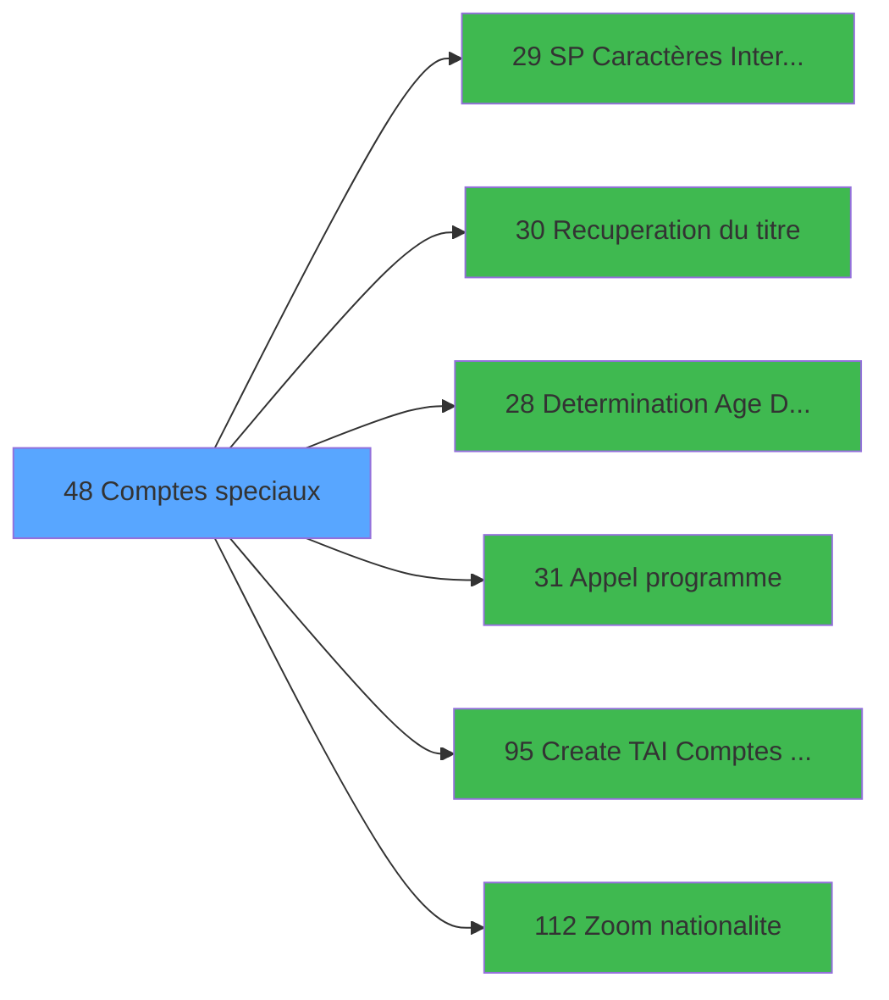

# GES IDE 48 - Comptes speciaux

> **Analyse**: Phases 1-4 2026-02-03 11:38 -> 11:38 (15s) | Assemblage 11:38
> **Pipeline**: V7.2 Enrichi
> **Structure**: 4 onglets (Resume | Ecrans | Donnees | Connexions)

<!-- TAB:Resume -->

## 1. FICHE D'IDENTITE

| Attribut | Valeur |
|----------|--------|
| Projet | GES |
| IDE Position | 48 |
| Nom Programme | Comptes speciaux |
| Fichier source | `Prg_48.xml` |
| Dossier IDE | Généralités |
| Taches | 18 (4 ecrans visibles) |
| Tables modifiees | 6 |
| Programmes appeles | 6 |

## 2. DESCRIPTION FONCTIONNELLE

**Comptes speciaux** assure la gestion complete de ce processus, accessible depuis [Menu gestion (IDE 69)](GES-IDE-69.md).

Le flux de traitement s'organise en **4 blocs fonctionnels** :

- **Traitement** (11 taches) : traitements metier divers
- **Creation** (5 taches) : insertion d'enregistrements en base (mouvements, prestations)
- **Validation** (1 tache) : controles et verifications de coherence
- **Consultation** (1 tache) : ecrans de recherche, selection et consultation

**Donnees modifiees** : 6 tables en ecriture (gm-recherche_____gmr, gm-complet_______gmc, hebergement______heb, compte_gm________cgm, compteurs________cpt, qualite_avant_reprise).

Detail : phases du traitement

#### Phase 1 : Traitement (11 taches)

- **48** - (sans nom) **[[ECRAN]](#ecran-t1)**
- **48.1** - Recup Age Bebe
- **48.2** - (sans nom) **[[ECRAN]](#ecran-t3)**
- **48.4** - (sans nom) **[[ECRAN]](#ecran-t5)**
- **48.4.1** - Affectation des virtuelles
- **48.4.2** - Minusculage
- **48.4.3** - Minusculage
- **48.4.4** - Veuillez patienter ... **[[ECRAN]](#ecran-t10)**
- **48.4.4.1** - Attribution N° Adherent Club
- **48.4.4.2** - Attribution N° Adherent Club
- **48.4.5** - (sans nom) **[[ECRAN]](#ecran-t19)**

Delegue a : [SP Caractères Interdits (IDE 29)](GES-IDE-29.md), [Recuperation du titre (IDE 30)](GES-IDE-30.md), [Determination Age Debut Sejou (IDE 28)](GES-IDE-28.md), [Appel programme (IDE 31)](GES-IDE-31.md)

#### Phase 2 : Consultation (1 tache)

- **48.3** - Recherche par nom **[[ECRAN]](#ecran-t4)**

Delegue a : [Recuperation du titre (IDE 30)](GES-IDE-30.md), [Zoom nationalite (IDE 112)](GES-IDE-112.md)

#### Phase 3 : Creation (5 taches)

- **48.4.4.3** - Creation Hebergement
- **48.4.4.4** - Creation Hebergement
- **48.4.4.5** - Creation Hebergement
- **48.4.4.6** - Creation Hebergement
- **48.4.4.7** - Creation Hebergement

#### Phase 4 : Validation (1 tache)

- **48.4.6** - Verif date

Delegue a : [SP Caractères Interdits (IDE 29)](GES-IDE-29.md)

#### Tables impactees

| Table | Operations | Role metier |
|-------|-----------|-------------|
| qualite_avant_reprise | R/**W**/L (5 usages) |  |
| gm-recherche_____gmr | R/**W**/L (4 usages) | Index de recherche |
| hebergement______heb | R/**W**/L (3 usages) | Hebergement (chambres) |
| gm-complet_______gmc | **W**/L (3 usages) |  |
| compteurs________cpt | **W** (2 usages) | Comptes GM (generaux) |
| compte_gm________cgm | **W** (1 usages) | Comptes GM (generaux) |

## 3. BLOCS FONCTIONNELS

### 3.1 Traitement (11 taches)

Traitements internes.

---

#### 48 - (sans nom) [[ECRAN]](#ecran-t1)

**Role** : Tache d'orchestration : point d'entree du programme (11 sous-taches). Coordonne l'enchainement des traitements.
**Ecran** : 183 x 29 DLU (MDI) | [Voir mockup](#ecran-t1)

10 sous-taches directes

| Tache | Nom | Bloc |
|-------|-----|------|
| [48.1](#t2) | Recup Age Bebe | Traitement |
| [48.2](#t3) | (sans nom) **[[ECRAN]](#ecran-t3)** | Traitement |
| [48.4](#t5) | (sans nom) **[[ECRAN]](#ecran-t5)** | Traitement |
| [48.4.1](#t6) | Affectation des virtuelles | Traitement |
| [48.4.2](#t7) | Minusculage | Traitement |
| [48.4.3](#t8) | Minusculage | Traitement |
| [48.4.4](#t10) | Veuillez patienter ... **[[ECRAN]](#ecran-t10)** | Traitement |
| [48.4.4.1](#t11) | Attribution N° Adherent Club | Traitement |
| [48.4.4.2](#t12) | Attribution N° Adherent Club | Traitement |
| [48.4.5](#t19) | (sans nom) **[[ECRAN]](#ecran-t19)** | Traitement |

---

#### 48.1 - Recup Age Bebe

**Role** : Consultation/chargement : Recup Age Bebe.
**Variables liees** : P (W0 Age Bebe)

---

#### 48.2 - (sans nom) [[ECRAN]](#ecran-t3)

**Role** : Traitement interne.
**Ecran** : 955 x 291 DLU (MDI) | [Voir mockup](#ecran-t3)

---

#### 48.4 - (sans nom) [[ECRAN]](#ecran-t5)

**Role** : Traitement interne.
**Ecran** : 539 x 231 DLU (MDI) | [Voir mockup](#ecran-t5)

---

#### 48.4.1 - Affectation des virtuelles

**Role** : Traitement : Affectation des virtuelles.

---

#### 48.4.2 - Minusculage

**Role** : Traitement : Minusculage.

---

#### 48.4.3 - Minusculage

**Role** : Traitement : Minusculage.

---

#### 48.4.4 - Veuillez patienter ... [[ECRAN]](#ecran-t10)

**Role** : Traitement : Veuillez patienter ....
**Ecran** : 427 x 56 DLU (MDI) | [Voir mockup](#ecran-t10)

---

#### 48.4.4.1 - Attribution N° Adherent Club

**Role** : Traitement : Attribution N° Adherent Club.

---

#### 48.4.4.2 - Attribution N° Adherent Club

**Role** : Traitement : Attribution N° Adherent Club.

---

#### 48.4.5 - (sans nom) [[ECRAN]](#ecran-t19)

**Role** : Traitement interne.
**Ecran** : 116 x 24 DLU (MDI) | [Voir mockup](#ecran-t19)

### 3.2 Consultation (1 tache)

Ecrans de recherche et consultation.

---

#### 48.3 - Recherche par nom [[ECRAN]](#ecran-t4)

**Role** : Traitement : Recherche par nom.
**Ecran** : 562 x 90 DLU (MDI) | [Voir mockup](#ecran-t4)
**Variables liees** : J (W0 Recherche)
**Delegue a** : [Zoom nationalite (IDE 112)](GES-IDE-112.md)

### 3.3 Creation (5 taches)

Insertion de nouveaux enregistrements en base.

---

#### 48.4.4.3 - Creation Hebergement

**Role** : Creation d'enregistrement : Creation Hebergement.

---

#### 48.4.4.4 - Creation Hebergement

**Role** : Creation d'enregistrement : Creation Hebergement.

---

#### 48.4.4.5 - Creation Hebergement

**Role** : Creation d'enregistrement : Creation Hebergement.

---

#### 48.4.4.6 - Creation Hebergement

**Role** : Creation d'enregistrement : Creation Hebergement.

---

#### 48.4.4.7 - Creation Hebergement

**Role** : Creation d'enregistrement : Creation Hebergement.

### 3.4 Validation (1 tache)

Controles de coherence : 1 tache verifie les donnees et conditions.

---

#### 48.4.6 - Verif date

**Role** : Verification : Verif date.

## 5. REGLES METIER

*(Aucune regle metier identifiee)*

## 6. CONTEXTE

- **Appele par**: [Menu gestion (IDE 69)](GES-IDE-69.md)
- **Appelle**: 6 programmes | **Tables**: 9 (W:6 R:6 L:4) | **Taches**: 18 | **Expressions**: 11

<!-- TAB:Ecrans -->

## 8. ECRANS

### 8.1 Forms visibles (4 / 18)

| # | Position | Tache | Nom | Type | Largeur | Hauteur | Bloc |
|---|----------|-------|-----|------|---------|---------|------|
| 1 | 48.2 | 48.2 | (sans nom) | MDI | 955 | 291 | Traitement |
| 2 | 48.3 | 48.3 | Recherche par nom | MDI | 562 | 90 | Consultation |
| 3 | 48.4 | 48.4 | (sans nom) | MDI | 539 | 231 | Traitement |
| 4 | 48.4.4 | 48.4.4 | Veuillez patienter ... | MDI | 427 | 56 | Traitement |

### 8.2 Mockups Ecrans

---

#### 48.2 - (sans nom)
**Tache** : [48.2](#t3) | **Type** : MDI | **Dimensions** : 955 x 291 DLU
**Bloc** : Traitement | **Titre IDE** : (sans nom)

<!-- FORM-DATA:
{
    "width":  955,
    "vFactor":  8,
    "type":  "MDI",
    "hFactor":  8,
    "controls":  [
                     {
                         "x":  3,
                         "type":  "label",
                         "var":  "",
                         "y":  2,
                         "w":  950,
                         "fmt":  "",
                         "name":  "",
                         "h":  19,
                         "color":  "",
                         "text":  "",
                         "parent":  null
                     },
                     {
                         "x":  6,
                         "type":  "label",
                         "var":  "",
                         "y":  23,
                         "w":  940,
                         "fmt":  "",
                         "name":  "",
                         "h":  240,
                         "color":  "",
                         "text":  "",
                         "parent":  null
                     },
                     {
                         "x":  394,
                         "type":  "label",
                         "var":  "",
                         "y":  25,
                         "w":  540,
                         "fmt":  "",
                         "name":  "",
                         "h":  159,
                         "color":  "195",
                         "text":  "Fiche adhérent",
                         "parent":  null
                     },
                     {
                         "x":  14,
                         "type":  "table",
                         "var":  "",
                         "name":  "",
                         "titleH":  12,
                         "color":  "110",
                         "w":  355,
                         "y":  27,
                         "fmt":  "",
                         "parent":  null,
                         "text":  "",
                         "rowH":  11,
                         "h":  215,
                         "cols":  [
                                      {
                                          "title":  "Nom",
                                          "layer":  1,
                                          "w":  187
                                      },
                                      {
                                          "title":  "Prénom",
                                          "layer":  2,
                                          "w":  132
                                      }
                                  ],
                         "rows":  2
                     },
                     {
                         "x":  419,
                         "type":  "label",
                         "var":  "",
                         "y":  36,
                         "w":  80,
                         "fmt":  "",
                         "name":  "",
                         "h":  10,
                         "color":  "",
                         "text":  "Nom",
                         "parent":  5
                     },
                     {
                         "x":  419,
                         "type":  "label",
                         "var":  "",
                         "y":  49,
                         "w":  78,
                         "fmt":  "",
                         "name":  "",
                         "h":  10,
                         "color":  "",
                         "text":  "Prénom",
                         "parent":  5
                     },
                     {
                         "x":  419,
                         "type":  "label",
                         "var":  "",
                         "y":  62,
                         "w":  53,
                         "fmt":  "",
                         "name":  "",
                         "h":  10,
                         "color":  "",
                         "text":  "Titre",
                         "parent":  5
                     },
                     {
                         "x":  675,
                         "type":  "label",
                         "var":  "",
                         "y":  63,
                         "w":  61,
                         "fmt":  "",
                         "name":  "",
                         "h":  8,
                         "color":  "",
                         "text":  "Qualité",
                         "parent":  5
                     },
                     {
                         "x":  419,
                         "type":  "label",
                         "var":  "",
                         "y":  76,
                         "w":  98,
                         "fmt":  "",
                         "name":  "",
                         "h":  10,
                         "color":  "",
                         "text":  "Séjour du",
                         "parent":  5
                     },
                     {
                         "x":  709,
                         "type":  "label",
                         "var":  "",
                         "y":  76,
                         "w":  27,
                         "fmt":  "",
                         "name":  "",
                         "h":  8,
                         "color":  "",
                         "text":  "au",
                         "parent":  5
                     },
                     {
                         "x":  419,
                         "type":  "label",
                         "var":  "",
                         "y":  92,
                         "w":  122,
                         "fmt":  "",
                         "name":  "",
                         "h":  10,
                         "color":  "",
                         "text":  "N° Adhérent",
                         "parent":  5
                     },
                     {
                         "x":  787,
                         "type":  "label",
                         "var":  "",
                         "y":  92,
                         "w":  35,
                         "fmt":  "",
                         "name":  "",
                         "h":  10,
                         "color":  "",
                         "text":  "Fil",
                         "parent":  5
                     },
                     {
                         "x":  419,
                         "type":  "label",
                         "var":  "",
                         "y":  106,
                         "w":  184,
                         "fmt":  "",
                         "name":  "",
                         "h":  10,
                         "color":  "",
                         "text":  "Date de Naissance",
                         "parent":  5
                     },
                     {
                         "x":  419,
                         "type":  "label",
                         "var":  "",
                         "y":  120,
                         "w":  109,
                         "fmt":  "",
                         "name":  "",
                         "h":  10,
                         "color":  "",
                         "text":  "Nationalité",
                         "parent":  5
                     },
                     {
                         "x":  635,
                         "type":  "label",
                         "var":  "",
                         "y":  120,
                         "w":  109,
                         "fmt":  "",
                         "name":  "",
                         "h":  10,
                         "color":  "",
                         "text":  "Fictif",
                         "parent":  5
                     },
                     {
                         "x":  413,
                         "type":  "label",
                         "var":  "",
                         "y":  133,
                         "w":  442,
                         "fmt":  "",
                         "name":  "",
                         "h":  45,
                         "color":  "195",
                         "text":  "Adresse",
                         "parent":  null
                     },
                     {
                         "x":  644,
                         "type":  "label",
                         "var":  "",
                         "y":  187,
                         "w":  290,
                         "fmt":  "",
                         "name":  "",
                         "h":  62,
                         "color":  "",
                         "text":  "",
                         "parent":  null
                     },
                     {
                         "x":  647,
                         "type":  "label",
                         "var":  "",
                         "y":  188,
                         "w":  284,
                         "fmt":  "",
                         "name":  "",
                         "h":  71,
                         "color":  "",
                         "text":  "",
                         "parent":  null
                     },
                     {
                         "x":  685,
                         "type":  "label",
                         "var":  "",
                         "y":  193,
                         "w":  209,
                         "fmt":  "",
                         "name":  "",
                         "h":  50,
                         "color":  "",
                         "text":  "",
                         "parent":  null
                     },
                     {
                         "x":  688,
                         "type":  "label",
                         "var":  "",
                         "y":  194,
                         "w":  43,
                         "fmt":  "",
                         "name":  "",
                         "h":  47,
                         "color":  "",
                         "text":  "",
                         "parent":  null
                     },
                     {
                         "x":  740,
                         "type":  "label",
                         "var":  "",
                         "y":  196,
                         "w":  139,
                         "fmt":  "",
                         "name":  "",
                         "h":  9,
                         "color":  "7",
                         "text":  "Création",
                         "parent":  null
                     },
                     {
                         "x":  740,
                         "type":  "label",
                         "var":  "",
                         "y":  206,
                         "w":  139,
                         "fmt":  "",
                         "name":  "",
                         "h":  9,
                         "color":  "7",
                         "text":  "Modification",
                         "parent":  null
                     },
                     {
                         "x":  740,
                         "type":  "label",
                         "var":  "",
                         "y":  217,
                         "w":  139,
                         "fmt":  "",
                         "name":  "",
                         "h":  9,
                         "color":  "7",
                         "text":  "Recherche",
                         "parent":  null
                     },
                     {
                         "x":  704,
                         "type":  "label",
                         "var":  "",
                         "y":  245,
                         "w":  120,
                         "fmt":  "",
                         "name":  "",
                         "h":  9,
                         "color":  "",
                         "text":  "Votre choix",
                         "parent":  null
                     },
                     {
                         "x":  0,
                         "type":  "label",
                         "var":  "",
                         "y":  265,
                         "w":  953,
                         "fmt":  "",
                         "name":  "",
                         "h":  24,
                         "color":  "",
                         "text":  "",
                         "parent":  null
                     },
                     {
                         "x":  740,
                         "type":  "label",
                         "var":  "",
                         "y":  228,
                         "w":  139,
                         "fmt":  "",
                         "name":  "",
                         "h":  9,
                         "color":  "7",
                         "text":  "Création Cash",
                         "parent":  null
                     },
                     {
                         "x":  21,
                         "type":  "edit",
                         "var":  "",
                         "y":  41,
                         "w":  176,
                         "fmt":  "",
                         "name":  "",
                         "h":  8,
                         "color":  "110",
                         "text":  "",
                         "parent":  6
                     },
                     {
                         "x":  208,
                         "type":  "edit",
                         "var":  "",
                         "y":  41,
                         "w":  120,
                         "fmt":  "",
                         "name":  "",
                         "h":  8,
                         "color":  "110",
                         "text":  "",
                         "parent":  6
                     },
                     {
                         "x":  529,
                         "type":  "edit",
                         "var":  "",
                         "y":  62,
                         "w":  40,
                         "fmt":  "",
                         "name":  "",
                         "h":  10,
                         "color":  "",
                         "text":  "",
                         "parent":  5
                     },
                     {
                         "x":  830,
                         "type":  "edit",
                         "var":  "",
                         "y":  92,
                         "w":  54,
                         "fmt":  "",
                         "name":  "",
                         "h":  9,
                         "color":  "",
                         "text":  "",
                         "parent":  5
                     },
                     {
                         "x":  742,
                         "type":  "combobox",
                         "var":  "",
                         "y":  119,
                         "w":  106,
                         "fmt":  "",
                         "name":  "",
                         "h":  12,
                         "color":  "",
                         "text":  "",
                         "parent":  null
                     },
                     {
                         "x":  751,
                         "type":  "edit",
                         "var":  "",
                         "y":  62,
                         "w":  40,
                         "fmt":  "",
                         "name":  "",
                         "h":  10,
                         "color":  "",
                         "text":  "",
                         "parent":  5
                     },
                     {
                         "x":  613,
                         "type":  "edit",
                         "var":  "",
                         "y":  106,
                         "w":  133,
                         "fmt":  "##/##/####Z",
                         "name":  "",
                         "h":  9,
                         "color":  "",
                         "text":  "",
                         "parent":  5
                     },
                     {
                         "x":  529,
                         "type":  "edit",
                         "var":  "",
                         "y":  120,
                         "w":  43,
                         "fmt":  "",
                         "name":  "",
                         "h":  9,
                         "color":  "",
                         "text":  "",
                         "parent":  5
                     },
                     {
                         "x":  437,
                         "type":  "edit",
                         "var":  "",
                         "y":  144,
                         "w":  410,
                         "fmt":  "",
                         "name":  "",
                         "h":  8,
                         "color":  "",
                         "text":  "",
                         "parent":  32
                     },
                     {
                         "x":  437,
                         "type":  "edit",
                         "var":  "",
                         "y":  154,
                         "w":  410,
                         "fmt":  "",
                         "name":  "",
                         "h":  8,
                         "color":  "",
                         "text":  "",
                         "parent":  32
                     },
                     {
                         "x":  437,
                         "type":  "edit",
                         "var":  "",
                         "y":  163,
                         "w":  410,
                         "fmt":  "",
                         "name":  "",
                         "h":  8,
                         "color":  "",
                         "text":  "",
                         "parent":  32
                     },
                     {
                         "x":  529,
                         "type":  "edit",
                         "var":  "",
                         "y":  76,
                         "w":  133,
                         "fmt":  "##/##/####Z",
                         "name":  "",
                         "h":  9,
                         "color":  "",
                         "text":  "",
                         "parent":  5
                     },
                     {
                         "x":  751,
                         "type":  "edit",
                         "var":  "",
                         "y":  76,
                         "w":  133,
                         "fmt":  "##/##/####Z",
                         "name":  "",
                         "h":  9,
                         "color":  "",
                         "text":  "",
                         "parent":  5
                     },
                     {
                         "x":  838,
                         "type":  "edit",
                         "var":  "",
                         "y":  244,
                         "w":  26,
                         "fmt":  "",
                         "name":  "",
                         "h":  10,
                         "color":  "6",
                         "text":  "",
                         "parent":  null
                     },
                     {
                         "x":  10,
                         "type":  "edit",
                         "var":  "",
                         "y":  6,
                         "w":  274,
                         "fmt":  "20",
                         "name":  "",
                         "h":  10,
                         "color":  "",
                         "text":  "",
                         "parent":  1
                     },
                     {
                         "x":  669,
                         "type":  "edit",
                         "var":  "",
                         "y":  6,
                         "w":  274,
                         "fmt":  "WWW DD MMM YYYYT",
                         "name":  "",
                         "h":  10,
                         "color":  "",
                         "text":  "",
                         "parent":  null
                     },
                     {
                         "x":  529,
                         "type":  "edit",
                         "var":  "",
                         "y":  36,
                         "w":  186,
                         "fmt":  "U15",
                         "name":  "",
                         "h":  10,
                         "color":  "",
                         "text":  "",
                         "parent":  5
                     },
                     {
                         "x":  529,
                         "type":  "edit",
                         "var":  "",
                         "y":  49,
                         "w":  186,
                         "fmt":  "UX9",
                         "name":  "",
                         "h":  10,
                         "color":  "",
                         "text":  "",
                         "parent":  5
                     },
                     {
                         "x":  529,
                         "type":  "edit",
                         "var":  "",
                         "y":  92,
                         "w":  222,
                         "fmt":  "18",
                         "name":  "",
                         "h":  9,
                         "color":  "",
                         "text":  "",
                         "parent":  5
                     },
                     {
                         "x":  409,
                         "type":  "image",
                         "var":  "",
                         "y":  184,
                         "w":  173,
                         "fmt":  "",
                         "name":  "",
                         "h":  68,
                         "color":  "",
                         "text":  "",
                         "parent":  4
                     },
                     {
                         "x":  693,
                         "type":  "button",
                         "var":  "",
                         "y":  196,
                         "w":  30,
                         "fmt":  "C",
                         "name":  "C",
                         "h":  9,
                         "color":  "",
                         "text":  "",
                         "parent":  null
                     },
                     {
                         "x":  693,
                         "type":  "button",
                         "var":  "",
                         "y":  206,
                         "w":  30,
                         "fmt":  "M",
                         "name":  "M",
                         "h":  9,
                         "color":  "",
                         "text":  "",
                         "parent":  null
                     },
                     {
                         "x":  693,
                         "type":  "button",
                         "var":  "",
                         "y":  217,
                         "w":  30,
                         "fmt":  "R",
                         "name":  "R",
                         "h":  9,
                         "color":  "",
                         "text":  "",
                         "parent":  null
                     },
                     {
                         "x":  6,
                         "type":  "button",
                         "var":  "",
                         "y":  268,
                         "w":  154,
                         "fmt":  "\u0026Quitter",
                         "name":  "",
                         "h":  18,
                         "color":  "",
                         "text":  "",
                         "parent":  46
                     },
                     {
                         "x":  693,
                         "type":  "button",
                         "var":  "",
                         "y":  228,
                         "w":  30,
                         "fmt":  "A",
                         "name":  "A",
                         "h":  9,
                         "color":  "",
                         "text":  "",
                         "parent":  null
                     }
                 ],
    "taskId":  "48.2",
    "height":  291
}
-->

<strong>Champs : 19 champs</strong>

| Pos (x,y) | Nom | Variable | Type |
|-----------|-----|----------|------|
| 21,41 | (sans nom) | - | edit |
| 208,41 | (sans nom) | - | edit |
| 529,62 | (sans nom) | - | edit |
| 830,92 | (sans nom) | - | edit |
| 742,119 | (sans nom) | - | combobox |
| 751,62 | (sans nom) | - | edit |
| 613,106 | ##/##/####Z | - | edit |
| 529,120 | (sans nom) | - | edit |
| 437,144 | (sans nom) | - | edit |
| 437,154 | (sans nom) | - | edit |
| 437,163 | (sans nom) | - | edit |
| 529,76 | ##/##/####Z | - | edit |
| 751,76 | ##/##/####Z | - | edit |
| 838,244 | (sans nom) | - | edit |
| 10,6 | 20 | - | edit |
| 669,6 | WWW DD MMM YYYYT | - | edit |
| 529,36 | U15 | - | edit |
| 529,49 | UX9 | - | edit |
| 529,92 | 18 | - | edit |

<strong>Boutons : 5 boutons</strong>

| Bouton | Pos (x,y) | Action |
|--------|-----------|--------|
| C | 693,196 | Bouton fonctionnel |
| M | 693,206 | Bouton fonctionnel |
| R | 693,217 | Bouton fonctionnel |
| Quitter | 6,268 | Quitte le programme |
| A | 693,228 | Bouton fonctionnel |

---

#### 48.3 - Recherche par nom
**Tache** : [48.3](#t4) | **Type** : MDI | **Dimensions** : 562 x 90 DLU
**Bloc** : Consultation | **Titre IDE** : Recherche par nom

<!-- FORM-DATA:
{
    "width":  562,
    "vFactor":  8,
    "type":  "MDI",
    "hFactor":  8,
    "controls":  [
                     {
                         "x":  60,
                         "type":  "label",
                         "var":  "",
                         "y":  14,
                         "w":  441,
                         "fmt":  "",
                         "name":  "",
                         "h":  40,
                         "color":  "4",
                         "text":  "",
                         "parent":  null
                     },
                     {
                         "x":  62,
                         "type":  "label",
                         "var":  "",
                         "y":  15,
                         "w":  437,
                         "fmt":  "",
                         "name":  "",
                         "h":  38,
                         "color":  "4",
                         "text":  "",
                         "parent":  null
                     },
                     {
                         "x":  126,
                         "type":  "label",
                         "var":  "",
                         "y":  28,
                         "w":  123,
                         "fmt":  "",
                         "name":  "",
                         "h":  10,
                         "color":  "4",
                         "text":  "Recherche",
                         "parent":  null
                     },
                     {
                         "x":  0,
                         "type":  "label",
                         "var":  "",
                         "y":  66,
                         "w":  558,
                         "fmt":  "",
                         "name":  "",
                         "h":  24,
                         "color":  "",
                         "text":  "",
                         "parent":  null
                     },
                     {
                         "x":  252,
                         "type":  "edit",
                         "var":  "",
                         "y":  28,
                         "w":  182,
                         "fmt":  "",
                         "name":  "",
                         "h":  10,
                         "color":  "6",
                         "text":  "",
                         "parent":  null
                     },
                     {
                         "x":  171,
                         "type":  "button",
                         "var":  "",
                         "y":  69,
                         "w":  154,
                         "fmt":  "A\u0026bandonner",
                         "name":  "",
                         "h":  18,
                         "color":  "",
                         "text":  "",
                         "parent":  null
                     },
                     {
                         "x":  6,
                         "type":  "button",
                         "var":  "",
                         "y":  69,
                         "w":  154,
                         "fmt":  "\u0026Rechercher",
                         "name":  "",
                         "h":  18,
                         "color":  "",
                         "text":  "",
                         "parent":  null
                     }
                 ],
    "taskId":  "48.3",
    "height":  90
}
-->

<strong>Champs : 1 champs</strong>

| Pos (x,y) | Nom | Variable | Type |
|-----------|-----|----------|------|
| 252,28 | (sans nom) | - | edit |

<strong>Boutons : 2 boutons</strong>

| Bouton | Pos (x,y) | Action |
|--------|-----------|--------|
| Abandonner | 171,69 | Annule et retour au menu |
| Rechercher | 6,69 | Ouvre la selection |

---

#### 48.4 - (sans nom)
**Tache** : [48.4](#t5) | **Type** : MDI | **Dimensions** : 539 x 231 DLU
**Bloc** : Traitement | **Titre IDE** : (sans nom)

<!-- FORM-DATA:
{
    "width":  539,
    "vFactor":  8,
    "type":  "MDI",
    "hFactor":  8,
    "controls":  [
                     {
                         "x":  1,
                         "type":  "label",
                         "var":  "",
                         "y":  1,
                         "w":  535,
                         "fmt":  "",
                         "name":  "",
                         "h":  19,
                         "color":  "",
                         "text":  "",
                         "parent":  null
                     },
                     {
                         "x":  32,
                         "type":  "label",
                         "var":  "",
                         "y":  26,
                         "w":  474,
                         "fmt":  "",
                         "name":  "",
                         "h":  173,
                         "color":  "195",
                         "text":  "Modification",
                         "parent":  null
                     },
                     {
                         "x":  55,
                         "type":  "label",
                         "var":  "",
                         "y":  37,
                         "w":  78,
                         "fmt":  "",
                         "name":  "",
                         "h":  10,
                         "color":  "",
                         "text":  "Nom",
                         "parent":  5
                     },
                     {
                         "x":  55,
                         "type":  "label",
                         "var":  "",
                         "y":  51,
                         "w":  78,
                         "fmt":  "",
                         "name":  "",
                         "h":  10,
                         "color":  "",
                         "text":  "Prénom",
                         "parent":  5
                     },
                     {
                         "x":  55,
                         "type":  "label",
                         "var":  "",
                         "y":  63,
                         "w":  53,
                         "fmt":  "",
                         "name":  "",
                         "h":  10,
                         "color":  "",
                         "text":  "Titre",
                         "parent":  5
                     },
                     {
                         "x":  285,
                         "type":  "label",
                         "var":  "",
                         "y":  64,
                         "w":  61,
                         "fmt":  "",
                         "name":  "",
                         "h":  8,
                         "color":  "",
                         "text":  "Qualité",
                         "parent":  5
                     },
                     {
                         "x":  55,
                         "type":  "label",
                         "var":  "",
                         "y":  78,
                         "w":  98,
                         "fmt":  "",
                         "name":  "",
                         "h":  10,
                         "color":  "",
                         "text":  "Séjour du",
                         "parent":  5
                     },
                     {
                         "x":  319,
                         "type":  "label",
                         "var":  "",
                         "y":  79,
                         "w":  27,
                         "fmt":  "",
                         "name":  "",
                         "h":  8,
                         "color":  "",
                         "text":  "au",
                         "parent":  5
                     },
                     {
                         "x":  55,
                         "type":  "label",
                         "var":  "",
                         "y":  93,
                         "w":  122,
                         "fmt":  "",
                         "name":  "",
                         "h":  10,
                         "color":  "",
                         "text":  "N° Adhérent",
                         "parent":  5
                     },
                     {
                         "x":  309,
                         "type":  "label",
                         "var":  "",
                         "y":  93,
                         "w":  13,
                         "fmt":  "",
                         "name":  "",
                         "h":  10,
                         "color":  "",
                         "text":  "-",
                         "parent":  5
                     },
                     {
                         "x":  401,
                         "type":  "label",
                         "var":  "",
                         "y":  93,
                         "w":  24,
                         "fmt":  "",
                         "name":  "",
                         "h":  8,
                         "color":  "",
                         "text":  "Fil",
                         "parent":  5
                     },
                     {
                         "x":  55,
                         "type":  "label",
                         "var":  "",
                         "y":  107,
                         "w":  184,
                         "fmt":  "",
                         "name":  "",
                         "h":  10,
                         "color":  "",
                         "text":  "Date de Naissance",
                         "parent":  5
                     },
                     {
                         "x":  55,
                         "type":  "label",
                         "var":  "",
                         "y":  123,
                         "w":  109,
                         "fmt":  "",
                         "name":  "",
                         "h":  10,
                         "color":  "",
                         "text":  "Nationalité",
                         "parent":  5
                     },
                     {
                         "x":  49,
                         "type":  "label",
                         "var":  "",
                         "y":  138,
                         "w":  442,
                         "fmt":  "",
                         "name":  "",
                         "h":  55,
                         "color":  "195",
                         "text":  "Adresse",
                         "parent":  null
                     },
                     {
                         "x":  0,
                         "type":  "label",
                         "var":  "",
                         "y":  206,
                         "w":  538,
                         "fmt":  "",
                         "name":  "",
                         "h":  24,
                         "color":  "",
                         "text":  "",
                         "parent":  null
                     },
                     {
                         "x":  177,
                         "type":  "edit",
                         "var":  "",
                         "y":  37,
                         "w":  182,
                         "fmt":  "",
                         "name":  "W1 nom",
                         "h":  10,
                         "color":  "6",
                         "text":  "",
                         "parent":  5
                     },
                     {
                         "x":  177,
                         "type":  "edit",
                         "var":  "",
                         "y":  51,
                         "w":  126,
                         "fmt":  "",
                         "name":  "W1 prenom",
                         "h":  10,
                         "color":  "6",
                         "text":  "",
                         "parent":  5
                     },
                     {
                         "x":  177,
                         "type":  "combobox",
                         "var":  "",
                         "y":  63,
                         "w":  67,
                         "fmt":  "",
                         "name":  "W1 titre",
                         "h":  12,
                         "color":  "",
                         "text":  "",
                         "parent":  5
                     },
                     {
                         "x":  361,
                         "type":  "combobox",
                         "var":  "",
                         "y":  63,
                         "w":  67,
                         "fmt":  "",
                         "name":  "W1 qualite",
                         "h":  12,
                         "color":  "",
                         "text":  "",
                         "parent":  5
                     },
                     {
                         "x":  177,
                         "type":  "edit",
                         "var":  "",
                         "y":  78,
                         "w":  126,
                         "fmt":  "##/##/####",
                         "name":  "",
                         "h":  10,
                         "color":  "6",
                         "text":  "",
                         "parent":  5
                     },
                     {
                         "x":  361,
                         "type":  "edit",
                         "var":  "",
                         "y":  78,
                         "w":  126,
                         "fmt":  "##/##/####Z",
                         "name":  "W1 date fin",
                         "h":  10,
                         "color":  "6",
                         "text":  "",
                         "parent":  5
                     },
                     {
                         "x":  177,
                         "type":  "edit",
                         "var":  "",
                         "y":  93,
                         "w":  126,
                         "fmt":  "",
                         "name":  "",
                         "h":  10,
                         "color":  "6",
                         "text":  "",
                         "parent":  5
                     },
                     {
                         "x":  324,
                         "type":  "edit",
                         "var":  "",
                         "y":  93,
                         "w":  26,
                         "fmt":  "",
                         "name":  "",
                         "h":  10,
                         "color":  "6",
                         "text":  "",
                         "parent":  5
                     },
                     {
                         "x":  439,
                         "type":  "edit",
                         "var":  "",
                         "y":  93,
                         "w":  48,
                         "fmt":  "",
                         "name":  "",
                         "h":  10,
                         "color":  "6",
                         "text":  "",
                         "parent":  5
                     },
                     {
                         "x":  224,
                         "type":  "edit",
                         "var":  "",
                         "y":  107,
                         "w":  126,
                         "fmt":  "##/##/####Z",
                         "name":  "W1 date de naissance",
                         "h":  10,
                         "color":  "6",
                         "text":  "",
                         "parent":  5
                     },
                     {
                         "x":  177,
                         "type":  "edit",
                         "var":  "",
                         "y":  123,
                         "w":  37,
                         "fmt":  "",
                         "name":  "W1 nationnalite",
                         "h":  10,
                         "color":  "6",
                         "text":  "",
                         "parent":  5
                     },
                     {
                         "x":  95,
                         "type":  "edit",
                         "var":  "",
                         "y":  153,
                         "w":  350,
                         "fmt":  "",
                         "name":  "W1 rue",
                         "h":  10,
                         "color":  "6",
                         "text":  "",
                         "parent":  26
                     },
                     {
                         "x":  95,
                         "type":  "edit",
                         "var":  "",
                         "y":  166,
                         "w":  350,
                         "fmt":  "",
                         "name":  "W1 commune",
                         "h":  10,
                         "color":  "6",
                         "text":  "",
                         "parent":  26
                     },
                     {
                         "x":  95,
                         "type":  "edit",
                         "var":  "",
                         "y":  179,
                         "w":  350,
                         "fmt":  "",
                         "name":  "W1 ville/bureau dist",
                         "h":  10,
                         "color":  "6",
                         "text":  "",
                         "parent":  26
                     },
                     {
                         "x":  9,
                         "type":  "button",
                         "var":  "",
                         "y":  209,
                         "w":  154,
                         "fmt":  "\u0026Ok",
                         "name":  "Bouton Ok",
                         "h":  18,
                         "color":  "",
                         "text":  "",
                         "parent":  null
                     },
                     {
                         "x":  8,
                         "type":  "edit",
                         "var":  "",
                         "y":  5,
                         "w":  274,
                         "fmt":  "20",
                         "name":  "",
                         "h":  10,
                         "color":  "",
                         "text":  "",
                         "parent":  1
                     },
                     {
                         "x":  329,
                         "type":  "edit",
                         "var":  "",
                         "y":  5,
                         "w":  203,
                         "fmt":  "WWW DD MMM YYYYT",
                         "name":  "",
                         "h":  10,
                         "color":  "",
                         "text":  "",
                         "parent":  null
                     },
                     {
                         "x":  170,
                         "type":  "button",
                         "var":  "",
                         "y":  209,
                         "w":  154,
                         "fmt":  "A\u0026bandonner",
                         "name":  "",
                         "h":  18,
                         "color":  "",
                         "text":  "",
                         "parent":  null
                     }
                 ],
    "taskId":  "48.4",
    "height":  231
}
-->

<strong>Champs : 16 champs</strong>

| Pos (x,y) | Nom | Variable | Type |
|-----------|-----|----------|------|
| 177,37 | W1 nom | - | edit |
| 177,51 | W1 prenom | - | edit |
| 177,63 | W1 titre | - | combobox |
| 361,63 | W1 qualite | - | combobox |
| 177,78 | ##/##/#### | - | edit |
| 361,78 | W1 date fin | - | edit |
| 177,93 | (sans nom) | - | edit |
| 324,93 | (sans nom) | - | edit |
| 439,93 | (sans nom) | - | edit |
| 224,107 | W1 date de naissance | - | edit |
| 177,123 | W1 nationnalite | - | edit |
| 95,153 | W1 rue | - | edit |
| 95,166 | W1 commune | - | edit |
| 95,179 | W1 ville/bureau dist | - | edit |
| 8,5 | 20 | - | edit |
| 329,5 | WWW DD MMM YYYYT | - | edit |

<strong>Boutons : 2 boutons</strong>

| Bouton | Pos (x,y) | Action |
|--------|-----------|--------|
| Ok | 9,209 | Valide la saisie et enregistre |
| Abandonner | 170,209 | Annule et retour au menu |

---

#### 48.4.4 - Veuillez patienter ...
**Tache** : [48.4.4](#t10) | **Type** : MDI | **Dimensions** : 427 x 56 DLU
**Bloc** : Traitement | **Titre IDE** : Veuillez patienter ...

<!-- FORM-DATA:
{
    "width":  427,
    "vFactor":  8,
    "type":  "MDI",
    "hFactor":  8,
    "controls":  [
                     {
                         "x":  3,
                         "type":  "label",
                         "var":  "",
                         "y":  0,
                         "w":  423,
                         "fmt":  "",
                         "name":  "",
                         "h":  29,
                         "color":  "",
                         "text":  "",
                         "parent":  null
                     },
                     {
                         "x":  120,
                         "type":  "label",
                         "var":  "",
                         "y":  10,
                         "w":  275,
                         "fmt":  "",
                         "name":  "",
                         "h":  8,
                         "color":  "7",
                         "text":  "Traitement en cours ...",
                         "parent":  null
                     },
                     {
                         "x":  3,
                         "type":  "label",
                         "var":  "",
                         "y":  29,
                         "w":  423,
                         "fmt":  "",
                         "name":  "",
                         "h":  27,
                         "color":  "",
                         "text":  "",
                         "parent":  null
                     },
                     {
                         "x":  88,
                         "type":  "label",
                         "var":  "",
                         "y":  39,
                         "w":  240,
                         "fmt":  "",
                         "name":  "",
                         "h":  8,
                         "color":  "",
                         "text":  "Enregistrement en cours",
                         "parent":  null
                     },
                     {
                         "x":  4,
                         "type":  "image",
                         "var":  "",
                         "y":  2,
                         "w":  72,
                         "fmt":  "",
                         "name":  "",
                         "h":  25,
                         "color":  "",
                         "text":  "",
                         "parent":  null
                     }
                 ],
    "taskId":  "48.4.4",
    "height":  56
}
-->

## 9. NAVIGATION

### 9.1 Enchainement des ecrans

**Detail par enchainement :**

| Depuis | Action | Vers | Retour |
|--------|--------|------|--------|
|  | Validation saisie | [SP Caractères Interdits (IDE 29)](GES-IDE-29.md) | Retour ecran |
|  | Recuperation donnees | [Recuperation du titre (IDE 30)](GES-IDE-30.md) | Retour ecran |
|  | Sous-programme | [Determination Age Debut Sejou (IDE 28)](GES-IDE-28.md) | Retour ecran |
|  | Sous-programme | [Appel programme (IDE 31)](GES-IDE-31.md) | Retour ecran |
|  | Sous-programme | [Create TAI Comptes speciaux (IDE 95)](GES-IDE-95.md) | Retour ecran |
|  | Selection/consultation | [Zoom nationalite (IDE 112)](GES-IDE-112.md) | Retour ecran |

### 9.3 Structure hierarchique (18 taches)

| Position | Tache | Type | Dimensions | Bloc |
|----------|-------|------|------------|------|
| **48.1** | [**(sans nom)** (48)](#t1) [mockup](#ecran-t1) | MDI | 183x29 | Traitement |
| 48.1.1 | [Recup Age Bebe (48.1)](#t2) | MDI | - | |
| 48.1.2 | [(sans nom) (48.2)](#t3) [mockup](#ecran-t3) | MDI | 955x291 | |
| 48.1.3 | [(sans nom) (48.4)](#t5) [mockup](#ecran-t5) | MDI | 539x231 | |
| 48.1.4 | [Affectation des virtuelles (48.4.1)](#t6) | MDI | - | |
| 48.1.5 | [Minusculage (48.4.2)](#t7) | MDI | - | |
| 48.1.6 | [Minusculage (48.4.3)](#t8) | MDI | - | |
| 48.1.7 | [Veuillez patienter ... (48.4.4)](#t10) [mockup](#ecran-t10) | MDI | 427x56 | |
| 48.1.8 | [Attribution N° Adherent Club (48.4.4.1)](#t11) | MDI | - | |
| 48.1.9 | [Attribution N° Adherent Club (48.4.4.2)](#t12) | MDI | - | |
| 48.1.10 | [(sans nom) (48.4.5)](#t19) [mockup](#ecran-t19) | MDI | 116x24 | |
| **48.2** | [**Recherche par nom** (48.3)](#t4) [mockup](#ecran-t4) | MDI | 562x90 | Consultation |
| **48.3** | [**Creation Hebergement** (48.4.4.3)](#t13) | MDI | - | Creation |
| 48.3.1 | [Creation Hebergement (48.4.4.4)](#t14) | MDI | - | |
| 48.3.2 | [Creation Hebergement (48.4.4.5)](#t15) | MDI | - | |
| 48.3.3 | [Creation Hebergement (48.4.4.6)](#t16) | MDI | - | |
| 48.3.4 | [Creation Hebergement (48.4.4.7)](#t17) | MDI | - | |
| **48.4** | [**Verif date** (48.4.6)](#t20) | - | - | Validation |

### 9.4 Algorigramme

> **Legende**: Vert = START/END OK | Rouge = END KO | Bleu = Decisions
> *Algorigramme auto-genere. Utiliser `/algorigramme` pour une synthese metier detaillee.*

<!-- TAB:Donnees -->

## 10. TABLES

### Tables utilisees (9)

| ID | Nom | Description | Type | R | W | L | Usages |
|----|-----|-------------|------|---|---|---|--------|
| 30 | gm-recherche_____gmr | Index de recherche | DB | R | **W** | L | 4 |
| 31 | gm-complet_______gmc |  | DB |   | **W** | L | 3 |
| 34 | hebergement______heb | Hebergement (chambres) | DB | R | **W** | L | 3 |
| 47 | compte_gm________cgm | Comptes GM (generaux) | DB |   | **W** |   | 1 |
| 68 | compteurs________cpt | Comptes GM (generaux) | DB |   | **W** |   | 2 |
| 113 | tables_village |  | DB | R |   |   | 1 |
| 119 | tables_pays_tel_ |  | DB | R |   |   | 1 |
| 740 | pv_stock_movements | Articles et stock | DB | R |   |   | 1 |
| 786 | qualite_avant_reprise |  | DB | R | **W** | L | 5 |

### Colonnes par table (6 / 9 tables avec colonnes identifiees)

Table 30 - gm-recherche_____gmr (R/**W**/L) - 4 usages

*Table utilisee uniquement en Link ou aucune colonne Real identifiee dans le DataView.*

Table 31 - gm-complet_______gmc (**W**/L) - 3 usages

*Table utilisee uniquement en Link ou aucune colonne Real identifiee dans le DataView.*

Table 34 - hebergement______heb (R/**W**/L) - 3 usages

| Lettre | Variable | Acces | Type |
|--------|----------|-------|------|
| A | W1 choix action | W | Alpha |
| B | W1 fin tache | W | Alpha |
| C | v. titre | W | Alpha |

Table 47 - compte_gm________cgm (**W**) - 1 usages

| Lettre | Variable | Acces | Type |
|--------|----------|-------|------|
| A | W3 ret.lien compte | W | Numeric |
| B | W2 n° compte | W | Numeric |
| L | W0 compte | W | Numeric |
| M | W1 compte fictif | W | Logical |
| Q | W1 n° compte | W | Numeric |

Table 68 - compteurs________cpt (**W**) - 2 usages

*Table utilisee uniquement en Link ou aucune colonne Real identifiee dans le DataView.*

Table 113 - tables_village (R) - 1 usages

| Lettre | Variable | Acces | Type |
|--------|----------|-------|------|
| E | > nom village | R | Alpha |
| F | > village TAI | R | Alpha |

Table 119 - tables_pays_tel_ (R) - 1 usages

| Lettre | Variable | Acces | Type |
|--------|----------|-------|------|
| A | W1 nom | R | Alpha |
| B | W1 prenom | R | Alpha |
| C | W1 titre | R | Alpha |
| D | W1 qualite | R | Alpha |
| E | W1 date debut | R | Date |
| F | W1 date fin | R | Date |
| G | W1 n° adherent | R | Numeric |
| H | W1 lettre controle | R | Alpha |
| I | W1 filiation | R | Numeric |
| J | W1 date de naissance | R | Date |
| K | W1 nationnalite | R | Alpha |
| L | V.Existe autre compte ? | R | Logical |
| M | W1 compte fictif | R | Logical |
| N | W1 rue | R | Alpha |
| O | W1 commune | R | Alpha |
| P | W1 ville/bureau dist | R | Alpha |
| Q | W1 n° compte | R | Numeric |
| R | W1 filiation | R | Numeric |
| S | W1 choix action | R | Alpha |
| T | W1 confirmation | R | Numeric |
| U | W1 autre filiation | R | Alpha |
| V | W1 Age | R | Numeric |
| W | W1 Age Codifie | R | Alpha |
| X | W1 Nb mois | R | Numeric |
| Y | W1 langue parlee | R | Alpha |
| Z | W1 ret lien national | R | Numeric |
| BA | W1 chaine correcte | R | Alpha |
| BB | v. titre | R | Alpha |
| BC | v. Saisir Forfait TAI | R | Numeric |
| BD | Bouton Ok | R | Alpha |

Table 740 - pv_stock_movements (R) - 1 usages

| Lettre | Variable | Acces | Type |
|--------|----------|-------|------|
| A | > societe | R | Alpha |
| B | > decimales | R | Numeric |
| C | > masque | R | Alpha |
| D | > code devise | R | Alpha |
| E | > nom village | R | Alpha |
| F | > village TAI | R | Alpha |
| G | > TAI Obligatoire | R | Alpha |
| H | W0 Choix Action | R | Alpha |
| I | W0 pas d'enreg | R | Alpha |
| J | W0 Recherche | R | Alpha |
| K | W0 societe | R | Alpha |
| L | W0 compte | R | Numeric |
| M | W0 filiation | R | Numeric |
| N | W0 Controle Nom | R | Alpha |
| O | W0 Controle Prenom | R | Alpha |
| P | W0 Age Bebe | R | Numeric |

Table 786 - qualite_avant_reprise (R/**W**/L) - 5 usages

| Lettre | Variable | Acces | Type |
|--------|----------|-------|------|
| D | W1 qualite | W | Alpha |

## 11. VARIABLES

### 11.1 Variables de session (2)

Variables persistantes pendant toute la session.

| Lettre | Nom | Type | Usage dans |
|--------|-----|------|-----------|
| BB | v. titre | Alpha | - |
| BC | v. Saisir Forfait TAI | Numeric | - |

### 11.2 Variables de travail (9)

Variables internes au programme.

| Lettre | Nom | Type | Usage dans |
|--------|-----|------|-----------|
| H | W0 Choix Action | Alpha | 5x calcul interne |
| I | W0 pas d'enreg | Alpha | - |
| J | W0 Recherche | Alpha | - |
| K | W0 societe | Alpha | - |
| L | W0 compte | Numeric | - |
| M | W0 filiation | Numeric | - |
| N | W0 Controle Nom | Alpha | - |
| O | W0 Controle Prenom | Alpha | - |
| P | W0 Age Bebe | Numeric | - |

### 11.3 Autres (19)

Variables diverses.

| Lettre | Nom | Type | Usage dans |
|--------|-----|------|-----------|
| A | > societe | Alpha | 1x refs |
| B | > decimales | Numeric | - |
| C | > masque | Alpha | - |
| D | > code devise | Alpha | - |
| E | > nom village | Alpha | - |
| F | > village TAI | Alpha | - |
| G | > TAI Obligatoire | Alpha | - |
| Q | W1 n° compte | Numeric | - |
| R | W1 filiation | Numeric | - |
| S | W1 choix action | Alpha | - |
| T | W1 confirmation | Numeric | - |
| U | W1 autre filiation | Alpha | - |
| V | W1 Age | Numeric | - |
| W | W1 Age Codifie | Alpha | - |
| X | W1 Nb mois | Numeric | - |
| Y | W1 langue parlee | Alpha | - |
| Z | W1 ret lien national | Numeric | - |
| BA | W1 chaine correcte | Alpha | - |
| BD | Bouton Ok | Alpha | - |

Toutes les 30 variables (liste complete)

| Cat | Lettre | Nom Variable | Type |
|-----|--------|--------------|------|
| W0 | **H** | W0 Choix Action | Alpha |
| W0 | **I** | W0 pas d'enreg | Alpha |
| W0 | **J** | W0 Recherche | Alpha |
| W0 | **K** | W0 societe | Alpha |
| W0 | **L** | W0 compte | Numeric |
| W0 | **M** | W0 filiation | Numeric |
| W0 | **N** | W0 Controle Nom | Alpha |
| W0 | **O** | W0 Controle Prenom | Alpha |
| W0 | **P** | W0 Age Bebe | Numeric |
| V. | **BB** | v. titre | Alpha |
| V. | **BC** | v. Saisir Forfait TAI | Numeric |
| Autre | **A** | > societe | Alpha |
| Autre | **B** | > decimales | Numeric |
| Autre | **C** | > masque | Alpha |
| Autre | **D** | > code devise | Alpha |
| Autre | **E** | > nom village | Alpha |
| Autre | **F** | > village TAI | Alpha |
| Autre | **G** | > TAI Obligatoire | Alpha |
| Autre | **Q** | W1 n° compte | Numeric |
| Autre | **R** | W1 filiation | Numeric |
| Autre | **S** | W1 choix action | Alpha |
| Autre | **T** | W1 confirmation | Numeric |
| Autre | **U** | W1 autre filiation | Alpha |
| Autre | **V** | W1 Age | Numeric |
| Autre | **W** | W1 Age Codifie | Alpha |
| Autre | **X** | W1 Nb mois | Numeric |
| Autre | **Y** | W1 langue parlee | Alpha |
| Autre | **Z** | W1 ret lien national | Numeric |
| Autre | **BA** | W1 chaine correcte | Alpha |
| Autre | **BD** | Bouton Ok | Alpha |

## 12. EXPRESSIONS

**11 / 11 expressions decodees (100%)**

### 12.1 Repartition par type

| Type | Expressions | Regles |
|------|-------------|--------|
| CONSTANTE | 4 | 0 |
| CONDITION | 6 | 0 |
| REFERENCE_VG | 1 | 0 |

### 12.2 Expressions cles par type

#### CONSTANTE (4 expressions)

| Type | IDE | Expression | Regle |
|------|-----|------------|-------|
| CONSTANTE | 7 | `'P'` | - |
| CONSTANTE | 9 | `'S'` | - |
| CONSTANTE | 1 | `'S'` | - |
| CONSTANTE | 6 | `'N'` | - |

#### CONDITION (6 expressions)

| Type | IDE | Expression | Regle |
|------|-----|------------|-------|
| CONDITION | 5 | `W0 Choix Action [H]='M' OR W0 Choix Action [H]='C'` | - |
| CONDITION | 8 | `W0 Choix Action [H]='A'` | - |
| CONDITION | 10 | `> societe [A]` | - |
| CONDITION | 2 | `W0 Choix Action [H]='F'` | - |
| CONDITION | 3 | `W0 Choix Action [H]='S'` | - |
| ... | | *+1 autres* | |

#### REFERENCE_VG (1 expressions)

| Type | IDE | Expression | Regle |
|------|-----|------------|-------|
| REFERENCE_VG | 11 | `VG1` | - |

<!-- TAB:Connexions -->

## 13. GRAPHE D'APPELS

### 13.1 Chaine depuis Main (Callers)

Main -> ... -> [Menu gestion (IDE 69)](GES-IDE-69.md) -> **Comptes speciaux (IDE 48)**

### 13.2 Callers

| IDE | Nom Programme | Nb Appels |
|-----|---------------|-----------|
| [69](GES-IDE-69.md) | Menu gestion | 1 |

### 13.3 Callees (programmes appeles)

### 13.4 Detail Callees avec contexte

| IDE | Nom Programme | Appels | Contexte |
|-----|---------------|--------|----------|
| [29](GES-IDE-29.md) | SP Caractères Interdits | 2 | Validation saisie |
| [30](GES-IDE-30.md) | Recuperation du titre | 2 | Recuperation donnees |
| [28](GES-IDE-28.md) | Determination Age Debut Sejou | 1 | Sous-programme |
| [31](GES-IDE-31.md) | Appel programme | 1 | Sous-programme |
| [95](GES-IDE-95.md) | Create TAI Comptes speciaux | 1 | Sous-programme |
| [112](GES-IDE-112.md) | Zoom nationalite | 1 | Selection/consultation |

## 14. RECOMMANDATIONS MIGRATION

### 14.1 Profil du programme

| Metrique | Valeur | Impact migration |
|----------|--------|-----------------|
| Lignes de logique | 519 | Programme volumineux |
| Expressions | 11 | Peu de logique |
| Tables WRITE | 6 | Fort impact donnees |
| Sous-programmes | 6 | Dependances moderees |
| Ecrans visibles | 4 | Quelques ecrans |
| Code desactive | 0% (0 / 519) | Code sain |
| Regles metier | 0 | Pas de regle identifiee |

### 14.2 Plan de migration par bloc

#### Traitement (11 taches: 5 ecrans, 6 traitements)

- **Strategie** : Orchestrateur avec 5 ecrans (Razor/React) et 6 traitements backend (services).
- Les ecrans deviennent des composants UI, les traitements invisibles deviennent des services injectables.
- 6 sous-programme(s) a migrer ou a reutiliser depuis les services existants.
- Decomposer les taches en services unitaires testables.

#### Consultation (1 tache: 1 ecran, 0 traitement)

- **Strategie** : Composants de recherche/selection en modales.
- 1 ecran : Recherche par nom

#### Creation (5 taches: 0 ecran, 5 traitements)

- **Strategie** : Repository pattern avec Entity Framework Core.
- Insertion via `IRepository<T>.CreateAsync()`

#### Validation (1 tache: 0 ecran, 1 traitement)

- **Strategie** : FluentValidation avec validators specifiques.
- Chaque tache de validation -> un validator injectable

### 14.3 Dependances critiques

| Dependance | Type | Appels | Impact |
|------------|------|--------|--------|
| gm-recherche_____gmr | Table WRITE (Database) | 1x | Schema + repository |
| gm-complet_______gmc | Table WRITE (Database) | 1x | Schema + repository |
| hebergement______heb | Table WRITE (Database) | 1x | Schema + repository |
| compte_gm________cgm | Table WRITE (Database) | 1x | Schema + repository |
| compteurs________cpt | Table WRITE (Database) | 2x | Schema + repository |
| qualite_avant_reprise | Table WRITE (Database) | 1x | Schema + repository |
| [Recuperation du titre (IDE 30)](GES-IDE-30.md) | Sous-programme | 2x | Haute - Recuperation donnees |
| [SP Caractères Interdits (IDE 29)](GES-IDE-29.md) | Sous-programme | 2x | Haute - Validation saisie |
| [Create TAI Comptes speciaux (IDE 95)](GES-IDE-95.md) | Sous-programme | 1x | Normale - Sous-programme |
| [Zoom nationalite (IDE 112)](GES-IDE-112.md) | Sous-programme | 1x | Normale - Selection/consultation |
| [Determination Age Debut Sejou (IDE 28)](GES-IDE-28.md) | Sous-programme | 1x | Normale - Sous-programme |
| [Appel programme (IDE 31)](GES-IDE-31.md) | Sous-programme | 1x | Normale - Sous-programme |

---
*Spec DETAILED generee par Pipeline V7.2 - 2026-02-03 11:38*
