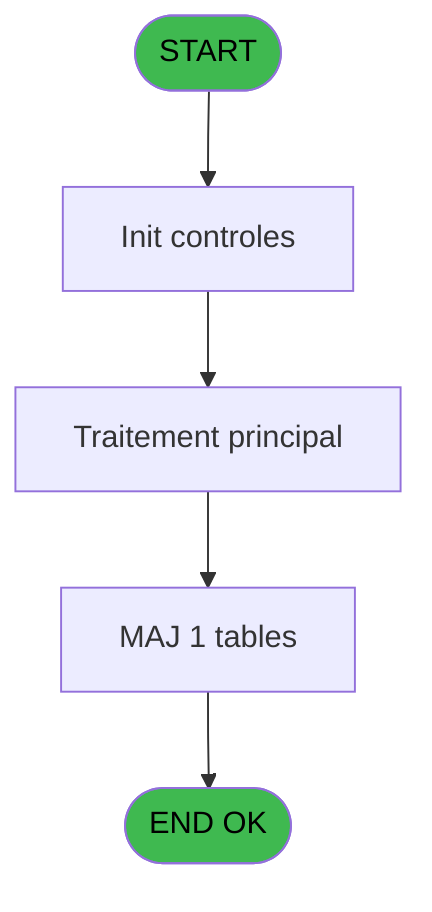

# GES IDE 49 - Param Table des pied recu

> **Analyse**: Phases 1-4 2026-02-03 11:38 -> 11:38 (15s) | Assemblage 11:38
> **Pipeline**: V7.2 Enrichi
> **Structure**: 4 onglets (Resume | Ecrans | Donnees | Connexions)

<!-- TAB:Resume -->

## 1. FICHE D'IDENTITE

| Attribut | Valeur |
|----------|--------|
| Projet | GES |
| IDE Position | 49 |
| Nom Programme | Param Table des pied recu |
| Fichier source | `Prg_49.xml` |
| Dossier IDE | Généralités |
| Taches | 1 (1 ecrans visibles) |
| Tables modifiees | 1 |
| Programmes appeles | 0 |

## 2. DESCRIPTION FONCTIONNELLE

**Param Table des pied recu** assure la gestion complete de ce processus, accessible depuis [Initialisations (IDE 47)](GES-IDE-47.md), [Initialisations (FTV 2.00) (IDE 120)](GES-IDE-120.md).

Le flux de traitement s'organise en **1 blocs fonctionnels** :

- **Traitement** (1 tache) : traitements metier divers

**Donnees modifiees** : 1 tables en ecriture (Commentaire supprime).

## 3. BLOCS FONCTIONNELS

### 3.1 Traitement (1 tache)

Traitements internes.

---

#### 49 - Paramétrage pied reçu [[ECRAN]](#ecran-t2)

**Role** : Traitement : Paramétrage pied reçu.
**Ecran** : 1494 x 217 DLU (MDI) | [Voir mockup](#ecran-t2)

## 5. REGLES METIER

*(Aucune regle metier identifiee)*

## 6. CONTEXTE

- **Appele par**: [Initialisations (IDE 47)](GES-IDE-47.md), [Initialisations (FTV 2.00) (IDE 120)](GES-IDE-120.md)
- **Appelle**: 0 programmes | **Tables**: 1 (W:1 R:0 L:0) | **Taches**: 1 | **Expressions**: 2

<!-- TAB:Ecrans -->

## 8. ECRANS

### 8.1 Forms visibles (1 / 1)

| # | Position | Tache | Nom | Type | Largeur | Hauteur | Bloc |
|---|----------|-------|-----|------|---------|---------|------|
| 1 | 49.1 | 49 | Paramétrage pied reçu | MDI | 1494 | 217 | Traitement |

### 8.2 Mockups Ecrans

---

#### 49.1 - Paramétrage pied reçu
**Tache** : [49](#t2) | **Type** : MDI | **Dimensions** : 1494 x 217 DLU
**Bloc** : Traitement | **Titre IDE** : Paramétrage pied reçu

<!-- FORM-DATA:
{
    "width":  1494,
    "vFactor":  8,
    "type":  "MDI",
    "hFactor":  8,
    "controls":  [
                     {
                         "x":  0,
                         "type":  "label",
                         "var":  "",
                         "y":  1,
                         "w":  1480,
                         "fmt":  "",
                         "name":  "",
                         "h":  19,
                         "color":  "",
                         "text":  "",
                         "parent":  null
                     },
                     {
                         "x":  28,
                         "type":  "label",
                         "var":  "",
                         "y":  27,
                         "w":  1451,
                         "fmt":  "",
                         "name":  "",
                         "h":  161,
                         "color":  "",
                         "text":  "",
                         "parent":  null
                     },
                     {
                         "x":  39,
                         "type":  "table",
                         "var":  "",
                         "name":  "",
                         "titleH":  12,
                         "color":  "110",
                         "w":  1453,
                         "y":  32,
                         "fmt":  "",
                         "parent":  null,
                         "text":  "",
                         "rowH":  15,
                         "h":  152,
                         "cols":  [
                                      {
                                          "title":  "Type article",
                                          "layer":  1,
                                          "w":  124
                                      },
                                      {
                                          "title":  "Texte pied reçu",
                                          "layer":  2,
                                          "w":  1269
                                      }
                                  ],
                         "rows":  2
                     },
                     {
                         "x":  0,
                         "type":  "label",
                         "var":  "",
                         "y":  192,
                         "w":  1480,
                         "fmt":  "",
                         "name":  "",
                         "h":  24,
                         "color":  "",
                         "text":  "",
                         "parent":  null
                     },
                     {
                         "x":  168,
                         "type":  "edit",
                         "var":  "",
                         "y":  47,
                         "w":  1264,
                         "fmt":  "",
                         "name":  "ppr_texte_pied_recu",
                         "h":  12,
                         "color":  "110",
                         "text":  "",
                         "parent":  5
                     },
                     {
                         "x":  3,
                         "type":  "edit",
                         "var":  "",
                         "y":  6,
                         "w":  203,
                         "fmt":  "30",
                         "name":  "",
                         "h":  8,
                         "color":  "",
                         "text":  "",
                         "parent":  1
                     },
                     {
                         "x":  1190,
                         "type":  "edit",
                         "var":  "",
                         "y":  7,
                         "w":  277,
                         "fmt":  "WWW DD MMM YYYYT",
                         "name":  "",
                         "h":  8,
                         "color":  "",
                         "text":  "",
                         "parent":  1
                     },
                     {
                         "x":  10,
                         "type":  "button",
                         "var":  "",
                         "y":  195,
                         "w":  154,
                         "fmt":  "\u0026Quitter",
                         "name":  "",
                         "h":  18,
                         "color":  "",
                         "text":  "",
                         "parent":  27
                     },
                     {
                         "x":  45,
                         "type":  "combobox",
                         "var":  "",
                         "y":  47,
                         "w":  112,
                         "fmt":  "",
                         "name":  "ppr_texte_pied_recu_0001",
                         "h":  12,
                         "color":  "110",
                         "text":  "VRL,VSL",
                         "parent":  5
                     }
                 ],
    "taskId":  "49.1",
    "height":  217
}
-->

<strong>Champs : 4 champs</strong>

| Pos (x,y) | Nom | Variable | Type |
|-----------|-----|----------|------|
| 168,47 | ppr_texte_pied_recu | - | edit |
| 3,6 | 30 | - | edit |
| 1190,7 | WWW DD MMM YYYYT | - | edit |
| 45,47 | ppr_texte_pied_recu_0001 | - | combobox |

<strong>Boutons : 1 boutons</strong>

| Bouton | Pos (x,y) | Action |
|--------|-----------|--------|
| Quitter | 10,195 | Quitte le programme |

## 9. NAVIGATION

Ecran unique: **Paramétrage pied reçu**

### 9.3 Structure hierarchique (1 tache)

| Position | Tache | Type | Dimensions | Bloc |
|----------|-------|------|------------|------|
| **49.1** | [**Paramétrage pied reçu** (49)](#t2) [mockup](#ecran-t2) | MDI | 1494x217 | Traitement |

### 9.4 Algorigramme

> **Legende**: Vert = START/END OK | Rouge = END KO | Bleu = Decisions
> *Algorigramme auto-genere. Utiliser `/algorigramme` pour une synthese metier detaillee.*

<!-- TAB:Donnees -->

## 10. TABLES

### Tables utilisees (1)

| ID | Nom | Description | Type | R | W | L | Usages |
|----|-----|-------------|------|---|---|---|--------|
| 820 | Commentaire supprime |  | DB |   | **W** |   | 1 |

### Colonnes par table (0 / 1 tables avec colonnes identifiees)

Table 820 - Commentaire supprime (**W**) - 1 usages

*Table utilisee uniquement en Link ou aucune colonne Real identifiee dans le DataView.*

## 11. VARIABLES

*(Programme sans variables locales mappees)*

## 12. EXPRESSIONS

**2 / 2 expressions decodees (100%)**

### 12.1 Repartition par type

| Type | Expressions | Regles |
|------|-------------|--------|
| DATE | 1 | 0 |
| REFERENCE_VG | 1 | 0 |

### 12.2 Expressions cles par type

#### DATE (1 expressions)

| Type | IDE | Expression | Regle |
|------|-----|------------|-------|
| DATE | 2 | `Date ()` | - |

#### REFERENCE_VG (1 expressions)

| Type | IDE | Expression | Regle |
|------|-----|------------|-------|
| REFERENCE_VG | 1 | `VG2` | - |

<!-- TAB:Connexions -->

## 13. GRAPHE D'APPELS

### 13.1 Chaine depuis Main (Callers)

Main -> ... -> [Initialisations (IDE 47)](GES-IDE-47.md) -> **Param Table des pied recu (IDE 49)**

Main -> ... -> [Initialisations (FTV 2.00) (IDE 120)](GES-IDE-120.md) -> **Param Table des pied recu (IDE 49)**

### 13.2 Callers

| IDE | Nom Programme | Nb Appels |
|-----|---------------|-----------|
| [47](GES-IDE-47.md) | Initialisations | 1 |
| [120](GES-IDE-120.md) | Initialisations (FTV 2.00) | 1 |

### 13.3 Callees (programmes appeles)

### 13.4 Detail Callees avec contexte

| IDE | Nom Programme | Appels | Contexte |
|-----|---------------|--------|----------|
| - | (aucun) | - | - |

## 14. RECOMMANDATIONS MIGRATION

### 14.1 Profil du programme

| Metrique | Valeur | Impact migration |
|----------|--------|-----------------|
| Lignes de logique | 11 | Programme compact |
| Expressions | 2 | Peu de logique |
| Tables WRITE | 1 | Impact faible |
| Sous-programmes | 0 | Peu de dependances |
| Ecrans visibles | 1 | Ecran unique ou traitement batch |
| Code desactive | 0% (0 / 11) | Code sain |
| Regles metier | 0 | Pas de regle identifiee |

### 14.2 Plan de migration par bloc

#### Traitement (1 tache: 1 ecran, 0 traitement)

- **Strategie** : 1 composant(s) UI (Razor/React) avec formulaires et validation.
- Decomposer les taches en services unitaires testables.

### 14.3 Dependances critiques

| Dependance | Type | Appels | Impact |
|------------|------|--------|--------|
| Commentaire supprime | Table WRITE (Database) | 1x | Schema + repository |

---
*Spec DETAILED generee par Pipeline V7.2 - 2026-02-03 11:38*
