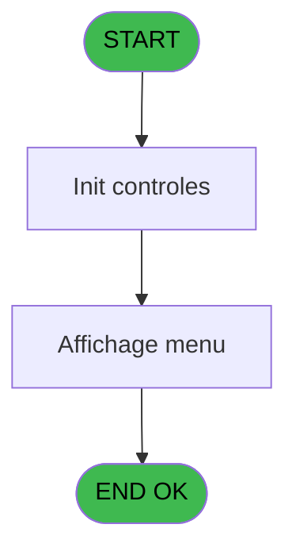
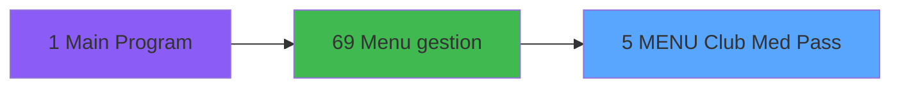
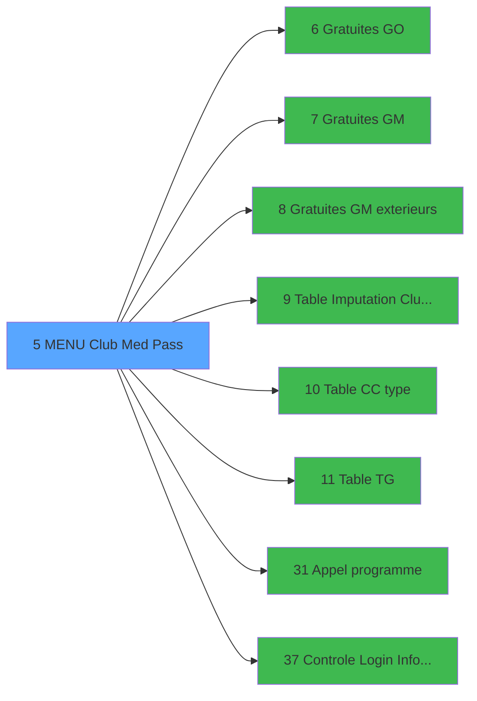

# GES IDE 5 - MENU  Club Med Pass

> **Analyse**: Phases 1-4 2026-02-03 11:25 -> 11:25 (14s) | Assemblage 11:25
> **Pipeline**: V7.2 Enrichi
> **Structure**: 4 onglets (Resume | Ecrans | Donnees | Connexions)

<!-- TAB:Resume -->

## 1. FICHE D'IDENTITE

| Attribut | Valeur |
|----------|--------|
| Projet | GES |
| IDE Position | 5 |
| Nom Programme | MENU  Club Med Pass |
| Fichier source | `Prg_5.xml` |
| Dossier IDE | Bar |
| Taches | 3 (1 ecrans visibles) |
| Tables modifiees | 0 |
| Programmes appeles | 8 |

## 2. DESCRIPTION FONCTIONNELLE

**MENU  Club Med Pass** assure la gestion complete de ce processus, accessible depuis [Menu gestion (IDE 69)](GES-IDE-69.md).

Le flux de traitement s'organise en **1 blocs fonctionnels** :

- **Traitement** (3 taches) : traitements metier divers

## 3. BLOCS FONCTIONNELS

### 3.1 Traitement (3 taches)

Traitements internes.

---

#### 5 - CG Menu operations monetiques [[ECRAN]](#ecran-t1)

**Role** : Traitement : CG Menu operations monetiques.
**Ecran** : 640 x 184 DLU (MDI) | [Voir mockup](#ecran-t1)
**Delegue a** : [Gratuites GO (IDE 6)](GES-IDE-6.md), [Gratuites GM (IDE 7)](GES-IDE-7.md), [Gratuites GM exterieurs (IDE 8)](GES-IDE-8.md)

---

#### 5.1 - Menu operations monetiques [[ECRAN]](#ecran-t2)

**Role** : Traitement : Menu operations monetiques.
**Ecran** : 859 x 192 DLU (MDI) | [Voir mockup](#ecran-t2)
**Delegue a** : [Gratuites GO (IDE 6)](GES-IDE-6.md), [Gratuites GM (IDE 7)](GES-IDE-7.md), [Gratuites GM exterieurs (IDE 8)](GES-IDE-8.md)

---

#### 5.2 - Config TAI

**Role** : Traitement : Config TAI.
**Delegue a** : [Gratuites GO (IDE 6)](GES-IDE-6.md), [Gratuites GM (IDE 7)](GES-IDE-7.md), [Gratuites GM exterieurs (IDE 8)](GES-IDE-8.md)

## 5. REGLES METIER

*(Aucune regle metier identifiee)*

## 6. CONTEXTE

- **Appele par**: [Menu gestion (IDE 69)](GES-IDE-69.md)
- **Appelle**: 8 programmes | **Tables**: 1 (W:0 R:1 L:0) | **Taches**: 3 | **Expressions**: 10

<!-- TAB:Ecrans -->

## 8. ECRANS

### 8.1 Forms visibles (1 / 3)

| # | Position | Tache | Nom | Type | Largeur | Hauteur | Bloc |
|---|----------|-------|-----|------|---------|---------|------|
| 1 | 5.1 | 5.1 | Menu operations monetiques | MDI | 859 | 192 | Traitement |

### 8.2 Mockups Ecrans

---

#### 5.1 - Menu operations monetiques
**Tache** : [5.1](#t2) | **Type** : MDI | **Dimensions** : 859 x 192 DLU
**Bloc** : Traitement | **Titre IDE** : Menu operations monetiques

<!-- FORM-DATA:
{
    "width":  859,
    "vFactor":  8,
    "type":  "MDI",
    "hFactor":  8,
    "controls":  [
                     {
                         "x":  0,
                         "type":  "label",
                         "var":  "",
                         "y":  0,
                         "w":  856,
                         "fmt":  "",
                         "name":  "",
                         "h":  19,
                         "color":  "",
                         "text":  "",
                         "parent":  null
                     },
                     {
                         "x":  0,
                         "type":  "label",
                         "var":  "",
                         "y":  21,
                         "w":  856,
                         "fmt":  "",
                         "name":  "",
                         "h":  141,
                         "color":  "",
                         "text":  "",
                         "parent":  null
                     },
                     {
                         "x":  294,
                         "type":  "label",
                         "var":  "",
                         "y":  27,
                         "w":  537,
                         "fmt":  "",
                         "name":  "",
                         "h":  127,
                         "color":  "",
                         "text":  "",
                         "parent":  null
                     },
                     {
                         "x":  302,
                         "type":  "label",
                         "var":  "",
                         "y":  31,
                         "w":  518,
                         "fmt":  "",
                         "name":  "",
                         "h":  92,
                         "color":  "",
                         "text":  "",
                         "parent":  5
                     },
                     {
                         "x":  305,
                         "type":  "label",
                         "var":  "",
                         "y":  34,
                         "w":  45,
                         "fmt":  "",
                         "name":  "",
                         "h":  86,
                         "color":  "",
                         "text":  "",
                         "parent":  5
                     },
                     {
                         "x":  357,
                         "type":  "label",
                         "var":  "",
                         "y":  38,
                         "w":  458,
                         "fmt":  "",
                         "name":  "",
                         "h":  8,
                         "color":  "142",
                         "text":  "Paramètre Club Med Pass",
                         "parent":  5
                     },
                     {
                         "x":  357,
                         "type":  "label",
                         "var":  "",
                         "y":  50,
                         "w":  458,
                         "fmt":  "",
                         "name":  "",
                         "h":  8,
                         "color":  "142",
                         "text":  "Table des imputations Club Med Pass",
                         "parent":  5
                     },
                     {
                         "x":  357,
                         "type":  "label",
                         "var":  "",
                         "y":  63,
                         "w":  458,
                         "fmt":  "",
                         "name":  "",
                         "h":  8,
                         "color":  "142",
                         "text":  "Table des types de crédit de conso",
                         "parent":  5
                     },
                     {
                         "x":  357,
                         "type":  "label",
                         "var":  "",
                         "y":  76,
                         "w":  458,
                         "fmt":  "",
                         "name":  "",
                         "h":  8,
                         "color":  "142",
                         "text":  "Gestion des crédits de conso GO",
                         "parent":  5
                     },
                     {
                         "x":  357,
                         "type":  "label",
                         "var":  "",
                         "y":  89,
                         "w":  458,
                         "fmt":  "",
                         "name":  "",
                         "h":  8,
                         "color":  "142",
                         "text":  "Gestion des crédits de conso GM",
                         "parent":  5
                     },
                     {
                         "x":  357,
                         "type":  "label",
                         "var":  "",
                         "y":  102,
                         "w":  458,
                         "fmt":  "",
                         "name":  "",
                         "h":  9,
                         "color":  "142",
                         "text":  "Gestion des crédits de conso GM Exterieurs",
                         "parent":  5
                     },
                     {
                         "x":  0,
                         "type":  "label",
                         "var":  "",
                         "y":  165,
                         "w":  856,
                         "fmt":  "",
                         "name":  "",
                         "h":  24,
                         "color":  "",
                         "text":  "",
                         "parent":  null
                     },
                     {
                         "x":  522,
                         "type":  "edit",
                         "var":  "",
                         "y":  131,
                         "w":  26,
                         "fmt":  "",
                         "name":  "",
                         "h":  10,
                         "color":  "6",
                         "text":  "",
                         "parent":  5
                     },
                     {
                         "x":  8,
                         "type":  "edit",
                         "var":  "",
                         "y":  4,
                         "w":  267,
                         "fmt":  "20",
                         "name":  "",
                         "h":  8,
                         "color":  "",
                         "text":  "",
                         "parent":  1
                     },
                     {
                         "x":  522,
                         "type":  "edit",
                         "var":  "",
                         "y":  5,
                         "w":  321,
                         "fmt":  "WWW DD MMM YYYYT",
                         "name":  "",
                         "h":  8,
                         "color":  "",
                         "text":  "",
                         "parent":  1
                     },
                     {
                         "x":  75,
                         "type":  "image",
                         "var":  "",
                         "y":  50,
                         "w":  144,
                         "fmt":  "",
                         "name":  "",
                         "h":  62,
                         "color":  "",
                         "text":  "",
                         "parent":  null
                     },
                     {
                         "x":  357,
                         "type":  "edit",
                         "var":  "",
                         "y":  131,
                         "w":  154,
                         "fmt":  "30",
                         "name":  "",
                         "h":  10,
                         "color":  "",
                         "text":  "",
                         "parent":  5
                     },
                     {
                         "x":  9,
                         "type":  "edit",
                         "var":  "",
                         "y":  144,
                         "w":  277,
                         "fmt":  "30",
                         "name":  "",
                         "h":  10,
                         "color":  "143",
                         "text":  "",
                         "parent":  4
                     },
                     {
                         "x":  314,
                         "type":  "button",
                         "var":  "",
                         "y":  37,
                         "w":  26,
                         "fmt":  "A",
                         "name":  "A",
                         "h":  9,
                         "color":  "",
                         "text":  "",
                         "parent":  null
                     },
                     {
                         "x":  314,
                         "type":  "button",
                         "var":  "",
                         "y":  50,
                         "w":  26,
                         "fmt":  "B",
                         "name":  "B",
                         "h":  9,
                         "color":  "",
                         "text":  "",
                         "parent":  null
                     },
                     {
                         "x":  314,
                         "type":  "button",
                         "var":  "",
                         "y":  63,
                         "w":  26,
                         "fmt":  "C",
                         "name":  "C",
                         "h":  9,
                         "color":  "",
                         "text":  "",
                         "parent":  null
                     },
                     {
                         "x":  314,
                         "type":  "button",
                         "var":  "",
                         "y":  76,
                         "w":  26,
                         "fmt":  "D",
                         "name":  "D",
                         "h":  9,
                         "color":  "",
                         "text":  "",
                         "parent":  null
                     },
                     {
                         "x":  314,
                         "type":  "button",
                         "var":  "",
                         "y":  89,
                         "w":  26,
                         "fmt":  "E",
                         "name":  "E",
                         "h":  9,
                         "color":  "",
                         "text":  "",
                         "parent":  null
                     },
                     {
                         "x":  314,
                         "type":  "button",
                         "var":  "",
                         "y":  102,
                         "w":  26,
                         "fmt":  "F",
                         "name":  "F",
                         "h":  9,
                         "color":  "",
                         "text":  "",
                         "parent":  null
                     },
                     {
                         "x":  6,
                         "type":  "button",
                         "var":  "",
                         "y":  168,
                         "w":  168,
                         "fmt":  "\u0026Quitter",
                         "name":  "",
                         "h":  18,
                         "color":  "",
                         "text":  "",
                         "parent":  null
                     }
                 ],
    "taskId":  "5.1",
    "height":  192
}
-->

<strong>Champs : 5 champs</strong>

| Pos (x,y) | Nom | Variable | Type |
|-----------|-----|----------|------|
| 522,131 | (sans nom) | - | edit |
| 8,4 | 20 | - | edit |
| 522,5 | WWW DD MMM YYYYT | - | edit |
| 357,131 | 30 | - | edit |
| 9,144 | 30 | - | edit |

<strong>Boutons : 7 boutons</strong>

| Bouton | Pos (x,y) | Action |
|--------|-----------|--------|
| A | 314,37 | Bouton fonctionnel |
| B | 314,50 | Bouton fonctionnel |
| C | 314,63 | Bouton fonctionnel |
| D | 314,76 | Bouton fonctionnel |
| E | 314,89 | Bouton fonctionnel |
| F | 314,102 | Bouton fonctionnel |
| Quitter | 6,168 | Quitte le programme |

## 9. NAVIGATION

Ecran unique: **Menu operations monetiques**

### 9.3 Structure hierarchique (3 taches)

| Position | Tache | Type | Dimensions | Bloc |
|----------|-------|------|------------|------|
| **5.1** | [**CG Menu operations monetiques** (5)](#t1) [mockup](#ecran-t1) | MDI | 640x184 | Traitement |
| 5.1.1 | [Menu operations monetiques (5.1)](#t2) [mockup](#ecran-t2) | MDI | 859x192 | |
| 5.1.2 | [Config TAI (5.2)](#t3) | MDI | - | |

### 9.4 Algorigramme

> **Legende**: Vert = START/END OK | Rouge = END KO | Bleu = Decisions
> *Algorigramme auto-genere. Utiliser `/algorigramme` pour une synthese metier detaillee.*

<!-- TAB:Donnees -->

## 10. TABLES

### Tables utilisees (1)

| ID | Nom | Description | Type | R | W | L | Usages |
|----|-----|-------------|------|---|---|---|--------|
| 728 | arc_cc_total |  | DB | R |   |   | 1 |

### Colonnes par table (0 / 1 tables avec colonnes identifiees)

Table 728 - arc_cc_total (R) - 1 usages

*Table utilisee uniquement en Link ou aucune colonne Real identifiee dans le DataView.*

## 11. VARIABLES

### 11.1 Parametres entrants (8)

Variables recues du programme appelant ([Menu gestion (IDE 69)](GES-IDE-69.md)).

| Lettre | Nom | Type | Usage dans |
|--------|-----|------|-----------|
| A | P0 societe | Alpha | 1x parametre entrant |
| B | P0 masque montant | Alpha | - |
| C | P0 Devise locale | Alpha | - |
| D | P0 nom village | Alpha | - |
| E | P0 masque cumul | Alpha | - |
| F | P0 nbre decimales | Numeric | - |
| G | PO code village | Alpha | - |
| H | P0 Village TAI | Alpha | - |

### 11.2 Variables de travail (3)

Variables internes au programme.

| Lettre | Nom | Type | Usage dans |
|--------|-----|------|-----------|
| I | W0 Cle | Logical | 1x calcul interne |
| J | W0 TAI Obligatoire | Alpha | - |
| K | W0 choix action | Alpha | 7x calcul interne |

## 12. EXPRESSIONS

**10 / 10 expressions decodees (100%)**

### 12.1 Repartition par type

| Type | Expressions | Regles |
|------|-------------|--------|
| CONSTANTE | 1 | 0 |
| CONDITION | 8 | 0 |
| OTHER | 1 | 0 |

### 12.2 Expressions cles par type

#### CONSTANTE (1 expressions)

| Type | IDE | Expression | Regle |
|------|-----|------------|-------|
| CONSTANTE | 8 | `'C'` | - |

#### CONDITION (8 expressions)

| Type | IDE | Expression | Regle |
|------|-----|------------|-------|
| CONDITION | 6 | `W0 choix action [K]='F'` | - |
| CONDITION | 5 | `W0 choix action [K]='E'` | - |
| CONDITION | 9 | `P0 societe [A]=''` | - |
| CONDITION | 7 | `W0 choix action [K]='Z'` | - |
| CONDITION | 2 | `W0 choix action [K]='B'` | - |
| ... | | *+3 autres* | |

#### OTHER (1 expressions)

| Type | IDE | Expression | Regle |
|------|-----|------------|-------|
| OTHER | 10 | `W0 Cle [I]` | - |

<!-- TAB:Connexions -->

## 13. GRAPHE D'APPELS

### 13.1 Chaine depuis Main (Callers)

Main -> ... -> [Menu gestion (IDE 69)](GES-IDE-69.md) -> **MENU  Club Med Pass (IDE 5)**

### 13.2 Callers

| IDE | Nom Programme | Nb Appels |
|-----|---------------|-----------|
| [69](GES-IDE-69.md) | Menu gestion | 1 |

### 13.3 Callees (programmes appeles)

### 13.4 Detail Callees avec contexte

| IDE | Nom Programme | Appels | Contexte |
|-----|---------------|--------|----------|
| [6](GES-IDE-6.md) | Gratuites GO | 1 | Sous-programme |
| [7](GES-IDE-7.md) | Gratuites GM | 1 | Sous-programme |
| [8](GES-IDE-8.md) | Gratuites GM exterieurs | 1 | Sous-programme |
| [9](GES-IDE-9.md) | Table Imputation Club Med Pass | 1 | Sous-programme |
| [10](GES-IDE-10.md) | Table CC type | 1 | Sous-programme |
| [11](GES-IDE-11.md) | Table TG | 1 | Sous-programme |
| [31](GES-IDE-31.md) | Appel programme | 1 | Sous-programme |
| [37](GES-IDE-37.md) | Controle Login Informaticien | 1 | Controle/validation |

## 14. RECOMMANDATIONS MIGRATION

### 14.1 Profil du programme

| Metrique | Valeur | Impact migration |
|----------|--------|-----------------|
| Lignes de logique | 43 | Programme compact |
| Expressions | 10 | Peu de logique |
| Tables WRITE | 0 | Impact faible |
| Sous-programmes | 8 | Dependances moderees |
| Ecrans visibles | 1 | Ecran unique ou traitement batch |
| Code desactive | 0% (0 / 43) | Code sain |
| Regles metier | 0 | Pas de regle identifiee |

### 14.2 Plan de migration par bloc

#### Traitement (3 taches: 2 ecrans, 1 traitement)

- **Strategie** : Orchestrateur avec 2 ecrans (Razor/React) et 1 traitements backend (services).
- Les ecrans deviennent des composants UI, les traitements invisibles deviennent des services injectables.
- 8 sous-programme(s) a migrer ou a reutiliser depuis les services existants.
- Decomposer les taches en services unitaires testables.

### 14.3 Dependances critiques

| Dependance | Type | Appels | Impact |
|------------|------|--------|--------|
| [Table TG (IDE 11)](GES-IDE-11.md) | Sous-programme | 1x | Normale - Sous-programme |
| [Table CC type (IDE 10)](GES-IDE-10.md) | Sous-programme | 1x | Normale - Sous-programme |
| [Controle Login Informaticien (IDE 37)](GES-IDE-37.md) | Sous-programme | 1x | Normale - Controle/validation |
| [Appel programme (IDE 31)](GES-IDE-31.md) | Sous-programme | 1x | Normale - Sous-programme |
| [Gratuites GM (IDE 7)](GES-IDE-7.md) | Sous-programme | 1x | Normale - Sous-programme |
| [Gratuites GO (IDE 6)](GES-IDE-6.md) | Sous-programme | 1x | Normale - Sous-programme |
| [Table Imputation Club Med Pass (IDE 9)](GES-IDE-9.md) | Sous-programme | 1x | Normale - Sous-programme |
| [Gratuites GM exterieurs (IDE 8)](GES-IDE-8.md) | Sous-programme | 1x | Normale - Sous-programme |

---
*Spec DETAILED generee par Pipeline V7.2 - 2026-02-03 11:25*
