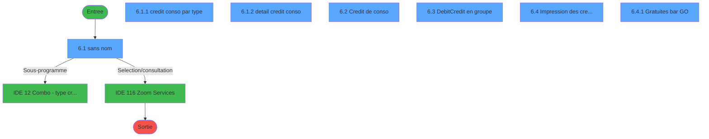
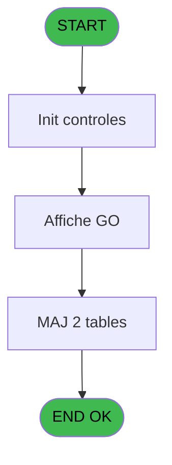
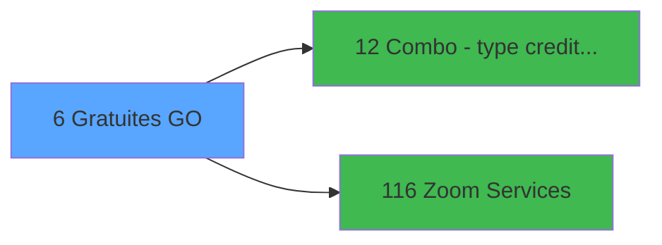

# GES IDE 6 - Gratuites GO

> **Analyse**: Phases 1-4 2026-02-03 11:25 -> 11:25 (14s) | Assemblage 11:25
> **Pipeline**: V7.2 Enrichi
> **Structure**: 4 onglets (Resume | Ecrans | Donnees | Connexions)

<!-- TAB:Resume -->

## 1. FICHE D'IDENTITE

| Attribut | Valeur |
|----------|--------|
| Projet | GES |
| IDE Position | 6 |
| Nom Programme | Gratuites GO |
| Fichier source | `Prg_6.xml` |
| Dossier IDE | Bar |
| Taches | 16 (7 ecrans visibles) |
| Tables modifiees | 2 |
| Programmes appeles | 2 |

## 2. DESCRIPTION FONCTIONNELLE

**Gratuites GO** assure la gestion complete de ce processus, accessible depuis [MENU  Club Med Pass (IDE 5)](GES-IDE-5.md).

Le flux de traitement s'organise en **2 blocs fonctionnels** :

- **Traitement** (14 taches) : traitements metier divers
- **Calcul** (2 taches) : calculs de montants, stocks ou compteurs

**Donnees modifiees** : 2 tables en ecriture (ccrejet, cc_total).

Detail : phases du traitement

#### Phase 1 : Traitement (14 taches)

- **6** - Gratuites GO
- **6.1** - (sans nom) **[[ECRAN]](#ecran-t2)**
- **6.1.1** - credit conso par type **[[ECRAN]](#ecran-t3)**
- **6.1.2** - detail credit conso **[[ECRAN]](#ecran-t4)**
- **6.2** - Credit de conso **[[ECRAN]](#ecran-t5)**
- **6.2.1** - Credit de conso **[[ECRAN]](#ecran-t6)**
- **6.2.2** - CC rejet
- **6.2.3** - Gratuites bar GO **[[ECRAN]](#ecran-t10)**
- **6.2.4** - vide CC rejet
- **6.3** - Debit/Credit en groupe **[[ECRAN]](#ecran-t12)**
- **6.4** - Impression des credit de conso **[[ECRAN]](#ecran-t13)**
- **6.4.1** - Gratuites bar GO **[[ECRAN]](#ecran-t14)**
- **6.4.1.1** - Browse - CC detail
- **6.4.1.2** - Browse - CC par type

Delegue a : [Combo - type credit conso (IDE 12)](GES-IDE-12.md)

#### Phase 2 : Calcul (2 taches)

- **6.2.1.1** - CC Comptable **[[ECRAN]](#ecran-t7)**
- **6.2.1.2** - CC Comptable Intermed **[[ECRAN]](#ecran-t8)**

#### Tables impactees

| Table | Operations | Role metier |
|-------|-----------|-------------|
| ccrejet | R/**W**/L (4 usages) |  |
| cc_total | **W**/L (2 usages) |  |

## 3. BLOCS FONCTIONNELS

### 3.1 Traitement (14 taches)

Traitements internes.

---

#### 6 - Gratuites GO

**Role** : Tache d'orchestration : point d'entree du programme (14 sous-taches). Coordonne l'enchainement des traitements.

13 sous-taches directes

| Tache | Nom | Bloc |
|-------|-----|------|
| [6.1](#t2) | (sans nom) **[[ECRAN]](#ecran-t2)** | Traitement |
| [6.1.1](#t3) | credit conso par type **[[ECRAN]](#ecran-t3)** | Traitement |
| [6.1.2](#t4) | detail credit conso **[[ECRAN]](#ecran-t4)** | Traitement |
| [6.2](#t5) | Credit de conso **[[ECRAN]](#ecran-t5)** | Traitement |
| [6.2.1](#t6) | Credit de conso **[[ECRAN]](#ecran-t6)** | Traitement |
| [6.2.2](#t9) | CC rejet | Traitement |
| [6.2.3](#t10) | Gratuites bar GO **[[ECRAN]](#ecran-t10)** | Traitement |
| [6.2.4](#t11) | vide CC rejet | Traitement |
| [6.3](#t12) | Debit/Credit en groupe **[[ECRAN]](#ecran-t12)** | Traitement |
| [6.4](#t13) | Impression des credit de conso **[[ECRAN]](#ecran-t13)** | Traitement |
| [6.4.1](#t14) | Gratuites bar GO **[[ECRAN]](#ecran-t14)** | Traitement |
| [6.4.1.1](#t15) | Browse - CC detail | Traitement |
| [6.4.1.2](#t16) | Browse - CC par type | Traitement |

---

#### 6.1 - (sans nom) [[ECRAN]](#ecran-t2)

**Role** : Traitement interne.
**Ecran** : 1528 x 314 DLU (MDI) | [Voir mockup](#ecran-t2)

---

#### 6.1.1 - credit conso par type [[ECRAN]](#ecran-t3)

**Role** : Calcul fidelite/avantage : credit conso par type.
**Ecran** : 251 x 88 DLU (Modal) | [Voir mockup](#ecran-t3)
**Variables liees** : J (v.type CS), O (v.List combo type CS)

---

#### 6.1.2 - detail credit conso [[ECRAN]](#ecran-t4)

**Role** : Calcul fidelite/avantage : detail credit conso.
**Ecran** : 329 x 84 DLU (Modal) | [Voir mockup](#ecran-t4)

---

#### 6.2 - Credit de conso [[ECRAN]](#ecran-t5)

**Role** : Calcul fidelite/avantage : Credit de conso.
**Ecran** : 423 x 56 DLU (MDI) | [Voir mockup](#ecran-t5)

---

#### 6.2.1 - Credit de conso [[ECRAN]](#ecran-t6)

**Role** : Calcul fidelite/avantage : Credit de conso.
**Ecran** : 214 x 81 DLU (MDI) | [Voir mockup](#ecran-t6)

---

#### 6.2.2 - CC rejet

**Role** : Traitement : CC rejet.

---

#### 6.2.3 - Gratuites bar GO [[ECRAN]](#ecran-t10)

**Role** : Traitement : Gratuites bar GO.
**Ecran** : 424 x 57 DLU (MDI) | [Voir mockup](#ecran-t10)

---

#### 6.2.4 - vide CC rejet

**Role** : Traitement : vide CC rejet.

---

#### 6.3 - Debit/Credit en groupe [[ECRAN]](#ecran-t12)

**Role** : Calcul fidelite/avantage : Debit/Credit en groupe.
**Ecran** : 274 x 109 DLU (MDI) | [Voir mockup](#ecran-t12)
**Variables liees** : P (v.confirmation groupe)

---

#### 6.4 - Impression des credit de conso [[ECRAN]](#ecran-t13)

**Role** : Generation du document : Impression des credit de conso.
**Ecran** : 638 x 118 DLU (MDI) | [Voir mockup](#ecran-t13)

---

#### 6.4.1 - Gratuites bar GO [[ECRAN]](#ecran-t14)

**Role** : Traitement : Gratuites bar GO.
**Ecran** : 424 x 57 DLU (MDI) | [Voir mockup](#ecran-t14)

---

#### 6.4.1.1 - Browse - CC detail

**Role** : Traitement : Browse - CC detail.

---

#### 6.4.1.2 - Browse - CC par type

**Role** : Traitement : Browse - CC par type.
**Variables liees** : J (v.type CS), O (v.List combo type CS)

### 3.2 Calcul (2 taches)

Calculs metier : montants, stocks, compteurs.

---

#### 6.2.1.1 - CC Comptable [[ECRAN]](#ecran-t7)

**Role** : Traitement : CC Comptable.
**Ecran** : 128 x 52 DLU (MDI) | [Voir mockup](#ecran-t7)

---

#### 6.2.1.2 - CC Comptable Intermed [[ECRAN]](#ecran-t8)

**Role** : Traitement : CC Comptable Intermed.
**Ecran** : 87 x 59 DLU (MDI) | [Voir mockup](#ecran-t8)

## 5. REGLES METIER

*(Aucune regle metier identifiee)*

## 6. CONTEXTE

- **Appele par**: [MENU  Club Med Pass (IDE 5)](GES-IDE-5.md)
- **Appelle**: 2 programmes | **Tables**: 13 (W:2 R:9 L:9) | **Taches**: 16 | **Expressions**: 15

<!-- TAB:Ecrans -->

## 8. ECRANS

### 8.1 Forms visibles (7 / 16)

| # | Position | Tache | Nom | Type | Largeur | Hauteur | Bloc |
|---|----------|-------|-----|------|---------|---------|------|
| 1 | 6.1 | 6.1 | (sans nom) | MDI | 1528 | 314 | Traitement |
| 2 | 6.1.1 | 6.1.1 | credit conso par type | Modal | 251 | 88 | Traitement |
| 3 | 6.1.2 | 6.1.2 | detail credit conso | Modal | 329 | 84 | Traitement |
| 4 | 6.2 | 6.2 | Credit de conso | MDI | 423 | 56 | Traitement |
| 5 | 6.3 | 6.3 | Debit/Credit en groupe | MDI | 274 | 109 | Traitement |
| 6 | 6.4 | 6.4 | Impression des credit de conso | MDI | 638 | 118 | Traitement |
| 7 | 6.4.1 | 6.4.1 | Gratuites bar GO | MDI | 424 | 57 | Traitement |

### 8.2 Mockups Ecrans

---

#### 6.1 - (sans nom)
**Tache** : [6.1](#t2) | **Type** : MDI | **Dimensions** : 1528 x 314 DLU
**Bloc** : Traitement | **Titre IDE** : (sans nom)

<!-- FORM-DATA:
{
    "width":  1528,
    "vFactor":  8,
    "type":  "MDI",
    "hFactor":  8,
    "controls":  [
                     {
                         "x":  0,
                         "type":  "label",
                         "var":  "",
                         "y":  1,
                         "w":  1520,
                         "fmt":  "",
                         "name":  "",
                         "h":  18,
                         "color":  "",
                         "text":  "",
                         "parent":  null
                     },
                     {
                         "x":  36,
                         "type":  "table",
                         "var":  "",
                         "name":  "",
                         "titleH":  15,
                         "color":  "110",
                         "w":  1486,
                         "y":  25,
                         "fmt":  "",
                         "parent":  null,
                         "text":  "",
                         "rowH":  15,
                         "h":  119,
                         "cols":  [
                                      {
                                          "title":  "Nom",
                                          "layer":  1,
                                          "w":  212
                                      },
                                      {
                                          "title":  "Prénom",
                                          "layer":  2,
                                          "w":  134
                                      },
                                      {
                                          "title":  "Service",
                                          "layer":  3,
                                          "w":  155
                                      },
                                      {
                                          "title":  "Qualité",
                                          "layer":  4,
                                          "w":  155
                                      },
                                      {
                                          "title":  "Fonction",
                                          "layer":  5,
                                          "w":  211
                                      },
                                      {
                                          "title":  "Cat. Emploi",
                                          "layer":  6,
                                          "w":  100
                                      },
                                      {
                                          "title":  "Date début",
                                          "layer":  7,
                                          "w":  132
                                      },
                                      {
                                          "title":  "Date fin",
                                          "layer":  8,
                                          "w":  132
                                      },
                                      {
                                          "title":  "Crédit de conso",
                                          "layer":  9,
                                          "w":  214
                                      }
                                  ],
                         "rows":  9
                     },
                     {
                         "x":  44,
                         "type":  "label",
                         "var":  "",
                         "y":  26,
                         "w":  1178,
                         "fmt":  "",
                         "name":  "",
                         "h":  14,
                         "color":  "5",
                         "text":  "",
                         "parent":  null
                     },
                     {
                         "x":  34,
                         "type":  "label",
                         "var":  "",
                         "y":  151,
                         "w":  650,
                         "fmt":  "",
                         "name":  "",
                         "h":  30,
                         "color":  "",
                         "text":  "Filtre",
                         "parent":  null
                     },
                     {
                         "x":  697,
                         "type":  "label",
                         "var":  "",
                         "y":  151,
                         "w":  418,
                         "fmt":  "",
                         "name":  "",
                         "h":  30,
                         "color":  "",
                         "text":  "Dedit / Credit",
                         "parent":  null
                     },
                     {
                         "x":  1135,
                         "type":  "label",
                         "var":  "",
                         "y":  151,
                         "w":  383,
                         "fmt":  "",
                         "name":  "",
                         "h":  30,
                         "color":  "",
                         "text":  "Impression",
                         "parent":  null
                     },
                     {
                         "x":  42,
                         "type":  "label",
                         "var":  "",
                         "y":  190,
                         "w":  470,
                         "fmt":  "",
                         "name":  "",
                         "h":  12,
                         "color":  "142",
                         "text":  "Position par type de credit",
                         "parent":  null
                     },
                     {
                         "x":  876,
                         "type":  "label",
                         "var":  "",
                         "y":  190,
                         "w":  643,
                         "fmt":  "",
                         "name":  "",
                         "h":  12,
                         "color":  "142",
                         "text":  "Historique des crédits effectués",
                         "parent":  null
                     },
                     {
                         "x":  0,
                         "type":  "label",
                         "var":  "",
                         "y":  293,
                         "w":  1520,
                         "fmt":  "",
                         "name":  "",
                         "h":  21,
                         "color":  "",
                         "text":  "",
                         "parent":  null
                     },
                     {
                         "x":  45,
                         "type":  "edit",
                         "var":  "",
                         "y":  42,
                         "w":  200,
                         "fmt":  "",
                         "name":  "GO nom",
                         "h":  11,
                         "color":  "6",
                         "text":  "",
                         "parent":  4
                     },
                     {
                         "x":  254,
                         "type":  "edit",
                         "var":  "",
                         "y":  42,
                         "w":  122,
                         "fmt":  "",
                         "name":  "GO prenom",
                         "h":  11,
                         "color":  "6",
                         "text":  "",
                         "parent":  4
                     },
                     {
                         "x":  389,
                         "type":  "edit",
                         "var":  "",
                         "y":  42,
                         "w":  141,
                         "fmt":  "",
                         "name":  "",
                         "h":  11,
                         "color":  "6",
                         "text":  "",
                         "parent":  4
                     },
                     {
                         "x":  1010,
                         "type":  "edit",
                         "var":  "",
                         "y":  42,
                         "w":  120,
                         "fmt":  "",
                         "name":  "",
                         "h":  11,
                         "color":  "6",
                         "text":  "",
                         "parent":  4
                     },
                     {
                         "x":  1141,
                         "type":  "edit",
                         "var":  "",
                         "y":  42,
                         "w":  120,
                         "fmt":  "",
                         "name":  "",
                         "h":  11,
                         "color":  "6",
                         "text":  "",
                         "parent":  4
                     },
                     {
                         "x":  1274,
                         "type":  "edit",
                         "var":  "",
                         "y":  42,
                         "w":  194,
                         "fmt":  "",
                         "name":  "",
                         "h":  11,
                         "color":  "6",
                         "text":  "",
                         "parent":  4
                     },
                     {
                         "x":  353,
                         "type":  "combobox",
                         "var":  "",
                         "y":  163,
                         "w":  166,
                         "fmt":  "",
                         "name":  "v.combo type CS",
                         "h":  18,
                         "color":  "110",
                         "text":  "list CS",
                         "parent":  null
                     },
                     {
                         "x":  14,
                         "type":  "edit",
                         "var":  "",
                         "y":  5,
                         "w":  396,
                         "fmt":  "30",
                         "name":  "",
                         "h":  11,
                         "color":  "",
                         "text":  "",
                         "parent":  null
                     },
                     {
                         "x":  1211,
                         "type":  "edit",
                         "var":  "",
                         "y":  5,
                         "w":  298,
                         "fmt":  "WWW DD MMM YYYYT",
                         "name":  "",
                         "h":  11,
                         "color":  "",
                         "text":  "",
                         "parent":  null
                     },
                     {
                         "x":  215,
                         "type":  "button",
                         "var":  "",
                         "y":  160,
                         "w":  130,
                         "fmt":  "Service",
                         "name":  "S",
                         "h":  18,
                         "color":  "",
                         "text":  "",
                         "parent":  null
                     },
                     {
                         "x":  842,
                         "type":  "button",
                         "var":  "",
                         "y":  160,
                         "w":  129,
                         "fmt":  "Individuel",
                         "name":  "GI",
                         "h":  18,
                         "color":  "",
                         "text":  "",
                         "parent":  null
                     },
                     {
                         "x":  979,
                         "type":  "button",
                         "var":  "",
                         "y":  160,
                         "w":  129,
                         "fmt":  "Groupe",
                         "name":  "GG",
                         "h":  18,
                         "color":  "",
                         "text":  "",
                         "parent":  null
                     },
                     {
                         "x":  1245,
                         "type":  "button",
                         "var":  "",
                         "y":  160,
                         "w":  129,
                         "fmt":  "Individuel",
                         "name":  "HI",
                         "h":  18,
                         "color":  "",
                         "text":  "",
                         "parent":  null
                     },
                     {
                         "x":  1382,
                         "type":  "button",
                         "var":  "",
                         "y":  160,
                         "w":  129,
                         "fmt":  "Groupe",
                         "name":  "HG",
                         "h":  18,
                         "color":  "",
                         "text":  "",
                         "parent":  null
                     },
                     {
                         "x":  41,
                         "type":  "edit",
                         "var":  "",
                         "y":  163,
                         "w":  166,
                         "fmt":  "",
                         "name":  "",
                         "h":  12,
                         "color":  "",
                         "text":  "",
                         "parent":  19
                     },
                     {
                         "x":  528,
                         "type":  "button",
                         "var":  "",
                         "y":  160,
                         "w":  130,
                         "fmt":  "Rafraichir",
                         "name":  "J",
                         "h":  18,
                         "color":  "",
                         "text":  "",
                         "parent":  null
                     },
                     {
                         "x":  1344,
                         "type":  "button",
                         "var":  "",
                         "y":  295,
                         "w":  168,
                         "fmt":  "Quitter",
                         "name":  "",
                         "h":  18,
                         "color":  "",
                         "text":  "",
                         "parent":  null
                     },
                     {
                         "x":  544,
                         "type":  "edit",
                         "var":  "",
                         "y":  42,
                         "w":  147,
                         "fmt":  "15",
                         "name":  "",
                         "h":  11,
                         "color":  "6",
                         "text":  "",
                         "parent":  4
                     },
                     {
                         "x":  698,
                         "type":  "edit",
                         "var":  "",
                         "y":  42,
                         "w":  203,
                         "fmt":  "",
                         "name":  "go_fonction",
                         "h":  10,
                         "color":  "6",
                         "text":  "",
                         "parent":  4
                     },
                     {
                         "x":  910,
                         "type":  "edit",
                         "var":  "",
                         "y":  42,
                         "w":  78,
                         "fmt":  "7",
                         "name":  "",
                         "h":  10,
                         "color":  "6",
                         "text":  "",
                         "parent":  4
                     }
                 ],
    "taskId":  "6.1",
    "height":  314
}
-->

<strong>Champs : 13 champs</strong>

| Pos (x,y) | Nom | Variable | Type |
|-----------|-----|----------|------|
| 45,42 | GO nom | - | edit |
| 254,42 | GO prenom | - | edit |
| 389,42 | (sans nom) | - | edit |
| 1010,42 | (sans nom) | - | edit |
| 1141,42 | (sans nom) | - | edit |
| 1274,42 | (sans nom) | - | edit |
| 353,163 | v.combo type CS | - | combobox |
| 14,5 | 30 | - | edit |
| 1211,5 | WWW DD MMM YYYYT | - | edit |
| 41,163 | (sans nom) | - | edit |
| 544,42 | 15 | - | edit |
| 698,42 | go_fonction | - | edit |
| 910,42 | 7 | - | edit |

<strong>Boutons : 7 boutons</strong>

| Bouton | Pos (x,y) | Action |
|--------|-----------|--------|
| Service | 215,160 | Appel [Zoom Services (IDE 116)](GES-IDE-116.md) |
| Individuel | 842,160 | Bouton fonctionnel |
| Groupe | 979,160 | Bouton fonctionnel |
| Individuel | 1245,160 | Bouton fonctionnel |
| Groupe | 1382,160 | Bouton fonctionnel |
| Rafraichir | 528,160 | Bouton fonctionnel |
| Quitter | 1344,295 | Quitte le programme |

---

#### 6.1.1 - credit conso par type
**Tache** : [6.1.1](#t3) | **Type** : Modal | **Dimensions** : 251 x 88 DLU
**Bloc** : Traitement | **Titre IDE** : credit conso par type

<!-- FORM-DATA:
{
    "width":  251,
    "vFactor":  8,
    "type":  "Modal",
    "hFactor":  4,
    "controls":  [
                     {
                         "x":  4,
                         "type":  "table",
                         "var":  "",
                         "name":  "",
                         "titleH":  16,
                         "color":  "110",
                         "w":  241,
                         "y":  0,
                         "fmt":  "",
                         "parent":  null,
                         "text":  "",
                         "rowH":  12,
                         "h":  79,
                         "cols":  [
                                      {
                                          "title":  "Type de Crédit",
                                          "layer":  1,
                                          "w":  125
                                      },
                                      {
                                          "title":  "Solde",
                                          "layer":  2,
                                          "w":  98
                                      }
                                  ],
                         "rows":  2
                     },
                     {
                         "x":  5,
                         "type":  "label",
                         "var":  "",
                         "y":  5,
                         "w":  233,
                         "fmt":  "",
                         "name":  "",
                         "h":  15,
                         "color":  "",
                         "text":  "",
                         "parent":  null
                     },
                     {
                         "x":  133,
                         "type":  "edit",
                         "var":  "",
                         "y":  18,
                         "w":  87,
                         "fmt":  "",
                         "name":  "",
                         "h":  10,
                         "color":  "6",
                         "text":  "",
                         "parent":  1
                     },
                     {
                         "x":  9,
                         "type":  "edit",
                         "var":  "",
                         "y":  18,
                         "w":  115,
                         "fmt":  "",
                         "name":  "",
                         "h":  10,
                         "color":  "6",
                         "text":  "",
                         "parent":  1
                     }
                 ],
    "taskId":  "6.1.1",
    "height":  88
}
-->

<strong>Champs : 2 champs</strong>

| Pos (x,y) | Nom | Variable | Type |
|-----------|-----|----------|------|
| 133,18 | (sans nom) | - | edit |
| 9,18 | (sans nom) | - | edit |

---

#### 6.1.2 - detail credit conso
**Tache** : [6.1.2](#t4) | **Type** : Modal | **Dimensions** : 329 x 84 DLU
**Bloc** : Traitement | **Titre IDE** : detail credit conso

<!-- FORM-DATA:
{
    "width":  329,
    "vFactor":  8,
    "type":  "Modal",
    "hFactor":  4,
    "controls":  [
                     {
                         "x":  4,
                         "type":  "table",
                         "var":  "",
                         "name":  "",
                         "titleH":  16,
                         "color":  "6",
                         "w":  322,
                         "y":  1,
                         "fmt":  "",
                         "parent":  null,
                         "text":  "",
                         "rowH":  12,
                         "h":  79,
                         "cols":  [
                                      {
                                          "title":  "Montant",
                                          "layer":  1,
                                          "w":  69
                                      },
                                      {
                                          "title":  "Type de crédit",
                                          "layer":  2,
                                          "w":  102
                                      },
                                      {
                                          "title":  "Date",
                                          "layer":  3,
                                          "w":  63
                                      },
                                      {
                                          "title":  "Utilisateur",
                                          "layer":  4,
                                          "w":  70
                                      }
                                  ],
                         "rows":  4
                     },
                     {
                         "x":  5,
                         "type":  "label",
                         "var":  "",
                         "y":  2,
                         "w":  314,
                         "fmt":  "",
                         "name":  "",
                         "h":  15,
                         "color":  "5",
                         "text":  "",
                         "parent":  null
                     },
                     {
                         "x":  8,
                         "type":  "edit",
                         "var":  "",
                         "y":  18,
                         "w":  61,
                         "fmt":  "",
                         "name":  "",
                         "h":  11,
                         "color":  "6",
                         "text":  "",
                         "parent":  1
                     },
                     {
                         "x":  179,
                         "type":  "edit",
                         "var":  "",
                         "y":  18,
                         "w":  56,
                         "fmt":  "",
                         "name":  "",
                         "h":  11,
                         "color":  "6",
                         "text":  "",
                         "parent":  1
                     },
                     {
                         "x":  241,
                         "type":  "edit",
                         "var":  "",
                         "y":  18,
                         "w":  63,
                         "fmt":  "",
                         "name":  "",
                         "h":  11,
                         "color":  "6",
                         "text":  "",
                         "parent":  1
                     },
                     {
                         "x":  77,
                         "type":  "edit",
                         "var":  "",
                         "y":  18,
                         "w":  94,
                         "fmt":  "",
                         "name":  "",
                         "h":  11,
                         "color":  "6",
                         "text":  "",
                         "parent":  1
                     }
                 ],
    "taskId":  "6.1.2",
    "height":  84
}
-->

<strong>Champs : 4 champs</strong>

| Pos (x,y) | Nom | Variable | Type |
|-----------|-----|----------|------|
| 8,18 | (sans nom) | - | edit |
| 179,18 | (sans nom) | - | edit |
| 241,18 | (sans nom) | - | edit |
| 77,18 | (sans nom) | - | edit |

---

#### 6.2 - Credit de conso
**Tache** : [6.2](#t5) | **Type** : MDI | **Dimensions** : 423 x 56 DLU
**Bloc** : Traitement | **Titre IDE** : Credit de conso

<!-- FORM-DATA:
{
    "width":  423,
    "vFactor":  8,
    "type":  "MDI",
    "hFactor":  8,
    "controls":  [
                     {
                         "x":  0,
                         "type":  "label",
                         "var":  "",
                         "y":  0,
                         "w":  423,
                         "fmt":  "",
                         "name":  "",
                         "h":  29,
                         "color":  "",
                         "text":  "",
                         "parent":  null
                     },
                     {
                         "x":  119,
                         "type":  "label",
                         "var":  "",
                         "y":  10,
                         "w":  266,
                         "fmt":  "",
                         "name":  "",
                         "h":  8,
                         "color":  "142",
                         "text":  "Validation en cours ...",
                         "parent":  null
                     },
                     {
                         "x":  0,
                         "type":  "label",
                         "var":  "",
                         "y":  29,
                         "w":  423,
                         "fmt":  "",
                         "name":  "",
                         "h":  27,
                         "color":  "",
                         "text":  "",
                         "parent":  null
                     },
                     {
                         "x":  35,
                         "type":  "label",
                         "var":  "",
                         "y":  38,
                         "w":  352,
                         "fmt":  "",
                         "name":  "",
                         "h":  8,
                         "color":  "",
                         "text":  "Validation des credits de conso",
                         "parent":  null
                     },
                     {
                         "x":  3,
                         "type":  "image",
                         "var":  "",
                         "y":  2,
                         "w":  72,
                         "fmt":  "",
                         "name":  "",
                         "h":  25,
                         "color":  "",
                         "text":  "",
                         "parent":  null
                     }
                 ],
    "taskId":  "6.2",
    "height":  56
}
-->

---

#### 6.3 - Debit/Credit en groupe
**Tache** : [6.3](#t12) | **Type** : MDI | **Dimensions** : 274 x 109 DLU
**Bloc** : Traitement | **Titre IDE** : Debit/Credit en groupe

<!-- FORM-DATA:
{
    "width":  274,
    "vFactor":  8,
    "type":  "MDI",
    "hFactor":  4,
    "controls":  [
                     {
                         "x":  62,
                         "type":  "label",
                         "var":  "",
                         "y":  18,
                         "w":  42,
                         "fmt":  "",
                         "name":  "",
                         "h":  14,
                         "color":  "",
                         "text":  "Montant",
                         "parent":  null
                     },
                     {
                         "x":  63,
                         "type":  "label",
                         "var":  "",
                         "y":  43,
                         "w":  49,
                         "fmt":  "",
                         "name":  "",
                         "h":  14,
                         "color":  "",
                         "text":  "Type",
                         "parent":  null
                     },
                     {
                         "x":  0,
                         "type":  "label",
                         "var":  "",
                         "y":  75,
                         "w":  271,
                         "fmt":  "",
                         "name":  "",
                         "h":  30,
                         "color":  "",
                         "text":  "",
                         "parent":  null
                     },
                     {
                         "x":  114,
                         "type":  "edit",
                         "var":  "",
                         "y":  18,
                         "w":  97,
                         "fmt":  "13.2C",
                         "name":  "",
                         "h":  14,
                         "color":  "6",
                         "text":  "",
                         "parent":  null
                     },
                     {
                         "x":  114,
                         "type":  "combobox",
                         "var":  "",
                         "y":  43,
                         "w":  97,
                         "fmt":  "",
                         "name":  "",
                         "h":  14,
                         "color":  "110",
                         "text":  "credit conso",
                         "parent":  null
                     },
                     {
                         "x":  88,
                         "type":  "button",
                         "var":  "",
                         "y":  81,
                         "w":  77,
                         "fmt":  "Débit",
                         "name":  "-",
                         "h":  21,
                         "color":  "",
                         "text":  "",
                         "parent":  null
                     },
                     {
                         "x":  189,
                         "type":  "button",
                         "var":  "",
                         "y":  81,
                         "w":  77,
                         "fmt":  "Annuler",
                         "name":  "",
                         "h":  21,
                         "color":  "",
                         "text":  "",
                         "parent":  null
                     },
                     {
                         "x":  6,
                         "type":  "button",
                         "var":  "",
                         "y":  81,
                         "w":  77,
                         "fmt":  "Crédit",
                         "name":  "+",
                         "h":  21,
                         "color":  "",
                         "text":  "",
                         "parent":  null
                     }
                 ],
    "taskId":  "6.3",
    "height":  109
}
-->

<strong>Champs : 2 champs</strong>

| Pos (x,y) | Nom | Variable | Type |
|-----------|-----|----------|------|
| 114,18 | 13.2C | - | edit |
| 114,43 | credit conso | - | combobox |

<strong>Boutons : 3 boutons</strong>

| Bouton | Pos (x,y) | Action |
|--------|-----------|--------|
| Débit | 88,81 | Bouton fonctionnel |
| Annuler | 189,81 | Annule et retour au menu |
| Crédit | 6,81 | Bouton fonctionnel |

---

#### 6.4 - Impression des credit de conso
**Tache** : [6.4](#t13) | **Type** : MDI | **Dimensions** : 638 x 118 DLU
**Bloc** : Traitement | **Titre IDE** : Impression des credit de conso

<!-- FORM-DATA:
{
    "width":  638,
    "vFactor":  8,
    "type":  "MDI",
    "hFactor":  8,
    "controls":  [
                     {
                         "x":  31,
                         "type":  "label",
                         "var":  "",
                         "y":  14,
                         "w":  578,
                         "fmt":  "",
                         "name":  "",
                         "h":  55,
                         "color":  "",
                         "text":  "",
                         "parent":  null
                     },
                     {
                         "x":  219,
                         "type":  "label",
                         "var":  "",
                         "y":  18,
                         "w":  353,
                         "fmt":  "",
                         "name":  "",
                         "h":  8,
                         "color":  "",
                         "text":  "Crédit de conso deposés",
                         "parent":  null
                     },
                     {
                         "x":  299,
                         "type":  "label",
                         "var":  "",
                         "y":  37,
                         "w":  80,
                         "fmt":  "",
                         "name":  "",
                         "h":  8,
                         "color":  "",
                         "text":  "Du",
                         "parent":  null
                     },
                     {
                         "x":  299,
                         "type":  "label",
                         "var":  "",
                         "y":  53,
                         "w":  80,
                         "fmt":  "",
                         "name":  "",
                         "h":  8,
                         "color":  "",
                         "text":  "Au",
                         "parent":  null
                     },
                     {
                         "x":  0,
                         "type":  "label",
                         "var":  "",
                         "y":  93,
                         "w":  636,
                         "fmt":  "",
                         "name":  "",
                         "h":  23,
                         "color":  "",
                         "text":  "",
                         "parent":  null
                     },
                     {
                         "x":  405,
                         "type":  "edit",
                         "var":  "",
                         "y":  37,
                         "w":  126,
                         "fmt":  "",
                         "name":  "",
                         "h":  10,
                         "color":  "6",
                         "text":  "",
                         "parent":  null
                     },
                     {
                         "x":  405,
                         "type":  "edit",
                         "var":  "",
                         "y":  53,
                         "w":  126,
                         "fmt":  "",
                         "name":  "",
                         "h":  10,
                         "color":  "6",
                         "text":  "",
                         "parent":  null
                     },
                     {
                         "x":  314,
                         "type":  "button",
                         "var":  "",
                         "y":  96,
                         "w":  154,
                         "fmt":  "\u0026Valider",
                         "name":  "",
                         "h":  18,
                         "color":  "",
                         "text":  "",
                         "parent":  null
                     },
                     {
                         "x":  475,
                         "type":  "button",
                         "var":  "",
                         "y":  96,
                         "w":  154,
                         "fmt":  "\u0026Quitter",
                         "name":  "",
                         "h":  18,
                         "color":  "",
                         "text":  "",
                         "parent":  null
                     },
                     {
                         "x":  32,
                         "type":  "image",
                         "var":  "",
                         "y":  15,
                         "w":  157,
                         "fmt":  "",
                         "name":  "",
                         "h":  53,
                         "color":  "",
                         "text":  "",
                         "parent":  null
                     }
                 ],
    "taskId":  "6.4",
    "height":  118
}
-->

<strong>Champs : 2 champs</strong>

| Pos (x,y) | Nom | Variable | Type |
|-----------|-----|----------|------|
| 405,37 | (sans nom) | - | edit |
| 405,53 | (sans nom) | - | edit |

<strong>Boutons : 2 boutons</strong>

| Bouton | Pos (x,y) | Action |
|--------|-----------|--------|
| Valider | 314,96 | Valide la saisie et enregistre |
| Quitter | 475,96 | Quitte le programme |

---

#### 6.4.1 - Gratuites bar GO
**Tache** : [6.4.1](#t14) | **Type** : MDI | **Dimensions** : 424 x 57 DLU
**Bloc** : Traitement | **Titre IDE** : Gratuites bar GO

<!-- FORM-DATA:
{
    "width":  424,
    "vFactor":  8,
    "type":  "MDI",
    "hFactor":  8,
    "controls":  [
                     {
                         "x":  0,
                         "type":  "label",
                         "var":  "",
                         "y":  0,
                         "w":  423,
                         "fmt":  "",
                         "name":  "",
                         "h":  29,
                         "color":  "",
                         "text":  "",
                         "parent":  null
                     },
                     {
                         "x":  119,
                         "type":  "label",
                         "var":  "",
                         "y":  10,
                         "w":  266,
                         "fmt":  "",
                         "name":  "",
                         "h":  8,
                         "color":  "142",
                         "text":  "Impression en cours ...",
                         "parent":  null
                     },
                     {
                         "x":  0,
                         "type":  "label",
                         "var":  "",
                         "y":  29,
                         "w":  423,
                         "fmt":  "",
                         "name":  "",
                         "h":  27,
                         "color":  "",
                         "text":  "",
                         "parent":  null
                     },
                     {
                         "x":  51,
                         "type":  "label",
                         "var":  "",
                         "y":  38,
                         "w":  318,
                         "fmt":  "",
                         "name":  "",
                         "h":  8,
                         "color":  "",
                         "text":  "Impression gratuites Bar GO",
                         "parent":  null
                     },
                     {
                         "x":  3,
                         "type":  "image",
                         "var":  "",
                         "y":  2,
                         "w":  72,
                         "fmt":  "",
                         "name":  "",
                         "h":  25,
                         "color":  "",
                         "text":  "",
                         "parent":  null
                     }
                 ],
    "taskId":  "6.4.1",
    "height":  57
}
-->

## 9. NAVIGATION

### 9.1 Enchainement des ecrans

**Detail par enchainement :**

| Depuis | Action | Vers | Retour |
|--------|--------|------|--------|
|  | Sous-programme | [Combo - type credit conso (IDE 12)](GES-IDE-12.md) | Retour ecran |
|  | Selection/consultation | [Zoom Services (IDE 116)](GES-IDE-116.md) | Retour ecran |

### 9.3 Structure hierarchique (16 taches)

| Position | Tache | Type | Dimensions | Bloc |
|----------|-------|------|------------|------|
| **6.1** | [**Gratuites GO** (6)](#t1) | MDI | - | Traitement |
| 6.1.1 | [(sans nom) (6.1)](#t2) [mockup](#ecran-t2) | MDI | 1528x314 | |
| 6.1.2 | [credit conso par type (6.1.1)](#t3) [mockup](#ecran-t3) | Modal | 251x88 | |
| 6.1.3 | [detail credit conso (6.1.2)](#t4) [mockup](#ecran-t4) | Modal | 329x84 | |
| 6.1.4 | [Credit de conso (6.2)](#t5) [mockup](#ecran-t5) | MDI | 423x56 | |
| 6.1.5 | [Credit de conso (6.2.1)](#t6) [mockup](#ecran-t6) | MDI | 214x81 | |
| 6.1.6 | [CC rejet (6.2.2)](#t9) | MDI | - | |
| 6.1.7 | [Gratuites bar GO (6.2.3)](#t10) [mockup](#ecran-t10) | MDI | 424x57 | |
| 6.1.8 | [vide CC rejet (6.2.4)](#t11) | MDI | - | |
| 6.1.9 | [Debit/Credit en groupe (6.3)](#t12) [mockup](#ecran-t12) | MDI | 274x109 | |
| 6.1.10 | [Impression des credit de conso (6.4)](#t13) [mockup](#ecran-t13) | MDI | 638x118 | |
| 6.1.11 | [Gratuites bar GO (6.4.1)](#t14) [mockup](#ecran-t14) | MDI | 424x57 | |
| 6.1.12 | [Browse - CC detail (6.4.1.1)](#t15) | MDI | - | |
| 6.1.13 | [Browse - CC par type (6.4.1.2)](#t16) | MDI | - | |
| **6.2** | [**CC Comptable** (6.2.1.1)](#t7) [mockup](#ecran-t7) | MDI | 128x52 | Calcul |
| 6.2.1 | [CC Comptable Intermed (6.2.1.2)](#t8) [mockup](#ecran-t8) | MDI | 87x59 | |

### 9.4 Algorigramme

> **Legende**: Vert = START/END OK | Rouge = END KO | Bleu = Decisions
> *Algorigramme auto-genere. Utiliser `/algorigramme` pour une synthese metier detaillee.*

<!-- TAB:Donnees -->

## 10. TABLES

### Tables utilisees (13)

| ID | Nom | Description | Type | R | W | L | Usages |
|----|-----|-------------|------|---|---|---|--------|
| 23 | reseau_cloture___rec | Donnees reseau/cloture | DB | R |   |   | 1 |
| 31 | gm-complet_______gmc |  | DB | R |   |   | 1 |
| 34 | hebergement______heb | Hebergement (chambres) | DB | R |   |   | 1 |
| 35 | personnel_go______go |  | DB | R |   | L | 3 |
| 47 | compte_gm________cgm | Comptes GM (generaux) | DB |   |   | L | 1 |
| 70 | date_comptable___dat |  | DB | R |   |   | 2 |
| 266 | cc_comptable |  | DB |   |   | L | 2 |
| 267 | cc_comptable_intermed |  | DB |   |   | L | 2 |
| 268 | cc_total_par_type |  | DB | R |   | L | 3 |
| 269 | ccrejet |  | DB | R | **W** | L | 4 |
| 271 | cc_total |  | DB |   | **W** | L | 2 |
| 272 | cc_type_detail |  | DB | R |   | L | 4 |
| 273 | cc_type |  | DB | R |   | L | 5 |

### Colonnes par table (9 / 10 tables avec colonnes identifiees)

Table 23 - reseau_cloture___rec (R) - 1 usages

| Lettre | Variable | Acces | Type |
|--------|----------|-------|------|
| A | r.compte bloque | R | Logical |
| B | r.cloture en cours | R | Logical |
| C | r.erreur cc | R | Logical |

Table 31 - gm-complet_______gmc (R) - 1 usages

*Table utilisee uniquement en Link ou aucune colonne Real identifiee dans le DataView.*

Table 34 - hebergement______heb (R) - 1 usages

| Lettre | Variable | Acces | Type |
|--------|----------|-------|------|
| A | v.combo type CS | R | Alpha |
| B | v Retour Hebergement | R | Logical |

Table 35 - personnel_go______go (R/L) - 3 usages

| Lettre | Variable | Acces | Type |
|--------|----------|-------|------|
| A | v.cummul type restant | R | Numeric |
| B | v.cummul type depose | R | Numeric |
| C | v.total type restant | R | Numeric |
| D | v.total type depose | R | Numeric |
| E | v.nom prenom cpt | R | Alpha |

Table 70 - date_comptable___dat (R) - 2 usages

| Lettre | Variable | Acces | Type |
|--------|----------|-------|------|
| A | v.date du | R | Date |
| B | v.date au | R | Date |
| M | v.date operation | R | Date |

Table 268 - cc_total_par_type (R/L) - 3 usages

| Lettre | Variable | Acces | Type |
|--------|----------|-------|------|
| A | v.combo type CS | R | Alpha |
| B | v.combo type credit conso | R | Alpha |
| C | v.total type restant | R | Numeric |
| D | v.total type depose | R | Numeric |
| J | v.type CS | R | Alpha |
| O | v.List combo type CS | R | Alpha |

Table 269 - ccrejet (R/**W**/L) - 4 usages

*Table utilisee uniquement en Link ou aucune colonne Real identifiee dans le DataView.*

Table 271 - cc_total (**W**/L) - 2 usages

| Lettre | Variable | Acces | Type |
|--------|----------|-------|------|
| C | v.total type restant | W | Numeric |
| D | v.total type depose | W | Numeric |

Table 272 - cc_type_detail (R/L) - 4 usages

| Lettre | Variable | Acces | Type |
|--------|----------|-------|------|
| A | v.combo type CS | R | Alpha |
| B | v.combo type credit conso | R | Alpha |
| C | v.total type restant | R | Numeric |
| D | v.total type depose | R | Numeric |
| J | v.type CS | R | Alpha |
| O | v.List combo type CS | R | Alpha |

Table 273 - cc_type (R/L) - 5 usages

| Lettre | Variable | Acces | Type |
|--------|----------|-------|------|
| A | p.societe | R | Alpha |
| B | p.masque-mtt-compte GM | R | Alpha |
| C | p.code-devise | R | Alpha |
| D | p.nom village | R | Alpha |
| E | v.action | R | Alpha |
| F | F.qualite | R | Alpha |
| G | F.service label | R | Alpha |
| H | F.service id | R | Alpha |
| I | v.montant | R | Numeric |
| J | v.type CS | R | Alpha |
| K | v.code-gm | R | Numeric |
| L | v.filiation | R | Numeric |
| M | v.date operation | R | Date |
| N | v.heure operation | R | Time |
| O | v.List combo type CS | R | Alpha |
| P | v.confirmation groupe | R | Numeric |
| Q | v.last action sur 2 | R | Alpha |
| R | v.last name | R | Alpha |

## 11. VARIABLES

### 11.1 Parametres entrants (4)

Variables recues du programme appelant ([MENU  Club Med Pass (IDE 5)](GES-IDE-5.md)).

| Lettre | Nom | Type | Usage dans |
|--------|-----|------|-----------|
| A | p.societe | Alpha | 1x parametre entrant |
| B | p.masque-mtt-compte GM | Alpha | - |
| C | p.code-devise | Alpha | - |
| D | p.nom village | Alpha | - |

### 11.2 Variables de session (11)

Variables persistantes pendant toute la session.

| Lettre | Nom | Type | Usage dans |
|--------|-----|------|-----------|
| E | v.action | Alpha | 4x session |
| I | v.montant | Numeric | - |
| J | v.type CS | Alpha | 1x session |
| K | v.code-gm | Numeric | - |
| L | v.filiation | Numeric | - |
| M | v.date operation | Date | - |
| N | v.heure operation | Time | - |
| O | v.List combo type CS | Alpha | - |
| P | v.confirmation groupe | Numeric | - |
| Q | v.last action sur 2 | Alpha | - |
| R | v.last name | Alpha | 1x session |

### 11.3 Autres (3)

Variables diverses.

| Lettre | Nom | Type | Usage dans |
|--------|-----|------|-----------|
| F | F.qualite | Alpha | - |
| G | F.service label | Alpha | - |
| H | F.service id | Alpha | - |

Toutes les 18 variables (liste complete)

| Cat | Lettre | Nom Variable | Type |
|-----|--------|--------------|------|
| P0 | **A** | p.societe | Alpha |
| P0 | **B** | p.masque-mtt-compte GM | Alpha |
| P0 | **C** | p.code-devise | Alpha |
| P0 | **D** | p.nom village | Alpha |
| V. | **E** | v.action | Alpha |
| V. | **I** | v.montant | Numeric |
| V. | **J** | v.type CS | Alpha |
| V. | **K** | v.code-gm | Numeric |
| V. | **L** | v.filiation | Numeric |
| V. | **M** | v.date operation | Date |
| V. | **N** | v.heure operation | Time |
| V. | **O** | v.List combo type CS | Alpha |
| V. | **P** | v.confirmation groupe | Numeric |
| V. | **Q** | v.last action sur 2 | Alpha |
| V. | **R** | v.last name | Alpha |
| Autre | **F** | F.qualite | Alpha |
| Autre | **G** | F.service label | Alpha |
| Autre | **H** | F.service id | Alpha |

## 12. EXPRESSIONS

**15 / 15 expressions decodees (100%)**

### 12.1 Repartition par type

| Type | Expressions | Regles |
|------|-------------|--------|
| CONSTANTE | 2 | 0 |
| DATE | 1 | 0 |
| CONDITION | 8 | 0 |
| CAST_LOGIQUE | 2 | 0 |
| OTHER | 2 | 0 |

### 12.2 Expressions cles par type

#### CONSTANTE (2 expressions)

| Type | IDE | Expression | Regle |
|------|-----|------------|-------|
| CONSTANTE | 3 | `'F'` | - |
| CONSTANTE | 1 | `'C'` | - |

#### DATE (1 expressions)

| Type | IDE | Expression | Regle |
|------|-----|------------|-------|
| DATE | 13 | `Date ()` | - |

#### CONDITION (8 expressions)

| Type | IDE | Expression | Regle |
|------|-----|------------|-------|
| CONDITION | 8 | `[S]='GG'` | - |
| CONDITION | 7 | `v.action [E]='H'` | - |
| CONDITION | 15 | `v.last name [R]=6` | - |
| CONDITION | 9 | `[S]='GI'` | - |
| CONDITION | 4 | `v.action [E]='F'` | - |
| ... | | *+3 autres* | |

#### CAST_LOGIQUE (2 expressions)

| Type | IDE | Expression | Regle |
|------|-----|------------|-------|
| CAST_LOGIQUE | 11 | `'TRUE'LOG` | - |
| CAST_LOGIQUE | 10 | `'FALSE'LOG` | - |

#### OTHER (2 expressions)

| Type | IDE | Expression | Regle |
|------|-----|------------|-------|
| OTHER | 14 | `Time ()` | - |
| OTHER | 12 | `v.type CS [J]` | - |

<!-- TAB:Connexions -->

## 13. GRAPHE D'APPELS

### 13.1 Chaine depuis Main (Callers)

Main -> ... -> [MENU  Club Med Pass (IDE 5)](GES-IDE-5.md) -> **Gratuites GO (IDE 6)**

### 13.2 Callers

| IDE | Nom Programme | Nb Appels |
|-----|---------------|-----------|
| [5](GES-IDE-5.md) | MENU  Club Med Pass | 1 |

### 13.3 Callees (programmes appeles)

### 13.4 Detail Callees avec contexte

| IDE | Nom Programme | Appels | Contexte |
|-----|---------------|--------|----------|
| [12](GES-IDE-12.md) | Combo - type credit conso | 1 | Sous-programme |
| [116](GES-IDE-116.md) | Zoom Services | 1 | Selection/consultation |

## 14. RECOMMANDATIONS MIGRATION

### 14.1 Profil du programme

| Metrique | Valeur | Impact migration |
|----------|--------|-----------------|
| Lignes de logique | 331 | Taille moyenne |
| Expressions | 15 | Peu de logique |
| Tables WRITE | 2 | Impact faible |
| Sous-programmes | 2 | Peu de dependances |
| Ecrans visibles | 7 | Interface complexe multi-ecrans |
| Code desactive | 0% (0 / 331) | Code sain |
| Regles metier | 0 | Pas de regle identifiee |

### 14.2 Plan de migration par bloc

#### Traitement (14 taches: 9 ecrans, 5 traitements)

- **Strategie** : Orchestrateur avec 9 ecrans (Razor/React) et 5 traitements backend (services).
- Les ecrans deviennent des composants UI, les traitements invisibles deviennent des services injectables.
- 2 sous-programme(s) a migrer ou a reutiliser depuis les services existants.
- Decomposer les taches en services unitaires testables.

#### Calcul (2 taches: 2 ecrans, 0 traitement)

- **Strategie** : Services de calcul purs (Domain Services).
- Migrer la logique de calcul (stock, compteurs, montants)

### 14.3 Dependances critiques

| Dependance | Type | Appels | Impact |
|------------|------|--------|--------|
| ccrejet | Table WRITE (Database) | 1x | Schema + repository |
| cc_total | Table WRITE (Database) | 1x | Schema + repository |
| [Zoom Services (IDE 116)](GES-IDE-116.md) | Sous-programme | 1x | Normale - Selection/consultation |
| [Combo - type credit conso (IDE 12)](GES-IDE-12.md) | Sous-programme | 1x | Normale - Sous-programme |

---
*Spec DETAILED generee par Pipeline V7.2 - 2026-02-03 11:25*
