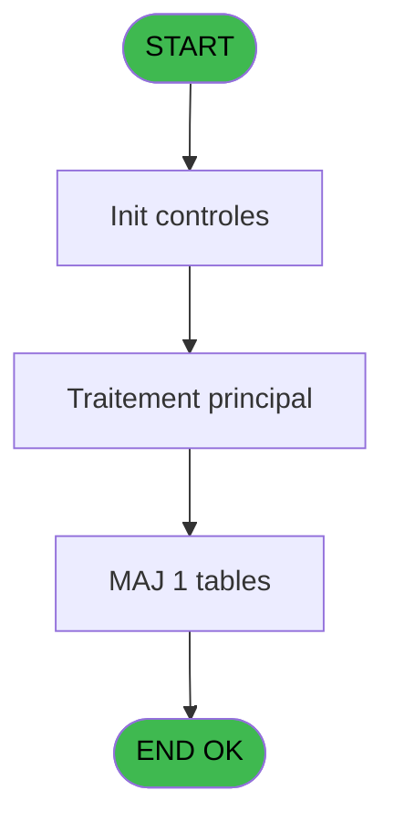
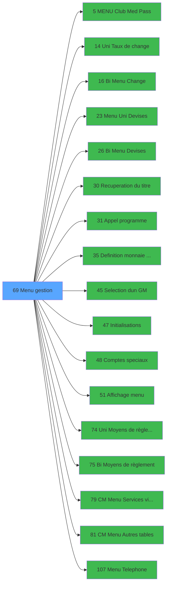

# GES IDE 69 - Menu gestion

> **Analyse**: Phases 1-4 2026-02-03 11:39 -> 11:39 (15s) | Assemblage 11:39
> **Pipeline**: V7.2 Enrichi
> **Structure**: 4 onglets (Resume | Ecrans | Donnees | Connexions)

<!-- TAB:Resume -->

## 1. FICHE D'IDENTITE

| Attribut | Valeur |
|----------|--------|
| Projet | GES |
| IDE Position | 69 |
| Nom Programme | Menu gestion |
| Fichier source | `Prg_69.xml` |
| Dossier IDE | Menu |
| Taches | 9 (1 ecrans visibles) |
| Tables modifiees | 1 |
| Programmes appeles | 17 |

## 2. DESCRIPTION FONCTIONNELLE

**Menu gestion** assure la gestion complete de ce processus, accessible depuis [Main Program (IDE 1)](GES-IDE-1.md).

Le flux de traitement s'organise en **4 blocs fonctionnels** :

- **Traitement** (5 taches) : traitements metier divers
- **Transfert** (2 taches) : transferts de donnees entre modules ou deversements
- **Validation** (1 tache) : controles et verifications de coherence
- **Initialisation** (1 tache) : reinitialisation d'etats et de variables de travail

**Donnees modifiees** : 1 tables en ecriture (reseau_cloture___rec).

**Logique metier** : 2 regles identifiees couvrant conditions metier.

Detail : phases du traitement

#### Phase 1 : Traitement (5 taches)

- **69** - CV  Menu **[[ECRAN]](#ecran-t1)**
- **69.1** - Station eteinte erreur v1
- **69.3** - Lecture paramètres PAR
- **69.6** - Config TAI
- **69.8** - Station eteinte erreur v1

Delegue a : [MENU  Club Med Pass (IDE 5)](GES-IDE-5.md), [Uni Taux de change (IDE 14)](GES-IDE-14.md), [Bi  Menu Change (IDE 16)](GES-IDE-16.md), [Menu Uni Devises (IDE 23)](GES-IDE-23.md), [Bi  Menu Devises (IDE 26)](GES-IDE-26.md), [Recuperation du titre (IDE 30)](GES-IDE-30.md), [Appel programme (IDE 31)](GES-IDE-31.md), [CM  Menu Services village (IDE 79)](GES-IDE-79.md), [CM  Menu Autres tables (IDE 81)](GES-IDE-81.md), [Menu Telephone (IDE 107)](GES-IDE-107.md)

#### Phase 2 : Initialisation (1 tache)

- **69.2** - Initialisation paramètres

Delegue a : [Definition monnaie de'enregist (IDE 35)](GES-IDE-35.md), [Initialisations (IDE 47)](GES-IDE-47.md)

#### Phase 3 : Transfert (2 taches)

- **69.4** - Lecture uni/bilateral
- **69.5** - Lecture uni/bilateral

#### Phase 4 : Validation (1 tache)

- **69.7** - Controle des caisses

#### Tables impactees

| Table | Operations | Role metier |
|-------|-----------|-------------|
| reseau_cloture___rec | **W** (2 usages) | Donnees reseau/cloture |

## 3. BLOCS FONCTIONNELS

### 3.1 Traitement (5 taches)

Traitements internes.

---

#### 69 - CV  Menu [[ECRAN]](#ecran-t1)

**Role** : Traitement : CV  Menu.
**Ecran** : 1032 x 215 DLU (MDI) | [Voir mockup](#ecran-t1)

4 sous-taches directes

| Tache | Nom | Bloc |
|-------|-----|------|
| [69.1](#t2) | Station eteinte erreur v1 | Traitement |
| [69.3](#t4) | Lecture paramètres PAR | Traitement |
| [69.6](#t9) | Config TAI | Traitement |
| [69.8](#t13) | Station eteinte erreur v1 | Traitement |

**Delegue a** : [MENU  Club Med Pass (IDE 5)](GES-IDE-5.md), [Uni Taux de change (IDE 14)](GES-IDE-14.md), [Bi  Menu Change (IDE 16)](GES-IDE-16.md)

---

#### 69.1 - Station eteinte erreur v1

**Role** : Traitement : Station eteinte erreur v1.
**Delegue a** : [MENU  Club Med Pass (IDE 5)](GES-IDE-5.md), [Uni Taux de change (IDE 14)](GES-IDE-14.md), [Bi  Menu Change (IDE 16)](GES-IDE-16.md)

---

#### 69.3 - Lecture paramètres PAR

**Role** : Traitement : Lecture paramètres PAR.
**Delegue a** : [MENU  Club Med Pass (IDE 5)](GES-IDE-5.md), [Uni Taux de change (IDE 14)](GES-IDE-14.md), [Bi  Menu Change (IDE 16)](GES-IDE-16.md)

---

#### 69.6 - Config TAI

**Role** : Traitement : Config TAI.
**Delegue a** : [MENU  Club Med Pass (IDE 5)](GES-IDE-5.md), [Uni Taux de change (IDE 14)](GES-IDE-14.md), [Bi  Menu Change (IDE 16)](GES-IDE-16.md)

---

#### 69.8 - Station eteinte erreur v1

**Role** : Traitement : Station eteinte erreur v1.
**Delegue a** : [MENU  Club Med Pass (IDE 5)](GES-IDE-5.md), [Uni Taux de change (IDE 14)](GES-IDE-14.md), [Bi  Menu Change (IDE 16)](GES-IDE-16.md)

### 3.2 Initialisation (1 tache)

Reinitialisation d'etats et variables de travail.

---

#### 69.2 - Initialisation paramètres

**Role** : Reinitialisation : Initialisation paramètres.
**Delegue a** : [Definition monnaie de'enregist (IDE 35)](GES-IDE-35.md), [Initialisations (IDE 47)](GES-IDE-47.md)

### 3.3 Transfert (2 taches)

Transfert de donnees entre modules.

---

#### 69.4 - Lecture uni/bilateral

**Role** : Traitement : Lecture uni/bilateral.
**Variables liees** : P (W0 uni/bilateral)

---

#### 69.5 - Lecture uni/bilateral

**Role** : Traitement : Lecture uni/bilateral.
**Variables liees** : P (W0 uni/bilateral)

### 3.4 Validation (1 tache)

Controles de coherence : 1 tache verifie les donnees et conditions.

---

#### 69.7 - Controle des caisses

**Role** : Verification : Controle des caisses.
**Variables liees** : S (W0 Nbre caisses ouvertes), T (W0 Nbre caisses non clôturees)

## 5. REGLES METIER

2 regles identifiees:

### Autres (2 regles)

#### [RM-001] Si W0 village TEL [F]='O' alors MlsTrans ('Telephone') sinon '..............................')

| Element | Detail |
|---------|--------|
| **Condition** | `W0 village TEL [F]='O'` |
| **Si vrai** | MlsTrans ('Telephone') |
| **Si faux** | '..............................') |
| **Variables** | F (W0 village TEL) |
| **Expression source** | Expression 1 : `IF (W0 village TEL [F]='O',MlsTrans ('Telephone'),'.........` |
| **Exemple** | Si W0 village TEL [F]='O' → MlsTrans ('Telephone'). Sinon → '..............................') |

#### [RM-002] Si W0 village CAM [E]='O' alors 'K' sinon '.')

| Element | Detail |
|---------|--------|
| **Condition** | `W0 village CAM [E]='O'` |
| **Si vrai** | 'K' |
| **Si faux** | '.') |
| **Variables** | E (W0 village CAM) |
| **Expression source** | Expression 8 : `IF (W0 village CAM [E]='O','K','.')` |
| **Exemple** | Si W0 village CAM [E]='O' → 'K'. Sinon → '.') |

## 6. CONTEXTE

- **Appele par**: [Main Program (IDE 1)](GES-IDE-1.md)
- **Appelle**: 17 programmes | **Tables**: 7 (W:1 R:6 L:0) | **Taches**: 9 | **Expressions**: 40

<!-- TAB:Ecrans -->

## 8. ECRANS

### 8.1 Forms visibles (1 / 9)

| # | Position | Tache | Nom | Type | Largeur | Hauteur | Bloc |
|---|----------|-------|-----|------|---------|---------|------|
| 1 | 69 | 69 | CV  Menu | MDI | 1032 | 215 | Traitement |

### 8.2 Mockups Ecrans

---

#### 69 - CV  Menu
**Tache** : [69](#t1) | **Type** : MDI | **Dimensions** : 1032 x 215 DLU
**Bloc** : Traitement | **Titre IDE** : CV  Menu

<!-- FORM-DATA:
{
    "width":  1032,
    "vFactor":  8,
    "type":  "MDI",
    "hFactor":  8,
    "controls":  [
                     {
                         "x":  0,
                         "type":  "label",
                         "var":  "",
                         "y":  0,
                         "w":  1026,
                         "fmt":  "",
                         "name":  "",
                         "h":  20,
                         "color":  "",
                         "text":  "",
                         "parent":  null
                     },
                     {
                         "x":  5,
                         "type":  "label",
                         "var":  "",
                         "y":  26,
                         "w":  1010,
                         "fmt":  "",
                         "name":  "",
                         "h":  152,
                         "color":  "",
                         "text":  "",
                         "parent":  null
                     },
                     {
                         "x":  156,
                         "type":  "label",
                         "var":  "",
                         "y":  45,
                         "w":  435,
                         "fmt":  "",
                         "name":  "",
                         "h":  103,
                         "color":  "",
                         "text":  "",
                         "parent":  5
                     },
                     {
                         "x":  588,
                         "type":  "label",
                         "var":  "",
                         "y":  45,
                         "w":  410,
                         "fmt":  "",
                         "name":  "",
                         "h":  103,
                         "color":  "",
                         "text":  "",
                         "parent":  5
                     },
                     {
                         "x":  159,
                         "type":  "label",
                         "var":  "",
                         "y":  46,
                         "w":  48,
                         "fmt":  "",
                         "name":  "",
                         "h":  101,
                         "color":  "",
                         "text":  "",
                         "parent":  5
                     },
                     {
                         "x":  205,
                         "type":  "label",
                         "var":  "",
                         "y":  46,
                         "w":  384,
                         "fmt":  "",
                         "name":  "",
                         "h":  101,
                         "color":  "6",
                         "text":  "",
                         "parent":  5
                     },
                     {
                         "x":  592,
                         "type":  "label",
                         "var":  "",
                         "y":  46,
                         "w":  45,
                         "fmt":  "",
                         "name":  "",
                         "h":  101,
                         "color":  "",
                         "text":  "",
                         "parent":  5
                     },
                     {
                         "x":  637,
                         "type":  "label",
                         "var":  "",
                         "y":  46,
                         "w":  359,
                         "fmt":  "",
                         "name":  "",
                         "h":  101,
                         "color":  "6",
                         "text":  "",
                         "parent":  5
                     },
                     {
                         "x":  212,
                         "type":  "label",
                         "var":  "",
                         "y":  50,
                         "w":  369,
                         "fmt":  "",
                         "name":  "",
                         "h":  9,
                         "color":  "146",
                         "text":  "Initialisations",
                         "parent":  5
                     },
                     {
                         "x":  646,
                         "type":  "label",
                         "var":  "",
                         "y":  50,
                         "w":  346,
                         "fmt":  "",
                         "name":  "",
                         "h":  9,
                         "color":  "146",
                         "text":  "Extrait de compte",
                         "parent":  5
                     },
                     {
                         "x":  212,
                         "type":  "label",
                         "var":  "",
                         "y":  63,
                         "w":  369,
                         "fmt":  "",
                         "name":  "",
                         "h":  9,
                         "color":  "146",
                         "text":  "Services du village",
                         "parent":  5
                     },
                     {
                         "x":  646,
                         "type":  "label",
                         "var":  "",
                         "y":  63,
                         "w":  346,
                         "fmt":  "",
                         "name":  "",
                         "h":  9,
                         "color":  "146",
                         "text":  "Extrait de compte gratuité",
                         "parent":  5
                     },
                     {
                         "x":  646,
                         "type":  "label",
                         "var":  "",
                         "y":  76,
                         "w":  346,
                         "fmt":  "",
                         "name":  "",
                         "h":  9,
                         "color":  "146",
                         "text":  "Comptes spéciaux",
                         "parent":  5
                     },
                     {
                         "x":  212,
                         "type":  "label",
                         "var":  "",
                         "y":  90,
                         "w":  369,
                         "fmt":  "",
                         "name":  "",
                         "h":  9,
                         "color":  "146",
                         "text":  "Moyens de reglement",
                         "parent":  5
                     },
                     {
                         "x":  212,
                         "type":  "label",
                         "var":  "",
                         "y":  104,
                         "w":  369,
                         "fmt":  "",
                         "name":  "",
                         "h":  10,
                         "color":  "146",
                         "text":  "Devises et Coeff de marge",
                         "parent":  5
                     },
                     {
                         "x":  212,
                         "type":  "label",
                         "var":  "",
                         "y":  118,
                         "w":  369,
                         "fmt":  "",
                         "name":  "",
                         "h":  10,
                         "color":  "146",
                         "text":  "Taux de change",
                         "parent":  5
                     },
                     {
                         "x":  212,
                         "type":  "label",
                         "var":  "",
                         "y":  132,
                         "w":  369,
                         "fmt":  "",
                         "name":  "",
                         "h":  9,
                         "color":  "146",
                         "text":  "Autres Tables",
                         "parent":  5
                     },
                     {
                         "x":  464,
                         "type":  "label",
                         "var":  "",
                         "y":  159,
                         "w":  123,
                         "fmt":  "",
                         "name":  "",
                         "h":  10,
                         "color":  "",
                         "text":  "Votre choix",
                         "parent":  5
                     },
                     {
                         "x":  0,
                         "type":  "label",
                         "var":  "",
                         "y":  188,
                         "w":  1026,
                         "fmt":  "",
                         "name":  "",
                         "h":  24,
                         "color":  "",
                         "text":  "",
                         "parent":  null
                     },
                     {
                         "x":  646,
                         "type":  "label",
                         "var":  "",
                         "y":  118,
                         "w":  346,
                         "fmt":  "",
                         "name":  "",
                         "h":  9,
                         "color":  "146",
                         "text":  "Nouvelle Gestion de Caisse",
                         "parent":  12
                     },
                     {
                         "x":  598,
                         "type":  "edit",
                         "var":  "",
                         "y":  159,
                         "w":  26,
                         "fmt":  "",
                         "name":  "W0 choix action",
                         "h":  10,
                         "color":  "6",
                         "text":  "",
                         "parent":  5
                     },
                     {
                         "x":  3,
                         "type":  "image",
                         "var":  "",
                         "y":  1,
                         "w":  59,
                         "fmt":  "",
                         "name":  "",
                         "h":  18,
                         "color":  "",
                         "text":  "",
                         "parent":  null
                     },
                     {
                         "x":  70,
                         "type":  "edit",
                         "var":  "",
                         "y":  6,
                         "w":  595,
                         "fmt":  "50",
                         "name":  "",
                         "h":  8,
                         "color":  "",
                         "text":  "",
                         "parent":  null
                     },
                     {
                         "x":  646,
                         "type":  "edit",
                         "var":  "",
                         "y":  6,
                         "w":  372,
                         "fmt":  "WWW DD MMM YYYYT",
                         "name":  "",
                         "h":  8,
                         "color":  "",
                         "text":  "",
                         "parent":  null
                     },
                     {
                         "x":  12,
                         "type":  "image",
                         "var":  "",
                         "y":  30,
                         "w":  86,
                         "fmt":  "",
                         "name":  "",
                         "h":  41,
                         "color":  "",
                         "text":  "",
                         "parent":  5
                     },
                     {
                         "x":  168,
                         "type":  "button",
                         "var":  "",
                         "y":  50,
                         "w":  26,
                         "fmt":  "A",
                         "name":  "A",
                         "h":  9,
                         "color":  "",
                         "text":  "",
                         "parent":  null
                     },
                     {
                         "x":  601,
                         "type":  "button",
                         "var":  "",
                         "y":  50,
                         "w":  26,
                         "fmt":  "H",
                         "name":  "H",
                         "h":  9,
                         "color":  "",
                         "text":  "",
                         "parent":  null
                     },
                     {
                         "x":  168,
                         "type":  "button",
                         "var":  "",
                         "y":  63,
                         "w":  26,
                         "fmt":  "B",
                         "name":  "B",
                         "h":  9,
                         "color":  "",
                         "text":  "",
                         "parent":  null
                     },
                     {
                         "x":  601,
                         "type":  "button",
                         "var":  "",
                         "y":  63,
                         "w":  26,
                         "fmt":  "I",
                         "name":  "I",
                         "h":  9,
                         "color":  "",
                         "text":  "",
                         "parent":  null
                     },
                     {
                         "x":  601,
                         "type":  "button",
                         "var":  "",
                         "y":  76,
                         "w":  26,
                         "fmt":  "J",
                         "name":  "J",
                         "h":  9,
                         "color":  "",
                         "text":  "",
                         "parent":  null
                     },
                     {
                         "x":  27,
                         "type":  "image",
                         "var":  "",
                         "y":  83,
                         "w":  102,
                         "fmt":  "",
                         "name":  "",
                         "h":  50,
                         "color":  "",
                         "text":  "",
                         "parent":  5
                     },
                     {
                         "x":  646,
                         "type":  "edit",
                         "var":  "",
                         "y":  89,
                         "w":  346,
                         "fmt":  "30",
                         "name":  "",
                         "h":  11,
                         "color":  "146",
                         "text":  "",
                         "parent":  5
                     },
                     {
                         "x":  168,
                         "type":  "button",
                         "var":  "",
                         "y":  90,
                         "w":  26,
                         "fmt":  "D",
                         "name":  "D",
                         "h":  9,
                         "color":  "",
                         "text":  "",
                         "parent":  null
                     },
                     {
                         "x":  601,
                         "type":  "button",
                         "var":  "",
                         "y":  90,
                         "w":  26,
                         "fmt":  "K",
                         "name":  "K",
                         "h":  9,
                         "color":  "",
                         "text":  "",
                         "parent":  null
                     },
                     {
                         "x":  168,
                         "type":  "button",
                         "var":  "",
                         "y":  104,
                         "w":  26,
                         "fmt":  "E",
                         "name":  "E",
                         "h":  10,
                         "color":  "",
                         "text":  "",
                         "parent":  null
                     },
                     {
                         "x":  601,
                         "type":  "button",
                         "var":  "",
                         "y":  104,
                         "w":  26,
                         "fmt":  "L",
                         "name":  "L",
                         "h":  10,
                         "color":  "",
                         "text":  "",
                         "parent":  null
                     },
                     {
                         "x":  646,
                         "type":  "edit",
                         "var":  "",
                         "y":  104,
                         "w":  346,
                         "fmt":  "30",
                         "name":  "",
                         "h":  10,
                         "color":  "146",
                         "text":  "",
                         "parent":  5
                     },
                     {
                         "x":  168,
                         "type":  "button",
                         "var":  "",
                         "y":  118,
                         "w":  26,
                         "fmt":  "F",
                         "name":  "F",
                         "h":  10,
                         "color":  "",
                         "text":  "",
                         "parent":  null
                     },
                     {
                         "x":  601,
                         "type":  "button",
                         "var":  "",
                         "y":  118,
                         "w":  26,
                         "fmt":  "M",
                         "name":  "M",
                         "h":  10,
                         "color":  "",
                         "text":  "",
                         "parent":  null
                     },
                     {
                         "x":  168,
                         "type":  "button",
                         "var":  "",
                         "y":  132,
                         "w":  26,
                         "fmt":  "G",
                         "name":  "G",
                         "h":  9,
                         "color":  "",
                         "text":  "",
                         "parent":  null
                     },
                     {
                         "x":  7,
                         "type":  "button",
                         "var":  "",
                         "y":  191,
                         "w":  154,
                         "fmt":  "\u0026Quitter",
                         "name":  "\u0026Quitter",
                         "h":  18,
                         "color":  "",
                         "text":  "",
                         "parent":  null
                     }
                 ],
    "taskId":  "69",
    "height":  215
}
-->

<strong>Champs : 5 champs</strong>

| Pos (x,y) | Nom | Variable | Type |
|-----------|-----|----------|------|
| 598,159 | W0 choix action | - | edit |
| 70,6 | 50 | - | edit |
| 646,6 | WWW DD MMM YYYYT | - | edit |
| 646,89 | 30 | - | edit |
| 646,104 | 30 | - | edit |

<strong>Boutons : 13 boutons</strong>

| Bouton | Pos (x,y) | Action |
|--------|-----------|--------|
| A | 168,50 | Bouton fonctionnel |
| H | 601,50 | Bouton fonctionnel |
| B | 168,63 | Bouton fonctionnel |
| I | 601,63 | Bouton fonctionnel |
| J | 601,76 | Bouton fonctionnel |
| D | 168,90 | Bouton fonctionnel |
| K | 601,90 | Bouton fonctionnel |
| E | 168,104 | Bouton fonctionnel |
| L | 601,104 | Bouton fonctionnel |
| F | 168,118 | Bouton fonctionnel |
| M | 601,118 | Bouton fonctionnel |
| G | 168,132 | Bouton fonctionnel |
| Quitter | 7,191 | Quitte le programme |

## 9. NAVIGATION

Ecran unique: **CV  Menu**

### 9.3 Structure hierarchique (9 taches)

| Position | Tache | Type | Dimensions | Bloc |
|----------|-------|------|------------|------|
| **69.1** | [**CV  Menu** (69)](#t1) [mockup](#ecran-t1) | MDI | 1032x215 | Traitement |
| 69.1.1 | [Station eteinte erreur v1 (69.1)](#t2) | MDI | - | |
| 69.1.2 | [Lecture paramètres PAR (69.3)](#t4) | MDI | - | |
| 69.1.3 | [Config TAI (69.6)](#t9) | MDI | - | |
| 69.1.4 | [Station eteinte erreur v1 (69.8)](#t13) | MDI | - | |
| **69.2** | [**Initialisation paramètres** (69.2)](#t3) | MDI | - | Initialisation |
| **69.3** | [**Lecture uni/bilateral** (69.4)](#t6) | MDI | - | Transfert |
| 69.3.1 | [Lecture uni/bilateral (69.5)](#t7) | MDI | - | |
| **69.4** | [**Controle des caisses** (69.7)](#t10) | MDI | - | Validation |

### 9.4 Algorigramme

> **Legende**: Vert = START/END OK | Rouge = END KO | Bleu = Decisions
> *Algorigramme auto-genere. Utiliser `/algorigramme` pour une synthese metier detaillee.*

<!-- TAB:Donnees -->

## 10. TABLES

### Tables utilisees (7)

| ID | Nom | Description | Type | R | W | L | Usages |
|----|-----|-------------|------|---|---|---|--------|
| 23 | reseau_cloture___rec | Donnees reseau/cloture | DB |   | **W** |   | 2 |
| 63 | parametres___par |  | DB | R |   |   | 1 |
| 69 | initialisation___ini |  | DB | R |   |   | 1 |
| 70 | date_comptable___dat |  | DB | R |   |   | 1 |
| 122 | unilateral_bilateral |  | DB | R |   |   | 1 |
| 246 | histo_sessions_caisse | Sessions de caisse | DB | R |   |   | 1 |
| 728 | arc_cc_total |  | DB | R |   |   | 1 |

### Colonnes par table (4 / 7 tables avec colonnes identifiees)

Table 23 - reseau_cloture___rec (**W**) - 2 usages

*Table utilisee uniquement en Link ou aucune colonne Real identifiee dans le DataView.*

Table 63 - parametres___par (R) - 1 usages

| Lettre | Variable | Acces | Type |
|--------|----------|-------|------|
| A | Existe 35 | R | Logical |
| B | W1 fin tâche | R | Alpha |

Table 69 - initialisation___ini (R) - 1 usages

*Table utilisee uniquement en Link ou aucune colonne Real identifiee dans le DataView.*

Table 70 - date_comptable___dat (R) - 1 usages

| Lettre | Variable | Acces | Type |
|--------|----------|-------|------|
| R | W0 date comptable | R | Date |

Table 122 - unilateral_bilateral (R) - 1 usages

| Lettre | Variable | Acces | Type |
|--------|----------|-------|------|
| P | W0 uni/bilateral | R | Alpha |

Table 246 - histo_sessions_caisse (R) - 1 usages

| Lettre | Variable | Acces | Type |
|--------|----------|-------|------|
| S | W0 Nbre caisses ouvertes | R | Numeric |
| T | W0 Nbre caisses non clôturees | R | Numeric |

Table 728 - arc_cc_total (R) - 1 usages

*Table utilisee uniquement en Link ou aucune colonne Real identifiee dans le DataView.*

## 11. VARIABLES

### 11.1 Variables de session (1)

Variables persistantes pendant toute la session.

| Lettre | Nom | Type | Usage dans |
|--------|-----|------|-----------|
| A | v. titre ecran | Alpha | 1x session |

### 11.2 Variables de travail (19)

Variables internes au programme.

| Lettre | Nom | Type | Usage dans |
|--------|-----|------|-----------|
| B | W0 societe | Alpha | - |
| C | W0 devise locale | Alpha | - |
| D | W0 nbre decimales | Numeric | - |
| E | W0 village CAM | Alpha | 5x calcul interne |
| F | W0 village TEL | Alpha | 5x calcul interne |
| G | W0 village TAI | Alpha | - |
| H | W0 masque montant | Alpha | - |
| I | W0 masque cumul | Alpha | - |
| J | W0 code village | Alpha | - |
| K | W0  nom village | Alpha | - |
| L | W0 TAI Obligatoire | Alpha | - |
| M | W0 choix action | Alpha | - |
| N | W0 utilisation caiss | Alpha | - |
| O | W0 utilisation bouti | Alpha | - |
| P | W0 uni/bilateral | Alpha | - |
| Q | W0 fin tache | Alpha | 14x calcul interne |
| R | W0 date comptable | Date | 2x calcul interne |
| S | W0 Nbre caisses ouvertes | Numeric | - |
| T | W0 Nbre caisses non clôturees | Numeric | - |

Toutes les 20 variables (liste complete)

| Cat | Lettre | Nom Variable | Type |
|-----|--------|--------------|------|
| W0 | **B** | W0 societe | Alpha |
| W0 | **C** | W0 devise locale | Alpha |
| W0 | **D** | W0 nbre decimales | Numeric |
| W0 | **E** | W0 village CAM | Alpha |
| W0 | **F** | W0 village TEL | Alpha |
| W0 | **G** | W0 village TAI | Alpha |
| W0 | **H** | W0 masque montant | Alpha |
| W0 | **I** | W0 masque cumul | Alpha |
| W0 | **J** | W0 code village | Alpha |
| W0 | **K** | W0  nom village | Alpha |
| W0 | **L** | W0 TAI Obligatoire | Alpha |
| W0 | **M** | W0 choix action | Alpha |
| W0 | **N** | W0 utilisation caiss | Alpha |
| W0 | **O** | W0 utilisation bouti | Alpha |
| W0 | **P** | W0 uni/bilateral | Alpha |
| W0 | **Q** | W0 fin tache | Alpha |
| W0 | **R** | W0 date comptable | Date |
| W0 | **S** | W0 Nbre caisses ouvertes | Numeric |
| W0 | **T** | W0 Nbre caisses non clôturees | Numeric |
| V. | **A** | v. titre ecran | Alpha |

## 12. EXPRESSIONS

**40 / 40 expressions decodees (100%)**

### 12.1 Repartition par type

| Type | Expressions | Regles |
|------|-------------|--------|
| CONDITION | 27 | 2 |
| CONSTANTE | 5 | 0 |
| DATE | 1 | 0 |
| CAST_LOGIQUE | 2 | 0 |
| NEGATION | 1 | 0 |
| REFERENCE_VG | 2 | 0 |
| STRING | 1 | 0 |
| FORMAT | 1 | 0 |

### 12.2 Expressions cles par type

#### CONDITION (27 expressions)

| Type | IDE | Expression | Regle |
|------|-----|------------|-------|
| CONDITION | 8 | `IF (W0 village CAM [E]='O','K','.')` | [RM-002](#rm-RM-002) |
| CONDITION | 1 | `IF (W0 village TEL [F]='O',MlsTrans ('Telephone'),'..............................')` | [RM-001](#rm-RM-001) |
| CONDITION | 24 | `W0 fin tache [Q]='J'` | - |
| CONDITION | 25 | `W0 fin tache [Q]='K' AND W0 village CAM [E]='O'` | - |
| CONDITION | 26 | `W0 fin tache [Q]='L' AND W0 village TEL [F]='O'` | - |
| ... | | *+22 autres* | |

#### CONSTANTE (5 expressions)

| Type | IDE | Expression | Regle |
|------|-----|------------|-------|
| CONSTANTE | 31 | `0` | - |
| CONSTANTE | 40 | `'T'` | - |
| CONSTANTE | 28 | `''` | - |
| CONSTANTE | 5 | `81` | - |
| CONSTANTE | 11 | `'C'` | - |

#### DATE (1 expressions)

| Type | IDE | Expression | Regle |
|------|-----|------------|-------|
| DATE | 7 | `Date ()` | - |

#### CAST_LOGIQUE (2 expressions)

| Type | IDE | Expression | Regle |
|------|-----|------------|-------|
| CAST_LOGIQUE | 39 | `'TRUE'LOG` | - |
| CAST_LOGIQUE | 35 | `'FALSE'LOG` | - |

#### NEGATION (1 expressions)

| Type | IDE | Expression | Regle |
|------|-----|------------|-------|
| NEGATION | 36 | `NOT VG35` | - |

#### REFERENCE_VG (2 expressions)

| Type | IDE | Expression | Regle |
|------|-----|------------|-------|
| REFERENCE_VG | 38 | `VG36` | - |
| REFERENCE_VG | 37 | `VG35` | - |

#### STRING (1 expressions)

| Type | IDE | Expression | Regle |
|------|-----|------------|-------|
| STRING | 4 | `Trim (v. titre ecran [A])` | - |

#### FORMAT (1 expressions)

| Type | IDE | Expression | Regle |
|------|-----|------------|-------|
| FORMAT | 6 | `VG2&' '&'('&Trim (Str(VG36,'3'))&') '` | - |

### 12.3 Toutes les expressions (40)

Voir les 40 expressions

#### CONDITION (27)

| IDE | Expression Decodee |
|-----|-------------------|
| 1 | `IF (W0 village TEL [F]='O',MlsTrans ('Telephone'),'..............................')` |
| 8 | `IF (W0 village CAM [E]='O','K','.')` |
| 9 | `IF (W0 village CAM [E]='O',MlsTrans ('Club Med Pass'),'..............................')` |
| 10 | `IF (W0 village TEL [F]='O','L','.')` |
| 2 | `W0 village TEL [F]='O'` |
| 3 | `W0 village CAM [E]='O'` |
| 12 | `[U]='F'` |
| 13 | `W0 fin tache [Q]='A'` |
| 14 | `W0 fin tache [Q]='B'` |
| 15 | `W0 fin tache [Q]='D' AND (W0 Nbre caisses non cl... [T]='U' OR W0 Nbre caisses non cl... [T]='')` |
| 16 | `W0 fin tache [Q]='D' AND W0 Nbre caisses non cl... [T]='B'` |
| 17 | `W0 fin tache [Q]='E'` |
| 18 | `W0 Nbre caisses non cl... [T]='U' OR W0 Nbre caisses non cl... [T]=''` |
| 19 | `W0 Nbre caisses non cl... [T]='B'` |
| 20 | `W0 fin tache [Q]='F' AND (W0 Nbre caisses non cl... [T]='U' OR W0 Nbre caisses non cl... [T]='')` |
| 21 | `W0 fin tache [Q]='F' AND W0 Nbre caisses non cl... [T]='B'` |
| 22 | `W0 fin tache [Q]='G'` |
| 23 | `W0 fin tache [Q]='I'` |
| 24 | `W0 fin tache [Q]='J'` |
| 25 | `W0 fin tache [Q]='K' AND W0 village CAM [E]='O'` |
| 26 | `W0 fin tache [Q]='L' AND W0 village TEL [F]='O'` |
| 27 | `W0 fin tache [Q]='M'` |
| 29 | `W0 date comptable [R]='O'` |
| 32 | `[W]>0` |
| 33 | `[W]=0 AND [X]>0` |
| 34 | `[W]=0 AND [X]=0` |
| 30 | `W0 date comptable [R]<>'O' AND (InStr ('BCDEFGHIJ',W0 fin tache [Q])<>0 OR W0 fin tache [Q]='K' AND W0 village CAM [E]='O' OR W0 fin tache [Q]='L' AND W0 village TEL [F]='O' OR W0 fin tache [Q]='M')` |

#### CONSTANTE (5)

| IDE | Expression Decodee |
|-----|-------------------|
| 5 | `81` |
| 11 | `'C'` |
| 28 | `''` |
| 31 | `0` |
| 40 | `'T'` |

#### DATE (1)

| IDE | Expression Decodee |
|-----|-------------------|
| 7 | `Date ()` |

#### CAST_LOGIQUE (2)

| IDE | Expression Decodee |
|-----|-------------------|
| 35 | `'FALSE'LOG` |
| 39 | `'TRUE'LOG` |

#### NEGATION (1)

| IDE | Expression Decodee |
|-----|-------------------|
| 36 | `NOT VG35` |

#### REFERENCE_VG (2)

| IDE | Expression Decodee |
|-----|-------------------|
| 37 | `VG35` |
| 38 | `VG36` |

#### STRING (1)

| IDE | Expression Decodee |
|-----|-------------------|
| 4 | `Trim (v. titre ecran [A])` |

#### FORMAT (1)

| IDE | Expression Decodee |
|-----|-------------------|
| 6 | `VG2&' '&'('&Trim (Str(VG36,'3'))&') '` |

<!-- TAB:Connexions -->

## 13. GRAPHE D'APPELS

### 13.1 Chaine depuis Main (Callers)

Main -> ... -> [Main Program (IDE 1)](GES-IDE-1.md) -> **Menu gestion (IDE 69)**

### 13.2 Callers

| IDE | Nom Programme | Nb Appels |
|-----|---------------|-----------|
| [1](GES-IDE-1.md) | Main Program | 1 |

### 13.3 Callees (programmes appeles)

### 13.4 Detail Callees avec contexte

| IDE | Nom Programme | Appels | Contexte |
|-----|---------------|--------|----------|
| [5](GES-IDE-5.md) | MENU  Club Med Pass | 1 | Navigation menu |
| [14](GES-IDE-14.md) | Uni Taux de change | 1 | Sous-programme |
| [16](GES-IDE-16.md) | Bi  Menu Change | 1 | Navigation menu |
| [23](GES-IDE-23.md) | Menu Uni Devises | 1 | Navigation menu |
| [26](GES-IDE-26.md) | Bi  Menu Devises | 1 | Navigation menu |
| [30](GES-IDE-30.md) | Recuperation du titre | 1 | Recuperation donnees |
| [31](GES-IDE-31.md) | Appel programme | 1 | Sous-programme |
| [35](GES-IDE-35.md) | Definition monnaie de'enregist | 1 | Reinitialisation |
| [45](GES-IDE-45.md) | Selection d'un GM | 1 | Selection/consultation |
| [47](GES-IDE-47.md) | Initialisations | 1 | Reinitialisation |
| [48](GES-IDE-48.md) | Comptes speciaux | 1 | Sous-programme |
| [51](GES-IDE-51.md) | Affichage menu | 1 | Affichage donnees |
| [74](GES-IDE-74.md) | Uni Moyens de règlement | 1 | Sous-programme |
| [75](GES-IDE-75.md) | Bi Moyens de règlement | 1 | Sous-programme |
| [79](GES-IDE-79.md) | CM  Menu Services village | 1 | Navigation menu |
| [81](GES-IDE-81.md) | CM  Menu Autres tables | 1 | Navigation menu |
| [107](GES-IDE-107.md) | Menu Telephone | 1 | Navigation menu |

## 14. RECOMMANDATIONS MIGRATION

### 14.1 Profil du programme

| Metrique | Valeur | Impact migration |
|----------|--------|-----------------|
| Lignes de logique | 188 | Programme compact |
| Expressions | 40 | Peu de logique |
| Tables WRITE | 1 | Impact faible |
| Sous-programmes | 17 | Forte dependance |
| Ecrans visibles | 1 | Ecran unique ou traitement batch |
| Code desactive | 0.5% (1 / 188) | Code sain |
| Regles metier | 2 | Quelques regles a preserver |

### 14.2 Plan de migration par bloc

#### Traitement (5 taches: 1 ecran, 4 traitements)

- **Strategie** : Orchestrateur avec 1 ecrans (Razor/React) et 4 traitements backend (services).
- Les ecrans deviennent des composants UI, les traitements invisibles deviennent des services injectables.
- 17 sous-programme(s) a migrer ou a reutiliser depuis les services existants.
- Decomposer les taches en services unitaires testables.

#### Initialisation (1 tache: 0 ecran, 1 traitement)

- **Strategie** : Constructeur/methode `InitAsync()` dans l'orchestrateur.

#### Transfert (2 taches: 0 ecran, 2 traitements)

- **Strategie** : Service `ITransfertService` avec logique de deversement.

#### Validation (1 tache: 0 ecran, 1 traitement)

- **Strategie** : FluentValidation avec validators specifiques.
- Chaque tache de validation -> un validator injectable

### 14.3 Dependances critiques

| Dependance | Type | Appels | Impact |
|------------|------|--------|--------|
| reseau_cloture___rec | Table WRITE (Database) | 2x | Schema + repository |
| [Affichage menu (IDE 51)](GES-IDE-51.md) | Sous-programme | 1x | Normale - Affichage donnees |
| [Uni Moyens de règlement (IDE 74)](GES-IDE-74.md) | Sous-programme | 1x | Normale - Sous-programme |
| [Initialisations (IDE 47)](GES-IDE-47.md) | Sous-programme | 1x | Normale - Reinitialisation |
| [Comptes speciaux (IDE 48)](GES-IDE-48.md) | Sous-programme | 1x | Normale - Sous-programme |
| [CM  Menu Autres tables (IDE 81)](GES-IDE-81.md) | Sous-programme | 1x | Normale - Navigation menu |
| [Menu Telephone (IDE 107)](GES-IDE-107.md) | Sous-programme | 1x | Normale - Navigation menu |
| [Bi Moyens de règlement (IDE 75)](GES-IDE-75.md) | Sous-programme | 1x | Normale - Sous-programme |
| [CM  Menu Services village (IDE 79)](GES-IDE-79.md) | Sous-programme | 1x | Normale - Navigation menu |
| [Selection d'un GM (IDE 45)](GES-IDE-45.md) | Sous-programme | 1x | Normale - Selection/consultation |
| [Bi  Menu Change (IDE 16)](GES-IDE-16.md) | Sous-programme | 1x | Normale - Navigation menu |

---
*Spec DETAILED generee par Pipeline V7.2 - 2026-02-03 11:39*
