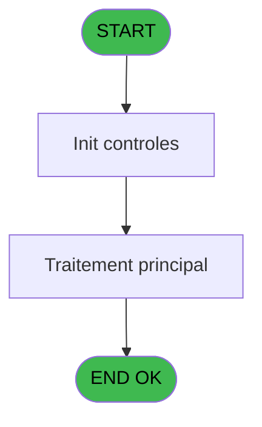
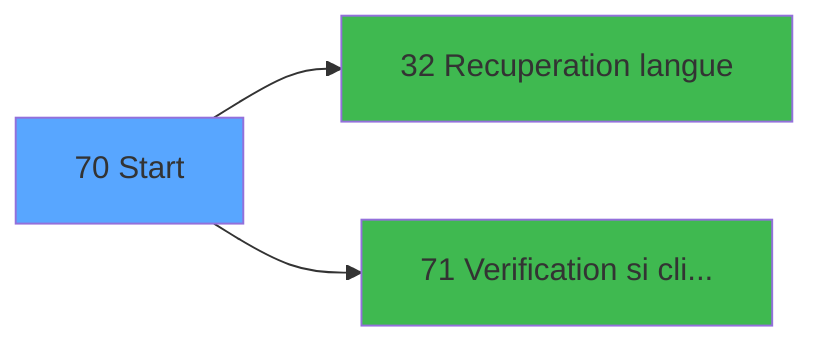

# GES IDE 70 - Start

> **Analyse**: Phases 1-4 2026-02-03 11:40 -> 11:40 (12s) | Assemblage 11:40
> **Pipeline**: V7.2 Enrichi
> **Structure**: 4 onglets (Resume | Ecrans | Donnees | Connexions)

<!-- TAB:Resume -->

## 1. FICHE D'IDENTITE

| Attribut | Valeur |
|----------|--------|
| Projet | GES |
| IDE Position | 70 |
| Nom Programme | Start |
| Fichier source | `Prg_70.xml` |
| Dossier IDE | Menu |
| Taches | 4 (0 ecrans visibles) |
| Tables modifiees | 0 |
| Programmes appeles | 2 |

## 2. DESCRIPTION FONCTIONNELLE

**Start** assure la gestion complete de ce processus, accessible depuis [Main Program (IDE 1)](GES-IDE-1.md).

Le flux de traitement s'organise en **2 blocs fonctionnels** :

- **Traitement** (3 taches) : traitements metier divers
- **Impression** (1 tache) : generation de tickets et documents

Detail : phases du traitement

#### Phase 1 : Traitement (3 taches)

- **70** - Start
- **70.2** - calc nb lieu sejour
- **70.3** - Update type cc

Delegue a : [Recuperation langue (IDE 32)](GES-IDE-32.md)

#### Phase 2 : Impression (1 tache)

- **70.1** - Printer control

## 3. BLOCS FONCTIONNELS

### 3.1 Traitement (3 taches)

Traitements internes.

---

#### 70 - Start

**Role** : Traitement : Start.
**Delegue a** : [Recuperation langue (IDE 32)](GES-IDE-32.md)

---

#### 70.2 - calc nb lieu sejour

**Role** : Traitement : calc nb lieu sejour.
**Delegue a** : [Recuperation langue (IDE 32)](GES-IDE-32.md)

---

#### 70.3 - Update type cc

**Role** : Traitement : Update type cc.
**Delegue a** : [Recuperation langue (IDE 32)](GES-IDE-32.md)

### 3.2 Impression (1 tache)

Generation des documents et tickets.

---

#### 70.1 - Printer control

**Role** : Generation du document : Printer control.

## 5. REGLES METIER

*(Aucune regle metier identifiee)*

## 6. CONTEXTE

- **Appele par**: [Main Program (IDE 1)](GES-IDE-1.md)
- **Appelle**: 2 programmes | **Tables**: 3 (W:0 R:2 L:1) | **Taches**: 4 | **Expressions**: 9

<!-- TAB:Ecrans -->

## 8. ECRANS

*(Programme sans ecran visible)*

## 9. NAVIGATION

### 9.3 Structure hierarchique (4 taches)

| Position | Tache | Type | Dimensions | Bloc |
|----------|-------|------|------------|------|
| **70.1** | [**Start** (70)](#t1) | MDI | - | Traitement |
| 70.1.1 | [calc nb lieu sejour (70.2)](#t9) | - | - | |
| 70.1.2 | [Update type cc (70.3)](#t10) | - | - | |
| **70.2** | [**Printer control** (70.1)](#t2) | MDI | - | Impression |

### 9.4 Algorigramme

> **Legende**: Vert = START/END OK | Rouge = END KO | Bleu = Decisions
> *Algorigramme auto-genere. Utiliser `/algorigramme` pour une synthese metier detaillee.*

<!-- TAB:Donnees -->

## 10. TABLES

### Tables utilisees (3)

| ID | Nom | Description | Type | R | W | L | Usages |
|----|-----|-------------|------|---|---|---|--------|
| 63 | parametres___par |  | DB | R |   |   | 1 |
| 69 | initialisation___ini |  | DB |   |   | L | 1 |
| 118 | tables_imports |  | DB | R |   |   | 1 |

### Colonnes par table (0 / 2 tables avec colonnes identifiees)

Table 63 - parametres___par (R) - 1 usages

*Table utilisee uniquement en Link ou aucune colonne Real identifiee dans le DataView.*

Table 118 - tables_imports (R) - 1 usages

*Table utilisee uniquement en Link ou aucune colonne Real identifiee dans le DataView.*

## 11. VARIABLES

*(Programme sans variables locales mappees)*

## 12. EXPRESSIONS

**9 / 9 expressions decodees (100%)**

### 12.1 Repartition par type

| Type | Expressions | Regles |
|------|-------------|--------|
| CONSTANTE | 3 | 0 |
| OTHER | 2 | 0 |
| NEGATION | 1 | 0 |
| CAST_LOGIQUE | 1 | 0 |
| CONDITION | 1 | 0 |
| FORMAT | 1 | 0 |

### 12.2 Expressions cles par type

#### CONSTANTE (3 expressions)

| Type | IDE | Expression | Regle |
|------|-----|------------|-------|
| CONSTANTE | 7 | `40` | - |
| CONSTANTE | 6 | `'C'` | - |
| CONSTANTE | 5 | `'CG'` | - |

#### OTHER (2 expressions)

| Type | IDE | Expression | Regle |
|------|-----|------------|-------|
| OTHER | 2 | `W0 connection ? [A]` | - |
| OTHER | 1 | `SetParam ('VERIF_USERB','O')` | - |

#### NEGATION (1 expressions)

| Type | IDE | Expression | Regle |
|------|-----|------------|-------|
| NEGATION | 3 | `NOT (W0 connection ? [A])` | - |

#### CAST_LOGIQUE (1 expressions)

| Type | IDE | Expression | Regle |
|------|-----|------------|-------|
| CAST_LOGIQUE | 4 | `INIPut ('[MAGIC_LOGICAL_NAMES]club_user='&VG1,'FALSE'LOG)` | - |

#### CONDITION (1 expressions)

| Type | IDE | Expression | Regle |
|------|-----|------------|-------|
| CONDITION | 8 | `[E]='O'` | - |

#### FORMAT (1 expressions)

| Type | IDE | Expression | Regle |
|------|-----|------------|-------|
| FORMAT | 9 | `'N12.'&Str([H],'#')&'CZ'` | - |

<!-- TAB:Connexions -->

## 13. GRAPHE D'APPELS

### 13.1 Chaine depuis Main (Callers)

Main -> ... -> [Main Program (IDE 1)](GES-IDE-1.md) -> **Start (IDE 70)**

### 13.2 Callers

| IDE | Nom Programme | Nb Appels |
|-----|---------------|-----------|
| [1](GES-IDE-1.md) | Main Program | 1 |

### 13.3 Callees (programmes appeles)

### 13.4 Detail Callees avec contexte

| IDE | Nom Programme | Appels | Contexte |
|-----|---------------|--------|----------|
| [32](GES-IDE-32.md) | Recuperation langue | 1 | Recuperation donnees |
| [71](GES-IDE-71.md) | Verification si client/serveur | 1 | Controle/validation |

## 14. RECOMMANDATIONS MIGRATION

### 14.1 Profil du programme

| Metrique | Valeur | Impact migration |
|----------|--------|-----------------|
| Lignes de logique | 34 | Programme compact |
| Expressions | 9 | Peu de logique |
| Tables WRITE | 0 | Impact faible |
| Sous-programmes | 2 | Peu de dependances |
| Ecrans visibles | 0 | Ecran unique ou traitement batch |
| Code desactive | 0% (0 / 34) | Code sain |
| Regles metier | 0 | Pas de regle identifiee |

### 14.2 Plan de migration par bloc

#### Traitement (3 taches: 0 ecran, 3 traitements)

- **Strategie** : 3 service(s) backend injectable(s) (Domain Services).
- 2 sous-programme(s) a migrer ou a reutiliser depuis les services existants.
- Decomposer les taches en services unitaires testables.

#### Impression (1 tache: 0 ecran, 1 traitement)

- **Strategie** : Templates HTML -> PDF via wkhtmltopdf ou Puppeteer.
- `PrintService` injectable avec choix imprimante

### 14.3 Dependances critiques

| Dependance | Type | Appels | Impact |
|------------|------|--------|--------|
| [Verification si client/serveur (IDE 71)](GES-IDE-71.md) | Sous-programme | 1x | Normale - Controle/validation |
| [Recuperation langue (IDE 32)](GES-IDE-32.md) | Sous-programme | 1x | Normale - Recuperation donnees |

---
*Spec DETAILED generee par Pipeline V7.2 - 2026-02-03 11:40*
