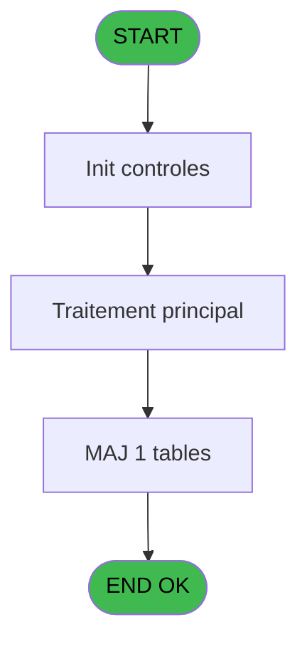
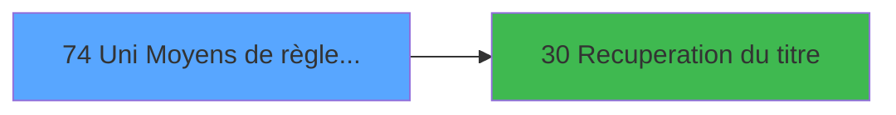

# GES IDE 74 - Uni Moyens de règlement

> **Analyse**: Phases 1-4 2026-02-03 11:41 -> 11:41 (13s) | Assemblage 11:41
> **Pipeline**: V7.2 Enrichi
> **Structure**: 4 onglets (Resume | Ecrans | Donnees | Connexions)

<!-- TAB:Resume -->

## 1. FICHE D'IDENTITE

| Attribut | Valeur |
|----------|--------|
| Projet | GES |
| IDE Position | 74 |
| Nom Programme | Uni Moyens de règlement |
| Fichier source | `Prg_74.xml` |
| Dossier IDE | Mode |
| Taches | 1 (1 ecrans visibles) |
| Tables modifiees | 1 |
| Programmes appeles | 1 |

## 2. DESCRIPTION FONCTIONNELLE

**Uni Moyens de règlement** assure la gestion complete de ce processus, accessible depuis [Menu gestion (IDE 69)](GES-IDE-69.md).

Le flux de traitement s'organise en **1 blocs fonctionnels** :

- **Traitement** (1 tache) : traitements metier divers

**Donnees modifiees** : 1 tables en ecriture (moyens_reglement_mor).

## 3. BLOCS FONCTIONNELS

### 3.1 Traitement (1 tache)

Traitements internes.

---

#### 74 - Autorisations monnaie locale [[ECRAN]](#ecran-t1)

**Role** : Traitement : Autorisations monnaie locale.
**Ecran** : 802 x 189 DLU (MDI) | [Voir mockup](#ecran-t1)
**Variables liees** : B (P0 Devise Locale)
**Delegue a** : [Recuperation du titre (IDE 30)](GES-IDE-30.md)

## 5. REGLES METIER

*(Aucune regle metier identifiee)*

## 6. CONTEXTE

- **Appele par**: [Menu gestion (IDE 69)](GES-IDE-69.md)
- **Appelle**: 1 programmes | **Tables**: 3 (W:1 R:0 L:2) | **Taches**: 1 | **Expressions**: 17

<!-- TAB:Ecrans -->

## 8. ECRANS

### 8.1 Forms visibles (1 / 1)

| # | Position | Tache | Nom | Type | Largeur | Hauteur | Bloc |
|---|----------|-------|-----|------|---------|---------|------|
| 1 | 74 | 74 | Autorisations monnaie locale | MDI | 802 | 189 | Traitement |

### 8.2 Mockups Ecrans

---

#### 74 - Autorisations monnaie locale
**Tache** : [74](#t1) | **Type** : MDI | **Dimensions** : 802 x 189 DLU
**Bloc** : Traitement | **Titre IDE** : Autorisations monnaie locale

<!-- FORM-DATA:
{
    "width":  802,
    "vFactor":  8,
    "type":  "MDI",
    "hFactor":  8,
    "controls":  [
                     {
                         "x":  0,
                         "type":  "label",
                         "var":  "",
                         "y":  2,
                         "w":  793,
                         "fmt":  "",
                         "name":  "",
                         "h":  18,
                         "color":  "",
                         "text":  "",
                         "parent":  null
                     },
                     {
                         "x":  15,
                         "type":  "label",
                         "var":  "",
                         "y":  24,
                         "w":  774,
                         "fmt":  "",
                         "name":  "",
                         "h":  132,
                         "color":  "",
                         "text":  "",
                         "parent":  null
                     },
                     {
                         "x":  28,
                         "type":  "label",
                         "var":  "",
                         "y":  28,
                         "w":  738,
                         "fmt":  "",
                         "name":  "",
                         "h":  17,
                         "color":  "",
                         "text":  "",
                         "parent":  null
                     },
                     {
                         "x":  0,
                         "type":  "label",
                         "var":  "",
                         "y":  165,
                         "w":  793,
                         "fmt":  "",
                         "name":  "",
                         "h":  24,
                         "color":  "",
                         "text":  "",
                         "parent":  null
                     },
                     {
                         "x":  28,
                         "type":  "table",
                         "var":  "",
                         "name":  "",
                         "titleH":  12,
                         "color":  "110",
                         "w":  744,
                         "y":  48,
                         "fmt":  "",
                         "parent":  null,
                         "text":  "",
                         "rowH":  14,
                         "h":  100,
                         "cols":  [
                                      {
                                          "title":  "MOP",
                                          "layer":  1,
                                          "w":  83
                                      },
                                      {
                                          "title":  "Libellé",
                                          "layer":  2,
                                          "w":  251
                                      },
                                      {
                                          "title":  "Versement",
                                          "layer":  3,
                                          "w":  94
                                      },
                                      {
                                          "title":  "Solde",
                                          "layer":  4,
                                          "w":  94
                                      },
                                      {
                                          "title":  "Ventes",
                                          "layer":  5,
                                          "w":  94
                                      },
                                      {
                                          "title":  "Mobilité",
                                          "layer":  6,
                                          "w":  94
                                      }
                                  ],
                         "rows":  6
                     },
                     {
                         "x":  34,
                         "type":  "edit",
                         "var":  "",
                         "y":  64,
                         "w":  64,
                         "fmt":  "",
                         "name":  "",
                         "h":  10,
                         "color":  "110",
                         "text":  "",
                         "parent":  9
                     },
                     {
                         "x":  125,
                         "type":  "edit",
                         "var":  "",
                         "y":  64,
                         "w":  232,
                         "fmt":  "",
                         "name":  "",
                         "h":  10,
                         "color":  "110",
                         "text":  "",
                         "parent":  9
                     },
                     {
                         "x":  398,
                         "type":  "edit",
                         "var":  "",
                         "y":  64,
                         "w":  19,
                         "fmt":  "UA",
                         "name":  "MOR accepte",
                         "h":  10,
                         "color":  "110",
                         "text":  "",
                         "parent":  9
                     },
                     {
                         "x":  494,
                         "type":  "edit",
                         "var":  "",
                         "y":  64,
                         "w":  19,
                         "fmt":  "UA",
                         "name":  "MOR accepte_001",
                         "h":  10,
                         "color":  "110",
                         "text":  "",
                         "parent":  9
                     },
                     {
                         "x":  590,
                         "type":  "edit",
                         "var":  "",
                         "y":  64,
                         "w":  19,
                         "fmt":  "UA",
                         "name":  "MOR accepte_002",
                         "h":  10,
                         "color":  "110",
                         "text":  "",
                         "parent":  9
                     },
                     {
                         "x":  680,
                         "type":  "edit",
                         "var":  "",
                         "y":  63,
                         "w":  19,
                         "fmt":  "UA",
                         "name":  "MOR accepte_003",
                         "h":  10,
                         "color":  "110",
                         "text":  "",
                         "parent":  9
                     },
                     {
                         "x":  6,
                         "type":  "edit",
                         "var":  "",
                         "y":  6,
                         "w":  267,
                         "fmt":  "20",
                         "name":  "",
                         "h":  8,
                         "color":  "",
                         "text":  "",
                         "parent":  null
                     },
                     {
                         "x":  509,
                         "type":  "edit",
                         "var":  "",
                         "y":  6,
                         "w":  277,
                         "fmt":  "WWW DD MMM YYYYT",
                         "name":  "",
                         "h":  8,
                         "color":  "",
                         "text":  "",
                         "parent":  null
                     },
                     {
                         "x":  236,
                         "type":  "edit",
                         "var":  "",
                         "y":  32,
                         "w":  48,
                         "fmt":  "",
                         "name":  "P0 Devise Locale",
                         "h":  10,
                         "color":  "7",
                         "text":  "",
                         "parent":  5
                     },
                     {
                         "x":  292,
                         "type":  "edit",
                         "var":  "",
                         "y":  32,
                         "w":  238,
                         "fmt":  "",
                         "name":  "tab_libelle20",
                         "h":  10,
                         "color":  "7",
                         "text":  "",
                         "parent":  5
                     },
                     {
                         "x":  8,
                         "type":  "button",
                         "var":  "",
                         "y":  168,
                         "w":  154,
                         "fmt":  "\u0026Quitter",
                         "name":  "",
                         "h":  18,
                         "color":  "",
                         "text":  "",
                         "parent":  null
                     }
                 ],
    "taskId":  "74",
    "height":  189
}
-->

<strong>Champs : 10 champs</strong>

| Pos (x,y) | Nom | Variable | Type |
|-----------|-----|----------|------|
| 34,64 | (sans nom) | - | edit |
| 125,64 | (sans nom) | - | edit |
| 398,64 | MOR accepte | - | edit |
| 494,64 | MOR accepte_001 | - | edit |
| 590,64 | MOR accepte_002 | - | edit |
| 680,63 | MOR accepte_003 | - | edit |
| 6,6 | 20 | - | edit |
| 509,6 | WWW DD MMM YYYYT | - | edit |
| 236,32 | P0 Devise Locale | - | edit |
| 292,32 | tab_libelle20 | - | edit |

<strong>Boutons : 1 boutons</strong>

| Bouton | Pos (x,y) | Action |
|--------|-----------|--------|
| Quitter | 8,168 | Quitte le programme |

## 9. NAVIGATION

Ecran unique: **Autorisations monnaie locale**

### 9.3 Structure hierarchique (1 tache)

| Position | Tache | Type | Dimensions | Bloc |
|----------|-------|------|------------|------|
| **74.1** | [**Autorisations monnaie locale** (74)](#t1) [mockup](#ecran-t1) | MDI | 802x189 | Traitement |

### 9.4 Algorigramme

> **Legende**: Vert = START/END OK | Rouge = END KO | Bleu = Decisions
> *Algorigramme auto-genere. Utiliser `/algorigramme` pour une synthese metier detaillee.*

<!-- TAB:Donnees -->

## 10. TABLES

### Tables utilisees (3)

| ID | Nom | Description | Type | R | W | L | Usages |
|----|-----|-------------|------|---|---|---|--------|
| 50 | moyens_reglement_mor | Reglements / paiements | DB |   | **W** |   | 1 |
| 67 | tables___________tab |  | DB |   |   | L | 1 |
| 89 | moyen_paiement___mop |  | DB |   |   | L | 1 |

### Colonnes par table (1 / 1 tables avec colonnes identifiees)

Table 50 - moyens_reglement_mor (**W**) - 1 usages

| Lettre | Variable | Acces | Type |
|--------|----------|-------|------|
| A | P0 Société | W | Alpha |
| B | P0 Devise Locale | W | Alpha |
| C | v. titre ecran | W | Alpha |

## 11. VARIABLES

### 11.1 Parametres entrants (2)

Variables recues du programme appelant ([Menu gestion (IDE 69)](GES-IDE-69.md)).

| Lettre | Nom | Type | Usage dans |
|--------|-----|------|-----------|
| A | P0 Société | Alpha | 1x parametre entrant |
| B | P0 Devise Locale | Alpha | [74](#t1) |

### 11.2 Variables de session (1)

Variables persistantes pendant toute la session.

| Lettre | Nom | Type | Usage dans |
|--------|-----|------|-----------|
| C | v. titre ecran | Alpha | - |

## 12. EXPRESSIONS

**17 / 17 expressions decodees (100%)**

### 12.1 Repartition par type

| Type | Expressions | Regles |
|------|-------------|--------|
| CONSTANTE | 7 | 0 |
| DATE | 1 | 0 |
| CAST_LOGIQUE | 2 | 0 |
| REFERENCE_VG | 2 | 0 |
| OTHER | 3 | 0 |
| CONDITION | 1 | 0 |
| STRING | 1 | 0 |

### 12.2 Expressions cles par type

#### CONSTANTE (7 expressions)

| Type | IDE | Expression | Regle |
|------|-----|------------|-------|
| CONSTANTE | 13 | `'M'` | - |
| CONSTANTE | 15 | `1` | - |
| CONSTANTE | 16 | `'BDEV'` | - |
| CONSTANTE | 12 | `'W'` | - |
| CONSTANTE | 6 | `51` | - |
| ... | | *+2 autres* | |

#### DATE (1 expressions)

| Type | IDE | Expression | Regle |
|------|-----|------------|-------|
| DATE | 3 | `Date ()` | - |

#### CAST_LOGIQUE (2 expressions)

| Type | IDE | Expression | Regle |
|------|-----|------------|-------|
| CAST_LOGIQUE | 2 | `INIPut ('AllowCreateInModify = Y','FALSE'LOG)` | - |
| CAST_LOGIQUE | 1 | `INIPut ('AllowCreateInModify = N','FALSE'LOG)` | - |

#### REFERENCE_VG (2 expressions)

| Type | IDE | Expression | Regle |
|------|-----|------------|-------|
| REFERENCE_VG | 17 | `VG37` | - |
| REFERENCE_VG | 4 | `VG2` | - |

#### OTHER (3 expressions)

| Type | IDE | Expression | Regle |
|------|-----|------------|-------|
| OTHER | 14 | `[H]` | - |
| OTHER | 9 | `P0 Devise Locale [B]` | - |
| OTHER | 7 | `P0 Société [A]` | - |

#### CONDITION (1 expressions)

| Type | IDE | Expression | Regle |
|------|-----|------------|-------|
| CONDITION | 8 | `[I]<>'$CASH' AND [I]<>'$PAPER' AND [I]<>'$CARD' AND [O]='O' AND NOT(VG20) AND NOT(VG48)` | - |

#### STRING (1 expressions)

| Type | IDE | Expression | Regle |
|------|-----|------------|-------|
| STRING | 5 | `Trim ([F])` | - |

<!-- TAB:Connexions -->

## 13. GRAPHE D'APPELS

### 13.1 Chaine depuis Main (Callers)

Main -> ... -> [Menu gestion (IDE 69)](GES-IDE-69.md) -> **Uni Moyens de règlement (IDE 74)**

### 13.2 Callers

| IDE | Nom Programme | Nb Appels |
|-----|---------------|-----------|
| [69](GES-IDE-69.md) | Menu gestion | 1 |

### 13.3 Callees (programmes appeles)

### 13.4 Detail Callees avec contexte

| IDE | Nom Programme | Appels | Contexte |
|-----|---------------|--------|----------|
| [30](GES-IDE-30.md) | Recuperation du titre | 1 | Recuperation donnees |

## 14. RECOMMANDATIONS MIGRATION

### 14.1 Profil du programme

| Metrique | Valeur | Impact migration |
|----------|--------|-----------------|
| Lignes de logique | 60 | Programme compact |
| Expressions | 17 | Peu de logique |
| Tables WRITE | 1 | Impact faible |
| Sous-programmes | 1 | Peu de dependances |
| Ecrans visibles | 1 | Ecran unique ou traitement batch |
| Code desactive | 0% (0 / 60) | Code sain |
| Regles metier | 0 | Pas de regle identifiee |

### 14.2 Plan de migration par bloc

#### Traitement (1 tache: 1 ecran, 0 traitement)

- **Strategie** : 1 composant(s) UI (Razor/React) avec formulaires et validation.
- 1 sous-programme(s) a migrer ou a reutiliser depuis les services existants.
- Decomposer les taches en services unitaires testables.

### 14.3 Dependances critiques

| Dependance | Type | Appels | Impact |
|------------|------|--------|--------|
| moyens_reglement_mor | Table WRITE (Database) | 1x | Schema + repository |
| [Recuperation du titre (IDE 30)](GES-IDE-30.md) | Sous-programme | 1x | Normale - Recuperation donnees |

---
*Spec DETAILED generee par Pipeline V7.2 - 2026-02-03 11:41*
