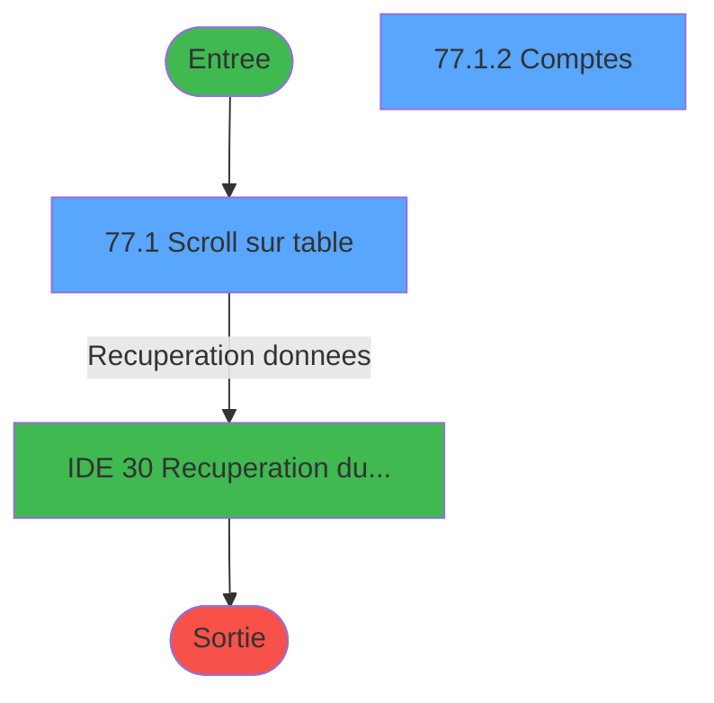
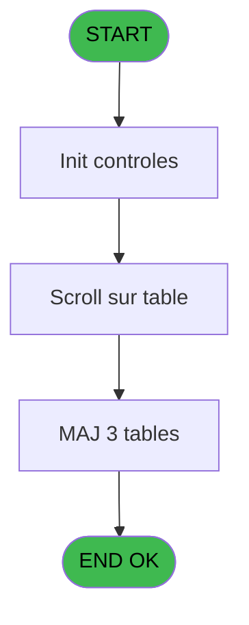
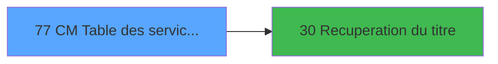

# GES IDE 77 - CM Table des services village

> **Analyse**: Phases 1-4 2026-02-03 11:42 -> 11:42 (13s) | Assemblage 11:42
> **Pipeline**: V7.2 Enrichi
> **Structure**: 4 onglets (Resume | Ecrans | Donnees | Connexions)

<!-- TAB:Resume -->

## 1. FICHE D'IDENTITE

| Attribut | Valeur |
|----------|--------|
| Projet | GES |
| IDE Position | 77 |
| Nom Programme | CM Table des services village |
| Fichier source | `Prg_77.xml` |
| Dossier IDE | Services |
| Taches | 5 (2 ecrans visibles) |
| Tables modifiees | 3 |
| Programmes appeles | 1 |

## 2. DESCRIPTION FONCTIONNELLE

**CM Table des services village** assure la gestion complete de ce processus, accessible depuis [CM  Menu Services village (IDE 79)](GES-IDE-79.md).

Le flux de traitement s'organise en **3 blocs fonctionnels** :

- **Traitement** (3 taches) : traitements metier divers
- **Calcul** (1 tache) : calculs de montants, stocks ou compteurs
- **Initialisation** (1 tache) : reinitialisation d'etats et de variables de travail

**Donnees modifiees** : 3 tables en ecriture (comptes_recette__cre, tables___________tab, articles_________art).

Detail : phases du traitement

#### Phase 1 : Traitement (3 taches)

- **77** - AC  Table des services village
- **77.1** - Scroll sur table **[[ECRAN]](#ecran-t6)**
- **77.1.3** - Scroll sur table **[[ECRAN]](#ecran-t14)**

Delegue a : [Recuperation du titre (IDE 30)](GES-IDE-30.md)

#### Phase 2 : Initialisation (1 tache)

- **77.1.1** - RAZ autorisation article

#### Phase 3 : Calcul (1 tache)

- **77.1.2** - Comptes **[[ECRAN]](#ecran-t10)**

#### Tables impactees

| Table | Operations | Role metier |
|-------|-----------|-------------|
| comptes_recette__cre | **W** (2 usages) | Comptes GM (generaux) |
| articles_________art | **W** (1 usages) | Articles et stock |
| tables___________tab | **W** (1 usages) |  |

## 3. BLOCS FONCTIONNELS

### 3.1 Traitement (3 taches)

Traitements internes.

---

#### 77 - AC  Table des services village

**Role** : Traitement : AC  Table des services village.
**Delegue a** : [Recuperation du titre (IDE 30)](GES-IDE-30.md)

---

#### 77.1 - Scroll sur table [[ECRAN]](#ecran-t6)

**Role** : Traitement : Scroll sur table.
**Ecran** : 2106 x 218 DLU (MDI) | [Voir mockup](#ecran-t6)
**Delegue a** : [Recuperation du titre (IDE 30)](GES-IDE-30.md)

---

#### 77.1.3 - Scroll sur table [[ECRAN]](#ecran-t14)

**Role** : Traitement : Scroll sur table.
**Ecran** : 160 x 160 DLU (MDI) | [Voir mockup](#ecran-t14)
**Delegue a** : [Recuperation du titre (IDE 30)](GES-IDE-30.md)

### 3.2 Initialisation (1 tache)

Reinitialisation d'etats et variables de travail.

---

#### 77.1.1 - RAZ autorisation article

**Role** : Reinitialisation : RAZ autorisation article.

### 3.3 Calcul (1 tache)

Calculs metier : montants, stocks, compteurs.

---

#### 77.1.2 - Comptes [[ECRAN]](#ecran-t10)

**Role** : Traitement : Comptes.
**Ecran** : 1010 x 292 DLU (MDI) | [Voir mockup](#ecran-t10)

## 5. REGLES METIER

*(Aucune regle metier identifiee)*

## 6. CONTEXTE

- **Appele par**: [CM  Menu Services village (IDE 79)](GES-IDE-79.md)
- **Appelle**: 1 programmes | **Tables**: 5 (W:3 R:0 L:2) | **Taches**: 5 | **Expressions**: 4

<!-- TAB:Ecrans -->

## 8. ECRANS

### 8.1 Forms visibles (2 / 5)

| # | Position | Tache | Nom | Type | Largeur | Hauteur | Bloc |
|---|----------|-------|-----|------|---------|---------|------|
| 1 | 77.1 | 77.1 | Scroll sur table | MDI | 2106 | 218 | Traitement |
| 2 | 77.1.1 | 77.1.2 | Comptes | MDI | 1010 | 292 | Calcul |

### 8.2 Mockups Ecrans

---

#### 77.1 - Scroll sur table
**Tache** : [77.1](#t6) | **Type** : MDI | **Dimensions** : 2106 x 218 DLU
**Bloc** : Traitement | **Titre IDE** : Scroll sur table

<!-- FORM-DATA:
{
    "width":  2106,
    "vFactor":  8,
    "type":  "MDI",
    "hFactor":  8,
    "controls":  [
                     {
                         "x":  0,
                         "type":  "label",
                         "var":  "",
                         "y":  1,
                         "w":  2097,
                         "fmt":  "",
                         "name":  "",
                         "h":  19,
                         "color":  "",
                         "text":  "",
                         "parent":  null
                     },
                     {
                         "x":  10,
                         "type":  "table",
                         "var":  "",
                         "name":  "",
                         "titleH":  12,
                         "color":  "110",
                         "w":  2080,
                         "y":  32,
                         "fmt":  "",
                         "parent":  null,
                         "text":  "",
                         "rowH":  15,
                         "h":  148,
                         "cols":  [
                                      {
                                          "title":  "Service",
                                          "layer":  1,
                                          "w":  117
                                      },
                                      {
                                          "title":  "Libellé",
                                          "layer":  2,
                                          "w":  245
                                      },
                                      {
                                          "title":  "Bornes articles",
                                          "layer":  3,
                                          "w":  201
                                      },
                                      {
                                          "title":  "Sélection",
                                          "layer":  4,
                                          "w":  121
                                      },
                                      {
                                          "title":  "Remise",
                                          "layer":  5,
                                          "w":  75
                                      },
                                      {
                                          "title":  "Saisie prix article",
                                          "layer":  6,
                                          "w":  141
                                      },
                                      {
                                          "title":  "Imprimer TVA",
                                          "layer":  7,
                                          "w":  125
                                      },
                                      {
                                          "title":  "Activer Bar Limit",
                                          "layer":  8,
                                          "w":  134
                                      },
                                      {
                                          "title":  "Activer Credit Conso.",
                                          "layer":  9,
                                          "w":  171
                                      },
                                      {
                                          "title":  "Type Service",
                                          "layer":  10,
                                          "w":  142
                                      },
                                      {
                                          "title":  "% Commission",
                                          "layer":  11,
                                          "w":  112
                                      },
                                      {
                                          "title":  "",
                                          "layer":  12,
                                          "w":  164
                                      },
                                      {
                                          "title":  "Sale label modifiable",
                                          "layer":  13,
                                          "w":  174
                                      },
                                      {
                                          "title":  "Voir téléphone",
                                          "layer":  14,
                                          "w":  120
                                      }
                                  ],
                         "rows":  14
                     },
                     {
                         "x":  0,
                         "type":  "label",
                         "var":  "",
                         "y":  194,
                         "w":  2097,
                         "fmt":  "",
                         "name":  "",
                         "h":  24,
                         "color":  "",
                         "text":  "",
                         "parent":  null
                     },
                     {
                         "x":  469,
                         "type":  "label",
                         "var":  "",
                         "y":  47,
                         "w":  18,
                         "fmt":  "",
                         "name":  "",
                         "h":  9,
                         "color":  "",
                         "text":  " -",
                         "parent":  4
                     },
                     {
                         "x":  589,
                         "type":  "combobox",
                         "var":  "",
                         "y":  47,
                         "w":  99,
                         "fmt":  "",
                         "name":  "",
                         "h":  12,
                         "color":  "110",
                         "text":  "",
                         "parent":  4
                     },
                     {
                         "x":  24,
                         "type":  "edit",
                         "var":  "",
                         "y":  47,
                         "w":  96,
                         "fmt":  "",
                         "name":  "",
                         "h":  11,
                         "color":  "110",
                         "text":  "",
                         "parent":  4
                     },
                     {
                         "x":  493,
                         "type":  "edit",
                         "var":  "",
                         "y":  47,
                         "w":  75,
                         "fmt":  "######P0Z0",
                         "name":  "",
                         "h":  11,
                         "color":  "110",
                         "text":  "",
                         "parent":  4
                     },
                     {
                         "x":  133,
                         "type":  "edit",
                         "var":  "",
                         "y":  47,
                         "w":  232,
                         "fmt":  "20",
                         "name":  "",
                         "h":  11,
                         "color":  "110",
                         "text":  "",
                         "parent":  4
                     },
                     {
                         "x":  728,
                         "type":  "checkbox",
                         "var":  "",
                         "y":  49,
                         "w":  21,
                         "fmt":  "",
                         "name":  "REMISE",
                         "h":  9,
                         "color":  "110",
                         "text":  "",
                         "parent":  4
                     },
                     {
                         "x":  1888,
                         "type":  "edit",
                         "var":  "",
                         "y":  7,
                         "w":  203,
                         "fmt":  "WWW DD MMM YYYYT",
                         "name":  "",
                         "h":  8,
                         "color":  "",
                         "text":  "",
                         "parent":  null
                     },
                     {
                         "x":  8,
                         "type":  "button",
                         "var":  "",
                         "y":  197,
                         "w":  176,
                         "fmt":  "\u0026Quitter",
                         "name":  "",
                         "h":  18,
                         "color":  "",
                         "text":  "",
                         "parent":  15
                     },
                     {
                         "x":  8,
                         "type":  "edit",
                         "var":  "",
                         "y":  6,
                         "w":  331,
                         "fmt":  "20",
                         "name":  "",
                         "h":  8,
                         "color":  "",
                         "text":  "",
                         "parent":  1
                     },
                     {
                         "x":  832,
                         "type":  "checkbox",
                         "var":  "",
                         "y":  49,
                         "w":  27,
                         "fmt":  "",
                         "name":  "tab_prix_autorise",
                         "h":  9,
                         "color":  "110",
                         "text":  "",
                         "parent":  4
                     },
                     {
                         "x":  1088,
                         "type":  "checkbox",
                         "var":  "",
                         "y":  49,
                         "w":  27,
                         "fmt":  "",
                         "name":  "tab_activer_bar_limit",
                         "h":  9,
                         "color":  "110",
                         "text":  "",
                         "parent":  4
                     },
                     {
                         "x":  1242,
                         "type":  "checkbox",
                         "var":  "",
                         "y":  49,
                         "w":  27,
                         "fmt":  "",
                         "name":  "tab_activer_credit_conso",
                         "h":  9,
                         "color":  "110",
                         "text":  "",
                         "parent":  4
                     },
                     {
                         "x":  1346,
                         "type":  "combobox",
                         "var":  "",
                         "y":  47,
                         "w":  131,
                         "fmt":  "",
                         "name":  "tab_type_service",
                         "h":  12,
                         "color":  "110",
                         "text":  "I,M",
                         "parent":  4
                     },
                     {
                         "x":  1499,
                         "type":  "edit",
                         "var":  "",
                         "y":  47,
                         "w":  88,
                         "fmt":  "3.2Z",
                         "name":  "tab_pourcent_commission",
                         "h":  11,
                         "color":  "110",
                         "text":  "",
                         "parent":  4
                     },
                     {
                         "x":  965,
                         "type":  "checkbox",
                         "var":  "",
                         "y":  49,
                         "w":  27,
                         "fmt":  "",
                         "name":  "tab_imprimer_tva_0001",
                         "h":  9,
                         "color":  "110",
                         "text":  "",
                         "parent":  4
                     },
                     {
                         "x":  1803,
                         "type":  "checkbox",
                         "var":  "",
                         "y":  49,
                         "w":  32,
                         "fmt":  "",
                         "name":  "sale label modifiable",
                         "h":  9,
                         "color":  "",
                         "text":  "",
                         "parent":  4
                     },
                     {
                         "x":  384,
                         "type":  "edit",
                         "var":  "",
                         "y":  46,
                         "w":  75,
                         "fmt":  "######P0Z0",
                         "name":  "tab_code_numeric6",
                         "h":  11,
                         "color":  "110",
                         "text":  "",
                         "parent":  4
                     },
                     {
                         "x":  1600,
                         "type":  "button",
                         "var":  "",
                         "y":  47,
                         "w":  156,
                         "fmt":  "Par compte",
                         "name":  "b.Détail par compte",
                         "h":  12,
                         "color":  "",
                         "text":  "",
                         "parent":  4
                     },
                     {
                         "x":  1983,
                         "type":  "checkbox",
                         "var":  "",
                         "y":  49,
                         "w":  27,
                         "fmt":  "",
                         "name":  "tab_voir_tel",
                         "h":  9,
                         "color":  "",
                         "text":  "",
                         "parent":  4
                     }
                 ],
    "taskId":  "77.1",
    "height":  218
}
-->

<strong>Champs : 16 champs</strong>

| Pos (x,y) | Nom | Variable | Type |
|-----------|-----|----------|------|
| 589,47 | (sans nom) | - | combobox |
| 24,47 | (sans nom) | - | edit |
| 493,47 | ######P0Z0 | - | edit |
| 133,47 | 20 | - | edit |
| 728,49 | REMISE | - | checkbox |
| 1888,7 | WWW DD MMM YYYYT | - | edit |
| 8,6 | 20 | - | edit |
| 832,49 | tab_prix_autorise | - | checkbox |
| 1088,49 | tab_activer_bar_limit | - | checkbox |
| 1242,49 | tab_activer_credit_conso | - | checkbox |
| 1346,47 | tab_type_service | - | combobox |
| 1499,47 | tab_pourcent_commission | - | edit |
| 965,49 | tab_imprimer_tva_0001 | - | checkbox |
| 1803,49 | sale label modifiable | - | checkbox |
| 384,46 | tab_code_numeric6 | - | edit |
| 1983,49 | tab_voir_tel | - | checkbox |

<strong>Boutons : 2 boutons</strong>

| Bouton | Pos (x,y) | Action |
|--------|-----------|--------|
| Quitter | 8,197 | Quitte le programme |
| Par compte | 1600,47 | Bouton fonctionnel |

---

#### 77.1.1 - Comptes
**Tache** : [77.1.2](#t10) | **Type** : MDI | **Dimensions** : 1010 x 292 DLU
**Bloc** : Calcul | **Titre IDE** : Comptes

<!-- FORM-DATA:
{
    "width":  1010,
    "vFactor":  8,
    "type":  "MDI",
    "hFactor":  8,
    "controls":  [
                     {
                         "x":  0,
                         "type":  "label",
                         "var":  "",
                         "y":  1,
                         "w":  1000,
                         "fmt":  "",
                         "name":  "",
                         "h":  19,
                         "color":  "",
                         "text":  "",
                         "parent":  null
                     },
                     {
                         "x":  10,
                         "type":  "table",
                         "var":  "",
                         "name":  "",
                         "titleH":  12,
                         "color":  "110",
                         "w":  981,
                         "y":  32,
                         "fmt":  "",
                         "parent":  null,
                         "text":  "",
                         "rowH":  15,
                         "h":  227,
                         "cols":  [
                                      {
                                          "title":  "Imputation",
                                          "layer":  1,
                                          "w":  138
                                      },
                                      {
                                          "title":  "Sous-imputation",
                                          "layer":  2,
                                          "w":  141
                                      },
                                      {
                                          "title":  "Libellé",
                                          "layer":  3,
                                          "w":  255
                                      },
                                      {
                                          "title":  "% Commission",
                                          "layer":  4,
                                          "w":  124
                                      },
                                      {
                                          "title":  "",
                                          "layer":  5,
                                          "w":  283
                                      }
                                  ],
                         "rows":  5
                     },
                     {
                         "x":  0,
                         "type":  "label",
                         "var":  "",
                         "y":  266,
                         "w":  1000,
                         "fmt":  "",
                         "name":  "",
                         "h":  24,
                         "color":  "",
                         "text":  "",
                         "parent":  null
                     },
                     {
                         "x":  24,
                         "type":  "edit",
                         "var":  "",
                         "y":  47,
                         "w":  120,
                         "fmt":  "",
                         "name":  "cre_imputation",
                         "h":  11,
                         "color":  "110",
                         "text":  "",
                         "parent":  4
                     },
                     {
                         "x":  295,
                         "type":  "edit",
                         "var":  "",
                         "y":  47,
                         "w":  248,
                         "fmt":  "20",
                         "name":  "cre_libelle",
                         "h":  11,
                         "color":  "110",
                         "text":  "",
                         "parent":  4
                     },
                     {
                         "x":  725,
                         "type":  "edit",
                         "var":  "",
                         "y":  7,
                         "w":  203,
                         "fmt":  "WWW DD MMM YYYYT",
                         "name":  "",
                         "h":  8,
                         "color":  "",
                         "text":  "",
                         "parent":  1
                     },
                     {
                         "x":  8,
                         "type":  "button",
                         "var":  "",
                         "y":  269,
                         "w":  176,
                         "fmt":  "\u0026Quitter",
                         "name":  "",
                         "h":  18,
                         "color":  "",
                         "text":  "",
                         "parent":  15
                     },
                     {
                         "x":  8,
                         "type":  "edit",
                         "var":  "",
                         "y":  6,
                         "w":  331,
                         "fmt":  "20",
                         "name":  "",
                         "h":  8,
                         "color":  "",
                         "text":  "",
                         "parent":  1
                     },
                     {
                         "x":  559,
                         "type":  "edit",
                         "var":  "",
                         "y":  47,
                         "w":  88,
                         "fmt":  "3.2Z",
                         "name":  "tab_pourcent_commission",
                         "h":  11,
                         "color":  "110",
                         "text":  "",
                         "parent":  4
                     },
                     {
                         "x":  176,
                         "type":  "edit",
                         "var":  "",
                         "y":  47,
                         "w":  59,
                         "fmt":  "",
                         "name":  "cre_sous_imputation",
                         "h":  11,
                         "color":  "110",
                         "text":  "",
                         "parent":  4
                     },
                     {
                         "x":  673,
                         "type":  "edit",
                         "var":  "",
                         "y":  47,
                         "w":  278,
                         "fmt":  "30",
                         "name":  "",
                         "h":  11,
                         "color":  "110",
                         "text":  "",
                         "parent":  4
                     }
                 ],
    "taskId":  "77.1.1",
    "height":  292
}
-->

<strong>Champs : 7 champs</strong>

| Pos (x,y) | Nom | Variable | Type |
|-----------|-----|----------|------|
| 24,47 | cre_imputation | - | edit |
| 295,47 | cre_libelle | - | edit |
| 725,7 | WWW DD MMM YYYYT | - | edit |
| 8,6 | 20 | - | edit |
| 559,47 | tab_pourcent_commission | - | edit |
| 176,47 | cre_sous_imputation | - | edit |
| 673,47 | 30 | - | edit |

<strong>Boutons : 1 boutons</strong>

| Bouton | Pos (x,y) | Action |
|--------|-----------|--------|
| Quitter | 8,269 | Quitte le programme |

## 9. NAVIGATION

### 9.1 Enchainement des ecrans

**Detail par enchainement :**

| Depuis | Action | Vers | Retour |
|--------|--------|------|--------|
| Scroll sur table | Recuperation donnees | [Recuperation du titre (IDE 30)](GES-IDE-30.md) | Retour ecran |

### 9.3 Structure hierarchique (5 taches)

| Position | Tache | Type | Dimensions | Bloc |
|----------|-------|------|------------|------|
| **77.1** | [**AC  Table des services village** (77)](#t1) | MDI | - | Traitement |
| 77.1.1 | [Scroll sur table (77.1)](#t6) [mockup](#ecran-t6) | MDI | 2106x218 | |
| 77.1.2 | [Scroll sur table (77.1.3)](#t14) [mockup](#ecran-t14) | MDI | 160x160 | |
| **77.2** | [**RAZ autorisation article** (77.1.1)](#t7) | MDI | - | Initialisation |
| **77.3** | [**Comptes** (77.1.2)](#t10) [mockup](#ecran-t10) | MDI | 1010x292 | Calcul |

### 9.4 Algorigramme

> **Legende**: Vert = START/END OK | Rouge = END KO | Bleu = Decisions
> *Algorigramme auto-genere. Utiliser `/algorigramme` pour une synthese metier detaillee.*

<!-- TAB:Donnees -->

## 10. TABLES

### Tables utilisees (5)

| ID | Nom | Description | Type | R | W | L | Usages |
|----|-----|-------------|------|---|---|---|--------|
| 40 | comptable________cte |  | DB |   |   | L | 1 |
| 65 | comptes_recette__cre | Comptes GM (generaux) | DB |   | **W** |   | 2 |
| 67 | tables___________tab |  | DB |   | **W** |   | 1 |
| 77 | articles_________art | Articles et stock | DB |   | **W** |   | 1 |
| 263 | vente | Donnees de ventes | DB |   |   | L | 1 |

### Colonnes par table (3 / 3 tables avec colonnes identifiees)

Table 65 - comptes_recette__cre (**W**) - 2 usages

*Table utilisee uniquement en Link ou aucune colonne Real identifiee dans le DataView.*

Table 67 - tables___________tab (**W**) - 1 usages

| Lettre | Variable | Acces | Type |
|--------|----------|-------|------|
| A | W1 choix action | W | Alpha |
| B | b.Détail par compte | W | Unicode |
| C | v.retour comptable | W | Logical |
| D | v.retour vente | W | Logical |
| E | W1 ret. lien imputat | W | Numeric |
| F | W1 fin tâche | W | Alpha |
| G | v. titre | W | Alpha |
| H | V.Réponse valider décoche ? | W | Numeric |

Table 77 - articles_________art (**W**) - 1 usages

*Table utilisee uniquement en Link ou aucune colonne Real identifiee dans le DataView.*

## 11. VARIABLES

### 11.1 Variables de session (2)

Variables persistantes pendant toute la session.

| Lettre | Nom | Type | Usage dans |
|--------|-----|------|-----------|
| G | v. titre | Alpha | - |
| H | V.Réponse valider décoche ? | Numeric | - |

### 11.2 Variables de travail (3)

Variables internes au programme.

| Lettre | Nom | Type | Usage dans |
|--------|-----|------|-----------|
| C | W0 choix | Alpha | 1x calcul interne |
| D | W0 memory O/Z | Alpha | - |
| E | W0 memory-service | Alpha | - |

### 11.3 Autres (3)

Variables diverses.

| Lettre | Nom | Type | Usage dans |
|--------|-----|------|-----------|
| A | > societe | Alpha | 1x refs |
| B | > presence CAM | Alpha | - |
| F | W1 fin tâche | Alpha | - |

## 12. EXPRESSIONS

**4 / 4 expressions decodees (100%)**

### 12.1 Repartition par type

| Type | Expressions | Regles |
|------|-------------|--------|
| CONSTANTE | 1 | 0 |
| CONDITION | 2 | 0 |
| REFERENCE_VG | 1 | 0 |

### 12.2 Expressions cles par type

#### CONSTANTE (1 expressions)

| Type | IDE | Expression | Regle |
|------|-----|------------|-------|
| CONSTANTE | 1 | `'C'` | - |

#### CONDITION (2 expressions)

| Type | IDE | Expression | Regle |
|------|-----|------------|-------|
| CONDITION | 3 | `W0 choix [C]='F'` | - |
| CONDITION | 2 | `> societe [A]=''` | - |

#### REFERENCE_VG (1 expressions)

| Type | IDE | Expression | Regle |
|------|-----|------------|-------|
| REFERENCE_VG | 4 | `VG24` | - |

<!-- TAB:Connexions -->

## 13. GRAPHE D'APPELS

### 13.1 Chaine depuis Main (Callers)

Main -> ... -> [CM  Menu Services village (IDE 79)](GES-IDE-79.md) -> **CM Table des services village (IDE 77)**

### 13.2 Callers

| IDE | Nom Programme | Nb Appels |
|-----|---------------|-----------|
| [79](GES-IDE-79.md) | CM  Menu Services village | 1 |

### 13.3 Callees (programmes appeles)

### 13.4 Detail Callees avec contexte

| IDE | Nom Programme | Appels | Contexte |
|-----|---------------|--------|----------|
| [30](GES-IDE-30.md) | Recuperation du titre | 1 | Recuperation donnees |

## 14. RECOMMANDATIONS MIGRATION

### 14.1 Profil du programme

| Metrique | Valeur | Impact migration |
|----------|--------|-----------------|
| Lignes de logique | 95 | Programme compact |
| Expressions | 4 | Peu de logique |
| Tables WRITE | 3 | Impact modere |
| Sous-programmes | 1 | Peu de dependances |
| Ecrans visibles | 2 | Quelques ecrans |
| Code desactive | 0% (0 / 95) | Code sain |
| Regles metier | 0 | Pas de regle identifiee |

### 14.2 Plan de migration par bloc

#### Traitement (3 taches: 2 ecrans, 1 traitement)

- **Strategie** : Orchestrateur avec 2 ecrans (Razor/React) et 1 traitements backend (services).
- Les ecrans deviennent des composants UI, les traitements invisibles deviennent des services injectables.
- 1 sous-programme(s) a migrer ou a reutiliser depuis les services existants.
- Decomposer les taches en services unitaires testables.

#### Initialisation (1 tache: 0 ecran, 1 traitement)

- **Strategie** : Constructeur/methode `InitAsync()` dans l'orchestrateur.

#### Calcul (1 tache: 1 ecran, 0 traitement)

- **Strategie** : Services de calcul purs (Domain Services).
- Migrer la logique de calcul (stock, compteurs, montants)

### 14.3 Dependances critiques

| Dependance | Type | Appels | Impact |
|------------|------|--------|--------|
| comptes_recette__cre | Table WRITE (Database) | 2x | Schema + repository |
| tables___________tab | Table WRITE (Database) | 1x | Schema + repository |
| articles_________art | Table WRITE (Database) | 1x | Schema + repository |
| [Recuperation du titre (IDE 30)](GES-IDE-30.md) | Sous-programme | 1x | Normale - Recuperation donnees |

---
*Spec DETAILED generee par Pipeline V7.2 - 2026-02-03 11:42*
