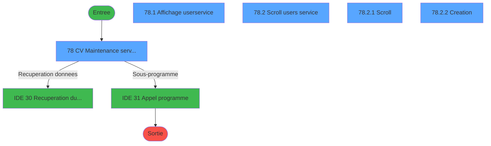
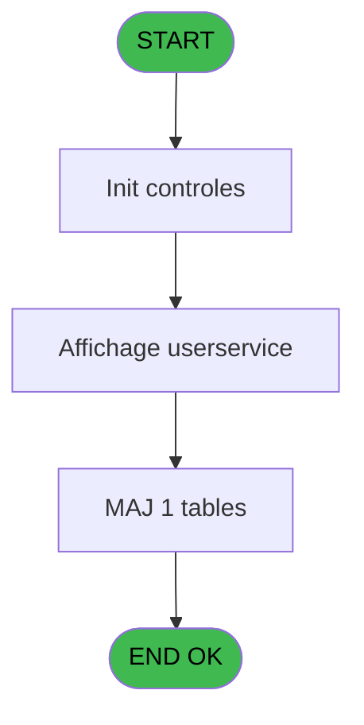
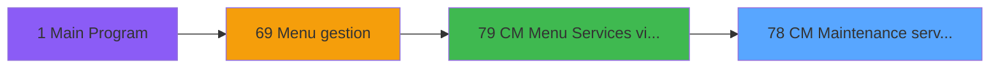
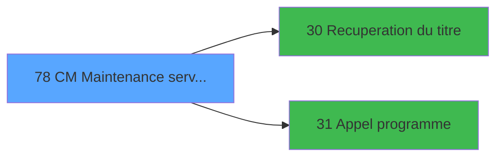

# GES IDE 78 - CM  Maintenance service/user

> **Analyse**: Phases 1-4 2026-02-03 11:42 -> 11:42 (16s) | Assemblage 11:42
> **Pipeline**: V7.2 Enrichi
> **Structure**: 4 onglets (Resume | Ecrans | Donnees | Connexions)

<!-- TAB:Resume -->

## 1. FICHE D'IDENTITE

| Attribut | Valeur |
|----------|--------|
| Projet | GES |
| IDE Position | 78 |
| Nom Programme | CM  Maintenance service/user |
| Fichier source | `Prg_78.xml` |
| Dossier IDE | Services |
| Taches | 7 (5 ecrans visibles) |
| Tables modifiees | 1 |
| Programmes appeles | 2 |

## 2. DESCRIPTION FONCTIONNELLE

**CM  Maintenance service/user** assure la gestion complete de ce processus, accessible depuis [CM  Menu Services village (IDE 79)](GES-IDE-79.md).

Le flux de traitement s'organise en **3 blocs fonctionnels** :

- **Traitement** (4 taches) : traitements metier divers
- **Creation** (2 taches) : insertion d'enregistrements en base (mouvements, prestations)
- **Consultation** (1 tache) : ecrans de recherche, selection et consultation

**Donnees modifiees** : 1 tables en ecriture (user___service___uss).

Detail : phases du traitement

#### Phase 1 : Traitement (4 taches)

- **78** - CV  Maintenance service villag **[[ECRAN]](#ecran-t1)**
- **78.2** - Scroll users service **[[ECRAN]](#ecran-t3)**
- **78.2.1** - Scroll **[[ECRAN]](#ecran-t4)**
- **78.2.3** - Suppression

Delegue a : [Recuperation du titre (IDE 30)](GES-IDE-30.md), [Appel programme (IDE 31)](GES-IDE-31.md)

#### Phase 2 : Consultation (1 tache)

- **78.1** - Affichage user/service **[[ECRAN]](#ecran-t2)**

Delegue a : [Recuperation du titre (IDE 30)](GES-IDE-30.md)

#### Phase 3 : Creation (2 taches)

- **78.2.2** - Creation **[[ECRAN]](#ecran-t5)**
- **78.2.2.1** - Creation

#### Tables impactees

| Table | Operations | Role metier |
|-------|-----------|-------------|
| user___service___uss | R/**W** (5 usages) | Services / filieres |

## 3. BLOCS FONCTIONNELS

### 3.1 Traitement (4 taches)

Traitements internes.

---

#### 78 - CV  Maintenance service villag [[ECRAN]](#ecran-t1)

**Role** : Traitement : CV  Maintenance service villag.
**Ecran** : 716 x 222 DLU (MDI) | [Voir mockup](#ecran-t1)

3 sous-taches directes

| Tache | Nom | Bloc |
|-------|-----|------|
| [78.2](#t3) | Scroll users service **[[ECRAN]](#ecran-t3)** | Traitement |
| [78.2.1](#t4) | Scroll **[[ECRAN]](#ecran-t4)** | Traitement |
| [78.2.3](#t7) | Suppression | Traitement |

**Delegue a** : [Recuperation du titre (IDE 30)](GES-IDE-30.md), [Appel programme (IDE 31)](GES-IDE-31.md)

---

#### 78.2 - Scroll users service [[ECRAN]](#ecran-t3)

**Role** : Traitement : Scroll users service.
**Ecran** : 233 x 164 DLU (Modal) | [Voir mockup](#ecran-t3)
**Delegue a** : [Recuperation du titre (IDE 30)](GES-IDE-30.md), [Appel programme (IDE 31)](GES-IDE-31.md)

---

#### 78.2.1 - Scroll [[ECRAN]](#ecran-t4)

**Role** : Traitement : Scroll.
**Ecran** : 198 x 139 DLU (Modal) | [Voir mockup](#ecran-t4)
**Delegue a** : [Recuperation du titre (IDE 30)](GES-IDE-30.md), [Appel programme (IDE 31)](GES-IDE-31.md)

---

#### 78.2.3 - Suppression

**Role** : Traitement : Suppression.
**Delegue a** : [Recuperation du titre (IDE 30)](GES-IDE-30.md), [Appel programme (IDE 31)](GES-IDE-31.md)

### 3.2 Consultation (1 tache)

Ecrans de recherche et consultation.

---

#### 78.1 - Affichage user/service [[ECRAN]](#ecran-t2)

**Role** : Reinitialisation : Affichage user/service.
**Ecran** : 203 x 136 DLU (Modal) | [Voir mockup](#ecran-t2)

### 3.3 Creation (2 taches)

Insertion de nouveaux enregistrements en base.

---

#### 78.2.2 - Creation [[ECRAN]](#ecran-t5)

**Role** : Creation d'enregistrement : Creation.
**Ecran** : 406 x 89 DLU (MDI) | [Voir mockup](#ecran-t5)

---

#### 78.2.2.1 - Creation

**Role** : Creation d'enregistrement : Creation.

## 5. REGLES METIER

*(Aucune regle metier identifiee)*

## 6. CONTEXTE

- **Appele par**: [CM  Menu Services village (IDE 79)](GES-IDE-79.md)
- **Appelle**: 2 programmes | **Tables**: 2 (W:1 R:2 L:0) | **Taches**: 7 | **Expressions**: 12

<!-- TAB:Ecrans -->

## 8. ECRANS

### 8.1 Forms visibles (5 / 7)

| # | Position | Tache | Nom | Type | Largeur | Hauteur | Bloc |
|---|----------|-------|-----|------|---------|---------|------|
| 1 | 78 | 78 | CV  Maintenance service villag | MDI | 716 | 222 | Traitement |
| 2 | 78.1 | 78.1 | Affichage user/service | Modal | 203 | 136 | Consultation |
| 3 | 78.2 | 78.2 | Scroll users service | Modal | 233 | 164 | Traitement |
| 4 | 78.2.1 | 78.2.1 | Scroll | Modal | 198 | 139 | Traitement |
| 5 | 78.2.2 | 78.2.2 | Creation | MDI | 406 | 89 | Creation |

### 8.2 Mockups Ecrans

---

#### 78 - CV  Maintenance service villag
**Tache** : [78](#t1) | **Type** : MDI | **Dimensions** : 716 x 222 DLU
**Bloc** : Traitement | **Titre IDE** : CV  Maintenance service villag

<!-- FORM-DATA:
{
    "width":  716,
    "vFactor":  8,
    "type":  "MDI",
    "hFactor":  8,
    "controls":  [
                     {
                         "x":  2,
                         "type":  "label",
                         "var":  "",
                         "y":  2,
                         "w":  708,
                         "fmt":  "",
                         "name":  "",
                         "h":  19,
                         "color":  "",
                         "text":  "",
                         "parent":  null
                     },
                     {
                         "x":  6,
                         "type":  "label",
                         "var":  "",
                         "y":  41,
                         "w":  461,
                         "fmt":  "",
                         "name":  "",
                         "h":  151,
                         "color":  "195",
                         "text":  "Services village",
                         "parent":  null
                     },
                     {
                         "x":  487,
                         "type":  "label",
                         "var":  "",
                         "y":  41,
                         "w":  208,
                         "fmt":  "",
                         "name":  "",
                         "h":  151,
                         "color":  "195",
                         "text":  "Utilisateurs",
                         "parent":  null
                     },
                     {
                         "x":  18,
                         "type":  "table",
                         "var":  "",
                         "name":  "",
                         "titleH":  12,
                         "color":  "110",
                         "w":  443,
                         "y":  55,
                         "fmt":  "",
                         "parent":  null,
                         "text":  "",
                         "rowH":  13,
                         "h":  127,
                         "cols":  [
                                      {
                                          "title":  "Code",
                                          "layer":  1,
                                          "w":  106
                                      },
                                      {
                                          "title":  "Libellé",
                                          "layer":  2,
                                          "w":  302
                                      }
                                  ],
                         "rows":  2
                     },
                     {
                         "x":  0,
                         "type":  "label",
                         "var":  "",
                         "y":  198,
                         "w":  703,
                         "fmt":  "",
                         "name":  "",
                         "h":  24,
                         "color":  "",
                         "text":  "",
                         "parent":  null
                     },
                     {
                         "x":  379,
                         "type":  "button",
                         "var":  "",
                         "y":  68,
                         "w":  44,
                         "fmt":  "\u003e\u003e",
                         "name":  "Bouton selection",
                         "h":  11,
                         "color":  "",
                         "text":  "",
                         "parent":  6
                     },
                     {
                         "x":  24,
                         "type":  "edit",
                         "var":  "",
                         "y":  70,
                         "w":  64,
                         "fmt":  "",
                         "name":  "TAB code alpha5",
                         "h":  8,
                         "color":  "110",
                         "text":  "",
                         "parent":  6
                     },
                     {
                         "x":  136,
                         "type":  "edit",
                         "var":  "",
                         "y":  70,
                         "w":  232,
                         "fmt":  "",
                         "name":  "",
                         "h":  8,
                         "color":  "110",
                         "text":  "",
                         "parent":  6
                     },
                     {
                         "x":  5,
                         "type":  "edit",
                         "var":  "",
                         "y":  6,
                         "w":  267,
                         "fmt":  "20",
                         "name":  "",
                         "h":  8,
                         "color":  "",
                         "text":  "",
                         "parent":  1
                     },
                     {
                         "x":  438,
                         "type":  "edit",
                         "var":  "",
                         "y":  6,
                         "w":  267,
                         "fmt":  "WWW DD MMM YYYYT",
                         "name":  "",
                         "h":  8,
                         "color":  "",
                         "text":  "",
                         "parent":  null
                     },
                     {
                         "x":  8,
                         "type":  "button",
                         "var":  "",
                         "y":  201,
                         "w":  154,
                         "fmt":  "\u0026Quitter",
                         "name":  "",
                         "h":  18,
                         "color":  "",
                         "text":  "",
                         "parent":  11
                     }
                 ],
    "taskId":  "78",
    "height":  222
}
-->

<strong>Champs : 4 champs</strong>

| Pos (x,y) | Nom | Variable | Type |
|-----------|-----|----------|------|
| 24,70 | TAB code alpha5 | - | edit |
| 136,70 | (sans nom) | - | edit |
| 5,6 | 20 | - | edit |
| 438,6 | WWW DD MMM YYYYT | - | edit |

<strong>Boutons : 2 boutons</strong>

| Bouton | Pos (x,y) | Action |
|--------|-----------|--------|
| >> | 379,68 | Bouton fonctionnel |
| Quitter | 8,201 | Quitte le programme |

---

#### 78.1 - Affichage user/service
**Tache** : [78.1](#t2) | **Type** : Modal | **Dimensions** : 203 x 136 DLU
**Bloc** : Consultation | **Titre IDE** : Affichage user/service

<!-- FORM-DATA:
{
    "width":  203,
    "vFactor":  8,
    "type":  "Modal",
    "hFactor":  8,
    "controls":  [
                     {
                         "x":  28,
                         "type":  "table",
                         "var":  "",
                         "name":  "",
                         "titleH":  12,
                         "color":  "110",
                         "w":  155,
                         "y":  5,
                         "fmt":  "",
                         "parent":  null,
                         "text":  "",
                         "rowH":  12,
                         "h":  128,
                         "cols":  [
                                      {
                                          "title":  "",
                                          "layer":  1,
                                          "w":  120
                                      }
                                  ],
                         "rows":  1
                     },
                     {
                         "x":  40,
                         "type":  "edit",
                         "var":  "",
                         "y":  9,
                         "w":  98,
                         "fmt":  "",
                         "name":  "",
                         "h":  8,
                         "color":  "110",
                         "text":  "",
                         "parent":  1
                     }
                 ],
    "taskId":  "78.1",
    "height":  136
}
-->

<strong>Champs : 1 champs</strong>

| Pos (x,y) | Nom | Variable | Type |
|-----------|-----|----------|------|
| 40,9 | (sans nom) | - | edit |

---

#### 78.2 - Scroll users service
**Tache** : [78.2](#t3) | **Type** : Modal | **Dimensions** : 233 x 164 DLU
**Bloc** : Traitement | **Titre IDE** : Scroll users service

<!-- FORM-DATA:
{
    "width":  233,
    "vFactor":  8,
    "type":  "Modal",
    "hFactor":  8,
    "controls":  [
                     {
                         "x":  10,
                         "type":  "label",
                         "var":  "",
                         "y":  9,
                         "w":  218,
                         "fmt":  "",
                         "name":  "",
                         "h":  151,
                         "color":  "195",
                         "text":  "Utilisateurs",
                         "parent":  null
                     }
                 ],
    "taskId":  "78.2",
    "height":  164
}
-->

---

#### 78.2.1 - Scroll
**Tache** : [78.2.1](#t4) | **Type** : Modal | **Dimensions** : 198 x 139 DLU
**Bloc** : Traitement | **Titre IDE** : Scroll

<!-- FORM-DATA:
{
    "width":  198,
    "vFactor":  8,
    "type":  "Modal",
    "hFactor":  8,
    "controls":  [
                     {
                         "x":  28,
                         "type":  "table",
                         "var":  "",
                         "name":  "",
                         "titleH":  12,
                         "color":  "110",
                         "w":  147,
                         "y":  5,
                         "fmt":  "",
                         "parent":  null,
                         "text":  "",
                         "rowH":  14,
                         "h":  73,
                         "cols":  [
                                      {
                                          "title":  "",
                                          "layer":  1,
                                          "w":  115
                                      }
                                  ],
                         "rows":  1
                     },
                     {
                         "x":  0,
                         "type":  "label",
                         "var":  "",
                         "y":  87,
                         "w":  199,
                         "fmt":  "",
                         "name":  "",
                         "h":  47,
                         "color":  "",
                         "text":  "",
                         "parent":  7
                     },
                     {
                         "x":  3,
                         "type":  "label",
                         "var":  "",
                         "y":  88,
                         "w":  192,
                         "fmt":  "",
                         "name":  "",
                         "h":  45,
                         "color":  "",
                         "text":  "",
                         "parent":  8
                     },
                     {
                         "x":  11,
                         "type":  "label",
                         "var":  "",
                         "y":  91,
                         "w":  176,
                         "fmt":  "",
                         "name":  "",
                         "h":  27,
                         "color":  "",
                         "text":  "",
                         "parent":  8
                     },
                     {
                         "x":  12,
                         "type":  "label",
                         "var":  "",
                         "y":  92,
                         "w":  39,
                         "fmt":  "",
                         "name":  "",
                         "h":  25,
                         "color":  "",
                         "text":  "",
                         "parent":  null
                     },
                     {
                         "x":  54,
                         "type":  "label",
                         "var":  "",
                         "y":  94,
                         "w":  96,
                         "fmt":  "",
                         "name":  "",
                         "h":  8,
                         "color":  "7",
                         "text":  "Création",
                         "parent":  null
                     },
                     {
                         "x":  54,
                         "type":  "label",
                         "var":  "",
                         "y":  106,
                         "w":  123,
                         "fmt":  "",
                         "name":  "",
                         "h":  8,
                         "color":  "7",
                         "text":  "Suppression",
                         "parent":  null
                     },
                     {
                         "x":  24,
                         "type":  "label",
                         "var":  "",
                         "y":  121,
                         "w":  123,
                         "fmt":  "",
                         "name":  "",
                         "h":  8,
                         "color":  "",
                         "text":  "Votre choix",
                         "parent":  8
                     },
                     {
                         "x":  38,
                         "type":  "edit",
                         "var":  "",
                         "y":  9,
                         "w":  98,
                         "fmt":  "",
                         "name":  "",
                         "h":  8,
                         "color":  "110",
                         "text":  "",
                         "parent":  1
                     },
                     {
                         "x":  149,
                         "type":  "edit",
                         "var":  "",
                         "y":  120,
                         "w":  26,
                         "fmt":  "",
                         "name":  "W2 choix action",
                         "h":  10,
                         "color":  "6",
                         "text":  "",
                         "parent":  8
                     },
                     {
                         "x":  17,
                         "type":  "button",
                         "var":  "",
                         "y":  94,
                         "w":  27,
                         "fmt":  "C",
                         "name":  "C",
                         "h":  9,
                         "color":  "",
                         "text":  "",
                         "parent":  8
                     },
                     {
                         "x":  17,
                         "type":  "button",
                         "var":  "",
                         "y":  106,
                         "w":  27,
                         "fmt":  "S",
                         "name":  "S",
                         "h":  9,
                         "color":  "",
                         "text":  "",
                         "parent":  8
                     }
                 ],
    "taskId":  "78.2.1",
    "height":  139
}
-->

<strong>Champs : 2 champs</strong>

| Pos (x,y) | Nom | Variable | Type |
|-----------|-----|----------|------|
| 38,9 | (sans nom) | - | edit |
| 149,120 | W2 choix action | - | edit |

<strong>Boutons : 2 boutons</strong>

| Bouton | Pos (x,y) | Action |
|--------|-----------|--------|
| C | 17,94 | Bouton fonctionnel |
| S | 17,106 | Bouton fonctionnel |

---

#### 78.2.2 - Creation
**Tache** : [78.2.2](#t5) | **Type** : MDI | **Dimensions** : 406 x 89 DLU
**Bloc** : Creation | **Titre IDE** : Creation

<!-- FORM-DATA:
{
    "width":  406,
    "vFactor":  8,
    "type":  "MDI",
    "hFactor":  8,
    "controls":  [
                     {
                         "x":  43,
                         "type":  "label",
                         "var":  "",
                         "y":  8,
                         "w":  320,
                         "fmt":  "",
                         "name":  "",
                         "h":  39,
                         "color":  "195",
                         "text":  "Utilisateur",
                         "parent":  null
                     },
                     {
                         "x":  2,
                         "type":  "label",
                         "var":  "",
                         "y":  65,
                         "w":  405,
                         "fmt":  "",
                         "name":  "",
                         "h":  24,
                         "color":  "",
                         "text":  "",
                         "parent":  null
                     },
                     {
                         "x":  150,
                         "type":  "edit",
                         "var":  "",
                         "y":  26,
                         "w":  104,
                         "fmt":  "",
                         "name":  "W2 user",
                         "h":  10,
                         "color":  "6",
                         "text":  "",
                         "parent":  1
                     },
                     {
                         "x":  9,
                         "type":  "button",
                         "var":  "",
                         "y":  68,
                         "w":  154,
                         "fmt":  "\u0026Ok",
                         "name":  "Bouton Ok",
                         "h":  18,
                         "color":  "",
                         "text":  "",
                         "parent":  null
                     },
                     {
                         "x":  171,
                         "type":  "button",
                         "var":  "",
                         "y":  68,
                         "w":  154,
                         "fmt":  "A\u0026bandonner",
                         "name":  "",
                         "h":  18,
                         "color":  "",
                         "text":  "",
                         "parent":  null
                     }
                 ],
    "taskId":  "78.2.2",
    "height":  89
}
-->

<strong>Champs : 1 champs</strong>

| Pos (x,y) | Nom | Variable | Type |
|-----------|-----|----------|------|
| 150,26 | W2 user | - | edit |

<strong>Boutons : 2 boutons</strong>

| Bouton | Pos (x,y) | Action |
|--------|-----------|--------|
| Ok | 9,68 | Valide la saisie et enregistre |
| Abandonner | 171,68 | Annule et retour au menu |

## 9. NAVIGATION

### 9.1 Enchainement des ecrans

**Detail par enchainement :**

| Depuis | Action | Vers | Retour |
|--------|--------|------|--------|
| CV  Maintenance service villag | Recuperation donnees | [Recuperation du titre (IDE 30)](GES-IDE-30.md) | Retour ecran |
| CV  Maintenance service villag | Sous-programme | [Appel programme (IDE 31)](GES-IDE-31.md) | Retour ecran |

### 9.3 Structure hierarchique (7 taches)

| Position | Tache | Type | Dimensions | Bloc |
|----------|-------|------|------------|------|
| **78.1** | [**CV  Maintenance service villag** (78)](#t1) [mockup](#ecran-t1) | MDI | 716x222 | Traitement |
| 78.1.1 | [Scroll users service (78.2)](#t3) [mockup](#ecran-t3) | Modal | 233x164 | |
| 78.1.2 | [Scroll (78.2.1)](#t4) [mockup](#ecran-t4) | Modal | 198x139 | |
| 78.1.3 | [Suppression (78.2.3)](#t7) | MDI | - | |
| **78.2** | [**Affichage user/service** (78.1)](#t2) [mockup](#ecran-t2) | Modal | 203x136 | Consultation |
| **78.3** | [**Creation** (78.2.2)](#t5) [mockup](#ecran-t5) | MDI | 406x89 | Creation |
| 78.3.1 | [Creation (78.2.2.1)](#t6) | MDI | - | |

### 9.4 Algorigramme

> **Legende**: Vert = START/END OK | Rouge = END KO | Bleu = Decisions
> *Algorigramme auto-genere. Utiliser `/algorigramme` pour une synthese metier detaillee.*

<!-- TAB:Donnees -->

## 10. TABLES

### Tables utilisees (2)

| ID | Nom | Description | Type | R | W | L | Usages |
|----|-----|-------------|------|---|---|---|--------|
| 28 | user___service___uss | Services / filieres | DB | R | **W** |   | 5 |
| 67 | tables___________tab |  | DB | R |   |   | 1 |

### Colonnes par table (2 / 2 tables avec colonnes identifiees)

Table 28 - user___service___uss (R/**W**) - 5 usages

| Lettre | Variable | Acces | Type |
|--------|----------|-------|------|
| A | W2 fin tache | W | Alpha |
| B | W2 choix action | W | Alpha |
| C | Bouton Ok | W | Alpha |
| D | v. titre | W | Alpha |

Table 67 - tables___________tab (R) - 1 usages

| Lettre | Variable | Acces | Type |
|--------|----------|-------|------|
| A | > societe | R | Alpha |
| B | Bouton selection | R | Alpha |
| C | v. titre | R | Alpha |

## 11. VARIABLES

### 11.1 Variables de session (2)

Variables persistantes pendant toute la session.

| Lettre | Nom | Type | Usage dans |
|--------|-----|------|-----------|
| C | v. titre | Alpha | - |
| D | v. titre | Alpha | - |

### 11.2 Autres (2)

Variables diverses.

| Lettre | Nom | Type | Usage dans |
|--------|-----|------|-----------|
| A | > societe | Alpha | 2x refs |
| B | Bouton selection | Alpha | - |

## 12. EXPRESSIONS

**12 / 12 expressions decodees (100%)**

### 12.1 Repartition par type

| Type | Expressions | Regles |
|------|-------------|--------|
| CONSTANTE | 5 | 0 |
| DATE | 1 | 0 |
| CAST_LOGIQUE | 2 | 0 |
| CONDITION | 2 | 0 |
| REFERENCE_VG | 1 | 0 |
| STRING | 1 | 0 |

### 12.2 Expressions cles par type

#### CONSTANTE (5 expressions)

| Type | IDE | Expression | Regle |
|------|-----|------------|-------|
| CONSTANTE | 10 | `31` | - |
| CONSTANTE | 12 | `'>>'` | - |
| CONSTANTE | 6 | `'C'` | - |
| CONSTANTE | 1 | `'VSERV'` | - |
| CONSTANTE | 2 | `'O'` | - |

#### DATE (1 expressions)

| Type | IDE | Expression | Regle |
|------|-----|------------|-------|
| DATE | 8 | `Date ()` | - |

#### CAST_LOGIQUE (2 expressions)

| Type | IDE | Expression | Regle |
|------|-----|------------|-------|
| CAST_LOGIQUE | 4 | `INIPut ('AllowCreateInModify  = Y','FALSE'LOG)` | - |
| CAST_LOGIQUE | 3 | `INIPut ('AllowCreateInModify  = N','FALSE'LOG)` | - |

#### CONDITION (2 expressions)

| Type | IDE | Expression | Regle |
|------|-----|------------|-------|
| CONDITION | 11 | `> societe [A]='C'` | - |
| CONDITION | 5 | `> societe [A]=''` | - |

#### REFERENCE_VG (1 expressions)

| Type | IDE | Expression | Regle |
|------|-----|------------|-------|
| REFERENCE_VG | 7 | `VG2` | - |

#### STRING (1 expressions)

| Type | IDE | Expression | Regle |
|------|-----|------------|-------|
| STRING | 9 | `Trim ([G])` | - |

<!-- TAB:Connexions -->

## 13. GRAPHE D'APPELS

### 13.1 Chaine depuis Main (Callers)

Main -> ... -> [CM  Menu Services village (IDE 79)](GES-IDE-79.md) -> **CM  Maintenance service/user (IDE 78)**

### 13.2 Callers

| IDE | Nom Programme | Nb Appels |
|-----|---------------|-----------|
| [79](GES-IDE-79.md) | CM  Menu Services village | 1 |

### 13.3 Callees (programmes appeles)

### 13.4 Detail Callees avec contexte

| IDE | Nom Programme | Appels | Contexte |
|-----|---------------|--------|----------|
| [30](GES-IDE-30.md) | Recuperation du titre | 2 | Recuperation donnees |
| [31](GES-IDE-31.md) | Appel programme | 1 | Sous-programme |

## 14. RECOMMANDATIONS MIGRATION

### 14.1 Profil du programme

| Metrique | Valeur | Impact migration |
|----------|--------|-----------------|
| Lignes de logique | 76 | Programme compact |
| Expressions | 12 | Peu de logique |
| Tables WRITE | 1 | Impact faible |
| Sous-programmes | 2 | Peu de dependances |
| Ecrans visibles | 5 | Quelques ecrans |
| Code desactive | 0% (0 / 76) | Code sain |
| Regles metier | 0 | Pas de regle identifiee |

### 14.2 Plan de migration par bloc

#### Traitement (4 taches: 3 ecrans, 1 traitement)

- **Strategie** : Orchestrateur avec 3 ecrans (Razor/React) et 1 traitements backend (services).
- Les ecrans deviennent des composants UI, les traitements invisibles deviennent des services injectables.
- 2 sous-programme(s) a migrer ou a reutiliser depuis les services existants.
- Decomposer les taches en services unitaires testables.

#### Consultation (1 tache: 1 ecran, 0 traitement)

- **Strategie** : Composants de recherche/selection en modales.
- 1 ecran : Affichage user/service

#### Creation (2 taches: 1 ecran, 1 traitement)

- **Strategie** : Repository pattern avec Entity Framework Core.
- Insertion via `IRepository<T>.CreateAsync()`

### 14.3 Dependances critiques

| Dependance | Type | Appels | Impact |
|------------|------|--------|--------|
| user___service___uss | Table WRITE (Database) | 4x | Schema + repository |
| [Recuperation du titre (IDE 30)](GES-IDE-30.md) | Sous-programme | 2x | Haute - Recuperation donnees |
| [Appel programme (IDE 31)](GES-IDE-31.md) | Sous-programme | 1x | Normale - Sous-programme |

---
*Spec DETAILED generee par Pipeline V7.2 - 2026-02-03 11:42*
