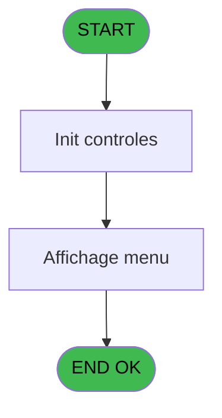
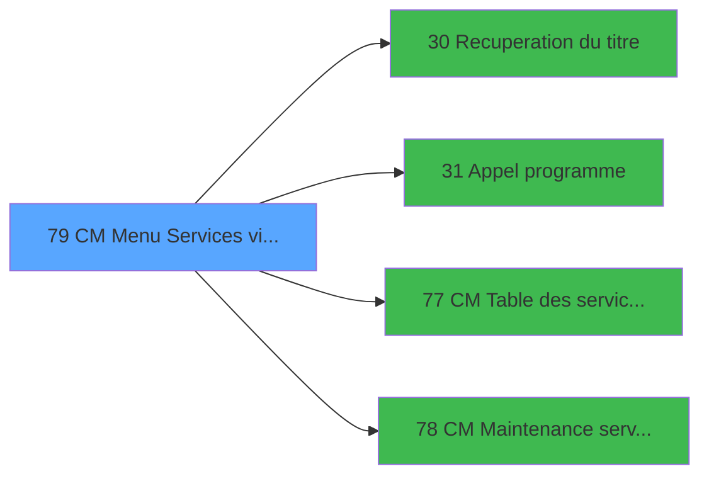

# GES IDE 79 - CM  Menu Services village

> **Analyse**: Phases 1-4 2026-02-03 11:42 -> 11:43 (16s) | Assemblage 11:43
> **Pipeline**: V7.2 Enrichi
> **Structure**: 4 onglets (Resume | Ecrans | Donnees | Connexions)

<!-- TAB:Resume -->

## 1. FICHE D'IDENTITE

| Attribut | Valeur |
|----------|--------|
| Projet | GES |
| IDE Position | 79 |
| Nom Programme | CM  Menu Services village |
| Fichier source | `Prg_79.xml` |
| Dossier IDE | Services |
| Taches | 2 (1 ecrans visibles) |
| Tables modifiees | 0 |
| Programmes appeles | 4 |

## 2. DESCRIPTION FONCTIONNELLE

**CM  Menu Services village** assure la gestion complete de ce processus, accessible depuis [Menu gestion (IDE 69)](GES-IDE-69.md).

Le flux de traitement s'organise en **2 blocs fonctionnels** :

- **Consultation** (1 tache) : ecrans de recherche, selection et consultation
- **Traitement** (1 tache) : traitements metier divers

Detail : phases du traitement

#### Phase 1 : Traitement (1 tache)

- **79** - CV  Menu Services village

Delegue a : [Recuperation du titre (IDE 30)](GES-IDE-30.md), [Appel programme (IDE 31)](GES-IDE-31.md), [CM Table des services village (IDE 77)](GES-IDE-77.md), [CM  Maintenance service/user (IDE 78)](GES-IDE-78.md)

#### Phase 2 : Consultation (1 tache)

- **79.1** - Affichage menu **[[ECRAN]](#ecran-t2)**

Delegue a : [Recuperation du titre (IDE 30)](GES-IDE-30.md)

## 3. BLOCS FONCTIONNELS

### 3.1 Traitement (1 tache)

Traitements internes.

---

#### 79 - CV  Menu Services village

**Role** : Traitement : CV  Menu Services village.
**Delegue a** : [Recuperation du titre (IDE 30)](GES-IDE-30.md), [Appel programme (IDE 31)](GES-IDE-31.md), [CM Table des services village (IDE 77)](GES-IDE-77.md)

### 3.2 Consultation (1 tache)

Ecrans de recherche et consultation.

---

#### 79.1 - Affichage menu [[ECRAN]](#ecran-t2)

**Role** : Reinitialisation : Affichage menu.
**Ecran** : 571 x 159 DLU (MDI) | [Voir mockup](#ecran-t2)

## 5. REGLES METIER

*(Aucune regle metier identifiee)*

## 6. CONTEXTE

- **Appele par**: [Menu gestion (IDE 69)](GES-IDE-69.md)
- **Appelle**: 4 programmes | **Tables**: 0 (W:0 R:0 L:0) | **Taches**: 2 | **Expressions**: 3

<!-- TAB:Ecrans -->

## 8. ECRANS

### 8.1 Forms visibles (1 / 2)

| # | Position | Tache | Nom | Type | Largeur | Hauteur | Bloc |
|---|----------|-------|-----|------|---------|---------|------|
| 1 | 79.1 | 79.1 | Affichage menu | MDI | 571 | 159 | Consultation |

### 8.2 Mockups Ecrans

---

#### 79.1 - Affichage menu
**Tache** : [79.1](#t2) | **Type** : MDI | **Dimensions** : 571 x 159 DLU
**Bloc** : Consultation | **Titre IDE** : Affichage menu

<!-- FORM-DATA:
{
    "width":  571,
    "vFactor":  8,
    "type":  "MDI",
    "hFactor":  8,
    "controls":  [
                     {
                         "x":  2,
                         "type":  "label",
                         "var":  "",
                         "y":  2,
                         "w":  565,
                         "fmt":  "",
                         "name":  "",
                         "h":  17,
                         "color":  "",
                         "text":  "",
                         "parent":  null
                     },
                     {
                         "x":  8,
                         "type":  "label",
                         "var":  "",
                         "y":  24,
                         "w":  554,
                         "fmt":  "",
                         "name":  "",
                         "h":  105,
                         "color":  "",
                         "text":  "",
                         "parent":  null
                     },
                     {
                         "x":  209,
                         "type":  "label",
                         "var":  "",
                         "y":  40,
                         "w":  343,
                         "fmt":  "",
                         "name":  "",
                         "h":  73,
                         "color":  "",
                         "text":  "",
                         "parent":  null
                     },
                     {
                         "x":  244,
                         "type":  "label",
                         "var":  "",
                         "y":  51,
                         "w":  284,
                         "fmt":  "",
                         "name":  "",
                         "h":  33,
                         "color":  "",
                         "text":  "",
                         "parent":  5
                     },
                     {
                         "x":  247,
                         "type":  "label",
                         "var":  "",
                         "y":  52,
                         "w":  37,
                         "fmt":  "",
                         "name":  "",
                         "h":  31,
                         "color":  "",
                         "text":  "",
                         "parent":  5
                     },
                     {
                         "x":  292,
                         "type":  "label",
                         "var":  "",
                         "y":  56,
                         "w":  226,
                         "fmt":  "",
                         "name":  "",
                         "h":  8,
                         "color":  "7",
                         "text":  "Sélection des services",
                         "parent":  5
                     },
                     {
                         "x":  292,
                         "type":  "label",
                         "var":  "",
                         "y":  71,
                         "w":  232,
                         "fmt":  "",
                         "name":  "",
                         "h":  8,
                         "color":  "7",
                         "text":  "Gestion des utilisateurs",
                         "parent":  5
                     },
                     {
                         "x":  283,
                         "type":  "label",
                         "var":  "",
                         "y":  94,
                         "w":  120,
                         "fmt":  "",
                         "name":  "",
                         "h":  9,
                         "color":  "",
                         "text":  "Votre choix",
                         "parent":  5
                     },
                     {
                         "x":  2,
                         "type":  "label",
                         "var":  "",
                         "y":  135,
                         "w":  567,
                         "fmt":  "",
                         "name":  "",
                         "h":  23,
                         "color":  "",
                         "text":  "",
                         "parent":  null
                     },
                     {
                         "x":  417,
                         "type":  "edit",
                         "var":  "",
                         "y":  93,
                         "w":  26,
                         "fmt":  "",
                         "name":  "",
                         "h":  10,
                         "color":  "6",
                         "text":  "",
                         "parent":  5
                     },
                     {
                         "x":  315,
                         "type":  "edit",
                         "var":  "",
                         "y":  6,
                         "w":  245,
                         "fmt":  "WWW DD MMM YYYYT",
                         "name":  "",
                         "h":  8,
                         "color":  "",
                         "text":  "",
                         "parent":  1
                     },
                     {
                         "x":  28,
                         "type":  "image",
                         "var":  "",
                         "y":  44,
                         "w":  160,
                         "fmt":  "",
                         "name":  "",
                         "h":  62,
                         "color":  "",
                         "text":  "",
                         "parent":  null
                     },
                     {
                         "x":  251,
                         "type":  "button",
                         "var":  "",
                         "y":  56,
                         "w":  26,
                         "fmt":  "1",
                         "name":  "1",
                         "h":  9,
                         "color":  "",
                         "text":  "",
                         "parent":  null
                     },
                     {
                         "x":  251,
                         "type":  "button",
                         "var":  "",
                         "y":  71,
                         "w":  26,
                         "fmt":  "2",
                         "name":  "2",
                         "h":  9,
                         "color":  "",
                         "text":  "",
                         "parent":  null
                     },
                     {
                         "x":  8,
                         "type":  "button",
                         "var":  "",
                         "y":  138,
                         "w":  168,
                         "fmt":  "\u0026Quitter",
                         "name":  "",
                         "h":  18,
                         "color":  "",
                         "text":  "",
                         "parent":  null
                     },
                     {
                         "x":  10,
                         "type":  "edit",
                         "var":  "",
                         "y":  6,
                         "w":  267,
                         "fmt":  "20",
                         "name":  "",
                         "h":  8,
                         "color":  "",
                         "text":  "",
                         "parent":  1
                     }
                 ],
    "taskId":  "79.1",
    "height":  159
}
-->

<strong>Champs : 3 champs</strong>

| Pos (x,y) | Nom | Variable | Type |
|-----------|-----|----------|------|
| 417,93 | (sans nom) | - | edit |
| 315,6 | WWW DD MMM YYYYT | - | edit |
| 10,6 | 20 | - | edit |

<strong>Boutons : 3 boutons</strong>

| Bouton | Pos (x,y) | Action |
|--------|-----------|--------|
| 1 | 251,56 | Bouton fonctionnel |
| 2 | 251,71 | Bouton fonctionnel |
| Quitter | 8,138 | Quitte le programme |

## 9. NAVIGATION

Ecran unique: **Affichage menu**

### 9.3 Structure hierarchique (2 taches)

| Position | Tache | Type | Dimensions | Bloc |
|----------|-------|------|------------|------|
| **79.1** | [**CV  Menu Services village** (79)](#t1) | MDI | - | Traitement |
| **79.2** | [**Affichage menu** (79.1)](#t2) [mockup](#ecran-t2) | MDI | 571x159 | Consultation |

### 9.4 Algorigramme

> **Legende**: Vert = START/END OK | Rouge = END KO | Bleu = Decisions
> *Algorigramme auto-genere. Utiliser `/algorigramme` pour une synthese metier detaillee.*

<!-- TAB:Donnees -->

## 10. TABLES

### Tables utilisees (0)

| ID | Nom | Description | Type | R | W | L | Usages |
|----|-----|-------------|------|---|---|---|--------|

### Colonnes par table (0 / 0 tables avec colonnes identifiees)

## 11. VARIABLES

### 11.1 Parametres entrants (2)

Variables recues du programme appelant ([Menu gestion (IDE 69)](GES-IDE-69.md)).

| Lettre | Nom | Type | Usage dans |
|--------|-----|------|-----------|
| A | P0 societe | Alpha | - |
| B | P0 presence CAM | Alpha | - |

### 11.2 Variables de travail (1)

Variables internes au programme.

| Lettre | Nom | Type | Usage dans |
|--------|-----|------|-----------|
| C | W0 choix action | Alpha | 3x calcul interne |

## 12. EXPRESSIONS

**3 / 3 expressions decodees (100%)**

### 12.1 Repartition par type

| Type | Expressions | Regles |
|------|-------------|--------|
| CONDITION | 3 | 0 |

### 12.2 Expressions cles par type

#### CONDITION (3 expressions)

| Type | IDE | Expression | Regle |
|------|-----|------------|-------|
| CONDITION | 3 | `W0 choix action [C]='F'` | - |
| CONDITION | 2 | `W0 choix action [C]='2'` | - |
| CONDITION | 1 | `W0 choix action [C]='1'` | - |

<!-- TAB:Connexions -->

## 13. GRAPHE D'APPELS

### 13.1 Chaine depuis Main (Callers)

Main -> ... -> [Menu gestion (IDE 69)](GES-IDE-69.md) -> **CM  Menu Services village (IDE 79)**

### 13.2 Callers

| IDE | Nom Programme | Nb Appels |
|-----|---------------|-----------|
| [69](GES-IDE-69.md) | Menu gestion | 1 |

### 13.3 Callees (programmes appeles)

### 13.4 Detail Callees avec contexte

| IDE | Nom Programme | Appels | Contexte |
|-----|---------------|--------|----------|
| [30](GES-IDE-30.md) | Recuperation du titre | 1 | Recuperation donnees |
| [31](GES-IDE-31.md) | Appel programme | 1 | Sous-programme |
| [77](GES-IDE-77.md) | CM Table des services village | 1 | Sous-programme |
| [78](GES-IDE-78.md) | CM  Maintenance service/user | 1 | Sous-programme |

## 14. RECOMMANDATIONS MIGRATION

### 14.1 Profil du programme

| Metrique | Valeur | Impact migration |
|----------|--------|-----------------|
| Lignes de logique | 19 | Programme compact |
| Expressions | 3 | Peu de logique |
| Tables WRITE | 0 | Impact faible |
| Sous-programmes | 4 | Peu de dependances |
| Ecrans visibles | 1 | Ecran unique ou traitement batch |
| Code desactive | 0% (0 / 19) | Code sain |
| Regles metier | 0 | Pas de regle identifiee |

### 14.2 Plan de migration par bloc

#### Traitement (1 tache: 0 ecran, 1 traitement)

- **Strategie** : 1 service(s) backend injectable(s) (Domain Services).
- 4 sous-programme(s) a migrer ou a reutiliser depuis les services existants.
- Decomposer les taches en services unitaires testables.

#### Consultation (1 tache: 1 ecran, 0 traitement)

- **Strategie** : Composants de recherche/selection en modales.
- 1 ecran : Affichage menu

### 14.3 Dependances critiques

| Dependance | Type | Appels | Impact |
|------------|------|--------|--------|
| [CM Table des services village (IDE 77)](GES-IDE-77.md) | Sous-programme | 1x | Normale - Sous-programme |
| [CM  Maintenance service/user (IDE 78)](GES-IDE-78.md) | Sous-programme | 1x | Normale - Sous-programme |
| [Recuperation du titre (IDE 30)](GES-IDE-30.md) | Sous-programme | 1x | Normale - Recuperation donnees |
| [Appel programme (IDE 31)](GES-IDE-31.md) | Sous-programme | 1x | Normale - Sous-programme |

---
*Spec DETAILED generee par Pipeline V7.2 - 2026-02-03 11:43*
