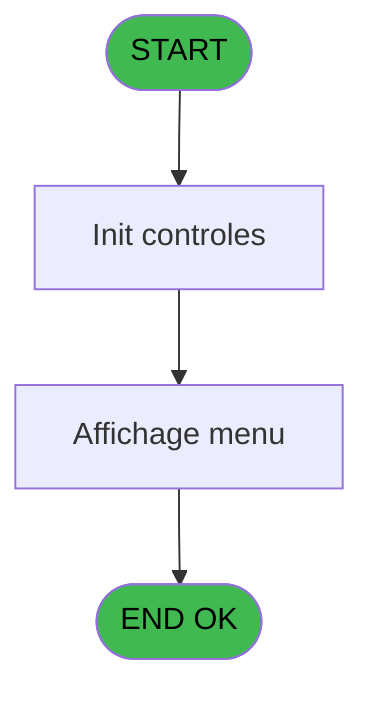
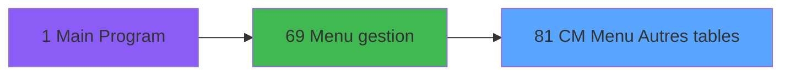
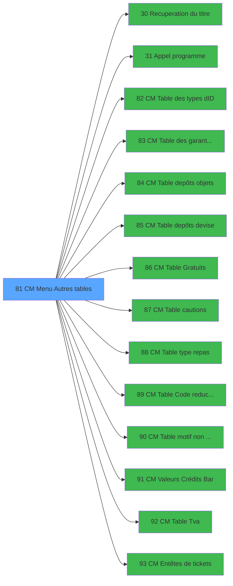

# GES IDE 81 - CM  Menu Autres tables

> **Analyse**: Phases 1-4 2026-02-03 11:43 -> 11:43 (12s) | Assemblage 11:43
> **Pipeline**: V7.2 Enrichi
> **Structure**: 4 onglets (Resume | Ecrans | Donnees | Connexions)

<!-- TAB:Resume -->

## 1. FICHE D'IDENTITE

| Attribut | Valeur |
|----------|--------|
| Projet | GES |
| IDE Position | 81 |
| Nom Programme | CM  Menu Autres tables |
| Fichier source | `Prg_81.xml` |
| Dossier IDE | Tables |
| Taches | 2 (1 ecrans visibles) |
| Tables modifiees | 0 |
| Programmes appeles | 14 |

## 2. DESCRIPTION FONCTIONNELLE

**CM  Menu Autres tables** assure la gestion complete de ce processus, accessible depuis [Menu gestion (IDE 69)](GES-IDE-69.md).

Le flux de traitement s'organise en **2 blocs fonctionnels** :

- **Consultation** (1 tache) : ecrans de recherche, selection et consultation
- **Traitement** (1 tache) : traitements metier divers

Detail : phases du traitement

#### Phase 1 : Traitement (1 tache)

- **81** - CV  Autres tables **[[ECRAN]](#ecran-t1)**

Delegue a : [Recuperation du titre (IDE 30)](GES-IDE-30.md), [Appel programme (IDE 31)](GES-IDE-31.md), [  CM  Table des types d'ID (IDE 82)](GES-IDE-82.md), [  CM  Table des garanties/com (IDE 83)](GES-IDE-83.md), [  CM  Table depôts objets (IDE 84)](GES-IDE-84.md), [  CM  Table depôts devise (IDE 85)](GES-IDE-85.md), [  CM  Table Gratuits (IDE 86)](GES-IDE-86.md), [  CM  Table cautions (IDE 87)](GES-IDE-87.md), [  CM  Table type repas (IDE 88)](GES-IDE-88.md), [  CM  Table Code reduction (IDE 89)](GES-IDE-89.md), [  CM  Table motif non enreg na (IDE 90)](GES-IDE-90.md), [  CM Valeurs Crédits Bar (IDE 91)](GES-IDE-91.md), [  CM  Table Tva (IDE 92)](GES-IDE-92.md)

#### Phase 2 : Consultation (1 tache)

- **81.1** - Affichage menu **[[ECRAN]](#ecran-t2)**

Delegue a : [Recuperation du titre (IDE 30)](GES-IDE-30.md)

## 3. BLOCS FONCTIONNELS

### 3.1 Traitement (1 tache)

Traitements internes.

---

#### 81 - CV  Autres tables [[ECRAN]](#ecran-t1)

**Role** : Traitement : CV  Autres tables.
**Ecran** : 770 x 228 DLU (MDI) | [Voir mockup](#ecran-t1)
**Delegue a** : [Recuperation du titre (IDE 30)](GES-IDE-30.md), [Appel programme (IDE 31)](GES-IDE-31.md), [  CM  Table des types d'ID (IDE 82)](GES-IDE-82.md)

### 3.2 Consultation (1 tache)

Ecrans de recherche et consultation.

---

#### 81.1 - Affichage menu [[ECRAN]](#ecran-t2)

**Role** : Reinitialisation : Affichage menu.
**Ecran** : 765 x 255 DLU (MDI) | [Voir mockup](#ecran-t2)

## 5. REGLES METIER

*(Aucune regle metier identifiee)*

## 6. CONTEXTE

- **Appele par**: [Menu gestion (IDE 69)](GES-IDE-69.md)
- **Appelle**: 14 programmes | **Tables**: 0 (W:0 R:0 L:0) | **Taches**: 2 | **Expressions**: 15

<!-- TAB:Ecrans -->

## 8. ECRANS

### 8.1 Forms visibles (1 / 2)

| # | Position | Tache | Nom | Type | Largeur | Hauteur | Bloc |
|---|----------|-------|-----|------|---------|---------|------|
| 1 | 81.1 | 81.1 | Affichage menu | MDI | 765 | 255 | Consultation |

### 8.2 Mockups Ecrans

---

#### 81.1 - Affichage menu
**Tache** : [81.1](#t2) | **Type** : MDI | **Dimensions** : 765 x 255 DLU
**Bloc** : Consultation | **Titre IDE** : Affichage menu

<!-- FORM-DATA:
{
    "width":  765,
    "vFactor":  8,
    "type":  "MDI",
    "hFactor":  8,
    "controls":  [
                     {
                         "x":  1,
                         "type":  "label",
                         "var":  "",
                         "y":  1,
                         "w":  743,
                         "fmt":  "",
                         "name":  "",
                         "h":  19,
                         "color":  "",
                         "text":  "",
                         "parent":  null
                     },
                     {
                         "x":  34,
                         "type":  "label",
                         "var":  "",
                         "y":  29,
                         "w":  677,
                         "fmt":  "",
                         "name":  "",
                         "h":  198,
                         "color":  "",
                         "text":  "",
                         "parent":  null
                     },
                     {
                         "x":  248,
                         "type":  "label",
                         "var":  "",
                         "y":  34,
                         "w":  449,
                         "fmt":  "",
                         "name":  "",
                         "h":  188,
                         "color":  "",
                         "text":  "",
                         "parent":  4
                     },
                     {
                         "x":  276,
                         "type":  "label",
                         "var":  "",
                         "y":  41,
                         "w":  411,
                         "fmt":  "",
                         "name":  "",
                         "h":  167,
                         "color":  "",
                         "text":  "",
                         "parent":  5
                     },
                     {
                         "x":  278,
                         "type":  "label",
                         "var":  "",
                         "y":  42,
                         "w":  44,
                         "fmt":  "",
                         "name":  "",
                         "h":  165,
                         "color":  "",
                         "text":  "",
                         "parent":  5
                     },
                     {
                         "x":  325,
                         "type":  "label",
                         "var":  "",
                         "y":  48,
                         "w":  355,
                         "fmt":  "",
                         "name":  "",
                         "h":  9,
                         "color":  "7",
                         "text":  "Les pièces d\u0027identité",
                         "parent":  5
                     },
                     {
                         "x":  325,
                         "type":  "label",
                         "var":  "",
                         "y":  61,
                         "w":  355,
                         "fmt":  "",
                         "name":  "",
                         "h":  9,
                         "color":  "7",
                         "text":  "Les garanties sur compte",
                         "parent":  5
                     },
                     {
                         "x":  325,
                         "type":  "label",
                         "var":  "",
                         "y":  74,
                         "w":  355,
                         "fmt":  "",
                         "name":  "",
                         "h":  9,
                         "color":  "7",
                         "text":  "Les dépôts d\u0027objets",
                         "parent":  5
                     },
                     {
                         "x":  325,
                         "type":  "label",
                         "var":  "",
                         "y":  87,
                         "w":  355,
                         "fmt":  "",
                         "name":  "",
                         "h":  9,
                         "color":  "7",
                         "text":  "Les dépôts de devise",
                         "parent":  5
                     },
                     {
                         "x":  325,
                         "type":  "label",
                         "var":  "",
                         "y":  100,
                         "w":  355,
                         "fmt":  "",
                         "name":  "",
                         "h":  9,
                         "color":  "7",
                         "text":  "Les gratuités",
                         "parent":  5
                     },
                     {
                         "x":  325,
                         "type":  "label",
                         "var":  "",
                         "y":  113,
                         "w":  355,
                         "fmt":  "",
                         "name":  "",
                         "h":  9,
                         "color":  "7",
                         "text":  "Les cautions",
                         "parent":  5
                     },
                     {
                         "x":  368,
                         "type":  "label",
                         "var":  "",
                         "y":  210,
                         "w":  133,
                         "fmt":  "",
                         "name":  "",
                         "h":  10,
                         "color":  "",
                         "text":  " Votre choix",
                         "parent":  5
                     },
                     {
                         "x":  0,
                         "type":  "label",
                         "var":  "",
                         "y":  229,
                         "w":  743,
                         "fmt":  "",
                         "name":  "",
                         "h":  24,
                         "color":  "",
                         "text":  "",
                         "parent":  null
                     },
                     {
                         "x":  325,
                         "type":  "label",
                         "var":  "",
                         "y":  126,
                         "w":  355,
                         "fmt":  "",
                         "name":  "",
                         "h":  9,
                         "color":  "7",
                         "text":  "Les type de repas",
                         "parent":  6
                     },
                     {
                         "x":  325,
                         "type":  "label",
                         "var":  "",
                         "y":  139,
                         "w":  355,
                         "fmt":  "",
                         "name":  "",
                         "h":  9,
                         "color":  "7",
                         "text":  "Les motifs de réduction",
                         "parent":  6
                     },
                     {
                         "x":  323,
                         "type":  "label",
                         "var":  "",
                         "y":  152,
                         "w":  355,
                         "fmt":  "",
                         "name":  "",
                         "h":  9,
                         "color":  "7",
                         "text":  "Les motifs de non enregistrements NA",
                         "parent":  5
                     },
                     {
                         "x":  325,
                         "type":  "label",
                         "var":  "",
                         "y":  175,
                         "w":  355,
                         "fmt":  "",
                         "name":  "",
                         "h":  9,
                         "color":  "7",
                         "text":  "Les motifs de non enregistrements NA",
                         "parent":  null
                     },
                     {
                         "x":  323,
                         "type":  "label",
                         "var":  "",
                         "y":  165,
                         "w":  355,
                         "fmt":  "",
                         "name":  "",
                         "h":  9,
                         "color":  "7",
                         "text":  "Gestion Valeurs des Crédits Bar",
                         "parent":  5
                     },
                     {
                         "x":  323,
                         "type":  "label",
                         "var":  "",
                         "y":  178,
                         "w":  355,
                         "fmt":  "",
                         "name":  "",
                         "h":  9,
                         "color":  "7",
                         "text":  "Gestion Valeurs de Tva",
                         "parent":  6
                     },
                     {
                         "x":  323,
                         "type":  "label",
                         "var":  "",
                         "y":  191,
                         "w":  355,
                         "fmt":  "",
                         "name":  "",
                         "h":  9,
                         "color":  "7",
                         "text":  "Entêtes de tickets",
                         "parent":  6
                     },
                     {
                         "x":  512,
                         "type":  "edit",
                         "var":  "",
                         "y":  210,
                         "w":  26,
                         "fmt":  "",
                         "name":  "",
                         "h":  10,
                         "color":  "6",
                         "text":  "",
                         "parent":  5
                     },
                     {
                         "x":  8,
                         "type":  "edit",
                         "var":  "",
                         "y":  6,
                         "w":  267,
                         "fmt":  "20",
                         "name":  "",
                         "h":  8,
                         "color":  "",
                         "text":  "",
                         "parent":  1
                     },
                     {
                         "x":  477,
                         "type":  "edit",
                         "var":  "",
                         "y":  7,
                         "w":  256,
                         "fmt":  "WWW DD MMM YYYYT",
                         "name":  "",
                         "h":  8,
                         "color":  "",
                         "text":  "",
                         "parent":  1
                     },
                     {
                         "x":  77,
                         "type":  "image",
                         "var":  "",
                         "y":  45,
                         "w":  160,
                         "fmt":  "",
                         "name":  "",
                         "h":  62,
                         "color":  "",
                         "text":  "",
                         "parent":  null
                     },
                     {
                         "x":  287,
                         "type":  "button",
                         "var":  "",
                         "y":  48,
                         "w":  26,
                         "fmt":  "1",
                         "name":  "1",
                         "h":  9,
                         "color":  "",
                         "text":  "",
                         "parent":  null
                     },
                     {
                         "x":  287,
                         "type":  "button",
                         "var":  "",
                         "y":  61,
                         "w":  26,
                         "fmt":  "2",
                         "name":  "2",
                         "h":  9,
                         "color":  "",
                         "text":  "",
                         "parent":  null
                     },
                     {
                         "x":  287,
                         "type":  "button",
                         "var":  "",
                         "y":  74,
                         "w":  26,
                         "fmt":  "3",
                         "name":  "3",
                         "h":  9,
                         "color":  "",
                         "text":  "",
                         "parent":  null
                     },
                     {
                         "x":  287,
                         "type":  "button",
                         "var":  "",
                         "y":  87,
                         "w":  26,
                         "fmt":  "4",
                         "name":  "4",
                         "h":  9,
                         "color":  "",
                         "text":  "",
                         "parent":  null
                     },
                     {
                         "x":  287,
                         "type":  "button",
                         "var":  "",
                         "y":  100,
                         "w":  26,
                         "fmt":  "5",
                         "name":  "5",
                         "h":  9,
                         "color":  "",
                         "text":  "",
                         "parent":  null
                     },
                     {
                         "x":  286,
                         "type":  "button",
                         "var":  "",
                         "y":  113,
                         "w":  26,
                         "fmt":  "6",
                         "name":  "6",
                         "h":  9,
                         "color":  "",
                         "text":  "",
                         "parent":  null
                     },
                     {
                         "x":  7,
                         "type":  "button",
                         "var":  "",
                         "y":  233,
                         "w":  154,
                         "fmt":  "\u0026Quitter",
                         "name":  "",
                         "h":  18,
                         "color":  "",
                         "text":  "",
                         "parent":  18
                     },
                     {
                         "x":  286,
                         "type":  "button",
                         "var":  "",
                         "y":  126,
                         "w":  26,
                         "fmt":  "7",
                         "name":  "7",
                         "h":  9,
                         "color":  "",
                         "text":  "",
                         "parent":  null
                     },
                     {
                         "x":  286,
                         "type":  "button",
                         "var":  "",
                         "y":  139,
                         "w":  26,
                         "fmt":  "8",
                         "name":  "8",
                         "h":  9,
                         "color":  "",
                         "text":  "",
                         "parent":  null
                     },
                     {
                         "x":  286,
                         "type":  "button",
                         "var":  "",
                         "y":  152,
                         "w":  26,
                         "fmt":  "9",
                         "name":  "9",
                         "h":  9,
                         "color":  "",
                         "text":  "",
                         "parent":  null
                     },
                     {
                         "x":  287,
                         "type":  "button",
                         "var":  "",
                         "y":  165,
                         "w":  26,
                         "fmt":  "A",
                         "name":  "A",
                         "h":  9,
                         "color":  "",
                         "text":  "",
                         "parent":  null
                     },
                     {
                         "x":  287,
                         "type":  "button",
                         "var":  "",
                         "y":  178,
                         "w":  26,
                         "fmt":  "B",
                         "name":  "B",
                         "h":  9,
                         "color":  "",
                         "text":  "",
                         "parent":  null
                     },
                     {
                         "x":  287,
                         "type":  "button",
                         "var":  "",
                         "y":  191,
                         "w":  26,
                         "fmt":  "C",
                         "name":  "C",
                         "h":  9,
                         "color":  "",
                         "text":  "",
                         "parent":  null
                     }
                 ],
    "taskId":  "81.1",
    "height":  255
}
-->

<strong>Champs : 3 champs</strong>

| Pos (x,y) | Nom | Variable | Type |
|-----------|-----|----------|------|
| 512,210 | (sans nom) | - | edit |
| 8,6 | 20 | - | edit |
| 477,7 | WWW DD MMM YYYYT | - | edit |

<strong>Boutons : 13 boutons</strong>

| Bouton | Pos (x,y) | Action |
|--------|-----------|--------|
| 1 | 287,48 | Bouton fonctionnel |
| 2 | 287,61 | Bouton fonctionnel |
| 3 | 287,74 | Bouton fonctionnel |
| 4 | 287,87 | Bouton fonctionnel |
| 5 | 287,100 | Bouton fonctionnel |
| 6 | 286,113 | Bouton fonctionnel |
| Quitter | 7,233 | Quitte le programme |
| 7 | 286,126 | Bouton fonctionnel |
| 8 | 286,139 | Bouton fonctionnel |
| 9 | 286,152 | Bouton fonctionnel |
| A | 287,165 | Bouton fonctionnel |
| B | 287,178 | Bouton fonctionnel |
| C | 287,191 | Bouton fonctionnel |

## 9. NAVIGATION

Ecran unique: **Affichage menu**

### 9.3 Structure hierarchique (2 taches)

| Position | Tache | Type | Dimensions | Bloc |
|----------|-------|------|------------|------|
| **81.1** | [**CV  Autres tables** (81)](#t1) [mockup](#ecran-t1) | MDI | 770x228 | Traitement |
| **81.2** | [**Affichage menu** (81.1)](#t2) [mockup](#ecran-t2) | MDI | 765x255 | Consultation |

### 9.4 Algorigramme

> **Legende**: Vert = START/END OK | Rouge = END KO | Bleu = Decisions
> *Algorigramme auto-genere. Utiliser `/algorigramme` pour une synthese metier detaillee.*

<!-- TAB:Donnees -->

## 10. TABLES

### Tables utilisees (0)

| ID | Nom | Description | Type | R | W | L | Usages |
|----|-----|-------------|------|---|---|---|--------|

### Colonnes par table (0 / 0 tables avec colonnes identifiees)

## 11. VARIABLES

### 11.1 Variables de session (1)

Variables persistantes pendant toute la session.

| Lettre | Nom | Type | Usage dans |
|--------|-----|------|-----------|
| D | v. titre | Alpha | 13x session |

### 11.2 Variables de travail (1)

Variables internes au programme.

| Lettre | Nom | Type | Usage dans |
|--------|-----|------|-----------|
| C | W0 choix action | Alpha | - |

### 11.3 Autres (2)

Variables diverses.

| Lettre | Nom | Type | Usage dans |
|--------|-----|------|-----------|
| A | > societe | Alpha | - |
| B | > masque montant | Alpha | - |

## 12. EXPRESSIONS

**15 / 15 expressions decodees (100%)**

### 12.1 Repartition par type

| Type | Expressions | Regles |
|------|-------------|--------|
| CONSTANTE | 1 | 0 |
| CONDITION | 13 | 0 |
| STRING | 1 | 0 |

### 12.2 Expressions cles par type

#### CONSTANTE (1 expressions)

| Type | IDE | Expression | Regle |
|------|-----|------------|-------|
| CONSTANTE | 2 | `27` | - |

#### CONDITION (13 expressions)

| Type | IDE | Expression | Regle |
|------|-----|------------|-------|
| CONDITION | 12 | `v. titre [D]='9'` | - |
| CONDITION | 11 | `v. titre [D]='8'` | - |
| CONDITION | 10 | `v. titre [D]='7'` | - |
| CONDITION | 15 | `v. titre [D]='C' AND VG31` | - |
| CONDITION | 14 | `v. titre [D]='B'` | - |
| ... | | *+8 autres* | |

#### STRING (1 expressions)

| Type | IDE | Expression | Regle |
|------|-----|------------|-------|
| STRING | 1 | `Trim ([E])` | - |

<!-- TAB:Connexions -->

## 13. GRAPHE D'APPELS

### 13.1 Chaine depuis Main (Callers)

Main -> ... -> [Menu gestion (IDE 69)](GES-IDE-69.md) -> **CM  Menu Autres tables (IDE 81)**

### 13.2 Callers

| IDE | Nom Programme | Nb Appels |
|-----|---------------|-----------|
| [69](GES-IDE-69.md) | Menu gestion | 1 |

### 13.3 Callees (programmes appeles)

### 13.4 Detail Callees avec contexte

| IDE | Nom Programme | Appels | Contexte |
|-----|---------------|--------|----------|
| [30](GES-IDE-30.md) | Recuperation du titre | 1 | Recuperation donnees |
| [31](GES-IDE-31.md) | Appel programme | 1 | Sous-programme |
| [82](GES-IDE-82.md) |   CM  Table des types d'ID | 1 | Sous-programme |
| [83](GES-IDE-83.md) |   CM  Table des garanties/com | 1 | Sous-programme |
| [84](GES-IDE-84.md) |   CM  Table depôts objets | 1 | Sous-programme |
| [85](GES-IDE-85.md) |   CM  Table depôts devise | 1 | Sous-programme |
| [86](GES-IDE-86.md) |   CM  Table Gratuits | 1 | Sous-programme |
| [87](GES-IDE-87.md) |   CM  Table cautions | 1 | Sous-programme |
| [88](GES-IDE-88.md) |   CM  Table type repas | 1 | Sous-programme |
| [89](GES-IDE-89.md) |   CM  Table Code reduction | 1 | Sous-programme |
| [90](GES-IDE-90.md) |   CM  Table motif non enreg na | 1 | Sous-programme |
| [91](GES-IDE-91.md) |   CM Valeurs Crédits Bar | 1 | Sous-programme |
| [92](GES-IDE-92.md) |   CM  Table Tva | 1 | Sous-programme |
| [93](GES-IDE-93.md) |   CM  Entêtes de tickets | 1 | Impression ticket/document |

## 14. RECOMMANDATIONS MIGRATION

### 14.1 Profil du programme

| Metrique | Valeur | Impact migration |
|----------|--------|-----------------|
| Lignes de logique | 31 | Programme compact |
| Expressions | 15 | Peu de logique |
| Tables WRITE | 0 | Impact faible |
| Sous-programmes | 14 | Forte dependance |
| Ecrans visibles | 1 | Ecran unique ou traitement batch |
| Code desactive | 0% (0 / 31) | Code sain |
| Regles metier | 0 | Pas de regle identifiee |

### 14.2 Plan de migration par bloc

#### Traitement (1 tache: 1 ecran, 0 traitement)

- **Strategie** : 1 composant(s) UI (Razor/React) avec formulaires et validation.
- 14 sous-programme(s) a migrer ou a reutiliser depuis les services existants.
- Decomposer les taches en services unitaires testables.

#### Consultation (1 tache: 1 ecran, 0 traitement)

- **Strategie** : Composants de recherche/selection en modales.
- 1 ecran : Affichage menu

### 14.3 Dependances critiques

| Dependance | Type | Appels | Impact |
|------------|------|--------|--------|
| [  CM  Table Code reduction (IDE 89)](GES-IDE-89.md) | Sous-programme | 1x | Normale - Sous-programme |
| [  CM  Table type repas (IDE 88)](GES-IDE-88.md) | Sous-programme | 1x | Normale - Sous-programme |
| [  CM  Table cautions (IDE 87)](GES-IDE-87.md) | Sous-programme | 1x | Normale - Sous-programme |
| [  CM  Table motif non enreg na (IDE 90)](GES-IDE-90.md) | Sous-programme | 1x | Normale - Sous-programme |
| [  CM  Entêtes de tickets (IDE 93)](GES-IDE-93.md) | Sous-programme | 1x | Normale - Impression ticket/document |
| [  CM  Table Tva (IDE 92)](GES-IDE-92.md) | Sous-programme | 1x | Normale - Sous-programme |
| [  CM Valeurs Crédits Bar (IDE 91)](GES-IDE-91.md) | Sous-programme | 1x | Normale - Sous-programme |
| [  CM  Table des types d'ID (IDE 82)](GES-IDE-82.md) | Sous-programme | 1x | Normale - Sous-programme |
| [Appel programme (IDE 31)](GES-IDE-31.md) | Sous-programme | 1x | Normale - Sous-programme |
| [Recuperation du titre (IDE 30)](GES-IDE-30.md) | Sous-programme | 1x | Normale - Recuperation donnees |

---
*Spec DETAILED generee par Pipeline V7.2 - 2026-02-03 11:43*
