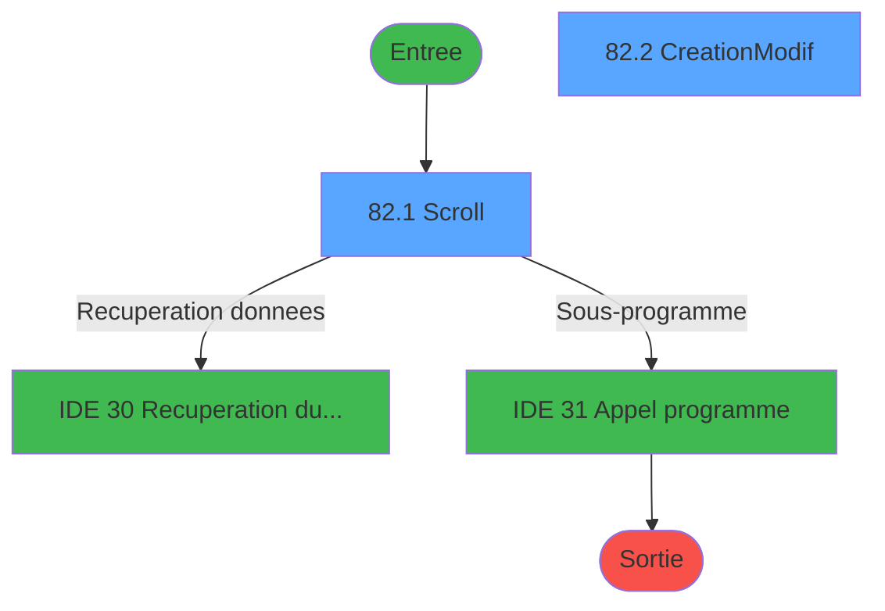
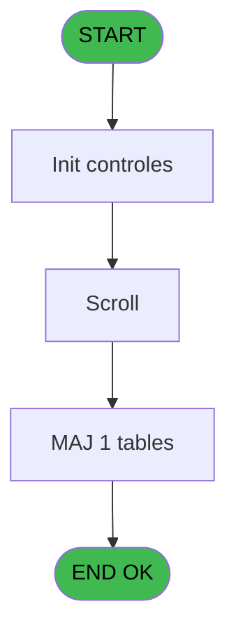
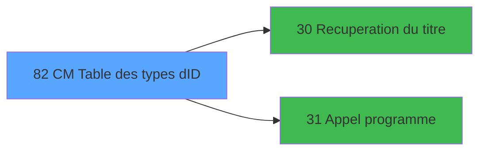

# GES IDE 82 - CM  Table des types d'ID

> **Analyse**: Phases 1-4 2026-02-03 11:43 -> 11:44 (17s) | Assemblage 11:44
> **Pipeline**: V7.2 Enrichi
> **Structure**: 4 onglets (Resume | Ecrans | Donnees | Connexions)

<!-- TAB:Resume -->

## 1. FICHE D'IDENTITE

| Attribut | Valeur |
|----------|--------|
| Projet | GES |
| IDE Position | 82 |
| Nom Programme | CM  Table des types d'ID |
| Fichier source | `Prg_82.xml` |
| Dossier IDE | Tables |
| Taches | 4 (2 ecrans visibles) |
| Tables modifiees | 1 |
| Programmes appeles | 2 |

## 2. DESCRIPTION FONCTIONNELLE

**CM  Table des types d'ID** assure la gestion complete de ce processus, accessible depuis [CM  Menu Autres tables (IDE 81)](GES-IDE-81.md).

Le flux de traitement s'organise en **2 blocs fonctionnels** :

- **Creation** (2 taches) : insertion d'enregistrements en base (mouvements, prestations)
- **Traitement** (2 taches) : traitements metier divers

**Donnees modifiees** : 1 tables en ecriture (piece_d_identite_pid).

Detail : phases du traitement

#### Phase 1 : Traitement (2 taches)

- **82** - AC  Table des types d'ID **[[ECRAN]](#ecran-t1)**
- **82.1** - Scroll **[[ECRAN]](#ecran-t2)**

Delegue a : [Recuperation du titre (IDE 30)](GES-IDE-30.md), [Appel programme (IDE 31)](GES-IDE-31.md)

#### Phase 2 : Creation (2 taches)

- **82.2** - Creation/Modif **[[ECRAN]](#ecran-t4)**
- **82.2.1** - Creation

#### Tables impactees

| Table | Operations | Role metier |
|-------|-----------|-------------|
| piece_d_identite_pid | **W** (3 usages) |  |

## 3. BLOCS FONCTIONNELS

### 3.1 Traitement (2 taches)

Traitements internes.

---

#### 82 - AC  Table des types d'ID [[ECRAN]](#ecran-t1)

**Role** : Traitement : AC  Table des types d'ID.
**Ecran** : 19 x 1 DLU (MDI) | [Voir mockup](#ecran-t1)
**Delegue a** : [Recuperation du titre (IDE 30)](GES-IDE-30.md), [Appel programme (IDE 31)](GES-IDE-31.md)

---

#### 82.1 - Scroll [[ECRAN]](#ecran-t2)

**Role** : Traitement : Scroll.
**Ecran** : 702 x 258 DLU (MDI) | [Voir mockup](#ecran-t2)
**Delegue a** : [Recuperation du titre (IDE 30)](GES-IDE-30.md), [Appel programme (IDE 31)](GES-IDE-31.md)

### 3.2 Creation (2 taches)

Insertion de nouveaux enregistrements en base.

---

#### 82.2 - Creation/Modif [[ECRAN]](#ecran-t4)

**Role** : Creation d'enregistrement : Creation/Modif.
**Ecran** : 566 x 133 DLU (MDI) | [Voir mockup](#ecran-t4)

---

#### 82.2.1 - Creation

**Role** : Creation d'enregistrement : Creation.
**Variables liees** : B (v. creation)

## 5. REGLES METIER

*(Aucune regle metier identifiee)*

## 6. CONTEXTE

- **Appele par**: [CM  Menu Autres tables (IDE 81)](GES-IDE-81.md)
- **Appelle**: 2 programmes | **Tables**: 1 (W:1 R:0 L:0) | **Taches**: 4 | **Expressions**: 4

<!-- TAB:Ecrans -->

## 8. ECRANS

### 8.1 Forms visibles (2 / 4)

| # | Position | Tache | Nom | Type | Largeur | Hauteur | Bloc |
|---|----------|-------|-----|------|---------|---------|------|
| 1 | 82.1 | 82.1 | Scroll | MDI | 702 | 258 | Traitement |
| 2 | 82.2 | 82.2 | Creation/Modif | MDI | 566 | 133 | Creation |

### 8.2 Mockups Ecrans

---

#### 82.1 - Scroll
**Tache** : [82.1](#t2) | **Type** : MDI | **Dimensions** : 702 x 258 DLU
**Bloc** : Traitement | **Titre IDE** : Scroll

<!-- FORM-DATA:
{
    "width":  702,
    "vFactor":  8,
    "type":  "MDI",
    "hFactor":  8,
    "controls":  [
                     {
                         "x":  0,
                         "type":  "label",
                         "var":  "",
                         "y":  0,
                         "w":  701,
                         "fmt":  "",
                         "name":  "",
                         "h":  19,
                         "color":  "",
                         "text":  "",
                         "parent":  null
                     },
                     {
                         "x":  50,
                         "type":  "label",
                         "var":  "",
                         "y":  25,
                         "w":  602,
                         "fmt":  "",
                         "name":  "",
                         "h":  199,
                         "color":  "",
                         "text":  "",
                         "parent":  null
                     },
                     {
                         "x":  142,
                         "type":  "table",
                         "var":  "",
                         "name":  "",
                         "titleH":  14,
                         "color":  "110",
                         "w":  417,
                         "y":  33,
                         "fmt":  "",
                         "parent":  4,
                         "text":  "",
                         "rowH":  12,
                         "h":  91,
                         "cols":  [
                                      {
                                          "title":  "Pièce d\u0027identité",
                                          "layer":  1,
                                          "w":  262
                                      },
                                      {
                                          "title":  "Code Pièce",
                                          "layer":  2,
                                          "w":  120
                                      }
                                  ],
                         "rows":  2
                     },
                     {
                         "x":  53,
                         "type":  "label",
                         "var":  "",
                         "y":  133,
                         "w":  597,
                         "fmt":  "",
                         "name":  "",
                         "h":  90,
                         "color":  "",
                         "text":  "",
                         "parent":  null
                     },
                     {
                         "x":  341,
                         "type":  "label",
                         "var":  "",
                         "y":  139,
                         "w":  290,
                         "fmt":  "",
                         "name":  "",
                         "h":  77,
                         "color":  "",
                         "text":  "",
                         "parent":  null
                     },
                     {
                         "x":  344,
                         "type":  "label",
                         "var":  "",
                         "y":  140,
                         "w":  284,
                         "fmt":  "",
                         "name":  "",
                         "h":  75,
                         "color":  "",
                         "text":  "",
                         "parent":  null
                     },
                     {
                         "x":  376,
                         "type":  "label",
                         "var":  "",
                         "y":  146,
                         "w":  220,
                         "fmt":  "",
                         "name":  "",
                         "h":  45,
                         "color":  "",
                         "text":  "",
                         "parent":  null
                     },
                     {
                         "x":  377,
                         "type":  "label",
                         "var":  "",
                         "y":  147,
                         "w":  37,
                         "fmt":  "",
                         "name":  "",
                         "h":  43,
                         "color":  "",
                         "text":  "",
                         "parent":  null
                     },
                     {
                         "x":  437,
                         "type":  "label",
                         "var":  "",
                         "y":  149,
                         "w":  131,
                         "fmt":  "",
                         "name":  "",
                         "h":  9,
                         "color":  "7",
                         "text":  "Création",
                         "parent":  null
                     },
                     {
                         "x":  437,
                         "type":  "label",
                         "var":  "",
                         "y":  163,
                         "w":  131,
                         "fmt":  "",
                         "name":  "",
                         "h":  9,
                         "color":  "7",
                         "text":  "Modification",
                         "parent":  null
                     },
                     {
                         "x":  437,
                         "type":  "label",
                         "var":  "",
                         "y":  177,
                         "w":  131,
                         "fmt":  "",
                         "name":  "",
                         "h":  9,
                         "color":  "7",
                         "text":  "Suppression",
                         "parent":  null
                     },
                     {
                         "x":  400,
                         "type":  "label",
                         "var":  "",
                         "y":  198,
                         "w":  120,
                         "fmt":  "",
                         "name":  "",
                         "h":  9,
                         "color":  "",
                         "text":  "Votre choix",
                         "parent":  null
                     },
                     {
                         "x":  0,
                         "type":  "label",
                         "var":  "",
                         "y":  233,
                         "w":  701,
                         "fmt":  "",
                         "name":  "",
                         "h":  24,
                         "color":  "",
                         "text":  "",
                         "parent":  null
                     },
                     {
                         "x":  534,
                         "type":  "edit",
                         "var":  "",
                         "y":  197,
                         "w":  26,
                         "fmt":  "",
                         "name":  "W1 choix action",
                         "h":  10,
                         "color":  "6",
                         "text":  "",
                         "parent":  null
                     },
                     {
                         "x":  461,
                         "type":  "edit",
                         "var":  "",
                         "y":  50,
                         "w":  19,
                         "fmt":  "",
                         "name":  "",
                         "h":  8,
                         "color":  "110",
                         "text":  "",
                         "parent":  5
                     },
                     {
                         "x":  162,
                         "type":  "edit",
                         "var":  "",
                         "y":  50,
                         "w":  232,
                         "fmt":  "",
                         "name":  "PID libelle",
                         "h":  8,
                         "color":  "110",
                         "text":  "",
                         "parent":  5
                     },
                     {
                         "x":  3,
                         "type":  "edit",
                         "var":  "",
                         "y":  5,
                         "w":  203,
                         "fmt":  "20",
                         "name":  "",
                         "h":  8,
                         "color":  "",
                         "text":  "",
                         "parent":  1
                     },
                     {
                         "x":  491,
                         "type":  "edit",
                         "var":  "",
                         "y":  5,
                         "w":  203,
                         "fmt":  "WWW DD MMM YYYYT",
                         "name":  "",
                         "h":  8,
                         "color":  "",
                         "text":  "",
                         "parent":  1
                     },
                     {
                         "x":  104,
                         "type":  "image",
                         "var":  "",
                         "y":  149,
                         "w":  160,
                         "fmt":  "",
                         "name":  "",
                         "h":  56,
                         "color":  "",
                         "text":  "",
                         "parent":  null
                     },
                     {
                         "x":  383,
                         "type":  "button",
                         "var":  "",
                         "y":  149,
                         "w":  26,
                         "fmt":  "C",
                         "name":  "C",
                         "h":  9,
                         "color":  "",
                         "text":  "",
                         "parent":  null
                     },
                     {
                         "x":  383,
                         "type":  "button",
                         "var":  "",
                         "y":  163,
                         "w":  26,
                         "fmt":  "M",
                         "name":  "M",
                         "h":  9,
                         "color":  "",
                         "text":  "",
                         "parent":  null
                     },
                     {
                         "x":  383,
                         "type":  "button",
                         "var":  "",
                         "y":  177,
                         "w":  26,
                         "fmt":  "S",
                         "name":  "S",
                         "h":  9,
                         "color":  "",
                         "text":  "",
                         "parent":  null
                     },
                     {
                         "x":  10,
                         "type":  "button",
                         "var":  "",
                         "y":  236,
                         "w":  154,
                         "fmt":  "\u0026Quitter",
                         "name":  "",
                         "h":  18,
                         "color":  "",
                         "text":  "",
                         "parent":  21
                     }
                 ],
    "taskId":  "82.1",
    "height":  258
}
-->

<strong>Champs : 5 champs</strong>

| Pos (x,y) | Nom | Variable | Type |
|-----------|-----|----------|------|
| 534,197 | W1 choix action | - | edit |
| 461,50 | (sans nom) | - | edit |
| 162,50 | PID libelle | - | edit |
| 3,5 | 20 | - | edit |
| 491,5 | WWW DD MMM YYYYT | - | edit |

<strong>Boutons : 4 boutons</strong>

| Bouton | Pos (x,y) | Action |
|--------|-----------|--------|
| C | 383,149 | Bouton fonctionnel |
| M | 383,163 | Bouton fonctionnel |
| S | 383,177 | Bouton fonctionnel |
| Quitter | 10,236 | Quitte le programme |

---

#### 82.2 - Creation/Modif
**Tache** : [82.2](#t4) | **Type** : MDI | **Dimensions** : 566 x 133 DLU
**Bloc** : Creation | **Titre IDE** : Creation/Modif

<!-- FORM-DATA:
{
    "width":  566,
    "vFactor":  8,
    "type":  "MDI",
    "hFactor":  8,
    "controls":  [
                     {
                         "x":  25,
                         "type":  "label",
                         "var":  "",
                         "y":  10,
                         "w":  516,
                         "fmt":  "",
                         "name":  "",
                         "h":  88,
                         "color":  "195",
                         "text":  "Création",
                         "parent":  null
                     },
                     {
                         "x":  108,
                         "type":  "label",
                         "var":  "",
                         "y":  34,
                         "w":  70,
                         "fmt":  "",
                         "name":  "",
                         "h":  10,
                         "color":  "",
                         "text":  "Classe",
                         "parent":  1
                     },
                     {
                         "x":  108,
                         "type":  "label",
                         "var":  "",
                         "y":  58,
                         "w":  105,
                         "fmt":  "",
                         "name":  "",
                         "h":  10,
                         "color":  "",
                         "text":  "Libellé",
                         "parent":  1
                     },
                     {
                         "x":  2,
                         "type":  "label",
                         "var":  "",
                         "y":  107,
                         "w":  554,
                         "fmt":  "",
                         "name":  "",
                         "h":  24,
                         "color":  "",
                         "text":  "",
                         "parent":  null
                     },
                     {
                         "x":  220,
                         "type":  "edit",
                         "var":  "",
                         "y":  34,
                         "w":  26,
                         "fmt":  "",
                         "name":  "W1 code",
                         "h":  10,
                         "color":  "6",
                         "text":  "",
                         "parent":  1
                     },
                     {
                         "x":  220,
                         "type":  "edit",
                         "var":  "",
                         "y":  58,
                         "w":  238,
                         "fmt":  "",
                         "name":  "W1 libelle20",
                         "h":  10,
                         "color":  "6",
                         "text":  "",
                         "parent":  1
                     },
                     {
                         "x":  9,
                         "type":  "button",
                         "var":  "",
                         "y":  110,
                         "w":  154,
                         "fmt":  "\u0026Ok",
                         "name":  "Bouton Ok",
                         "h":  18,
                         "color":  "",
                         "text":  "",
                         "parent":  7
                     },
                     {
                         "x":  178,
                         "type":  "button",
                         "var":  "",
                         "y":  110,
                         "w":  154,
                         "fmt":  "\u0026Abandonner",
                         "name":  "",
                         "h":  18,
                         "color":  "",
                         "text":  "",
                         "parent":  null
                     }
                 ],
    "taskId":  "82.2",
    "height":  133
}
-->

<strong>Champs : 2 champs</strong>

| Pos (x,y) | Nom | Variable | Type |
|-----------|-----|----------|------|
| 220,34 | W1 code | - | edit |
| 220,58 | W1 libelle20 | - | edit |

<strong>Boutons : 2 boutons</strong>

| Bouton | Pos (x,y) | Action |
|--------|-----------|--------|
| Ok | 9,110 | Valide la saisie et enregistre |
| Abandonner | 178,110 | Annule et retour au menu |

## 9. NAVIGATION

### 9.1 Enchainement des ecrans

**Detail par enchainement :**

| Depuis | Action | Vers | Retour |
|--------|--------|------|--------|
| Scroll | Recuperation donnees | [Recuperation du titre (IDE 30)](GES-IDE-30.md) | Retour ecran |
| Scroll | Sous-programme | [Appel programme (IDE 31)](GES-IDE-31.md) | Retour ecran |

### 9.3 Structure hierarchique (4 taches)

| Position | Tache | Type | Dimensions | Bloc |
|----------|-------|------|------------|------|
| **82.1** | [**AC  Table des types d'ID** (82)](#t1) [mockup](#ecran-t1) | MDI | 19x1 | Traitement |
| 82.1.1 | [Scroll (82.1)](#t2) [mockup](#ecran-t2) | MDI | 702x258 | |
| **82.2** | [**Creation/Modif** (82.2)](#t4) [mockup](#ecran-t4) | MDI | 566x133 | Creation |
| 82.2.1 | [Creation (82.2.1)](#t5) | MDI | - | |

### 9.4 Algorigramme

> **Legende**: Vert = START/END OK | Rouge = END KO | Bleu = Decisions
> *Algorigramme auto-genere. Utiliser `/algorigramme` pour une synthese metier detaillee.*

<!-- TAB:Donnees -->

## 10. TABLES

### Tables utilisees (1)

| ID | Nom | Description | Type | R | W | L | Usages |
|----|-----|-------------|------|---|---|---|--------|
| 98 | piece_d_identite_pid |  | DB |   | **W** |   | 3 |

### Colonnes par table (1 / 1 tables avec colonnes identifiees)

Table 98 - piece_d_identite_pid (**W**) - 3 usages

| Lettre | Variable | Acces | Type |
|--------|----------|-------|------|
| A | v. passage | W | Logical |
| B | W1 choix action | W | Alpha |
| C | W1 fin tâche | W | Alpha |
| D | v. titre | W | Alpha |
| E | v. titre | W | Alpha |

## 11. VARIABLES

### 11.1 Parametres entrants (1)

Variables recues du programme appelant ([CM  Menu Autres tables (IDE 81)](GES-IDE-81.md)).

| Lettre | Nom | Type | Usage dans |
|--------|-----|------|-----------|
| A | P0 societe | Alpha | - |

### 11.2 Variables de session (1)

Variables persistantes pendant toute la session.

| Lettre | Nom | Type | Usage dans |
|--------|-----|------|-----------|
| B | v. creation | Logical | [82.2](#t4), [82.2.1](#t5) |

### 11.3 Variables de travail (2)

Variables internes au programme.

| Lettre | Nom | Type | Usage dans |
|--------|-----|------|-----------|
| C | W0 choix action | Alpha | 2x calcul interne |
| D | W0 code alpha | Alpha | - |

### 11.4 Autres (1)

Variables diverses.

| Lettre | Nom | Type | Usage dans |
|--------|-----|------|-----------|
| E | W1 choix confirmation | Numeric | - |

## 12. EXPRESSIONS

**4 / 4 expressions decodees (100%)**

### 12.1 Repartition par type

| Type | Expressions | Regles |
|------|-------------|--------|
| CONSTANTE | 1 | 0 |
| OTHER | 1 | 0 |
| CONDITION | 2 | 0 |

### 12.2 Expressions cles par type

#### CONSTANTE (1 expressions)

| Type | IDE | Expression | Regle |
|------|-----|------------|-------|
| CONSTANTE | 3 | `'C'` | - |

#### OTHER (1 expressions)

| Type | IDE | Expression | Regle |
|------|-----|------------|-------|
| OTHER | 1 | `v. creation [B]` | - |

#### CONDITION (2 expressions)

| Type | IDE | Expression | Regle |
|------|-----|------------|-------|
| CONDITION | 4 | `W0 choix action [C]='F' OR W0 choix action [C]=''` | - |
| CONDITION | 2 | `W0 choix action [C]='C'` | - |

<!-- TAB:Connexions -->

## 13. GRAPHE D'APPELS

### 13.1 Chaine depuis Main (Callers)

Main -> ... -> [CM  Menu Autres tables (IDE 81)](GES-IDE-81.md) -> **CM  Table des types d'ID (IDE 82)**

### 13.2 Callers

| IDE | Nom Programme | Nb Appels |
|-----|---------------|-----------|
| [81](GES-IDE-81.md) | CM  Menu Autres tables | 1 |

### 13.3 Callees (programmes appeles)

### 13.4 Detail Callees avec contexte

| IDE | Nom Programme | Appels | Contexte |
|-----|---------------|--------|----------|
| [30](GES-IDE-30.md) | Recuperation du titre | 2 | Recuperation donnees |
| [31](GES-IDE-31.md) | Appel programme | 1 | Sous-programme |

## 14. RECOMMANDATIONS MIGRATION

### 14.1 Profil du programme

| Metrique | Valeur | Impact migration |
|----------|--------|-----------------|
| Lignes de logique | 79 | Programme compact |
| Expressions | 4 | Peu de logique |
| Tables WRITE | 1 | Impact faible |
| Sous-programmes | 2 | Peu de dependances |
| Ecrans visibles | 2 | Quelques ecrans |
| Code desactive | 0% (0 / 79) | Code sain |
| Regles metier | 0 | Pas de regle identifiee |

### 14.2 Plan de migration par bloc

#### Traitement (2 taches: 2 ecrans, 0 traitement)

- **Strategie** : 2 composant(s) UI (Razor/React) avec formulaires et validation.
- 2 sous-programme(s) a migrer ou a reutiliser depuis les services existants.
- Decomposer les taches en services unitaires testables.

#### Creation (2 taches: 1 ecran, 1 traitement)

- **Strategie** : Repository pattern avec Entity Framework Core.
- Insertion via `IRepository<T>.CreateAsync()`

### 14.3 Dependances critiques

| Dependance | Type | Appels | Impact |
|------------|------|--------|--------|
| piece_d_identite_pid | Table WRITE (Database) | 3x | Schema + repository |
| [Recuperation du titre (IDE 30)](GES-IDE-30.md) | Sous-programme | 2x | Haute - Recuperation donnees |
| [Appel programme (IDE 31)](GES-IDE-31.md) | Sous-programme | 1x | Normale - Sous-programme |

---
*Spec DETAILED generee par Pipeline V7.2 - 2026-02-03 11:44*
