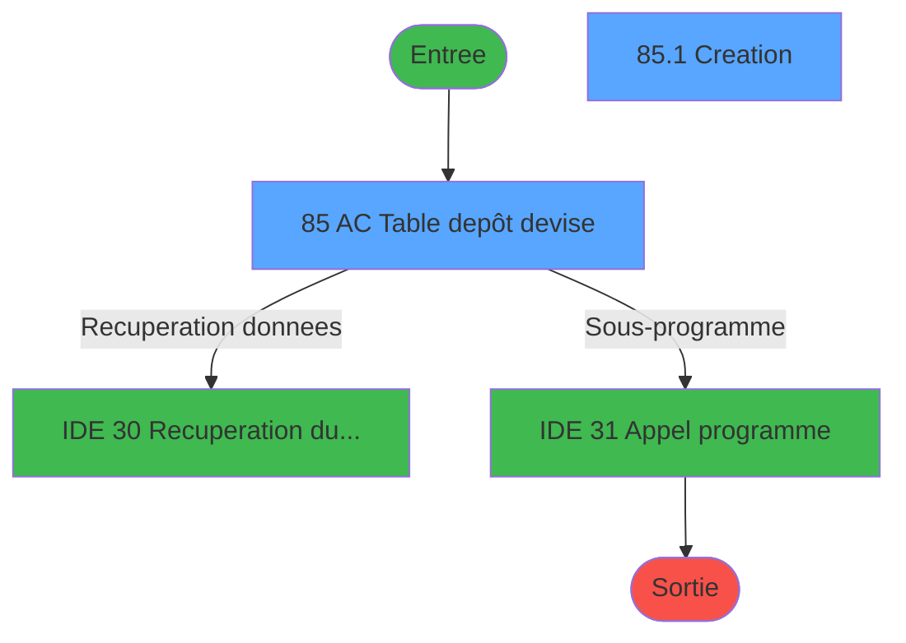
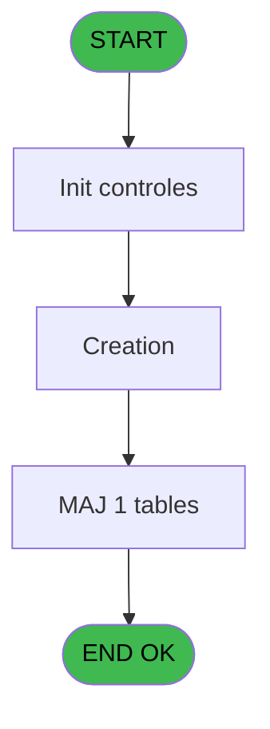
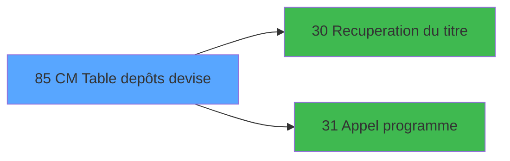

# GES IDE 85 - CM  Table depôts devise

> **Analyse**: Phases 1-4 2026-02-03 11:45 -> 11:45 (15s) | Assemblage 11:45
> **Pipeline**: V7.2 Enrichi
> **Structure**: 4 onglets (Resume | Ecrans | Donnees | Connexions)

<!-- TAB:Resume -->

## 1. FICHE D'IDENTITE

| Attribut | Valeur |
|----------|--------|
| Projet | GES |
| IDE Position | 85 |
| Nom Programme | CM  Table depôts devise |
| Fichier source | `Prg_85.xml` |
| Dossier IDE | Tables |
| Taches | 2 (2 ecrans visibles) |
| Tables modifiees | 1 |
| Programmes appeles | 2 |

## 2. DESCRIPTION FONCTIONNELLE

**CM  Table depôts devise** assure la gestion complete de ce processus, accessible depuis [CM  Menu Autres tables (IDE 81)](GES-IDE-81.md).

Le flux de traitement s'organise en **2 blocs fonctionnels** :

- **Creation** (1 tache) : insertion d'enregistrements en base (mouvements, prestations)
- **Traitement** (1 tache) : traitements metier divers

**Donnees modifiees** : 1 tables en ecriture (depot_devise_____ddv).

Detail : phases du traitement

#### Phase 1 : Traitement (1 tache)

- **85** - AC  Table depôt devise **[[ECRAN]](#ecran-t1)**

Delegue a : [Recuperation du titre (IDE 30)](GES-IDE-30.md), [Appel programme (IDE 31)](GES-IDE-31.md)

#### Phase 2 : Creation (1 tache)

- **85.1** - Creation **[[ECRAN]](#ecran-t2)**

#### Tables impactees

| Table | Operations | Role metier |
|-------|-----------|-------------|
| depot_devise_____ddv | **W** (2 usages) | Depots et garanties |

## 3. BLOCS FONCTIONNELS

### 3.1 Traitement (1 tache)

Traitements internes.

---

#### 85 - AC  Table depôt devise [[ECRAN]](#ecran-t1)

**Role** : Traitement : AC  Table depôt devise.
**Ecran** : 685 x 255 DLU (MDI) | [Voir mockup](#ecran-t1)
**Delegue a** : [Recuperation du titre (IDE 30)](GES-IDE-30.md), [Appel programme (IDE 31)](GES-IDE-31.md)

### 3.2 Creation (1 tache)

Insertion de nouveaux enregistrements en base.

---

#### 85.1 - Creation [[ECRAN]](#ecran-t2)

**Role** : Creation d'enregistrement : Creation.
**Ecran** : 395 x 81 DLU (MDI) | [Voir mockup](#ecran-t2)

## 5. REGLES METIER

*(Aucune regle metier identifiee)*

## 6. CONTEXTE

- **Appele par**: [CM  Menu Autres tables (IDE 81)](GES-IDE-81.md)
- **Appelle**: 2 programmes | **Tables**: 1 (W:1 R:0 L:0) | **Taches**: 2 | **Expressions**: 15

<!-- TAB:Ecrans -->

## 8. ECRANS

### 8.1 Forms visibles (2 / 2)

| # | Position | Tache | Nom | Type | Largeur | Hauteur | Bloc |
|---|----------|-------|-----|------|---------|---------|------|
| 1 | 85 | 85 | AC  Table depôt devise | MDI | 685 | 255 | Traitement |
| 2 | 85.1 | 85.1 | Creation | MDI | 395 | 81 | Creation |

### 8.2 Mockups Ecrans

---

#### 85 - AC  Table depôt devise
**Tache** : [85](#t1) | **Type** : MDI | **Dimensions** : 685 x 255 DLU
**Bloc** : Traitement | **Titre IDE** : AC  Table depôt devise

<!-- FORM-DATA:
{
    "width":  685,
    "vFactor":  8,
    "type":  "MDI",
    "hFactor":  8,
    "controls":  [
                     {
                         "x":  2,
                         "type":  "label",
                         "var":  "",
                         "y":  1,
                         "w":  678,
                         "fmt":  "",
                         "name":  "",
                         "h":  19,
                         "color":  "",
                         "text":  "",
                         "parent":  null
                     },
                     {
                         "x":  37,
                         "type":  "label",
                         "var":  "",
                         "y":  28,
                         "w":  607,
                         "fmt":  "",
                         "name":  "",
                         "h":  194,
                         "color":  "",
                         "text":  "",
                         "parent":  null
                     },
                     {
                         "x":  109,
                         "type":  "table",
                         "var":  "",
                         "name":  "",
                         "titleH":  12,
                         "color":  "110",
                         "w":  462,
                         "y":  35,
                         "fmt":  "",
                         "parent":  null,
                         "text":  "",
                         "rowH":  12,
                         "h":  89,
                         "cols":  [
                                      {
                                          "title":  "Moyen de Paiement",
                                          "layer":  1,
                                          "w":  166
                                      },
                                      {
                                          "title":  "Libellé",
                                          "layer":  2,
                                          "w":  261
                                      }
                                  ],
                         "rows":  2
                     },
                     {
                         "x":  38,
                         "type":  "label",
                         "var":  "",
                         "y":  130,
                         "w":  605,
                         "fmt":  "",
                         "name":  "",
                         "h":  91,
                         "color":  "",
                         "text":  "",
                         "parent":  null
                     },
                     {
                         "x":  334,
                         "type":  "label",
                         "var":  "",
                         "y":  137,
                         "w":  290,
                         "fmt":  "",
                         "name":  "",
                         "h":  77,
                         "color":  "",
                         "text":  "",
                         "parent":  null
                     },
                     {
                         "x":  337,
                         "type":  "label",
                         "var":  "",
                         "y":  138,
                         "w":  284,
                         "fmt":  "",
                         "name":  "",
                         "h":  75,
                         "color":  "",
                         "text":  "",
                         "parent":  null
                     },
                     {
                         "x":  367,
                         "type":  "label",
                         "var":  "",
                         "y":  147,
                         "w":  222,
                         "fmt":  "",
                         "name":  "",
                         "h":  46,
                         "color":  "",
                         "text":  "",
                         "parent":  null
                     },
                     {
                         "x":  370,
                         "type":  "label",
                         "var":  "",
                         "y":  148,
                         "w":  37,
                         "fmt":  "",
                         "name":  "",
                         "h":  44,
                         "color":  "",
                         "text":  "",
                         "parent":  null
                     },
                     {
                         "x":  421,
                         "type":  "label",
                         "var":  "",
                         "y":  152,
                         "w":  131,
                         "fmt":  "",
                         "name":  "",
                         "h":  9,
                         "color":  "7",
                         "text":  "Modification",
                         "parent":  null
                     },
                     {
                         "x":  421,
                         "type":  "label",
                         "var":  "",
                         "y":  164,
                         "w":  131,
                         "fmt":  "",
                         "name":  "",
                         "h":  9,
                         "color":  "7",
                         "text":  "Création",
                         "parent":  null
                     },
                     {
                         "x":  421,
                         "type":  "label",
                         "var":  "",
                         "y":  176,
                         "w":  131,
                         "fmt":  "",
                         "name":  "",
                         "h":  9,
                         "color":  "7",
                         "text":  "Suppression",
                         "parent":  null
                     },
                     {
                         "x":  393,
                         "type":  "label",
                         "var":  "",
                         "y":  198,
                         "w":  120,
                         "fmt":  "",
                         "name":  "",
                         "h":  9,
                         "color":  "",
                         "text":  "Votre choix",
                         "parent":  null
                     },
                     {
                         "x":  2,
                         "type":  "label",
                         "var":  "",
                         "y":  228,
                         "w":  680,
                         "fmt":  "",
                         "name":  "",
                         "h":  24,
                         "color":  "",
                         "text":  "",
                         "parent":  null
                     },
                     {
                         "x":  515,
                         "type":  "edit",
                         "var":  "",
                         "y":  197,
                         "w":  26,
                         "fmt":  "",
                         "name":  "V0 choix select",
                         "h":  10,
                         "color":  "6",
                         "text":  "",
                         "parent":  null
                     },
                     {
                         "x":  147,
                         "type":  "edit",
                         "var":  "",
                         "y":  50,
                         "w":  64,
                         "fmt":  "",
                         "name":  "",
                         "h":  8,
                         "color":  "110",
                         "text":  "",
                         "parent":  5
                     },
                     {
                         "x":  291,
                         "type":  "edit",
                         "var":  "",
                         "y":  50,
                         "w":  232,
                         "fmt":  "",
                         "name":  "DDV libelle",
                         "h":  8,
                         "color":  "110",
                         "text":  "",
                         "parent":  5
                     },
                     {
                         "x":  8,
                         "type":  "edit",
                         "var":  "",
                         "y":  7,
                         "w":  267,
                         "fmt":  "20",
                         "name":  "",
                         "h":  8,
                         "color":  "",
                         "text":  "",
                         "parent":  1
                     },
                     {
                         "x":  471,
                         "type":  "edit",
                         "var":  "",
                         "y":  7,
                         "w":  203,
                         "fmt":  "WWW DD MMM YYYYT",
                         "name":  "",
                         "h":  8,
                         "color":  "",
                         "text":  "",
                         "parent":  1
                     },
                     {
                         "x":  91,
                         "type":  "image",
                         "var":  "",
                         "y":  150,
                         "w":  160,
                         "fmt":  "",
                         "name":  "",
                         "h":  56,
                         "color":  "",
                         "text":  "",
                         "parent":  null
                     },
                     {
                         "x":  374,
                         "type":  "button",
                         "var":  "",
                         "y":  152,
                         "w":  27,
                         "fmt":  "M",
                         "name":  "M",
                         "h":  9,
                         "color":  "",
                         "text":  "",
                         "parent":  null
                     },
                     {
                         "x":  374,
                         "type":  "button",
                         "var":  "",
                         "y":  164,
                         "w":  27,
                         "fmt":  "C",
                         "name":  "C",
                         "h":  9,
                         "color":  "",
                         "text":  "",
                         "parent":  null
                     },
                     {
                         "x":  374,
                         "type":  "button",
                         "var":  "",
                         "y":  176,
                         "w":  27,
                         "fmt":  "S",
                         "name":  "S",
                         "h":  9,
                         "color":  "",
                         "text":  "",
                         "parent":  null
                     },
                     {
                         "x":  6,
                         "type":  "button",
                         "var":  "",
                         "y":  231,
                         "w":  154,
                         "fmt":  "\u0026Quitter",
                         "name":  "Q",
                         "h":  18,
                         "color":  "",
                         "text":  "",
                         "parent":  21
                     }
                 ],
    "taskId":  "85",
    "height":  255
}
-->

<strong>Champs : 5 champs</strong>

| Pos (x,y) | Nom | Variable | Type |
|-----------|-----|----------|------|
| 515,197 | V0 choix select | - | edit |
| 147,50 | (sans nom) | - | edit |
| 291,50 | DDV libelle | - | edit |
| 8,7 | 20 | - | edit |
| 471,7 | WWW DD MMM YYYYT | - | edit |

<strong>Boutons : 4 boutons</strong>

| Bouton | Pos (x,y) | Action |
|--------|-----------|--------|
| M | 374,152 | Bouton fonctionnel |
| C | 374,164 | Bouton fonctionnel |
| S | 374,176 | Bouton fonctionnel |
| Quitter | 6,231 | Quitte le programme |

---

#### 85.1 - Creation
**Tache** : [85.1](#t2) | **Type** : MDI | **Dimensions** : 395 x 81 DLU
**Bloc** : Creation | **Titre IDE** : Creation

<!-- FORM-DATA:
{
    "width":  395,
    "vFactor":  8,
    "type":  "MDI",
    "hFactor":  8,
    "controls":  [
                     {
                         "x":  42,
                         "type":  "label",
                         "var":  "",
                         "y":  13,
                         "w":  58,
                         "fmt":  "",
                         "name":  "",
                         "h":  8,
                         "color":  "",
                         "text":  "Code",
                         "parent":  null
                     },
                     {
                         "x":  42,
                         "type":  "label",
                         "var":  "",
                         "y":  29,
                         "w":  70,
                         "fmt":  "",
                         "name":  "",
                         "h":  10,
                         "color":  "",
                         "text":  "Libellé",
                         "parent":  null
                     },
                     {
                         "x":  0,
                         "type":  "label",
                         "var":  "",
                         "y":  57,
                         "w":  394,
                         "fmt":  "",
                         "name":  "",
                         "h":  24,
                         "color":  "",
                         "text":  "",
                         "parent":  null
                     },
                     {
                         "x":  120,
                         "type":  "edit",
                         "var":  "",
                         "y":  12,
                         "w":  70,
                         "fmt":  "",
                         "name":  "DDV moyen paiement",
                         "h":  10,
                         "color":  "6",
                         "text":  "",
                         "parent":  null
                     },
                     {
                         "x":  120,
                         "type":  "edit",
                         "var":  "",
                         "y":  29,
                         "w":  238,
                         "fmt":  "",
                         "name":  "DDV libelle",
                         "h":  10,
                         "color":  "6",
                         "text":  "",
                         "parent":  null
                     },
                     {
                         "x":  7,
                         "type":  "button",
                         "var":  "",
                         "y":  60,
                         "w":  154,
                         "fmt":  "\u0026Ok",
                         "name":  "Bouton Ok",
                         "h":  18,
                         "color":  "",
                         "text":  "",
                         "parent":  5
                     },
                     {
                         "x":  171,
                         "type":  "button",
                         "var":  "",
                         "y":  60,
                         "w":  154,
                         "fmt":  "A\u0026bandon",
                         "name":  "",
                         "h":  18,
                         "color":  "",
                         "text":  "",
                         "parent":  null
                     }
                 ],
    "taskId":  "85.1",
    "height":  81
}
-->

<strong>Champs : 2 champs</strong>

| Pos (x,y) | Nom | Variable | Type |
|-----------|-----|----------|------|
| 120,12 | DDV moyen paiement | - | edit |
| 120,29 | DDV libelle | - | edit |

<strong>Boutons : 2 boutons</strong>

| Bouton | Pos (x,y) | Action |
|--------|-----------|--------|
| Ok | 7,60 | Valide la saisie et enregistre |
| Abandon | 171,60 | Annule et retour au menu |

## 9. NAVIGATION

### 9.1 Enchainement des ecrans

**Detail par enchainement :**

| Depuis | Action | Vers | Retour |
|--------|--------|------|--------|
| AC  Table depôt devise | Recuperation donnees | [Recuperation du titre (IDE 30)](GES-IDE-30.md) | Retour ecran |
| AC  Table depôt devise | Sous-programme | [Appel programme (IDE 31)](GES-IDE-31.md) | Retour ecran |

### 9.3 Structure hierarchique (2 taches)

| Position | Tache | Type | Dimensions | Bloc |
|----------|-------|------|------------|------|
| **85.1** | [**AC  Table depôt devise** (85)](#t1) [mockup](#ecran-t1) | MDI | 685x255 | Traitement |
| **85.2** | [**Creation** (85.1)](#t2) [mockup](#ecran-t2) | MDI | 395x81 | Creation |

### 9.4 Algorigramme

> **Legende**: Vert = START/END OK | Rouge = END KO | Bleu = Decisions
> *Algorigramme auto-genere. Utiliser `/algorigramme` pour une synthese metier detaillee.*

<!-- TAB:Donnees -->

## 10. TABLES

### Tables utilisees (1)

| ID | Nom | Description | Type | R | W | L | Usages |
|----|-----|-------------|------|---|---|---|--------|
| 100 | depot_devise_____ddv | Depots et garanties | DB |   | **W** |   | 2 |

### Colonnes par table (1 / 1 tables avec colonnes identifiees)

Table 100 - depot_devise_____ddv (**W**) - 2 usages

| Lettre | Variable | Acces | Type |
|--------|----------|-------|------|
| A | > societe | W | Alpha |
| B | V0 choix select | W | Alpha |
| C | W0 memory-ligne | W | Alpha |
| D | W0 choix confirmation suppr | W | Numeric |
| E | v. titre | W | Alpha |

## 11. VARIABLES

### 11.1 Variables de session (1)

Variables persistantes pendant toute la session.

| Lettre | Nom | Type | Usage dans |
|--------|-----|------|-----------|
| E | v. titre | Alpha | - |

### 11.2 Variables de travail (2)

Variables internes au programme.

| Lettre | Nom | Type | Usage dans |
|--------|-----|------|-----------|
| C | W0 memory-ligne | Alpha | - |
| D | W0 choix confirmation suppr | Numeric | - |

### 11.3 Autres (2)

Variables diverses.

| Lettre | Nom | Type | Usage dans |
|--------|-----|------|-----------|
| A | > societe | Alpha | 2x refs |
| B | V0 choix select | Alpha | 5x refs |

## 12. EXPRESSIONS

**15 / 15 expressions decodees (100%)**

### 12.1 Repartition par type

| Type | Expressions | Regles |
|------|-------------|--------|
| CONSTANTE | 4 | 0 |
| DATE | 1 | 0 |
| CONDITION | 8 | 0 |
| REFERENCE_VG | 1 | 0 |
| STRING | 1 | 0 |

### 12.2 Expressions cles par type

#### CONSTANTE (4 expressions)

| Type | IDE | Expression | Regle |
|------|-----|------------|-------|
| CONSTANTE | 12 | `''` | - |
| CONSTANTE | 13 | `'S'` | - |
| CONSTANTE | 3 | `18` | - |
| CONSTANTE | 6 | `'C'` | - |

#### DATE (1 expressions)

| Type | IDE | Expression | Regle |
|------|-----|------------|-------|
| DATE | 4 | `Date ()` | - |

#### CONDITION (8 expressions)

| Type | IDE | Expression | Regle |
|------|-----|------------|-------|
| CONDITION | 10 | `V0 choix select [B]='S' AND [G]='O'` | - |
| CONDITION | 9 | `V0 choix select [B]='S' AND [G]<>'O'` | - |
| CONDITION | 14 | `[R]=6` | - |
| CONDITION | 11 | `V0 choix select [B]='M' AND [G]='O'` | - |
| CONDITION | 2 | `> societe [A]=''` | - |
| ... | | *+3 autres* | |

#### REFERENCE_VG (1 expressions)

| Type | IDE | Expression | Regle |
|------|-----|------------|-------|
| REFERENCE_VG | 5 | `VG2` | - |

#### STRING (1 expressions)

| Type | IDE | Expression | Regle |
|------|-----|------------|-------|
| STRING | 15 | `Trim ([H])` | - |

<!-- TAB:Connexions -->

## 13. GRAPHE D'APPELS

### 13.1 Chaine depuis Main (Callers)

Main -> ... -> [CM  Menu Autres tables (IDE 81)](GES-IDE-81.md) -> **CM  Table depôts devise (IDE 85)**

### 13.2 Callers

| IDE | Nom Programme | Nb Appels |
|-----|---------------|-----------|
| [81](GES-IDE-81.md) | CM  Menu Autres tables | 1 |

### 13.3 Callees (programmes appeles)

### 13.4 Detail Callees avec contexte

| IDE | Nom Programme | Appels | Contexte |
|-----|---------------|--------|----------|
| [30](GES-IDE-30.md) | Recuperation du titre | 2 | Recuperation donnees |
| [31](GES-IDE-31.md) | Appel programme | 1 | Sous-programme |

## 14. RECOMMANDATIONS MIGRATION

### 14.1 Profil du programme

| Metrique | Valeur | Impact migration |
|----------|--------|-----------------|
| Lignes de logique | 49 | Programme compact |
| Expressions | 15 | Peu de logique |
| Tables WRITE | 1 | Impact faible |
| Sous-programmes | 2 | Peu de dependances |
| Ecrans visibles | 2 | Quelques ecrans |
| Code desactive | 0% (0 / 49) | Code sain |
| Regles metier | 0 | Pas de regle identifiee |

### 14.2 Plan de migration par bloc

#### Traitement (1 tache: 1 ecran, 0 traitement)

- **Strategie** : 1 composant(s) UI (Razor/React) avec formulaires et validation.
- 2 sous-programme(s) a migrer ou a reutiliser depuis les services existants.
- Decomposer les taches en services unitaires testables.

#### Creation (1 tache: 1 ecran, 0 traitement)

- **Strategie** : Repository pattern avec Entity Framework Core.
- Insertion via `IRepository<T>.CreateAsync()`

### 14.3 Dependances critiques

| Dependance | Type | Appels | Impact |
|------------|------|--------|--------|
| depot_devise_____ddv | Table WRITE (Database) | 2x | Schema + repository |
| [Recuperation du titre (IDE 30)](GES-IDE-30.md) | Sous-programme | 2x | Haute - Recuperation donnees |
| [Appel programme (IDE 31)](GES-IDE-31.md) | Sous-programme | 1x | Normale - Sous-programme |

---
*Spec DETAILED generee par Pipeline V7.2 - 2026-02-03 11:45*
