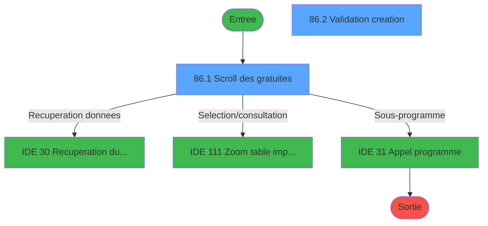
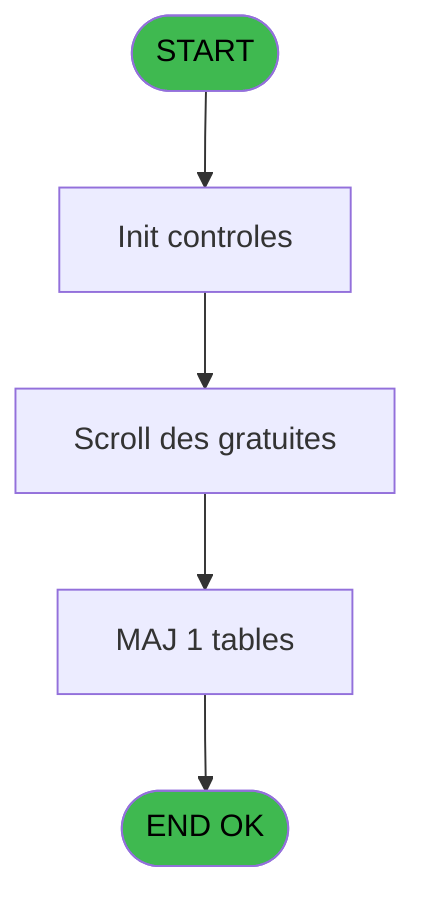
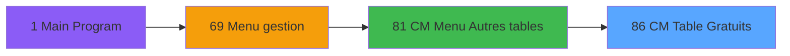
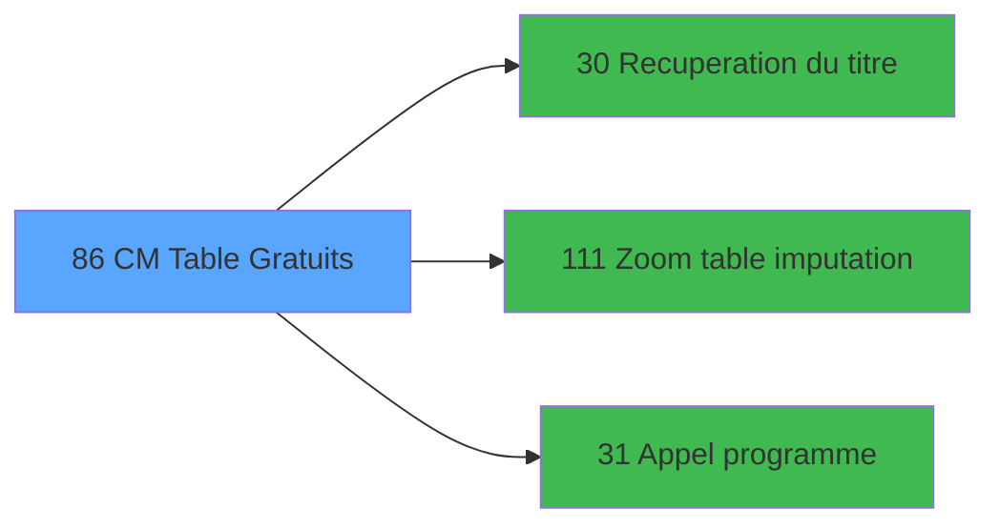

# GES IDE 86 - CM  Table Gratuits

> **Analyse**: Phases 1-4 2026-02-03 11:45 -> 11:45 (16s) | Assemblage 11:45
> **Pipeline**: V7.2 Enrichi
> **Structure**: 4 onglets (Resume | Ecrans | Donnees | Connexions)

<!-- TAB:Resume -->

## 1. FICHE D'IDENTITE

| Attribut | Valeur |
|----------|--------|
| Projet | GES |
| IDE Position | 86 |
| Nom Programme | CM  Table Gratuits |
| Fichier source | `Prg_86.xml` |
| Dossier IDE | Tables |
| Taches | 5 (2 ecrans visibles) |
| Tables modifiees | 1 |
| Programmes appeles | 3 |

## 2. DESCRIPTION FONCTIONNELLE

**CM  Table Gratuits** assure la gestion complete de ce processus, accessible depuis [CM  Menu Autres tables (IDE 81)](GES-IDE-81.md).

Le flux de traitement s'organise en **3 blocs fonctionnels** :

- **Creation** (2 taches) : insertion d'enregistrements en base (mouvements, prestations)
- **Traitement** (2 taches) : traitements metier divers
- **Validation** (1 tache) : controles et verifications de coherence

**Donnees modifiees** : 1 tables en ecriture (tables_gratuites_tgr).

Detail : phases du traitement

#### Phase 1 : Traitement (2 taches)

- **86** - CM  Table gratuites **[[ECRAN]](#ecran-t1)**
- **86.1** - Scroll des gratuites **[[ECRAN]](#ecran-t2)**

Delegue a : [Recuperation du titre (IDE 30)](GES-IDE-30.md), [Appel programme (IDE 31)](GES-IDE-31.md)

#### Phase 2 : Validation (1 tache)

- **86.2** - Validation creation **[[ECRAN]](#ecran-t3)**

#### Phase 3 : Creation (2 taches)

- **86.2.1** - Creation gratuite
- **86.3** - Creation gratuite

#### Tables impactees

| Table | Operations | Role metier |
|-------|-----------|-------------|
| tables_gratuites_tgr | R/**W** (3 usages) |  |

## 3. BLOCS FONCTIONNELS

### 3.1 Traitement (2 taches)

Traitements internes.

---

#### 86 - CM  Table gratuites [[ECRAN]](#ecran-t1)

**Role** : Traitement : CM  Table gratuites.
**Ecran** : 2 x 1 DLU (MDI) | [Voir mockup](#ecran-t1)
**Delegue a** : [Recuperation du titre (IDE 30)](GES-IDE-30.md), [Appel programme (IDE 31)](GES-IDE-31.md)

---

#### 86.1 - Scroll des gratuites [[ECRAN]](#ecran-t2)

**Role** : Traitement : Scroll des gratuites.
**Ecran** : 682 x 253 DLU (MDI) | [Voir mockup](#ecran-t2)
**Variables liees** : F (W0 scroll vide)
**Delegue a** : [Recuperation du titre (IDE 30)](GES-IDE-30.md), [Appel programme (IDE 31)](GES-IDE-31.md)

### 3.2 Validation (1 tache)

Controles de coherence : 1 tache verifie les donnees et conditions.

---

#### 86.2 - Validation creation [[ECRAN]](#ecran-t3)

**Role** : Verification : Validation creation.
**Ecran** : 461 x 114 DLU (MDI) | [Voir mockup](#ecran-t3)

### 3.3 Creation (2 taches)

Insertion de nouveaux enregistrements en base.

---

#### 86.2.1 - Creation gratuite

**Role** : Creation d'enregistrement : Creation gratuite.

---

#### 86.3 - Creation gratuite

**Role** : Creation d'enregistrement : Creation gratuite.

## 5. REGLES METIER

*(Aucune regle metier identifiee)*

## 6. CONTEXTE

- **Appele par**: [CM  Menu Autres tables (IDE 81)](GES-IDE-81.md)
- **Appelle**: 3 programmes | **Tables**: 1 (W:1 R:1 L:0) | **Taches**: 5 | **Expressions**: 8

<!-- TAB:Ecrans -->

## 8. ECRANS

### 8.1 Forms visibles (2 / 5)

| # | Position | Tache | Nom | Type | Largeur | Hauteur | Bloc |
|---|----------|-------|-----|------|---------|---------|------|
| 1 | 86.1 | 86.1 | Scroll des gratuites | MDI | 682 | 253 | Traitement |
| 2 | 86.2 | 86.2 | Validation creation | MDI | 461 | 114 | Validation |

### 8.2 Mockups Ecrans

---

#### 86.1 - Scroll des gratuites
**Tache** : [86.1](#t2) | **Type** : MDI | **Dimensions** : 682 x 253 DLU
**Bloc** : Traitement | **Titre IDE** : Scroll des gratuites

<!-- FORM-DATA:
{
    "width":  682,
    "vFactor":  8,
    "type":  "MDI",
    "hFactor":  8,
    "controls":  [
                     {
                         "x":  2,
                         "type":  "label",
                         "var":  "",
                         "y":  1,
                         "w":  678,
                         "fmt":  "",
                         "name":  "",
                         "h":  19,
                         "color":  "",
                         "text":  "",
                         "parent":  null
                     },
                     {
                         "x":  35,
                         "type":  "label",
                         "var":  "",
                         "y":  26,
                         "w":  610,
                         "fmt":  "",
                         "name":  "",
                         "h":  196,
                         "color":  "",
                         "text":  "",
                         "parent":  null
                     },
                     {
                         "x":  64,
                         "type":  "table",
                         "var":  "",
                         "name":  "",
                         "titleH":  12,
                         "color":  "110",
                         "w":  552,
                         "y":  34,
                         "fmt":  "",
                         "parent":  null,
                         "text":  "",
                         "rowH":  12,
                         "h":  91,
                         "cols":  [
                                      {
                                          "title":  "Service",
                                          "layer":  1,
                                          "w":  80
                                      },
                                      {
                                          "title":  "Imputation",
                                          "layer":  2,
                                          "w":  230
                                      },
                                      {
                                          "title":  "Libellé",
                                          "layer":  3,
                                          "w":  206
                                      }
                                  ],
                         "rows":  3
                     },
                     {
                         "x":  38,
                         "type":  "label",
                         "var":  "",
                         "y":  131,
                         "w":  605,
                         "fmt":  "",
                         "name":  "",
                         "h":  90,
                         "color":  "",
                         "text":  "",
                         "parent":  null
                     },
                     {
                         "x":  334,
                         "type":  "label",
                         "var":  "",
                         "y":  143,
                         "w":  290,
                         "fmt":  "",
                         "name":  "",
                         "h":  71,
                         "color":  "",
                         "text":  "",
                         "parent":  null
                     },
                     {
                         "x":  337,
                         "type":  "label",
                         "var":  "",
                         "y":  144,
                         "w":  284,
                         "fmt":  "",
                         "name":  "",
                         "h":  69,
                         "color":  "",
                         "text":  "",
                         "parent":  null
                     },
                     {
                         "x":  367,
                         "type":  "label",
                         "var":  "",
                         "y":  154,
                         "w":  222,
                         "fmt":  "",
                         "name":  "",
                         "h":  35,
                         "color":  "",
                         "text":  "",
                         "parent":  null
                     },
                     {
                         "x":  370,
                         "type":  "label",
                         "var":  "",
                         "y":  155,
                         "w":  37,
                         "fmt":  "",
                         "name":  "",
                         "h":  33,
                         "color":  "",
                         "text":  "",
                         "parent":  null
                     },
                     {
                         "x":  421,
                         "type":  "label",
                         "var":  "",
                         "y":  160,
                         "w":  131,
                         "fmt":  "",
                         "name":  "",
                         "h":  9,
                         "color":  "7",
                         "text":  "Création",
                         "parent":  null
                     },
                     {
                         "x":  421,
                         "type":  "label",
                         "var":  "",
                         "y":  174,
                         "w":  131,
                         "fmt":  "",
                         "name":  "",
                         "h":  9,
                         "color":  "7",
                         "text":  "Suppression",
                         "parent":  null
                     },
                     {
                         "x":  393,
                         "type":  "label",
                         "var":  "",
                         "y":  197,
                         "w":  120,
                         "fmt":  "",
                         "name":  "",
                         "h":  9,
                         "color":  "",
                         "text":  "Votre choix",
                         "parent":  null
                     },
                     {
                         "x":  2,
                         "type":  "label",
                         "var":  "",
                         "y":  228,
                         "w":  680,
                         "fmt":  "",
                         "name":  "",
                         "h":  24,
                         "color":  "",
                         "text":  "",
                         "parent":  null
                     },
                     {
                         "x":  78,
                         "type":  "edit",
                         "var":  "",
                         "y":  49,
                         "w":  53,
                         "fmt":  "4",
                         "name":  "",
                         "h":  8,
                         "color":  "110",
                         "text":  "",
                         "parent":  5
                     },
                     {
                         "x":  150,
                         "type":  "edit",
                         "var":  "",
                         "y":  49,
                         "w":  120,
                         "fmt":  "",
                         "name":  "",
                         "h":  8,
                         "color":  "110",
                         "text":  "",
                         "parent":  5
                     },
                     {
                         "x":  322,
                         "type":  "edit",
                         "var":  "",
                         "y":  49,
                         "w":  42,
                         "fmt":  "",
                         "name":  "",
                         "h":  8,
                         "color":  "110",
                         "text":  "",
                         "parent":  5
                     },
                     {
                         "x":  397,
                         "type":  "edit",
                         "var":  "",
                         "y":  49,
                         "w":  176,
                         "fmt":  "15",
                         "name":  "",
                         "h":  8,
                         "color":  "110",
                         "text":  "",
                         "parent":  5
                     },
                     {
                         "x":  515,
                         "type":  "edit",
                         "var":  "",
                         "y":  196,
                         "w":  26,
                         "fmt":  "",
                         "name":  "",
                         "h":  10,
                         "color":  "6",
                         "text":  "",
                         "parent":  null
                     },
                     {
                         "x":  471,
                         "type":  "edit",
                         "var":  "",
                         "y":  7,
                         "w":  203,
                         "fmt":  "WWW DD MMM YYYYT",
                         "name":  "",
                         "h":  8,
                         "color":  "",
                         "text":  "",
                         "parent":  1
                     },
                     {
                         "x":  275,
                         "type":  "edit",
                         "var":  "",
                         "y":  49,
                         "w":  42,
                         "fmt":  "3",
                         "name":  "",
                         "h":  8,
                         "color":  "110",
                         "text":  "",
                         "parent":  5
                     },
                     {
                         "x":  82,
                         "type":  "image",
                         "var":  "",
                         "y":  150,
                         "w":  160,
                         "fmt":  "",
                         "name":  "",
                         "h":  56,
                         "color":  "",
                         "text":  "",
                         "parent":  null
                     },
                     {
                         "x":  374,
                         "type":  "button",
                         "var":  "",
                         "y":  160,
                         "w":  27,
                         "fmt":  "C",
                         "name":  "C",
                         "h":  9,
                         "color":  "",
                         "text":  "",
                         "parent":  null
                     },
                     {
                         "x":  374,
                         "type":  "button",
                         "var":  "",
                         "y":  174,
                         "w":  27,
                         "fmt":  "S",
                         "name":  "S",
                         "h":  9,
                         "color":  "",
                         "text":  "",
                         "parent":  null
                     },
                     {
                         "x":  9,
                         "type":  "button",
                         "var":  "",
                         "y":  231,
                         "w":  154,
                         "fmt":  "\u0026Quitter",
                         "name":  "Q",
                         "h":  18,
                         "color":  "",
                         "text":  "",
                         "parent":  null
                     },
                     {
                         "x":  11,
                         "type":  "edit",
                         "var":  "",
                         "y":  7,
                         "w":  267,
                         "fmt":  "20",
                         "name":  "",
                         "h":  8,
                         "color":  "",
                         "text":  "",
                         "parent":  1
                     }
                 ],
    "taskId":  "86.1",
    "height":  253
}
-->

<strong>Champs : 8 champs</strong>

| Pos (x,y) | Nom | Variable | Type |
|-----------|-----|----------|------|
| 78,49 | 4 | - | edit |
| 150,49 | (sans nom) | - | edit |
| 322,49 | (sans nom) | - | edit |
| 397,49 | 15 | - | edit |
| 515,196 | (sans nom) | - | edit |
| 471,7 | WWW DD MMM YYYYT | - | edit |
| 275,49 | 3 | - | edit |
| 11,7 | 20 | - | edit |

<strong>Boutons : 3 boutons</strong>

| Bouton | Pos (x,y) | Action |
|--------|-----------|--------|
| C | 374,160 | Bouton fonctionnel |
| S | 374,174 | Bouton fonctionnel |
| Quitter | 9,231 | Quitte le programme |

---

#### 86.2 - Validation creation
**Tache** : [86.2](#t3) | **Type** : MDI | **Dimensions** : 461 x 114 DLU
**Bloc** : Validation | **Titre IDE** : Validation creation

<!-- FORM-DATA:
{
    "width":  461,
    "vFactor":  8,
    "type":  "MDI",
    "hFactor":  8,
    "controls":  [
                     {
                         "x":  18,
                         "type":  "label",
                         "var":  "",
                         "y":  6,
                         "w":  425,
                         "fmt":  "",
                         "name":  "",
                         "h":  68,
                         "color":  "",
                         "text":  "",
                         "parent":  null
                     },
                     {
                         "x":  43,
                         "type":  "label",
                         "var":  "",
                         "y":  15,
                         "w":  80,
                         "fmt":  "",
                         "name":  "",
                         "h":  8,
                         "color":  "",
                         "text":  "Service",
                         "parent":  null
                     },
                     {
                         "x":  318,
                         "type":  "label",
                         "var":  "",
                         "y":  32,
                         "w":  13,
                         "fmt":  "",
                         "name":  "",
                         "h":  10,
                         "color":  "",
                         "text":  "-",
                         "parent":  null
                     },
                     {
                         "x":  43,
                         "type":  "label",
                         "var":  "",
                         "y":  34,
                         "w":  106,
                         "fmt":  "",
                         "name":  "",
                         "h":  8,
                         "color":  "",
                         "text":  "Imputation",
                         "parent":  null
                     },
                     {
                         "x":  43,
                         "type":  "label",
                         "var":  "",
                         "y":  54,
                         "w":  104,
                         "fmt":  "",
                         "name":  "",
                         "h":  8,
                         "color":  "",
                         "text":  "Libellé",
                         "parent":  null
                     },
                     {
                         "x":  0,
                         "type":  "label",
                         "var":  "",
                         "y":  90,
                         "w":  461,
                         "fmt":  "",
                         "name":  "",
                         "h":  24,
                         "color":  "",
                         "text":  "",
                         "parent":  null
                     },
                     {
                         "x":  186,
                         "type":  "edit",
                         "var":  "",
                         "y":  13,
                         "w":  59,
                         "fmt":  "",
                         "name":  "W1 service",
                         "h":  10,
                         "color":  "6",
                         "text":  "",
                         "parent":  null
                     },
                     {
                         "x":  186,
                         "type":  "edit",
                         "var":  "",
                         "y":  32,
                         "w":  126,
                         "fmt":  "",
                         "name":  "",
                         "h":  10,
                         "color":  "6",
                         "text":  "",
                         "parent":  null
                     },
                     {
                         "x":  329,
                         "type":  "edit",
                         "var":  "",
                         "y":  32,
                         "w":  48,
                         "fmt":  "",
                         "name":  "",
                         "h":  10,
                         "color":  "6",
                         "text":  "",
                         "parent":  null
                     },
                     {
                         "x":  186,
                         "type":  "edit",
                         "var":  "",
                         "y":  52,
                         "w":  182,
                         "fmt":  "",
                         "name":  "",
                         "h":  10,
                         "color":  "6",
                         "text":  "",
                         "parent":  null
                     },
                     {
                         "x":  7,
                         "type":  "button",
                         "var":  "",
                         "y":  93,
                         "w":  154,
                         "fmt":  "\u0026Ok",
                         "name":  "Bouton validation",
                         "h":  18,
                         "color":  "",
                         "text":  "",
                         "parent":  10
                     },
                     {
                         "x":  171,
                         "type":  "button",
                         "var":  "",
                         "y":  93,
                         "w":  154,
                         "fmt":  "A\u0026bandonner",
                         "name":  "",
                         "h":  18,
                         "color":  "",
                         "text":  "",
                         "parent":  null
                     }
                 ],
    "taskId":  "86.2",
    "height":  114
}
-->

<strong>Champs : 4 champs</strong>

| Pos (x,y) | Nom | Variable | Type |
|-----------|-----|----------|------|
| 186,13 | W1 service | - | edit |
| 186,32 | (sans nom) | - | edit |
| 329,32 | (sans nom) | - | edit |
| 186,52 | (sans nom) | - | edit |

<strong>Boutons : 2 boutons</strong>

| Bouton | Pos (x,y) | Action |
|--------|-----------|--------|
| Ok | 7,93 | Valide la saisie et enregistre |
| Abandonner | 171,93 | Annule et retour au menu |

## 9. NAVIGATION

### 9.1 Enchainement des ecrans

**Detail par enchainement :**

| Depuis | Action | Vers | Retour |
|--------|--------|------|--------|
| Scroll des gratuites | Recuperation donnees | [Recuperation du titre (IDE 30)](GES-IDE-30.md) | Retour ecran |
| Scroll des gratuites | Selection/consultation | [Zoom table imputation (IDE 111)](GES-IDE-111.md) | Retour ecran |
| Scroll des gratuites | Sous-programme | [Appel programme (IDE 31)](GES-IDE-31.md) | Retour ecran |

### 9.3 Structure hierarchique (5 taches)

| Position | Tache | Type | Dimensions | Bloc |
|----------|-------|------|------------|------|
| **86.1** | [**CM  Table gratuites** (86)](#t1) [mockup](#ecran-t1) | MDI | 2x1 | Traitement |
| 86.1.1 | [Scroll des gratuites (86.1)](#t2) [mockup](#ecran-t2) | MDI | 682x253 | |
| **86.2** | [**Validation creation** (86.2)](#t3) [mockup](#ecran-t3) | MDI | 461x114 | Validation |
| **86.3** | [**Creation gratuite** (86.2.1)](#t4) | MDI | - | Creation |
| 86.3.1 | [Creation gratuite (86.3)](#t9) | MDI | - | |

### 9.4 Algorigramme

> **Legende**: Vert = START/END OK | Rouge = END KO | Bleu = Decisions
> *Algorigramme auto-genere. Utiliser `/algorigramme` pour une synthese metier detaillee.*

<!-- TAB:Donnees -->

## 10. TABLES

### Tables utilisees (1)

| ID | Nom | Description | Type | R | W | L | Usages |
|----|-----|-------------|------|---|---|---|--------|
| 95 | tables_gratuites_tgr |  | DB | R | **W** |   | 3 |

### Colonnes par table (1 / 1 tables avec colonnes identifiees)

Table 95 - tables_gratuites_tgr (R/**W**) - 3 usages

| Lettre | Variable | Acces | Type |
|--------|----------|-------|------|
| A | W1 choix action | W | Alpha |
| B | W1 fin tâche | W | Alpha |
| C | v. titre | W | Alpha |

## 11. VARIABLES

### 11.1 Parametres entrants (1)

Variables recues du programme appelant ([CM  Menu Autres tables (IDE 81)](GES-IDE-81.md)).

| Lettre | Nom | Type | Usage dans |
|--------|-----|------|-----------|
| A | P0 societe | Alpha | 1x parametre entrant |

### 11.2 Variables de travail (6)

Variables internes au programme.

| Lettre | Nom | Type | Usage dans |
|--------|-----|------|-----------|
| B | W0 point vente | Alpha | - |
| C | W0 imputation | Numeric | - |
| D | W0 Sous imputation | Numeric | - |
| E | W0 choix action | Alpha | 3x calcul interne |
| F | W0 scroll vide | Alpha | - |
| G | W0 choix confirmation suppr | Numeric | - |

## 12. EXPRESSIONS

**8 / 8 expressions decodees (100%)**

### 12.1 Repartition par type

| Type | Expressions | Regles |
|------|-------------|--------|
| CONSTANTE | 1 | 0 |
| CONDITION | 5 | 0 |
| CAST_LOGIQUE | 2 | 0 |

### 12.2 Expressions cles par type

#### CONSTANTE (1 expressions)

| Type | IDE | Expression | Regle |
|------|-----|------------|-------|
| CONSTANTE | 2 | `'C'` | - |

#### CONDITION (5 expressions)

| Type | IDE | Expression | Regle |
|------|-----|------------|-------|
| CONDITION | 5 | `W0 choix action [E]='F'` | - |
| CONDITION | 8 | `[M]=6` | - |
| CONDITION | 4 | `W0 choix action [E]='S'` | - |
| CONDITION | 1 | `P0 societe [A]=''` | - |
| CONDITION | 3 | `W0 choix action [E]='C'` | - |

#### CAST_LOGIQUE (2 expressions)

| Type | IDE | Expression | Regle |
|------|-----|------------|-------|
| CAST_LOGIQUE | 7 | `INIPut ('AllowCreateInModify = N','FALSE'LOG)` | - |
| CAST_LOGIQUE | 6 | `INIPut ('AllowCreateInModify = Y','FALSE'LOG)` | - |

<!-- TAB:Connexions -->

## 13. GRAPHE D'APPELS

### 13.1 Chaine depuis Main (Callers)

Main -> ... -> [CM  Menu Autres tables (IDE 81)](GES-IDE-81.md) -> **CM  Table Gratuits (IDE 86)**

### 13.2 Callers

| IDE | Nom Programme | Nb Appels |
|-----|---------------|-----------|
| [81](GES-IDE-81.md) | CM  Menu Autres tables | 1 |

### 13.3 Callees (programmes appeles)

### 13.4 Detail Callees avec contexte

| IDE | Nom Programme | Appels | Contexte |
|-----|---------------|--------|----------|
| [30](GES-IDE-30.md) | Recuperation du titre | 2 | Recuperation donnees |
| [111](GES-IDE-111.md) | Zoom table imputation | 2 | Selection/consultation |
| [31](GES-IDE-31.md) | Appel programme | 1 | Sous-programme |

## 14. RECOMMANDATIONS MIGRATION

### 14.1 Profil du programme

| Metrique | Valeur | Impact migration |
|----------|--------|-----------------|
| Lignes de logique | 77 | Programme compact |
| Expressions | 8 | Peu de logique |
| Tables WRITE | 1 | Impact faible |
| Sous-programmes | 3 | Peu de dependances |
| Ecrans visibles | 2 | Quelques ecrans |
| Code desactive | 0% (0 / 77) | Code sain |
| Regles metier | 0 | Pas de regle identifiee |

### 14.2 Plan de migration par bloc

#### Traitement (2 taches: 2 ecrans, 0 traitement)

- **Strategie** : 2 composant(s) UI (Razor/React) avec formulaires et validation.
- 3 sous-programme(s) a migrer ou a reutiliser depuis les services existants.
- Decomposer les taches en services unitaires testables.

#### Validation (1 tache: 1 ecran, 0 traitement)

- **Strategie** : FluentValidation avec validators specifiques.
- Chaque tache de validation -> un validator injectable

#### Creation (2 taches: 0 ecran, 2 traitements)

- **Strategie** : Repository pattern avec Entity Framework Core.
- Insertion via `IRepository<T>.CreateAsync()`

### 14.3 Dependances critiques

| Dependance | Type | Appels | Impact |
|------------|------|--------|--------|
| tables_gratuites_tgr | Table WRITE (Database) | 2x | Schema + repository |
| [Zoom table imputation (IDE 111)](GES-IDE-111.md) | Sous-programme | 2x | Haute - Selection/consultation |
| [Recuperation du titre (IDE 30)](GES-IDE-30.md) | Sous-programme | 2x | Haute - Recuperation donnees |
| [Appel programme (IDE 31)](GES-IDE-31.md) | Sous-programme | 1x | Normale - Sous-programme |

---
*Spec DETAILED generee par Pipeline V7.2 - 2026-02-03 11:45*
