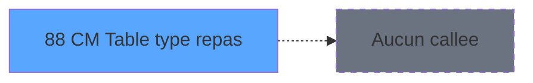

# GES IDE 88 - CM  Table type repas

> **Analyse**: Phases 1-4 2026-02-03 11:46 -> 11:46 (15s) | Assemblage 11:46
> **Pipeline**: V7.2 Enrichi
> **Structure**: 4 onglets (Resume | Ecrans | Donnees | Connexions)

<!-- TAB:Resume -->

## 1. FICHE D'IDENTITE

| Attribut | Valeur |
|----------|--------|
| Projet | GES |
| IDE Position | 88 |
| Nom Programme | CM  Table type repas |
| Fichier source | `Prg_88.xml` |
| Dossier IDE | Tables |
| Taches | 3 (1 ecrans visibles) |
| Tables modifiees | 2 |
| Programmes appeles | 0 |

## 2. DESCRIPTION FONCTIONNELLE

**CM  Table type repas** assure la gestion complete de ce processus, accessible depuis [CM  Menu Autres tables (IDE 81)](GES-IDE-81.md).

Le flux de traitement s'organise en **1 blocs fonctionnels** :

- **Traitement** (3 taches) : traitements metier divers

**Donnees modifiees** : 2 tables en ecriture (articles_________art, type_prestation).

## 3. BLOCS FONCTIONNELS

### 3.1 Traitement (3 taches)

Traitements internes.

---

#### 88 - Table Type repas [[ECRAN]](#ecran-t1)

**Role** : Traitement : Table Type repas.
**Ecran** : 1213 x 255 DLU (MDI) | [Voir mockup](#ecran-t1)
**Variables liees** : D (V.Type repas utilise ?)

---

#### 88.1 - Modif article vrl

**Role** : Traitement : Modif article vrl.

---

#### 88.2 - suppr type repas ANG

**Role** : Traitement : suppr type repas ANG.
**Variables liees** : D (V.Type repas utilise ?)

## 5. REGLES METIER

*(Aucune regle metier identifiee)*

## 6. CONTEXTE

- **Appele par**: [CM  Menu Autres tables (IDE 81)](GES-IDE-81.md)
- **Appelle**: 0 programmes | **Tables**: 3 (W:2 R:0 L:1) | **Taches**: 3 | **Expressions**: 21

<!-- TAB:Ecrans -->

## 8. ECRANS

### 8.1 Forms visibles (1 / 3)

| # | Position | Tache | Nom | Type | Largeur | Hauteur | Bloc |
|---|----------|-------|-----|------|---------|---------|------|
| 1 | 88 | 88 | Table Type repas | MDI | 1213 | 255 | Traitement |

### 8.2 Mockups Ecrans

---

#### 88 - Table Type repas
**Tache** : [88](#t1) | **Type** : MDI | **Dimensions** : 1213 x 255 DLU
**Bloc** : Traitement | **Titre IDE** : Table Type repas

<!-- FORM-DATA:
{
    "width":  1213,
    "vFactor":  8,
    "type":  "MDI",
    "hFactor":  8,
    "controls":  [
                     {
                         "x":  2,
                         "type":  "label",
                         "var":  "",
                         "y":  1,
                         "w":  1203,
                         "fmt":  "",
                         "name":  "",
                         "h":  19,
                         "color":  "",
                         "text":  "",
                         "parent":  null
                     },
                     {
                         "x":  32,
                         "type":  "label",
                         "var":  "",
                         "y":  28,
                         "w":  1151,
                         "fmt":  "",
                         "name":  "",
                         "h":  194,
                         "color":  "",
                         "text":  "",
                         "parent":  null
                     },
                     {
                         "x":  56,
                         "type":  "table",
                         "var":  "",
                         "name":  "",
                         "titleH":  12,
                         "color":  "110",
                         "w":  1106,
                         "y":  35,
                         "fmt":  "",
                         "parent":  null,
                         "text":  "",
                         "rowH":  13,
                         "h":  89,
                         "cols":  [
                                      {
                                          "title":  "Code",
                                          "layer":  1,
                                          "w":  130
                                      },
                                      {
                                          "title":  "Libellé français",
                                          "layer":  2,
                                          "w":  384
                                      },
                                      {
                                          "title":  "Libellé anglais",
                                          "layer":  3,
                                          "w":  354
                                      },
                                      {
                                          "title":  "Nb de repas",
                                          "layer":  4,
                                          "w":  115
                                      },
                                      {
                                          "title":  "Nb de JH",
                                          "layer":  5,
                                          "w":  86
                                      }
                                  ],
                         "rows":  5
                     },
                     {
                         "x":  33,
                         "type":  "label",
                         "var":  "",
                         "y":  130,
                         "w":  1143,
                         "fmt":  "",
                         "name":  "",
                         "h":  91,
                         "color":  "",
                         "text":  "",
                         "parent":  null
                     },
                     {
                         "x":  865,
                         "type":  "label",
                         "var":  "",
                         "y":  137,
                         "w":  290,
                         "fmt":  "",
                         "name":  "",
                         "h":  77,
                         "color":  "",
                         "text":  "",
                         "parent":  null
                     },
                     {
                         "x":  868,
                         "type":  "label",
                         "var":  "",
                         "y":  138,
                         "w":  284,
                         "fmt":  "",
                         "name":  "",
                         "h":  75,
                         "color":  "",
                         "text":  "",
                         "parent":  null
                     },
                     {
                         "x":  898,
                         "type":  "label",
                         "var":  "",
                         "y":  147,
                         "w":  222,
                         "fmt":  "",
                         "name":  "",
                         "h":  46,
                         "color":  "",
                         "text":  "",
                         "parent":  null
                     },
                     {
                         "x":  901,
                         "type":  "label",
                         "var":  "",
                         "y":  148,
                         "w":  37,
                         "fmt":  "",
                         "name":  "",
                         "h":  44,
                         "color":  "",
                         "text":  "",
                         "parent":  null
                     },
                     {
                         "x":  952,
                         "type":  "label",
                         "var":  "",
                         "y":  152,
                         "w":  131,
                         "fmt":  "",
                         "name":  "",
                         "h":  9,
                         "color":  "7",
                         "text":  "Modification",
                         "parent":  null
                     },
                     {
                         "x":  952,
                         "type":  "label",
                         "var":  "",
                         "y":  164,
                         "w":  131,
                         "fmt":  "",
                         "name":  "",
                         "h":  9,
                         "color":  "7",
                         "text":  "Création",
                         "parent":  null
                     },
                     {
                         "x":  952,
                         "type":  "label",
                         "var":  "",
                         "y":  176,
                         "w":  131,
                         "fmt":  "",
                         "name":  "",
                         "h":  9,
                         "color":  "7",
                         "text":  "Suppression",
                         "parent":  null
                     },
                     {
                         "x":  924,
                         "type":  "label",
                         "var":  "",
                         "y":  198,
                         "w":  120,
                         "fmt":  "",
                         "name":  "",
                         "h":  9,
                         "color":  "",
                         "text":  "Votre choix",
                         "parent":  null
                     },
                     {
                         "x":  4,
                         "type":  "label",
                         "var":  "",
                         "y":  228,
                         "w":  1203,
                         "fmt":  "",
                         "name":  "",
                         "h":  24,
                         "color":  "",
                         "text":  "",
                         "parent":  null
                     },
                     {
                         "x":  62,
                         "type":  "edit",
                         "var":  "",
                         "y":  50,
                         "w":  118,
                         "fmt":  "",
                         "name":  "trep_id",
                         "h":  8,
                         "color":  "110",
                         "text":  "",
                         "parent":  5
                     },
                     {
                         "x":  192,
                         "type":  "edit",
                         "var":  "",
                         "y":  50,
                         "w":  374,
                         "fmt":  "",
                         "name":  "trep_libelle",
                         "h":  8,
                         "color":  "110",
                         "text":  "",
                         "parent":  5
                     },
                     {
                         "x":  576,
                         "type":  "edit",
                         "var":  "",
                         "y":  50,
                         "w":  342,
                         "fmt":  "",
                         "name":  "trep_libelle ANG",
                         "h":  8,
                         "color":  "110",
                         "text":  "",
                         "parent":  5
                     },
                     {
                         "x":  975,
                         "type":  "edit",
                         "var":  "",
                         "y":  50,
                         "w":  24,
                         "fmt":  "1Z",
                         "name":  "trep_nb_repas",
                         "h":  8,
                         "color":  "110",
                         "text":  "",
                         "parent":  5
                     },
                     {
                         "x":  1068,
                         "type":  "edit",
                         "var":  "",
                         "y":  50,
                         "w":  35,
                         "fmt":  "",
                         "name":  "trep_nb_jh",
                         "h":  8,
                         "color":  "110",
                         "text":  "",
                         "parent":  5
                     },
                     {
                         "x":  1046,
                         "type":  "edit",
                         "var":  "",
                         "y":  197,
                         "w":  26,
                         "fmt":  "",
                         "name":  "V0 choix select",
                         "h":  10,
                         "color":  "6",
                         "text":  "",
                         "parent":  null
                     },
                     {
                         "x":  8,
                         "type":  "edit",
                         "var":  "",
                         "y":  7,
                         "w":  267,
                         "fmt":  "20",
                         "name":  "",
                         "h":  8,
                         "color":  "",
                         "text":  "",
                         "parent":  1
                     },
                     {
                         "x":  980,
                         "type":  "edit",
                         "var":  "",
                         "y":  7,
                         "w":  203,
                         "fmt":  "WWW DD MMM YYYYT",
                         "name":  "",
                         "h":  8,
                         "color":  "",
                         "text":  "",
                         "parent":  1
                     },
                     {
                         "x":  86,
                         "type":  "image",
                         "var":  "",
                         "y":  150,
                         "w":  160,
                         "fmt":  "",
                         "name":  "",
                         "h":  56,
                         "color":  "",
                         "text":  "",
                         "parent":  null
                     },
                     {
                         "x":  905,
                         "type":  "button",
                         "var":  "",
                         "y":  152,
                         "w":  27,
                         "fmt":  "M",
                         "name":  "M",
                         "h":  9,
                         "color":  "",
                         "text":  "",
                         "parent":  null
                     },
                     {
                         "x":  905,
                         "type":  "button",
                         "var":  "",
                         "y":  164,
                         "w":  27,
                         "fmt":  "C",
                         "name":  "C",
                         "h":  9,
                         "color":  "",
                         "text":  "",
                         "parent":  null
                     },
                     {
                         "x":  905,
                         "type":  "button",
                         "var":  "",
                         "y":  176,
                         "w":  27,
                         "fmt":  "S",
                         "name":  "S",
                         "h":  9,
                         "color":  "",
                         "text":  "",
                         "parent":  null
                     },
                     {
                         "x":  8,
                         "type":  "button",
                         "var":  "",
                         "y":  231,
                         "w":  154,
                         "fmt":  "\u0026Quitter",
                         "name":  "Q",
                         "h":  18,
                         "color":  "",
                         "text":  "",
                         "parent":  21
                     }
                 ],
    "taskId":  "88",
    "height":  255
}
-->

<strong>Champs : 8 champs</strong>

| Pos (x,y) | Nom | Variable | Type |
|-----------|-----|----------|------|
| 62,50 | trep_id | - | edit |
| 192,50 | trep_libelle | - | edit |
| 576,50 | trep_libelle ANG | - | edit |
| 975,50 | trep_nb_repas | - | edit |
| 1068,50 | trep_nb_jh | - | edit |
| 1046,197 | V0 choix select | - | edit |
| 8,7 | 20 | - | edit |
| 980,7 | WWW DD MMM YYYYT | - | edit |

<strong>Boutons : 4 boutons</strong>

| Bouton | Pos (x,y) | Action |
|--------|-----------|--------|
| M | 905,152 | Bouton fonctionnel |
| C | 905,164 | Bouton fonctionnel |
| S | 905,176 | Bouton fonctionnel |
| Quitter | 8,231 | Quitte le programme |

## 9. NAVIGATION

Ecran unique: **Table Type repas**

### 9.3 Structure hierarchique (3 taches)

| Position | Tache | Type | Dimensions | Bloc |
|----------|-------|------|------------|------|
| **88.1** | [**Table Type repas** (88)](#t1) [mockup](#ecran-t1) | MDI | 1213x255 | Traitement |
| 88.1.1 | [Modif article vrl (88.1)](#t2) | - | - | |
| 88.1.2 | [suppr type repas ANG (88.2)](#t3) | - | - | |

### 9.4 Algorigramme

> **Legende**: Vert = START/END OK | Rouge = END KO | Bleu = Decisions
> *Algorigramme auto-genere. Utiliser `/algorigramme` pour une synthese metier detaillee.*

<!-- TAB:Donnees -->

## 10. TABLES

### Tables utilisees (3)

| ID | Nom | Description | Type | R | W | L | Usages |
|----|-----|-------------|------|---|---|---|--------|
| 77 | articles_________art | Articles et stock | DB |   | **W** |   | 1 |
| 802 | type_prestation | Prestations/services vendus | DB |   | **W** |   | 2 |
| 805 | vente_par_moyen_paiement | Donnees de ventes | DB |   |   | L | 1 |

### Colonnes par table (1 / 2 tables avec colonnes identifiees)

Table 77 - articles_________art (**W**) - 1 usages

*Table utilisee uniquement en Link ou aucune colonne Real identifiee dans le DataView.*

Table 802 - type_prestation (**W**) - 2 usages

| Lettre | Variable | Acces | Type |
|--------|----------|-------|------|
| A | V0 choix select | W | Alpha |
| B | V0 choix saisi | W | Alpha |
| C | v. titre | W | Alpha |
| D | V.Type repas utilise ? | W | Logical |

## 11. VARIABLES

### 11.1 Variables de session (2)

Variables persistantes pendant toute la session.

| Lettre | Nom | Type | Usage dans |
|--------|-----|------|-----------|
| C | v. titre | Alpha | - |
| D | V.Type repas utilise ? | Logical | [88](#t1), [88.2](#t3) |

### 11.2 Autres (2)

Variables diverses.

| Lettre | Nom | Type | Usage dans |
|--------|-----|------|-----------|
| A | V0 choix select | Alpha | - |
| B | V0 choix saisi | Alpha | 3x refs |

## 12. EXPRESSIONS

**21 / 21 expressions decodees (100%)**

### 12.1 Repartition par type

| Type | Expressions | Regles |
|------|-------------|--------|
| CONSTANTE | 3 | 0 |
| DATE | 1 | 0 |
| REFERENCE_VG | 1 | 0 |
| CONDITION | 7 | 0 |
| OTHER | 6 | 0 |
| NEGATION | 3 | 0 |

### 12.2 Expressions cles par type

#### CONSTANTE (3 expressions)

| Type | IDE | Expression | Regle |
|------|-----|------------|-------|
| CONSTANTE | 15 | `'ANG'` | - |
| CONSTANTE | 8 | `'FRA'` | - |
| CONSTANTE | 1 | `''` | - |

#### DATE (1 expressions)

| Type | IDE | Expression | Regle |
|------|-----|------------|-------|
| DATE | 2 | `Date ()` | - |

#### REFERENCE_VG (1 expressions)

| Type | IDE | Expression | Regle |
|------|-----|------------|-------|
| REFERENCE_VG | 3 | `VG2` | - |

#### CONDITION (7 expressions)

| Type | IDE | Expression | Regle |
|------|-----|------------|-------|
| CONDITION | 19 | `V.Type repas utilise ? [D]=''` | - |
| CONDITION | 20 | `[E]=''` | - |
| CONDITION | 21 | `[Y]=''` | - |
| CONDITION | 11 | `Stat(0,'C'MODE) OR (NOT [T] AND Stat(0,'M'MODE) AND V.Type repas utilise ? [D]<>'MIDI' AND V.Type repas utilise ? [D]<>'SOIR' AND V.Type repas utilise ? [D]<>'PTDEJ' AND V.Type repas utilise ? [D]<>'MIDI SOIR')` | - |
| CONDITION | 4 | `V0 choix saisi [B]='C'` | - |
| ... | | *+2 autres* | |

#### OTHER (6 expressions)

| Type | IDE | Expression | Regle |
|------|-----|------------|-------|
| OTHER | 13 | `Stat(0,'D'MODE)` | - |
| OTHER | 16 | `[F]` | - |
| OTHER | 17 | `[P]` | - |
| OTHER | 7 | `MlsTrans('Table Type repas')` | - |
| OTHER | 9 | `V.Type repas utilise ? [D]` | - |
| ... | | *+1 autres* | |

#### NEGATION (3 expressions)

| Type | IDE | Expression | Regle |
|------|-----|------------|-------|
| NEGATION | 18 | `NOT Stat(0,'E'MODE)` | - |
| NEGATION | 14 | `NOT Stat(0,'D'MODE)` | - |
| NEGATION | 10 | `NOT [T] AND V.Type repas utilise ? [D]<>'MIDI' AND V.Type repas utilise ? [D]<>'SOIR' AND V.Type repas utilise ? [D]<>'MIDI SOIR' AND V.Type repas utilise ? [D]<>'PTDEJ'` | - |

### 12.3 Toutes les expressions (21)

Voir les 21 expressions

#### CONSTANTE (3)

| IDE | Expression Decodee |
|-----|-------------------|
| 1 | `''` |
| 8 | `'FRA'` |
| 15 | `'ANG'` |

#### DATE (1)

| IDE | Expression Decodee |
|-----|-------------------|
| 2 | `Date ()` |

#### REFERENCE_VG (1)

| IDE | Expression Decodee |
|-----|-------------------|
| 3 | `VG2` |

#### CONDITION (7)

| IDE | Expression Decodee |
|-----|-------------------|
| 4 | `V0 choix saisi [B]='C'` |
| 5 | `V0 choix saisi [B]='M'` |
| 6 | `V0 choix saisi [B]='S'` |
| 11 | `Stat(0,'C'MODE) OR (NOT [T] AND Stat(0,'M'MODE) AND V.Type repas utilise ? [D]<>'MIDI' AND V.Type repas utilise ? [D]<>'SOIR' AND V.Type repas utilise ? [D]<>'PTDEJ' AND V.Type repas utilise ? [D]<>'MIDI SOIR')` |
| 19 | `V.Type repas utilise ? [D]=''` |
| 20 | `[E]=''` |
| 21 | `[Y]=''` |

#### OTHER (6)

| IDE | Expression Decodee |
|-----|-------------------|
| 7 | `MlsTrans('Table Type repas')` |
| 9 | `V.Type repas utilise ? [D]` |
| 12 | `Stat(0,'C'MODE) OR (NOT [T] AND Stat(0,'M'MODE) )` |
| 13 | `Stat(0,'D'MODE)` |
| 16 | `[F]` |
| 17 | `[P]` |

#### NEGATION (3)

| IDE | Expression Decodee |
|-----|-------------------|
| 10 | `NOT [T] AND V.Type repas utilise ? [D]<>'MIDI' AND V.Type repas utilise ? [D]<>'SOIR' AND V.Type repas utilise ? [D]<>'MIDI SOIR' AND V.Type repas utilise ? [D]<>'PTDEJ'` |
| 14 | `NOT Stat(0,'D'MODE)` |
| 18 | `NOT Stat(0,'E'MODE)` |

<!-- TAB:Connexions -->

## 13. GRAPHE D'APPELS

### 13.1 Chaine depuis Main (Callers)

Main -> ... -> [CM  Menu Autres tables (IDE 81)](GES-IDE-81.md) -> **CM  Table type repas (IDE 88)**

### 13.2 Callers

| IDE | Nom Programme | Nb Appels |
|-----|---------------|-----------|
| [81](GES-IDE-81.md) | CM  Menu Autres tables | 1 |

### 13.3 Callees (programmes appeles)

### 13.4 Detail Callees avec contexte

| IDE | Nom Programme | Appels | Contexte |
|-----|---------------|--------|----------|
| - | (aucun) | - | - |

## 14. RECOMMANDATIONS MIGRATION

### 14.1 Profil du programme

| Metrique | Valeur | Impact migration |
|----------|--------|-----------------|
| Lignes de logique | 53 | Programme compact |
| Expressions | 21 | Peu de logique |
| Tables WRITE | 2 | Impact faible |
| Sous-programmes | 0 | Peu de dependances |
| Ecrans visibles | 1 | Ecran unique ou traitement batch |
| Code desactive | 0% (0 / 53) | Code sain |
| Regles metier | 0 | Pas de regle identifiee |

### 14.2 Plan de migration par bloc

#### Traitement (3 taches: 1 ecran, 2 traitements)

- **Strategie** : Orchestrateur avec 1 ecrans (Razor/React) et 2 traitements backend (services).
- Les ecrans deviennent des composants UI, les traitements invisibles deviennent des services injectables.
- Decomposer les taches en services unitaires testables.

### 14.3 Dependances critiques

| Dependance | Type | Appels | Impact |
|------------|------|--------|--------|
| articles_________art | Table WRITE (Database) | 1x | Schema + repository |
| type_prestation | Table WRITE (Database) | 2x | Schema + repository |

---
*Spec DETAILED generee par Pipeline V7.2 - 2026-02-03 11:46*
