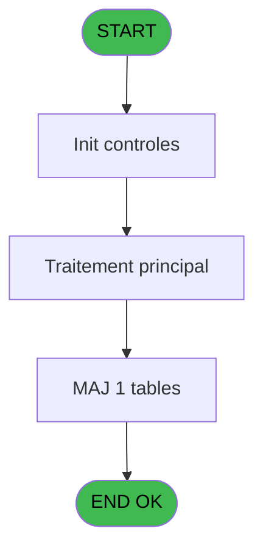

# GES IDE 89 - CM  Table Code reduction

> **Analyse**: Phases 1-4 2026-02-03 11:46 -> 11:46 (15s) | Assemblage 11:46
> **Pipeline**: V7.2 Enrichi
> **Structure**: 4 onglets (Resume | Ecrans | Donnees | Connexions)

<!-- TAB:Resume -->

## 1. FICHE D'IDENTITE

| Attribut | Valeur |
|----------|--------|
| Projet | GES |
| IDE Position | 89 |
| Nom Programme | CM  Table Code reduction |
| Fichier source | `Prg_89.xml` |
| Dossier IDE | Tables |
| Taches | 2 (1 ecrans visibles) |
| Tables modifiees | 1 |
| Programmes appeles | 1 |

## 2. DESCRIPTION FONCTIONNELLE

**CM  Table Code reduction** assure la gestion complete de ce processus, accessible depuis [CM  Menu Autres tables (IDE 81)](GES-IDE-81.md).

Le flux de traitement s'organise en **1 blocs fonctionnels** :

- **Traitement** (2 taches) : traitements metier divers

**Donnees modifiees** : 1 tables en ecriture (moyen_paiement_complement).

## 3. BLOCS FONCTIONNELS

### 3.1 Traitement (2 taches)

Traitements internes.

---

#### 89 - Table Code reduction [[ECRAN]](#ecran-t1)

**Role** : Traitement : Table Code reduction.
**Ecran** : 1405 x 255 DLU (MDI) | [Voir mockup](#ecran-t1)
**Variables liees** : C (V.Code utilisé ?)
**Delegue a** : [Appel programme (IDE 31)](GES-IDE-31.md)

---

#### 89.1 - Supprime enreg englais

**Role** : Traitement : Supprime enreg englais.
**Delegue a** : [Appel programme (IDE 31)](GES-IDE-31.md)

## 5. REGLES METIER

*(Aucune regle metier identifiee)*

## 6. CONTEXTE

- **Appele par**: [CM  Menu Autres tables (IDE 81)](GES-IDE-81.md)
- **Appelle**: 1 programmes | **Tables**: 2 (W:1 R:0 L:1) | **Taches**: 2 | **Expressions**: 28

<!-- TAB:Ecrans -->

## 8. ECRANS

### 8.1 Forms visibles (1 / 2)

| # | Position | Tache | Nom | Type | Largeur | Hauteur | Bloc |
|---|----------|-------|-----|------|---------|---------|------|
| 1 | 89 | 89 | Table Code reduction | MDI | 1405 | 255 | Traitement |

### 8.2 Mockups Ecrans

---

#### 89 - Table Code reduction
**Tache** : [89](#t1) | **Type** : MDI | **Dimensions** : 1405 x 255 DLU
**Bloc** : Traitement | **Titre IDE** : Table Code reduction

<!-- FORM-DATA:
{
    "width":  1405,
    "vFactor":  8,
    "type":  "MDI",
    "hFactor":  8,
    "controls":  [
                     {
                         "x":  2,
                         "type":  "label",
                         "var":  "",
                         "y":  1,
                         "w":  1395,
                         "fmt":  "",
                         "name":  "",
                         "h":  19,
                         "color":  "",
                         "text":  "",
                         "parent":  null
                     },
                     {
                         "x":  37,
                         "type":  "label",
                         "var":  "",
                         "y":  28,
                         "w":  1330,
                         "fmt":  "",
                         "name":  "",
                         "h":  194,
                         "color":  "",
                         "text":  "",
                         "parent":  null
                     },
                     {
                         "x":  45,
                         "type":  "table",
                         "var":  "",
                         "name":  "",
                         "titleH":  12,
                         "color":  "110",
                         "w":  1310,
                         "y":  35,
                         "fmt":  "",
                         "parent":  null,
                         "text":  "",
                         "rowH":  15,
                         "h":  89,
                         "cols":  [
                                      {
                                          "title":  "Code",
                                          "layer":  1,
                                          "w":  256
                                      },
                                      {
                                          "title":  "Libellé français",
                                          "layer":  2,
                                          "w":  416
                                      },
                                      {
                                          "title":  "Libellé anglais",
                                          "layer":  3,
                                          "w":  354
                                      },
                                      {
                                          "title":  "Variable",
                                          "layer":  4,
                                          "w":  76
                                      },
                                      {
                                          "title":  "Pourcentage",
                                          "layer":  5,
                                          "w":  110
                                      },
                                      {
                                          "title":  "Actif",
                                          "layer":  6,
                                          "w":  65
                                      }
                                  ],
                         "rows":  6
                     },
                     {
                         "x":  38,
                         "type":  "label",
                         "var":  "",
                         "y":  130,
                         "w":  1323,
                         "fmt":  "",
                         "name":  "",
                         "h":  91,
                         "color":  "",
                         "text":  "",
                         "parent":  null
                     },
                     {
                         "x":  1040,
                         "type":  "label",
                         "var":  "",
                         "y":  137,
                         "w":  290,
                         "fmt":  "",
                         "name":  "",
                         "h":  77,
                         "color":  "",
                         "text":  "",
                         "parent":  null
                     },
                     {
                         "x":  1044,
                         "type":  "label",
                         "var":  "",
                         "y":  138,
                         "w":  284,
                         "fmt":  "",
                         "name":  "",
                         "h":  75,
                         "color":  "",
                         "text":  "",
                         "parent":  null
                     },
                     {
                         "x":  1074,
                         "type":  "label",
                         "var":  "",
                         "y":  147,
                         "w":  222,
                         "fmt":  "",
                         "name":  "",
                         "h":  46,
                         "color":  "",
                         "text":  "",
                         "parent":  null
                     },
                     {
                         "x":  1077,
                         "type":  "label",
                         "var":  "",
                         "y":  148,
                         "w":  37,
                         "fmt":  "",
                         "name":  "",
                         "h":  44,
                         "color":  "",
                         "text":  "",
                         "parent":  null
                     },
                     {
                         "x":  1128,
                         "type":  "label",
                         "var":  "",
                         "y":  152,
                         "w":  131,
                         "fmt":  "",
                         "name":  "",
                         "h":  9,
                         "color":  "7",
                         "text":  "Modification",
                         "parent":  null
                     },
                     {
                         "x":  1128,
                         "type":  "label",
                         "var":  "",
                         "y":  164,
                         "w":  131,
                         "fmt":  "",
                         "name":  "",
                         "h":  9,
                         "color":  "7",
                         "text":  "Création",
                         "parent":  null
                     },
                     {
                         "x":  1128,
                         "type":  "label",
                         "var":  "",
                         "y":  176,
                         "w":  131,
                         "fmt":  "",
                         "name":  "",
                         "h":  9,
                         "color":  "7",
                         "text":  "Suppression",
                         "parent":  null
                     },
                     {
                         "x":  1100,
                         "type":  "label",
                         "var":  "",
                         "y":  198,
                         "w":  120,
                         "fmt":  "",
                         "name":  "",
                         "h":  9,
                         "color":  "",
                         "text":  "Votre choix",
                         "parent":  null
                     },
                     {
                         "x":  2,
                         "type":  "label",
                         "var":  "",
                         "y":  228,
                         "w":  1395,
                         "fmt":  "",
                         "name":  "",
                         "h":  24,
                         "color":  "",
                         "text":  "",
                         "parent":  null
                     },
                     {
                         "x":  1222,
                         "type":  "edit",
                         "var":  "",
                         "y":  197,
                         "w":  26,
                         "fmt":  "UA",
                         "name":  "V0 choix select",
                         "h":  10,
                         "color":  "110",
                         "text":  "",
                         "parent":  null
                     },
                     {
                         "x":  50,
                         "type":  "edit",
                         "var":  "",
                         "y":  50,
                         "w":  245,
                         "fmt":  "",
                         "name":  "cred_code",
                         "h":  8,
                         "color":  "110",
                         "text":  "",
                         "parent":  5
                     },
                     {
                         "x":  8,
                         "type":  "edit",
                         "var":  "",
                         "y":  7,
                         "w":  267,
                         "fmt":  "20",
                         "name":  "",
                         "h":  8,
                         "color":  "",
                         "text":  "",
                         "parent":  1
                     },
                     {
                         "x":  1179,
                         "type":  "edit",
                         "var":  "",
                         "y":  7,
                         "w":  203,
                         "fmt":  "WWW DD MMM YYYYT",
                         "name":  "",
                         "h":  8,
                         "color":  "",
                         "text":  "",
                         "parent":  1
                     },
                     {
                         "x":  91,
                         "type":  "image",
                         "var":  "",
                         "y":  150,
                         "w":  160,
                         "fmt":  "",
                         "name":  "",
                         "h":  56,
                         "color":  "",
                         "text":  "",
                         "parent":  null
                     },
                     {
                         "x":  1081,
                         "type":  "button",
                         "var":  "",
                         "y":  152,
                         "w":  27,
                         "fmt":  "M",
                         "name":  "M",
                         "h":  9,
                         "color":  "",
                         "text":  "",
                         "parent":  null
                     },
                     {
                         "x":  1081,
                         "type":  "button",
                         "var":  "",
                         "y":  164,
                         "w":  27,
                         "fmt":  "C",
                         "name":  "C",
                         "h":  9,
                         "color":  "",
                         "text":  "",
                         "parent":  null
                     },
                     {
                         "x":  1081,
                         "type":  "button",
                         "var":  "",
                         "y":  176,
                         "w":  27,
                         "fmt":  "S",
                         "name":  "S",
                         "h":  9,
                         "color":  "",
                         "text":  "",
                         "parent":  null
                     },
                     {
                         "x":  8,
                         "type":  "button",
                         "var":  "",
                         "y":  231,
                         "w":  154,
                         "fmt":  "\u0026Quitter",
                         "name":  "Q",
                         "h":  18,
                         "color":  "",
                         "text":  "",
                         "parent":  21
                     },
                     {
                         "x":  306,
                         "type":  "edit",
                         "var":  "",
                         "y":  50,
                         "w":  408,
                         "fmt":  "",
                         "name":  "cred_libelle",
                         "h":  8,
                         "color":  "110",
                         "text":  "",
                         "parent":  5
                     },
                     {
                         "x":  723,
                         "type":  "edit",
                         "var":  "",
                         "y":  50,
                         "w":  342,
                         "fmt":  "",
                         "name":  "cred_libelle_anglais",
                         "h":  8,
                         "color":  "110",
                         "text":  "",
                         "parent":  5
                     },
                     {
                         "x":  1097,
                         "type":  "checkbox",
                         "var":  "",
                         "y":  51,
                         "w":  24,
                         "fmt":  "",
                         "name":  "cred_variable",
                         "h":  9,
                         "color":  "110",
                         "text":  "",
                         "parent":  5
                     },
                     {
                         "x":  1152,
                         "type":  "edit",
                         "var":  "",
                         "y":  50,
                         "w":  95,
                         "fmt":  "3%Z",
                         "name":  "cred_pourcentage",
                         "h":  10,
                         "color":  "110",
                         "text":  "",
                         "parent":  5
                     },
                     {
                         "x":  1275,
                         "type":  "checkbox",
                         "var":  "",
                         "y":  51,
                         "w":  24,
                         "fmt":  "",
                         "name":  "cred_actif",
                         "h":  9,
                         "color":  "110",
                         "text":  "",
                         "parent":  5
                     }
                 ],
    "taskId":  "89",
    "height":  255
}
-->

<strong>Champs : 9 champs</strong>

| Pos (x,y) | Nom | Variable | Type |
|-----------|-----|----------|------|
| 1222,197 | V0 choix select | - | edit |
| 50,50 | cred_code | - | edit |
| 8,7 | 20 | - | edit |
| 1179,7 | WWW DD MMM YYYYT | - | edit |
| 306,50 | cred_libelle | - | edit |
| 723,50 | cred_libelle_anglais | - | edit |
| 1097,51 | cred_variable | - | checkbox |
| 1152,50 | cred_pourcentage | - | edit |
| 1275,51 | cred_actif | - | checkbox |

<strong>Boutons : 4 boutons</strong>

| Bouton | Pos (x,y) | Action |
|--------|-----------|--------|
| M | 1081,152 | Bouton fonctionnel |
| C | 1081,164 | Bouton fonctionnel |
| S | 1081,176 | Bouton fonctionnel |
| Quitter | 8,231 | Quitte le programme |

## 9. NAVIGATION

Ecran unique: **Table Code reduction**

### 9.3 Structure hierarchique (2 taches)

| Position | Tache | Type | Dimensions | Bloc |
|----------|-------|------|------------|------|
| **89.1** | [**Table Code reduction** (89)](#t1) [mockup](#ecran-t1) | MDI | 1405x255 | Traitement |
| 89.1.1 | [Supprime enreg englais (89.1)](#t2) | - | - | |

### 9.4 Algorigramme

> **Legende**: Vert = START/END OK | Rouge = END KO | Bleu = Decisions
> *Algorigramme auto-genere. Utiliser `/algorigramme` pour une synthese metier detaillee.*

<!-- TAB:Donnees -->

## 10. TABLES

### Tables utilisees (2)

| ID | Nom | Description | Type | R | W | L | Usages |
|----|-----|-------------|------|---|---|---|--------|
| 800 | moyen_paiement_complement |  | DB |   | **W** |   | 2 |
| 805 | vente_par_moyen_paiement | Donnees de ventes | DB |   |   | L | 1 |

### Colonnes par table (1 / 1 tables avec colonnes identifiees)

Table 800 - moyen_paiement_complement (**W**) - 2 usages

| Lettre | Variable | Acces | Type |
|--------|----------|-------|------|
| A | V0 choix select | W | Alpha |
| B | V0 choix saisi | W | Alpha |
| C | V.Code utilisé ? | W | Logical |
| D | v. titre | W | Alpha |

## 11. VARIABLES

### 11.1 Variables de session (2)

Variables persistantes pendant toute la session.

| Lettre | Nom | Type | Usage dans |
|--------|-----|------|-----------|
| C | V.Code utilisé ? | Logical | - |
| D | v. titre | Alpha | 2x session |

### 11.2 Autres (2)

Variables diverses.

| Lettre | Nom | Type | Usage dans |
|--------|-----|------|-----------|
| A | V0 choix select | Alpha | 1x refs |
| B | V0 choix saisi | Alpha | 4x refs |

## 12. EXPRESSIONS

**28 / 28 expressions decodees (100%)**

### 12.1 Repartition par type

| Type | Expressions | Regles |
|------|-------------|--------|
| CONSTANTE | 4 | 0 |
| DATE | 1 | 0 |
| REFERENCE_VG | 1 | 0 |
| CONDITION | 8 | 0 |
| OTHER | 9 | 0 |
| NEGATION | 5 | 0 |

### 12.2 Expressions cles par type

#### CONSTANTE (4 expressions)

| Type | IDE | Expression | Regle |
|------|-----|------------|-------|
| CONSTANTE | 19 | `'FRA'` | - |
| CONSTANTE | 20 | `'ANG'` | - |
| CONSTANTE | 1 | `''` | - |
| CONSTANTE | 14 | `0` | - |

#### DATE (1 expressions)

| Type | IDE | Expression | Regle |
|------|-----|------------|-------|
| DATE | 2 | `Date ()` | - |

#### REFERENCE_VG (1 expressions)

| Type | IDE | Expression | Regle |
|------|-----|------------|-------|
| REFERENCE_VG | 3 | `VG2` | - |

#### CONDITION (8 expressions)

| Type | IDE | Expression | Regle |
|------|-----|------------|-------|
| CONDITION | 11 | `[AJ]=''` | - |
| CONDITION | 10 | `[E]=''` | - |
| CONDITION | 7 | `InStr ('CMS',V0 choix saisi [B])=0 AND V0 choix saisi [B]<>''` | - |
| CONDITION | 27 | `LastPark(0)='V0 choix select'` | - |
| CONDITION | 5 | `V0 choix saisi [B]='C' OR V0 choix saisi [B]='M' OR (V0 choix saisi [B]='S' AND NOT [X])` | - |
| ... | | *+3 autres* | |

#### OTHER (9 expressions)

| Type | IDE | Expression | Regle |
|------|-----|------------|-------|
| OTHER | 23 | `[Q]` | - |
| OTHER | 22 | `[P]` | - |
| OTHER | 28 | `{1,4}` | - |
| OTHER | 24 | `Stat(0,'D'MODE)` | - |
| OTHER | 21 | `[F]` | - |
| ... | | *+4 autres* | |

#### NEGATION (5 expressions)

| Type | IDE | Expression | Regle |
|------|-----|------------|-------|
| NEGATION | 25 | `NOT Stat(0,'D'MODE)` | - |
| NEGATION | 26 | `NOT Stat(0,'E'MODE)` | - |
| NEGATION | 17 | `NOT [X]` | - |
| NEGATION | 12 | `NOT [P]` | - |
| NEGATION | 15 | `NOT [P] AND [F]=0` | - |

### 12.3 Toutes les expressions (28)

Voir les 28 expressions

#### CONSTANTE (4)

| IDE | Expression Decodee |
|-----|-------------------|
| 1 | `''` |
| 14 | `0` |
| 19 | `'FRA'` |
| 20 | `'ANG'` |

#### DATE (1)

| IDE | Expression Decodee |
|-----|-------------------|
| 2 | `Date ()` |

#### REFERENCE_VG (1)

| IDE | Expression Decodee |
|-----|-------------------|
| 3 | `VG2` |

#### CONDITION (8)

| IDE | Expression Decodee |
|-----|-------------------|
| 4 | `V0 choix saisi [B]='C'` |
| 5 | `V0 choix saisi [B]='C' OR V0 choix saisi [B]='M' OR (V0 choix saisi [B]='S' AND NOT [X])` |
| 6 | `V0 choix saisi [B]='S' AND NOT [X]` |
| 9 | `v. titre [D]=''` |
| 10 | `[E]=''` |
| 11 | `[AJ]=''` |
| 27 | `LastPark(0)='V0 choix select'` |
| 7 | `InStr ('CMS',V0 choix saisi [B])=0 AND V0 choix saisi [B]<>''` |

#### OTHER (9)

| IDE | Expression Decodee |
|-----|-------------------|
| 8 | `MlsTrans('Table des codes réductions')` |
| 13 | `[P]` |
| 16 | `v. titre [D]` |
| 18 | `Stat(0,'C'MODE) OR (NOT [X] AND Stat(0,'M'MODE))` |
| 21 | `[F]` |
| 22 | `[P]` |
| 23 | `[Q]` |
| 24 | `Stat(0,'D'MODE)` |
| 28 | `{1,4}` |

#### NEGATION (5)

| IDE | Expression Decodee |
|-----|-------------------|
| 12 | `NOT [P]` |
| 15 | `NOT [P] AND [F]=0` |
| 17 | `NOT [X]` |
| 25 | `NOT Stat(0,'D'MODE)` |
| 26 | `NOT Stat(0,'E'MODE)` |

<!-- TAB:Connexions -->

## 13. GRAPHE D'APPELS

### 13.1 Chaine depuis Main (Callers)

Main -> ... -> [CM  Menu Autres tables (IDE 81)](GES-IDE-81.md) -> **CM  Table Code reduction (IDE 89)**

### 13.2 Callers

| IDE | Nom Programme | Nb Appels |
|-----|---------------|-----------|
| [81](GES-IDE-81.md) | CM  Menu Autres tables | 1 |

### 13.3 Callees (programmes appeles)

### 13.4 Detail Callees avec contexte

| IDE | Nom Programme | Appels | Contexte |
|-----|---------------|--------|----------|
| [31](GES-IDE-31.md) | Appel programme | 1 | Sous-programme |

## 14. RECOMMANDATIONS MIGRATION

### 14.1 Profil du programme

| Metrique | Valeur | Impact migration |
|----------|--------|-----------------|
| Lignes de logique | 50 | Programme compact |
| Expressions | 28 | Peu de logique |
| Tables WRITE | 1 | Impact faible |
| Sous-programmes | 1 | Peu de dependances |
| Ecrans visibles | 1 | Ecran unique ou traitement batch |
| Code desactive | 0% (0 / 50) | Code sain |
| Regles metier | 0 | Pas de regle identifiee |

### 14.2 Plan de migration par bloc

#### Traitement (2 taches: 1 ecran, 1 traitement)

- **Strategie** : Orchestrateur avec 1 ecrans (Razor/React) et 1 traitements backend (services).
- Les ecrans deviennent des composants UI, les traitements invisibles deviennent des services injectables.
- 1 sous-programme(s) a migrer ou a reutiliser depuis les services existants.
- Decomposer les taches en services unitaires testables.

### 14.3 Dependances critiques

| Dependance | Type | Appels | Impact |
|------------|------|--------|--------|
| moyen_paiement_complement | Table WRITE (Database) | 2x | Schema + repository |
| [Appel programme (IDE 31)](GES-IDE-31.md) | Sous-programme | 1x | Normale - Sous-programme |

---
*Spec DETAILED generee par Pipeline V7.2 - 2026-02-03 11:46*
