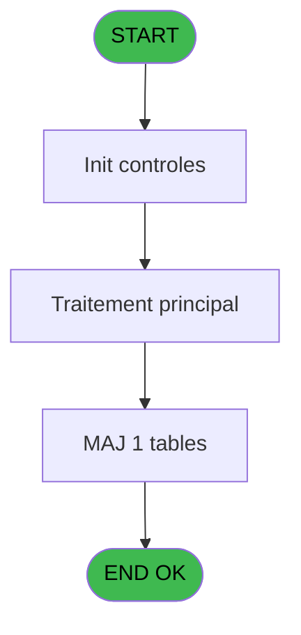

# GES IDE 91 - CM Valeurs Crédits Bar

> **Analyse**: Phases 1-4 2026-02-03 11:47 -> 11:47 (17s) | Assemblage 11:47
> **Pipeline**: V7.2 Enrichi
> **Structure**: 4 onglets (Resume | Ecrans | Donnees | Connexions)

<!-- TAB:Resume -->

## 1. FICHE D'IDENTITE

| Attribut | Valeur |
|----------|--------|
| Projet | GES |
| IDE Position | 91 |
| Nom Programme | CM Valeurs Crédits Bar |
| Fichier source | `Prg_91.xml` |
| Dossier IDE | Tables |
| Taches | 1 (1 ecrans visibles) |
| Tables modifiees | 1 |
| Programmes appeles | 0 |

## 2. DESCRIPTION FONCTIONNELLE

**CM Valeurs Crédits Bar** assure la gestion complete de ce processus, accessible depuis [CM  Menu Autres tables (IDE 81)](GES-IDE-81.md).

Le flux de traitement s'organise en **1 blocs fonctionnels** :

- **Traitement** (1 tache) : traitements metier divers

**Donnees modifiees** : 1 tables en ecriture (stat_lieu_vente).

**Logique metier** : 1 regles identifiees couvrant conditions metier.

## 3. BLOCS FONCTIONNELS

### 3.1 Traitement (1 tache)

Traitements internes.

---

#### 91 - Table Valeurs Crédit Bar [[ECRAN]](#ecran-t1)

**Role** : Traitement : Table Valeurs Crédit Bar.
**Ecran** : 909 x 255 DLU (MDI) | [Voir mockup](#ecran-t1)

## 5. REGLES METIER

1 regles identifiees:

### Autres (1 regles)

#### [RM-001] Si v. titre [E]='1' alors 'RDS (Responsable de Service)' sinon IF(v. titre [E]='2','GO/GE',IF(v. titre [E]='3','RSP (Responsable de pôle)','')))

| Element | Detail |
|---------|--------|
| **Condition** | `v. titre [E]='1'` |
| **Si vrai** | 'RDS (Responsable de Service)' |
| **Si faux** | IF(v. titre [E]='2','GO/GE',IF(v. titre [E]='3','RSP (Responsable de pôle)',''))) |
| **Variables** | E (v. titre) |
| **Expression source** | Expression 12 : `IF(v. titre [E]='1','RDS (Responsable de Service)',IF(v. tit` |
| **Exemple** | Si v. titre [E]='1' → 'RDS (Responsable de Service)' |

## 6. CONTEXTE

- **Appele par**: [CM  Menu Autres tables (IDE 81)](GES-IDE-81.md)
- **Appelle**: 0 programmes | **Tables**: 1 (W:1 R:0 L:0) | **Taches**: 1 | **Expressions**: 15

<!-- TAB:Ecrans -->

## 8. ECRANS

### 8.1 Forms visibles (1 / 1)

| # | Position | Tache | Nom | Type | Largeur | Hauteur | Bloc |
|---|----------|-------|-----|------|---------|---------|------|
| 1 | 91 | 91 | Table Valeurs Crédit Bar | MDI | 909 | 255 | Traitement |

### 8.2 Mockups Ecrans

---

#### 91 - Table Valeurs Crédit Bar
**Tache** : [91](#t1) | **Type** : MDI | **Dimensions** : 909 x 255 DLU
**Bloc** : Traitement | **Titre IDE** : Table Valeurs Crédit Bar

<!-- FORM-DATA:
{
    "width":  909,
    "vFactor":  8,
    "type":  "MDI",
    "hFactor":  8,
    "controls":  [
                     {
                         "x":  2,
                         "type":  "label",
                         "var":  "",
                         "y":  1,
                         "w":  895,
                         "fmt":  "",
                         "name":  "",
                         "h":  19,
                         "color":  "",
                         "text":  "",
                         "parent":  null
                     },
                     {
                         "x":  18,
                         "type":  "label",
                         "var":  "",
                         "y":  26,
                         "w":  881,
                         "fmt":  "",
                         "name":  "",
                         "h":  198,
                         "color":  "",
                         "text":  "",
                         "parent":  null
                     },
                     {
                         "x":  30,
                         "type":  "table",
                         "var":  "",
                         "name":  "",
                         "titleH":  12,
                         "color":  "110",
                         "w":  846,
                         "y":  35,
                         "fmt":  "",
                         "parent":  null,
                         "text":  "",
                         "rowH":  15,
                         "h":  89,
                         "cols":  [
                                      {
                                          "title":  "Type",
                                          "layer":  1,
                                          "w":  240
                                      },
                                      {
                                          "title":  "Valeur / Type",
                                          "layer":  2,
                                          "w":  404
                                      },
                                      {
                                          "title":  "Montant",
                                          "layer":  3,
                                          "w":  167
                                      }
                                  ],
                         "rows":  3
                     },
                     {
                         "x":  19,
                         "type":  "label",
                         "var":  "",
                         "y":  130,
                         "w":  879,
                         "fmt":  "",
                         "name":  "",
                         "h":  94,
                         "color":  "",
                         "text":  "",
                         "parent":  null
                     },
                     {
                         "x":  592,
                         "type":  "label",
                         "var":  "",
                         "y":  135,
                         "w":  290,
                         "fmt":  "",
                         "name":  "",
                         "h":  77,
                         "color":  "",
                         "text":  "",
                         "parent":  null
                     },
                     {
                         "x":  595,
                         "type":  "label",
                         "var":  "",
                         "y":  136,
                         "w":  284,
                         "fmt":  "",
                         "name":  "",
                         "h":  75,
                         "color":  "",
                         "text":  "",
                         "parent":  null
                     },
                     {
                         "x":  625,
                         "type":  "label",
                         "var":  "",
                         "y":  145,
                         "w":  222,
                         "fmt":  "",
                         "name":  "",
                         "h":  46,
                         "color":  "",
                         "text":  "",
                         "parent":  null
                     },
                     {
                         "x":  644,
                         "type":  "label",
                         "var":  "",
                         "y":  155,
                         "w":  37,
                         "fmt":  "",
                         "name":  "",
                         "h":  14,
                         "color":  "",
                         "text":  "",
                         "parent":  13
                     },
                     {
                         "x":  696,
                         "type":  "label",
                         "var":  "",
                         "y":  158,
                         "w":  131,
                         "fmt":  "",
                         "name":  "",
                         "h":  9,
                         "color":  "7",
                         "text":  "Modification",
                         "parent":  null
                     },
                     {
                         "x":  651,
                         "type":  "label",
                         "var":  "",
                         "y":  196,
                         "w":  131,
                         "fmt":  "",
                         "name":  "",
                         "h":  9,
                         "color":  "",
                         "text":  "Votre choix",
                         "parent":  null
                     },
                     {
                         "x":  4,
                         "type":  "label",
                         "var":  "",
                         "y":  228,
                         "w":  895,
                         "fmt":  "",
                         "name":  "",
                         "h":  24,
                         "color":  "",
                         "text":  "",
                         "parent":  null
                     },
                     {
                         "x":  696,
                         "type":  "label",
                         "var":  "",
                         "y":  173,
                         "w":  131,
                         "fmt":  "",
                         "name":  "",
                         "h":  9,
                         "color":  "7",
                         "text":  "Visualisation",
                         "parent":  null
                     },
                     {
                         "x":  644,
                         "type":  "label",
                         "var":  "",
                         "y":  170,
                         "w":  37,
                         "fmt":  "",
                         "name":  "",
                         "h":  14,
                         "color":  "",
                         "text":  "",
                         "parent":  13
                     },
                     {
                         "x":  801,
                         "type":  "edit",
                         "var":  "",
                         "y":  195,
                         "w":  26,
                         "fmt":  "",
                         "name":  "V0 choix select",
                         "h":  10,
                         "color":  "6",
                         "text":  "",
                         "parent":  null
                     },
                     {
                         "x":  8,
                         "type":  "edit",
                         "var":  "",
                         "y":  7,
                         "w":  267,
                         "fmt":  "20",
                         "name":  "",
                         "h":  8,
                         "color":  "",
                         "text":  "",
                         "parent":  1
                     },
                     {
                         "x":  687,
                         "type":  "edit",
                         "var":  "",
                         "y":  7,
                         "w":  203,
                         "fmt":  "WWW DD MMM YYYYT",
                         "name":  "",
                         "h":  8,
                         "color":  "",
                         "text":  "",
                         "parent":  1
                     },
                     {
                         "x":  64,
                         "type":  "image",
                         "var":  "",
                         "y":  144,
                         "w":  160,
                         "fmt":  "",
                         "name":  "",
                         "h":  56,
                         "color":  "",
                         "text":  "",
                         "parent":  null
                     },
                     {
                         "x":  647,
                         "type":  "button",
                         "var":  "",
                         "y":  157,
                         "w":  27,
                         "fmt":  "M",
                         "name":  "M",
                         "h":  9,
                         "color":  "",
                         "text":  "",
                         "parent":  null
                     },
                     {
                         "x":  8,
                         "type":  "button",
                         "var":  "",
                         "y":  231,
                         "w":  154,
                         "fmt":  "\u0026Quitter",
                         "name":  "Q",
                         "h":  18,
                         "color":  "",
                         "text":  "",
                         "parent":  21
                     },
                     {
                         "x":  35,
                         "type":  "combobox",
                         "var":  "",
                         "y":  50,
                         "w":  187,
                         "fmt":  "",
                         "name":  "vcb_qualite_type",
                         "h":  12,
                         "color":  "110",
                         "text":  "Q,C,F",
                         "parent":  5
                     },
                     {
                         "x":  278,
                         "type":  "edit",
                         "var":  "",
                         "y":  50,
                         "w":  57,
                         "fmt":  "",
                         "name":  "vcb_valeur",
                         "h":  10,
                         "color":  "110",
                         "text":  "",
                         "parent":  5
                     },
                     {
                         "x":  680,
                         "type":  "edit",
                         "var":  "",
                         "y":  50,
                         "w":  156,
                         "fmt":  "N12.3",
                         "name":  "vcb_montant",
                         "h":  10,
                         "color":  "110",
                         "text":  "",
                         "parent":  5
                     },
                     {
                         "x":  338,
                         "type":  "edit",
                         "var":  "",
                         "y":  50,
                         "w":  336,
                         "fmt":  "30",
                         "name":  "vcb_qualite_type_0001",
                         "h":  10,
                         "color":  "110",
                         "text":  "",
                         "parent":  5
                     },
                     {
                         "x":  647,
                         "type":  "button",
                         "var":  "",
                         "y":  172,
                         "w":  27,
                         "fmt":  "V",
                         "name":  "V",
                         "h":  9,
                         "color":  "",
                         "text":  "",
                         "parent":  null
                     }
                 ],
    "taskId":  "91",
    "height":  255
}
-->

<strong>Champs : 7 champs</strong>

| Pos (x,y) | Nom | Variable | Type |
|-----------|-----|----------|------|
| 801,195 | V0 choix select | - | edit |
| 8,7 | 20 | - | edit |
| 687,7 | WWW DD MMM YYYYT | - | edit |
| 35,50 | vcb_qualite_type | - | combobox |
| 278,50 | vcb_valeur | - | edit |
| 680,50 | vcb_montant | - | edit |
| 338,50 | vcb_qualite_type_0001 | - | edit |

<strong>Boutons : 3 boutons</strong>

| Bouton | Pos (x,y) | Action |
|--------|-----------|--------|
| M | 647,157 | Bouton fonctionnel |
| Quitter | 8,231 | Quitte le programme |
| V | 647,172 | Bouton fonctionnel |

## 9. NAVIGATION

Ecran unique: **Table Valeurs Crédit Bar**

### 9.3 Structure hierarchique (1 tache)

| Position | Tache | Type | Dimensions | Bloc |
|----------|-------|------|------------|------|
| **91.1** | [**Table Valeurs Crédit Bar** (91)](#t1) [mockup](#ecran-t1) | MDI | 909x255 | Traitement |

### 9.4 Algorigramme

> **Legende**: Vert = START/END OK | Rouge = END KO | Bleu = Decisions
> *Algorigramme auto-genere. Utiliser `/algorigramme` pour une synthese metier detaillee.*

<!-- TAB:Donnees -->

## 10. TABLES

### Tables utilisees (1)

| ID | Nom | Description | Type | R | W | L | Usages |
|----|-----|-------------|------|---|---|---|--------|
| 846 | stat_lieu_vente | Statistiques point de vente | TMP |   | **W** |   | 1 |

### Colonnes par table (1 / 1 tables avec colonnes identifiees)

Table 846 - stat_lieu_vente (**W**) - 1 usages

| Lettre | Variable | Acces | Type |
|--------|----------|-------|------|
| A | V0 choix select | W | Alpha |
| B | V0 choix saisi | W | Alpha |
| C | b Valeur/ Rtpe | W | Alpha |
| D | v Libellé Valeur | W | Alpha |
| E | v. titre | W | Alpha |

## 11. VARIABLES

### 11.1 Variables de session (2)

Variables persistantes pendant toute la session.

| Lettre | Nom | Type | Usage dans |
|--------|-----|------|-----------|
| D | v Libellé Valeur | Alpha | [91](#t1) |
| E | v. titre | Alpha | 2x session |

### 11.2 Autres (3)

Variables diverses.

| Lettre | Nom | Type | Usage dans |
|--------|-----|------|-----------|
| A | V0 choix select | Alpha | - |
| B | V0 choix saisi | Alpha | 4x refs |
| C | b Valeur/ Rtpe | Alpha | 1x refs |

## 12. EXPRESSIONS

**15 / 15 expressions decodees (100%)**

### 12.1 Repartition par type

| Type | Expressions | Regles |
|------|-------------|--------|
| CONDITION | 7 | 5 |
| CONSTANTE | 2 | 0 |
| DATE | 1 | 0 |
| OTHER | 2 | 0 |
| REFERENCE_VG | 1 | 0 |
| STRING | 2 | 0 |

### 12.2 Expressions cles par type

#### CONDITION (7 expressions)

| Type | IDE | Expression | Regle |
|------|-----|------------|-------|
| CONDITION | 12 | `IF(v. titre [E]='1','RDS (Responsable de Service)',IF(v. titre [E]='2','GO/GE',IF(v. titre [E]='3','RSP (Responsable de pôle)','')))` | [RM-001](#rm-RM-001) |
| CONDITION | 11 | `V0 choix saisi [B]<>''` | - |
| CONDITION | 14 | `v Libellé Valeur [D]='C'` | - |
| CONDITION | 10 | `InStr ('MV',b Valeur/ Rtpe [C])=0 AND b Valeur/ Rtpe [C]<>''` | - |
| CONDITION | 13 | `CASE(v. titre [E],'1','RDS (Responsable de Service)','2','GO/GE','3','RSP (Responsable de Pôle)','4','Commandant','5','Officiers supérieurs','6','Officiers','7','Cadets','8','Officiers subalternes','')` | - |
| ... | | *+2 autres* | |

#### CONSTANTE (2 expressions)

| Type | IDE | Expression | Regle |
|------|-----|------------|-------|
| CONSTANTE | 3 | `''` | - |
| CONSTANTE | 2 | `'Valeurs Crédits Bar'` | - |

#### DATE (1 expressions)

| Type | IDE | Expression | Regle |
|------|-----|------------|-------|
| DATE | 5 | `Date ()` | - |

#### OTHER (2 expressions)

| Type | IDE | Expression | Regle |
|------|-----|------------|-------|
| OTHER | 4 | `V0 choix saisi [B]` | - |
| OTHER | 1 | `Stat(0,'C'MODE)` | - |

#### REFERENCE_VG (1 expressions)

| Type | IDE | Expression | Regle |
|------|-----|------------|-------|
| REFERENCE_VG | 6 | `VG2` | - |

#### STRING (2 expressions)

| Type | IDE | Expression | Regle |
|------|-----|------------|-------|
| STRING | 15 | `Trim(VG16)` | - |
| STRING | 9 | `Trim ([G])` | - |

<!-- TAB:Connexions -->

## 13. GRAPHE D'APPELS

### 13.1 Chaine depuis Main (Callers)

Main -> ... -> [CM  Menu Autres tables (IDE 81)](GES-IDE-81.md) -> **CM Valeurs Crédits Bar (IDE 91)**

### 13.2 Callers

| IDE | Nom Programme | Nb Appels |
|-----|---------------|-----------|
| [81](GES-IDE-81.md) | CM  Menu Autres tables | 1 |

### 13.3 Callees (programmes appeles)

### 13.4 Detail Callees avec contexte

| IDE | Nom Programme | Appels | Contexte |
|-----|---------------|--------|----------|
| - | (aucun) | - | - |

## 14. RECOMMANDATIONS MIGRATION

### 14.1 Profil du programme

| Metrique | Valeur | Impact migration |
|----------|--------|-----------------|
| Lignes de logique | 27 | Programme compact |
| Expressions | 15 | Peu de logique |
| Tables WRITE | 1 | Impact faible |
| Sous-programmes | 0 | Peu de dependances |
| Ecrans visibles | 1 | Ecran unique ou traitement batch |
| Code desactive | 11.1% (3 / 27) | A verifier |
| Regles metier | 1 | Quelques regles a preserver |

### 14.2 Plan de migration par bloc

#### Traitement (1 tache: 1 ecran, 0 traitement)

- **Strategie** : 1 composant(s) UI (Razor/React) avec formulaires et validation.
- Decomposer les taches en services unitaires testables.

### 14.3 Dependances critiques

| Dependance | Type | Appels | Impact |
|------------|------|--------|--------|
| stat_lieu_vente | Table WRITE (Temp) | 1x | Schema + repository |

---
*Spec DETAILED generee par Pipeline V7.2 - 2026-02-03 11:47*
