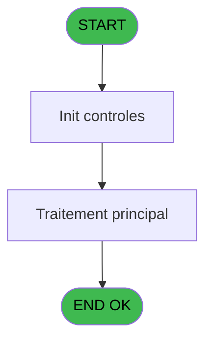
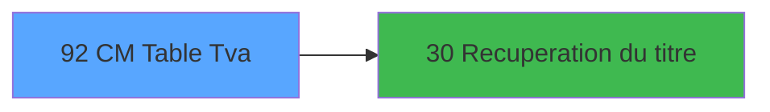

# GES IDE 92 - CM  Table Tva

> **Analyse**: Phases 1-4 2026-02-03 11:47 -> 11:47 (16s) | Assemblage 11:47
> **Pipeline**: V7.2 Enrichi
> **Structure**: 4 onglets (Resume | Ecrans | Donnees | Connexions)

<!-- TAB:Resume -->

## 1. FICHE D'IDENTITE

| Attribut | Valeur |
|----------|--------|
| Projet | GES |
| IDE Position | 92 |
| Nom Programme | CM  Table Tva |
| Fichier source | `Prg_92.xml` |
| Dossier IDE | Tables |
| Taches | 1 (1 ecrans visibles) |
| Tables modifiees | 0 |
| Programmes appeles | 1 |

## 2. DESCRIPTION FONCTIONNELLE

**CM  Table Tva** assure la gestion complete de ce processus, accessible depuis [CM  Menu Autres tables (IDE 81)](GES-IDE-81.md).

Le flux de traitement s'organise en **1 blocs fonctionnels** :

- **Traitement** (1 tache) : traitements metier divers

**Logique metier** : 2 regles identifiees couvrant conditions metier.

## 3. BLOCS FONCTIONNELS

### 3.1 Traitement (1 tache)

Traitements internes.

---

#### 92 - Tva [[ECRAN]](#ecran-t2)

**Role** : Traitement interne.
**Ecran** : 733 x 255 DLU (MDI) | [Voir mockup](#ecran-t2)

## 5. REGLES METIER

2 regles identifiees:

### Autres (2 regles)

#### [RM-001] Si [X] alors 105 sinon 110)

| Element | Detail |
|---------|--------|
| **Condition** | `[X]` |
| **Si vrai** | 105 |
| **Si faux** | 110) |
| **Expression source** | Expression 14 : `IF([X],105,110)` |
| **Exemple** | Si [X] → 105. Sinon → 110) |

#### [RM-002] Si VG47 alors 48 sinon 48+12.5)

| Element | Detail |
|---------|--------|
| **Condition** | `VG47` |
| **Si vrai** | 48 |
| **Si faux** | 48+12.5) |
| **Expression source** | Expression 22 : `IF(VG47,48,48+12.5)` |
| **Exemple** | Si VG47 → 48. Sinon → 48+12.5) |

## 6. CONTEXTE

- **Appele par**: [CM  Menu Autres tables (IDE 81)](GES-IDE-81.md)
- **Appelle**: 1 programmes | **Tables**: 4 (W:0 R:1 L:3) | **Taches**: 1 | **Expressions**: 22

<!-- TAB:Ecrans -->

## 8. ECRANS

### 8.1 Forms visibles (1 / 1)

| # | Position | Tache | Nom | Type | Largeur | Hauteur | Bloc |
|---|----------|-------|-----|------|---------|---------|------|
| 1 | 92.1 | 92 | Tva | MDI | 733 | 255 | Traitement |

### 8.2 Mockups Ecrans

---

#### 92.1 - Tva
**Tache** : [92](#t2) | **Type** : MDI | **Dimensions** : 733 x 255 DLU
**Bloc** : Traitement | **Titre IDE** : Tva

<!-- FORM-DATA:
{
    "width":  733,
    "vFactor":  8,
    "type":  "MDI",
    "hFactor":  8,
    "controls":  [
                     {
                         "x":  2,
                         "type":  "label",
                         "var":  "",
                         "y":  1,
                         "w":  731,
                         "fmt":  "",
                         "name":  "",
                         "h":  19,
                         "color":  "",
                         "text":  "",
                         "parent":  null
                     },
                     {
                         "x":  37,
                         "type":  "label",
                         "var":  "",
                         "y":  28,
                         "w":  671,
                         "fmt":  "",
                         "name":  "",
                         "h":  194,
                         "color":  "",
                         "text":  "",
                         "parent":  null
                     },
                     {
                         "x":  49,
                         "type":  "table",
                         "var":  "",
                         "name":  "",
                         "titleH":  13,
                         "color":  "110",
                         "w":  643,
                         "y":  35,
                         "fmt":  "",
                         "parent":  null,
                         "text":  "",
                         "rowH":  13,
                         "h":  89,
                         "cols":  [
                                      {
                                          "title":  "Code Tva",
                                          "layer":  1,
                                          "w":  98
                                      },
                                      {
                                          "title":  "Description",
                                          "layer":  2,
                                          "w":  384
                                      },
                                      {
                                          "title":  "Taux réduit",
                                          "layer":  3,
                                          "w":  126
                                      }
                                  ],
                         "rows":  3
                     },
                     {
                         "x":  38,
                         "type":  "label",
                         "var":  "",
                         "y":  130,
                         "w":  670,
                         "fmt":  "",
                         "name":  "",
                         "h":  91,
                         "color":  "",
                         "text":  "",
                         "parent":  null
                     },
                     {
                         "x":  351,
                         "type":  "label",
                         "var":  "",
                         "y":  137,
                         "w":  290,
                         "fmt":  "",
                         "name":  "",
                         "h":  77,
                         "color":  "",
                         "text":  "",
                         "parent":  12
                     },
                     {
                         "x":  356,
                         "type":  "label",
                         "var":  "",
                         "y":  138,
                         "w":  284,
                         "fmt":  "",
                         "name":  "",
                         "h":  75,
                         "color":  "",
                         "text":  "",
                         "parent":  null
                     },
                     {
                         "x":  386,
                         "type":  "label",
                         "var":  "",
                         "y":  147,
                         "w":  222,
                         "fmt":  "",
                         "name":  "",
                         "h":  46,
                         "color":  "",
                         "text":  "",
                         "parent":  12
                     },
                     {
                         "x":  387,
                         "type":  "label",
                         "var":  "",
                         "y":  148,
                         "w":  37,
                         "fmt":  "",
                         "name":  "",
                         "h":  44,
                         "color":  "",
                         "text":  "",
                         "parent":  12
                     },
                     {
                         "x":  440,
                         "type":  "label",
                         "var":  "",
                         "y":  152,
                         "w":  131,
                         "fmt":  "",
                         "name":  "",
                         "h":  9,
                         "color":  "7",
                         "text":  "Modification",
                         "parent":  12
                     },
                     {
                         "x":  440,
                         "type":  "label",
                         "var":  "",
                         "y":  164,
                         "w":  131,
                         "fmt":  "",
                         "name":  "",
                         "h":  9,
                         "color":  "7",
                         "text":  "Création",
                         "parent":  12
                     },
                     {
                         "x":  440,
                         "type":  "label",
                         "var":  "",
                         "y":  176,
                         "w":  131,
                         "fmt":  "",
                         "name":  "",
                         "h":  9,
                         "color":  "7",
                         "text":  "Suppression",
                         "parent":  12
                     },
                     {
                         "x":  412,
                         "type":  "label",
                         "var":  "",
                         "y":  198,
                         "w":  120,
                         "fmt":  "",
                         "name":  "",
                         "h":  9,
                         "color":  "",
                         "text":  "Votre choix",
                         "parent":  12
                     },
                     {
                         "x":  4,
                         "type":  "label",
                         "var":  "",
                         "y":  228,
                         "w":  720,
                         "fmt":  "",
                         "name":  "",
                         "h":  24,
                         "color":  "",
                         "text":  "",
                         "parent":  null
                     },
                     {
                         "x":  534,
                         "type":  "edit",
                         "var":  "",
                         "y":  197,
                         "w":  26,
                         "fmt":  "",
                         "name":  "V0 choix select",
                         "h":  10,
                         "color":  "6",
                         "text":  "",
                         "parent":  12
                     },
                     {
                         "x":  59,
                         "type":  "edit",
                         "var":  "",
                         "y":  51,
                         "w":  85,
                         "fmt":  "3.3",
                         "name":  "tva_code",
                         "h":  8,
                         "color":  "110",
                         "text":  "",
                         "parent":  5
                     },
                     {
                         "x":  161,
                         "type":  "edit",
                         "var":  "",
                         "y":  51,
                         "w":  328,
                         "fmt":  "",
                         "name":  "TAC Libelle article",
                         "h":  8,
                         "color":  "110",
                         "text":  "",
                         "parent":  5
                     },
                     {
                         "x":  8,
                         "type":  "edit",
                         "var":  "",
                         "y":  7,
                         "w":  267,
                         "fmt":  "20",
                         "name":  "",
                         "h":  8,
                         "color":  "",
                         "text":  "",
                         "parent":  1
                     },
                     {
                         "x":  518,
                         "type":  "edit",
                         "var":  "",
                         "y":  7,
                         "w":  203,
                         "fmt":  "WWW DD MMM YYYYT",
                         "name":  "",
                         "h":  8,
                         "color":  "",
                         "text":  "",
                         "parent":  1
                     },
                     {
                         "x":  91,
                         "type":  "image",
                         "var":  "",
                         "y":  150,
                         "w":  160,
                         "fmt":  "",
                         "name":  "",
                         "h":  56,
                         "color":  "",
                         "text":  "",
                         "parent":  null
                     },
                     {
                         "x":  393,
                         "type":  "button",
                         "var":  "",
                         "y":  152,
                         "w":  27,
                         "fmt":  "M",
                         "name":  "M",
                         "h":  9,
                         "color":  "",
                         "text":  "",
                         "parent":  12
                     },
                     {
                         "x":  393,
                         "type":  "button",
                         "var":  "",
                         "y":  164,
                         "w":  27,
                         "fmt":  "C",
                         "name":  "C",
                         "h":  9,
                         "color":  "",
                         "text":  "",
                         "parent":  12
                     },
                     {
                         "x":  393,
                         "type":  "button",
                         "var":  "",
                         "y":  176,
                         "w":  27,
                         "fmt":  "S",
                         "name":  "S",
                         "h":  9,
                         "color":  "",
                         "text":  "",
                         "parent":  12
                     },
                     {
                         "x":  8,
                         "type":  "button",
                         "var":  "",
                         "y":  231,
                         "w":  154,
                         "fmt":  "\u0026Quitter",
                         "name":  "Q",
                         "h":  18,
                         "color":  "",
                         "text":  "",
                         "parent":  21
                     },
                     {
                         "x":  590,
                         "type":  "checkbox",
                         "var":  "",
                         "y":  51,
                         "w":  32,
                         "fmt":  "",
                         "name":  "tva_taux_reduit",
                         "h":  9,
                         "color":  "6",
                         "text":  "",
                         "parent":  5
                     }
                 ],
    "taskId":  "92.1",
    "height":  255
}
-->

<strong>Champs : 6 champs</strong>

| Pos (x,y) | Nom | Variable | Type |
|-----------|-----|----------|------|
| 534,197 | V0 choix select | - | edit |
| 59,51 | tva_code | - | edit |
| 161,51 | TAC Libelle article | - | edit |
| 8,7 | 20 | - | edit |
| 518,7 | WWW DD MMM YYYYT | - | edit |
| 590,51 | tva_taux_reduit | - | checkbox |

<strong>Boutons : 4 boutons</strong>

| Bouton | Pos (x,y) | Action |
|--------|-----------|--------|
| M | 393,152 | Bouton fonctionnel |
| C | 393,164 | Bouton fonctionnel |
| S | 393,176 | Bouton fonctionnel |
| Quitter | 8,231 | Quitte le programme |

## 9. NAVIGATION

Ecran unique: **Tva**

### 9.3 Structure hierarchique (1 tache)

| Position | Tache | Type | Dimensions | Bloc |
|----------|-------|------|------------|------|
| **92.1** | [**Tva** (92)](#t2) [mockup](#ecran-t2) | MDI | 733x255 | Traitement |

### 9.4 Algorigramme

> **Legende**: Vert = START/END OK | Rouge = END KO | Bleu = Decisions
> *Algorigramme auto-genere. Utiliser `/algorigramme` pour une synthese metier detaillee.*

<!-- TAB:Donnees -->

## 10. TABLES

### Tables utilisees (4)

| ID | Nom | Description | Type | R | W | L | Usages |
|----|-----|-------------|------|---|---|---|--------|
| 77 | articles_________art | Articles et stock | DB | R |   |   | 1 |
| 403 | pv_sellers |  | DB |   |   | L | 1 |
| 417 | pv_weight |  | DB |   |   | L | 1 |
| 1054 | Table_1054 |  | MEM |   |   | L | 1 |

### Colonnes par table (1 / 1 tables avec colonnes identifiees)

Table 77 - articles_________art (R) - 1 usages

| Lettre | Variable | Acces | Type |
|--------|----------|-------|------|
| A | > service | R | Alpha |
| B | > Masque Montant | R | Alpha |
| C | V0 choix select | R | Alpha |
| D | V0 choix saisi | R | Alpha |
| E | v. titre | R | Alpha |
| F | v.Tva articles? | R | Logical |
| G | v.Tva pv_package_price? | R | Logical |
| H | v.Tva taxe_add_param? | R | Logical |
| I | v.tva utilisée? | R | Logical |
| J | v.code tva existe déjà? | R | Logical |
| K | CHG_REASON_tva_code | R | Numeric |
| L | CHG_PRV_tva_code | R | Numeric |

## 11. VARIABLES

### 11.1 Variables de session (6)

Variables persistantes pendant toute la session.

| Lettre | Nom | Type | Usage dans |
|--------|-----|------|-----------|
| E | v. titre | Alpha | - |
| F | v.Tva articles? | Logical | 1x session |
| G | v.Tva pv_package_price? | Logical | 1x session |
| H | v.Tva taxe_add_param? | Logical | - |
| I | v.tva utilisée? | Logical | - |
| J | v.code tva existe déjà? | Logical | - |

### 11.2 Autres (6)

Variables diverses.

| Lettre | Nom | Type | Usage dans |
|--------|-----|------|-----------|
| A | > service | Alpha | - |
| B | > Masque Montant | Alpha | 5x refs |
| C | V0 choix select | Alpha | 1x refs |
| D | V0 choix saisi | Alpha | 2x refs |
| K | CHG_REASON_tva_code | Numeric | - |
| L | CHG_PRV_tva_code | Numeric | - |

## 12. EXPRESSIONS

**22 / 22 expressions decodees (100%)**

### 12.1 Repartition par type

| Type | Expressions | Regles |
|------|-------------|--------|
| CONDITION | 9 | 2 |
| CONSTANTE | 2 | 0 |
| DATE | 1 | 0 |
| REFERENCE_VG | 2 | 0 |
| OTHER | 7 | 0 |
| STRING | 1 | 0 |

### 12.2 Expressions cles par type

#### CONDITION (9 expressions)

| Type | IDE | Expression | Regle |
|------|-----|------------|-------|
| CONDITION | 22 | `IF(VG47,48,48+12.5)` | [RM-002](#rm-RM-002) |
| CONDITION | 14 | `IF([X],105,110)` | [RM-001](#rm-RM-001) |
| CONDITION | 11 | `> Masque Montant [B]<>''` | - |
| CONDITION | 18 | `[AB] AND V0 choix saisi [D]<>[AD] AND [AC]=0` | - |
| CONDITION | 10 | `InStr ('CMS',V0 choix select [C])=0 AND V0 choix select [C]<>''` | - |
| ... | | *+4 autres* | |

#### CONSTANTE (2 expressions)

| Type | IDE | Expression | Regle |
|------|-----|------------|-------|
| CONSTANTE | 3 | `260` | - |
| CONSTANTE | 1 | `''` | - |

#### DATE (1 expressions)

| Type | IDE | Expression | Regle |
|------|-----|------------|-------|
| DATE | 4 | `Date ()` | - |

#### REFERENCE_VG (2 expressions)

| Type | IDE | Expression | Regle |
|------|-----|------------|-------|
| REFERENCE_VG | 21 | `VG47` | - |
| REFERENCE_VG | 5 | `VG2` | - |

#### OTHER (7 expressions)

| Type | IDE | Expression | Regle |
|------|-----|------------|-------|
| OTHER | 17 | `v.Tva articles? [F]` | - |
| OTHER | 19 | `[AD]` | - |
| OTHER | 20 | `MlsTrans('Taux de TVA déjà utilisé')` | - |
| OTHER | 16 | `NOT([X])` | - |
| OTHER | 12 | `V0 choix saisi [D]` | - |
| ... | | *+2 autres* | |

#### STRING (1 expressions)

| Type | IDE | Expression | Regle |
|------|-----|------------|-------|
| STRING | 9 | `Trim (v.Tva pv_package_price? [G])` | - |

### 12.3 Toutes les expressions (22)

Voir les 22 expressions

#### CONDITION (9)

| IDE | Expression Decodee |
|-----|-------------------|
| 14 | `IF([X],105,110)` |
| 22 | `IF(VG47,48,48+12.5)` |
| 2 | `> Masque Montant [B]` |
| 6 | `> Masque Montant [B]='C'` |
| 7 | `> Masque Montant [B]='M'` |
| 8 | `> Masque Montant [B]='S'` |
| 11 | `> Masque Montant [B]<>''` |
| 18 | `[AB] AND V0 choix saisi [D]<>[AD] AND [AC]=0` |
| 10 | `InStr ('CMS',V0 choix select [C])=0 AND V0 choix select [C]<>''` |

#### CONSTANTE (2)

| IDE | Expression Decodee |
|-----|-------------------|
| 1 | `''` |
| 3 | `260` |

#### DATE (1)

| IDE | Expression Decodee |
|-----|-------------------|
| 4 | `Date ()` |

#### REFERENCE_VG (2)

| IDE | Expression Decodee |
|-----|-------------------|
| 5 | `VG2` |
| 21 | `VG47` |

#### OTHER (7)

| IDE | Expression Decodee |
|-----|-------------------|
| 12 | `V0 choix saisi [D]` |
| 13 | `[S] OR [T] OR [V]` |
| 15 | `NOT([X]) OR Stat(0,'C'MODE)` |
| 16 | `NOT([X])` |
| 17 | `v.Tva articles? [F]` |
| 19 | `[AD]` |
| 20 | `MlsTrans('Taux de TVA déjà utilisé')` |

#### STRING (1)

| IDE | Expression Decodee |
|-----|-------------------|
| 9 | `Trim (v.Tva pv_package_price? [G])` |

<!-- TAB:Connexions -->

## 13. GRAPHE D'APPELS

### 13.1 Chaine depuis Main (Callers)

Main -> ... -> [CM  Menu Autres tables (IDE 81)](GES-IDE-81.md) -> **CM  Table Tva (IDE 92)**

### 13.2 Callers

| IDE | Nom Programme | Nb Appels |
|-----|---------------|-----------|
| [81](GES-IDE-81.md) | CM  Menu Autres tables | 1 |

### 13.3 Callees (programmes appeles)

### 13.4 Detail Callees avec contexte

| IDE | Nom Programme | Appels | Contexte |
|-----|---------------|--------|----------|
| [30](GES-IDE-30.md) | Recuperation du titre | 1 | Recuperation donnees |

## 14. RECOMMANDATIONS MIGRATION

### 14.1 Profil du programme

| Metrique | Valeur | Impact migration |
|----------|--------|-----------------|
| Lignes de logique | 56 | Programme compact |
| Expressions | 22 | Peu de logique |
| Tables WRITE | 0 | Impact faible |
| Sous-programmes | 1 | Peu de dependances |
| Ecrans visibles | 1 | Ecran unique ou traitement batch |
| Code desactive | 1.8% (1 / 56) | Code sain |
| Regles metier | 2 | Quelques regles a preserver |

### 14.2 Plan de migration par bloc

#### Traitement (1 tache: 1 ecran, 0 traitement)

- **Strategie** : 1 composant(s) UI (Razor/React) avec formulaires et validation.
- 1 sous-programme(s) a migrer ou a reutiliser depuis les services existants.
- Decomposer les taches en services unitaires testables.

### 14.3 Dependances critiques

| Dependance | Type | Appels | Impact |
|------------|------|--------|--------|
| [Recuperation du titre (IDE 30)](GES-IDE-30.md) | Sous-programme | 1x | Normale - Recuperation donnees |

---
*Spec DETAILED generee par Pipeline V7.2 - 2026-02-03 11:48*
