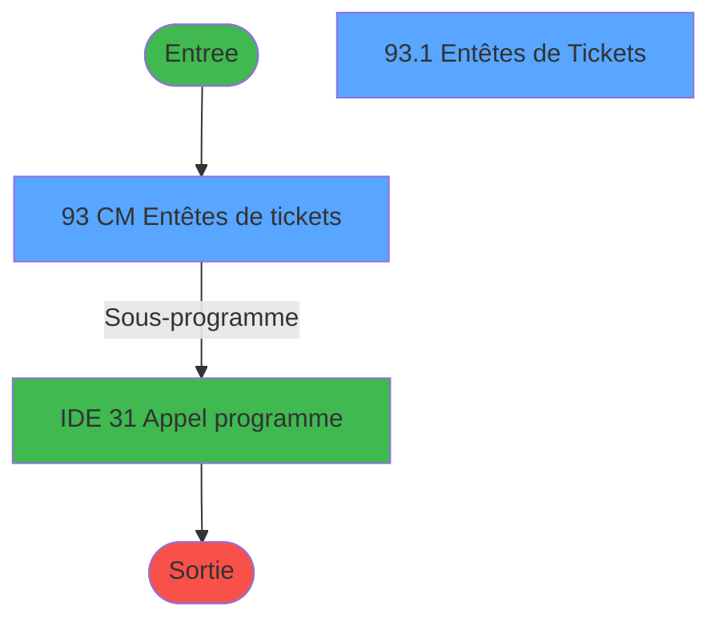
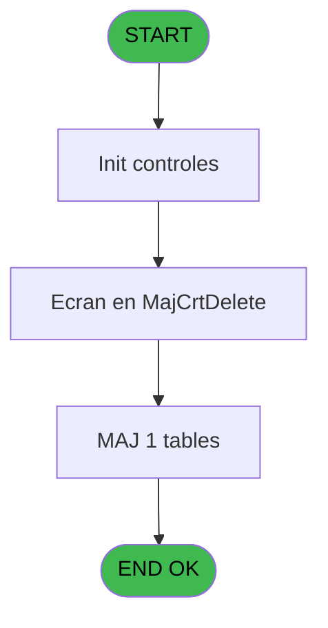

# GES IDE 93 - CM  Entêtes de tickets

> **Analyse**: Phases 1-4 2026-02-03 11:48 -> 11:48 (13s) | Assemblage 11:48
> **Pipeline**: V7.2 Enrichi
> **Structure**: 4 onglets (Resume | Ecrans | Donnees | Connexions)

<!-- TAB:Resume -->

## 1. FICHE D'IDENTITE

| Attribut | Valeur |
|----------|--------|
| Projet | GES |
| IDE Position | 93 |
| Nom Programme | CM  Entêtes de tickets |
| Fichier source | `Prg_93.xml` |
| Dossier IDE | TAI |
| Taches | 4 (2 ecrans visibles) |
| Tables modifiees | 1 |
| Programmes appeles | 1 |

## 2. DESCRIPTION FONCTIONNELLE

**CM  Entêtes de tickets** assure la gestion complete de ce processus, accessible depuis [CM  Menu Autres tables (IDE 81)](GES-IDE-81.md).

Le flux de traitement s'organise en **2 blocs fonctionnels** :

- **Traitement** (2 taches) : traitements metier divers
- **Impression** (2 taches) : generation de tickets et documents

**Donnees modifiees** : 1 tables en ecriture (arc_depot_garantie___dga).

**Logique metier** : 1 regles identifiees couvrant conditions metier.

Detail : phases du traitement

#### Phase 1 : Impression (2 taches)

- **93** - CM  Entêtes de tickets **[[ECRAN]](#ecran-t1)**
- **93.1** - Entêtes de Tickets **[[ECRAN]](#ecran-t5)**

#### Phase 2 : Traitement (2 taches)

- **93.2** - Récupère identification
- **93.1.1** - Suprime enreg

Delegue a : [Appel programme (IDE 31)](GES-IDE-31.md)

#### Tables impactees

| Table | Operations | Role metier |
|-------|-----------|-------------|
| arc_depot_garantie___dga | R/**W** (4 usages) | Depots et garanties |

## 3. BLOCS FONCTIONNELS

### 3.1 Impression (2 taches)

Generation des documents et tickets.

---

#### 93 - CM  Entêtes de tickets [[ECRAN]](#ecran-t1)

**Role** : Generation du document : CM  Entêtes de tickets.
**Ecran** : 1410 x 239 DLU (MDI) | [Voir mockup](#ecran-t1)

---

#### 93.1 - Entêtes de Tickets [[ECRAN]](#ecran-t5)

**Role** : Generation du document : Entêtes de Tickets.
**Ecran** : 1410 x 239 DLU (MDI) | [Voir mockup](#ecran-t5)

### 3.2 Traitement (2 taches)

Traitements internes.

---

#### 93.2 - Récupère identification

**Role** : Traitement : Récupère identification.
**Variables liees** : C (V0. Identification)
**Delegue a** : [Appel programme (IDE 31)](GES-IDE-31.md)

---

#### 93.1.1 - Suprime enreg

**Role** : Traitement : Suprime enreg.
**Delegue a** : [Appel programme (IDE 31)](GES-IDE-31.md)

## 5. REGLES METIER

1 regles identifiees:

### Autres (1 regles)

#### [RM-001] Si [AQ] alors Trim(V.Existe entête ? [E]) sinon 'Pas d''entête paramétrée')

| Element | Detail |
|---------|--------|
| **Condition** | `[AQ]` |
| **Si vrai** | Trim(V.Existe entête ? [E]) |
| **Si faux** | 'Pas d''entête paramétrée') |
| **Variables** | E (V.Existe entête ?) |
| **Expression source** | Expression 6 : `IF([AQ],Trim(V.Existe entête ? [E]),'Pas d''entête paramétré` |
| **Exemple** | Si [AQ] → Trim(V.Existe entête ? [E]). Sinon → 'Pas d''entête paramétrée') |

## 6. CONTEXTE

- **Appele par**: [CM  Menu Autres tables (IDE 81)](GES-IDE-81.md)
- **Appelle**: 1 programmes | **Tables**: 2 (W:1 R:1 L:1) | **Taches**: 4 | **Expressions**: 12

<!-- TAB:Ecrans -->

## 8. ECRANS

### 8.1 Forms visibles (2 / 4)

| # | Position | Tache | Nom | Type | Largeur | Hauteur | Bloc |
|---|----------|-------|-----|------|---------|---------|------|
| 1 | 93 | 93 | CM  Entêtes de tickets | MDI | 1410 | 239 | Impression |
| 2 | 93.2 | 93.1 | Entêtes de Tickets | MDI | 1410 | 239 | Impression |

### 8.2 Mockups Ecrans

---

#### 93 - CM  Entêtes de tickets
**Tache** : [93](#t1) | **Type** : MDI | **Dimensions** : 1410 x 239 DLU
**Bloc** : Impression | **Titre IDE** : CM  Entêtes de tickets

<!-- FORM-DATA:
{
    "width":  1410,
    "vFactor":  8,
    "type":  "MDI",
    "hFactor":  8,
    "controls":  [
                     {
                         "x":  2,
                         "type":  "label",
                         "var":  "",
                         "y":  1,
                         "w":  1395,
                         "fmt":  "",
                         "name":  "",
                         "h":  19,
                         "color":  "",
                         "text":  "",
                         "parent":  null
                     },
                     {
                         "x":  37,
                         "type":  "label",
                         "var":  "",
                         "y":  28,
                         "w":  546,
                         "fmt":  "",
                         "name":  "",
                         "h":  176,
                         "color":  "",
                         "text":  "",
                         "parent":  null
                     },
                     {
                         "x":  45,
                         "type":  "table",
                         "var":  "",
                         "name":  "",
                         "titleH":  12,
                         "color":  "110",
                         "w":  523,
                         "y":  35,
                         "fmt":  "",
                         "parent":  null,
                         "text":  "",
                         "rowH":  12,
                         "h":  74,
                         "cols":  [
                                      {
                                          "title":  "Type",
                                          "layer":  1,
                                          "w":  56
                                      },
                                      {
                                          "title":  "Libellé",
                                          "layer":  2,
                                          "w":  434
                                      }
                                  ],
                         "rows":  2
                     },
                     {
                         "x":  40,
                         "type":  "label",
                         "var":  "",
                         "y":  113,
                         "w":  523,
                         "fmt":  "",
                         "name":  "",
                         "h":  88,
                         "color":  "",
                         "text":  "",
                         "parent":  null
                     },
                     {
                         "x":  256,
                         "type":  "label",
                         "var":  "",
                         "y":  121,
                         "w":  290,
                         "fmt":  "",
                         "name":  "",
                         "h":  77,
                         "color":  "",
                         "text":  "",
                         "parent":  null
                     },
                     {
                         "x":  257,
                         "type":  "label",
                         "var":  "",
                         "y":  123,
                         "w":  284,
                         "fmt":  "",
                         "name":  "",
                         "h":  75,
                         "color":  "",
                         "text":  "",
                         "parent":  null
                     },
                     {
                         "x":  287,
                         "type":  "label",
                         "var":  "",
                         "y":  132,
                         "w":  222,
                         "fmt":  "",
                         "name":  "",
                         "h":  46,
                         "color":  "",
                         "text":  "",
                         "parent":  null
                     },
                     {
                         "x":  290,
                         "type":  "label",
                         "var":  "",
                         "y":  133,
                         "w":  37,
                         "fmt":  "",
                         "name":  "",
                         "h":  44,
                         "color":  "",
                         "text":  "",
                         "parent":  null
                     },
                     {
                         "x":  341,
                         "type":  "label",
                         "var":  "",
                         "y":  137,
                         "w":  131,
                         "fmt":  "",
                         "name":  "",
                         "h":  9,
                         "color":  "7",
                         "text":  "Modification",
                         "parent":  null
                     },
                     {
                         "x":  341,
                         "type":  "label",
                         "var":  "",
                         "y":  149,
                         "w":  131,
                         "fmt":  "",
                         "name":  "",
                         "h":  9,
                         "color":  "7",
                         "text":  "Création",
                         "parent":  null
                     },
                     {
                         "x":  341,
                         "type":  "label",
                         "var":  "",
                         "y":  161,
                         "w":  131,
                         "fmt":  "",
                         "name":  "",
                         "h":  9,
                         "color":  "7",
                         "text":  "Suppression",
                         "parent":  null
                     },
                     {
                         "x":  313,
                         "type":  "label",
                         "var":  "",
                         "y":  183,
                         "w":  120,
                         "fmt":  "",
                         "name":  "",
                         "h":  9,
                         "color":  "",
                         "text":  "Votre choix",
                         "parent":  null
                     },
                     {
                         "x":  5,
                         "type":  "label",
                         "var":  "",
                         "y":  209,
                         "w":  1395,
                         "fmt":  "",
                         "name":  "",
                         "h":  24,
                         "color":  "",
                         "text":  "",
                         "parent":  null
                     },
                     {
                         "x":  594,
                         "type":  "label",
                         "var":  "",
                         "y":  37,
                         "w":  37,
                         "fmt":  "",
                         "name":  "",
                         "h":  10,
                         "color":  "",
                         "text":  "Club",
                         "parent":  null
                     },
                     {
                         "x":  592,
                         "type":  "label",
                         "var":  "",
                         "y":  54,
                         "w":  51,
                         "fmt":  "",
                         "name":  "",
                         "h":  9,
                         "color":  "",
                         "text":  "Village",
                         "parent":  null
                     },
                     {
                         "x":  592,
                         "type":  "label",
                         "var":  "",
                         "y":  69,
                         "w":  72,
                         "fmt":  "",
                         "name":  "",
                         "h":  9,
                         "color":  "",
                         "text":  "Adresse",
                         "parent":  null
                     },
                     {
                         "x":  594,
                         "type":  "label",
                         "var":  "",
                         "y":  130,
                         "w":  104,
                         "fmt":  "",
                         "name":  "",
                         "h":  10,
                         "color":  "",
                         "text":  "Cd pos/Ville",
                         "parent":  null
                     },
                     {
                         "x":  592,
                         "type":  "label",
                         "var":  "",
                         "y":  116,
                         "w":  94,
                         "fmt":  "",
                         "name":  "",
                         "h":  10,
                         "color":  "",
                         "text":  "Téléphone",
                         "parent":  null
                     },
                     {
                         "x":  592,
                         "type":  "label",
                         "var":  "",
                         "y":  144,
                         "w":  94,
                         "fmt":  "",
                         "name":  "",
                         "h":  10,
                         "color":  "",
                         "text":  "Fax",
                         "parent":  null
                     },
                     {
                         "x":  592,
                         "type":  "label",
                         "var":  "",
                         "y":  159,
                         "w":  94,
                         "fmt":  "",
                         "name":  "",
                         "h":  10,
                         "color":  "",
                         "text":  "Siret",
                         "parent":  null
                     },
                     {
                         "x":  592,
                         "type":  "label",
                         "var":  "",
                         "y":  174,
                         "w":  94,
                         "fmt":  "",
                         "name":  "",
                         "h":  10,
                         "color":  "",
                         "text":  "N° Tva",
                         "parent":  null
                     },
                     {
                         "x":  592,
                         "type":  "label",
                         "var":  "",
                         "y":  189,
                         "w":  94,
                         "fmt":  "",
                         "name":  "",
                         "h":  9,
                         "color":  "",
                         "text":  "Email",
                         "parent":  null
                     },
                     {
                         "x":  585,
                         "type":  "label",
                         "var":  "",
                         "y":  28,
                         "w":  818,
                         "fmt":  "",
                         "name":  "",
                         "h":  176,
                         "color":  "",
                         "text":  "",
                         "parent":  null
                     },
                     {
                         "x":  793,
                         "type":  "label",
                         "var":  "",
                         "y":  97,
                         "w":  403,
                         "fmt":  "",
                         "name":  "",
                         "h":  38,
                         "color":  "114",
                         "text":  "  Entête inexistante",
                         "parent":  null
                     },
                     {
                         "x":  687,
                         "type":  "label",
                         "var":  "",
                         "y":  37,
                         "w":  8,
                         "fmt":  "",
                         "name":  "",
                         "h":  10,
                         "color":  "",
                         "text":  ":",
                         "parent":  null
                     },
                     {
                         "x":  687,
                         "type":  "label",
                         "var":  "",
                         "y":  53,
                         "w":  8,
                         "fmt":  "",
                         "name":  "",
                         "h":  10,
                         "color":  "",
                         "text":  ":",
                         "parent":  null
                     },
                     {
                         "x":  687,
                         "type":  "label",
                         "var":  "",
                         "y":  73,
                         "w":  8,
                         "fmt":  "",
                         "name":  "",
                         "h":  10,
                         "color":  "",
                         "text":  ":",
                         "parent":  null
                     },
                     {
                         "x":  687,
                         "type":  "label",
                         "var":  "",
                         "y":  116,
                         "w":  8,
                         "fmt":  "",
                         "name":  "",
                         "h":  10,
                         "color":  "",
                         "text":  ":",
                         "parent":  null
                     },
                     {
                         "x":  687,
                         "type":  "label",
                         "var":  "",
                         "y":  144,
                         "w":  8,
                         "fmt":  "",
                         "name":  "",
                         "h":  10,
                         "color":  "",
                         "text":  ":",
                         "parent":  null
                     },
                     {
                         "x":  687,
                         "type":  "label",
                         "var":  "",
                         "y":  174,
                         "w":  8,
                         "fmt":  "",
                         "name":  "",
                         "h":  10,
                         "color":  "",
                         "text":  ":",
                         "parent":  null
                     },
                     {
                         "x":  687,
                         "type":  "label",
                         "var":  "",
                         "y":  189,
                         "w":  8,
                         "fmt":  "",
                         "name":  "",
                         "h":  10,
                         "color":  "",
                         "text":  ":",
                         "parent":  null
                     },
                     {
                         "x":  687,
                         "type":  "label",
                         "var":  "",
                         "y":  130,
                         "w":  8,
                         "fmt":  "",
                         "name":  "",
                         "h":  10,
                         "color":  "",
                         "text":  ":",
                         "parent":  null
                     },
                     {
                         "x":  687,
                         "type":  "label",
                         "var":  "",
                         "y":  159,
                         "w":  8,
                         "fmt":  "",
                         "name":  "",
                         "h":  10,
                         "color":  "",
                         "text":  ":",
                         "parent":  null
                     },
                     {
                         "x":  435,
                         "type":  "edit",
                         "var":  "",
                         "y":  182,
                         "w":  26,
                         "fmt":  "UA",
                         "name":  "V0 choix select",
                         "h":  10,
                         "color":  "110",
                         "text":  "",
                         "parent":  null
                     },
                     {
                         "x":  58,
                         "type":  "edit",
                         "var":  "",
                         "y":  51,
                         "w":  34,
                         "fmt":  "",
                         "name":  "cred_code",
                         "h":  8,
                         "color":  "110",
                         "text":  "",
                         "parent":  5
                     },
                     {
                         "x":  8,
                         "type":  "edit",
                         "var":  "",
                         "y":  7,
                         "w":  267,
                         "fmt":  "20",
                         "name":  "",
                         "h":  8,
                         "color":  "",
                         "text":  "",
                         "parent":  1
                     },
                     {
                         "x":  1179,
                         "type":  "edit",
                         "var":  "",
                         "y":  7,
                         "w":  203,
                         "fmt":  "WWW DD MMM YYYYT",
                         "name":  "",
                         "h":  8,
                         "color":  "",
                         "text":  "",
                         "parent":  1
                     },
                     {
                         "x":  59,
                         "type":  "image",
                         "var":  "",
                         "y":  131,
                         "w":  160,
                         "fmt":  "",
                         "name":  "",
                         "h":  56,
                         "color":  "",
                         "text":  "",
                         "parent":  null
                     },
                     {
                         "x":  294,
                         "type":  "button",
                         "var":  "",
                         "y":  137,
                         "w":  27,
                         "fmt":  "M",
                         "name":  "M",
                         "h":  9,
                         "color":  "",
                         "text":  "",
                         "parent":  null
                     },
                     {
                         "x":  294,
                         "type":  "button",
                         "var":  "",
                         "y":  149,
                         "w":  27,
                         "fmt":  "C",
                         "name":  "C",
                         "h":  9,
                         "color":  "",
                         "text":  "",
                         "parent":  null
                     },
                     {
                         "x":  294,
                         "type":  "button",
                         "var":  "",
                         "y":  161,
                         "w":  27,
                         "fmt":  "S",
                         "name":  "S",
                         "h":  9,
                         "color":  "",
                         "text":  "",
                         "parent":  null
                     },
                     {
                         "x":  11,
                         "type":  "button",
                         "var":  "",
                         "y":  212,
                         "w":  154,
                         "fmt":  "\u0026Quitter",
                         "name":  "Q",
                         "h":  18,
                         "color":  "",
                         "text":  "",
                         "parent":  21
                     },
                     {
                         "x":  116,
                         "type":  "edit",
                         "var":  "",
                         "y":  51,
                         "w":  419,
                         "fmt":  "30",
                         "name":  "Libelle",
                         "h":  8,
                         "color":  "110",
                         "text":  "",
                         "parent":  5
                     },
                     {
                         "x":  698,
                         "type":  "edit",
                         "var":  "",
                         "y":  37,
                         "w":  706,
                         "fmt":  "",
                         "name":  "club",
                         "h":  10,
                         "color":  "",
                         "text":  "",
                         "parent":  null
                     },
                     {
                         "x":  698,
                         "type":  "edit",
                         "var":  "",
                         "y":  52,
                         "w":  706,
                         "fmt":  "",
                         "name":  "village",
                         "h":  10,
                         "color":  "",
                         "text":  "",
                         "parent":  null
                     },
                     {
                         "x":  698,
                         "type":  "edit",
                         "var":  "",
                         "y":  67,
                         "w":  706,
                         "fmt":  "",
                         "name":  "adress_1",
                         "h":  10,
                         "color":  "",
                         "text":  "",
                         "parent":  null
                     },
                     {
                         "x":  698,
                         "type":  "edit",
                         "var":  "",
                         "y":  82,
                         "w":  706,
                         "fmt":  "",
                         "name":  "Adresse 2",
                         "h":  10,
                         "color":  "",
                         "text":  "",
                         "parent":  null
                     },
                     {
                         "x":  698,
                         "type":  "edit",
                         "var":  "",
                         "y":  97,
                         "w":  706,
                         "fmt":  "",
                         "name":  "Adresse 3",
                         "h":  10,
                         "color":  "",
                         "text":  "",
                         "parent":  null
                     },
                     {
                         "x":  698,
                         "type":  "edit",
                         "var":  "",
                         "y":  130,
                         "w":  706,
                         "fmt":  "",
                         "name":  "zip_city",
                         "h":  10,
                         "color":  "",
                         "text":  "",
                         "parent":  null
                     },
                     {
                         "x":  698,
                         "type":  "edit",
                         "var":  "",
                         "y":  174,
                         "w":  706,
                         "fmt":  "",
                         "name":  "Tva_number",
                         "h":  10,
                         "color":  "",
                         "text":  "",
                         "parent":  null
                     },
                     {
                         "x":  698,
                         "type":  "edit",
                         "var":  "",
                         "y":  159,
                         "w":  706,
                         "fmt":  "",
                         "name":  "Siret",
                         "h":  10,
                         "color":  "",
                         "text":  "",
                         "parent":  null
                     },
                     {
                         "x":  698,
                         "type":  "edit",
                         "var":  "",
                         "y":  144,
                         "w":  706,
                         "fmt":  "",
                         "name":  "FAX",
                         "h":  10,
                         "color":  "",
                         "text":  "",
                         "parent":  null
                     },
                     {
                         "x":  698,
                         "type":  "edit",
                         "var":  "",
                         "y":  116,
                         "w":  706,
                         "fmt":  "",
                         "name":  "Téléphone",
                         "h":  10,
                         "color":  "",
                         "text":  "",
                         "parent":  null
                     },
                     {
                         "x":  698,
                         "type":  "edit",
                         "var":  "",
                         "y":  189,
                         "w":  706,
                         "fmt":  "",
                         "name":  "Email",
                         "h":  10,
                         "color":  "",
                         "text":  "",
                         "parent":  null
                     }
                 ],
    "taskId":  "93",
    "height":  239
}
-->

<strong>Champs : 16 champs</strong>

| Pos (x,y) | Nom | Variable | Type |
|-----------|-----|----------|------|
| 435,182 | V0 choix select | - | edit |
| 58,51 | cred_code | - | edit |
| 8,7 | 20 | - | edit |
| 1179,7 | WWW DD MMM YYYYT | - | edit |
| 116,51 | Libelle | - | edit |
| 698,37 | club | - | edit |
| 698,52 | village | - | edit |
| 698,67 | adress_1 | - | edit |
| 698,82 | Adresse 2 | - | edit |
| 698,97 | Adresse 3 | - | edit |
| 698,130 | zip_city | - | edit |
| 698,174 | Tva_number | - | edit |
| 698,159 | Siret | - | edit |
| 698,144 | FAX | - | edit |
| 698,116 | Téléphone | - | edit |
| 698,189 | Email | - | edit |

<strong>Boutons : 4 boutons</strong>

| Bouton | Pos (x,y) | Action |
|--------|-----------|--------|
| M | 294,137 | Bouton fonctionnel |
| C | 294,149 | Bouton fonctionnel |
| S | 294,161 | Bouton fonctionnel |
| Quitter | 11,212 | Quitte le programme |

---

#### 93.2 - Entêtes de Tickets
**Tache** : [93.1](#t5) | **Type** : MDI | **Dimensions** : 1410 x 239 DLU
**Bloc** : Impression | **Titre IDE** : Entêtes de Tickets

<!-- FORM-DATA:
{
    "width":  1410,
    "vFactor":  8,
    "type":  "MDI",
    "hFactor":  8,
    "controls":  [
                     {
                         "x":  2,
                         "type":  "label",
                         "var":  "",
                         "y":  1,
                         "w":  1395,
                         "fmt":  "",
                         "name":  "",
                         "h":  19,
                         "color":  "",
                         "text":  "",
                         "parent":  null
                     },
                     {
                         "x":  5,
                         "type":  "label",
                         "var":  "",
                         "y":  209,
                         "w":  1395,
                         "fmt":  "",
                         "name":  "",
                         "h":  24,
                         "color":  "",
                         "text":  "",
                         "parent":  null
                     },
                     {
                         "x":  21,
                         "type":  "label",
                         "var":  "",
                         "y":  46,
                         "w":  37,
                         "fmt":  "",
                         "name":  "",
                         "h":  10,
                         "color":  "",
                         "text":  "Club",
                         "parent":  null
                     },
                     {
                         "x":  21,
                         "type":  "label",
                         "var":  "",
                         "y":  61,
                         "w":  51,
                         "fmt":  "",
                         "name":  "",
                         "h":  10,
                         "color":  "",
                         "text":  "Village",
                         "parent":  null
                     },
                     {
                         "x":  21,
                         "type":  "label",
                         "var":  "",
                         "y":  75,
                         "w":  72,
                         "fmt":  "",
                         "name":  "",
                         "h":  10,
                         "color":  "",
                         "text":  "Adresse",
                         "parent":  null
                     },
                     {
                         "x":  21,
                         "type":  "label",
                         "var":  "",
                         "y":  136,
                         "w":  104,
                         "fmt":  "",
                         "name":  "",
                         "h":  10,
                         "color":  "",
                         "text":  "Cd pos/Ville",
                         "parent":  null
                     },
                     {
                         "x":  21,
                         "type":  "label",
                         "var":  "",
                         "y":  122,
                         "w":  94,
                         "fmt":  "",
                         "name":  "",
                         "h":  10,
                         "color":  "",
                         "text":  "Téléphone",
                         "parent":  null
                     },
                     {
                         "x":  21,
                         "type":  "label",
                         "var":  "",
                         "y":  150,
                         "w":  40,
                         "fmt":  "",
                         "name":  "",
                         "h":  10,
                         "color":  "",
                         "text":  "Fax",
                         "parent":  null
                     },
                     {
                         "x":  21,
                         "type":  "label",
                         "var":  "",
                         "y":  165,
                         "w":  94,
                         "fmt":  "",
                         "name":  "",
                         "h":  10,
                         "color":  "",
                         "text":  "Siret",
                         "parent":  null
                     },
                     {
                         "x":  21,
                         "type":  "label",
                         "var":  "",
                         "y":  180,
                         "w":  94,
                         "fmt":  "",
                         "name":  "",
                         "h":  10,
                         "color":  "",
                         "text":  "N° Tva",
                         "parent":  null
                     },
                     {
                         "x":  21,
                         "type":  "label",
                         "var":  "",
                         "y":  195,
                         "w":  94,
                         "fmt":  "",
                         "name":  "",
                         "h":  10,
                         "color":  "",
                         "text":  "Email",
                         "parent":  null
                     },
                     {
                         "x":  605,
                         "type":  "label",
                         "var":  "",
                         "y":  5,
                         "w":  248,
                         "fmt":  "",
                         "name":  "",
                         "h":  13,
                         "color":  "",
                         "text":  "l\u0027entête pour le  type",
                         "parent":  null
                     },
                     {
                         "x":  482,
                         "type":  "label",
                         "var":  "",
                         "y":  5,
                         "w":  115,
                         "fmt":  "",
                         "name":  "",
                         "h":  13,
                         "color":  "2",
                         "text":  "Suprimer",
                         "parent":  null
                     },
                     {
                         "x":  126,
                         "type":  "label",
                         "var":  "",
                         "y":  195,
                         "w":  8,
                         "fmt":  "",
                         "name":  "",
                         "h":  10,
                         "color":  "",
                         "text":  ":",
                         "parent":  null
                     },
                     {
                         "x":  126,
                         "type":  "label",
                         "var":  "",
                         "y":  180,
                         "w":  8,
                         "fmt":  "",
                         "name":  "",
                         "h":  10,
                         "color":  "",
                         "text":  ":",
                         "parent":  null
                     },
                     {
                         "x":  126,
                         "type":  "label",
                         "var":  "",
                         "y":  165,
                         "w":  8,
                         "fmt":  "",
                         "name":  "",
                         "h":  10,
                         "color":  "",
                         "text":  ":",
                         "parent":  null
                     },
                     {
                         "x":  126,
                         "type":  "label",
                         "var":  "",
                         "y":  150,
                         "w":  8,
                         "fmt":  "",
                         "name":  "",
                         "h":  10,
                         "color":  "",
                         "text":  ":",
                         "parent":  null
                     },
                     {
                         "x":  126,
                         "type":  "label",
                         "var":  "",
                         "y":  136,
                         "w":  8,
                         "fmt":  "",
                         "name":  "",
                         "h":  10,
                         "color":  "",
                         "text":  ":",
                         "parent":  null
                     },
                     {
                         "x":  126,
                         "type":  "label",
                         "var":  "",
                         "y":  122,
                         "w":  8,
                         "fmt":  "",
                         "name":  "",
                         "h":  10,
                         "color":  "",
                         "text":  ":",
                         "parent":  null
                     },
                     {
                         "x":  126,
                         "type":  "label",
                         "var":  "",
                         "y":  75,
                         "w":  8,
                         "fmt":  "",
                         "name":  "",
                         "h":  10,
                         "color":  "",
                         "text":  ":",
                         "parent":  null
                     },
                     {
                         "x":  126,
                         "type":  "label",
                         "var":  "",
                         "y":  61,
                         "w":  8,
                         "fmt":  "",
                         "name":  "",
                         "h":  10,
                         "color":  "",
                         "text":  ":",
                         "parent":  null
                     },
                     {
                         "x":  126,
                         "type":  "label",
                         "var":  "",
                         "y":  46,
                         "w":  8,
                         "fmt":  "",
                         "name":  "",
                         "h":  10,
                         "color":  "",
                         "text":  ":",
                         "parent":  null
                     },
                     {
                         "x":  857,
                         "type":  "edit",
                         "var":  "",
                         "y":  5,
                         "w":  70,
                         "fmt":  "",
                         "name":  "cred_code",
                         "h":  13,
                         "color":  "42",
                         "text":  "",
                         "parent":  null
                     },
                     {
                         "x":  8,
                         "type":  "edit",
                         "var":  "",
                         "y":  7,
                         "w":  267,
                         "fmt":  "20",
                         "name":  "",
                         "h":  8,
                         "color":  "",
                         "text":  "",
                         "parent":  1
                     },
                     {
                         "x":  1179,
                         "type":  "edit",
                         "var":  "",
                         "y":  7,
                         "w":  203,
                         "fmt":  "WWW DD MMM YYYYT",
                         "name":  "",
                         "h":  8,
                         "color":  "",
                         "text":  "",
                         "parent":  1
                     },
                     {
                         "x":  144,
                         "type":  "edit",
                         "var":  "",
                         "y":  46,
                         "w":  1254,
                         "fmt":  "",
                         "name":  "club",
                         "h":  10,
                         "color":  "2",
                         "text":  "",
                         "parent":  null
                     },
                     {
                         "x":  144,
                         "type":  "edit",
                         "var":  "",
                         "y":  61,
                         "w":  1254,
                         "fmt":  "",
                         "name":  "village",
                         "h":  10,
                         "color":  "2",
                         "text":  "",
                         "parent":  null
                     },
                     {
                         "x":  144,
                         "type":  "edit",
                         "var":  "",
                         "y":  75,
                         "w":  1254,
                         "fmt":  "",
                         "name":  "adress_1",
                         "h":  10,
                         "color":  "2",
                         "text":  "",
                         "parent":  null
                     },
                     {
                         "x":  144,
                         "type":  "edit",
                         "var":  "",
                         "y":  89,
                         "w":  1254,
                         "fmt":  "",
                         "name":  "Adresse 2",
                         "h":  8,
                         "color":  "2",
                         "text":  "",
                         "parent":  null
                     },
                     {
                         "x":  144,
                         "type":  "edit",
                         "var":  "",
                         "y":  104,
                         "w":  1254,
                         "fmt":  "",
                         "name":  "Adresse 3",
                         "h":  8,
                         "color":  "2",
                         "text":  "",
                         "parent":  null
                     },
                     {
                         "x":  144,
                         "type":  "edit",
                         "var":  "",
                         "y":  122,
                         "w":  1254,
                         "fmt":  "",
                         "name":  "Téléphone",
                         "h":  10,
                         "color":  "2",
                         "text":  "",
                         "parent":  null
                     },
                     {
                         "x":  144,
                         "type":  "edit",
                         "var":  "",
                         "y":  136,
                         "w":  1254,
                         "fmt":  "",
                         "name":  "zip_city",
                         "h":  10,
                         "color":  "2",
                         "text":  "",
                         "parent":  null
                     },
                     {
                         "x":  144,
                         "type":  "edit",
                         "var":  "",
                         "y":  150,
                         "w":  1254,
                         "fmt":  "",
                         "name":  "FAX",
                         "h":  10,
                         "color":  "2",
                         "text":  "",
                         "parent":  null
                     },
                     {
                         "x":  144,
                         "type":  "edit",
                         "var":  "",
                         "y":  165,
                         "w":  1254,
                         "fmt":  "",
                         "name":  "Siret",
                         "h":  10,
                         "color":  "2",
                         "text":  "",
                         "parent":  null
                     },
                     {
                         "x":  144,
                         "type":  "edit",
                         "var":  "",
                         "y":  180,
                         "w":  1254,
                         "fmt":  "",
                         "name":  "Tva_number",
                         "h":  10,
                         "color":  "2",
                         "text":  "",
                         "parent":  null
                     },
                     {
                         "x":  144,
                         "type":  "edit",
                         "var":  "",
                         "y":  195,
                         "w":  1254,
                         "fmt":  "",
                         "name":  "Email",
                         "h":  10,
                         "color":  "2",
                         "text":  "",
                         "parent":  null
                     },
                     {
                         "x":  3,
                         "type":  "edit",
                         "var":  "",
                         "y":  24,
                         "w":  1402,
                         "fmt":  "",
                         "name":  "tar_libelle",
                         "h":  12,
                         "color":  "42",
                         "text":  "",
                         "parent":  null
                     },
                     {
                         "x":  176,
                         "type":  "button",
                         "var":  "",
                         "y":  213,
                         "w":  154,
                         "fmt":  "\u0026Valider",
                         "name":  "Valide",
                         "h":  18,
                         "color":  "",
                         "text":  "",
                         "parent":  null
                     },
                     {
                         "x":  17,
                         "type":  "button",
                         "var":  "",
                         "y":  213,
                         "w":  154,
                         "fmt":  "\u0026Abandonner",
                         "name":  "Abandonner",
                         "h":  18,
                         "color":  "",
                         "text":  "",
                         "parent":  null
                     }
                 ],
    "taskId":  "93.2",
    "height":  239
}
-->

<strong>Champs : 15 champs</strong>

| Pos (x,y) | Nom | Variable | Type |
|-----------|-----|----------|------|
| 857,5 | cred_code | - | edit |
| 8,7 | 20 | - | edit |
| 1179,7 | WWW DD MMM YYYYT | - | edit |
| 144,46 | club | - | edit |
| 144,61 | village | - | edit |
| 144,75 | adress_1 | - | edit |
| 144,89 | Adresse 2 | - | edit |
| 144,104 | Adresse 3 | - | edit |
| 144,122 | Téléphone | - | edit |
| 144,136 | zip_city | - | edit |
| 144,150 | FAX | - | edit |
| 144,165 | Siret | - | edit |
| 144,180 | Tva_number | - | edit |
| 144,195 | Email | - | edit |
| 3,24 | tar_libelle | - | edit |

<strong>Boutons : 2 boutons</strong>

| Bouton | Pos (x,y) | Action |
|--------|-----------|--------|
| Valider | 176,213 | Valide la saisie et enregistre |
| Abandonner | 17,213 | Annule et retour au menu |

## 9. NAVIGATION

### 9.1 Enchainement des ecrans

**Detail par enchainement :**

| Depuis | Action | Vers | Retour |
|--------|--------|------|--------|
|   CM  Entêtes de tickets | Sous-programme | [Appel programme (IDE 31)](GES-IDE-31.md) | Retour ecran |

### 9.3 Structure hierarchique (4 taches)

| Position | Tache | Type | Dimensions | Bloc |
|----------|-------|------|------------|------|
| **93.1** | [**CM  Entêtes de tickets** (93)](#t1) [mockup](#ecran-t1) | MDI | 1410x239 | Impression |
| 93.1.1 | [Entêtes de Tickets (93.1)](#t5) [mockup](#ecran-t5) | MDI | 1410x239 | |
| **93.2** | [**Récupère identification** (93.2)](#t9) | - | - | Traitement |
| 93.2.1 | [Suprime enreg (93.1.1)](#t10) | - | - | |

### 9.4 Algorigramme

> **Legende**: Vert = START/END OK | Rouge = END KO | Bleu = Decisions
> *Algorigramme auto-genere. Utiliser `/algorigramme` pour une synthese metier detaillee.*

<!-- TAB:Donnees -->

## 10. TABLES

### Tables utilisees (2)

| ID | Nom | Description | Type | R | W | L | Usages |
|----|-----|-------------|------|---|---|---|--------|
| 840 | ##_pv_package_dat |  | DB |   |   | L | 1 |
| 905 | arc_depot_garantie___dga | Depots et garanties | DB | R | **W** |   | 4 |

### Colonnes par table (1 / 1 tables avec colonnes identifiees)

Table 905 - arc_depot_garantie___dga (R/**W**) - 4 usages

| Lettre | Variable | Acces | Type |
|--------|----------|-------|------|
| A | V0 choix select | W | Alpha |
| B | V0 choix saisi | W | Alpha |
| C | V0. Identification | W | Alpha |
| D | V0.ABANDON de la Ss-Tâche | W | Logical |
| E | V.Existe entête ? | W | Logical |

## 11. VARIABLES

### 11.1 Variables de session (1)

Variables persistantes pendant toute la session.

| Lettre | Nom | Type | Usage dans |
|--------|-----|------|-----------|
| E | V.Existe entête ? | Logical | [93](#t1), [93.1](#t5) |

### 11.2 Autres (4)

Variables diverses.

| Lettre | Nom | Type | Usage dans |
|--------|-----|------|-----------|
| A | V0 choix select | Alpha | - |
| B | V0 choix saisi | Alpha | 2x refs |
| C | V0. Identification | Alpha | - |
| D | V0.ABANDON de la Ss-Tâche | Logical | 1x refs |

## 12. EXPRESSIONS

**12 / 12 expressions decodees (100%)**

### 12.1 Repartition par type

| Type | Expressions | Regles |
|------|-------------|--------|
| CONDITION | 4 | 5 |
| CONSTANTE | 1 | 0 |
| DATE | 1 | 0 |
| REFERENCE_VG | 1 | 0 |
| OTHER | 4 | 0 |
| NEGATION | 1 | 0 |

### 12.2 Expressions cles par type

#### CONDITION (4 expressions)

| Type | IDE | Expression | Regle |
|------|-----|------------|-------|
| CONDITION | 6 | `IF([AQ],Trim(V.Existe entête ? [E]),'Pas d''entête paramétrée')` | [RM-001](#rm-RM-001) |
| CONDITION | 4 | `(InStr ('MS',V0 choix saisi [B])>0 AND NOT([AQ])) OR (V0 choix saisi [B]='C' AND [AQ])` | - |
| CONDITION | 11 | `V0 choix saisi [B]='C' AND [BL]=''` | - |
| CONDITION | 7 | `IF([AQ],110,114)` | - |

#### CONSTANTE (1 expressions)

| Type | IDE | Expression | Regle |
|------|-----|------------|-------|
| CONSTANTE | 1 | `''` | - |

#### DATE (1 expressions)

| Type | IDE | Expression | Regle |
|------|-----|------------|-------|
| DATE | 2 | `Date ()` | - |

#### REFERENCE_VG (1 expressions)

| Type | IDE | Expression | Regle |
|------|-----|------------|-------|
| REFERENCE_VG | 3 | `VG2` | - |

#### OTHER (4 expressions)

| Type | IDE | Expression | Regle |
|------|-----|------------|-------|
| OTHER | 9 | `[AQ]` | - |
| OTHER | 10 | `V0.ABANDON de la Ss-Tâche [D]` | - |
| OTHER | 5 | `MlsTrans('Entêtes de tickets')` | - |
| OTHER | 8 | `NOT([AQ])` | - |

#### NEGATION (1 expressions)

| Type | IDE | Expression | Regle |
|------|-----|------------|-------|
| NEGATION | 12 | `NOT [BM]` | - |

<!-- TAB:Connexions -->

## 13. GRAPHE D'APPELS

### 13.1 Chaine depuis Main (Callers)

Main -> ... -> [CM  Menu Autres tables (IDE 81)](GES-IDE-81.md) -> **CM  Entêtes de tickets (IDE 93)**

### 13.2 Callers

| IDE | Nom Programme | Nb Appels |
|-----|---------------|-----------|
| [81](GES-IDE-81.md) | CM  Menu Autres tables | 1 |

### 13.3 Callees (programmes appeles)

### 13.4 Detail Callees avec contexte

| IDE | Nom Programme | Appels | Contexte |
|-----|---------------|--------|----------|
| [31](GES-IDE-31.md) | Appel programme | 1 | Sous-programme |

## 14. RECOMMANDATIONS MIGRATION

### 14.1 Profil du programme

| Metrique | Valeur | Impact migration |
|----------|--------|-----------------|
| Lignes de logique | 79 | Programme compact |
| Expressions | 12 | Peu de logique |
| Tables WRITE | 1 | Impact faible |
| Sous-programmes | 1 | Peu de dependances |
| Ecrans visibles | 2 | Quelques ecrans |
| Code desactive | 0% (0 / 79) | Code sain |
| Regles metier | 1 | Quelques regles a preserver |

### 14.2 Plan de migration par bloc

#### Impression (2 taches: 2 ecrans, 0 traitement)

- **Strategie** : Templates HTML -> PDF via wkhtmltopdf ou Puppeteer.
- `PrintService` injectable avec choix imprimante

#### Traitement (2 taches: 0 ecran, 2 traitements)

- **Strategie** : 2 service(s) backend injectable(s) (Domain Services).
- 1 sous-programme(s) a migrer ou a reutiliser depuis les services existants.
- Decomposer les taches en services unitaires testables.

### 14.3 Dependances critiques

| Dependance | Type | Appels | Impact |
|------------|------|--------|--------|
| arc_depot_garantie___dga | Table WRITE (Database) | 3x | Schema + repository |
| [Appel programme (IDE 31)](GES-IDE-31.md) | Sous-programme | 1x | Normale - Sous-programme |

---
*Spec DETAILED generee par Pipeline V7.2 - 2026-02-03 11:48*
