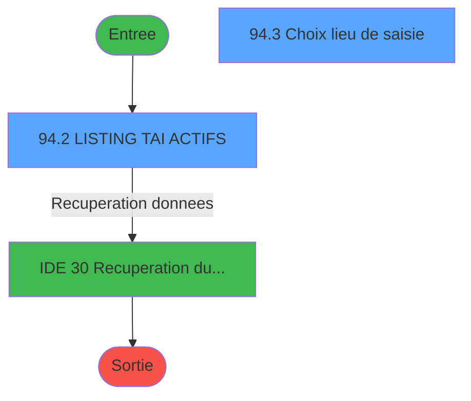
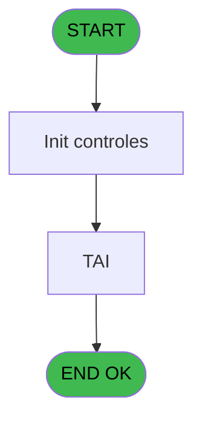
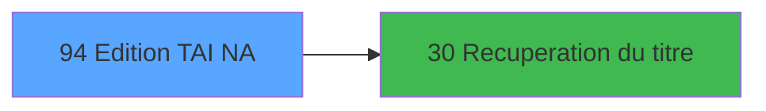

# GES IDE 94 - Edition TAI NA

> **Analyse**: Phases 1-4 2026-02-03 11:48 -> 11:48 (15s) | Assemblage 11:48
> **Pipeline**: V7.2 Enrichi
> **Structure**: 4 onglets (Resume | Ecrans | Donnees | Connexions)

<!-- TAB:Resume -->

## 1. FICHE D'IDENTITE

| Attribut | Valeur |
|----------|--------|
| Projet | GES |
| IDE Position | 94 |
| Nom Programme | Edition TAI NA |
| Fichier source | `Prg_94.xml` |
| Dossier IDE | TAI |
| Taches | 4 (2 ecrans visibles) |
| Tables modifiees | 0 |
| Programmes appeles | 1 |

## 2. DESCRIPTION FONCTIONNELLE

**Edition TAI NA** assure la gestion complete de ce processus, accessible depuis [Create TAI Comptes speciaux (IDE 95)](GES-IDE-95.md).

Le flux de traitement s'organise en **3 blocs fonctionnels** :

- **Traitement** (2 taches) : traitements metier divers
- **Saisie** (1 tache) : ecrans de saisie utilisateur (formulaires, champs, donnees)
- **Calcul** (1 tache) : calculs de montants, stocks ou compteurs

**Logique metier** : 1 regles identifiees couvrant valeurs par defaut.

Detail : phases du traitement

#### Phase 1 : Traitement (2 taches)

- **94** - CV Listing des forfaits TAI **[[ECRAN]](#ecran-t1)**
- **94.2** - LISTING TAI ACTIFS **[[ECRAN]](#ecran-t4)**

Delegue a : [Recuperation du titre (IDE 30)](GES-IDE-30.md)

#### Phase 2 : Calcul (1 tache)

- **94.1** - Lecture date comptable

#### Phase 3 : Saisie (1 tache)

- **94.3** - Choix lieu de saisie **[[ECRAN]](#ecran-t5)**

## 3. BLOCS FONCTIONNELS

### 3.1 Traitement (2 taches)

Traitements internes.

---

#### 94 - CV Listing des forfaits TAI [[ECRAN]](#ecran-t1)

**Role** : Traitement : CV Listing des forfaits TAI.
**Ecran** : 330 x 34 DLU (MDI) | [Voir mockup](#ecran-t1)
**Delegue a** : [Recuperation du titre (IDE 30)](GES-IDE-30.md)

---

#### 94.2 - LISTING TAI ACTIFS [[ECRAN]](#ecran-t4)

**Role** : Traitement : LISTING TAI ACTIFS.
**Ecran** : 429 x 57 DLU (MDI) | [Voir mockup](#ecran-t4)
**Variables liees** : J (W0 TAI NA actifs)
**Delegue a** : [Recuperation du titre (IDE 30)](GES-IDE-30.md)

### 3.2 Calcul (1 tache)

Calculs metier : montants, stocks, compteurs.

---

#### 94.1 - Lecture date comptable

**Role** : Traitement : Lecture date comptable.
**Variables liees** : H (W0 date comptable)

### 3.3 Saisie (1 tache)

L'operateur saisit les donnees de la transaction via 1 ecran (Choix lieu de saisie).

---

#### 94.3 - Choix lieu de saisie [[ECRAN]](#ecran-t5)

**Role** : Saisie des donnees : Choix lieu de saisie.
**Ecran** : 572 x 50 DLU (MDI) | [Voir mockup](#ecran-t5)
**Variables liees** : K (W0 TAI NA saisie en local)

## 5. REGLES METIER

1 regles identifiees:

### Autres (1 regles)

#### [RM-001] Valeur par defaut si P0 societe [A] est vide

| Element | Detail |
|---------|--------|
| **Condition** | `P0 societe [A]=''` |
| **Si vrai** | 'C' |
| **Si faux** | P0 societe [A]) |
| **Variables** | A (P0 societe) |
| **Expression source** | Expression 1 : `IF (P0 societe [A]='','C',P0 societe [A])` |
| **Exemple** | Si P0 societe [A]='' → 'C'. Sinon → P0 societe [A]) |

## 6. CONTEXTE

- **Appele par**: [Create TAI Comptes speciaux (IDE 95)](GES-IDE-95.md)
- **Appelle**: 1 programmes | **Tables**: 4 (W:0 R:2 L:2) | **Taches**: 4 | **Expressions**: 2

<!-- TAB:Ecrans -->

## 8. ECRANS

### 8.1 Forms visibles (2 / 4)

| # | Position | Tache | Nom | Type | Largeur | Hauteur | Bloc |
|---|----------|-------|-----|------|---------|---------|------|
| 1 | 94.2 | 94.2 | LISTING TAI ACTIFS | MDI | 429 | 57 | Traitement |
| 2 | 94.3 | 94.3 | Choix lieu de saisie | MDI | 572 | 50 | Saisie |

### 8.2 Mockups Ecrans

---

#### 94.2 - LISTING TAI ACTIFS
**Tache** : [94.2](#t4) | **Type** : MDI | **Dimensions** : 429 x 57 DLU
**Bloc** : Traitement | **Titre IDE** : LISTING TAI ACTIFS

<!-- FORM-DATA:
{
    "width":  429,
    "vFactor":  8,
    "type":  "MDI",
    "hFactor":  8,
    "controls":  [
                     {
                         "x":  122,
                         "type":  "label",
                         "var":  "",
                         "y":  9,
                         "w":  221,
                         "fmt":  "",
                         "name":  "",
                         "h":  8,
                         "color":  "7",
                         "text":  "Impression en cours ...",
                         "parent":  null
                     },
                     {
                         "x":  2,
                         "type":  "label",
                         "var":  "",
                         "y":  28,
                         "w":  423,
                         "fmt":  "",
                         "name":  "",
                         "h":  27,
                         "color":  "",
                         "text":  "",
                         "parent":  null
                     },
                     {
                         "x":  74,
                         "type":  "label",
                         "var":  "",
                         "y":  37,
                         "w":  280,
                         "fmt":  "",
                         "name":  "",
                         "h":  8,
                         "color":  "",
                         "text":  "LISTING TAI ACTIFS",
                         "parent":  null
                     },
                     {
                         "x":  6,
                         "type":  "image",
                         "var":  "",
                         "y":  1,
                         "w":  72,
                         "fmt":  "",
                         "name":  "",
                         "h":  25,
                         "color":  "",
                         "text":  "",
                         "parent":  null
                     }
                 ],
    "taskId":  "94.2",
    "height":  57
}
-->

---

#### 94.3 - Choix lieu de saisie
**Tache** : [94.3](#t5) | **Type** : MDI | **Dimensions** : 572 x 50 DLU
**Bloc** : Saisie | **Titre IDE** : Choix lieu de saisie

<!-- FORM-DATA:
{
    "width":  572,
    "vFactor":  8,
    "type":  "MDI",
    "hFactor":  8,
    "controls":  [
                     {
                         "x":  7,
                         "type":  "label",
                         "var":  "",
                         "y":  2,
                         "w":  557,
                         "fmt":  "",
                         "name":  "",
                         "h":  47,
                         "color":  "",
                         "text":  "",
                         "parent":  null
                     },
                     {
                         "x":  21,
                         "type":  "checkbox",
                         "var":  "",
                         "y":  9,
                         "w":  235,
                         "fmt":  "",
                         "name":  "TAI NA actifs",
                         "h":  14,
                         "color":  "",
                         "text":  "TAI Actifs",
                         "parent":  null
                     },
                     {
                         "x":  313,
                         "type":  "checkbox",
                         "var":  "",
                         "y":  9,
                         "w":  235,
                         "fmt":  "",
                         "name":  "TAI NA saisis en local",
                         "h":  14,
                         "color":  "",
                         "text":  "TAI NA saisis en local",
                         "parent":  null
                     },
                     {
                         "x":  21,
                         "type":  "button",
                         "var":  "",
                         "y":  29,
                         "w":  176,
                         "fmt":  "",
                         "name":  "Abandon",
                         "h":  17,
                         "color":  "",
                         "text":  "",
                         "parent":  null
                     },
                     {
                         "x":  378,
                         "type":  "button",
                         "var":  "",
                         "y":  29,
                         "w":  176,
                         "fmt":  "",
                         "name":  "Validation",
                         "h":  17,
                         "color":  "",
                         "text":  "",
                         "parent":  null
                     }
                 ],
    "taskId":  "94.3",
    "height":  50
}
-->

<strong>Champs : 2 champs</strong>

| Pos (x,y) | Nom | Variable | Type |
|-----------|-----|----------|------|
| 21,9 | TAI NA actifs | - | checkbox |
| 313,9 | TAI NA saisis en local | - | checkbox |

<strong>Boutons : 2 boutons</strong>

| Bouton | Pos (x,y) | Action |
|--------|-----------|--------|
| Abandon | 21,29 | Annule et retour au menu |
| Validation | 378,29 | Valide la saisie et enregistre |

## 9. NAVIGATION

### 9.1 Enchainement des ecrans

**Detail par enchainement :**

| Depuis | Action | Vers | Retour |
|--------|--------|------|--------|
| LISTING TAI ACTIFS | Recuperation donnees | [Recuperation du titre (IDE 30)](GES-IDE-30.md) | Retour ecran |

### 9.3 Structure hierarchique (4 taches)

| Position | Tache | Type | Dimensions | Bloc |
|----------|-------|------|------------|------|
| **94.1** | [**CV Listing des forfaits TAI** (94)](#t1) [mockup](#ecran-t1) | MDI | 330x34 | Traitement |
| 94.1.1 | [LISTING TAI ACTIFS (94.2)](#t4) [mockup](#ecran-t4) | MDI | 429x57 | |
| **94.2** | [**Lecture date comptable** (94.1)](#t3) | MDI | - | Calcul |
| **94.3** | [**Choix lieu de saisie** (94.3)](#t5) [mockup](#ecran-t5) | MDI | 572x50 | Saisie |

### 9.4 Algorigramme

> **Legende**: Vert = START/END OK | Rouge = END KO | Bleu = Decisions
> *Algorigramme auto-genere. Utiliser `/algorigramme` pour une synthese metier detaillee.*

<!-- TAB:Donnees -->

## 10. TABLES

### Tables utilisees (4)

| ID | Nom | Description | Type | R | W | L | Usages |
|----|-----|-------------|------|---|---|---|--------|
| 30 | gm-recherche_____gmr | Index de recherche | DB | R |   |   | 1 |
| 70 | date_comptable___dat |  | DB | R |   |   | 1 |
| 462 | type_change___________bi |  | DB |   |   | L | 1 |
| 463 | heure_de_passage |  | DB |   |   | L | 1 |

### Colonnes par table (2 / 2 tables avec colonnes identifiees)

Table 30 - gm-recherche_____gmr (R) - 1 usages

| Lettre | Variable | Acces | Type |
|--------|----------|-------|------|
| A | W1 total Origine | R | Numeric |
| B | W1 total montant | R | Numeric |

Table 70 - date_comptable___dat (R) - 1 usages

| Lettre | Variable | Acces | Type |
|--------|----------|-------|------|
| H | W0 date comptable | R | Date |

## 11. VARIABLES

### 11.1 Parametres entrants (7)

Variables recues du programme appelant ([Create TAI Comptes speciaux (IDE 95)](GES-IDE-95.md)).

| Lettre | Nom | Type | Usage dans |
|--------|-----|------|-----------|
| A | P0 societe | Alpha | 1x parametre entrant |
| B | P0 nbre decimales | Numeric | - |
| C | P0 nom village | Alpha | - |
| D | P0 masque cumul | Alpha | - |
| E | P0 devise locale | Alpha | - |
| F | P0 compte | Numeric | - |
| G | P0 filiation | Numeric | - |

### 11.2 Variables de travail (5)

Variables internes au programme.

| Lettre | Nom | Type | Usage dans |
|--------|-----|------|-----------|
| H | W0 date comptable | Date | - |
| I | W0 fin tache | Alpha | - |
| J | W0 TAI NA actifs | Logical | - |
| K | W0 TAI NA saisie en local | Logical | - |
| L | W0 confirmation edition | Logical | - |

## 12. EXPRESSIONS

**2 / 2 expressions decodees (100%)**

### 12.1 Repartition par type

| Type | Expressions | Regles |
|------|-------------|--------|
| CONDITION | 1 | 5 |
| OTHER | 1 | 0 |

### 12.2 Expressions cles par type

#### CONDITION (1 expressions)

| Type | IDE | Expression | Regle |
|------|-----|------------|-------|
| CONDITION | 1 | `IF (P0 societe [A]='','C',P0 societe [A])` | [RM-001](#rm-RM-001) |

#### OTHER (1 expressions)

| Type | IDE | Expression | Regle |
|------|-----|------------|-------|
| OTHER | 2 | `[M]` | - |

<!-- TAB:Connexions -->

## 13. GRAPHE D'APPELS

### 13.1 Chaine depuis Main (Callers)

Main -> ... -> [Create TAI Comptes speciaux (IDE 95)](GES-IDE-95.md) -> **Edition TAI NA (IDE 94)**

### 13.2 Callers

| IDE | Nom Programme | Nb Appels |
|-----|---------------|-----------|
| [95](GES-IDE-95.md) | Create TAI Comptes speciaux | 1 |

### 13.3 Callees (programmes appeles)

### 13.4 Detail Callees avec contexte

| IDE | Nom Programme | Appels | Contexte |
|-----|---------------|--------|----------|
| [30](GES-IDE-30.md) | Recuperation du titre | 1 | Recuperation donnees |

## 14. RECOMMANDATIONS MIGRATION

### 14.1 Profil du programme

| Metrique | Valeur | Impact migration |
|----------|--------|-----------------|
| Lignes de logique | 86 | Programme compact |
| Expressions | 2 | Peu de logique |
| Tables WRITE | 0 | Impact faible |
| Sous-programmes | 1 | Peu de dependances |
| Ecrans visibles | 2 | Quelques ecrans |
| Code desactive | 0% (0 / 86) | Code sain |
| Regles metier | 1 | Quelques regles a preserver |

### 14.2 Plan de migration par bloc

#### Traitement (2 taches: 2 ecrans, 0 traitement)

- **Strategie** : 2 composant(s) UI (Razor/React) avec formulaires et validation.
- 1 sous-programme(s) a migrer ou a reutiliser depuis les services existants.
- Decomposer les taches en services unitaires testables.

#### Calcul (1 tache: 0 ecran, 1 traitement)

- **Strategie** : Services de calcul purs (Domain Services).
- Migrer la logique de calcul (stock, compteurs, montants)

#### Saisie (1 tache: 1 ecran, 0 traitement)

- **Strategie** : Formulaire React/Blazor avec validation Zod/FluentValidation.
- Reproduire 1 ecran : Choix lieu de saisie
- Validation temps reel cote client + serveur

### 14.3 Dependances critiques

| Dependance | Type | Appels | Impact |
|------------|------|--------|--------|
| [Recuperation du titre (IDE 30)](GES-IDE-30.md) | Sous-programme | 1x | Normale - Recuperation donnees |

---
*Spec DETAILED generee par Pipeline V7.2 - 2026-02-03 11:48*
