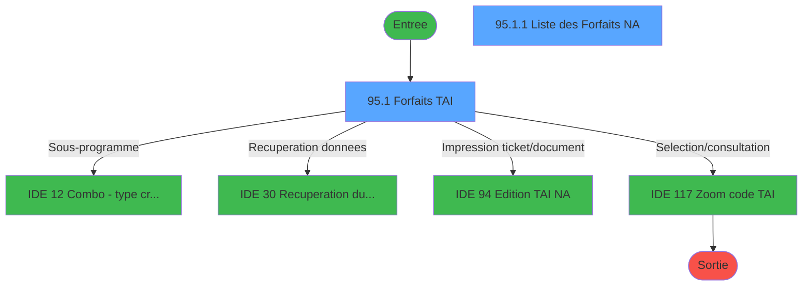
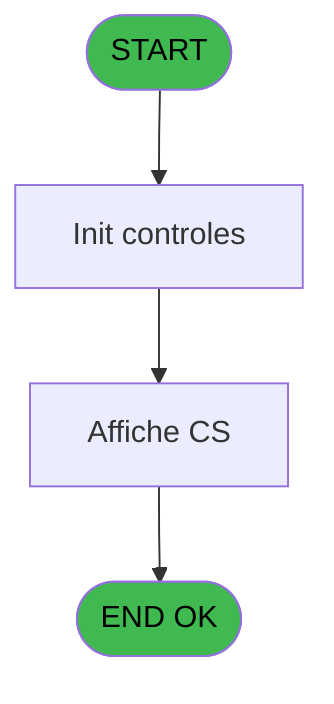
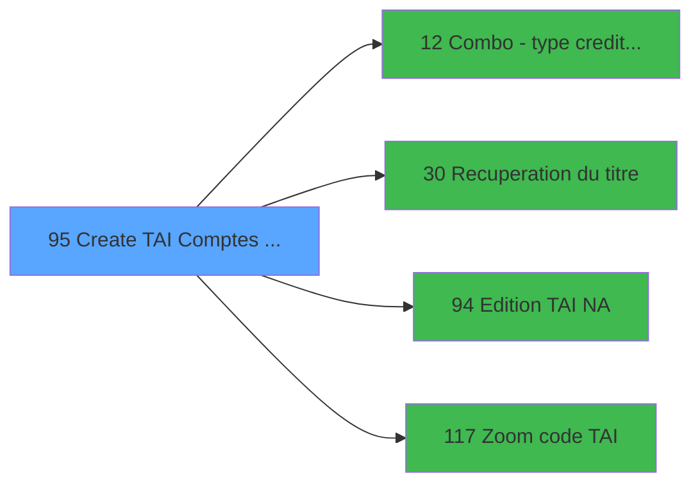

# GES IDE 95 - Create TAI Comptes speciaux

> **Analyse**: Phases 1-4 2026-02-03 11:48 -> 11:49 (15s) | Assemblage 11:49
> **Pipeline**: V7.2 Enrichi
> **Structure**: 4 onglets (Resume | Ecrans | Donnees | Connexions)

<!-- TAB:Resume -->

## 1. FICHE D'IDENTITE

| Attribut | Valeur |
|----------|--------|
| Projet | GES |
| IDE Position | 95 |
| Nom Programme | Create TAI Comptes speciaux |
| Fichier source | `Prg_95.xml` |
| Dossier IDE | TAI |
| Taches | 5 (2 ecrans visibles) |
| Tables modifiees | 0 |
| Programmes appeles | 4 |

## 2. DESCRIPTION FONCTIONNELLE

**Create TAI Comptes speciaux** assure la gestion complete de ce processus, accessible depuis [Comptes speciaux (IDE 48)](GES-IDE-48.md).

Le flux de traitement s'organise en **2 blocs fonctionnels** :

- **Traitement** (4 taches) : traitements metier divers
- **Creation** (1 tache) : insertion d'enregistrements en base (mouvements, prestations)

Detail : phases du traitement

#### Phase 1 : Traitement (4 taches)

- **95** - Gratuites GM
- **95.1** - Forfaits TAI **[[ECRAN]](#ecran-t2)**
- **95.1.1** - Liste des Forfaits NA **[[ECRAN]](#ecran-t3)**
- **95.1.2** - Existe Forfait ?

Delegue a : [Combo - type credit conso (IDE 12)](GES-IDE-12.md), [Recuperation du titre (IDE 30)](GES-IDE-30.md)

#### Phase 2 : Creation (1 tache)

- **95.2** - Creation TAIGM

## 3. BLOCS FONCTIONNELS

### 3.1 Traitement (4 taches)

Traitements internes.

---

#### 95 - Gratuites GM

**Role** : Traitement : Gratuites GM.

3 sous-taches directes

| Tache | Nom | Bloc |
|-------|-----|------|
| [95.1](#t2) | Forfaits TAI **[[ECRAN]](#ecran-t2)** | Traitement |
| [95.1.1](#t3) | Liste des Forfaits NA **[[ECRAN]](#ecran-t3)** | Traitement |
| [95.1.2](#t4) | Existe Forfait ? | Traitement |

**Delegue a** : [Combo - type credit conso (IDE 12)](GES-IDE-12.md), [Recuperation du titre (IDE 30)](GES-IDE-30.md)

---

#### 95.1 - Forfaits TAI [[ECRAN]](#ecran-t2)

**Role** : Traitement : Forfaits TAI.
**Ecran** : 1260 x 314 DLU (MDI) | [Voir mockup](#ecran-t2)
**Delegue a** : [Combo - type credit conso (IDE 12)](GES-IDE-12.md), [Recuperation du titre (IDE 30)](GES-IDE-30.md)

---

#### 95.1.1 - Liste des Forfaits NA [[ECRAN]](#ecran-t3)

**Role** : Traitement : Liste des Forfaits NA.
**Ecran** : 796 x 90 DLU (Modal) | [Voir mockup](#ecran-t3)
**Delegue a** : [Combo - type credit conso (IDE 12)](GES-IDE-12.md), [Recuperation du titre (IDE 30)](GES-IDE-30.md)

---

#### 95.1.2 - Existe Forfait ?

**Role** : Traitement : Existe Forfait ?.
**Variables liees** : X (v.code forfait)
**Delegue a** : [Combo - type credit conso (IDE 12)](GES-IDE-12.md), [Recuperation du titre (IDE 30)](GES-IDE-30.md)

### 3.2 Creation (1 tache)

Insertion de nouveaux enregistrements en base.

---

#### 95.2 - Creation TAIGM

**Role** : Creation d'enregistrement : Creation TAIGM.
**Variables liees** : U (v.confirmation creation)

## 5. REGLES METIER

*(Aucune regle metier identifiee)*

## 6. CONTEXTE

- **Appele par**: [Comptes speciaux (IDE 48)](GES-IDE-48.md)
- **Appelle**: 4 programmes | **Tables**: 5 (W:0 R:4 L:3) | **Taches**: 5 | **Expressions**: 11

<!-- TAB:Ecrans -->

## 8. ECRANS

### 8.1 Forms visibles (2 / 5)

| # | Position | Tache | Nom | Type | Largeur | Hauteur | Bloc |
|---|----------|-------|-----|------|---------|---------|------|
| 1 | 95.1 | 95.1 | Forfaits TAI | MDI | 1260 | 314 | Traitement |
| 2 | 95.1.1 | 95.1.1 | Liste des Forfaits NA | Modal | 796 | 90 | Traitement |

### 8.2 Mockups Ecrans

---

#### 95.1 - Forfaits TAI
**Tache** : [95.1](#t2) | **Type** : MDI | **Dimensions** : 1260 x 314 DLU
**Bloc** : Traitement | **Titre IDE** : Forfaits TAI

<!-- FORM-DATA:
{
    "width":  1260,
    "vFactor":  8,
    "type":  "MDI",
    "hFactor":  8,
    "controls":  [
                     {
                         "x":  0,
                         "type":  "label",
                         "var":  "",
                         "y":  1,
                         "w":  1261,
                         "fmt":  "",
                         "name":  "",
                         "h":  18,
                         "color":  "",
                         "text":  "",
                         "parent":  null
                     },
                     {
                         "x":  195,
                         "type":  "table",
                         "var":  "",
                         "name":  "",
                         "titleH":  15,
                         "color":  "6",
                         "w":  870,
                         "y":  25,
                         "fmt":  "",
                         "parent":  null,
                         "text":  "",
                         "rowH":  15,
                         "h":  119,
                         "cols":  [
                                      {
                                          "title":  "Nom",
                                          "layer":  1,
                                          "w":  214
                                      },
                                      {
                                          "title":  "Prénom",
                                          "layer":  2,
                                          "w":  140
                                      },
                                      {
                                          "title":  "Date début",
                                          "layer":  3,
                                          "w":  147
                                      },
                                      {
                                          "title":  "Date fin",
                                          "layer":  4,
                                          "w":  147
                                      },
                                      {
                                          "title":  "TAI actif",
                                          "layer":  5,
                                          "w":  191
                                      }
                                  ],
                         "rows":  5
                     },
                     {
                         "x":  44,
                         "type":  "label",
                         "var":  "",
                         "y":  26,
                         "w":  1178,
                         "fmt":  "",
                         "name":  "",
                         "h":  14,
                         "color":  "5",
                         "text":  "",
                         "parent":  null
                     },
                     {
                         "x":  475,
                         "type":  "label",
                         "var":  "",
                         "y":  145,
                         "w":  285,
                         "fmt":  "",
                         "name":  "",
                         "h":  35,
                         "color":  "",
                         "text":  "Saisie",
                         "parent":  null
                     },
                     {
                         "x":  773,
                         "type":  "label",
                         "var":  "",
                         "y":  145,
                         "w":  287,
                         "fmt":  "",
                         "name":  "",
                         "h":  35,
                         "color":  "",
                         "text":  "Impression",
                         "parent":  null
                     },
                     {
                         "x":  399,
                         "type":  "label",
                         "var":  "",
                         "y":  184,
                         "w":  462,
                         "fmt":  "",
                         "name":  "",
                         "h":  12,
                         "color":  "142",
                         "text":  "Forfait TAI",
                         "parent":  null
                     },
                     {
                         "x":  0,
                         "type":  "label",
                         "var":  "",
                         "y":  293,
                         "w":  1261,
                         "fmt":  "",
                         "name":  "",
                         "h":  21,
                         "color":  "",
                         "text":  "",
                         "parent":  null
                     },
                     {
                         "x":  1088,
                         "type":  "button",
                         "var":  "",
                         "y":  295,
                         "w":  168,
                         "fmt":  "",
                         "name":  "bouton Quitter",
                         "h":  18,
                         "color":  "",
                         "text":  "",
                         "parent":  null
                     },
                     {
                         "x":  203,
                         "type":  "edit",
                         "var":  "",
                         "y":  42,
                         "w":  200,
                         "fmt":  "",
                         "name":  "SPC Nom",
                         "h":  11,
                         "color":  "6",
                         "text":  "",
                         "parent":  4
                     },
                     {
                         "x":  419,
                         "type":  "edit",
                         "var":  "",
                         "y":  42,
                         "w":  122,
                         "fmt":  "",
                         "name":  "SPC Prenom",
                         "h":  11,
                         "color":  "6",
                         "text":  "",
                         "parent":  4
                     },
                     {
                         "x":  563,
                         "type":  "edit",
                         "var":  "",
                         "y":  42,
                         "w":  120,
                         "fmt":  "DD/MM/YYYY",
                         "name":  "",
                         "h":  11,
                         "color":  "6",
                         "text":  "",
                         "parent":  4
                     },
                     {
                         "x":  714,
                         "type":  "edit",
                         "var":  "",
                         "y":  42,
                         "w":  120,
                         "fmt":  "DD/MM/YYYY",
                         "name":  "",
                         "h":  11,
                         "color":  "6",
                         "text":  "",
                         "parent":  4
                     },
                     {
                         "x":  14,
                         "type":  "edit",
                         "var":  "",
                         "y":  5,
                         "w":  396,
                         "fmt":  "30",
                         "name":  "",
                         "h":  11,
                         "color":  "",
                         "text":  "",
                         "parent":  null
                     },
                     {
                         "x":  950,
                         "type":  "edit",
                         "var":  "",
                         "y":  5,
                         "w":  298,
                         "fmt":  "WWW DD MMM YYYYT",
                         "name":  "",
                         "h":  11,
                         "color":  "",
                         "text":  "",
                         "parent":  null
                     },
                     {
                         "x":  874,
                         "type":  "edit",
                         "var":  "",
                         "y":  42,
                         "w":  154,
                         "fmt":  "30",
                         "name":  "",
                         "h":  11,
                         "color":  "6",
                         "text":  "",
                         "parent":  4
                     },
                     {
                         "x":  484,
                         "type":  "button",
                         "var":  "",
                         "y":  159,
                         "w":  129,
                         "fmt":  "Individuel",
                         "name":  "GI",
                         "h":  18,
                         "color":  "",
                         "text":  "",
                         "parent":  null
                     },
                     {
                         "x":  787,
                         "type":  "button",
                         "var":  "",
                         "y":  159,
                         "w":  129,
                         "fmt":  "Individuel",
                         "name":  "HI",
                         "h":  18,
                         "color":  "",
                         "text":  "",
                         "parent":  null
                     }
                 ],
    "taskId":  "95.1",
    "height":  314
}
-->

<strong>Champs : 7 champs</strong>

| Pos (x,y) | Nom | Variable | Type |
|-----------|-----|----------|------|
| 203,42 | SPC Nom | - | edit |
| 419,42 | SPC Prenom | - | edit |
| 563,42 | DD/MM/YYYY | - | edit |
| 714,42 | DD/MM/YYYY | - | edit |
| 14,5 | 30 | - | edit |
| 950,5 | WWW DD MMM YYYYT | - | edit |
| 874,42 | 30 | - | edit |

<strong>Boutons : 3 boutons</strong>

| Bouton | Pos (x,y) | Action |
|--------|-----------|--------|
| Quitter | 1088,295 | Quitte le programme |
| Individuel | 484,159 | Bouton fonctionnel |
| Individuel | 787,159 | Bouton fonctionnel |

---

#### 95.1.1 - Liste des Forfaits NA
**Tache** : [95.1.1](#t3) | **Type** : Modal | **Dimensions** : 796 x 90 DLU
**Bloc** : Traitement | **Titre IDE** : Liste des Forfaits NA

<!-- FORM-DATA:
{
    "width":  796,
    "vFactor":  8,
    "type":  "Modal",
    "hFactor":  8,
    "controls":  [
                     {
                         "x":  5,
                         "type":  "table",
                         "var":  "",
                         "name":  "",
                         "titleH":  12,
                         "color":  "110",
                         "w":  790,
                         "y":  0,
                         "fmt":  "",
                         "parent":  null,
                         "text":  "",
                         "rowH":  12,
                         "h":  51,
                         "cols":  [
                                      {
                                          "title":  "Code",
                                          "layer":  1,
                                          "w":  90
                                      },
                                      {
                                          "title":  "Libellé Forfait",
                                          "layer":  2,
                                          "w":  152
                                      },
                                      {
                                          "title":  "Date début",
                                          "layer":  3,
                                          "w":  117
                                      },
                                      {
                                          "title":  "Date fin",
                                          "layer":  4,
                                          "w":  114
                                      },
                                      {
                                          "title":  "Nom",
                                          "layer":  5,
                                          "w":  175
                                      },
                                      {
                                          "title":  "Compte",
                                          "layer":  6,
                                          "w":  108
                                      }
                                  ],
                         "rows":  6
                     },
                     {
                         "x":  254,
                         "type":  "edit",
                         "var":  "",
                         "y":  14,
                         "w":  107,
                         "fmt":  "",
                         "name":  "",
                         "h":  10,
                         "color":  "110",
                         "text":  "",
                         "parent":  1
                     },
                     {
                         "x":  371,
                         "type":  "edit",
                         "var":  "",
                         "y":  14,
                         "w":  104,
                         "fmt":  "",
                         "name":  "",
                         "h":  10,
                         "color":  "110",
                         "text":  "",
                         "parent":  1
                     },
                     {
                         "x":  13,
                         "type":  "edit",
                         "var":  "",
                         "y":  14,
                         "w":  76,
                         "fmt":  "",
                         "name":  "TAI Code Forfait",
                         "h":  10,
                         "color":  "110",
                         "text":  "",
                         "parent":  1
                     },
                     {
                         "x":  2,
                         "type":  "edit",
                         "var":  "",
                         "y":  54,
                         "w":  88,
                         "fmt":  "",
                         "name":  "",
                         "h":  10,
                         "color":  "2",
                         "text":  "",
                         "parent":  null
                     },
                     {
                         "x":  633,
                         "type":  "edit",
                         "var":  "",
                         "y":  76,
                         "w":  144,
                         "fmt":  "N12.3Z",
                         "name":  "",
                         "h":  10,
                         "color":  "2",
                         "text":  "",
                         "parent":  null
                     },
                     {
                         "x":  2,
                         "type":  "button",
                         "var":  "",
                         "y":  71,
                         "w":  168,
                         "fmt":  "",
                         "name":  "Bouton Supprimer",
                         "h":  18,
                         "color":  "",
                         "text":  "",
                         "parent":  null
                     },
                     {
                         "x":  101,
                         "type":  "edit",
                         "var":  "",
                         "y":  14,
                         "w":  137,
                         "fmt":  "30",
                         "name":  "",
                         "h":  10,
                         "color":  "110",
                         "text":  "",
                         "parent":  1
                     },
                     {
                         "x":  483,
                         "type":  "edit",
                         "var":  "",
                         "y":  14,
                         "w":  165,
                         "fmt":  "30",
                         "name":  "",
                         "h":  10,
                         "color":  "110",
                         "text":  "",
                         "parent":  1
                     },
                     {
                         "x":  659,
                         "type":  "edit",
                         "var":  "",
                         "y":  14,
                         "w":  96,
                         "fmt":  "30",
                         "name":  "",
                         "h":  10,
                         "color":  "110",
                         "text":  "",
                         "parent":  1
                     },
                     {
                         "x":  96,
                         "type":  "edit",
                         "var":  "",
                         "y":  54,
                         "w":  168,
                         "fmt":  "30",
                         "name":  "",
                         "h":  10,
                         "color":  "",
                         "text":  "",
                         "parent":  null
                     },
                     {
                         "x":  633,
                         "type":  "edit",
                         "var":  "",
                         "y":  54,
                         "w":  144,
                         "fmt":  "30",
                         "name":  "",
                         "h":  10,
                         "color":  "2",
                         "text":  "",
                         "parent":  null
                     },
                     {
                         "x":  272,
                         "type":  "edit",
                         "var":  "",
                         "y":  76,
                         "w":  360,
                         "fmt":  "100",
                         "name":  "",
                         "h":  10,
                         "color":  "",
                         "text":  "",
                         "parent":  null
                     }
                 ],
    "taskId":  "95.1.1",
    "height":  90
}
-->

<strong>Champs : 11 champs</strong>

| Pos (x,y) | Nom | Variable | Type |
|-----------|-----|----------|------|
| 254,14 | (sans nom) | - | edit |
| 371,14 | (sans nom) | - | edit |
| 13,14 | TAI Code Forfait | - | edit |
| 2,54 | (sans nom) | - | edit |
| 633,76 | N12.3Z | - | edit |
| 101,14 | 30 | - | edit |
| 483,14 | 30 | - | edit |
| 659,14 | 30 | - | edit |
| 96,54 | 30 | - | edit |
| 633,54 | 30 | - | edit |
| 272,76 | 100 | - | edit |

<strong>Boutons : 1 boutons</strong>

| Bouton | Pos (x,y) | Action |
|--------|-----------|--------|
| Supprimer | 2,71 | Supprime l'element selectionne |

## 9. NAVIGATION

### 9.1 Enchainement des ecrans

**Detail par enchainement :**

| Depuis | Action | Vers | Retour |
|--------|--------|------|--------|
| Forfaits TAI | Sous-programme | [Combo - type credit conso (IDE 12)](GES-IDE-12.md) | Retour ecran |
| Forfaits TAI | Recuperation donnees | [Recuperation du titre (IDE 30)](GES-IDE-30.md) | Retour ecran |
| Forfaits TAI | Impression ticket/document | [Edition TAI NA (IDE 94)](GES-IDE-94.md) | Retour ecran |
| Forfaits TAI | Selection/consultation | [Zoom code TAI (IDE 117)](GES-IDE-117.md) | Retour ecran |

### 9.3 Structure hierarchique (5 taches)

| Position | Tache | Type | Dimensions | Bloc |
|----------|-------|------|------------|------|
| **95.1** | [**Gratuites GM** (95)](#t1) | MDI | - | Traitement |
| 95.1.1 | [Forfaits TAI (95.1)](#t2) [mockup](#ecran-t2) | MDI | 1260x314 | |
| 95.1.2 | [Liste des Forfaits NA (95.1.1)](#t3) [mockup](#ecran-t3) | Modal | 796x90 | |
| 95.1.3 | [Existe Forfait ? (95.1.2)](#t4) | MDI | - | |
| **95.2** | [**Creation TAIGM** (95.2)](#t5) | MDI | - | Creation |

### 9.4 Algorigramme

> **Legende**: Vert = START/END OK | Rouge = END KO | Bleu = Decisions
> *Algorigramme auto-genere. Utiliser `/algorigramme` pour une synthese metier detaillee.*

<!-- TAB:Donnees -->

## 10. TABLES

### Tables utilisees (5)

| ID | Nom | Description | Type | R | W | L | Usages |
|----|-----|-------------|------|---|---|---|--------|
| 30 | gm-recherche_____gmr | Index de recherche | DB | R |   |   | 1 |
| 34 | hebergement______heb | Hebergement (chambres) | DB | R |   | L | 2 |
| 462 | type_change___________bi |  | DB |   |   | L | 1 |
| 463 | heure_de_passage |  | DB | R |   | L | 4 |
| 786 | qualite_avant_reprise |  | DB | R |   |   | 1 |

### Colonnes par table (4 / 4 tables avec colonnes identifiees)

Table 30 - gm-recherche_____gmr (R) - 1 usages

| Lettre | Variable | Acces | Type |
|--------|----------|-------|------|
| A | CURSOR | R | Logical |
| B | ConfirmationSuppression | R | Numeric |
| C | Bouton Supprimer | R | Alpha |

Table 34 - hebergement______heb (R/L) - 2 usages

*Table utilisee uniquement en Link ou aucune colonne Real identifiee dans le DataView.*

Table 463 - heure_de_passage (R/L) - 4 usages

| Lettre | Variable | Acces | Type |
|--------|----------|-------|------|
| S | v.heure operation | R | Time |

Table 786 - qualite_avant_reprise (R) - 1 usages

| Lettre | Variable | Acces | Type |
|--------|----------|-------|------|
| A | bouton Quitter | R | Alpha |
| B | v.titre | R | Alpha |
| C | v.existe Forfait Actif | R | Logical |
| D | v.existe Forfait | R | Logical |
| E | v.liste Forfait Affichee | R | Logical |

## 11. VARIABLES

### 11.1 Parametres entrants (10)

Variables recues du programme appelant ([Comptes speciaux (IDE 48)](GES-IDE-48.md)).

| Lettre | Nom | Type | Usage dans |
|--------|-----|------|-----------|
| A | p.societe | Alpha | 1x parametre entrant |
| B | p.decimales | Numeric | - |
| C | p.masque-mtt-compte GM | Alpha | - |
| D | p.code-devise | Alpha | - |
| E | p.nom village | Alpha | - |
| F | p.TAI Obligatoire | Alpha | - |
| G | p.nom-gm | Alpha | - |
| H | p.prenom-gm | Alpha | - |
| I | p.code-gm | Numeric | - |
| J | p.filiation | Numeric | - |

### 11.2 Variables de session (10)

Variables persistantes pendant toute la session.

| Lettre | Nom | Type | Usage dans |
|--------|-----|------|-----------|
| K | v.action | Alpha | - |
| P | v.montant | Numeric | - |
| Q | v.type CS | Alpha | - |
| R | v.date operation | Date | - |
| S | v.heure operation | Time | - |
| T | v.List combo type CS | Alpha | - |
| U | v.confirmation creation | Numeric | [95.2](#t5) |
| V | v.last action sur 2 | Alpha | 2x session |
| W | v.last name | Alpha | - |
| X | v.code forfait | Alpha | - |

### 11.3 Autres (4)

Variables diverses.

| Lettre | Nom | Type | Usage dans |
|--------|-----|------|-----------|
| L | F.qualite | Alpha | - |
| M | F.seminaire | Alpha | - |
| N | F.date du seminaire | Date | - |
| O | F.date au seminaire | Date | - |

Toutes les 24 variables (liste complete)

| Cat | Lettre | Nom Variable | Type |
|-----|--------|--------------|------|
| P0 | **A** | p.societe | Alpha |
| P0 | **B** | p.decimales | Numeric |
| P0 | **C** | p.masque-mtt-compte GM | Alpha |
| P0 | **D** | p.code-devise | Alpha |
| P0 | **E** | p.nom village | Alpha |
| P0 | **F** | p.TAI Obligatoire | Alpha |
| P0 | **G** | p.nom-gm | Alpha |
| P0 | **H** | p.prenom-gm | Alpha |
| P0 | **I** | p.code-gm | Numeric |
| P0 | **J** | p.filiation | Numeric |
| V. | **K** | v.action | Alpha |
| V. | **P** | v.montant | Numeric |
| V. | **Q** | v.type CS | Alpha |
| V. | **R** | v.date operation | Date |
| V. | **S** | v.heure operation | Time |
| V. | **T** | v.List combo type CS | Alpha |
| V. | **U** | v.confirmation creation | Numeric |
| V. | **V** | v.last action sur 2 | Alpha |
| V. | **W** | v.last name | Alpha |
| V. | **X** | v.code forfait | Alpha |
| Autre | **L** | F.qualite | Alpha |
| Autre | **M** | F.seminaire | Alpha |
| Autre | **N** | F.date du seminaire | Date |
| Autre | **O** | F.date au seminaire | Date |

## 12. EXPRESSIONS

**11 / 11 expressions decodees (100%)**

### 12.1 Repartition par type

| Type | Expressions | Regles |
|------|-------------|--------|
| CONSTANTE | 3 | 0 |
| DATE | 1 | 0 |
| CONDITION | 4 | 0 |
| CAST_LOGIQUE | 2 | 0 |
| OTHER | 1 | 0 |

### 12.2 Expressions cles par type

#### CONSTANTE (3 expressions)

| Type | IDE | Expression | Regle |
|------|-----|------------|-------|
| CONSTANTE | 10 | `''` | - |
| CONSTANTE | 3 | `'F'` | - |
| CONSTANTE | 1 | `'C'` | - |

#### DATE (1 expressions)

| Type | IDE | Expression | Regle |
|------|-----|------------|-------|
| DATE | 8 | `Date ()` | - |

#### CONDITION (4 expressions)

| Type | IDE | Expression | Regle |
|------|-----|------------|-------|
| CONDITION | 5 | `v.last action sur 2 [V]='HI'` | - |
| CONDITION | 11 | `v.confirmation creation [U]=6` | - |
| CONDITION | 2 | `p.societe [A]=''` | - |
| CONDITION | 4 | `v.last action sur 2 [V]='GI'` | - |

#### CAST_LOGIQUE (2 expressions)

| Type | IDE | Expression | Regle |
|------|-----|------------|-------|
| CAST_LOGIQUE | 7 | `'TRUE'LOG` | - |
| CAST_LOGIQUE | 6 | `'FALSE'LOG` | - |

#### OTHER (1 expressions)

| Type | IDE | Expression | Regle |
|------|-----|------------|-------|
| OTHER | 9 | `Time ()` | - |

<!-- TAB:Connexions -->

## 13. GRAPHE D'APPELS

### 13.1 Chaine depuis Main (Callers)

Main -> ... -> [Comptes speciaux (IDE 48)](GES-IDE-48.md) -> **Create TAI Comptes speciaux (IDE 95)**

### 13.2 Callers

| IDE | Nom Programme | Nb Appels |
|-----|---------------|-----------|
| [48](GES-IDE-48.md) | Comptes speciaux | 1 |

### 13.3 Callees (programmes appeles)

### 13.4 Detail Callees avec contexte

| IDE | Nom Programme | Appels | Contexte |
|-----|---------------|--------|----------|
| [12](GES-IDE-12.md) | Combo - type credit conso | 1 | Sous-programme |
| [30](GES-IDE-30.md) | Recuperation du titre | 1 | Recuperation donnees |
| [94](GES-IDE-94.md) | Edition TAI NA | 1 | Impression ticket/document |
| [117](GES-IDE-117.md) | Zoom code TAI | 1 | Selection/consultation |

## 14. RECOMMANDATIONS MIGRATION

### 14.1 Profil du programme

| Metrique | Valeur | Impact migration |
|----------|--------|-----------------|
| Lignes de logique | 229 | Taille moyenne |
| Expressions | 11 | Peu de logique |
| Tables WRITE | 0 | Impact faible |
| Sous-programmes | 4 | Peu de dependances |
| Ecrans visibles | 2 | Quelques ecrans |
| Code desactive | 0% (0 / 229) | Code sain |
| Regles metier | 0 | Pas de regle identifiee |

### 14.2 Plan de migration par bloc

#### Traitement (4 taches: 2 ecrans, 2 traitements)

- **Strategie** : Orchestrateur avec 2 ecrans (Razor/React) et 2 traitements backend (services).
- Les ecrans deviennent des composants UI, les traitements invisibles deviennent des services injectables.
- 4 sous-programme(s) a migrer ou a reutiliser depuis les services existants.
- Decomposer les taches en services unitaires testables.

#### Creation (1 tache: 0 ecran, 1 traitement)

- **Strategie** : Repository pattern avec Entity Framework Core.
- Insertion via `IRepository<T>.CreateAsync()`

### 14.3 Dependances critiques

| Dependance | Type | Appels | Impact |
|------------|------|--------|--------|
| [Edition TAI NA (IDE 94)](GES-IDE-94.md) | Sous-programme | 1x | Normale - Impression ticket/document |
| [Zoom code TAI (IDE 117)](GES-IDE-117.md) | Sous-programme | 1x | Normale - Selection/consultation |
| [Combo - type credit conso (IDE 12)](GES-IDE-12.md) | Sous-programme | 1x | Normale - Sous-programme |
| [Recuperation du titre (IDE 30)](GES-IDE-30.md) | Sous-programme | 1x | Normale - Recuperation donnees |

---
*Spec DETAILED generee par Pipeline V7.2 - 2026-02-03 11:49*
