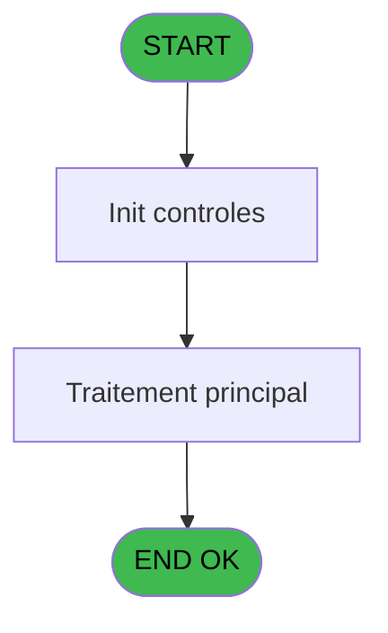
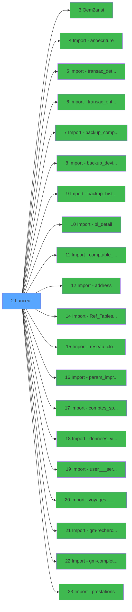

# Import IDE 2 - Lanceur

> **Analyse**: Phases 1-4 2026-02-03 11:58 -> 11:58 (15s) | Assemblage 11:58
> **Pipeline**: V7.2 Enrichi
> **Structure**: 4 onglets (Resume | Ecrans | Donnees | Connexions)

<!-- TAB:Resume -->

## 1. FICHE D'IDENTITE

| Attribut | Valeur |
|----------|--------|
| Projet | Import |
| IDE Position | 2 |
| Nom Programme | Lanceur |
| Fichier source | `Prg_2.xml` |
| Dossier IDE | General |
| Taches | 1 (0 ecrans visibles) |
| Tables modifiees | 0 |
| Programmes appeles | 20 |
| :warning: Statut | **ORPHELIN_POTENTIEL** |

## 2. DESCRIPTION FONCTIONNELLE

**Lanceur** assure la gestion complete de ce processus.

Le flux de traitement s'organise en **1 blocs fonctionnels** :

- **Traitement** (1 tache) : traitements metier divers

## 3. BLOCS FONCTIONNELS

### 3.1 Traitement (1 tache)

Traitements internes.

---

#### 2 - Lanceur

**Role** : Traitement : Lanceur.
**Delegue a** : [Oem2ansi (IDE 3)](Import-IDE-3.md), [Import - anoecriture (IDE 4)](Import-IDE-4.md), [Import - transac_detail_bar (IDE 5)](Import-IDE-5.md)

## 5. REGLES METIER

*(Aucune regle metier identifiee)*

## 6. CONTEXTE

- **Appele par**: (aucun)
- **Appelle**: 20 programmes | **Tables**: 0 (W:0 R:0 L:0) | **Taches**: 1 | **Expressions**: 0

<!-- TAB:Ecrans -->

## 8. ECRANS

*(Programme sans ecran visible)*

## 9. NAVIGATION

### 9.3 Structure hierarchique (1 tache)

| Position | Tache | Type | Dimensions | Bloc |
|----------|-------|------|------------|------|
| **2.1** | [**Lanceur** (2)](#t1) | - | - | Traitement |

### 9.4 Algorigramme

> **Legende**: Vert = START/END OK | Rouge = END KO | Bleu = Decisions
> *Algorigramme auto-genere. Utiliser `/algorigramme` pour une synthese metier detaillee.*

<!-- TAB:Donnees -->

## 10. TABLES

### Tables utilisees (0)

| ID | Nom | Description | Type | R | W | L | Usages |
|----|-----|-------------|------|---|---|---|--------|

### Colonnes par table (0 / 0 tables avec colonnes identifiees)

## 11. VARIABLES

*(Programme sans variables locales mappees)*

## 12. EXPRESSIONS

**0 / 0 expressions decodees (0%)**

### 12.1 Repartition par type

| Type | Expressions | Regles |
|------|-------------|--------|

### 12.2 Expressions cles par type

<!-- TAB:Connexions -->

## 13. GRAPHE D'APPELS

### 13.1 Chaine depuis Main (Callers)

**Chemin**: (pas de callers directs)

### 13.2 Callers

| IDE | Nom Programme | Nb Appels |
|-----|---------------|-----------|
| - | (aucun) | - |

### 13.3 Callees (programmes appeles)

### 13.4 Detail Callees avec contexte

| IDE | Nom Programme | Appels | Contexte |
|-----|---------------|--------|----------|
| [3](Import-IDE-3.md) | Oem2ansi | 1 | Sous-programme |
| [4](Import-IDE-4.md) | Import - anoecriture | 1 | Sous-programme |
| [5](Import-IDE-5.md) | Import - transac_detail_bar | 1 | Sous-programme |
| [6](Import-IDE-6.md) | Import - transac_entete_bar | 1 | Sous-programme |
| [7](Import-IDE-7.md) | Import - backup_compte_gm__cgm | 1 | Sous-programme |
| [8](Import-IDE-8.md) | Import - backup_devises_caisse | 1 | Sous-programme |
| [9](Import-IDE-9.md) | Import - backup_histo_sessions | 1 | Historique/consultation |
| [10](Import-IDE-10.md) | Import - bl_detail | 1 | Sous-programme |
| [11](Import-IDE-11.md) | Import - comptable_-_suivi_pil | 1 | Sous-programme |
| [12](Import-IDE-12.md) | Import - address | 1 | Sous-programme |
| [14](Import-IDE-14.md) | Import - Ref_Tables.address_da | 1 | Sous-programme |
| [15](Import-IDE-15.md) | Import - reseau_cloture___rec | 1 | Fermeture session |
| [16](Import-IDE-16.md) | Import - param_imprimante_pim | 1 | Impression ticket/document |
| [17](Import-IDE-17.md) | Import - comptes_speciaux_spc | 1 | Sous-programme |
| [18](Import-IDE-18.md) | Import - donnees_village__dvi | 1 | Sous-programme |
| [19](Import-IDE-19.md) | Import - user___service___uss | 1 | Sous-programme |
| [20](Import-IDE-20.md) | Import - voyages__________voy | 1 | Sous-programme |
| [21](Import-IDE-21.md) | Import - gm-recherche_____gmr | 1 | Sous-programme |
| [22](Import-IDE-22.md) | Import - gm-complet_______gmc | 1 | Sous-programme |
| [23](Import-IDE-23.md) | Import - prestations | 1 | Sous-programme |

## 14. RECOMMANDATIONS MIGRATION

### 14.1 Profil du programme

| Metrique | Valeur | Impact migration |
|----------|--------|-----------------|
| Lignes de logique | 450 | Taille moyenne |
| Expressions | 0 | Peu de logique |
| Tables WRITE | 0 | Impact faible |
| Sous-programmes | 20 | Forte dependance |
| Ecrans visibles | 0 | Ecran unique ou traitement batch |
| Code desactive | 0% (0 / 450) | Code sain |
| Regles metier | 0 | Pas de regle identifiee |

### 14.2 Plan de migration par bloc

#### Traitement (1 tache: 0 ecran, 1 traitement)

- **Strategie** : 1 service(s) backend injectable(s) (Domain Services).
- 20 sous-programme(s) a migrer ou a reutiliser depuis les services existants.
- Decomposer les taches en services unitaires testables.

### 14.3 Dependances critiques

| Dependance | Type | Appels | Impact |
|------------|------|--------|--------|
| [Import - comptes_speciaux_spc (IDE 17)](Import-IDE-17.md) | Sous-programme | 1x | Normale - Sous-programme |
| [Import - donnees_village__dvi (IDE 18)](Import-IDE-18.md) | Sous-programme | 1x | Normale - Sous-programme |
| [Import - param_imprimante_pim (IDE 16)](Import-IDE-16.md) | Sous-programme | 1x | Normale - Impression ticket/document |
| [Import - Ref_Tables.address_da (IDE 14)](Import-IDE-14.md) | Sous-programme | 1x | Normale - Sous-programme |
| [Import - reseau_cloture___rec (IDE 15)](Import-IDE-15.md) | Sous-programme | 1x | Normale - Fermeture session |
| [Import - gm-complet_______gmc (IDE 22)](Import-IDE-22.md) | Sous-programme | 1x | Normale - Sous-programme |
| [Import - prestations (IDE 23)](Import-IDE-23.md) | Sous-programme | 1x | Normale - Sous-programme |
| [Import - gm-recherche_____gmr (IDE 21)](Import-IDE-21.md) | Sous-programme | 1x | Normale - Sous-programme |
| [Import - user___service___uss (IDE 19)](Import-IDE-19.md) | Sous-programme | 1x | Normale - Sous-programme |
| [Import - voyages__________voy (IDE 20)](Import-IDE-20.md) | Sous-programme | 1x | Normale - Sous-programme |

---
*Spec DETAILED generee par Pipeline V7.2 - 2026-02-03 11:58*
