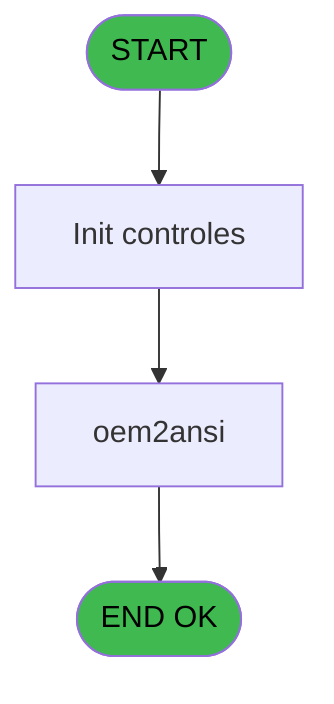

# Import IDE 3 - Oem2ansi

> **Analyse**: Phases 1-4 2026-02-03 11:58 -> 11:59 (18s) | Assemblage 11:59
> **Pipeline**: V7.2 Enrichi
> **Structure**: 4 onglets (Resume | Ecrans | Donnees | Connexions)

<!-- TAB:Resume -->

## 1. FICHE D'IDENTITE

| Attribut | Valeur |
|----------|--------|
| Projet | Import |
| IDE Position | 3 |
| Nom Programme | Oem2ansi |
| Fichier source | `Prg_3.xml` |
| Dossier IDE | General |
| Taches | 2 (0 ecrans visibles) |
| Tables modifiees | 0 |
| Programmes appeles | 0 |

## 2. DESCRIPTION FONCTIONNELLE

**Oem2ansi** assure la gestion complete de ce processus, accessible depuis [Lanceur (IDE 2)](Import-IDE-2.md).

Le flux de traitement s'organise en **1 blocs fonctionnels** :

- **Traitement** (2 taches) : traitements metier divers

## 3. BLOCS FONCTIONNELS

### 3.1 Traitement (2 taches)

Traitements internes.

---

#### 3 - Oem2ansi

**Role** : Traitement : Oem2ansi.

---

#### 3.1 - oem2ansi

**Role** : Traitement : oem2ansi.

## 5. REGLES METIER

*(Aucune regle metier identifiee)*

## 6. CONTEXTE

- **Appele par**: [Lanceur (IDE 2)](Import-IDE-2.md)
- **Appelle**: 0 programmes | **Tables**: 0 (W:0 R:0 L:0) | **Taches**: 2 | **Expressions**: 14

<!-- TAB:Ecrans -->

## 8. ECRANS

*(Programme sans ecran visible)*

## 9. NAVIGATION

### 9.3 Structure hierarchique (2 taches)

| Position | Tache | Type | Dimensions | Bloc |
|----------|-------|------|------------|------|
| **3.1** | [**Oem2ansi** (3)](#t1) | - | - | Traitement |
| 3.1.1 | [oem2ansi (3.1)](#t2) | - | - | |

### 9.4 Algorigramme

> **Legende**: Vert = START/END OK | Rouge = END KO | Bleu = Decisions
> *Algorigramme auto-genere. Utiliser `/algorigramme` pour une synthese metier detaillee.*

<!-- TAB:Donnees -->

## 10. TABLES

### Tables utilisees (0)

| ID | Nom | Description | Type | R | W | L | Usages |
|----|-----|-------------|------|---|---|---|--------|

### Colonnes par table (0 / 0 tables avec colonnes identifiees)

## 11. VARIABLES

### 11.1 Variables de session (2)

Variables persistantes pendant toute la session.

| Lettre | Nom | Type | Usage dans |
|--------|-----|------|-----------|
| A | V.buffer lec | Alpha | - |
| B | V.Buffer ecr | Alpha | - |

## 12. EXPRESSIONS

**14 / 14 expressions decodees (100%)**

### 12.1 Repartition par type

| Type | Expressions | Regles |
|------|-------------|--------|
| CALCUL | 1 | 0 |
| CONCATENATION | 11 | 0 |
| CALCULATION | 1 | 0 |
| NEGATION | 1 | 0 |

### 12.2 Expressions cles par type

#### CALCUL (1 expressions)

| Type | IDE | Expression | Regle |
|------|-----|------------|-------|
| CALCUL | 1 | `'cmd /c DIR '&Trim(Translate('%export%'))&'*.TXT/B>'&INIGet ('[MAGIC_LOGICAL_NAMES]export')&'listfic.txt'` | - |

#### CONCATENATION (11 expressions)

| Type | IDE | Expression | Regle |
|------|-----|------------|-------|
| CONCATENATION | 9 | `'cmd /c copy '&Trim(Translate('%export%'))&'caisse_compte_charge.TXT '&Trim(Translate('%import%'))` | - |
| CONCATENATION | 8 | `'cmd /c copy '&Trim(Translate('%export%'))&'caisse_compte_bilan.TXT '&Trim(Translate('%import%'))` | - |
| CONCATENATION | 10 | `'cmd /c copy '&Trim(Translate('%export%'))&'caisse_Central_Plan_Comptable_Histo.TXT '&Trim(Translate('%import%'))` | - |
| CONCATENATION | 12 | `'cmd /c copy '&Trim(Translate('%export%'))&'cafil043.TXT '&Trim(Translate('%import%'))` | - |
| CONCATENATION | 11 | `'cmd /c copy '&Trim(Translate('%export%'))&'caisse_Central_Plan_Comptable.TXT '&Trim(Translate('%import%'))` | - |
| ... | | *+6 autres* | |

#### CALCULATION (1 expressions)

| Type | IDE | Expression | Regle |
|------|-----|------------|-------|
| CALCULATION | 14 | `'cmd /c mkdir '&Trim(Translate('%import%'))` | - |

#### NEGATION (1 expressions)

| Type | IDE | Expression | Regle |
|------|-----|------------|-------|
| NEGATION | 13 | `NOT FileExist(Translate('%import%'))` | - |

<!-- TAB:Connexions -->

## 13. GRAPHE D'APPELS

### 13.1 Chaine depuis Main (Callers)

Main -> ... -> [Lanceur (IDE 2)](Import-IDE-2.md) -> **Oem2ansi (IDE 3)**

### 13.2 Callers

| IDE | Nom Programme | Nb Appels |
|-----|---------------|-----------|
| [2](Import-IDE-2.md) | Lanceur | 1 |

### 13.3 Callees (programmes appeles)

### 13.4 Detail Callees avec contexte

| IDE | Nom Programme | Appels | Contexte |
|-----|---------------|--------|----------|
| - | (aucun) | - | - |

## 14. RECOMMANDATIONS MIGRATION

### 14.1 Profil du programme

| Metrique | Valeur | Impact migration |
|----------|--------|-----------------|
| Lignes de logique | 32 | Programme compact |
| Expressions | 14 | Peu de logique |
| Tables WRITE | 0 | Impact faible |
| Sous-programmes | 0 | Peu de dependances |
| Ecrans visibles | 0 | Ecran unique ou traitement batch |
| Code desactive | 0% (0 / 32) | Code sain |
| Regles metier | 0 | Pas de regle identifiee |

### 14.2 Plan de migration par bloc

#### Traitement (2 taches: 0 ecran, 2 traitements)

- **Strategie** : 2 service(s) backend injectable(s) (Domain Services).
- Decomposer les taches en services unitaires testables.

### 14.3 Dependances critiques

| Dependance | Type | Appels | Impact |
|------------|------|--------|--------|

---
*Spec DETAILED generee par Pipeline V7.2 - 2026-02-03 11:59*
