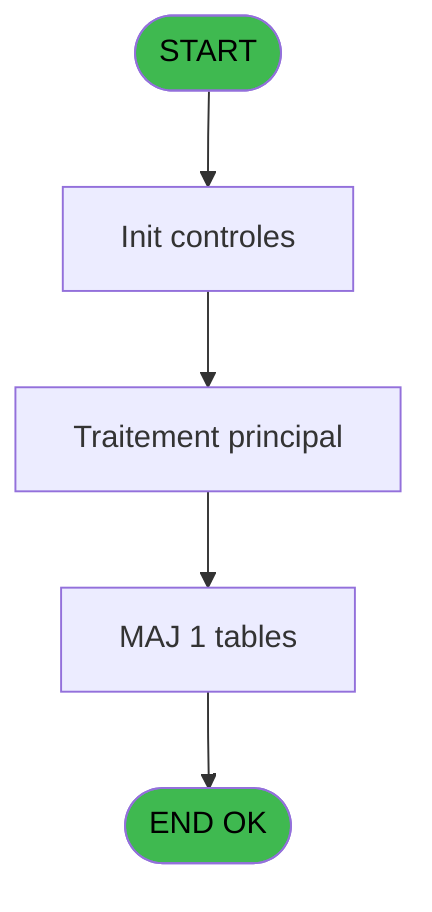

# Import IDE 315 - Import - pms_village+

> **Analyse**: Phases 1-4 2026-02-03 13:54 -> 13:54 (16s) | Assemblage 13:54
> **Pipeline**: V7.2 Enrichi
> **Structure**: 4 onglets (Resume | Ecrans | Donnees | Connexions)

<!-- TAB:Resume -->

## 1. FICHE D'IDENTITE

| Attribut | Valeur |
|----------|--------|
| Projet | Import |
| IDE Position | 315 |
| Nom Programme | Import - pms_village+ |
| Fichier source | `Prg_315.xml` |
| Dossier IDE | General |
| Taches | 1 (0 ecrans visibles) |
| Tables modifiees | 1 |
| Programmes appeles | 0 |

## 2. DESCRIPTION FONCTIONNELLE

**Import - pms_village+** assure la gestion complete de ce processus, accessible depuis [Lanceur (IDE 2)](Import-IDE-2.md).

Le flux de traitement s'organise en **1 blocs fonctionnels** :

- **Traitement** (1 tache) : traitements metier divers

**Donnees modifiees** : 1 tables en ecriture (pv_budget).

## 3. BLOCS FONCTIONNELS

### 3.1 Traitement (1 tache)

Traitements internes.

---

#### 315 - Import - pms_village+

**Role** : Traitement : Import - pms_village+.

## 5. REGLES METIER

*(Aucune regle metier identifiee)*

## 6. CONTEXTE

- **Appele par**: [Lanceur (IDE 2)](Import-IDE-2.md)
- **Appelle**: 0 programmes | **Tables**: 1 (W:1 R:0 L:0) | **Taches**: 1 | **Expressions**: 14

<!-- TAB:Ecrans -->

## 8. ECRANS

*(Programme sans ecran visible)*

## 9. NAVIGATION

### 9.3 Structure hierarchique (1 tache)

| Position | Tache | Type | Dimensions | Bloc |
|----------|-------|------|------------|------|
| **315.1** | [**Import - pms_village+** (315)](#t1) | - | - | Traitement |

### 9.4 Algorigramme

> **Legende**: Vert = START/END OK | Rouge = END KO | Bleu = Decisions
> *Algorigramme auto-genere. Utiliser `/algorigramme` pour une synthese metier detaillee.*

<!-- TAB:Donnees -->

## 10. TABLES

### Tables utilisees (1)

| ID | Nom | Description | Type | R | W | L | Usages |
|----|-----|-------------|------|---|---|---|--------|
| 372 | pv_budget |  | DB |   | **W** |   | 1 |

### Colonnes par table (1 / 1 tables avec colonnes identifiees)

Table 372 - pv_budget (**W**) - 1 usages

| Lettre | Variable | Acces | Type |
|--------|----------|-------|------|
| A | club_med | W | Alpha |
| B | village | W | Alpha |
| C | address_1 | W | Alpha |
| D | address_2 | W | Alpha |
| E | address_3 | W | Alpha |
| F | zip city | W | Alpha |
| G | phone | W | Alpha |
| H | fax | W | Alpha |
| I | siret | W | Alpha |
| J | tva_number | W | Alpha |
| K | email | W | Alpha |

## 11. VARIABLES

### 11.1 Autres (11)

Variables diverses.

| Lettre | Nom | Type | Usage dans |
|--------|-----|------|-----------|
| A | club_med | Alpha | - |
| B | village | Alpha | [315](#t1) |
| C | address_1 | Alpha | - |
| D | address_2 | Alpha | - |
| E | address_3 | Alpha | - |
| F | zip city | Alpha | - |
| G | phone | Alpha | - |
| H | fax | Alpha | - |
| I | siret | Alpha | - |
| J | tva_number | Alpha | - |
| K | email | Alpha | - |

## 12. EXPRESSIONS

**14 / 14 expressions decodees (100%)**

### 12.1 Repartition par type

| Type | Expressions | Regles |
|------|-------------|--------|
| OTHER | 13 | 0 |
| CONCATENATION | 1 | 0 |

### 12.2 Expressions cles par type

#### OTHER (13 expressions)

| Type | IDE | Expression | Regle |
|------|-----|------------|-------|
| OTHER | 11 | `[X]` | - |
| OTHER | 10 | `[W]` | - |
| OTHER | 9 | `[V]` | - |
| OTHER | 14 | `Counter(0)` | - |
| OTHER | 13 | `[Z]` | - |
| ... | | *+8 autres* | |

#### CONCATENATION (1 expressions)

| Type | IDE | Expression | Regle |
|------|-----|------------|-------|
| CONCATENATION | 2 | `Trim(INIGet('[MAGIC_LOGICAL_NAMES]import'))&'pmsvillage.TXT'` | - |

<!-- TAB:Connexions -->

## 13. GRAPHE D'APPELS

### 13.1 Chaine depuis Main (Callers)

Main -> ... -> [Lanceur (IDE 2)](Import-IDE-2.md) -> **Import - pms_village+ (IDE 315)**

### 13.2 Callers

| IDE | Nom Programme | Nb Appels |
|-----|---------------|-----------|
| [2](Import-IDE-2.md) | Lanceur | 1 |

### 13.3 Callees (programmes appeles)

### 13.4 Detail Callees avec contexte

| IDE | Nom Programme | Appels | Contexte |
|-----|---------------|--------|----------|
| - | (aucun) | - | - |

## 14. RECOMMANDATIONS MIGRATION

### 14.1 Profil du programme

| Metrique | Valeur | Impact migration |
|----------|--------|-----------------|
| Lignes de logique | 40 | Programme compact |
| Expressions | 14 | Peu de logique |
| Tables WRITE | 1 | Impact faible |
| Sous-programmes | 0 | Peu de dependances |
| Ecrans visibles | 0 | Ecran unique ou traitement batch |
| Code desactive | 0% (0 / 40) | Code sain |
| Regles metier | 0 | Pas de regle identifiee |

### 14.2 Plan de migration par bloc

#### Traitement (1 tache: 0 ecran, 1 traitement)

- **Strategie** : 1 service(s) backend injectable(s) (Domain Services).
- Decomposer les taches en services unitaires testables.

### 14.3 Dependances critiques

| Dependance | Type | Appels | Impact |
|------------|------|--------|--------|
| pv_budget | Table WRITE (Database) | 1x | Schema + repository |

---
*Spec DETAILED generee par Pipeline V7.2 - 2026-02-03 13:54*
