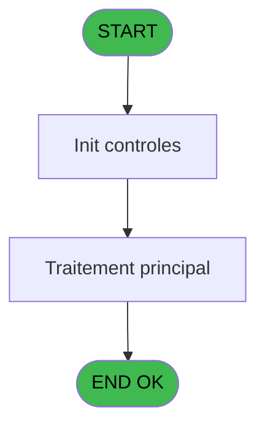

# LOG IDE 11 - Normalise chaine

> **Analyse**: Phases 1-4 2026-02-03 14:40 -> 14:40 (10s) | Assemblage 14:40
> **Pipeline**: V7.2 Enrichi
> **Structure**: 4 onglets (Resume | Ecrans | Donnees | Connexions)

<!-- TAB:Resume -->

## 1. FICHE D'IDENTITE

| Attribut | Valeur |
|----------|--------|
| Projet | LOG |
| IDE Position | 11 |
| Nom Programme | Normalise chaine |
| Fichier source | `Prg_11.xml` |
| Dossier IDE | Logins |
| Taches | 1 (0 ecrans visibles) |
| Tables modifiees | 0 |
| Programmes appeles | 0 |

## 2. DESCRIPTION FONCTIONNELLE

**Normalise chaine** assure la gestion complete de ce processus, accessible depuis [CL login utilisateur (IDE 15)](LOG-IDE-15.md).

Le flux de traitement s'organise en **1 blocs fonctionnels** :

- **Traitement** (1 tache) : traitements metier divers

## 3. BLOCS FONCTIONNELS

### 3.1 Traitement (1 tache)

Traitements internes.

---

#### 11 - Normalise chaine [[ECRAN]](#ecran-t1)

**Role** : Traitement : Normalise chaine.
**Ecran** : 648 x 379 DLU | [Voir mockup](#ecran-t1)
**Variables liees** : I (v.Taille chaine)

## 5. REGLES METIER

*(Aucune regle metier identifiee)*

## 6. CONTEXTE

- **Appele par**: [CL login utilisateur (IDE 15)](LOG-IDE-15.md)
- **Appelle**: 0 programmes | **Tables**: 0 (W:0 R:0 L:0) | **Taches**: 1 | **Expressions**: 23

<!-- TAB:Ecrans -->

## 8. ECRANS

*(Programme sans ecran visible)*

## 9. NAVIGATION

### 9.3 Structure hierarchique (1 tache)

| Position | Tache | Type | Dimensions | Bloc |
|----------|-------|------|------------|------|
| **11.1** | [**Normalise chaine** (11)](#t1) [mockup](#ecran-t1) | - | 648x379 | Traitement |

### 9.4 Algorigramme

> **Legende**: Vert = START/END OK | Rouge = END KO | Bleu = Decisions
> *Algorigramme auto-genere. Utiliser `/algorigramme` pour une synthese metier detaillee.*

<!-- TAB:Donnees -->

## 10. TABLES

### Tables utilisees (0)

| ID | Nom | Description | Type | R | W | L | Usages |
|----|-----|-------------|------|---|---|---|--------|

### Colonnes par table (0 / 0 tables avec colonnes identifiees)

## 11. VARIABLES

### 11.1 Parametres entrants (3)

Variables recues du programme appelant ([CL login utilisateur (IDE 15)](LOG-IDE-15.md)).

| Lettre | Nom | Type | Usage dans |
|--------|-----|------|-----------|
| A | p.i.o.Chaîne 1 | Unicode | - |
| B | p.i.Mode | Unicode | - |
| C | p.i.Char remplacement (null) | Unicode | - |

### 11.2 Variables de session (6)

Variables persistantes pendant toute la session.

| Lettre | Nom | Type | Usage dans |
|--------|-----|------|-----------|
| D | v.Lettres accentuées | Unicode | - |
| E | v.Lettres désaccentuées | Unicode | - |
| F | v.Lettres autorisées | Unicode | - |
| G | v.Caractère | Unicode | - |
| H | v.Sortie | Unicode | - |
| I | v.Taille chaine | Numeric | - |

## 12. EXPRESSIONS

**23 / 23 expressions decodees (100%)**

### 12.1 Repartition par type

| Type | Expressions | Regles |
|------|-------------|--------|
| CALCULATION | 3 | 0 |
| CONSTANTE | 6 | 0 |
| CONDITION | 4 | 0 |
| OTHER | 5 | 0 |
| STRING | 1 | 0 |
| FORMAT | 4 | 0 |

### 12.2 Expressions cles par type

#### CALCULATION (3 expressions)

| Type | IDE | Expression | Regle |
|------|-----|------------|-------|
| CALCULATION | 23 | `'ABCDEFGHIJKLMNOPQRSTUVWXYZ.- _"''&0123456789abcdefghijklmnopqrstuvwxyz'` | - |
| CALCULATION | 13 | `Left([AF], LoopCounter()-1) & IF(ISNULL([AW]), '¤',[AW])` | - |
| CALCULATION | 12 | `Left([AF], LoopCounter()-1) & [AE]` | - |

#### CONSTANTE (6 expressions)

| Type | IDE | Expression | Regle |
|------|-----|------------|-------|
| CONSTANTE | 5 | `'ABCDEFGHIJKLMNOPQRSTUVWXYZabcdefghijklmnopqrstuvwxyz'` | - |
| CONSTANTE | 6 | `'ABCDEFGHIJKLMNOPQRSTUVWXYZabcdefghijklmnopqrstuvwxyz0123456789'` | - |
| CONSTANTE | 9 | `''` | - |
| CONSTANTE | 2 | `'àáâãäåçðèéêëìíîïñòóôõöøùúûüýÿÀÁÂÃÄÅÇÐÈÉÊËÌÍÎÏÑÒÓÔÕÖØÙÚÛÜÝ'` | - |
| CONSTANTE | 3 | `'aaaaaacoeeeeiiiinoooooouuuuyyAAAAAACOEEEEIIIINOOOOOOUUUUY'` | - |
| ... | | *+1 autres* | |

#### CONDITION (4 expressions)

| Type | IDE | Expression | Regle |
|------|-----|------------|-------|
| CONDITION | 18 | `[AV]='C'` | - |
| CONDITION | 19 | `[AV]='S'` | - |
| CONDITION | 7 | `LoopCounter()<=[AG]` | - |
| CONDITION | 17 | `[AV]='A'` | - |

#### OTHER (5 expressions)

| Type | IDE | Expression | Regle |
|------|-----|------------|-------|
| OTHER | 20 | `Upper([AQ])` | - |
| OTHER | 22 | `ISNULL([AW])` | - |
| OTHER | 16 | `IN([AV], 'M', '')` | - |
| OTHER | 8 | `MID([AQ], LoopCounter(), 1)` | - |
| OTHER | 15 | `[AF]` | - |

#### STRING (1 expressions)

| Type | IDE | Expression | Regle |
|------|-----|------------|-------|
| STRING | 1 | `Len(RTrim([AQ]))` | - |

#### FORMAT (4 expressions)

| Type | IDE | Expression | Regle |
|------|-----|------------|-------|
| FORMAT | 14 | `InStr(RTrim([AU]), [AE])>0` | - |
| FORMAT | 21 | `RepStr([AF], '¤', '')` | - |
| FORMAT | 10 | `MID([AT], InStr([AS], [AE]), 1)` | - |
| FORMAT | 11 | `InStr([AS], [AE])>0` | - |

### 12.3 Toutes les expressions (23)

Voir les 23 expressions

#### CALCULATION (3)

| IDE | Expression Decodee |
|-----|-------------------|
| 12 | `Left([AF], LoopCounter()-1) & [AE]` |
| 13 | `Left([AF], LoopCounter()-1) & IF(ISNULL([AW]), '¤',[AW])` |
| 23 | `'ABCDEFGHIJKLMNOPQRSTUVWXYZ.- _"''&0123456789abcdefghijklmnopqrstuvwxyz'` |

#### CONSTANTE (6)

| IDE | Expression Decodee |
|-----|-------------------|
| 2 | `'àáâãäåçðèéêëìíîïñòóôõöøùúûüýÿÀÁÂÃÄÅÇÐÈÉÊËÌÍÎÏÑÒÓÔÕÖØÙÚÛÜÝ'` |
| 3 | `'aaaaaacoeeeeiiiinoooooouuuuyyAAAAAACOEEEEIIIINOOOOOOUUUUY'` |
| 4 | `'ABCDEFGHIJKLMNOPQRSTUVWXYZ.- _0123456789abcdefghijklmnopqrstuvwxyz'` |
| 5 | `'ABCDEFGHIJKLMNOPQRSTUVWXYZabcdefghijklmnopqrstuvwxyz'` |
| 6 | `'ABCDEFGHIJKLMNOPQRSTUVWXYZabcdefghijklmnopqrstuvwxyz0123456789'` |
| 9 | `''` |

#### CONDITION (4)

| IDE | Expression Decodee |
|-----|-------------------|
| 7 | `LoopCounter()<=[AG]` |
| 17 | `[AV]='A'` |
| 18 | `[AV]='C'` |
| 19 | `[AV]='S'` |

#### OTHER (5)

| IDE | Expression Decodee |
|-----|-------------------|
| 8 | `MID([AQ], LoopCounter(), 1)` |
| 15 | `[AF]` |
| 16 | `IN([AV], 'M', '')` |
| 20 | `Upper([AQ])` |
| 22 | `ISNULL([AW])` |

#### STRING (1)

| IDE | Expression Decodee |
|-----|-------------------|
| 1 | `Len(RTrim([AQ]))` |

#### FORMAT (4)

| IDE | Expression Decodee |
|-----|-------------------|
| 10 | `MID([AT], InStr([AS], [AE]), 1)` |
| 11 | `InStr([AS], [AE])>0` |
| 14 | `InStr(RTrim([AU]), [AE])>0` |
| 21 | `RepStr([AF], '¤', '')` |

<!-- TAB:Connexions -->

## 13. GRAPHE D'APPELS

### 13.1 Chaine depuis Main (Callers)

Main -> ... -> [CL login utilisateur (IDE 15)](LOG-IDE-15.md) -> **Normalise chaine (IDE 11)**

### 13.2 Callers

| IDE | Nom Programme | Nb Appels |
|-----|---------------|-----------|
| [15](LOG-IDE-15.md) | CL login utilisateur | 1 |

### 13.3 Callees (programmes appeles)

### 13.4 Detail Callees avec contexte

| IDE | Nom Programme | Appels | Contexte |
|-----|---------------|--------|----------|
| - | (aucun) | - | - |

## 14. RECOMMANDATIONS MIGRATION

### 14.1 Profil du programme

| Metrique | Valeur | Impact migration |
|----------|--------|-----------------|
| Lignes de logique | 58 | Programme compact |
| Expressions | 23 | Peu de logique |
| Tables WRITE | 0 | Impact faible |
| Sous-programmes | 0 | Peu de dependances |
| Ecrans visibles | 0 | Ecran unique ou traitement batch |
| Code desactive | 0% (0 / 58) | Code sain |
| Regles metier | 0 | Pas de regle identifiee |

### 14.2 Plan de migration par bloc

#### Traitement (1 tache: 1 ecran, 0 traitement)

- **Strategie** : 1 composant(s) UI (Razor/React) avec formulaires et validation.
- Decomposer les taches en services unitaires testables.

### 14.3 Dependances critiques

| Dependance | Type | Appels | Impact |
|------------|------|--------|--------|

---
*Spec DETAILED generee par Pipeline V7.2 - 2026-02-03 14:40*
