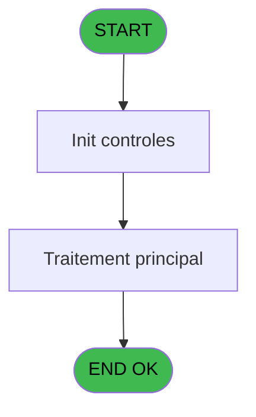
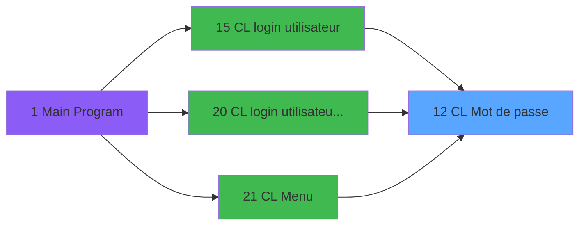
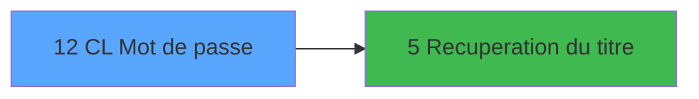

# LOG IDE 12 - CL Mot de passe

> **Analyse**: Phases 1-4 2026-02-03 14:40 -> 14:40 (9s) | Assemblage 14:40
> **Pipeline**: V7.2 Enrichi
> **Structure**: 4 onglets (Resume | Ecrans | Donnees | Connexions)

<!-- TAB:Resume -->

## 1. FICHE D'IDENTITE

| Attribut | Valeur |
|----------|--------|
| Projet | LOG |
| IDE Position | 12 |
| Nom Programme | CL Mot de passe |
| Fichier source | `Prg_12.xml` |
| Dossier IDE | Logins |
| Taches | 1 (1 ecrans visibles) |
| Tables modifiees | 0 |
| Programmes appeles | 1 |

## 2. DESCRIPTION FONCTIONNELLE

**CL Mot de passe** assure la gestion complete de ce processus, accessible depuis [CL login utilisateur (IDE 15)](LOG-IDE-15.md), [CL login utilisateur   *SAV* (IDE 20)](LOG-IDE-20.md), [CL Menu (IDE 21)](LOG-IDE-21.md).

Le flux de traitement s'organise en **1 blocs fonctionnels** :

- **Traitement** (1 tache) : traitements metier divers

**Logique metier** : 1 regles identifiees couvrant conditions metier.

## 3. BLOCS FONCTIONNELS

### 3.1 Traitement (1 tache)

Traitements internes.

---

#### 12 - (sans nom) [[ECRAN]](#ecran-t1)

**Role** : Traitement interne.
**Ecran** : 571 x 134 DLU (MDI) | [Voir mockup](#ecran-t1)
**Delegue a** : [Recuperation du titre (IDE 5)](LOG-IDE-5.md)

## 5. REGLES METIER

1 regles identifiees:

### Autres (1 regles)

#### [RM-001] Si W0 Clef [N]=W0 titre [O] alors 'O' sinon '')

| Element | Detail |
|---------|--------|
| **Condition** | `W0 Clef [N]=W0 titre [O]` |
| **Si vrai** | 'O' |
| **Si faux** | '') |
| **Variables** | N (W0 Clef), O (W0 titre) |
| **Expression source** | Expression 17 : `IF (W0 Clef [N]=W0 titre [O],'O','')` |
| **Exemple** | Si W0 Clef [N]=W0 titre [O] → 'O'. Sinon → '') |

## 6. CONTEXTE

- **Appele par**: [CL login utilisateur (IDE 15)](LOG-IDE-15.md), [CL login utilisateur   *SAV* (IDE 20)](LOG-IDE-20.md), [CL Menu (IDE 21)](LOG-IDE-21.md)
- **Appelle**: 1 programmes | **Tables**: 0 (W:0 R:0 L:0) | **Taches**: 1 | **Expressions**: 20

<!-- TAB:Ecrans -->

## 8. ECRANS

### 8.1 Forms visibles (1 / 1)

| # | Position | Tache | Nom | Type | Largeur | Hauteur | Bloc |
|---|----------|-------|-----|------|---------|---------|------|
| 1 | 12 | 12 | (sans nom) | MDI | 571 | 134 | Traitement |

### 8.2 Mockups Ecrans

---

#### 12 - (sans nom)
**Tache** : [12](#t1) | **Type** : MDI | **Dimensions** : 571 x 134 DLU
**Bloc** : Traitement | **Titre IDE** : (sans nom)

<!-- FORM-DATA:
{
    "width":  571,
    "vFactor":  8,
    "type":  "MDI",
    "hFactor":  8,
    "controls":  [
                     {
                         "x":  1,
                         "type":  "label",
                         "var":  "",
                         "y":  0,
                         "w":  569,
                         "fmt":  "",
                         "name":  "",
                         "h":  17,
                         "color":  "",
                         "text":  "",
                         "parent":  null
                     },
                     {
                         "x":  79,
                         "type":  "label",
                         "var":  "",
                         "y":  30,
                         "w":  413,
                         "fmt":  "",
                         "name":  "",
                         "h":  63,
                         "color":  "",
                         "text":  "",
                         "parent":  null
                     },
                     {
                         "x":  82,
                         "type":  "label",
                         "var":  "",
                         "y":  31,
                         "w":  408,
                         "fmt":  "",
                         "name":  "",
                         "h":  61,
                         "color":  "",
                         "text":  "",
                         "parent":  null
                     },
                     {
                         "x":  257,
                         "type":  "label",
                         "var":  "",
                         "y":  38,
                         "w":  216,
                         "fmt":  "",
                         "name":  "",
                         "h":  46,
                         "color":  "",
                         "text":  "",
                         "parent":  null
                     },
                     {
                         "x":  260,
                         "type":  "label",
                         "var":  "",
                         "y":  39,
                         "w":  210,
                         "fmt":  "",
                         "name":  "",
                         "h":  44,
                         "color":  "",
                         "text":  "",
                         "parent":  null
                     },
                     {
                         "x":  281,
                         "type":  "label",
                         "var":  "",
                         "y":  49,
                         "w":  58,
                         "fmt":  "",
                         "name":  "",
                         "h":  8,
                         "color":  "",
                         "text":  "Code",
                         "parent":  null
                     },
                     {
                         "x":  281,
                         "type":  "label",
                         "var":  "",
                         "y":  64,
                         "w":  46,
                         "fmt":  "",
                         "name":  "",
                         "h":  8,
                         "color":  "",
                         "text":  "Clef",
                         "parent":  null
                     },
                     {
                         "x":  1,
                         "type":  "label",
                         "var":  "",
                         "y":  110,
                         "w":  568,
                         "fmt":  "",
                         "name":  "",
                         "h":  21,
                         "color":  "",
                         "text":  "",
                         "parent":  null
                     },
                     {
                         "x":  3,
                         "type":  "edit",
                         "var":  "",
                         "y":  19,
                         "w":  82,
                         "fmt":  "",
                         "name":  "",
                         "h":  10,
                         "color":  "6",
                         "text":  "",
                         "parent":  null
                     },
                     {
                         "x":  355,
                         "type":  "edit",
                         "var":  "",
                         "y":  63,
                         "w":  98,
                         "fmt":  "",
                         "name":  "",
                         "h":  10,
                         "color":  "6",
                         "text":  "",
                         "parent":  null
                     },
                     {
                         "x":  324,
                         "type":  "edit",
                         "var":  "",
                         "y":  4,
                         "w":  235,
                         "fmt":  "WWW DD MMM YYYYT",
                         "name":  "",
                         "h":  8,
                         "color":  "",
                         "text":  "",
                         "parent":  1
                     },
                     {
                         "x":  120,
                         "type":  "image",
                         "var":  "",
                         "y":  46,
                         "w":  80,
                         "fmt":  "",
                         "name":  "",
                         "h":  31,
                         "color":  "",
                         "text":  "",
                         "parent":  null
                     },
                     {
                         "x":  355,
                         "type":  "edit",
                         "var":  "",
                         "y":  49,
                         "w":  98,
                         "fmt":  "6P0Z0",
                         "name":  "",
                         "h":  8,
                         "color":  "7",
                         "text":  "",
                         "parent":  null
                     },
                     {
                         "x":  9,
                         "type":  "button",
                         "var":  "",
                         "y":  113,
                         "w":  154,
                         "fmt":  "\u0026Quitter",
                         "name":  "",
                         "h":  16,
                         "color":  "",
                         "text":  "",
                         "parent":  14
                     },
                     {
                         "x":  7,
                         "type":  "edit",
                         "var":  "",
                         "y":  4,
                         "w":  267,
                         "fmt":  "30",
                         "name":  "",
                         "h":  8,
                         "color":  "",
                         "text":  "",
                         "parent":  1
                     }
                 ],
    "taskId":  "12",
    "height":  134
}
-->

<strong>Champs : 5 champs</strong>

| Pos (x,y) | Nom | Variable | Type |
|-----------|-----|----------|------|
| 3,19 | (sans nom) | - | edit |
| 355,63 | (sans nom) | - | edit |
| 324,4 | WWW DD MMM YYYYT | - | edit |
| 355,49 | 6P0Z0 | - | edit |
| 7,4 | 30 | - | edit |

<strong>Boutons : 1 boutons</strong>

| Bouton | Pos (x,y) | Action |
|--------|-----------|--------|
| Quitter | 9,113 | Quitte le programme |

## 9. NAVIGATION

Ecran unique: ****

### 9.3 Structure hierarchique (1 tache)

| Position | Tache | Type | Dimensions | Bloc |
|----------|-------|------|------------|------|
| **12.1** | [**(sans nom)** (12)](#t1) [mockup](#ecran-t1) | MDI | 571x134 | Traitement |

### 9.4 Algorigramme

> **Legende**: Vert = START/END OK | Rouge = END KO | Bleu = Decisions
> *Algorigramme auto-genere. Utiliser `/algorigramme` pour une synthese metier detaillee.*

<!-- TAB:Donnees -->

## 10. TABLES

### Tables utilisees (0)

| ID | Nom | Description | Type | R | W | L | Usages |
|----|-----|-------------|------|---|---|---|--------|

### Colonnes par table (0 / 0 tables avec colonnes identifiees)

## 11. VARIABLES

### 11.1 Parametres entrants (1)

Variables recues du programme appelant ([CL login utilisateur (IDE 15)](LOG-IDE-15.md)).

| Lettre | Nom | Type | Usage dans |
|--------|-----|------|-----------|
| A | P0 Acces OK ? | Alpha | - |

### 11.2 Variables de travail (14)

Variables internes au programme.

| Lettre | Nom | Type | Usage dans |
|--------|-----|------|-----------|
| B | W0 Secondes | Numeric | - |
| C | W0 Heures | Numeric | 3x calcul interne |
| D | W0 Jour | Numeric | 3x calcul interne |
| E | W0 Mois | Numeric | 3x calcul interne |
| F | W0 Annee | Numeric | 3x calcul interne |
| G | W0 Code1 | Alpha | 2x calcul interne |
| H | W0 Code2 | Alpha | 1x calcul interne |
| I | W0 Code3 | Alpha | 1x calcul interne |
| J | W0 Decodage1 | Alpha | 1x calcul interne |
| K | W0 Decodage2 | Alpha | 1x calcul interne |
| L | W0 Decodage3 | Alpha | 1x calcul interne |
| M | W0 Code secret | Alpha | 1x calcul interne |
| N | W0 Clef | Alpha | 1x calcul interne |
| O | W0 titre | Alpha | 1x calcul interne |

## 12. EXPRESSIONS

**20 / 20 expressions decodees (100%)**

### 12.1 Repartition par type

| Type | Expressions | Regles |
|------|-------------|--------|
| CALCULATION | 7 | 0 |
| CONDITION | 1 | 5 |
| CONSTANTE | 2 | 0 |
| DATE | 4 | 0 |
| OTHER | 2 | 0 |
| CONCATENATION | 1 | 0 |
| REFERENCE_VG | 2 | 0 |
| STRING | 1 | 0 |

### 12.2 Expressions cles par type

#### CALCULATION (7 expressions)

| Type | IDE | Expression | Regle |
|------|-----|------------|-------|
| CALCULATION | 13 | `Str (W0 Code1 [G]-W0 Jour [D]-W0 Mois [E],'##P0')` | - |
| CALCULATION | 14 | `Str (W0 Mois [E]+W0 Annee [F]*2,'##P0')` | - |
| CALCULATION | 16 | `Val (W0 Code2 [H],'##')*10000+Val (W0 Code3 [I],'##')*100+Val (W0 Decodage1 [J],'##')` | - |
| CALCULATION | 12 | `Str (W0 Annee [F]+W0 Heures [C]+W0 Jour [D],'##P0')` | - |
| CALCULATION | 9 | `Str (W0 Annee [F]+W0 Heures [C],'##P0')` | - |
| ... | | *+2 autres* | |

#### CONDITION (1 expressions)

| Type | IDE | Expression | Regle |
|------|-----|------------|-------|
| CONDITION | 17 | `IF (W0 Clef [N]=W0 titre [O],'O','')` | [RM-001](#rm-RM-001) |

#### CONSTANTE (2 expressions)

| Type | IDE | Expression | Regle |
|------|-----|------------|-------|
| CONSTANTE | 3 | `''` | - |
| CONSTANTE | 2 | `1` | - |

#### DATE (4 expressions)

| Type | IDE | Expression | Regle |
|------|-----|------------|-------|
| DATE | 8 | `Year (Date ())-1900` | - |
| DATE | 19 | `Date ()` | - |
| DATE | 6 | `Day (Date ())` | - |
| DATE | 7 | `Month (Date ())` | - |

#### OTHER (2 expressions)

| Type | IDE | Expression | Regle |
|------|-----|------------|-------|
| OTHER | 5 | `Hour (Time ())` | - |
| OTHER | 4 | `Second (Time ())` | - |

#### CONCATENATION (1 expressions)

| Type | IDE | Expression | Regle |
|------|-----|------------|-------|
| CONCATENATION | 15 | `W0 Decodage2 [K]&W0 Decodage3 [L]&W0 Code secret [M]` | - |

#### REFERENCE_VG (2 expressions)

| Type | IDE | Expression | Regle |
|------|-----|------------|-------|
| REFERENCE_VG | 20 | `VG3` | - |
| REFERENCE_VG | 18 | `VG2` | - |

#### STRING (1 expressions)

| Type | IDE | Expression | Regle |
|------|-----|------------|-------|
| STRING | 1 | `Trim ([P])` | - |

<!-- TAB:Connexions -->

## 13. GRAPHE D'APPELS

### 13.1 Chaine depuis Main (Callers)

Main -> ... -> [CL login utilisateur (IDE 15)](LOG-IDE-15.md) -> **CL Mot de passe (IDE 12)**

Main -> ... -> [CL login utilisateur   *SAV* (IDE 20)](LOG-IDE-20.md) -> **CL Mot de passe (IDE 12)**

Main -> ... -> [CL Menu (IDE 21)](LOG-IDE-21.md) -> **CL Mot de passe (IDE 12)**

### 13.2 Callers

| IDE | Nom Programme | Nb Appels |
|-----|---------------|-----------|
| [15](LOG-IDE-15.md) | CL login utilisateur | 1 |
| [20](LOG-IDE-20.md) | CL login utilisateur   *SAV* | 1 |
| [21](LOG-IDE-21.md) | CL Menu | 1 |

### 13.3 Callees (programmes appeles)

### 13.4 Detail Callees avec contexte

| IDE | Nom Programme | Appels | Contexte |
|-----|---------------|--------|----------|
| [5](LOG-IDE-5.md) | Recuperation du titre | 1 | Recuperation donnees |

## 14. RECOMMANDATIONS MIGRATION

### 14.1 Profil du programme

| Metrique | Valeur | Impact migration |
|----------|--------|-----------------|
| Lignes de logique | 41 | Programme compact |
| Expressions | 20 | Peu de logique |
| Tables WRITE | 0 | Impact faible |
| Sous-programmes | 1 | Peu de dependances |
| Ecrans visibles | 1 | Ecran unique ou traitement batch |
| Code desactive | 0% (0 / 41) | Code sain |
| Regles metier | 1 | Quelques regles a preserver |

### 14.2 Plan de migration par bloc

#### Traitement (1 tache: 1 ecran, 0 traitement)

- **Strategie** : 1 composant(s) UI (Razor/React) avec formulaires et validation.
- 1 sous-programme(s) a migrer ou a reutiliser depuis les services existants.
- Decomposer les taches en services unitaires testables.

### 14.3 Dependances critiques

| Dependance | Type | Appels | Impact |
|------------|------|--------|--------|
| [Recuperation du titre (IDE 5)](LOG-IDE-5.md) | Sous-programme | 1x | Normale - Recuperation donnees |

---
*Spec DETAILED generee par Pipeline V7.2 - 2026-02-03 14:40*
