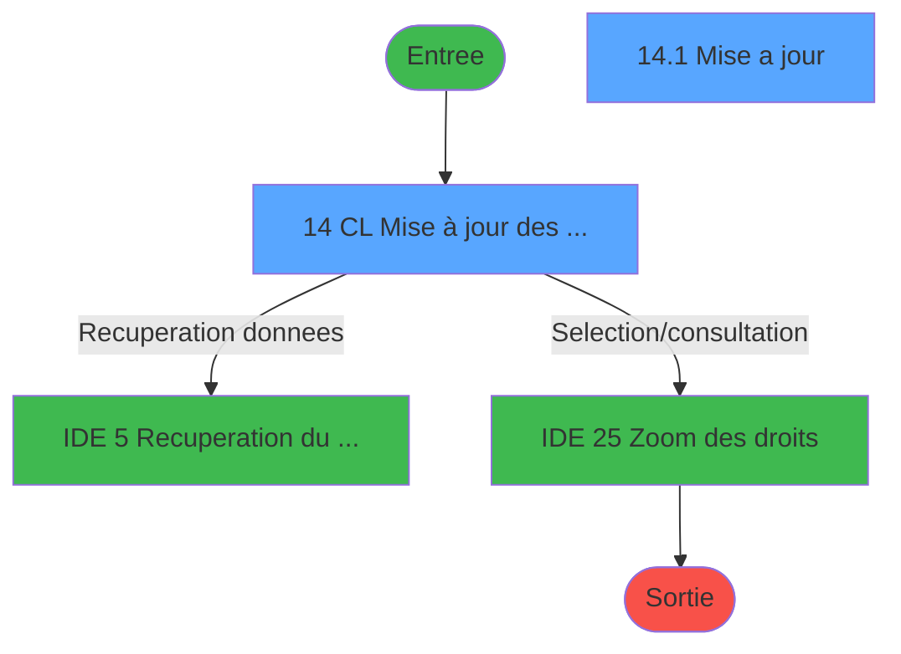
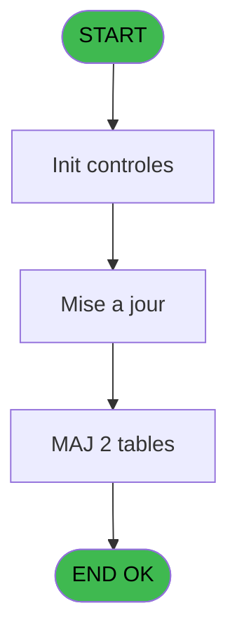
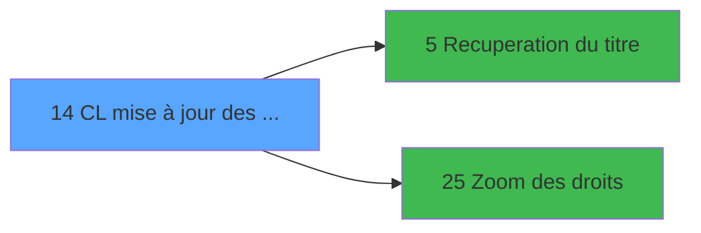

# LOG IDE 14 - CL mise à jour des groupes

> **Analyse**: Phases 1-4 2026-02-03 14:41 -> 14:41 (9s) | Assemblage 14:41
> **Pipeline**: V7.2 Enrichi
> **Structure**: 4 onglets (Resume | Ecrans | Donnees | Connexions)

<!-- TAB:Resume -->

## 1. FICHE D'IDENTITE

| Attribut | Valeur |
|----------|--------|
| Projet | LOG |
| IDE Position | 14 |
| Nom Programme | CL mise à jour des groupes |
| Fichier source | `Prg_14.xml` |
| Dossier IDE | Logins |
| Taches | 2 (2 ecrans visibles) |
| Tables modifiees | 2 |
| Programmes appeles | 2 |

## 2. DESCRIPTION FONCTIONNELLE

**CL mise à jour des groupes** assure la gestion complete de ce processus, accessible depuis [CL Menu (IDE 21)](LOG-IDE-21.md).

Le flux de traitement s'organise en **1 blocs fonctionnels** :

- **Traitement** (2 taches) : traitements metier divers

**Donnees modifiees** : 2 tables en ecriture (table_modifications, arc_client_gm).

## 3. BLOCS FONCTIONNELS

### 3.1 Traitement (2 taches)

Traitements internes.

---

#### 14 - CL Mise à jour des groupes [[ECRAN]](#ecran-t1)

**Role** : Traitement : CL Mise à jour des groupes.
**Ecran** : 976 x 215 DLU (MDI) | [Voir mockup](#ecran-t1)
**Delegue a** : [Recuperation du titre (IDE 5)](LOG-IDE-5.md)

---

#### 14.1 - Mise a jour [[ECRAN]](#ecran-t2)

**Role** : Traitement : Mise a jour.
**Ecran** : 458 x 154 DLU (Modal) | [Voir mockup](#ecran-t2)
**Delegue a** : [Recuperation du titre (IDE 5)](LOG-IDE-5.md)

## 5. REGLES METIER

*(Aucune regle metier identifiee)*

## 6. CONTEXTE

- **Appele par**: [CL Menu (IDE 21)](LOG-IDE-21.md)
- **Appelle**: 2 programmes | **Tables**: 4 (W:2 R:0 L:3) | **Taches**: 2 | **Expressions**: 22

<!-- TAB:Ecrans -->

## 8. ECRANS

### 8.1 Forms visibles (2 / 2)

| # | Position | Tache | Nom | Type | Largeur | Hauteur | Bloc |
|---|----------|-------|-----|------|---------|---------|------|
| 1 | 14 | 14 | CL Mise à jour des groupes | MDI | 976 | 215 | Traitement |
| 2 | 14.1 | 14.1 | Mise a jour | Modal | 458 | 154 | Traitement |

### 8.2 Mockups Ecrans

---

#### 14 - CL Mise à jour des groupes
**Tache** : [14](#t1) | **Type** : MDI | **Dimensions** : 976 x 215 DLU
**Bloc** : Traitement | **Titre IDE** : CL Mise à jour des groupes

<!-- FORM-DATA:
{
    "width":  976,
    "vFactor":  8,
    "type":  "MDI",
    "hFactor":  8,
    "controls":  [
                     {
                         "x":  1,
                         "type":  "label",
                         "var":  "",
                         "y":  0,
                         "w":  967,
                         "fmt":  "",
                         "name":  "",
                         "h":  19,
                         "color":  "",
                         "text":  "",
                         "parent":  null
                     },
                     {
                         "x":  18,
                         "type":  "table",
                         "var":  "",
                         "name":  "",
                         "titleH":  16,
                         "color":  "110",
                         "w":  467,
                         "y":  40,
                         "fmt":  "",
                         "parent":  null,
                         "text":  "",
                         "rowH":  14,
                         "h":  132,
                         "cols":  [
                                      {
                                          "title":  "Groupe",
                                          "layer":  1,
                                          "w":  250
                                      },
                                      {
                                          "title":  "Sociétés",
                                          "layer":  2,
                                          "w":  185
                                      }
                                  ],
                         "rows":  2
                     },
                     {
                         "x":  1,
                         "type":  "label",
                         "var":  "",
                         "y":  188,
                         "w":  965,
                         "fmt":  "",
                         "name":  "",
                         "h":  24,
                         "color":  "",
                         "text":  "",
                         "parent":  null
                     },
                     {
                         "x":  27,
                         "type":  "edit",
                         "var":  "",
                         "y":  60,
                         "w":  238,
                         "fmt":  "",
                         "name":  "",
                         "h":  10,
                         "color":  "110",
                         "text":  "",
                         "parent":  4
                     },
                     {
                         "x":  277,
                         "type":  "edit",
                         "var":  "",
                         "y":  60,
                         "w":  26,
                         "fmt":  "",
                         "name":  "GRP champ 1",
                         "h":  10,
                         "color":  "110",
                         "text":  "",
                         "parent":  4
                     },
                     {
                         "x":  302,
                         "type":  "edit",
                         "var":  "",
                         "y":  60,
                         "w":  26,
                         "fmt":  "",
                         "name":  "GRP champ 2",
                         "h":  10,
                         "color":  "110",
                         "text":  "",
                         "parent":  4
                     },
                     {
                         "x":  326,
                         "type":  "edit",
                         "var":  "",
                         "y":  60,
                         "w":  26,
                         "fmt":  "",
                         "name":  "GRP champ 3",
                         "h":  10,
                         "color":  "110",
                         "text":  "",
                         "parent":  4
                     },
                     {
                         "x":  350,
                         "type":  "edit",
                         "var":  "",
                         "y":  60,
                         "w":  26,
                         "fmt":  "",
                         "name":  "GRP champ 4",
                         "h":  10,
                         "color":  "110",
                         "text":  "",
                         "parent":  4
                     },
                     {
                         "x":  378,
                         "type":  "edit",
                         "var":  "",
                         "y":  60,
                         "w":  26,
                         "fmt":  "",
                         "name":  "GRP champ 5",
                         "h":  10,
                         "color":  "110",
                         "text":  "",
                         "parent":  4
                     },
                     {
                         "x":  410,
                         "type":  "button",
                         "var":  "",
                         "y":  58,
                         "w":  42,
                         "fmt":  "\u003e\u003e\u003e",
                         "name":  "Bouton droit",
                         "h":  13,
                         "color":  "",
                         "text":  "",
                         "parent":  4
                     },
                     {
                         "x":  654,
                         "type":  "edit",
                         "var":  "",
                         "y":  5,
                         "w":  302,
                         "fmt":  "WWW DD MMM YYYYT",
                         "name":  "",
                         "h":  8,
                         "color":  "",
                         "text":  "",
                         "parent":  null
                     },
                     {
                         "x":  7,
                         "type":  "edit",
                         "var":  "",
                         "y":  6,
                         "w":  384,
                         "fmt":  "30",
                         "name":  "",
                         "h":  8,
                         "color":  "",
                         "text":  "",
                         "parent":  1
                     },
                     {
                         "x":  9,
                         "type":  "button",
                         "var":  "",
                         "y":  191,
                         "w":  154,
                         "fmt":  "\u0026Quitter",
                         "name":  "",
                         "h":  18,
                         "color":  "",
                         "text":  "",
                         "parent":  18
                     }
                 ],
    "taskId":  "14",
    "height":  215
}
-->

<strong>Champs : 8 champs</strong>

| Pos (x,y) | Nom | Variable | Type |
|-----------|-----|----------|------|
| 27,60 | (sans nom) | - | edit |
| 277,60 | GRP champ 1 | - | edit |
| 302,60 | GRP champ 2 | - | edit |
| 326,60 | GRP champ 3 | - | edit |
| 350,60 | GRP champ 4 | - | edit |
| 378,60 | GRP champ 5 | - | edit |
| 654,5 | WWW DD MMM YYYYT | - | edit |
| 7,6 | 30 | - | edit |

<strong>Boutons : 2 boutons</strong>

| Bouton | Pos (x,y) | Action |
|--------|-----------|--------|
| >>> | 410,58 | Bouton fonctionnel |
| Quitter | 9,191 | Quitte le programme |

---

#### 14.1 - Mise a jour
**Tache** : [14.1](#t2) | **Type** : Modal | **Dimensions** : 458 x 154 DLU
**Bloc** : Traitement | **Titre IDE** : Mise a jour

<!-- FORM-DATA:
{
    "width":  458,
    "vFactor":  8,
    "type":  "Modal",
    "hFactor":  8,
    "controls":  [
                     {
                         "x":  6,
                         "type":  "table",
                         "var":  "",
                         "name":  "",
                         "titleH":  16,
                         "color":  "110",
                         "w":  433,
                         "y":  16,
                         "fmt":  "",
                         "parent":  null,
                         "text":  "",
                         "rowH":  14,
                         "h":  132,
                         "cols":  [
                                      {
                                          "title":  "Droit",
                                          "layer":  1,
                                          "w":  144
                                      },
                                      {
                                          "title":  "Affect. Utilis.",
                                          "layer":  2,
                                          "w":  135
                                      },
                                      {
                                          "title":  "Affect. Resp.",
                                          "layer":  3,
                                          "w":  119
                                      }
                                  ],
                         "rows":  3
                     },
                     {
                         "x":  336,
                         "type":  "label",
                         "var":  "",
                         "y":  35,
                         "w":  34,
                         "fmt":  "",
                         "name":  "",
                         "h":  8,
                         "color":  "110",
                         "text":  "Oui",
                         "parent":  1
                     },
                     {
                         "x":  18,
                         "type":  "edit",
                         "var":  "",
                         "y":  34,
                         "w":  126,
                         "fmt":  "",
                         "name":  "DRT Droit applicatif",
                         "h":  10,
                         "color":  "110",
                         "text":  "",
                         "parent":  1
                     },
                     {
                         "x":  170,
                         "type":  "combobox",
                         "var":  "",
                         "y":  33,
                         "w":  86,
                         "fmt":  "",
                         "name":  "v. droit utilisateur",
                         "h":  12,
                         "color":  "110",
                         "text":  "Oui,Non",
                         "parent":  1
                     }
                 ],
    "taskId":  "14.1",
    "height":  154
}
-->

<strong>Champs : 2 champs</strong>

| Pos (x,y) | Nom | Variable | Type |
|-----------|-----|----------|------|
| 18,34 | DRT Droit applicatif | - | edit |
| 170,33 | v. droit utilisateur | - | combobox |

## 9. NAVIGATION

### 9.1 Enchainement des ecrans

**Detail par enchainement :**

| Depuis | Action | Vers | Retour |
|--------|--------|------|--------|
| CL Mise à jour des groupes | Recuperation donnees | [Recuperation du titre (IDE 5)](LOG-IDE-5.md) | Retour ecran |
| CL Mise à jour des groupes | Selection/consultation | [Zoom des droits (IDE 25)](LOG-IDE-25.md) | Retour ecran |

### 9.3 Structure hierarchique (2 taches)

| Position | Tache | Type | Dimensions | Bloc |
|----------|-------|------|------------|------|
| **14.1** | [**CL Mise à jour des groupes** (14)](#t1) [mockup](#ecran-t1) | MDI | 976x215 | Traitement |
| 14.1.1 | [Mise a jour (14.1)](#t2) [mockup](#ecran-t2) | Modal | 458x154 | |

### 9.4 Algorigramme

> **Legende**: Vert = START/END OK | Rouge = END KO | Bleu = Decisions
> *Algorigramme auto-genere. Utiliser `/algorigramme` pour une synthese metier detaillee.*

<!-- TAB:Donnees -->

## 10. TABLES

### Tables utilisees (4)

| ID | Nom | Description | Type | R | W | L | Usages |
|----|-----|-------------|------|---|---|---|--------|
| 81 | societe__________soc |  | DB |   |   | L | 1 |
| 714 | table_modifications |  | DB |   | **W** |   | 1 |
| 717 | type_de_continent |  | DB |   |   | L | 1 |
| 723 | arc_client_gm |  | DB |   | **W** | L | 2 |

### Colonnes par table (2 / 2 tables avec colonnes identifiees)

Table 714 - table_modifications (**W**) - 1 usages

| Lettre | Variable | Acces | Type |
|--------|----------|-------|------|
| A | v. cdrt droits | W | Logical |
| B | v. droit utilisateur | W | Logical |
| C | v.ClauseWhere | W | Unicode |

Table 723 - arc_client_gm (**W**/L) - 2 usages

| Lettre | Variable | Acces | Type |
|--------|----------|-------|------|
| A | RC_LNK_3 | W | Logical |
| B | Bouton droit | W | Alpha |
| C | W0 titre | W | Alpha |

## 11. VARIABLES

### 11.1 Variables de travail (1)

Variables internes au programme.

| Lettre | Nom | Type | Usage dans |
|--------|-----|------|-----------|
| C | W0 titre | Alpha | - |

### 11.2 Autres (2)

Variables diverses.

| Lettre | Nom | Type | Usage dans |
|--------|-----|------|-----------|
| A | RC_LNK_3 | Logical | - |
| B | Bouton droit | Alpha | - |

## 12. EXPRESSIONS

**22 / 22 expressions decodees (100%)**

### 12.1 Repartition par type

| Type | Expressions | Regles |
|------|-------------|--------|
| CONSTANTE | 6 | 0 |
| DATE | 1 | 0 |
| CAST_LOGIQUE | 2 | 0 |
| REFERENCE_VG | 1 | 0 |
| CONDITION | 10 | 0 |
| OTHER | 1 | 0 |
| STRING | 1 | 0 |

### 12.2 Expressions cles par type

#### CONSTANTE (6 expressions)

| Type | IDE | Expression | Regle |
|------|-----|------------|-------|
| CONSTANTE | 14 | `'D'` | - |
| CONSTANTE | 15 | `'G'` | - |
| CONSTANTE | 21 | `4` | - |
| CONSTANTE | 11 | `'A'` | - |
| CONSTANTE | 12 | `'B'` | - |
| ... | | *+1 autres* | |

#### DATE (1 expressions)

| Type | IDE | Expression | Regle |
|------|-----|------------|-------|
| DATE | 4 | `Date ()` | - |

#### CAST_LOGIQUE (2 expressions)

| Type | IDE | Expression | Regle |
|------|-----|------------|-------|
| CAST_LOGIQUE | 2 | `INIPut ('AllowCreateInModify = Y','FALSE'LOG)` | - |
| CAST_LOGIQUE | 1 | `INIPut ('AllowCreateInModify = N','FALSE'LOG)` | - |

#### REFERENCE_VG (1 expressions)

| Type | IDE | Expression | Regle |
|------|-----|------------|-------|
| REFERENCE_VG | 3 | `VG2` | - |

#### CONDITION (10 expressions)

| Type | IDE | Expression | Regle |
|------|-----|------------|-------|
| CONDITION | 17 | `[H]<>''` | - |
| CONDITION | 16 | `[E]<>''` | - |
| CONDITION | 18 | `[K]<>''` | - |
| CONDITION | 20 | `[Q]<>''` | - |
| CONDITION | 19 | `[N]<>''` | - |
| ... | | *+5 autres* | |

#### OTHER (1 expressions)

| Type | IDE | Expression | Regle |
|------|-----|------------|-------|
| OTHER | 22 | `NOT([U])` | - |

#### STRING (1 expressions)

| Type | IDE | Expression | Regle |
|------|-----|------------|-------|
| STRING | 5 | `Trim ([T])` | - |

### 12.3 Toutes les expressions (22)

Voir les 22 expressions

#### CONSTANTE (6)

| IDE | Expression Decodee |
|-----|-------------------|
| 11 | `'A'` |
| 12 | `'B'` |
| 13 | `'C'` |
| 14 | `'D'` |
| 15 | `'G'` |
| 21 | `4` |

#### DATE (1)

| IDE | Expression Decodee |
|-----|-------------------|
| 4 | `Date ()` |

#### CAST_LOGIQUE (2)

| IDE | Expression Decodee |
|-----|-------------------|
| 1 | `INIPut ('AllowCreateInModify = N','FALSE'LOG)` |
| 2 | `INIPut ('AllowCreateInModify = Y','FALSE'LOG)` |

#### REFERENCE_VG (1)

| IDE | Expression Decodee |
|-----|-------------------|
| 3 | `VG2` |

#### CONDITION (10)

| IDE | Expression Decodee |
|-----|-------------------|
| 6 | `[F]<>'' AND [F]<>'A'` |
| 7 | `[I]<>'' AND [I]<>'B' AND [I]<>'A'` |
| 8 | `[L]<>'' AND [L]<>'C'` |
| 9 | `[O]<>'' AND [O]<>'D'` |
| 10 | `[R]<>'' AND [R]<>'G'` |
| 16 | `[E]<>''` |
| 17 | `[H]<>''` |
| 18 | `[K]<>''` |
| 19 | `[N]<>''` |
| 20 | `[Q]<>''` |

#### OTHER (1)

| IDE | Expression Decodee |
|-----|-------------------|
| 22 | `NOT([U])` |

#### STRING (1)

| IDE | Expression Decodee |
|-----|-------------------|
| 5 | `Trim ([T])` |

<!-- TAB:Connexions -->

## 13. GRAPHE D'APPELS

### 13.1 Chaine depuis Main (Callers)

Main -> ... -> [CL Menu (IDE 21)](LOG-IDE-21.md) -> **CL mise à jour des groupes (IDE 14)**

### 13.2 Callers

| IDE | Nom Programme | Nb Appels |
|-----|---------------|-----------|
| [21](LOG-IDE-21.md) | CL Menu | 1 |

### 13.3 Callees (programmes appeles)

### 13.4 Detail Callees avec contexte

| IDE | Nom Programme | Appels | Contexte |
|-----|---------------|--------|----------|
| [5](LOG-IDE-5.md) | Recuperation du titre | 1 | Recuperation donnees |
| [25](LOG-IDE-25.md) | Zoom des droits | 1 | Selection/consultation |

## 14. RECOMMANDATIONS MIGRATION

### 14.1 Profil du programme

| Metrique | Valeur | Impact migration |
|----------|--------|-----------------|
| Lignes de logique | 80 | Programme compact |
| Expressions | 22 | Peu de logique |
| Tables WRITE | 2 | Impact faible |
| Sous-programmes | 2 | Peu de dependances |
| Ecrans visibles | 2 | Quelques ecrans |
| Code desactive | 0% (0 / 80) | Code sain |
| Regles metier | 0 | Pas de regle identifiee |

### 14.2 Plan de migration par bloc

#### Traitement (2 taches: 2 ecrans, 0 traitement)

- **Strategie** : 2 composant(s) UI (Razor/React) avec formulaires et validation.
- 2 sous-programme(s) a migrer ou a reutiliser depuis les services existants.
- Decomposer les taches en services unitaires testables.

### 14.3 Dependances critiques

| Dependance | Type | Appels | Impact |
|------------|------|--------|--------|
| table_modifications | Table WRITE (Database) | 1x | Schema + repository |
| arc_client_gm | Table WRITE (Database) | 1x | Schema + repository |
| [Zoom des droits (IDE 25)](LOG-IDE-25.md) | Sous-programme | 1x | Normale - Selection/consultation |
| [Recuperation du titre (IDE 5)](LOG-IDE-5.md) | Sous-programme | 1x | Normale - Recuperation donnees |

---
*Spec DETAILED generee par Pipeline V7.2 - 2026-02-03 14:41*
