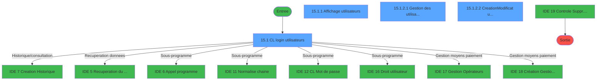
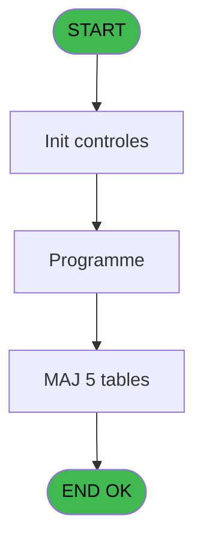
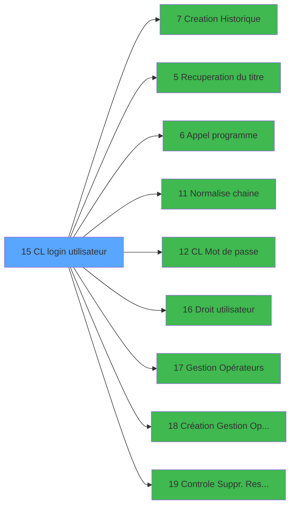

# LOG IDE 15 - CL login utilisateur

> **Analyse**: Phases 1-4 2026-02-03 14:41 -> 14:41 (10s) | Assemblage 14:41
> **Pipeline**: V7.2 Enrichi
> **Structure**: 4 onglets (Resume | Ecrans | Donnees | Connexions)

<!-- TAB:Resume -->

## 1. FICHE D'IDENTITE

| Attribut | Valeur |
|----------|--------|
| Projet | LOG |
| IDE Position | 15 |
| Nom Programme | CL login utilisateur |
| Fichier source | `Prg_15.xml` |
| Dossier IDE | Logins |
| Taches | 26 (4 ecrans visibles) |
| Tables modifiees | 5 |
| Programmes appeles | 9 |

## 2. DESCRIPTION FONCTIONNELLE

**CL login utilisateur** assure la gestion complete de ce processus, accessible depuis [CL Menu (IDE 21)](LOG-IDE-21.md).

Le flux de traitement s'organise en **4 blocs fonctionnels** :

- **Traitement** (17 taches) : traitements metier divers
- **Creation** (5 taches) : insertion d'enregistrements en base (mouvements, prestations)
- **Consultation** (3 taches) : ecrans de recherche, selection et consultation
- **Validation** (1 tache) : controles et verifications de coherence

**Donnees modifiees** : 5 tables en ecriture (table_utilisateurs, commandes, utilisateur______uti, pv_stock_movements, vente_vrl_vsl).

Detail : phases du traitement

#### Phase 1 : Traitement (17 taches)

- **15** - (sans nom)
- **15.1** - CL login utilisateurs **[[ECRAN]](#ecran-t2)**
- **15.1.2.1** - Gestion des utilisateurs **[[ECRAN]](#ecran-t5)**
- **15.1.2.2.4** - Gestion des utilisateurs **[[ECRAN]](#ecran-t10)**
- **15.1.2.2.5** - Affectation Login
- **15.1.2.3.1** - suppression
- **15.1.2.3.2** - suppression
- **15.1.2.3.3** - suppression
- **15.1.2.3.4** - suppression
- **15.1.2.3.5** - suppression
- **15.1.2.3.6** - suppression
- **15.1.2.3.7** - contrôle caisse
- **15.1.2.3.7.1** - Last session
- **15.1.2.3.7.2** - Last detail session
- **15.2** - Terminaux spéciaux
- **15.3** - Terminaux spéciaux
- **15.1.2.2.6** - Déjà user responsable ?

Delegue a : [Recuperation du titre (IDE 5)](LOG-IDE-5.md), [Appel programme (IDE 6)](LOG-IDE-6.md), [Normalise chaine (IDE 11)](LOG-IDE-11.md), [CL Mot de passe (IDE 12)](LOG-IDE-12.md), [   Droit / utilisateur (IDE 16)](LOG-IDE-16.md), [Gestion Opérateurs (IDE 17)](LOG-IDE-17.md), [Création Gestion Opérateurs (IDE 18)](LOG-IDE-18.md)

#### Phase 2 : Consultation (3 taches)

- **15.1.1** - Affichage utilisateurs **[[ECRAN]](#ecran-t3)**
- **15.1.2** - Choix **[[ECRAN]](#ecran-t4)**
- **15.1.3** - Affichage utilisateurs **[[ECRAN]](#ecran-t28)**

Delegue a : [Recuperation du titre (IDE 5)](LOG-IDE-5.md)

#### Phase 3 : Creation (5 taches)

- **15.1.2.2** - Creation/Modificat utilisateur **[[ECRAN]](#ecran-t6)**
- **15.1.2.2.1** - creation
- **15.1.2.2.2** - creation
- **15.1.2.2.3** - Creation Droits
- **15.1.2.3** - creation utilisateur **[[ECRAN]](#ecran-t12)**

Delegue a : [Creation Historique (IDE 7)](LOG-IDE-7.md)

#### Phase 4 : Validation (1 tache)

- **15.1.2.1.1** - Verif liste

Delegue a : [Controle Suppr. Resp. Recept. (IDE 19)](LOG-IDE-19.md)

#### Tables impactees

| Table | Operations | Role metier |
|-------|-----------|-------------|
| pv_stock_movements | **W**/L (6 usages) | Articles et stock |
| utilisateur______uti | **W**/L (5 usages) |  |
| table_utilisateurs | R/**W**/L (3 usages) |  |
| commandes | **W** (2 usages) |  |
| vente_vrl_vsl | **W** (2 usages) | Donnees de ventes |

## 3. BLOCS FONCTIONNELS

### 3.1 Traitement (17 taches)

Traitements internes.

---

#### 15 - (sans nom)

**Role** : Tache d'orchestration : point d'entree du programme (17 sous-taches). Coordonne l'enchainement des traitements.

16 sous-taches directes

| Tache | Nom | Bloc |
|-------|-----|------|
| [15.1](#t2) | CL login utilisateurs **[[ECRAN]](#ecran-t2)** | Traitement |
| [15.1.2.1](#t5) | Gestion des utilisateurs **[[ECRAN]](#ecran-t5)** | Traitement |
| [15.1.2.2.4](#t10) | Gestion des utilisateurs **[[ECRAN]](#ecran-t10)** | Traitement |
| [15.1.2.2.5](#t11) | Affectation Login | Traitement |
| [15.1.2.3.1](#t13) | suppression | Traitement |
| [15.1.2.3.2](#t14) | suppression | Traitement |
| [15.1.2.3.3](#t15) | suppression | Traitement |
| [15.1.2.3.4](#t16) | suppression | Traitement |
| [15.1.2.3.5](#t17) | suppression | Traitement |
| [15.1.2.3.6](#t18) | suppression | Traitement |
| [15.1.2.3.7](#t19) | contrôle caisse | Traitement |
| [15.1.2.3.7.1](#t20) | Last session | Traitement |
| [15.1.2.3.7.2](#t21) | Last detail session | Traitement |
| [15.2](#t22) | Terminaux spéciaux | Traitement |
| [15.3](#t25) | Terminaux spéciaux | Traitement |
| [15.1.2.2.6](#t29) | Déjà user responsable ? | Traitement |

---

#### 15.1 - CL login utilisateurs [[ECRAN]](#ecran-t2)

**Role** : Traitement : CL login utilisateurs.
**Ecran** : 883 x 263 DLU (MDI) | [Voir mockup](#ecran-t2)

---

#### 15.1.2.1 - Gestion des utilisateurs [[ECRAN]](#ecran-t5)

**Role** : Gestion du moyen de paiement : Gestion des utilisateurs.
**Ecran** : 622 x 202 DLU (MDI) | [Voir mockup](#ecran-t5)

---

#### 15.1.2.2.4 - Gestion des utilisateurs [[ECRAN]](#ecran-t10)

**Role** : Gestion du moyen de paiement : Gestion des utilisateurs.
**Ecran** : 622 x 202 DLU (MDI) | [Voir mockup](#ecran-t10)

---

#### 15.1.2.2.5 - Affectation Login

**Role** : Traitement : Affectation Login.

---

#### 15.1.2.3.1 - suppression

**Role** : Traitement : suppression.

---

#### 15.1.2.3.2 - suppression

**Role** : Traitement : suppression.

---

#### 15.1.2.3.3 - suppression

**Role** : Traitement : suppression.

---

#### 15.1.2.3.4 - suppression

**Role** : Traitement : suppression.

---

#### 15.1.2.3.5 - suppression

**Role** : Traitement : suppression.

---

#### 15.1.2.3.6 - suppression

**Role** : Traitement : suppression.

---

#### 15.1.2.3.7 - contrôle caisse

**Role** : Traitement : contrôle caisse.

---

#### 15.1.2.3.7.1 - Last session

**Role** : Traitement : Last session.

---

#### 15.1.2.3.7.2 - Last detail session

**Role** : Traitement : Last detail session.

---

#### 15.2 - Terminaux spéciaux

**Role** : Traitement : Terminaux spéciaux.
**Variables liees** : E (v.Terminaux associés)

---

#### 15.3 - Terminaux spéciaux

**Role** : Traitement : Terminaux spéciaux.
**Variables liees** : E (v.Terminaux associés)

---

#### 15.1.2.2.6 - Déjà user responsable ?

**Role** : Traitement : Déjà user responsable ?.
**Variables liees** : C (v.Responsable financier ?), O (CHG_REASON_W3 user), P (CHG_PRV_W3 user)

### 3.2 Consultation (3 taches)

Ecrans de recherche et consultation.

---

#### 15.1.1 - Affichage utilisateurs [[ECRAN]](#ecran-t3)

**Role** : Reinitialisation : Affichage utilisateurs.
**Ecran** : 320 x 191 DLU (Modal) | [Voir mockup](#ecran-t3)

---

#### 15.1.2 - Choix [[ECRAN]](#ecran-t4)

**Role** : Selection par l'operateur : Choix.
**Ecran** : 166 x 15 DLU (MDI) | [Voir mockup](#ecran-t4)

---

#### 15.1.3 - Affichage utilisateurs [[ECRAN]](#ecran-t28)

**Role** : Reinitialisation : Affichage utilisateurs.
**Ecran** : 320 x 157 DLU (Modal) | [Voir mockup](#ecran-t28)

### 3.3 Creation (5 taches)

Insertion de nouveaux enregistrements en base.

---

#### 15.1.2.2 - Creation/Modificat utilisateur [[ECRAN]](#ecran-t6)

**Role** : Creation d'enregistrement : Creation/Modificat utilisateur.
**Ecran** : 603 x 180 DLU (MDI) | [Voir mockup](#ecran-t6)
**Delegue a** : [Creation Historique (IDE 7)](LOG-IDE-7.md)

---

#### 15.1.2.2.1 - creation

**Role** : Creation d'enregistrement : creation.
**Delegue a** : [Creation Historique (IDE 7)](LOG-IDE-7.md)

---

#### 15.1.2.2.2 - creation

**Role** : Creation d'enregistrement : creation.
**Delegue a** : [Creation Historique (IDE 7)](LOG-IDE-7.md)

---

#### 15.1.2.2.3 - Creation Droits

**Role** : Creation d'enregistrement : Creation Droits.
**Delegue a** : [Creation Historique (IDE 7)](LOG-IDE-7.md)

---

#### 15.1.2.3 - creation utilisateur [[ECRAN]](#ecran-t12)

**Role** : Creation d'enregistrement : creation utilisateur.
**Ecran** : 464 x 89 DLU (MDI) | [Voir mockup](#ecran-t12)
**Delegue a** : [Creation Historique (IDE 7)](LOG-IDE-7.md)

### 3.4 Validation (1 tache)

Controles de coherence : 1 tache verifie les donnees et conditions.

---

#### 15.1.2.1.1 - Verif liste

**Role** : Verification : Verif liste.
**Delegue a** : [Controle Suppr. Resp. Recept. (IDE 19)](LOG-IDE-19.md)

## 5. REGLES METIER

*(Aucune regle metier identifiee)*

## 6. CONTEXTE

- **Appele par**: [CL Menu (IDE 21)](LOG-IDE-21.md)
- **Appelle**: 9 programmes | **Tables**: 11 (W:5 R:6 L:4) | **Taches**: 26 | **Expressions**: 3

<!-- TAB:Ecrans -->

## 8. ECRANS

### 8.1 Forms visibles (4 / 26)

| # | Position | Tache | Nom | Type | Largeur | Hauteur | Bloc |
|---|----------|-------|-----|------|---------|---------|------|
| 1 | 15.1 | 15.1 | CL login utilisateurs | MDI | 883 | 263 | Traitement |
| 2 | 15.1.1 | 15.1.1 | Affichage utilisateurs | Modal | 320 | 191 | Consultation |
| 3 | 15.1.3.1 | 15.1.2.1 | Gestion des utilisateurs | MDI | 622 | 202 | Traitement |
| 4 | 15.1.3.2 | 15.1.2.2 | Creation/Modificat utilisateur | MDI | 603 | 180 | Creation |

### 8.2 Mockups Ecrans

---

#### 15.1 - CL login utilisateurs
**Tache** : [15.1](#t2) | **Type** : MDI | **Dimensions** : 883 x 263 DLU
**Bloc** : Traitement | **Titre IDE** : CL login utilisateurs

<!-- FORM-DATA:
{
    "width":  883,
    "vFactor":  8,
    "type":  "MDI",
    "hFactor":  8,
    "controls":  [
                     {
                         "x":  0,
                         "type":  "label",
                         "var":  "",
                         "y":  1,
                         "w":  883,
                         "fmt":  "",
                         "name":  "",
                         "h":  19,
                         "color":  "",
                         "text":  "",
                         "parent":  null
                     },
                     {
                         "x":  2,
                         "type":  "label",
                         "var":  "",
                         "y":  238,
                         "w":  880,
                         "fmt":  "",
                         "name":  "",
                         "h":  24,
                         "color":  "",
                         "text":  "",
                         "parent":  null
                     },
                     {
                         "x":  34,
                         "type":  "table",
                         "var":  "",
                         "name":  "",
                         "titleH":  13,
                         "color":  "110",
                         "w":  377,
                         "y":  37,
                         "fmt":  "",
                         "parent":  null,
                         "text":  "",
                         "rowH":  13,
                         "h":  183,
                         "cols":  [
                                      {
                                          "title":  "Groupes du village",
                                          "layer":  1,
                                          "w":  342
                                      }
                                  ],
                         "rows":  1
                     },
                     {
                         "x":  54,
                         "type":  "edit",
                         "var":  "",
                         "y":  52,
                         "w":  232,
                         "fmt":  "",
                         "name":  "GRP nom",
                         "h":  8,
                         "color":  "110",
                         "text":  "",
                         "parent":  5
                     },
                     {
                         "x":  322,
                         "type":  "button",
                         "var":  "",
                         "y":  51,
                         "w":  55,
                         "fmt":  "\u003e\u003e\u003e",
                         "name":  "Bouton suite",
                         "h":  12,
                         "color":  "",
                         "text":  "",
                         "parent":  5
                     },
                     {
                         "x":  6,
                         "type":  "edit",
                         "var":  "",
                         "y":  7,
                         "w":  384,
                         "fmt":  "30",
                         "name":  "",
                         "h":  8,
                         "color":  "",
                         "text":  "",
                         "parent":  1
                     },
                     {
                         "x":  573,
                         "type":  "edit",
                         "var":  "",
                         "y":  7,
                         "w":  302,
                         "fmt":  "WWW DD MMM YYYYT",
                         "name":  "",
                         "h":  8,
                         "color":  "",
                         "text":  "",
                         "parent":  null
                     },
                     {
                         "x":  10,
                         "type":  "button",
                         "var":  "",
                         "y":  241,
                         "w":  154,
                         "fmt":  "\u0026Quitter",
                         "name":  "",
                         "h":  18,
                         "color":  "",
                         "text":  "",
                         "parent":  4
                     },
                     {
                         "x":  34,
                         "type":  "edit",
                         "var":  "",
                         "y":  225,
                         "w":  840,
                         "fmt":  "",
                         "name":  "v.Terminaux associies",
                         "h":  10,
                         "color":  "",
                         "text":  "",
                         "parent":  null
                     }
                 ],
    "taskId":  "15.1",
    "height":  263
}
-->

<strong>Champs : 4 champs</strong>

| Pos (x,y) | Nom | Variable | Type |
|-----------|-----|----------|------|
| 54,52 | GRP nom | - | edit |
| 6,7 | 30 | - | edit |
| 573,7 | WWW DD MMM YYYYT | - | edit |
| 34,225 | v.Terminaux associies | - | edit |

<strong>Boutons : 2 boutons</strong>

| Bouton | Pos (x,y) | Action |
|--------|-----------|--------|
| >>> | 322,51 | Bouton fonctionnel |
| Quitter | 10,241 | Quitte le programme |

---

#### 15.1.1 - Affichage utilisateurs
**Tache** : [15.1.1](#t3) | **Type** : Modal | **Dimensions** : 320 x 191 DLU
**Bloc** : Consultation | **Titre IDE** : Affichage utilisateurs

<!-- FORM-DATA:
{
    "width":  320,
    "vFactor":  8,
    "type":  "Modal",
    "hFactor":  8,
    "controls":  [
                     {
                         "x":  0,
                         "type":  "table",
                         "var":  "",
                         "name":  "",
                         "titleH":  13,
                         "color":  "110",
                         "w":  285,
                         "y":  0,
                         "fmt":  "",
                         "parent":  null,
                         "text":  "",
                         "rowH":  13,
                         "h":  188,
                         "cols":  [
                                      {
                                          "title":  "Utilisateur",
                                          "layer":  1,
                                          "w":  118
                                      },
                                      {
                                          "title":  "Type",
                                          "layer":  2,
                                          "w":  160
                                      }
                                  ],
                         "rows":  2
                     },
                     {
                         "x":  10,
                         "type":  "edit",
                         "var":  "",
                         "y":  16,
                         "w":  98,
                         "fmt":  "",
                         "name":  "",
                         "h":  8,
                         "color":  "110",
                         "text":  "",
                         "parent":  1
                     },
                     {
                         "x":  135,
                         "type":  "edit",
                         "var":  "",
                         "y":  16,
                         "w":  131,
                         "fmt":  "11",
                         "name":  "",
                         "h":  8,
                         "color":  "110",
                         "text":  "",
                         "parent":  1
                     }
                 ],
    "taskId":  "15.1.1",
    "height":  191
}
-->

<strong>Champs : 2 champs</strong>

| Pos (x,y) | Nom | Variable | Type |
|-----------|-----|----------|------|
| 10,16 | (sans nom) | - | edit |
| 135,16 | 11 | - | edit |

---

#### 15.1.3.1 - Gestion des utilisateurs
**Tache** : [15.1.2.1](#t5) | **Type** : MDI | **Dimensions** : 622 x 202 DLU
**Bloc** : Traitement | **Titre IDE** : Gestion des utilisateurs

<!-- FORM-DATA:
{
    "width":  622,
    "vFactor":  8,
    "type":  "MDI",
    "hFactor":  8,
    "controls":  [
                     {
                         "x":  1,
                         "type":  "label",
                         "var":  "",
                         "y":  0,
                         "w":  619,
                         "fmt":  "",
                         "name":  "",
                         "h":  19,
                         "color":  "",
                         "text":  "",
                         "parent":  null
                     },
                     {
                         "x":  2,
                         "type":  "label",
                         "var":  "",
                         "y":  177,
                         "w":  619,
                         "fmt":  "",
                         "name":  "",
                         "h":  24,
                         "color":  "",
                         "text":  "",
                         "parent":  null
                     },
                     {
                         "x":  424,
                         "type":  "label",
                         "var":  "",
                         "y":  32,
                         "w":  191,
                         "fmt":  "",
                         "name":  "",
                         "h":  135,
                         "color":  "",
                         "text":  "",
                         "parent":  null
                     },
                     {
                         "x":  427,
                         "type":  "line",
                         "var":  "",
                         "y":  95,
                         "w":  186,
                         "fmt":  "",
                         "name":  "",
                         "h":  0,
                         "color":  "",
                         "text":  "",
                         "parent":  5
                     },
                     {
                         "x":  10,
                         "type":  "table",
                         "var":  "",
                         "name":  "",
                         "titleH":  13,
                         "color":  "110",
                         "w":  390,
                         "y":  34,
                         "fmt":  "",
                         "parent":  null,
                         "text":  "",
                         "rowH":  13,
                         "h":  133,
                         "cols":  [
                                      {
                                          "title":  "Utilisateurs",
                                          "layer":  1,
                                          "w":  357
                                      }
                                  ],
                         "rows":  1
                     },
                     {
                         "x":  23,
                         "type":  "edit",
                         "var":  "",
                         "y":  48,
                         "w":  98,
                         "fmt":  "",
                         "name":  "UTI user",
                         "h":  12,
                         "color":  "110",
                         "text":  "",
                         "parent":  11
                     },
                     {
                         "x":  282,
                         "type":  "combobox",
                         "var":  "",
                         "y":  48,
                         "w":  81,
                         "fmt":  "",
                         "name":  "UTI langue",
                         "h":  12,
                         "color":  "110",
                         "text":  "FRA,ANG",
                         "parent":  11
                     },
                     {
                         "x":  7,
                         "type":  "edit",
                         "var":  "",
                         "y":  4,
                         "w":  323,
                         "fmt":  "30",
                         "name":  "",
                         "h":  8,
                         "color":  "",
                         "text":  "",
                         "parent":  1
                     },
                     {
                         "x":  330,
                         "type":  "edit",
                         "var":  "",
                         "y":  4,
                         "w":  283,
                         "fmt":  "WWW DD MMM YYYYT",
                         "name":  "",
                         "h":  8,
                         "color":  "",
                         "text":  "",
                         "parent":  null
                     },
                     {
                         "x":  139,
                         "type":  "edit",
                         "var":  "",
                         "y":  48,
                         "w":  131,
                         "fmt":  "11",
                         "name":  "",
                         "h":  12,
                         "color":  "110",
                         "text":  "",
                         "parent":  11
                     },
                     {
                         "x":  445,
                         "type":  "button",
                         "var":  "",
                         "y":  43,
                         "w":  154,
                         "fmt":  "\u0026Droit",
                         "name":  "",
                         "h":  18,
                         "color":  "",
                         "text":  "",
                         "parent":  5
                     },
                     {
                         "x":  445,
                         "type":  "button",
                         "var":  "",
                         "y":  66,
                         "w":  154,
                         "fmt":  "Droit \u0026Office",
                         "name":  "",
                         "h":  18,
                         "color":  "",
                         "text":  "",
                         "parent":  5
                     },
                     {
                         "x":  441,
                         "type":  "button",
                         "var":  "",
                         "y":  100,
                         "w":  154,
                         "fmt":  "\u0026Création",
                         "name":  "C",
                         "h":  18,
                         "color":  "",
                         "text":  "",
                         "parent":  5
                     },
                     {
                         "x":  441,
                         "type":  "button",
                         "var":  "",
                         "y":  144,
                         "w":  154,
                         "fmt":  "\u0026Suppression",
                         "name":  "S",
                         "h":  18,
                         "color":  "",
                         "text":  "",
                         "parent":  5
                     },
                     {
                         "x":  10,
                         "type":  "button",
                         "var":  "",
                         "y":  180,
                         "w":  154,
                         "fmt":  "\u0026Quitter",
                         "name":  "",
                         "h":  18,
                         "color":  "",
                         "text":  "",
                         "parent":  4
                     },
                     {
                         "x":  441,
                         "type":  "button",
                         "var":  "",
                         "y":  122,
                         "w":  154,
                         "fmt":  "\u0026Modification",
                         "name":  "M",
                         "h":  18,
                         "color":  "",
                         "text":  "",
                         "parent":  null
                     }
                 ],
    "taskId":  "15.1.3.1",
    "height":  202
}
-->

<strong>Champs : 5 champs</strong>

| Pos (x,y) | Nom | Variable | Type |
|-----------|-----|----------|------|
| 23,48 | UTI user | - | edit |
| 282,48 | UTI langue | - | combobox |
| 7,4 | 30 | - | edit |
| 330,4 | WWW DD MMM YYYYT | - | edit |
| 139,48 | 11 | - | edit |

<strong>Boutons : 6 boutons</strong>

| Bouton | Pos (x,y) | Action |
|--------|-----------|--------|
| Droit | 445,43 | Appel [   Droit / utilisateur (IDE 16)](LOG-IDE-16.md) |
| Droit Office | 445,66 | Appel [   Droit / utilisateur (IDE 16)](LOG-IDE-16.md) |
| Création | 441,100 | Appel [Création Gestion Opérateurs (IDE 18)](LOG-IDE-18.md) |
| Suppression | 441,144 | Appel [Controle Suppr. Resp. Recept. (IDE 19)](LOG-IDE-19.md) |
| Quitter | 10,180 | Quitte le programme |
| Modification | 441,122 | Modifie l'element |

---

#### 15.1.3.2 - Creation/Modificat utilisateur
**Tache** : [15.1.2.2](#t6) | **Type** : MDI | **Dimensions** : 603 x 180 DLU
**Bloc** : Creation | **Titre IDE** : Creation/Modificat utilisateur

<!-- FORM-DATA:
{
    "width":  603,
    "vFactor":  8,
    "type":  "MDI",
    "hFactor":  8,
    "controls":  [
                     {
                         "x":  5,
                         "type":  "label",
                         "var":  "",
                         "y":  2,
                         "w":  595,
                         "fmt":  "",
                         "name":  "",
                         "h":  152,
                         "color":  "",
                         "text":  "",
                         "parent":  null
                     },
                     {
                         "x":  54,
                         "type":  "label",
                         "var":  "",
                         "y":  10,
                         "w":  114,
                         "fmt":  "",
                         "name":  "",
                         "h":  10,
                         "color":  "",
                         "text":  "Login",
                         "parent":  1
                     },
                     {
                         "x":  54,
                         "type":  "label",
                         "var":  "",
                         "y":  24,
                         "w":  82,
                         "fmt":  "",
                         "name":  "",
                         "h":  10,
                         "color":  "",
                         "text":  "Password",
                         "parent":  1
                     },
                     {
                         "x":  54,
                         "type":  "label",
                         "var":  "",
                         "y":  38,
                         "w":  189,
                         "fmt":  "",
                         "name":  "",
                         "h":  10,
                         "color":  "",
                         "text":  "Password (Confirmation)",
                         "parent":  1
                     },
                     {
                         "x":  55,
                         "type":  "label",
                         "var":  "",
                         "y":  52,
                         "w":  242,
                         "fmt":  "",
                         "name":  "",
                         "h":  20,
                         "color":  "",
                         "text":  "Description (Prénom + Première Lettre du nom de famille)",
                         "parent":  1
                     },
                     {
                         "x":  55,
                         "type":  "label",
                         "var":  "",
                         "y":  73,
                         "w":  219,
                         "fmt":  "",
                         "name":  "",
                         "h":  10,
                         "color":  "",
                         "text":  "Information",
                         "parent":  1
                     },
                     {
                         "x":  55,
                         "type":  "label",
                         "var":  "",
                         "y":  110,
                         "w":  219,
                         "fmt":  "",
                         "name":  "",
                         "h":  8,
                         "color":  "",
                         "text":  "Langue",
                         "parent":  1
                     },
                     {
                         "x":  12,
                         "type":  "line",
                         "var":  "",
                         "y":  129,
                         "w":  540,
                         "fmt":  "",
                         "name":  "",
                         "h":  0,
                         "color":  "",
                         "text":  "",
                         "parent":  1
                     },
                     {
                         "x":  54,
                         "type":  "label",
                         "var":  "",
                         "y":  138,
                         "w":  187,
                         "fmt":  "",
                         "name":  "",
                         "h":  8,
                         "color":  "",
                         "text":  "Responsable Oui / Non",
                         "parent":  1
                     },
                     {
                         "x":  0,
                         "type":  "label",
                         "var":  "",
                         "y":  156,
                         "w":  597,
                         "fmt":  "",
                         "name":  "",
                         "h":  24,
                         "color":  "",
                         "text":  "",
                         "parent":  null
                     },
                     {
                         "x":  55,
                         "type":  "label",
                         "var":  "",
                         "y":  87,
                         "w":  219,
                         "fmt":  "",
                         "name":  "",
                         "h":  10,
                         "color":  "",
                         "text":  "Matricule",
                         "parent":  1
                     },
                     {
                         "x":  311,
                         "type":  "edit",
                         "var":  "",
                         "y":  10,
                         "w":  254,
                         "fmt":  "",
                         "name":  "W3 user",
                         "h":  10,
                         "color":  "6",
                         "text":  "",
                         "parent":  1
                     },
                     {
                         "x":  311,
                         "type":  "edit",
                         "var":  "",
                         "y":  24,
                         "w":  254,
                         "fmt":  "",
                         "name":  "W3 Password",
                         "h":  10,
                         "color":  "6",
                         "text":  "",
                         "parent":  1
                     },
                     {
                         "x":  311,
                         "type":  "edit",
                         "var":  "",
                         "y":  38,
                         "w":  254,
                         "fmt":  "",
                         "name":  "W3 Password (confirmation)",
                         "h":  10,
                         "color":  "6",
                         "text":  "",
                         "parent":  1
                     },
                     {
                         "x":  311,
                         "type":  "edit",
                         "var":  "",
                         "y":  52,
                         "w":  254,
                         "fmt":  "",
                         "name":  "W3 Description",
                         "h":  10,
                         "color":  "6",
                         "text":  "",
                         "parent":  1
                     },
                     {
                         "x":  311,
                         "type":  "edit",
                         "var":  "",
                         "y":  73,
                         "w":  254,
                         "fmt":  "",
                         "name":  "W3 Info",
                         "h":  10,
                         "color":  "6",
                         "text":  "",
                         "parent":  1
                     },
                     {
                         "x":  311,
                         "type":  "combobox",
                         "var":  "",
                         "y":  108,
                         "w":  110,
                         "fmt":  "",
                         "name":  "W3 Langue",
                         "h":  12,
                         "color":  "",
                         "text":  "",
                         "parent":  1
                     },
                     {
                         "x":  311,
                         "type":  "combobox",
                         "var":  "",
                         "y":  136,
                         "w":  110,
                         "fmt":  "",
                         "name":  "W3 responsable",
                         "h":  12,
                         "color":  "",
                         "text":  "",
                         "parent":  1
                     },
                     {
                         "x":  8,
                         "type":  "button",
                         "var":  "",
                         "y":  159,
                         "w":  154,
                         "fmt":  "\u0026Ok",
                         "name":  "Bouton ok",
                         "h":  18,
                         "color":  "",
                         "text":  "",
                         "parent":  15
                     },
                     {
                         "x":  175,
                         "type":  "button",
                         "var":  "",
                         "y":  159,
                         "w":  154,
                         "fmt":  "A\u0026bandonner",
                         "name":  "",
                         "h":  18,
                         "color":  "",
                         "text":  "",
                         "parent":  15
                     },
                     {
                         "x":  311,
                         "type":  "edit",
                         "var":  "",
                         "y":  87,
                         "w":  254,
                         "fmt":  "",
                         "name":  "W3 matricule_0001",
                         "h":  10,
                         "color":  "6",
                         "text":  "",
                         "parent":  1
                     }
                 ],
    "taskId":  "15.1.3.2",
    "height":  180
}
-->

<strong>Champs : 8 champs</strong>

| Pos (x,y) | Nom | Variable | Type |
|-----------|-----|----------|------|
| 311,10 | W3 user | - | edit |
| 311,24 | W3 Password | - | edit |
| 311,38 | W3 Password (confirmation) | - | edit |
| 311,52 | W3 Description | - | edit |
| 311,73 | W3 Info | - | edit |
| 311,108 | W3 Langue | - | combobox |
| 311,136 | W3 responsable | - | combobox |
| 311,87 | W3 matricule_0001 | - | edit |

<strong>Boutons : 2 boutons</strong>

| Bouton | Pos (x,y) | Action |
|--------|-----------|--------|
| Ok | 8,159 | Valide la saisie et enregistre |
| Abandonner | 175,159 | Annule et retour au menu |

## 9. NAVIGATION

### 9.1 Enchainement des ecrans

**Detail par enchainement :**

| Depuis | Action | Vers | Retour |
|--------|--------|------|--------|
| CL login utilisateurs | Historique/consultation | [Creation Historique (IDE 7)](LOG-IDE-7.md) | Retour ecran |
| CL login utilisateurs | Recuperation donnees | [Recuperation du titre (IDE 5)](LOG-IDE-5.md) | Retour ecran |
| CL login utilisateurs | Sous-programme | [Appel programme (IDE 6)](LOG-IDE-6.md) | Retour ecran |
| CL login utilisateurs | Sous-programme | [Normalise chaine (IDE 11)](LOG-IDE-11.md) | Retour ecran |
| CL login utilisateurs | Sous-programme | [CL Mot de passe (IDE 12)](LOG-IDE-12.md) | Retour ecran |
| CL login utilisateurs | Sous-programme | [   Droit / utilisateur (IDE 16)](LOG-IDE-16.md) | Retour ecran |
| CL login utilisateurs | Gestion moyens paiement | [Gestion Opérateurs (IDE 17)](LOG-IDE-17.md) | Retour ecran |
| CL login utilisateurs | Gestion moyens paiement | [Création Gestion Opérateurs (IDE 18)](LOG-IDE-18.md) | Retour ecran |
| CL login utilisateurs | Controle/validation | [Controle Suppr. Resp. Recept. (IDE 19)](LOG-IDE-19.md) | Retour ecran |

### 9.3 Structure hierarchique (26 taches)

| Position | Tache | Type | Dimensions | Bloc |
|----------|-------|------|------------|------|
| **15.1** | [**(sans nom)** (15)](#t1) | MDI | - | Traitement |
| 15.1.1 | [CL login utilisateurs (15.1)](#t2) [mockup](#ecran-t2) | MDI | 883x263 | |
| 15.1.2 | [Gestion des utilisateurs (15.1.2.1)](#t5) [mockup](#ecran-t5) | MDI | 622x202 | |
| 15.1.3 | [Gestion des utilisateurs (15.1.2.2.4)](#t10) [mockup](#ecran-t10) | MDI | 622x202 | |
| 15.1.4 | [Affectation Login (15.1.2.2.5)](#t11) | - | - | |
| 15.1.5 | [suppression (15.1.2.3.1)](#t13) | MDI | - | |
| 15.1.6 | [suppression (15.1.2.3.2)](#t14) | MDI | - | |
| 15.1.7 | [suppression (15.1.2.3.3)](#t15) | MDI | - | |
| 15.1.8 | [suppression (15.1.2.3.4)](#t16) | MDI | - | |
| 15.1.9 | [suppression (15.1.2.3.5)](#t17) | MDI | - | |
| 15.1.10 | [suppression (15.1.2.3.6)](#t18) | MDI | - | |
| 15.1.11 | [contrôle caisse (15.1.2.3.7)](#t19) | MDI | - | |
| 15.1.12 | [Last session (15.1.2.3.7.1)](#t20) | MDI | - | |
| 15.1.13 | [Last detail session (15.1.2.3.7.2)](#t21) | MDI | - | |
| 15.1.14 | [Terminaux spéciaux (15.2)](#t22) | - | - | |
| 15.1.15 | [Terminaux spéciaux (15.3)](#t25) | - | - | |
| 15.1.16 | [Déjà user responsable ? (15.1.2.2.6)](#t29) | - | - | |
| **15.2** | [**Affichage utilisateurs** (15.1.1)](#t3) [mockup](#ecran-t3) | Modal | 320x191 | Consultation |
| 15.2.1 | [Choix (15.1.2)](#t4) [mockup](#ecran-t4) | MDI | 166x15 | |
| 15.2.2 | [Affichage utilisateurs (15.1.3)](#t28) [mockup](#ecran-t28) | Modal | 320x157 | |
| **15.3** | [**Creation/Modificat utilisateur** (15.1.2.2)](#t6) [mockup](#ecran-t6) | MDI | 603x180 | Creation |
| 15.3.1 | [creation (15.1.2.2.1)](#t7) | MDI | - | |
| 15.3.2 | [creation (15.1.2.2.2)](#t8) | MDI | - | |
| 15.3.3 | [Creation Droits (15.1.2.2.3)](#t9) | MDI | - | |
| 15.3.4 | [creation utilisateur (15.1.2.3)](#t12) [mockup](#ecran-t12) | MDI | 464x89 | |
| **15.4** | [**Verif liste** (15.1.2.1.1)](#t30) | - | - | Validation |

### 9.4 Algorigramme

> **Legende**: Vert = START/END OK | Rouge = END KO | Bleu = Decisions
> *Algorigramme auto-genere. Utiliser `/algorigramme` pour une synthese metier detaillee.*

<!-- TAB:Donnees -->

## 10. TABLES

### Tables utilisees (11)

| ID | Nom | Description | Type | R | W | L | Usages |
|----|-----|-------------|------|---|---|---|--------|
| 109 | table_utilisateurs |  | DB | R | **W** | L | 3 |
| 246 | histo_sessions_caisse | Sessions de caisse | DB | R |   |   | 1 |
| 249 | histo_sessions_caisse_detail | Sessions de caisse | DB | R |   |   | 1 |
| 257 | numero_des_terminaux_ims |  | DB | R |   |   | 1 |
| 691 | commandes |  | DB |   | **W** |   | 2 |
| 714 | table_modifications |  | DB |   |   | L | 3 |
| 718 | utilisateur______uti |  | DB |   | **W** | L | 5 |
| 723 | arc_client_gm |  | DB | R |   |   | 1 |
| 734 | arc_pv_cust_packages |  | DB | R |   |   | 1 |
| 740 | pv_stock_movements | Articles et stock | DB |   | **W** | L | 6 |
| 770 | vente_vrl_vsl | Donnees de ventes | DB |   | **W** |   | 2 |

### Colonnes par table (8 / 10 tables avec colonnes identifiees)

Table 109 - table_utilisateurs (R/**W**/L) - 3 usages

| Lettre | Variable | Acces | Type |
|--------|----------|-------|------|
| A | W3 retour lien UTI | W | Numeric |
| B | W3 ret.lien Respons. | W | Logical |
| C | W3 ret.lien liste | W | Numeric |
| D | W3 user | W | Alpha |
| E | W3 Password | W | Alpha |
| F | W3 Password (confirmation) | W | Alpha |
| G | W3 Description | W | Alpha |
| H | W3 Info | W | Alpha |
| I | W3 Langue | W | Alpha |
| J | W3 responsable | W | Alpha |
| K | W3 matricule | W | Alpha |
| L | W3 validation | W | Alpha |
| M | Bouton ok | W | Alpha |
| N | V.Mdp Crypté | W | Alpha |
| O | CHG_REASON_W3 user | W | Numeric |
| P | CHG_PRV_W3 user | W | Alpha |
| Q | v.Avant | W | Unicode |

Table 246 - histo_sessions_caisse (R) - 1 usages

| Lettre | Variable | Acces | Type |
|--------|----------|-------|------|
| B | W3 caisse encours | R | Logical |

Table 249 - histo_sessions_caisse_detail (R) - 1 usages

| Lettre | Variable | Acces | Type |
|--------|----------|-------|------|
| B | W3 caisse encours | R | Logical |

Table 257 - numero_des_terminaux_ims (R) - 1 usages

| Lettre | Variable | Acces | Type |
|--------|----------|-------|------|
| E | v.Terminaux associés | R | Alpha |

Table 691 - commandes (**W**) - 2 usages

*Table utilisee uniquement en Link ou aucune colonne Real identifiee dans le DataView.*

Table 718 - utilisateur______uti (**W**/L) - 5 usages

| Lettre | Variable | Acces | Type |
|--------|----------|-------|------|
| A | W3 code retour droit/groupe | W | Logical |
| B | W3 code retour droit | W | Logical |

Table 723 - arc_client_gm (R) - 1 usages

| Lettre | Variable | Acces | Type |
|--------|----------|-------|------|
| A | W1 societe | R | Alpha |
| B | W1 acces mise à jour | R | Alpha |
| C | Bouton suite | R | Alpha |
| D | W1 titre | R | Alpha |
| E | v.Terminaux associés | R | Alpha |

Table 734 - arc_pv_cust_packages (R) - 1 usages

| Lettre | Variable | Acces | Type |
|--------|----------|-------|------|
| A | v.Terminal début | R | Numeric |
| B | v.Terminal précédent | R | Numeric |

Table 740 - pv_stock_movements (**W**/L) - 6 usages

| Lettre | Variable | Acces | Type |
|--------|----------|-------|------|
| A | v.fin tâche | W | Alpha |
| B | v.userlist | W | Alpha |
| C | v.code retour droit/groupe | W | Logical |
| D | v.code retour droit | W | Logical |
| E | v.choix action | W | Alpha |
| F | v.suppression autorisée | W | Logical |

Table 770 - vente_vrl_vsl (**W**) - 2 usages

*Table utilisee uniquement en Link ou aucune colonne Real identifiee dans le DataView.*

## 11. VARIABLES

### 11.1 Variables de session (6)

Variables persistantes pendant toute la session.

| Lettre | Nom | Type | Usage dans |
|--------|-----|------|-----------|
| A | V.Clé de Cryptage | Blob | - |
| B | v.Coffre 2 ? | Logical | - |
| C | v.Responsable financier ? | Logical | - |
| E | v.Terminaux associés | Alpha | - |
| N | V.Mdp Crypté | Alpha | - |
| Q | v.Avant | Unicode | - |

### 11.2 Autres (11)

Variables diverses.

| Lettre | Nom | Type | Usage dans |
|--------|-----|------|-----------|
| D | W1 titre | Alpha | - |
| F | w2 Langue | Alpha | - |
| G | w2 Description | Alpha | - |
| H | w2 Info | Alpha | - |
| I | w2 Matricule | Alpha | - |
| J | W2 droit planning | Logical | - |
| K | W3 matricule | Alpha | - |
| L | W3 validation | Alpha | - |
| M | Bouton ok | Alpha | - |
| O | CHG_REASON_W3 user | Numeric | - |
| P | CHG_PRV_W3 user | Alpha | - |

Toutes les 17 variables (liste complete)

| Cat | Lettre | Nom Variable | Type |
|-----|--------|--------------|------|
| V. | **A** | V.Clé de Cryptage | Blob |
| V. | **B** | v.Coffre 2 ? | Logical |
| V. | **C** | v.Responsable financier ? | Logical |
| V. | **E** | v.Terminaux associés | Alpha |
| V. | **N** | V.Mdp Crypté | Alpha |
| V. | **Q** | v.Avant | Unicode |
| Autre | **D** | W1 titre | Alpha |
| Autre | **F** | w2 Langue | Alpha |
| Autre | **G** | w2 Description | Alpha |
| Autre | **H** | w2 Info | Alpha |
| Autre | **I** | w2 Matricule | Alpha |
| Autre | **J** | W2 droit planning | Logical |
| Autre | **K** | W3 matricule | Alpha |
| Autre | **L** | W3 validation | Alpha |
| Autre | **M** | Bouton ok | Alpha |
| Autre | **O** | CHG_REASON_W3 user | Numeric |
| Autre | **P** | CHG_PRV_W3 user | Alpha |

## 12. EXPRESSIONS

**3 / 3 expressions decodees (100%)**

### 12.1 Repartition par type

| Type | Expressions | Regles |
|------|-------------|--------|
| CONSTANTE | 1 | 0 |
| NEGATION | 1 | 0 |
| REFERENCE_VG | 1 | 0 |

### 12.2 Expressions cles par type

#### CONSTANTE (1 expressions)

| Type | IDE | Expression | Regle |
|------|-----|------------|-------|
| CONSTANTE | 1 | `'PASSWORD'` | - |

#### NEGATION (1 expressions)

| Type | IDE | Expression | Regle |
|------|-----|------------|-------|
| NEGATION | 2 | `NOT VG12` | - |

#### REFERENCE_VG (1 expressions)

| Type | IDE | Expression | Regle |
|------|-----|------------|-------|
| REFERENCE_VG | 3 | `VG12` | - |

<!-- TAB:Connexions -->

## 13. GRAPHE D'APPELS

### 13.1 Chaine depuis Main (Callers)

Main -> ... -> [CL Menu (IDE 21)](LOG-IDE-21.md) -> **CL login utilisateur (IDE 15)**

### 13.2 Callers

| IDE | Nom Programme | Nb Appels |
|-----|---------------|-----------|
| [21](LOG-IDE-21.md) | CL Menu | 1 |

### 13.3 Callees (programmes appeles)

### 13.4 Detail Callees avec contexte

| IDE | Nom Programme | Appels | Contexte |
|-----|---------------|--------|----------|
| [7](LOG-IDE-7.md) | Creation Historique | 2 | Historique/consultation |
| [5](LOG-IDE-5.md) | Recuperation du titre | 1 | Recuperation donnees |
| [6](LOG-IDE-6.md) | Appel programme | 1 | Sous-programme |
| [11](LOG-IDE-11.md) | Normalise chaine | 1 | Sous-programme |
| [12](LOG-IDE-12.md) | CL Mot de passe | 1 | Sous-programme |
| [16](LOG-IDE-16.md) |    Droit / utilisateur | 1 | Sous-programme |
| [17](LOG-IDE-17.md) | Gestion Opérateurs | 1 | Gestion moyens paiement |
| [18](LOG-IDE-18.md) | Création Gestion Opérateurs | 1 | Gestion moyens paiement |
| [19](LOG-IDE-19.md) | Controle Suppr. Resp. Recept. | 1 | Controle/validation |

## 14. RECOMMANDATIONS MIGRATION

### 14.1 Profil du programme

| Metrique | Valeur | Impact migration |
|----------|--------|-----------------|
| Lignes de logique | 492 | Taille moyenne |
| Expressions | 3 | Peu de logique |
| Tables WRITE | 5 | Impact modere |
| Sous-programmes | 9 | Dependances moderees |
| Ecrans visibles | 4 | Quelques ecrans |
| Code desactive | 0.2% (1 / 492) | Code sain |
| Regles metier | 0 | Pas de regle identifiee |

### 14.2 Plan de migration par bloc

#### Traitement (17 taches: 3 ecrans, 14 traitements)

- **Strategie** : Orchestrateur avec 3 ecrans (Razor/React) et 14 traitements backend (services).
- Les ecrans deviennent des composants UI, les traitements invisibles deviennent des services injectables.
- 9 sous-programme(s) a migrer ou a reutiliser depuis les services existants.
- Decomposer les taches en services unitaires testables.

#### Consultation (3 taches: 3 ecrans, 0 traitement)

- **Strategie** : Composants de recherche/selection en modales.
- 3 ecrans : Affichage utilisateurs, Choix, Affichage utilisateurs

#### Creation (5 taches: 2 ecrans, 3 traitements)

- **Strategie** : Repository pattern avec Entity Framework Core.
- Insertion via `IRepository<T>.CreateAsync()`

#### Validation (1 tache: 0 ecran, 1 traitement)

- **Strategie** : FluentValidation avec validators specifiques.
- Chaque tache de validation -> un validator injectable

### 14.3 Dependances critiques

| Dependance | Type | Appels | Impact |
|------------|------|--------|--------|
| table_utilisateurs | Table WRITE (Database) | 1x | Schema + repository |
| commandes | Table WRITE (Database) | 2x | Schema + repository |
| utilisateur______uti | Table WRITE (Database) | 4x | Schema + repository |
| pv_stock_movements | Table WRITE (Database) | 5x | Schema + repository |
| vente_vrl_vsl | Table WRITE (Database) | 2x | Schema + repository |
| [Creation Historique (IDE 7)](LOG-IDE-7.md) | Sous-programme | 2x | Haute - Historique/consultation |
| [Gestion Opérateurs (IDE 17)](LOG-IDE-17.md) | Sous-programme | 1x | Normale - Gestion moyens paiement |
| [   Droit / utilisateur (IDE 16)](LOG-IDE-16.md) | Sous-programme | 1x | Normale - Sous-programme |
| [Controle Suppr. Resp. Recept. (IDE 19)](LOG-IDE-19.md) | Sous-programme | 1x | Normale - Controle/validation |
| [Création Gestion Opérateurs (IDE 18)](LOG-IDE-18.md) | Sous-programme | 1x | Normale - Gestion moyens paiement |
| [Appel programme (IDE 6)](LOG-IDE-6.md) | Sous-programme | 1x | Normale - Sous-programme |
| [Recuperation du titre (IDE 5)](LOG-IDE-5.md) | Sous-programme | 1x | Normale - Recuperation donnees |
| [CL Mot de passe (IDE 12)](LOG-IDE-12.md) | Sous-programme | 1x | Normale - Sous-programme |
| [Normalise chaine (IDE 11)](LOG-IDE-11.md) | Sous-programme | 1x | Normale - Sous-programme |

---
*Spec DETAILED generee par Pipeline V7.2 - 2026-02-03 14:41*
