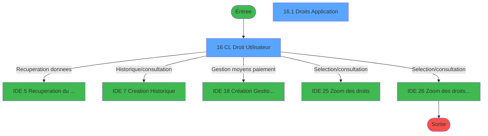
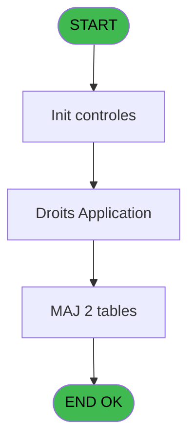
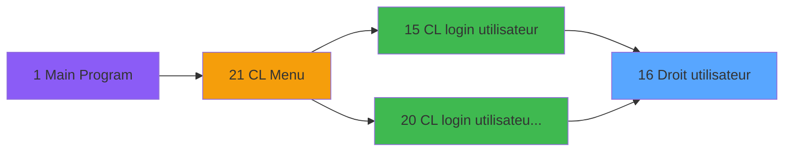
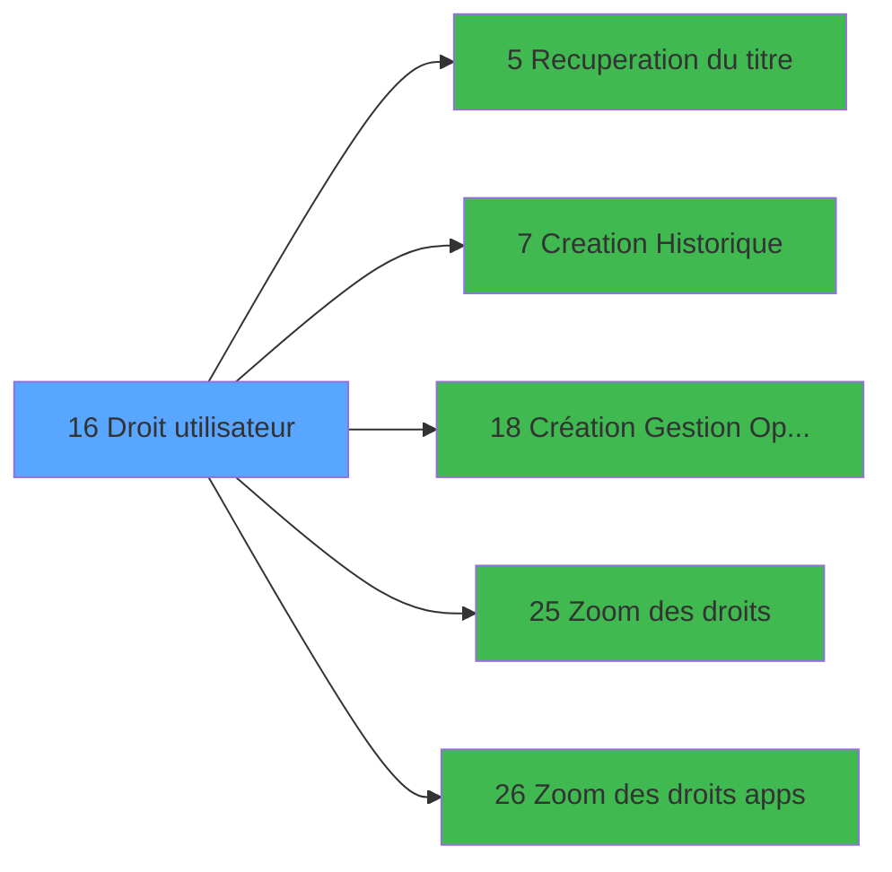

# LOG IDE 16 - Droit / utilisateur

> **Analyse**: Phases 1-4 2026-02-03 14:41 -> 14:41 (10s) | Assemblage 14:41
> **Pipeline**: V7.2 Enrichi
> **Structure**: 4 onglets (Resume | Ecrans | Donnees | Connexions)

<!-- TAB:Resume -->

## 1. FICHE D'IDENTITE

| Attribut | Valeur |
|----------|--------|
| Projet | LOG |
| IDE Position | 16 |
| Nom Programme | Droit / utilisateur |
| Fichier source | `Prg_16.xml` |
| Dossier IDE | Logins |
| Taches | 4 (2 ecrans visibles) |
| Tables modifiees | 2 |
| Programmes appeles | 5 |

## 2. DESCRIPTION FONCTIONNELLE

**Droit / utilisateur** assure la gestion complete de ce processus, accessible depuis [CL login utilisateur (IDE 15)](LOG-IDE-15.md), [CL login utilisateur   *SAV* (IDE 20)](LOG-IDE-20.md).

Le flux de traitement s'organise en **1 blocs fonctionnels** :

- **Traitement** (4 taches) : traitements metier divers

**Donnees modifiees** : 2 tables en ecriture (commandes, utilisateur______uti).

Detail : phases du traitement

#### Phase 1 : Traitement (4 taches)

- **16** - CL Droit / Utilisateur **[[ECRAN]](#ecran-t1)**
- **16.1** - Droits Application **[[ECRAN]](#ecran-t2)**
- **16.2** - Del Droits Apps
- **16.3** - suppression

Delegue a : [Recuperation du titre (IDE 5)](LOG-IDE-5.md), [Création Gestion Opérateurs (IDE 18)](LOG-IDE-18.md)

#### Tables impactees

| Table | Operations | Role metier |
|-------|-----------|-------------|
| utilisateur______uti | **W** (2 usages) |  |
| commandes | **W** (1 usages) |  |

## 3. BLOCS FONCTIONNELS

### 3.1 Traitement (4 taches)

Traitements internes.

---

#### 16 - CL Droit / Utilisateur [[ECRAN]](#ecran-t1)

**Role** : Traitement : CL Droit / Utilisateur.
**Ecran** : 1296 x 214 DLU (MDI) | [Voir mockup](#ecran-t1)

3 sous-taches directes

| Tache | Nom | Bloc |
|-------|-----|------|
| [16.1](#t2) | Droits Application **[[ECRAN]](#ecran-t2)** | Traitement |
| [16.2](#t3) | Del Droits Apps | Traitement |
| [16.3](#t19) | suppression | Traitement |

**Variables liees** : F (v. cdrt droit existe), G (v. cdtr droit), H (v.ctrl droit apps), B (> utilisateur)
**Delegue a** : [Recuperation du titre (IDE 5)](LOG-IDE-5.md), [Création Gestion Opérateurs (IDE 18)](LOG-IDE-18.md)

---

#### 16.1 - Droits Application [[ECRAN]](#ecran-t2)

**Role** : Traitement : Droits Application.
**Ecran** : 640 x 164 DLU (Modal) | [Voir mockup](#ecran-t2)
**Delegue a** : [Recuperation du titre (IDE 5)](LOG-IDE-5.md), [Création Gestion Opérateurs (IDE 18)](LOG-IDE-18.md), [Zoom des droits apps (IDE 26)](LOG-IDE-26.md)

---

#### 16.2 - Del Droits Apps

**Role** : Traitement : Del Droits Apps.
**Variables liees** : H (v.ctrl droit apps)
**Delegue a** : [Recuperation du titre (IDE 5)](LOG-IDE-5.md), [Création Gestion Opérateurs (IDE 18)](LOG-IDE-18.md)

---

#### 16.3 - suppression

**Role** : Traitement : suppression.
**Delegue a** : [Recuperation du titre (IDE 5)](LOG-IDE-5.md), [Création Gestion Opérateurs (IDE 18)](LOG-IDE-18.md)

## 5. REGLES METIER

*(Aucune regle metier identifiee)*

## 6. CONTEXTE

- **Appele par**: [CL login utilisateur (IDE 15)](LOG-IDE-15.md), [CL login utilisateur   *SAV* (IDE 20)](LOG-IDE-20.md)
- **Appelle**: 5 programmes | **Tables**: 5 (W:2 R:0 L:3) | **Taches**: 4 | **Expressions**: 23

<!-- TAB:Ecrans -->

## 8. ECRANS

### 8.1 Forms visibles (2 / 4)

| # | Position | Tache | Nom | Type | Largeur | Hauteur | Bloc |
|---|----------|-------|-----|------|---------|---------|------|
| 1 | 16 | 16 | CL Droit / Utilisateur | MDI | 1296 | 214 | Traitement |
| 2 | 16.1 | 16.1 | Droits Application | Modal | 640 | 164 | Traitement |

### 8.2 Mockups Ecrans

---

#### 16 - CL Droit / Utilisateur
**Tache** : [16](#t1) | **Type** : MDI | **Dimensions** : 1296 x 214 DLU
**Bloc** : Traitement | **Titre IDE** : CL Droit / Utilisateur

<!-- FORM-DATA:
{
    "width":  1296,
    "vFactor":  8,
    "type":  "MDI",
    "hFactor":  8,
    "controls":  [
                     {
                         "x":  1,
                         "type":  "label",
                         "var":  "",
                         "y":  0,
                         "w":  1285,
                         "fmt":  "",
                         "name":  "",
                         "h":  19,
                         "color":  "",
                         "text":  "",
                         "parent":  null
                     },
                     {
                         "x":  47,
                         "type":  "table",
                         "var":  "",
                         "name":  "",
                         "titleH":  18,
                         "color":  "110",
                         "w":  570,
                         "y":  49,
                         "fmt":  "",
                         "parent":  null,
                         "text":  "",
                         "rowH":  14,
                         "h":  134,
                         "cols":  [
                                      {
                                          "title":  "Droit",
                                          "layer":  1,
                                          "w":  532
                                      }
                                  ],
                         "rows":  1
                     },
                     {
                         "x":  1,
                         "type":  "label",
                         "var":  "",
                         "y":  188,
                         "w":  1285,
                         "fmt":  "",
                         "name":  "",
                         "h":  24,
                         "color":  "",
                         "text":  "",
                         "parent":  null
                     },
                     {
                         "x":  103,
                         "type":  "edit",
                         "var":  "",
                         "y":  28,
                         "w":  444,
                         "fmt":  "",
                         "name":  "",
                         "h":  10,
                         "color":  "7",
                         "text":  "",
                         "parent":  null
                     },
                     {
                         "x":  56,
                         "type":  "edit",
                         "var":  "",
                         "y":  70,
                         "w":  120,
                         "fmt":  "",
                         "name":  "DUT Droits",
                         "h":  8,
                         "color":  "110",
                         "text":  "",
                         "parent":  5
                     },
                     {
                         "x":  208,
                         "type":  "edit",
                         "var":  "",
                         "y":  70,
                         "w":  344,
                         "fmt":  "",
                         "name":  "",
                         "h":  8,
                         "color":  "110",
                         "text":  "",
                         "parent":  5
                     },
                     {
                         "x":  7,
                         "type":  "edit",
                         "var":  "",
                         "y":  5,
                         "w":  384,
                         "fmt":  "30",
                         "name":  "",
                         "h":  8,
                         "color":  "",
                         "text":  "",
                         "parent":  1
                     },
                     {
                         "x":  975,
                         "type":  "edit",
                         "var":  "",
                         "y":  5,
                         "w":  302,
                         "fmt":  "WWW DD MMM YYYYT",
                         "name":  "",
                         "h":  8,
                         "color":  "",
                         "text":  "",
                         "parent":  null
                     },
                     {
                         "x":  9,
                         "type":  "button",
                         "var":  "",
                         "y":  191,
                         "w":  154,
                         "fmt":  "\u0026Quitter",
                         "name":  "",
                         "h":  18,
                         "color":  "",
                         "text":  "",
                         "parent":  9
                     },
                     {
                         "x":  169,
                         "type":  "button",
                         "var":  "",
                         "y":  191,
                         "w":  154,
                         "fmt":  "\u0026Suppression",
                         "name":  "",
                         "h":  18,
                         "color":  "",
                         "text":  "",
                         "parent":  9
                     },
                     {
                         "x":  329,
                         "type":  "button",
                         "var":  "",
                         "y":  191,
                         "w":  154,
                         "fmt":  "\u0026Creation",
                         "name":  "",
                         "h":  18,
                         "color":  "",
                         "text":  "",
                         "parent":  9
                     },
                     {
                         "x":  489,
                         "type":  "button",
                         "var":  "",
                         "y":  191,
                         "w":  154,
                         "fmt":  "A\u0026bandonner",
                         "name":  "",
                         "h":  18,
                         "color":  "",
                         "text":  "",
                         "parent":  9
                     }
                 ],
    "taskId":  "16",
    "height":  214
}
-->

<strong>Champs : 5 champs</strong>

| Pos (x,y) | Nom | Variable | Type |
|-----------|-----|----------|------|
| 103,28 | (sans nom) | - | edit |
| 56,70 | DUT Droits | - | edit |
| 208,70 | (sans nom) | - | edit |
| 7,5 | 30 | - | edit |
| 975,5 | WWW DD MMM YYYYT | - | edit |

<strong>Boutons : 4 boutons</strong>

| Bouton | Pos (x,y) | Action |
|--------|-----------|--------|
| Quitter | 9,191 | Quitte le programme |
| Suppression | 169,191 | Supprime l'element selectionne |
| Creation | 329,191 | Appel [Creation Historique (IDE 7)](LOG-IDE-7.md) |
| Abandonner | 489,191 | Annule et retour au menu |

---

#### 16.1 - Droits Application
**Tache** : [16.1](#t2) | **Type** : Modal | **Dimensions** : 640 x 164 DLU
**Bloc** : Traitement | **Titre IDE** : Droits Application

<!-- FORM-DATA:
{
    "width":  640,
    "vFactor":  8,
    "type":  "Modal",
    "hFactor":  8,
    "controls":  [
                     {
                         "x":  67,
                         "type":  "table",
                         "var":  "",
                         "name":  "",
                         "titleH":  18,
                         "color":  "110",
                         "w":  569,
                         "y":  27,
                         "fmt":  "",
                         "parent":  null,
                         "text":  "",
                         "rowH":  14,
                         "h":  134,
                         "cols":  [
                                      {
                                          "title":  "Droit Application",
                                          "layer":  1,
                                          "w":  535
                                      }
                                  ],
                         "rows":  1
                     },
                     {
                         "x":  87,
                         "type":  "label",
                         "var":  "",
                         "y":  29,
                         "w":  522,
                         "fmt":  "",
                         "name":  "",
                         "h":  13,
                         "color":  "7",
                         "text":  "Droit Application",
                         "parent":  null
                     },
                     {
                         "x":  77,
                         "type":  "edit",
                         "var":  "",
                         "y":  48,
                         "w":  120,
                         "fmt":  "",
                         "name":  "DUT Droits",
                         "h":  8,
                         "color":  "110",
                         "text":  "",
                         "parent":  1
                     },
                     {
                         "x":  219,
                         "type":  "edit",
                         "var":  "",
                         "y":  48,
                         "w":  370,
                         "fmt":  "",
                         "name":  "",
                         "h":  8,
                         "color":  "110",
                         "text":  "",
                         "parent":  1
                     }
                 ],
    "taskId":  "16.1",
    "height":  164
}
-->

<strong>Champs : 2 champs</strong>

| Pos (x,y) | Nom | Variable | Type |
|-----------|-----|----------|------|
| 77,48 | DUT Droits | - | edit |
| 219,48 | (sans nom) | - | edit |

## 9. NAVIGATION

### 9.1 Enchainement des ecrans

**Detail par enchainement :**

| Depuis | Action | Vers | Retour |
|--------|--------|------|--------|
| CL Droit / Utilisateur | Recuperation donnees | [Recuperation du titre (IDE 5)](LOG-IDE-5.md) | Retour ecran |
| CL Droit / Utilisateur | Historique/consultation | [Creation Historique (IDE 7)](LOG-IDE-7.md) | Retour ecran |
| CL Droit / Utilisateur | Gestion moyens paiement | [Création Gestion Opérateurs (IDE 18)](LOG-IDE-18.md) | Retour ecran |
| CL Droit / Utilisateur | Selection/consultation | [Zoom des droits (IDE 25)](LOG-IDE-25.md) | Retour ecran |
| CL Droit / Utilisateur | Selection/consultation | [Zoom des droits apps (IDE 26)](LOG-IDE-26.md) | Retour ecran |

### 9.3 Structure hierarchique (4 taches)

| Position | Tache | Type | Dimensions | Bloc |
|----------|-------|------|------------|------|
| **16.1** | [**CL Droit / Utilisateur** (16)](#t1) [mockup](#ecran-t1) | MDI | 1296x214 | Traitement |
| 16.1.1 | [Droits Application (16.1)](#t2) [mockup](#ecran-t2) | Modal | 640x164 | |
| 16.1.2 | [Del Droits Apps (16.2)](#t3) | - | - | |
| 16.1.3 | [suppression (16.3)](#t19) | MDI | - | |

### 9.4 Algorigramme

> **Legende**: Vert = START/END OK | Rouge = END KO | Bleu = Decisions
> *Algorigramme auto-genere. Utiliser `/algorigramme` pour une synthese metier detaillee.*

<!-- TAB:Donnees -->

## 10. TABLES

### Tables utilisees (5)

| ID | Nom | Description | Type | R | W | L | Usages |
|----|-----|-------------|------|---|---|---|--------|
| 691 | commandes |  | DB |   | **W** |   | 1 |
| 716 | gm_type_millesia |  | DB |   |   | L | 2 |
| 717 | type_de_continent |  | DB |   |   | L | 1 |
| 718 | utilisateur______uti |  | DB |   | **W** |   | 2 |
| 723 | arc_client_gm |  | DB |   |   | L | 1 |

### Colonnes par table (1 / 2 tables avec colonnes identifiees)

Table 691 - commandes (**W**) - 1 usages

*Table utilisee uniquement en Link ou aucune colonne Real identifiee dans le DataView.*

Table 718 - utilisateur______uti (**W**) - 2 usages

| Lettre | Variable | Acces | Type |
|--------|----------|-------|------|
| A | > societe | W | Alpha |
| B | > utilisateur | W | Alpha |
| C | > description | W | Alpha |
| D | > groupe | W | Alpha |
| E | v. creation | W | Logical |
| F | v. cdrt droit existe | W | Logical |
| G | v. cdtr droit | W | Logical |
| H | v.ctrl droit apps | W | Logical |
| I | W0 titre | W | Alpha |
| J | v.delete right | W | Logical |
| K | v.ClauseWhere | W | Alpha |

## 11. VARIABLES

### 11.1 Variables de session (6)

Variables persistantes pendant toute la session.

| Lettre | Nom | Type | Usage dans |
|--------|-----|------|-----------|
| E | v. creation | Logical | - |
| F | v. cdrt droit existe | Logical | - |
| G | v. cdtr droit | Logical | - |
| H | v.ctrl droit apps | Logical | [16](#t1), [16.1](#t2), [16.2](#t3) |
| J | v.delete right | Logical | - |
| K | v.ClauseWhere | Alpha | - |

### 11.2 Variables de travail (1)

Variables internes au programme.

| Lettre | Nom | Type | Usage dans |
|--------|-----|------|-----------|
| I | W0 titre | Alpha | 1x calcul interne |

### 11.3 Autres (4)

Variables diverses.

| Lettre | Nom | Type | Usage dans |
|--------|-----|------|-----------|
| A | > societe | Alpha | 1x refs |
| B | > utilisateur | Alpha | [16](#t1) |
| C | > description | Alpha | - |
| D | > groupe | Alpha | 1x refs |

## 12. EXPRESSIONS

**23 / 23 expressions decodees (100%)**

### 12.1 Repartition par type

| Type | Expressions | Regles |
|------|-------------|--------|
| CONSTANTE | 1 | 0 |
| DATE | 1 | 0 |
| CAST_LOGIQUE | 4 | 0 |
| CONDITION | 8 | 0 |
| OTHER | 7 | 0 |
| REFERENCE_VG | 1 | 0 |
| STRING | 1 | 0 |

### 12.2 Expressions cles par type

#### CONSTANTE (1 expressions)

| Type | IDE | Expression | Regle |
|------|-----|------------|-------|
| CONSTANTE | 11 | `7` | - |

#### DATE (1 expressions)

| Type | IDE | Expression | Regle |
|------|-----|------------|-------|
| DATE | 7 | `Date ()` | - |

#### CAST_LOGIQUE (4 expressions)

| Type | IDE | Expression | Regle |
|------|-----|------------|-------|
| CAST_LOGIQUE | 13 | `'TRUE'LOG` | - |
| CAST_LOGIQUE | 18 | `'FALSE'LOG` | - |
| CAST_LOGIQUE | 1 | `INIPut ('AllowCreateInModify = Y','FALSE'LOG)` | - |
| CAST_LOGIQUE | 2 | `INIPut ('AllowCreateInModify = N','FALSE'LOG)` | - |

#### CONDITION (8 expressions)

| Type | IDE | Expression | Regle |
|------|-----|------------|-------|
| CONDITION | 22 | `> groupe [D]` | - |
| CONDITION | 21 | `'droit <> ''CAISSEADH'' '` | - |
| CONDITION | 9 | `Trim(v.ctrl droit apps [H])<>'' AND NOT ([M]) AND Stat (0,'C'MODE)` | - |
| CONDITION | 23 | `VG10 AND [AR] <> 'A'` | - |
| CONDITION | 4 | `> utilisateur [B]` | - |
| ... | | *+3 autres* | |

#### OTHER (7 expressions)

| Type | IDE | Expression | Regle |
|------|-----|------------|-------|
| OTHER | 15 | `Stat (0,'D'MODE)` | - |
| OTHER | 19 | `[M]` | - |
| OTHER | 20 | `[P]` | - |
| OTHER | 14 | `Stat (0,'C'MODE)` | - |
| OTHER | 5 | `v.ctrl droit apps [H]` | - |
| ... | | *+2 autres* | |

#### REFERENCE_VG (1 expressions)

| Type | IDE | Expression | Regle |
|------|-----|------------|-------|
| REFERENCE_VG | 6 | `VG2` | - |

#### STRING (1 expressions)

| Type | IDE | Expression | Regle |
|------|-----|------------|-------|
| STRING | 8 | `Trim ([R])` | - |

### 12.3 Toutes les expressions (23)

Voir les 23 expressions

#### CONSTANTE (1)

| IDE | Expression Decodee |
|-----|-------------------|
| 11 | `7` |

#### DATE (1)

| IDE | Expression Decodee |
|-----|-------------------|
| 7 | `Date ()` |

#### CAST_LOGIQUE (4)

| IDE | Expression Decodee |
|-----|-------------------|
| 1 | `INIPut ('AllowCreateInModify = Y','FALSE'LOG)` |
| 2 | `INIPut ('AllowCreateInModify = N','FALSE'LOG)` |
| 13 | `'TRUE'LOG` |
| 18 | `'FALSE'LOG` |

#### CONDITION (8)

| IDE | Expression Decodee |
|-----|-------------------|
| 3 | `> societe [A]` |
| 4 | `> utilisateur [B]` |
| 16 | `v.ctrl droit apps [H]='PLANNINGB' AND Stat(0,'C'MODE)` |
| 17 | `v.ctrl droit apps [H]='PLANNINGB' AND Stat(0,'D'MODE)` |
| 21 | `'droit <> ''CAISSEADH'' '` |
| 22 | `> groupe [D]` |
| 23 | `VG10 AND [AR] <> 'A'` |
| 9 | `Trim(v.ctrl droit apps [H])<>'' AND NOT ([M]) AND Stat (0,'C'MODE)` |

#### OTHER (7)

| IDE | Expression Decodee |
|-----|-------------------|
| 5 | `v.ctrl droit apps [H]` |
| 10 | `W0 titre [I] AND Stat (0,'C'MODE)` |
| 12 | `v.ctrl droit apps [H]` |
| 14 | `Stat (0,'C'MODE)` |
| 15 | `Stat (0,'D'MODE)` |
| 19 | `[M]` |
| 20 | `[P]` |

#### REFERENCE_VG (1)

| IDE | Expression Decodee |
|-----|-------------------|
| 6 | `VG2` |

#### STRING (1)

| IDE | Expression Decodee |
|-----|-------------------|
| 8 | `Trim ([R])` |

<!-- TAB:Connexions -->

## 13. GRAPHE D'APPELS

### 13.1 Chaine depuis Main (Callers)

Main -> ... -> [CL login utilisateur (IDE 15)](LOG-IDE-15.md) -> **Droit / utilisateur (IDE 16)**

Main -> ... -> [CL login utilisateur   *SAV* (IDE 20)](LOG-IDE-20.md) -> **Droit / utilisateur (IDE 16)**

### 13.2 Callers

| IDE | Nom Programme | Nb Appels |
|-----|---------------|-----------|
| [15](LOG-IDE-15.md) | CL login utilisateur | 1 |
| [20](LOG-IDE-20.md) | CL login utilisateur   *SAV* | 1 |

### 13.3 Callees (programmes appeles)

### 13.4 Detail Callees avec contexte

| IDE | Nom Programme | Appels | Contexte |
|-----|---------------|--------|----------|
| [5](LOG-IDE-5.md) | Recuperation du titre | 1 | Recuperation donnees |
| [7](LOG-IDE-7.md) | Creation Historique | 1 | Historique/consultation |
| [18](LOG-IDE-18.md) | Création Gestion Opérateurs | 1 | Gestion moyens paiement |
| [25](LOG-IDE-25.md) | Zoom des droits | 1 | Selection/consultation |
| [26](LOG-IDE-26.md) | Zoom des droits apps | 1 | Selection/consultation |

## 14. RECOMMANDATIONS MIGRATION

### 14.1 Profil du programme

| Metrique | Valeur | Impact migration |
|----------|--------|-----------------|
| Lignes de logique | 84 | Programme compact |
| Expressions | 23 | Peu de logique |
| Tables WRITE | 2 | Impact faible |
| Sous-programmes | 5 | Peu de dependances |
| Ecrans visibles | 2 | Quelques ecrans |
| Code desactive | 0% (0 / 84) | Code sain |
| Regles metier | 0 | Pas de regle identifiee |

### 14.2 Plan de migration par bloc

#### Traitement (4 taches: 2 ecrans, 2 traitements)

- **Strategie** : Orchestrateur avec 2 ecrans (Razor/React) et 2 traitements backend (services).
- Les ecrans deviennent des composants UI, les traitements invisibles deviennent des services injectables.
- 5 sous-programme(s) a migrer ou a reutiliser depuis les services existants.
- Decomposer les taches en services unitaires testables.

### 14.3 Dependances critiques

| Dependance | Type | Appels | Impact |
|------------|------|--------|--------|
| commandes | Table WRITE (Database) | 1x | Schema + repository |
| utilisateur______uti | Table WRITE (Database) | 2x | Schema + repository |
| [Zoom des droits (IDE 25)](LOG-IDE-25.md) | Sous-programme | 1x | Normale - Selection/consultation |
| [Zoom des droits apps (IDE 26)](LOG-IDE-26.md) | Sous-programme | 1x | Normale - Selection/consultation |
| [Création Gestion Opérateurs (IDE 18)](LOG-IDE-18.md) | Sous-programme | 1x | Normale - Gestion moyens paiement |
| [Recuperation du titre (IDE 5)](LOG-IDE-5.md) | Sous-programme | 1x | Normale - Recuperation donnees |
| [Creation Historique (IDE 7)](LOG-IDE-7.md) | Sous-programme | 1x | Normale - Historique/consultation |

---
*Spec DETAILED generee par Pipeline V7.2 - 2026-02-03 14:41*
