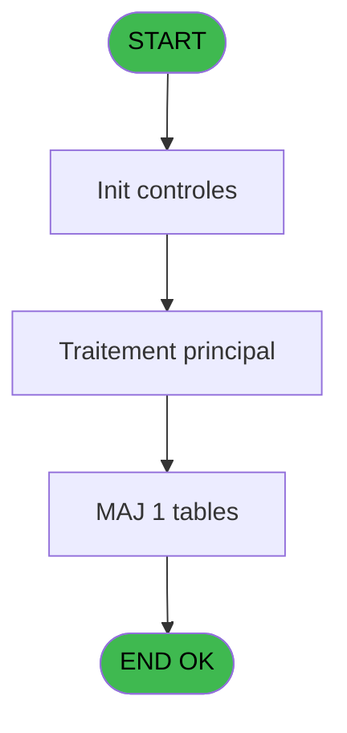
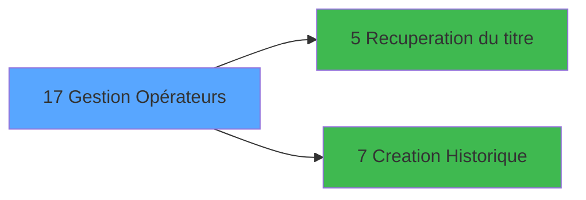

# LOG IDE 17 - Gestion Opérateurs

> **Analyse**: Phases 1-4 2026-02-03 14:41 -> 14:42 (10s) | Assemblage 14:42
> **Pipeline**: V7.2 Enrichi
> **Structure**: 4 onglets (Resume | Ecrans | Donnees | Connexions)

<!-- TAB:Resume -->

## 1. FICHE D'IDENTITE

| Attribut | Valeur |
|----------|--------|
| Projet | LOG |
| IDE Position | 17 |
| Nom Programme | Gestion Opérateurs |
| Fichier source | `Prg_17.xml` |
| Dossier IDE | Logins |
| Taches | 1 (1 ecrans visibles) |
| Tables modifiees | 1 |
| Programmes appeles | 2 |

## 2. DESCRIPTION FONCTIONNELLE

**Gestion Opérateurs** assure la gestion complete de ce processus, accessible depuis [CL login utilisateur (IDE 15)](LOG-IDE-15.md), [CL login utilisateur   *SAV* (IDE 20)](LOG-IDE-20.md).

Le flux de traitement s'organise en **1 blocs fonctionnels** :

- **Traitement** (1 tache) : traitements metier divers

**Donnees modifiees** : 1 tables en ecriture (commandes).

**Logique metier** : 2 regles identifiees couvrant conditions metier.

## 3. BLOCS FONCTIONNELS

### 3.1 Traitement (1 tache)

Traitements internes.

---

#### 17 - Ecran [[ECRAN]](#ecran-t1)

**Role** : Traitement : Ecran.
**Ecran** : 787 x 311 DLU (MDI) | [Voir mockup](#ecran-t1)
**Delegue a** : [Recuperation du titre (IDE 5)](LOG-IDE-5.md)

## 5. REGLES METIER

2 regles identifiees:

### Autres (2 regles)

#### [RM-001] Si Stat (0 alors 'C'MODE) sinon 'CRUT',IF (Stat (0,'M'MODE),'MOUT','ANUT'))

| Element | Detail |
|---------|--------|
| **Condition** | `Stat (0` |
| **Si vrai** | 'C'MODE) |
| **Si faux** | 'CRUT',IF (Stat (0,'M'MODE),'MOUT','ANUT')) |
| **Expression source** | Expression 1 : `IF (Stat (0,'C'MODE),'CRUT',IF (Stat (0,'M'MODE),'MOUT','ANU` |
| **Exemple** | Si Stat (0 → 'C'MODE). Sinon → 'CRUT',IF (Stat (0,'M'MODE),'MOUT','ANUT')) |

#### [RM-002] Si [O]='B' alors 'O' sinon 'N')

| Element | Detail |
|---------|--------|
| **Condition** | `[O]='B'` |
| **Si vrai** | 'O' |
| **Si faux** | 'N') |
| **Expression source** | Expression 9 : `IF ([O]='B','O','N')` |
| **Exemple** | Si [O]='B' → 'O'. Sinon → 'N') |

## 6. CONTEXTE

- **Appele par**: [CL login utilisateur (IDE 15)](LOG-IDE-15.md), [CL login utilisateur   *SAV* (IDE 20)](LOG-IDE-20.md)
- **Appelle**: 2 programmes | **Tables**: 1 (W:1 R:0 L:0) | **Taches**: 1 | **Expressions**: 18

<!-- TAB:Ecrans -->

## 8. ECRANS

### 8.1 Forms visibles (1 / 1)

| # | Position | Tache | Nom | Type | Largeur | Hauteur | Bloc |
|---|----------|-------|-----|------|---------|---------|------|
| 1 | 17 | 17 | Ecran | MDI | 787 | 311 | Traitement |

### 8.2 Mockups Ecrans

---

#### 17 - Ecran
**Tache** : [17](#t1) | **Type** : MDI | **Dimensions** : 787 x 311 DLU
**Bloc** : Traitement | **Titre IDE** : Ecran

<!-- FORM-DATA:
{
    "width":  787,
    "vFactor":  8,
    "type":  "MDI",
    "hFactor":  8,
    "controls":  [
                     {
                         "x":  0,
                         "type":  "label",
                         "var":  "",
                         "y":  1,
                         "w":  785,
                         "fmt":  "",
                         "name":  "",
                         "h":  20,
                         "color":  "",
                         "text":  "",
                         "parent":  null
                     },
                     {
                         "x":  37,
                         "type":  "label",
                         "var":  "",
                         "y":  27,
                         "w":  540,
                         "fmt":  "",
                         "name":  "",
                         "h":  62,
                         "color":  "195",
                         "text":  "Informations",
                         "parent":  null
                     },
                     {
                         "x":  48,
                         "type":  "label",
                         "var":  "",
                         "y":  38,
                         "w":  144,
                         "fmt":  "",
                         "name":  "",
                         "h":  10,
                         "color":  "",
                         "text":  "Nom Complet",
                         "parent":  4
                     },
                     {
                         "x":  48,
                         "type":  "label",
                         "var":  "",
                         "y":  57,
                         "w":  126,
                         "fmt":  "",
                         "name":  "",
                         "h":  10,
                         "color":  "",
                         "text":  "Date Création",
                         "parent":  4
                     },
                     {
                         "x":  320,
                         "type":  "label",
                         "var":  "",
                         "y":  57,
                         "w":  84,
                         "fmt":  "",
                         "name":  "",
                         "h":  10,
                         "color":  "",
                         "text":  "Cree par",
                         "parent":  4
                     },
                     {
                         "x":  48,
                         "type":  "label",
                         "var":  "",
                         "y":  76,
                         "w":  117,
                         "fmt":  "",
                         "name":  "",
                         "h":  10,
                         "color":  "",
                         "text":  "Dernier Accès",
                         "parent":  4
                     },
                     {
                         "x":  333,
                         "type":  "label",
                         "var":  "",
                         "y":  76,
                         "w":  18,
                         "fmt":  "",
                         "name":  "",
                         "h":  8,
                         "color":  "",
                         "text":  "à",
                         "parent":  4
                     },
                     {
                         "x":  37,
                         "type":  "label",
                         "var":  "",
                         "y":  94,
                         "w":  300,
                         "fmt":  "",
                         "name":  "",
                         "h":  28,
                         "color":  "",
                         "text":  "",
                         "parent":  null
                     },
                     {
                         "x":  67,
                         "type":  "label",
                         "var":  "",
                         "y":  103,
                         "w":  56,
                         "fmt":  "",
                         "name":  "",
                         "h":  12,
                         "color":  "",
                         "text":  "Accès",
                         "parent":  16
                     },
                     {
                         "x":  37,
                         "type":  "label",
                         "var":  "",
                         "y":  126,
                         "w":  540,
                         "fmt":  "",
                         "name":  "",
                         "h":  154,
                         "color":  "195",
                         "text":  "Droits",
                         "parent":  null
                     },
                     {
                         "x":  52,
                         "type":  "label",
                         "var":  "",
                         "y":  135,
                         "w":  88,
                         "fmt":  "",
                         "name":  "",
                         "h":  12,
                         "color":  "",
                         "text":  "Création",
                         "parent":  19
                     },
                     {
                         "x":  330,
                         "type":  "label",
                         "var":  "",
                         "y":  135,
                         "w":  113,
                         "fmt":  "",
                         "name":  "",
                         "h":  12,
                         "color":  "",
                         "text":  "Modification",
                         "parent":  19
                     },
                     {
                         "x":  52,
                         "type":  "label",
                         "var":  "",
                         "y":  150,
                         "w":  118,
                         "fmt":  "",
                         "name":  "",
                         "h":  12,
                         "color":  "",
                         "text":  "Suppression",
                         "parent":  19
                     },
                     {
                         "x":  330,
                         "type":  "label",
                         "var":  "",
                         "y":  150,
                         "w":  113,
                         "fmt":  "",
                         "name":  "",
                         "h":  12,
                         "color":  "",
                         "text":  "Affectation",
                         "parent":  19
                     },
                     {
                         "x":  52,
                         "type":  "label",
                         "var":  "",
                         "y":  165,
                         "w":  141,
                         "fmt":  "",
                         "name":  "",
                         "h":  12,
                         "color":  "",
                         "text":  "Supp. Période",
                         "parent":  19
                     },
                     {
                         "x":  330,
                         "type":  "label",
                         "var":  "",
                         "y":  165,
                         "w":  123,
                         "fmt":  "",
                         "name":  "",
                         "h":  12,
                         "color":  "",
                         "text":  "Prolongation",
                         "parent":  19
                     },
                     {
                         "x":  52,
                         "type":  "label",
                         "var":  "",
                         "y":  179,
                         "w":  109,
                         "fmt":  "",
                         "name":  "",
                         "h":  12,
                         "color":  "",
                         "text":  "Interruption",
                         "parent":  19
                     },
                     {
                         "x":  330,
                         "type":  "label",
                         "var":  "",
                         "y":  179,
                         "w":  137,
                         "fmt":  "",
                         "name":  "",
                         "h":  12,
                         "color":  "",
                         "text":  "Avancement",
                         "parent":  19
                     },
                     {
                         "x":  52,
                         "type":  "label",
                         "var":  "",
                         "y":  193,
                         "w":  136,
                         "fmt":  "",
                         "name":  "",
                         "h":  12,
                         "color":  "",
                         "text":  "Recodification",
                         "parent":  19
                     },
                     {
                         "x":  330,
                         "type":  "label",
                         "var":  "",
                         "y":  193,
                         "w":  105,
                         "fmt":  "",
                         "name":  "",
                         "h":  12,
                         "color":  "",
                         "text":  "Valid. Auto.",
                         "parent":  19
                     },
                     {
                         "x":  602,
                         "type":  "label",
                         "var":  "",
                         "y":  193,
                         "w":  175,
                         "fmt":  "",
                         "name":  "",
                         "h":  67,
                         "color":  "",
                         "text":  "",
                         "parent":  null
                     },
                     {
                         "x":  52,
                         "type":  "label",
                         "var":  "",
                         "y":  207,
                         "w":  136,
                         "fmt":  "",
                         "name":  "",
                         "h":  12,
                         "color":  "",
                         "text":  "Messagerie",
                         "parent":  19
                     },
                     {
                         "x":  330,
                         "type":  "label",
                         "var":  "",
                         "y":  207,
                         "w":  94,
                         "fmt":  "",
                         "name":  "",
                         "h":  12,
                         "color":  "",
                         "text":  "Validation",
                         "parent":  19
                     },
                     {
                         "x":  52,
                         "type":  "label",
                         "var":  "",
                         "y":  221,
                         "w":  136,
                         "fmt":  "",
                         "name":  "",
                         "h":  12,
                         "color":  "",
                         "text":  "Dévalidation",
                         "parent":  19
                     },
                     {
                         "x":  330,
                         "type":  "label",
                         "var":  "",
                         "y":  221,
                         "w":  107,
                         "fmt":  "",
                         "name":  "",
                         "h":  12,
                         "color":  "",
                         "text":  "Immigration",
                         "parent":  19
                     },
                     {
                         "x":  52,
                         "type":  "label",
                         "var":  "",
                         "y":  235,
                         "w":  136,
                         "fmt":  "",
                         "name":  "",
                         "h":  12,
                         "color":  "",
                         "text":  "Libération",
                         "parent":  19
                     },
                     {
                         "x":  330,
                         "type":  "label",
                         "var":  "",
                         "y":  235,
                         "w":  107,
                         "fmt":  "",
                         "name":  "",
                         "h":  12,
                         "color":  "",
                         "text":  "Blocage",
                         "parent":  19
                     },
                     {
                         "x":  52,
                         "type":  "label",
                         "var":  "",
                         "y":  249,
                         "w":  96,
                         "fmt":  "",
                         "name":  "",
                         "h":  12,
                         "color":  "",
                         "text":  "Statuts",
                         "parent":  19
                     },
                     {
                         "x":  330,
                         "type":  "label",
                         "var":  "",
                         "y":  249,
                         "w":  107,
                         "fmt":  "",
                         "name":  "",
                         "h":  12,
                         "color":  "",
                         "text":  "Carte / Tel.",
                         "parent":  19
                     },
                     {
                         "x":  2,
                         "type":  "label",
                         "var":  "",
                         "y":  285,
                         "w":  782,
                         "fmt":  "",
                         "name":  "",
                         "h":  24,
                         "color":  "",
                         "text":  "",
                         "parent":  null
                     },
                     {
                         "x":  52,
                         "type":  "label",
                         "var":  "",
                         "y":  264,
                         "w":  130,
                         "fmt":  "",
                         "name":  "Affectation auto",
                         "h":  12,
                         "color":  "",
                         "text":  "Affectation auto",
                         "parent":  19
                     },
                     {
                         "x":  614,
                         "type":  "edit",
                         "var":  "",
                         "y":  110,
                         "w":  139,
                         "fmt":  "",
                         "name":  "",
                         "h":  8,
                         "color":  "140",
                         "text":  "",
                         "parent":  null
                     },
                     {
                         "x":  199,
                         "type":  "edit",
                         "var":  "",
                         "y":  38,
                         "w":  336,
                         "fmt":  "",
                         "name":  "",
                         "h":  10,
                         "color":  "",
                         "text":  "",
                         "parent":  4
                     },
                     {
                         "x":  199,
                         "type":  "edit",
                         "var":  "",
                         "y":  57,
                         "w":  104,
                         "fmt":  "##/##/##",
                         "name":  "",
                         "h":  10,
                         "color":  "",
                         "text":  "",
                         "parent":  4
                     },
                     {
                         "x":  409,
                         "type":  "edit",
                         "var":  "",
                         "y":  57,
                         "w":  126,
                         "fmt":  "",
                         "name":  "",
                         "h":  10,
                         "color":  "",
                         "text":  "",
                         "parent":  4
                     },
                     {
                         "x":  199,
                         "type":  "edit",
                         "var":  "",
                         "y":  76,
                         "w":  104,
                         "fmt":  "##/##/##",
                         "name":  "",
                         "h":  10,
                         "color":  "",
                         "text":  "",
                         "parent":  4
                     },
                     {
                         "x":  409,
                         "type":  "edit",
                         "var":  "",
                         "y":  76,
                         "w":  104,
                         "fmt":  "",
                         "name":  "",
                         "h":  10,
                         "color":  "",
                         "text":  "",
                         "parent":  4
                     },
                     {
                         "x":  198,
                         "type":  "combobox",
                         "var":  "",
                         "y":  103,
                         "w":  133,
                         "fmt":  "",
                         "name":  "",
                         "h":  12,
                         "color":  "",
                         "text":  "Front Office,Back Office",
                         "parent":  null
                     },
                     {
                         "x":  196,
                         "type":  "combobox",
                         "var":  "",
                         "y":  135,
                         "w":  75,
                         "fmt":  "",
                         "name":  "aut_creation",
                         "h":  12,
                         "color":  "",
                         "text":  "Oui,Non",
                         "parent":  null
                     },
                     {
                         "x":  470,
                         "type":  "combobox",
                         "var":  "",
                         "y":  135,
                         "w":  75,
                         "fmt":  "",
                         "name":  "aut_modification",
                         "h":  12,
                         "color":  "",
                         "text":  "Oui,Non",
                         "parent":  null
                     },
                     {
                         "x":  196,
                         "type":  "combobox",
                         "var":  "",
                         "y":  150,
                         "w":  75,
                         "fmt":  "",
                         "name":  "aut_suppression",
                         "h":  12,
                         "color":  "",
                         "text":  "Oui,Non",
                         "parent":  null
                     },
                     {
                         "x":  470,
                         "type":  "combobox",
                         "var":  "",
                         "y":  150,
                         "w":  75,
                         "fmt":  "",
                         "name":  "aut_affectation",
                         "h":  12,
                         "color":  "",
                         "text":  "Oui,Non",
                         "parent":  null
                     },
                     {
                         "x":  198,
                         "type":  "combobox",
                         "var":  "",
                         "y":  165,
                         "w":  75,
                         "fmt":  "",
                         "name":  "aut_supp_periode",
                         "h":  12,
                         "color":  "",
                         "text":  "Oui,Non",
                         "parent":  null
                     },
                     {
                         "x":  472,
                         "type":  "combobox",
                         "var":  "",
                         "y":  165,
                         "w":  75,
                         "fmt":  "",
                         "name":  "aut_prolongation",
                         "h":  12,
                         "color":  "",
                         "text":  "Oui,Non",
                         "parent":  null
                     },
                     {
                         "x":  198,
                         "type":  "combobox",
                         "var":  "",
                         "y":  179,
                         "w":  75,
                         "fmt":  "",
                         "name":  "aut_interruption",
                         "h":  12,
                         "color":  "",
                         "text":  "Oui,Non",
                         "parent":  null
                     },
                     {
                         "x":  472,
                         "type":  "combobox",
                         "var":  "",
                         "y":  179,
                         "w":  75,
                         "fmt":  "",
                         "name":  "aut_avancement",
                         "h":  12,
                         "color":  "",
                         "text":  "Oui,Non",
                         "parent":  null
                     },
                     {
                         "x":  198,
                         "type":  "combobox",
                         "var":  "",
                         "y":  193,
                         "w":  75,
                         "fmt":  "",
                         "name":  "aut_recodification",
                         "h":  12,
                         "color":  "",
                         "text":  "Oui,Non",
                         "parent":  null
                     },
                     {
                         "x":  472,
                         "type":  "combobox",
                         "var":  "",
                         "y":  193,
                         "w":  75,
                         "fmt":  "",
                         "name":  "aut_validation_auto",
                         "h":  12,
                         "color":  "",
                         "text":  "Oui,Non",
                         "parent":  null
                     },
                     {
                         "x":  198,
                         "type":  "combobox",
                         "var":  "",
                         "y":  207,
                         "w":  75,
                         "fmt":  "",
                         "name":  "aut_messagerie",
                         "h":  12,
                         "color":  "",
                         "text":  "Oui,Non",
                         "parent":  null
                     },
                     {
                         "x":  472,
                         "type":  "combobox",
                         "var":  "",
                         "y":  207,
                         "w":  75,
                         "fmt":  "",
                         "name":  "aut_validation",
                         "h":  12,
                         "color":  "",
                         "text":  "Oui,Non",
                         "parent":  null
                     },
                     {
                         "x":  198,
                         "type":  "combobox",
                         "var":  "",
                         "y":  221,
                         "w":  75,
                         "fmt":  "",
                         "name":  "aut_devalidation",
                         "h":  12,
                         "color":  "",
                         "text":  "Oui,Non",
                         "parent":  null
                     },
                     {
                         "x":  472,
                         "type":  "combobox",
                         "var":  "",
                         "y":  221,
                         "w":  75,
                         "fmt":  "",
                         "name":  "aut_immigration",
                         "h":  12,
                         "color":  "",
                         "text":  "Oui,Non",
                         "parent":  null
                     },
                     {
                         "x":  198,
                         "type":  "combobox",
                         "var":  "",
                         "y":  235,
                         "w":  75,
                         "fmt":  "",
                         "name":  "aut_liberation",
                         "h":  12,
                         "color":  "",
                         "text":  "Oui,Non",
                         "parent":  null
                     },
                     {
                         "x":  472,
                         "type":  "combobox",
                         "var":  "",
                         "y":  235,
                         "w":  75,
                         "fmt":  "",
                         "name":  "aut_blocage",
                         "h":  12,
                         "color":  "",
                         "text":  "Oui,Non",
                         "parent":  null
                     },
                     {
                         "x":  198,
                         "type":  "combobox",
                         "var":  "",
                         "y":  249,
                         "w":  75,
                         "fmt":  "",
                         "name":  "aut_statuts",
                         "h":  12,
                         "color":  "",
                         "text":  "Oui,Non",
                         "parent":  null
                     },
                     {
                         "x":  472,
                         "type":  "combobox",
                         "var":  "",
                         "y":  249,
                         "w":  75,
                         "fmt":  "",
                         "name":  "aut_carte_tel",
                         "h":  12,
                         "color":  "",
                         "text":  "Oui,Non",
                         "parent":  null
                     },
                     {
                         "x":  6,
                         "type":  "edit",
                         "var":  "",
                         "y":  7,
                         "w":  267,
                         "fmt":  "20",
                         "name":  "",
                         "h":  8,
                         "color":  "",
                         "text":  "",
                         "parent":  1
                     },
                     {
                         "x":  510,
                         "type":  "edit",
                         "var":  "",
                         "y":  7,
                         "w":  268,
                         "fmt":  "WWW DD MMM YYYYT",
                         "name":  "",
                         "h":  8,
                         "color":  "",
                         "text":  "",
                         "parent":  1
                     },
                     {
                         "x":  598,
                         "type":  "image",
                         "var":  "",
                         "y":  29,
                         "w":  174,
                         "fmt":  "",
                         "name":  "",
                         "h":  71,
                         "color":  "",
                         "text":  "",
                         "parent":  null
                     },
                     {
                         "x":  615,
                         "type":  "button",
                         "var":  "",
                         "y":  200,
                         "w":  154,
                         "fmt":  "\u0026Visualisation",
                         "name":  "",
                         "h":  14,
                         "color":  "",
                         "text":  "",
                         "parent":  null
                     },
                     {
                         "x":  615,
                         "type":  "button",
                         "var":  "",
                         "y":  220,
                         "w":  154,
                         "fmt":  "\u0026Modification",
                         "name":  "",
                         "h":  14,
                         "color":  "",
                         "text":  "",
                         "parent":  null
                     },
                     {
                         "x":  615,
                         "type":  "button",
                         "var":  "",
                         "y":  240,
                         "w":  154,
                         "fmt":  "\u0026Annulation",
                         "name":  "",
                         "h":  14,
                         "color":  "",
                         "text":  "",
                         "parent":  null
                     },
                     {
                         "x":  10,
                         "type":  "button",
                         "var":  "",
                         "y":  288,
                         "w":  154,
                         "fmt":  "\u0026Quitter",
                         "name":  "",
                         "h":  18,
                         "color":  "",
                         "text":  "",
                         "parent":  39
                     },
                     {
                         "x":  198,
                         "type":  "combobox",
                         "var":  "",
                         "y":  264,
                         "w":  75,
                         "fmt":  "",
                         "name":  "aut_affect_auto",
                         "h":  12,
                         "color":  "",
                         "text":  "Oui,Non",
                         "parent":  null
                     }
                 ],
    "taskId":  "17",
    "height":  311
}
-->

<strong>Champs : 28 champs</strong>

| Pos (x,y) | Nom | Variable | Type |
|-----------|-----|----------|------|
| 614,110 | (sans nom) | - | edit |
| 199,38 | (sans nom) | - | edit |
| 199,57 | ##/##/## | - | edit |
| 409,57 | (sans nom) | - | edit |
| 199,76 | ##/##/## | - | edit |
| 409,76 | (sans nom) | - | edit |
| 198,103 | Front Office,Back Office | - | combobox |
| 196,135 | aut_creation | - | combobox |
| 470,135 | aut_modification | - | combobox |
| 196,150 | aut_suppression | - | combobox |
| 470,150 | aut_affectation | - | combobox |
| 198,165 | aut_supp_periode | - | combobox |
| 472,165 | aut_prolongation | - | combobox |
| 198,179 | aut_interruption | - | combobox |
| 472,179 | aut_avancement | - | combobox |
| 198,193 | aut_recodification | - | combobox |
| 472,193 | aut_validation_auto | - | combobox |
| 198,207 | aut_messagerie | - | combobox |
| 472,207 | aut_validation | - | combobox |
| 198,221 | aut_devalidation | - | combobox |
| 472,221 | aut_immigration | - | combobox |
| 198,235 | aut_liberation | - | combobox |
| 472,235 | aut_blocage | - | combobox |
| 198,249 | aut_statuts | - | combobox |
| 472,249 | aut_carte_tel | - | combobox |
| 6,7 | 20 | - | edit |
| 510,7 | WWW DD MMM YYYYT | - | edit |
| 198,264 | aut_affect_auto | - | combobox |

<strong>Boutons : 4 boutons</strong>

| Bouton | Pos (x,y) | Action |
|--------|-----------|--------|
| Visualisation | 615,200 | Bouton fonctionnel |
| Modification | 615,220 | Modifie l'element |
| Annulation | 615,240 | Annule et retour au menu |
| Quitter | 10,288 | Quitte le programme |

## 9. NAVIGATION

Ecran unique: **Ecran**

### 9.3 Structure hierarchique (1 tache)

| Position | Tache | Type | Dimensions | Bloc |
|----------|-------|------|------------|------|
| **17.1** | [**Ecran** (17)](#t1) [mockup](#ecran-t1) | MDI | 787x311 | Traitement |

### 9.4 Algorigramme

> **Legende**: Vert = START/END OK | Rouge = END KO | Bleu = Decisions
> *Algorigramme auto-genere. Utiliser `/algorigramme` pour une synthese metier detaillee.*

<!-- TAB:Donnees -->

## 10. TABLES

### Tables utilisees (1)

| ID | Nom | Description | Type | R | W | L | Usages |
|----|-----|-------------|------|---|---|---|--------|
| 691 | commandes |  | DB |   | **W** |   | 1 |

### Colonnes par table (1 / 1 tables avec colonnes identifiees)

Table 691 - commandes (**W**) - 1 usages

| Lettre | Variable | Acces | Type |
|--------|----------|-------|------|
| A | > societe | W | Alpha |
| B | > nom personne | W | Alpha |
| C | > nom complet | W | Alpha |
| D | > responsable ? | W | Logical |
| E | v. titre | W | Alpha |

## 11. VARIABLES

### 11.1 Variables de session (1)

Variables persistantes pendant toute la session.

| Lettre | Nom | Type | Usage dans |
|--------|-----|------|-----------|
| E | v. titre | Alpha | - |

### 11.2 Autres (4)

Variables diverses.

| Lettre | Nom | Type | Usage dans |
|--------|-----|------|-----------|
| A | > societe | Alpha | 1x refs |
| B | > nom personne | Alpha | 1x refs |
| C | > nom complet | Alpha | 1x refs |
| D | > responsable ? | Logical | 1x refs |

## 12. EXPRESSIONS

**18 / 18 expressions decodees (100%)**

### 12.1 Repartition par type

| Type | Expressions | Regles |
|------|-------------|--------|
| CONDITION | 7 | 2 |
| CONSTANTE | 2 | 0 |
| DATE | 1 | 0 |
| OTHER | 3 | 0 |
| REFERENCE_VG | 2 | 0 |
| NEGATION | 1 | 0 |
| CAST_LOGIQUE | 1 | 0 |
| STRING | 1 | 0 |

### 12.2 Expressions cles par type

#### CONDITION (7 expressions)

| Type | IDE | Expression | Regle |
|------|-----|------------|-------|
| CONDITION | 9 | `IF ([O]='B','O','N')` | [RM-002](#rm-RM-002) |
| CONDITION | 1 | `IF (Stat (0,'C'MODE),'CRUT',IF (Stat (0,'M'MODE),'MOUT','ANUT'))` | [RM-001](#rm-RM-001) |
| CONDITION | 15 | `> nom complet [C]` | - |
| CONDITION | 17 | `[O]='F'` | - |
| CONDITION | 4 | `> nom personne [B]` | - |
| ... | | *+2 autres* | |

#### CONSTANTE (2 expressions)

| Type | IDE | Expression | Regle |
|------|-----|------------|-------|
| CONSTANTE | 12 | `6` | - |
| CONSTANTE | 5 | `'O'` | - |

#### DATE (1 expressions)

| Type | IDE | Expression | Regle |
|------|-----|------------|-------|
| DATE | 7 | `Date ()` | - |

#### OTHER (3 expressions)

| Type | IDE | Expression | Regle |
|------|-----|------------|-------|
| OTHER | 13 | `Stat (0,'E'MODE)` | - |
| OTHER | 8 | `Time ()` | - |
| OTHER | 2 | `Stat (0,'M'MODE)` | - |

#### REFERENCE_VG (2 expressions)

| Type | IDE | Expression | Regle |
|------|-----|------------|-------|
| REFERENCE_VG | 11 | `VG2` | - |
| REFERENCE_VG | 10 | `VG1` | - |

#### NEGATION (1 expressions)

| Type | IDE | Expression | Regle |
|------|-----|------------|-------|
| NEGATION | 14 | `NOT (Stat (0,'E'MODE))` | - |

#### CAST_LOGIQUE (1 expressions)

| Type | IDE | Expression | Regle |
|------|-----|------------|-------|
| CAST_LOGIQUE | 18 | `'FALSE'LOG` | - |

#### STRING (1 expressions)

| Type | IDE | Expression | Regle |
|------|-----|------------|-------|
| STRING | 6 | `Trim ([G])` | - |

<!-- TAB:Connexions -->

## 13. GRAPHE D'APPELS

### 13.1 Chaine depuis Main (Callers)

Main -> ... -> [CL login utilisateur (IDE 15)](LOG-IDE-15.md) -> **Gestion Opérateurs (IDE 17)**

Main -> ... -> [CL login utilisateur   *SAV* (IDE 20)](LOG-IDE-20.md) -> **Gestion Opérateurs (IDE 17)**

### 13.2 Callers

| IDE | Nom Programme | Nb Appels |
|-----|---------------|-----------|
| [15](LOG-IDE-15.md) | CL login utilisateur | 1 |
| [20](LOG-IDE-20.md) | CL login utilisateur   *SAV* | 1 |

### 13.3 Callees (programmes appeles)

### 13.4 Detail Callees avec contexte

| IDE | Nom Programme | Appels | Contexte |
|-----|---------------|--------|----------|
| [5](LOG-IDE-5.md) | Recuperation du titre | 1 | Recuperation donnees |
| [7](LOG-IDE-7.md) | Creation Historique | 1 | Historique/consultation |

## 14. RECOMMANDATIONS MIGRATION

### 14.1 Profil du programme

| Metrique | Valeur | Impact migration |
|----------|--------|-----------------|
| Lignes de logique | 45 | Programme compact |
| Expressions | 18 | Peu de logique |
| Tables WRITE | 1 | Impact faible |
| Sous-programmes | 2 | Peu de dependances |
| Ecrans visibles | 1 | Ecran unique ou traitement batch |
| Code desactive | 0% (0 / 45) | Code sain |
| Regles metier | 2 | Quelques regles a preserver |

### 14.2 Plan de migration par bloc

#### Traitement (1 tache: 1 ecran, 0 traitement)

- **Strategie** : 1 composant(s) UI (Razor/React) avec formulaires et validation.
- 2 sous-programme(s) a migrer ou a reutiliser depuis les services existants.
- Decomposer les taches en services unitaires testables.

### 14.3 Dependances critiques

| Dependance | Type | Appels | Impact |
|------------|------|--------|--------|
| commandes | Table WRITE (Database) | 1x | Schema + repository |
| [Creation Historique (IDE 7)](LOG-IDE-7.md) | Sous-programme | 1x | Normale - Historique/consultation |
| [Recuperation du titre (IDE 5)](LOG-IDE-5.md) | Sous-programme | 1x | Normale - Recuperation donnees |

---
*Spec DETAILED generee par Pipeline V7.2 - 2026-02-03 14:42*
