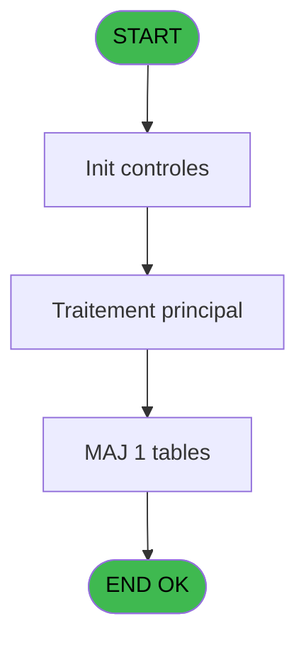
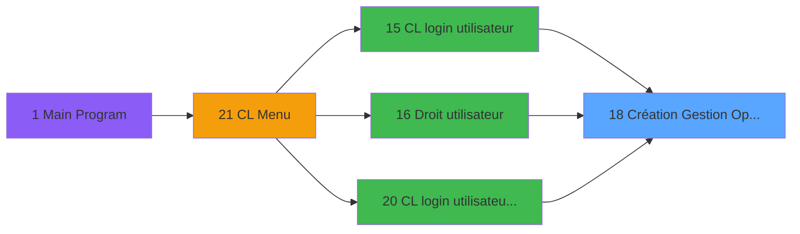
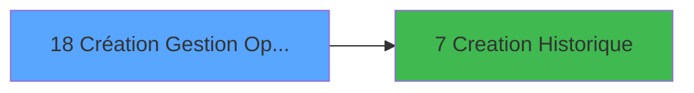

# LOG IDE 18 - Création Gestion Opérateurs

> **Analyse**: Phases 1-4 2026-02-03 14:42 -> 14:42 (10s) | Assemblage 14:42
> **Pipeline**: V7.2 Enrichi
> **Structure**: 4 onglets (Resume | Ecrans | Donnees | Connexions)

<!-- TAB:Resume -->

## 1. FICHE D'IDENTITE

| Attribut | Valeur |
|----------|--------|
| Projet | LOG |
| IDE Position | 18 |
| Nom Programme | Création Gestion Opérateurs |
| Fichier source | `Prg_18.xml` |
| Dossier IDE | Logins |
| Taches | 2 (0 ecrans visibles) |
| Tables modifiees | 1 |
| Programmes appeles | 1 |

## 2. DESCRIPTION FONCTIONNELLE

**Création Gestion Opérateurs** assure la gestion complete de ce processus, accessible depuis [CL login utilisateur (IDE 15)](LOG-IDE-15.md), [   Droit / utilisateur (IDE 16)](LOG-IDE-16.md), [CL login utilisateur   *SAV* (IDE 20)](LOG-IDE-20.md).

Le flux de traitement s'organise en **1 blocs fonctionnels** :

- **Traitement** (2 taches) : traitements metier divers

**Donnees modifiees** : 1 tables en ecriture (commandes).

**Logique metier** : 2 regles identifiees couvrant conditions metier.

## 3. BLOCS FONCTIONNELS

### 3.1 Traitement (2 taches)

Traitements internes.

---

#### 18 - Ecran [[ECRAN]](#ecran-t1)

**Role** : Traitement : Ecran.
**Ecran** : 786 x 294 DLU (MDI) | [Voir mockup](#ecran-t1)

---

#### 18.1 - Ecran [[ECRAN]](#ecran-t4)

**Role** : Traitement : Ecran.
**Ecran** : 786 x 294 DLU (MDI) | [Voir mockup](#ecran-t4)

## 5. REGLES METIER

2 regles identifiees:

### Autres (2 regles)

#### [RM-001] Si Pi.responsable ? [D] alors 'B' sinon 'F')

| Element | Detail |
|---------|--------|
| **Condition** | `Pi.responsable ? [D]` |
| **Si vrai** | 'B' |
| **Si faux** | 'F') |
| **Variables** | D (Pi.responsable ?) |
| **Expression source** | Expression 9 : `IF (Pi.responsable ? [D],'B','F')` |
| **Exemple** | Si Pi.responsable ? [D] → 'B'. Sinon → 'F') |

#### [RM-002] Si [M]='B' alors 'O' sinon 'N')

| Element | Detail |
|---------|--------|
| **Condition** | `[M]='B'` |
| **Si vrai** | 'O' |
| **Si faux** | 'N') |
| **Expression source** | Expression 10 : `IF ([M]='B','O','N')` |
| **Exemple** | Si [M]='B' → 'O'. Sinon → 'N') |

## 6. CONTEXTE

- **Appele par**: [CL login utilisateur (IDE 15)](LOG-IDE-15.md), [   Droit / utilisateur (IDE 16)](LOG-IDE-16.md), [CL login utilisateur   *SAV* (IDE 20)](LOG-IDE-20.md)
- **Appelle**: 1 programmes | **Tables**: 1 (W:1 R:0 L:0) | **Taches**: 2 | **Expressions**: 11

<!-- TAB:Ecrans -->

## 8. ECRANS

*(Programme sans ecran visible)*

## 9. NAVIGATION

### 9.3 Structure hierarchique (2 taches)

| Position | Tache | Type | Dimensions | Bloc |
|----------|-------|------|------------|------|
| **18.1** | [**Ecran** (18)](#t1) [mockup](#ecran-t1) | MDI | 786x294 | Traitement |
| 18.1.1 | [Ecran (18.1)](#t4) [mockup](#ecran-t4) | MDI | 786x294 | |

### 9.4 Algorigramme

> **Legende**: Vert = START/END OK | Rouge = END KO | Bleu = Decisions
> *Algorigramme auto-genere. Utiliser `/algorigramme` pour une synthese metier detaillee.*

<!-- TAB:Donnees -->

## 10. TABLES

### Tables utilisees (1)

| ID | Nom | Description | Type | R | W | L | Usages |
|----|-----|-------------|------|---|---|---|--------|
| 691 | commandes |  | DB |   | **W** |   | 2 |

### Colonnes par table (1 / 1 tables avec colonnes identifiees)

Table 691 - commandes (**W**) - 2 usages

| Lettre | Variable | Acces | Type |
|--------|----------|-------|------|
| A | Pi.societe | W | Alpha |
| B | Pi.nom personne | W | Alpha |
| C | Pi.nom complet | W | Alpha |
| D | Pi.responsable ? | W | Logical |
| E | V.Existe déjà ? | W | Logical |

## 11. VARIABLES

### 11.1 Parametres entrants (4)

Variables recues du programme appelant ([CL login utilisateur (IDE 15)](LOG-IDE-15.md)).

| Lettre | Nom | Type | Usage dans |
|--------|-----|------|-----------|
| A | Pi.societe | Alpha | 1x parametre entrant |
| B | Pi.nom personne | Alpha | 1x parametre entrant |
| C | Pi.nom complet | Alpha | 1x parametre entrant |
| D | Pi.responsable ? | Logical | 1x parametre entrant |

### 11.2 Variables de session (1)

Variables persistantes pendant toute la session.

| Lettre | Nom | Type | Usage dans |
|--------|-----|------|-----------|
| E | V.Existe déjà ? | Logical | - |

## 12. EXPRESSIONS

**11 / 11 expressions decodees (100%)**

### 12.1 Repartition par type

| Type | Expressions | Regles |
|------|-------------|--------|
| CONDITION | 2 | 2 |
| CONSTANTE | 2 | 0 |
| DATE | 1 | 0 |
| OTHER | 5 | 0 |
| REFERENCE_VG | 1 | 0 |

### 12.2 Expressions cles par type

#### CONDITION (2 expressions)

| Type | IDE | Expression | Regle |
|------|-----|------------|-------|
| CONDITION | 10 | `IF ([M]='B','O','N')` | [RM-002](#rm-RM-002) |
| CONDITION | 9 | `IF (Pi.responsable ? [D],'B','F')` | [RM-001](#rm-RM-001) |

#### CONSTANTE (2 expressions)

| Type | IDE | Expression | Regle |
|------|-----|------------|-------|
| CONSTANTE | 4 | `'O'` | - |
| CONSTANTE | 1 | `'CRUT'` | - |

#### DATE (1 expressions)

| Type | IDE | Expression | Regle |
|------|-----|------------|-------|
| DATE | 5 | `Date ()` | - |

#### OTHER (5 expressions)

| Type | IDE | Expression | Regle |
|------|-----|------------|-------|
| OTHER | 8 | `Pi.nom complet [C]` | - |
| OTHER | 11 | `NOT([BP])` | - |
| OTHER | 6 | `Time ()` | - |
| OTHER | 2 | `Pi.societe [A]` | - |
| OTHER | 3 | `Pi.nom personne [B]` | - |

#### REFERENCE_VG (1 expressions)

| Type | IDE | Expression | Regle |
|------|-----|------------|-------|
| REFERENCE_VG | 7 | `VG1` | - |

<!-- TAB:Connexions -->

## 13. GRAPHE D'APPELS

### 13.1 Chaine depuis Main (Callers)

Main -> ... -> [CL login utilisateur (IDE 15)](LOG-IDE-15.md) -> **Création Gestion Opérateurs (IDE 18)**

Main -> ... -> [   Droit / utilisateur (IDE 16)](LOG-IDE-16.md) -> **Création Gestion Opérateurs (IDE 18)**

Main -> ... -> [CL login utilisateur   *SAV* (IDE 20)](LOG-IDE-20.md) -> **Création Gestion Opérateurs (IDE 18)**

### 13.2 Callers

| IDE | Nom Programme | Nb Appels |
|-----|---------------|-----------|
| [15](LOG-IDE-15.md) | CL login utilisateur | 1 |
| [16](LOG-IDE-16.md) |    Droit / utilisateur | 1 |
| [20](LOG-IDE-20.md) | CL login utilisateur   *SAV* | 1 |

### 13.3 Callees (programmes appeles)

### 13.4 Detail Callees avec contexte

| IDE | Nom Programme | Appels | Contexte |
|-----|---------------|--------|----------|
| [7](LOG-IDE-7.md) | Creation Historique | 2 | Historique/consultation |

## 14. RECOMMANDATIONS MIGRATION

### 14.1 Profil du programme

| Metrique | Valeur | Impact migration |
|----------|--------|-----------------|
| Lignes de logique | 147 | Programme compact |
| Expressions | 11 | Peu de logique |
| Tables WRITE | 1 | Impact faible |
| Sous-programmes | 1 | Peu de dependances |
| Ecrans visibles | 0 | Ecran unique ou traitement batch |
| Code desactive | 0% (0 / 147) | Code sain |
| Regles metier | 2 | Quelques regles a preserver |

### 14.2 Plan de migration par bloc

#### Traitement (2 taches: 2 ecrans, 0 traitement)

- **Strategie** : 2 composant(s) UI (Razor/React) avec formulaires et validation.
- 1 sous-programme(s) a migrer ou a reutiliser depuis les services existants.
- Decomposer les taches en services unitaires testables.

### 14.3 Dependances critiques

| Dependance | Type | Appels | Impact |
|------------|------|--------|--------|
| commandes | Table WRITE (Database) | 2x | Schema + repository |
| [Creation Historique (IDE 7)](LOG-IDE-7.md) | Sous-programme | 2x | Haute - Historique/consultation |

---
*Spec DETAILED generee par Pipeline V7.2 - 2026-02-03 14:42*
