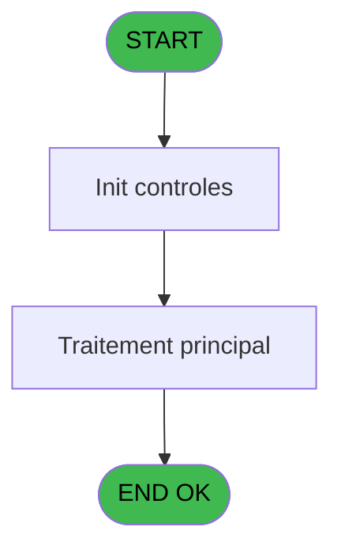
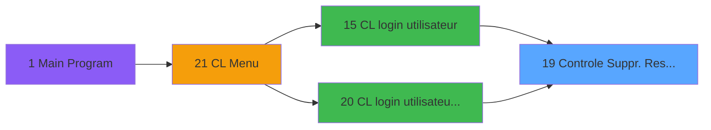

# LOG IDE 19 - Controle Suppr. Resp. Recept.

> **Analyse**: Phases 1-4 2026-02-03 14:42 -> 14:42 (10s) | Assemblage 14:42
> **Pipeline**: V7.2 Enrichi
> **Structure**: 4 onglets (Resume | Ecrans | Donnees | Connexions)

<!-- TAB:Resume -->

## 1. FICHE D'IDENTITE

| Attribut | Valeur |
|----------|--------|
| Projet | LOG |
| IDE Position | 19 |
| Nom Programme | Controle Suppr. Resp. Recept. |
| Fichier source | `Prg_19.xml` |
| Dossier IDE | Logins |
| Taches | 2 (0 ecrans visibles) |
| Tables modifiees | 0 |
| Programmes appeles | 0 |

## 2. DESCRIPTION FONCTIONNELLE

**Controle Suppr. Resp. Recept.** assure la gestion complete de ce processus, accessible depuis [CL login utilisateur (IDE 15)](LOG-IDE-15.md), [CL login utilisateur   *SAV* (IDE 20)](LOG-IDE-20.md).

Le flux de traitement s'organise en **2 blocs fonctionnels** :

- **Traitement** (1 tache) : traitements metier divers
- **Validation** (1 tache) : controles et verifications de coherence

Detail : phases du traitement

#### Phase 1 : Validation (1 tache)

- **19** - Controle Suppr. Resp. Recept.

#### Phase 2 : Traitement (1 tache)

- **19.1** - Last detail session

## 3. BLOCS FONCTIONNELS

### 3.1 Validation (1 tache)

Controles de coherence : 1 tache verifie les donnees et conditions.

---

#### 19 - Controle Suppr. Resp. Recept.

**Role** : Verification : Controle Suppr. Resp. Recept..

### 3.2 Traitement (1 tache)

Traitements internes.

---

#### 19.1 - Last detail session

**Role** : Traitement : Last detail session.
**Variables liees** : B (p.Erreur Session), C (v.session ouverte), D (v.session non vide), E (v.retour session)

## 5. REGLES METIER

*(Aucune regle metier identifiee)*

## 6. CONTEXTE

- **Appele par**: [CL login utilisateur (IDE 15)](LOG-IDE-15.md), [CL login utilisateur   *SAV* (IDE 20)](LOG-IDE-20.md)
- **Appelle**: 0 programmes | **Tables**: 3 (W:0 R:2 L:1) | **Taches**: 2 | **Expressions**: 5

<!-- TAB:Ecrans -->

## 8. ECRANS

*(Programme sans ecran visible)*

## 9. NAVIGATION

### 9.3 Structure hierarchique (2 taches)

| Position | Tache | Type | Dimensions | Bloc |
|----------|-------|------|------------|------|
| **19.1** | [**Controle Suppr. Resp. Recept.** (19)](#t1) | MDI | - | Validation |
| **19.2** | [**Last detail session** (19.1)](#t2) | MDI | - | Traitement |

### 9.4 Algorigramme

> **Legende**: Vert = START/END OK | Rouge = END KO | Bleu = Decisions
> *Algorigramme auto-genere. Utiliser `/algorigramme` pour une synthese metier detaillee.*

<!-- TAB:Donnees -->

## 10. TABLES

### Tables utilisees (3)

| ID | Nom | Description | Type | R | W | L | Usages |
|----|-----|-------------|------|---|---|---|--------|
| 246 | histo_sessions_caisse | Sessions de caisse | DB |   |   | L | 1 |
| 249 | histo_sessions_caisse_detail | Sessions de caisse | DB | R |   |   | 1 |
| 740 | pv_stock_movements | Articles et stock | DB | R |   |   | 1 |

### Colonnes par table (1 / 2 tables avec colonnes identifiees)

Table 249 - histo_sessions_caisse_detail (R) - 1 usages

*Table utilisee uniquement en Link ou aucune colonne Real identifiee dans le DataView.*

Table 740 - pv_stock_movements (R) - 1 usages

| Lettre | Variable | Acces | Type |
|--------|----------|-------|------|
| A | p.Societe | R | Alpha |
| B | p.Erreur Session | R | Logical |
| C | v.session ouverte | R | Logical |
| D | v.session non vide | R | Logical |
| E | v.retour session | R | Logical |

## 11. VARIABLES

### 11.1 Parametres entrants (2)

Variables recues du programme appelant ([CL login utilisateur (IDE 15)](LOG-IDE-15.md)).

| Lettre | Nom | Type | Usage dans |
|--------|-----|------|-----------|
| A | p.Societe | Alpha | 1x parametre entrant |
| B | p.Erreur Session | Logical | [19.1](#t2) |

### 11.2 Variables de session (3)

Variables persistantes pendant toute la session.

| Lettre | Nom | Type | Usage dans |
|--------|-----|------|-----------|
| C | v.session ouverte | Logical | - |
| D | v.session non vide | Logical | - |
| E | v.retour session | Logical | - |

## 12. EXPRESSIONS

**5 / 5 expressions decodees (100%)**

### 12.1 Repartition par type

| Type | Expressions | Regles |
|------|-------------|--------|
| CONSTANTE | 1 | 0 |
| OTHER | 4 | 0 |

### 12.2 Expressions cles par type

#### CONSTANTE (1 expressions)

| Type | IDE | Expression | Regle |
|------|-----|------------|-------|
| CONSTANTE | 1 | `'RECEPTION'` | - |

#### OTHER (4 expressions)

| Type | IDE | Expression | Regle |
|------|-----|------------|-------|
| OTHER | 4 | `p.Erreur Session [B]` | - |
| OTHER | 5 | `[H]` | - |
| OTHER | 2 | `p.Societe [A]` | - |
| OTHER | 3 | `[G]` | - |

<!-- TAB:Connexions -->

## 13. GRAPHE D'APPELS

### 13.1 Chaine depuis Main (Callers)

Main -> ... -> [CL login utilisateur (IDE 15)](LOG-IDE-15.md) -> **Controle Suppr. Resp. Recept. (IDE 19)**

Main -> ... -> [CL login utilisateur   *SAV* (IDE 20)](LOG-IDE-20.md) -> **Controle Suppr. Resp. Recept. (IDE 19)**

### 13.2 Callers

| IDE | Nom Programme | Nb Appels |
|-----|---------------|-----------|
| [15](LOG-IDE-15.md) | CL login utilisateur | 1 |
| [20](LOG-IDE-20.md) | CL login utilisateur   *SAV* | 1 |

### 13.3 Callees (programmes appeles)

### 13.4 Detail Callees avec contexte

| IDE | Nom Programme | Appels | Contexte |
|-----|---------------|--------|----------|
| - | (aucun) | - | - |

## 14. RECOMMANDATIONS MIGRATION

### 14.1 Profil du programme

| Metrique | Valeur | Impact migration |
|----------|--------|-----------------|
| Lignes de logique | 39 | Programme compact |
| Expressions | 5 | Peu de logique |
| Tables WRITE | 0 | Impact faible |
| Sous-programmes | 0 | Peu de dependances |
| Ecrans visibles | 0 | Ecran unique ou traitement batch |
| Code desactive | 0% (0 / 39) | Code sain |
| Regles metier | 0 | Pas de regle identifiee |

### 14.2 Plan de migration par bloc

#### Validation (1 tache: 0 ecran, 1 traitement)

- **Strategie** : FluentValidation avec validators specifiques.
- Chaque tache de validation -> un validator injectable

#### Traitement (1 tache: 0 ecran, 1 traitement)

- **Strategie** : 1 service(s) backend injectable(s) (Domain Services).
- Decomposer les taches en services unitaires testables.

### 14.3 Dependances critiques

| Dependance | Type | Appels | Impact |
|------------|------|--------|--------|

---
*Spec DETAILED generee par Pipeline V7.2 - 2026-02-03 14:42*
