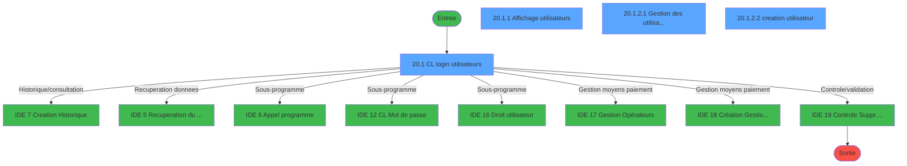
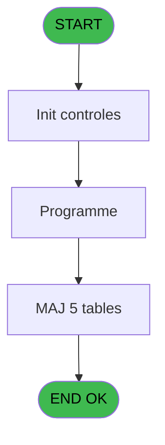
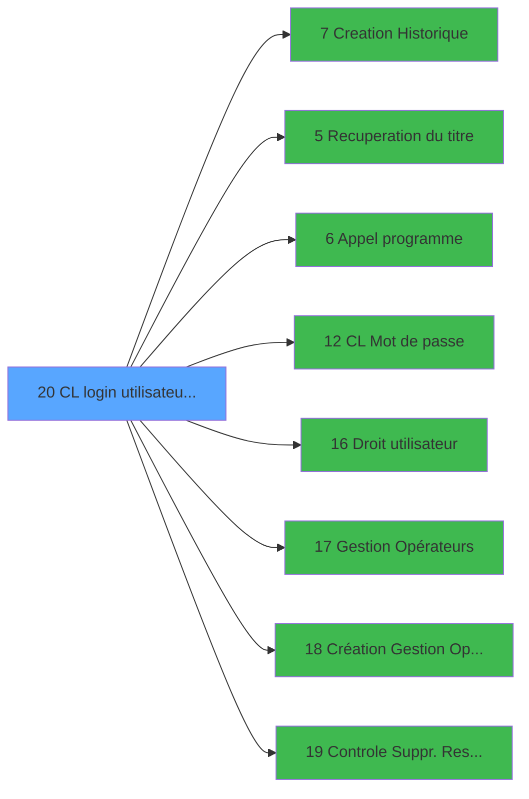

# LOG IDE 20 - CL login utilisateur   *SAV*

> **Analyse**: Phases 1-4 2026-02-03 14:42 -> 14:42 (10s) | Assemblage 14:42
> **Pipeline**: V7.2 Enrichi
> **Structure**: 4 onglets (Resume | Ecrans | Donnees | Connexions)

<!-- TAB:Resume -->

## 1. FICHE D'IDENTITE

| Attribut | Valeur |
|----------|--------|
| Projet | LOG |
| IDE Position | 20 |
| Nom Programme | CL login utilisateur   *SAV* |
| Fichier source | `Prg_20.xml` |
| Dossier IDE | Menu |
| Taches | 21 (4 ecrans visibles) |
| Tables modifiees | 5 |
| Programmes appeles | 8 |
| :warning: Statut | **ORPHELIN_POTENTIEL** |

## 2. DESCRIPTION FONCTIONNELLE

**CL login utilisateur   *SAV*** assure la gestion complete de ce processus.

Le flux de traitement s'organise en **3 blocs fonctionnels** :

- **Traitement** (14 taches) : traitements metier divers
- **Creation** (5 taches) : insertion d'enregistrements en base (mouvements, prestations)
- **Consultation** (2 taches) : ecrans de recherche, selection et consultation

**Donnees modifiees** : 5 tables en ecriture (table_utilisateurs, commandes, utilisateur______uti, pv_stock_movements, vente_vrl_vsl).

**Logique metier** : 2 regles identifiees couvrant conditions metier.

Detail : phases du traitement

#### Phase 1 : Traitement (14 taches)

- **20** - (sans nom)
- **20.1** - CL login utilisateurs **[[ECRAN]](#ecran-t2)**
- **20.1.2.1** - Gestion des utilisateurs **[[ECRAN]](#ecran-t5)**
- **20.1.2.2.4** - Gestion des utilisateurs **[[ECRAN]](#ecran-t10)**
- **20.1.2.2.5** - Affectation Login
- **20.1.2.3.1** - suppression
- **20.1.2.3.2** - suppression
- **20.1.2.3.3** - suppression
- **20.1.2.3.4** - suppression
- **20.1.2.3.5** - suppression
- **20.1.2.3.6** - suppression
- **20.1.2.3.7** - contrôle caisse
- **20.1.2.3.7.1** - Last session
- **20.1.2.3.7.2** - Last detail session

Delegue a : [Recuperation du titre (IDE 5)](LOG-IDE-5.md), [Appel programme (IDE 6)](LOG-IDE-6.md), [CL Mot de passe (IDE 12)](LOG-IDE-12.md), [   Droit / utilisateur (IDE 16)](LOG-IDE-16.md), [Gestion Opérateurs (IDE 17)](LOG-IDE-17.md), [Création Gestion Opérateurs (IDE 18)](LOG-IDE-18.md)

#### Phase 2 : Consultation (2 taches)

- **20.1.1** - Affichage utilisateurs **[[ECRAN]](#ecran-t3)**
- **20.1.2** - Choix **[[ECRAN]](#ecran-t4)**

Delegue a : [Recuperation du titre (IDE 5)](LOG-IDE-5.md)

#### Phase 3 : Creation (5 taches)

- **20.1.2.2** - creation utilisateur **[[ECRAN]](#ecran-t6)**
- **20.1.2.2.1** - creation
- **20.1.2.2.2** - creation
- **20.1.2.2.3** - Creation Droits
- **20.1.2.3** - creation utilisateur **[[ECRAN]](#ecran-t12)**

Delegue a : [Creation Historique (IDE 7)](LOG-IDE-7.md)

#### Tables impactees

| Table | Operations | Role metier |
|-------|-----------|-------------|
| utilisateur______uti | **W**/L (5 usages) |  |
| pv_stock_movements | **W**/L (5 usages) | Articles et stock |
| table_utilisateurs | R/**W**/L (3 usages) |  |
| commandes | **W** (2 usages) |  |
| vente_vrl_vsl | **W** (2 usages) | Donnees de ventes |

## 3. BLOCS FONCTIONNELS

### 3.1 Traitement (14 taches)

Traitements internes.

---

#### 20 - (sans nom)

**Role** : Tache d'orchestration : point d'entree du programme (14 sous-taches). Coordonne l'enchainement des traitements.

13 sous-taches directes

| Tache | Nom | Bloc |
|-------|-----|------|
| [20.1](#t2) | CL login utilisateurs **[[ECRAN]](#ecran-t2)** | Traitement |
| [20.1.2.1](#t5) | Gestion des utilisateurs **[[ECRAN]](#ecran-t5)** | Traitement |
| [20.1.2.2.4](#t10) | Gestion des utilisateurs **[[ECRAN]](#ecran-t10)** | Traitement |
| [20.1.2.2.5](#t11) | Affectation Login | Traitement |
| [20.1.2.3.1](#t13) | suppression | Traitement |
| [20.1.2.3.2](#t14) | suppression | Traitement |
| [20.1.2.3.3](#t15) | suppression | Traitement |
| [20.1.2.3.4](#t16) | suppression | Traitement |
| [20.1.2.3.5](#t17) | suppression | Traitement |
| [20.1.2.3.6](#t18) | suppression | Traitement |
| [20.1.2.3.7](#t19) | contrôle caisse | Traitement |
| [20.1.2.3.7.1](#t20) | Last session | Traitement |
| [20.1.2.3.7.2](#t21) | Last detail session | Traitement |

---

#### 20.1 - CL login utilisateurs [[ECRAN]](#ecran-t2)

**Role** : Traitement : CL login utilisateurs.
**Ecran** : 883 x 218 DLU (MDI) | [Voir mockup](#ecran-t2)

---

#### 20.1.2.1 - Gestion des utilisateurs [[ECRAN]](#ecran-t5)

**Role** : Gestion du moyen de paiement : Gestion des utilisateurs.
**Ecran** : 622 x 202 DLU (MDI) | [Voir mockup](#ecran-t5)

---

#### 20.1.2.2.4 - Gestion des utilisateurs [[ECRAN]](#ecran-t10)

**Role** : Gestion du moyen de paiement : Gestion des utilisateurs.
**Ecran** : 622 x 202 DLU (MDI) | [Voir mockup](#ecran-t10)

---

#### 20.1.2.2.5 - Affectation Login

**Role** : Traitement : Affectation Login.

---

#### 20.1.2.3.1 - suppression

**Role** : Traitement : suppression.

---

#### 20.1.2.3.2 - suppression

**Role** : Traitement : suppression.

---

#### 20.1.2.3.3 - suppression

**Role** : Traitement : suppression.

---

#### 20.1.2.3.4 - suppression

**Role** : Traitement : suppression.

---

#### 20.1.2.3.5 - suppression

**Role** : Traitement : suppression.

---

#### 20.1.2.3.6 - suppression

**Role** : Traitement : suppression.

---

#### 20.1.2.3.7 - contrôle caisse

**Role** : Traitement : contrôle caisse.

---

#### 20.1.2.3.7.1 - Last session

**Role** : Traitement : Last session.

---

#### 20.1.2.3.7.2 - Last detail session

**Role** : Traitement : Last detail session.

### 3.2 Consultation (2 taches)

Ecrans de recherche et consultation.

---

#### 20.1.1 - Affichage utilisateurs [[ECRAN]](#ecran-t3)

**Role** : Reinitialisation : Affichage utilisateurs.
**Ecran** : 320 x 157 DLU (Modal) | [Voir mockup](#ecran-t3)

---

#### 20.1.2 - Choix [[ECRAN]](#ecran-t4)

**Role** : Selection par l'operateur : Choix.
**Ecran** : 166 x 15 DLU (MDI) | [Voir mockup](#ecran-t4)

### 3.3 Creation (5 taches)

Insertion de nouveaux enregistrements en base.

---

#### 20.1.2.2 - creation utilisateur [[ECRAN]](#ecran-t6)

**Role** : Creation d'enregistrement : creation utilisateur.
**Ecran** : 565 x 158 DLU (MDI) | [Voir mockup](#ecran-t6)
**Delegue a** : [Creation Historique (IDE 7)](LOG-IDE-7.md)

---

#### 20.1.2.2.1 - creation

**Role** : Creation d'enregistrement : creation.
**Delegue a** : [Creation Historique (IDE 7)](LOG-IDE-7.md)

---

#### 20.1.2.2.2 - creation

**Role** : Creation d'enregistrement : creation.
**Delegue a** : [Creation Historique (IDE 7)](LOG-IDE-7.md)

---

#### 20.1.2.2.3 - Creation Droits

**Role** : Creation d'enregistrement : Creation Droits.
**Delegue a** : [Creation Historique (IDE 7)](LOG-IDE-7.md)

---

#### 20.1.2.3 - creation utilisateur [[ECRAN]](#ecran-t12)

**Role** : Creation d'enregistrement : creation utilisateur.
**Ecran** : 464 x 89 DLU (MDI) | [Voir mockup](#ecran-t12)
**Delegue a** : [Creation Historique (IDE 7)](LOG-IDE-7.md)

## 5. REGLES METIER

2 regles identifiees:

### Autres (2 regles)

#### [RM-001] Traitement si W2 droit planning [F] est renseigne

| Element | Detail |
|---------|--------|
| **Condition** | `W2 droit planning [F]<>''` |
| **Si vrai** | W2 droit planning [F] |
| **Si faux** | IF (W1 titre [D]<>'',W1 titre [D],IF (W2 societe [E]<>'',W2 societe [E],IF (W3 Description [G]<>'',W3 Description [G],W3 Info [H])))) |
| **Variables** | D (W1 titre), E (W2 societe), F (W2 droit planning), G (W3 Description), H (W3 Info) |
| **Expression source** | Expression 5 : `IF (W2 droit planning [F]<>'',W2 droit planning [F],IF (W1 t` |
| **Exemple** | Si W2 droit planning [F]<>'' → W2 droit planning [F] |

#### [RM-002] Si Trim (W1 societe [A])='INFORMATIQUE' alors 'N' sinon 'O')

| Element | Detail |
|---------|--------|
| **Condition** | `Trim (W1 societe [A])='INFORMATIQUE'` |
| **Si vrai** | 'N' |
| **Si faux** | 'O') |
| **Variables** | A (W1 societe) |
| **Expression source** | Expression 6 : `IF (Trim (W1 societe [A])='INFORMATIQUE','N','O')` |
| **Exemple** | Si Trim (W1 societe [A])='INFORMATIQUE' → 'N'. Sinon → 'O') |

## 6. CONTEXTE

- **Appele par**: (aucun)
- **Appelle**: 8 programmes | **Tables**: 9 (W:5 R:4 L:4) | **Taches**: 21 | **Expressions**: 8

<!-- TAB:Ecrans -->

## 8. ECRANS

### 8.1 Forms visibles (4 / 21)

| # | Position | Tache | Nom | Type | Largeur | Hauteur | Bloc |
|---|----------|-------|-----|------|---------|---------|------|
| 1 | 20.1 | 20.1 | CL login utilisateurs | MDI | 883 | 218 | Traitement |
| 2 | 20.1.1 | 20.1.1 | Affichage utilisateurs | Modal | 320 | 157 | Consultation |
| 3 | 20.1.2.1 | 20.1.2.1 | Gestion des utilisateurs | MDI | 622 | 202 | Traitement |
| 4 | 20.1.2.2 | 20.1.2.2 | creation utilisateur | MDI | 565 | 158 | Creation |

### 8.2 Mockups Ecrans

---

#### 20.1 - CL login utilisateurs
**Tache** : [20.1](#t2) | **Type** : MDI | **Dimensions** : 883 x 218 DLU
**Bloc** : Traitement | **Titre IDE** : CL login utilisateurs

<!-- FORM-DATA:
{
    "width":  883,
    "vFactor":  8,
    "type":  "MDI",
    "hFactor":  8,
    "controls":  [
                     {
                         "x":  0,
                         "type":  "label",
                         "var":  "",
                         "y":  1,
                         "w":  883,
                         "fmt":  "",
                         "name":  "",
                         "h":  19,
                         "color":  "",
                         "text":  "",
                         "parent":  null
                     },
                     {
                         "x":  2,
                         "type":  "label",
                         "var":  "",
                         "y":  194,
                         "w":  880,
                         "fmt":  "",
                         "name":  "",
                         "h":  24,
                         "color":  "",
                         "text":  "",
                         "parent":  null
                     },
                     {
                         "x":  34,
                         "type":  "table",
                         "var":  "",
                         "name":  "",
                         "titleH":  13,
                         "color":  "110",
                         "w":  377,
                         "y":  37,
                         "fmt":  "",
                         "parent":  null,
                         "text":  "",
                         "rowH":  13,
                         "h":  144,
                         "cols":  [
                                      {
                                          "title":  "Groupes du village",
                                          "layer":  1,
                                          "w":  342
                                      }
                                  ],
                         "rows":  1
                     },
                     {
                         "x":  54,
                         "type":  "edit",
                         "var":  "",
                         "y":  52,
                         "w":  232,
                         "fmt":  "",
                         "name":  "GRP nom",
                         "h":  8,
                         "color":  "110",
                         "text":  "",
                         "parent":  5
                     },
                     {
                         "x":  322,
                         "type":  "button",
                         "var":  "",
                         "y":  51,
                         "w":  55,
                         "fmt":  "\u003e\u003e\u003e",
                         "name":  "Bouton suite",
                         "h":  12,
                         "color":  "",
                         "text":  "",
                         "parent":  5
                     },
                     {
                         "x":  6,
                         "type":  "edit",
                         "var":  "",
                         "y":  7,
                         "w":  384,
                         "fmt":  "30",
                         "name":  "",
                         "h":  8,
                         "color":  "",
                         "text":  "",
                         "parent":  1
                     },
                     {
                         "x":  573,
                         "type":  "edit",
                         "var":  "",
                         "y":  7,
                         "w":  302,
                         "fmt":  "WWW DD MMM YYYYT",
                         "name":  "",
                         "h":  8,
                         "color":  "",
                         "text":  "",
                         "parent":  null
                     },
                     {
                         "x":  10,
                         "type":  "button",
                         "var":  "",
                         "y":  197,
                         "w":  154,
                         "fmt":  "\u0026Quitter",
                         "name":  "",
                         "h":  18,
                         "color":  "",
                         "text":  "",
                         "parent":  4
                     }
                 ],
    "taskId":  "20.1",
    "height":  218
}
-->

<strong>Champs : 3 champs</strong>

| Pos (x,y) | Nom | Variable | Type |
|-----------|-----|----------|------|
| 54,52 | GRP nom | - | edit |
| 6,7 | 30 | - | edit |
| 573,7 | WWW DD MMM YYYYT | - | edit |

<strong>Boutons : 2 boutons</strong>

| Bouton | Pos (x,y) | Action |
|--------|-----------|--------|
| >>> | 322,51 | Bouton fonctionnel |
| Quitter | 10,197 | Quitte le programme |

---

#### 20.1.1 - Affichage utilisateurs
**Tache** : [20.1.1](#t3) | **Type** : Modal | **Dimensions** : 320 x 157 DLU
**Bloc** : Consultation | **Titre IDE** : Affichage utilisateurs

<!-- FORM-DATA:
{
    "width":  320,
    "vFactor":  8,
    "type":  "Modal",
    "hFactor":  8,
    "controls":  [
                     {
                         "x":  0,
                         "type":  "table",
                         "var":  "",
                         "name":  "",
                         "titleH":  13,
                         "color":  "110",
                         "w":  284,
                         "y":  0,
                         "fmt":  "",
                         "parent":  null,
                         "text":  "",
                         "rowH":  13,
                         "h":  143,
                         "cols":  [
                                      {
                                          "title":  "Utilisateur",
                                          "layer":  1,
                                          "w":  118
                                      },
                                      {
                                          "title":  "Type",
                                          "layer":  2,
                                          "w":  160
                                      }
                                  ],
                         "rows":  2
                     },
                     {
                         "x":  10,
                         "type":  "edit",
                         "var":  "",
                         "y":  16,
                         "w":  98,
                         "fmt":  "",
                         "name":  "",
                         "h":  8,
                         "color":  "110",
                         "text":  "",
                         "parent":  1
                     },
                     {
                         "x":  135,
                         "type":  "edit",
                         "var":  "",
                         "y":  16,
                         "w":  131,
                         "fmt":  "11",
                         "name":  "",
                         "h":  8,
                         "color":  "110",
                         "text":  "",
                         "parent":  1
                     }
                 ],
    "taskId":  "20.1.1",
    "height":  157
}
-->

<strong>Champs : 2 champs</strong>

| Pos (x,y) | Nom | Variable | Type |
|-----------|-----|----------|------|
| 10,16 | (sans nom) | - | edit |
| 135,16 | 11 | - | edit |

---

#### 20.1.2.1 - Gestion des utilisateurs
**Tache** : [20.1.2.1](#t5) | **Type** : MDI | **Dimensions** : 622 x 202 DLU
**Bloc** : Traitement | **Titre IDE** : Gestion des utilisateurs

<!-- FORM-DATA:
{
    "width":  622,
    "vFactor":  8,
    "type":  "MDI",
    "hFactor":  8,
    "controls":  [
                     {
                         "x":  1,
                         "type":  "label",
                         "var":  "",
                         "y":  0,
                         "w":  619,
                         "fmt":  "",
                         "name":  "",
                         "h":  19,
                         "color":  "",
                         "text":  "",
                         "parent":  null
                     },
                     {
                         "x":  2,
                         "type":  "label",
                         "var":  "",
                         "y":  177,
                         "w":  619,
                         "fmt":  "",
                         "name":  "",
                         "h":  24,
                         "color":  "",
                         "text":  "",
                         "parent":  null
                     },
                     {
                         "x":  424,
                         "type":  "label",
                         "var":  "",
                         "y":  32,
                         "w":  191,
                         "fmt":  "",
                         "name":  "",
                         "h":  127,
                         "color":  "",
                         "text":  "",
                         "parent":  null
                     },
                     {
                         "x":  427,
                         "type":  "line",
                         "var":  "",
                         "y":  95,
                         "w":  186,
                         "fmt":  "",
                         "name":  "",
                         "h":  0,
                         "color":  "",
                         "text":  "",
                         "parent":  5
                     },
                     {
                         "x":  10,
                         "type":  "table",
                         "var":  "",
                         "name":  "",
                         "titleH":  13,
                         "color":  "110",
                         "w":  390,
                         "y":  34,
                         "fmt":  "",
                         "parent":  null,
                         "text":  "",
                         "rowH":  13,
                         "h":  133,
                         "cols":  [
                                      {
                                          "title":  "Utilisateurs",
                                          "layer":  1,
                                          "w":  357
                                      }
                                  ],
                         "rows":  1
                     },
                     {
                         "x":  23,
                         "type":  "edit",
                         "var":  "",
                         "y":  48,
                         "w":  98,
                         "fmt":  "",
                         "name":  "UTI user",
                         "h":  12,
                         "color":  "110",
                         "text":  "",
                         "parent":  11
                     },
                     {
                         "x":  282,
                         "type":  "combobox",
                         "var":  "",
                         "y":  48,
                         "w":  81,
                         "fmt":  "",
                         "name":  "UTI langue",
                         "h":  12,
                         "color":  "110",
                         "text":  "FRA,ANG",
                         "parent":  11
                     },
                     {
                         "x":  7,
                         "type":  "edit",
                         "var":  "",
                         "y":  4,
                         "w":  323,
                         "fmt":  "30",
                         "name":  "",
                         "h":  8,
                         "color":  "",
                         "text":  "",
                         "parent":  1
                     },
                     {
                         "x":  330,
                         "type":  "edit",
                         "var":  "",
                         "y":  4,
                         "w":  283,
                         "fmt":  "WWW DD MMM YYYYT",
                         "name":  "",
                         "h":  8,
                         "color":  "",
                         "text":  "",
                         "parent":  null
                     },
                     {
                         "x":  139,
                         "type":  "edit",
                         "var":  "",
                         "y":  48,
                         "w":  131,
                         "fmt":  "11",
                         "name":  "",
                         "h":  12,
                         "color":  "110",
                         "text":  "",
                         "parent":  11
                     },
                     {
                         "x":  445,
                         "type":  "button",
                         "var":  "",
                         "y":  43,
                         "w":  154,
                         "fmt":  "\u0026Droit",
                         "name":  "",
                         "h":  18,
                         "color":  "",
                         "text":  "",
                         "parent":  5
                     },
                     {
                         "x":  445,
                         "type":  "button",
                         "var":  "",
                         "y":  66,
                         "w":  154,
                         "fmt":  "Droit \u0026Office",
                         "name":  "",
                         "h":  18,
                         "color":  "",
                         "text":  "",
                         "parent":  5
                     },
                     {
                         "x":  441,
                         "type":  "button",
                         "var":  "",
                         "y":  106,
                         "w":  154,
                         "fmt":  "\u0026Création",
                         "name":  "C",
                         "h":  18,
                         "color":  "",
                         "text":  "",
                         "parent":  5
                     },
                     {
                         "x":  441,
                         "type":  "button",
                         "var":  "",
                         "y":  130,
                         "w":  154,
                         "fmt":  "\u0026Suppression",
                         "name":  "S",
                         "h":  18,
                         "color":  "",
                         "text":  "",
                         "parent":  5
                     },
                     {
                         "x":  10,
                         "type":  "button",
                         "var":  "",
                         "y":  180,
                         "w":  154,
                         "fmt":  "\u0026Quitter",
                         "name":  "",
                         "h":  18,
                         "color":  "",
                         "text":  "",
                         "parent":  4
                     }
                 ],
    "taskId":  "20.1.2.1",
    "height":  202
}
-->

<strong>Champs : 5 champs</strong>

| Pos (x,y) | Nom | Variable | Type |
|-----------|-----|----------|------|
| 23,48 | UTI user | - | edit |
| 282,48 | UTI langue | - | combobox |
| 7,4 | 30 | - | edit |
| 330,4 | WWW DD MMM YYYYT | - | edit |
| 139,48 | 11 | - | edit |

<strong>Boutons : 5 boutons</strong>

| Bouton | Pos (x,y) | Action |
|--------|-----------|--------|
| Droit | 445,43 | Appel [   Droit / utilisateur (IDE 16)](LOG-IDE-16.md) |
| Droit Office | 445,66 | Appel [   Droit / utilisateur (IDE 16)](LOG-IDE-16.md) |
| Création | 441,106 | Appel [Création Gestion Opérateurs (IDE 18)](LOG-IDE-18.md) |
| Suppression | 441,130 | Appel [Controle Suppr. Resp. Recept. (IDE 19)](LOG-IDE-19.md) |
| Quitter | 10,180 | Quitte le programme |

---

#### 20.1.2.2 - creation utilisateur
**Tache** : [20.1.2.2](#t6) | **Type** : MDI | **Dimensions** : 565 x 158 DLU
**Bloc** : Creation | **Titre IDE** : creation utilisateur

<!-- FORM-DATA:
{
    "width":  565,
    "vFactor":  8,
    "type":  "MDI",
    "hFactor":  8,
    "controls":  [
                     {
                         "x":  5,
                         "type":  "label",
                         "var":  "",
                         "y":  2,
                         "w":  558,
                         "fmt":  "",
                         "name":  "",
                         "h":  122,
                         "color":  "",
                         "text":  "",
                         "parent":  null
                     },
                     {
                         "x":  54,
                         "type":  "label",
                         "var":  "",
                         "y":  10,
                         "w":  114,
                         "fmt":  "",
                         "name":  "",
                         "h":  8,
                         "color":  "",
                         "text":  "Login",
                         "parent":  null
                     },
                     {
                         "x":  54,
                         "type":  "label",
                         "var":  "",
                         "y":  23,
                         "w":  82,
                         "fmt":  "",
                         "name":  "",
                         "h":  8,
                         "color":  "",
                         "text":  "Password",
                         "parent":  null
                     },
                     {
                         "x":  54,
                         "type":  "label",
                         "var":  "",
                         "y":  36,
                         "w":  189,
                         "fmt":  "",
                         "name":  "",
                         "h":  8,
                         "color":  "",
                         "text":  "Password (Confirmation)",
                         "parent":  null
                     },
                     {
                         "x":  55,
                         "type":  "label",
                         "var":  "",
                         "y":  49,
                         "w":  219,
                         "fmt":  "",
                         "name":  "",
                         "h":  8,
                         "color":  "",
                         "text":  "Description (Nom + Prénom)",
                         "parent":  null
                     },
                     {
                         "x":  55,
                         "type":  "label",
                         "var":  "",
                         "y":  63,
                         "w":  219,
                         "fmt":  "",
                         "name":  "",
                         "h":  8,
                         "color":  "",
                         "text":  "Information",
                         "parent":  null
                     },
                     {
                         "x":  55,
                         "type":  "label",
                         "var":  "",
                         "y":  80,
                         "w":  219,
                         "fmt":  "",
                         "name":  "",
                         "h":  8,
                         "color":  "",
                         "text":  "Langue",
                         "parent":  null
                     },
                     {
                         "x":  12,
                         "type":  "line",
                         "var":  "",
                         "y":  99,
                         "w":  540,
                         "fmt":  "",
                         "name":  "",
                         "h":  0,
                         "color":  "",
                         "text":  "",
                         "parent":  null
                     },
                     {
                         "x":  54,
                         "type":  "label",
                         "var":  "",
                         "y":  108,
                         "w":  187,
                         "fmt":  "",
                         "name":  "",
                         "h":  8,
                         "color":  "",
                         "text":  "Responsable Oui / Non",
                         "parent":  null
                     },
                     {
                         "x":  0,
                         "type":  "label",
                         "var":  "",
                         "y":  134,
                         "w":  565,
                         "fmt":  "",
                         "name":  "",
                         "h":  24,
                         "color":  "",
                         "text":  "",
                         "parent":  null
                     },
                     {
                         "x":  290,
                         "type":  "edit",
                         "var":  "",
                         "y":  9,
                         "w":  104,
                         "fmt":  "",
                         "name":  "W3 user",
                         "h":  10,
                         "color":  "6",
                         "text":  "",
                         "parent":  null
                     },
                     {
                         "x":  290,
                         "type":  "edit",
                         "var":  "",
                         "y":  22,
                         "w":  230,
                         "fmt":  "",
                         "name":  "W3 Password",
                         "h":  10,
                         "color":  "6",
                         "text":  "",
                         "parent":  null
                     },
                     {
                         "x":  290,
                         "type":  "edit",
                         "var":  "",
                         "y":  35,
                         "w":  230,
                         "fmt":  "",
                         "name":  "W3 Password (confirmation)",
                         "h":  10,
                         "color":  "6",
                         "text":  "",
                         "parent":  null
                     },
                     {
                         "x":  290,
                         "type":  "edit",
                         "var":  "",
                         "y":  48,
                         "w":  238,
                         "fmt":  "",
                         "name":  "W3 Description",
                         "h":  10,
                         "color":  "6",
                         "text":  "",
                         "parent":  null
                     },
                     {
                         "x":  290,
                         "type":  "edit",
                         "var":  "",
                         "y":  62,
                         "w":  205,
                         "fmt":  "",
                         "name":  "W3 Info",
                         "h":  10,
                         "color":  "6",
                         "text":  "",
                         "parent":  null
                     },
                     {
                         "x":  290,
                         "type":  "combobox",
                         "var":  "",
                         "y":  78,
                         "w":  110,
                         "fmt":  "",
                         "name":  "W3 Langue",
                         "h":  12,
                         "color":  "",
                         "text":  "",
                         "parent":  null
                     },
                     {
                         "x":  290,
                         "type":  "combobox",
                         "var":  "",
                         "y":  106,
                         "w":  110,
                         "fmt":  "",
                         "name":  "W3 responsable",
                         "h":  12,
                         "color":  "",
                         "text":  "",
                         "parent":  null
                     },
                     {
                         "x":  8,
                         "type":  "button",
                         "var":  "",
                         "y":  137,
                         "w":  154,
                         "fmt":  "\u0026Ok",
                         "name":  "Bouton ok",
                         "h":  18,
                         "color":  "",
                         "text":  "",
                         "parent":  15
                     },
                     {
                         "x":  175,
                         "type":  "button",
                         "var":  "",
                         "y":  137,
                         "w":  154,
                         "fmt":  "A\u0026bandonner",
                         "name":  "",
                         "h":  18,
                         "color":  "",
                         "text":  "",
                         "parent":  null
                     }
                 ],
    "taskId":  "20.1.2.2",
    "height":  158
}
-->

<strong>Champs : 7 champs</strong>

| Pos (x,y) | Nom | Variable | Type |
|-----------|-----|----------|------|
| 290,9 | W3 user | - | edit |
| 290,22 | W3 Password | - | edit |
| 290,35 | W3 Password (confirmation) | - | edit |
| 290,48 | W3 Description | - | edit |
| 290,62 | W3 Info | - | edit |
| 290,78 | W3 Langue | - | combobox |
| 290,106 | W3 responsable | - | combobox |

<strong>Boutons : 2 boutons</strong>

| Bouton | Pos (x,y) | Action |
|--------|-----------|--------|
| Ok | 8,137 | Valide la saisie et enregistre |
| Abandonner | 175,137 | Annule et retour au menu |

## 9. NAVIGATION

### 9.1 Enchainement des ecrans

**Detail par enchainement :**

| Depuis | Action | Vers | Retour |
|--------|--------|------|--------|
| CL login utilisateurs | Historique/consultation | [Creation Historique (IDE 7)](LOG-IDE-7.md) | Retour ecran |
| CL login utilisateurs | Recuperation donnees | [Recuperation du titre (IDE 5)](LOG-IDE-5.md) | Retour ecran |
| CL login utilisateurs | Sous-programme | [Appel programme (IDE 6)](LOG-IDE-6.md) | Retour ecran |
| CL login utilisateurs | Sous-programme | [CL Mot de passe (IDE 12)](LOG-IDE-12.md) | Retour ecran |
| CL login utilisateurs | Sous-programme | [   Droit / utilisateur (IDE 16)](LOG-IDE-16.md) | Retour ecran |
| CL login utilisateurs | Gestion moyens paiement | [Gestion Opérateurs (IDE 17)](LOG-IDE-17.md) | Retour ecran |
| CL login utilisateurs | Gestion moyens paiement | [Création Gestion Opérateurs (IDE 18)](LOG-IDE-18.md) | Retour ecran |
| CL login utilisateurs | Controle/validation | [Controle Suppr. Resp. Recept. (IDE 19)](LOG-IDE-19.md) | Retour ecran |

### 9.3 Structure hierarchique (21 taches)

| Position | Tache | Type | Dimensions | Bloc |
|----------|-------|------|------------|------|
| **20.1** | [**(sans nom)** (20)](#t1) | MDI | - | Traitement |
| 20.1.1 | [CL login utilisateurs (20.1)](#t2) [mockup](#ecran-t2) | MDI | 883x218 | |
| 20.1.2 | [Gestion des utilisateurs (20.1.2.1)](#t5) [mockup](#ecran-t5) | MDI | 622x202 | |
| 20.1.3 | [Gestion des utilisateurs (20.1.2.2.4)](#t10) [mockup](#ecran-t10) | MDI | 622x202 | |
| 20.1.4 | [Affectation Login (20.1.2.2.5)](#t11) | - | - | |
| 20.1.5 | [suppression (20.1.2.3.1)](#t13) | MDI | - | |
| 20.1.6 | [suppression (20.1.2.3.2)](#t14) | MDI | - | |
| 20.1.7 | [suppression (20.1.2.3.3)](#t15) | MDI | - | |
| 20.1.8 | [suppression (20.1.2.3.4)](#t16) | MDI | - | |
| 20.1.9 | [suppression (20.1.2.3.5)](#t17) | MDI | - | |
| 20.1.10 | [suppression (20.1.2.3.6)](#t18) | MDI | - | |
| 20.1.11 | [contrôle caisse (20.1.2.3.7)](#t19) | MDI | - | |
| 20.1.12 | [Last session (20.1.2.3.7.1)](#t20) | MDI | - | |
| 20.1.13 | [Last detail session (20.1.2.3.7.2)](#t21) | MDI | - | |
| **20.2** | [**Affichage utilisateurs** (20.1.1)](#t3) [mockup](#ecran-t3) | Modal | 320x157 | Consultation |
| 20.2.1 | [Choix (20.1.2)](#t4) [mockup](#ecran-t4) | MDI | 166x15 | |
| **20.3** | [**creation utilisateur** (20.1.2.2)](#t6) [mockup](#ecran-t6) | MDI | 565x158 | Creation |
| 20.3.1 | [creation (20.1.2.2.1)](#t7) | MDI | - | |
| 20.3.2 | [creation (20.1.2.2.2)](#t8) | MDI | - | |
| 20.3.3 | [Creation Droits (20.1.2.2.3)](#t9) | MDI | - | |
| 20.3.4 | [creation utilisateur (20.1.2.3)](#t12) [mockup](#ecran-t12) | MDI | 464x89 | |

### 9.4 Algorigramme

> **Legende**: Vert = START/END OK | Rouge = END KO | Bleu = Decisions
> *Algorigramme auto-genere. Utiliser `/algorigramme` pour une synthese metier detaillee.*

<!-- TAB:Donnees -->

## 10. TABLES

### Tables utilisees (9)

| ID | Nom | Description | Type | R | W | L | Usages |
|----|-----|-------------|------|---|---|---|--------|
| 109 | table_utilisateurs |  | DB | R | **W** | L | 3 |
| 246 | histo_sessions_caisse | Sessions de caisse | DB | R |   |   | 1 |
| 249 | histo_sessions_caisse_detail | Sessions de caisse | DB | R |   |   | 1 |
| 691 | commandes |  | DB |   | **W** |   | 2 |
| 714 | table_modifications |  | DB |   |   | L | 3 |
| 718 | utilisateur______uti |  | DB |   | **W** | L | 5 |
| 723 | arc_client_gm |  | DB | R |   |   | 1 |
| 740 | pv_stock_movements | Articles et stock | DB |   | **W** | L | 5 |
| 770 | vente_vrl_vsl | Donnees de ventes | DB |   | **W** |   | 2 |

### Colonnes par table (5 / 8 tables avec colonnes identifiees)

Table 109 - table_utilisateurs (R/**W**/L) - 3 usages

*Table utilisee uniquement en Link ou aucune colonne Real identifiee dans le DataView.*

Table 246 - histo_sessions_caisse (R) - 1 usages

| Lettre | Variable | Acces | Type |
|--------|----------|-------|------|
| B | W3 caisse encours | R | Logical |

Table 249 - histo_sessions_caisse_detail (R) - 1 usages

| Lettre | Variable | Acces | Type |
|--------|----------|-------|------|
| B | W3 caisse encours | R | Logical |

Table 691 - commandes (**W**) - 2 usages

*Table utilisee uniquement en Link ou aucune colonne Real identifiee dans le DataView.*

Table 718 - utilisateur______uti (**W**/L) - 5 usages

| Lettre | Variable | Acces | Type |
|--------|----------|-------|------|
| A | W3 code retour droit/groupe | W | Logical |
| B | W3 code retour droit | W | Logical |

Table 723 - arc_client_gm (R) - 1 usages

| Lettre | Variable | Acces | Type |
|--------|----------|-------|------|
| A | W1 societe | R | Alpha |
| B | W1 acces mise à jour | R | Alpha |
| C | Bouton suite | R | Alpha |
| D | W1 titre | R | Alpha |

Table 740 - pv_stock_movements (**W**/L) - 5 usages

| Lettre | Variable | Acces | Type |
|--------|----------|-------|------|
| A | W3 fin tâche | W | Alpha |
| B | W3 userlist | W | Alpha |
| C | W3 code retour droit/groupe | W | Logical |
| D | W3 code retour droit | W | Logical |
| E | W3 choix action | W | Alpha |

Table 770 - vente_vrl_vsl (**W**) - 2 usages

*Table utilisee uniquement en Link ou aucune colonne Real identifiee dans le DataView.*

## 11. VARIABLES

### 11.1 Variables de session (2)

Variables persistantes pendant toute la session.

| Lettre | Nom | Type | Usage dans |
|--------|-----|------|-----------|
| M | V.Clé de Cryptage | Blob | - |
| N | V.Mdp Crypté | Alpha | - |

### 11.2 Autres (12)

Variables diverses.

| Lettre | Nom | Type | Usage dans |
|--------|-----|------|-----------|
| A | W1 societe | Alpha | 2x refs |
| B | W1 acces mise à jour | Alpha | - |
| C | Bouton suite | Alpha | - |
| D | W1 titre | Alpha | 1x refs |
| E | W2 societe | Alpha | 1x refs |
| F | W2 droit planning | Logical | [20.1.2.2.3](#t9) |
| G | W3 Description | Alpha | 1x refs |
| H | W3 Info | Alpha | 1x refs |
| I | W3 Langue | Alpha | - |
| J | W3 responsable | Alpha | 1x refs |
| K | W3 validation | Alpha | - |
| L | Bouton ok | Alpha | 1x refs |

## 12. EXPRESSIONS

**8 / 8 expressions decodees (100%)**

### 12.1 Repartition par type

| Type | Expressions | Regles |
|------|-------------|--------|
| CONDITION | 4 | 2 |
| CONSTANTE | 1 | 0 |
| DATE | 1 | 0 |
| REFERENCE_VG | 1 | 0 |
| STRING | 1 | 0 |

### 12.2 Expressions cles par type

#### CONDITION (4 expressions)

| Type | IDE | Expression | Regle |
|------|-----|------------|-------|
| CONDITION | 6 | `IF (Trim (W1 societe [A])='INFORMATIQUE','N','O')` | [RM-002](#rm-RM-002) |
| CONDITION | 5 | `IF (W2 droit planning [F]<>'',W2 droit planning [F],IF (W1 titre [D]<>'',W1 titre [D],IF (W2 societe [E]<>'',W2 societe [E],IF (W3 Description [G]<>'',W3 Description [G],W3 Info [H]))))` | [RM-001](#rm-RM-001) |
| CONDITION | 8 | `Trim (W1 societe [A])='INFORMATICIEN'` | - |
| CONDITION | 7 | `W3 responsable [J]='O'` | - |

#### CONSTANTE (1 expressions)

| Type | IDE | Expression | Regle |
|------|-----|------------|-------|
| CONSTANTE | 1 | `5` | - |

#### DATE (1 expressions)

| Type | IDE | Expression | Regle |
|------|-----|------------|-------|
| DATE | 4 | `Date ()` | - |

#### REFERENCE_VG (1 expressions)

| Type | IDE | Expression | Regle |
|------|-----|------------|-------|
| REFERENCE_VG | 3 | `VG2` | - |

#### STRING (1 expressions)

| Type | IDE | Expression | Regle |
|------|-----|------------|-------|
| STRING | 2 | `Trim (Bouton ok [L])` | - |

<!-- TAB:Connexions -->

## 13. GRAPHE D'APPELS

### 13.1 Chaine depuis Main (Callers)

**Chemin**: (pas de callers directs)

### 13.2 Callers

| IDE | Nom Programme | Nb Appels |
|-----|---------------|-----------|
| - | (aucun) | - |

### 13.3 Callees (programmes appeles)

### 13.4 Detail Callees avec contexte

| IDE | Nom Programme | Appels | Contexte |
|-----|---------------|--------|----------|
| [7](LOG-IDE-7.md) | Creation Historique | 2 | Historique/consultation |
| [5](LOG-IDE-5.md) | Recuperation du titre | 1 | Recuperation donnees |
| [6](LOG-IDE-6.md) | Appel programme | 1 | Sous-programme |
| [12](LOG-IDE-12.md) | CL Mot de passe | 1 | Sous-programme |
| [16](LOG-IDE-16.md) |    Droit / utilisateur | 1 | Sous-programme |
| [17](LOG-IDE-17.md) | Gestion Opérateurs | 1 | Gestion moyens paiement |
| [18](LOG-IDE-18.md) | Création Gestion Opérateurs | 1 | Gestion moyens paiement |
| [19](LOG-IDE-19.md) | Controle Suppr. Resp. Recept. | 1 | Controle/validation |

## 14. RECOMMANDATIONS MIGRATION

### 14.1 Profil du programme

| Metrique | Valeur | Impact migration |
|----------|--------|-----------------|
| Lignes de logique | 356 | Taille moyenne |
| Expressions | 8 | Peu de logique |
| Tables WRITE | 5 | Impact modere |
| Sous-programmes | 8 | Dependances moderees |
| Ecrans visibles | 4 | Quelques ecrans |
| Code desactive | 0.3% (1 / 356) | Code sain |
| Regles metier | 2 | Quelques regles a preserver |

### 14.2 Plan de migration par bloc

#### Traitement (14 taches: 3 ecrans, 11 traitements)

- **Strategie** : Orchestrateur avec 3 ecrans (Razor/React) et 11 traitements backend (services).
- Les ecrans deviennent des composants UI, les traitements invisibles deviennent des services injectables.
- 8 sous-programme(s) a migrer ou a reutiliser depuis les services existants.
- Decomposer les taches en services unitaires testables.

#### Consultation (2 taches: 2 ecrans, 0 traitement)

- **Strategie** : Composants de recherche/selection en modales.
- 2 ecrans : Affichage utilisateurs, Choix

#### Creation (5 taches: 2 ecrans, 3 traitements)

- **Strategie** : Repository pattern avec Entity Framework Core.
- Insertion via `IRepository<T>.CreateAsync()`

### 14.3 Dependances critiques

| Dependance | Type | Appels | Impact |
|------------|------|--------|--------|
| table_utilisateurs | Table WRITE (Database) | 1x | Schema + repository |
| commandes | Table WRITE (Database) | 2x | Schema + repository |
| utilisateur______uti | Table WRITE (Database) | 4x | Schema + repository |
| pv_stock_movements | Table WRITE (Database) | 4x | Schema + repository |
| vente_vrl_vsl | Table WRITE (Database) | 2x | Schema + repository |
| [Creation Historique (IDE 7)](LOG-IDE-7.md) | Sous-programme | 2x | Haute - Historique/consultation |
| [Gestion Opérateurs (IDE 17)](LOG-IDE-17.md) | Sous-programme | 1x | Normale - Gestion moyens paiement |
| [Création Gestion Opérateurs (IDE 18)](LOG-IDE-18.md) | Sous-programme | 1x | Normale - Gestion moyens paiement |
| [Controle Suppr. Resp. Recept. (IDE 19)](LOG-IDE-19.md) | Sous-programme | 1x | Normale - Controle/validation |
| [   Droit / utilisateur (IDE 16)](LOG-IDE-16.md) | Sous-programme | 1x | Normale - Sous-programme |
| [Recuperation du titre (IDE 5)](LOG-IDE-5.md) | Sous-programme | 1x | Normale - Recuperation donnees |
| [Appel programme (IDE 6)](LOG-IDE-6.md) | Sous-programme | 1x | Normale - Sous-programme |
| [CL Mot de passe (IDE 12)](LOG-IDE-12.md) | Sous-programme | 1x | Normale - Sous-programme |

---
*Spec DETAILED generee par Pipeline V7.2 - 2026-02-03 14:42*
