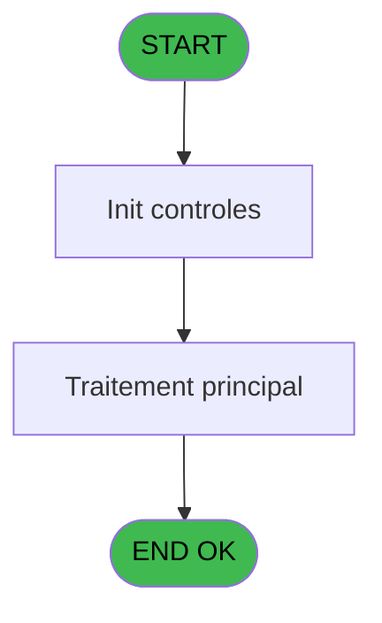
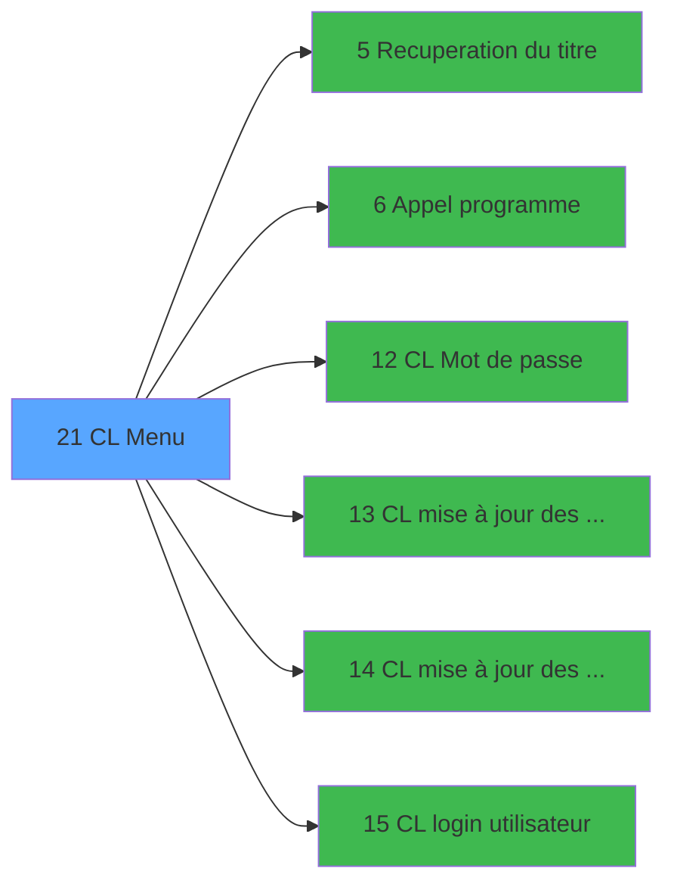

# LOG IDE 21 - CL Menu

> **Analyse**: Phases 1-4 2026-02-03 14:42 -> 14:43 (9s) | Assemblage 14:43
> **Pipeline**: V7.2 Enrichi
> **Structure**: 4 onglets (Resume | Ecrans | Donnees | Connexions)

<!-- TAB:Resume -->

## 1. FICHE D'IDENTITE

| Attribut | Valeur |
|----------|--------|
| Projet | LOG |
| IDE Position | 21 |
| Nom Programme | CL Menu |
| Fichier source | `Prg_21.xml` |
| Dossier IDE | Menu |
| Taches | 1 (1 ecrans visibles) |
| Tables modifiees | 0 |
| Programmes appeles | 6 |

## 2. DESCRIPTION FONCTIONNELLE

**CL Menu** assure la gestion complete de ce processus, accessible depuis [Main Program (IDE 1)](LOG-IDE-1.md).

Le flux de traitement s'organise en **1 blocs fonctionnels** :

- **Traitement** (1 tache) : traitements metier divers

## 3. BLOCS FONCTIONNELS

### 3.1 Traitement (1 tache)

Traitements internes.

---

#### 21 - CL Menu [[ECRAN]](#ecran-t1)

**Role** : Traitement : CL Menu.
**Ecran** : 643 x 180 DLU (MDI) | [Voir mockup](#ecran-t1)
**Delegue a** : [Recuperation du titre (IDE 5)](LOG-IDE-5.md), [Appel programme (IDE 6)](LOG-IDE-6.md), [CL Mot de passe (IDE 12)](LOG-IDE-12.md)

## 5. REGLES METIER

*(Aucune regle metier identifiee)*

## 6. CONTEXTE

- **Appele par**: [Main Program (IDE 1)](LOG-IDE-1.md)
- **Appelle**: 6 programmes | **Tables**: 0 (W:0 R:0 L:0) | **Taches**: 1 | **Expressions**: 10

<!-- TAB:Ecrans -->

## 8. ECRANS

### 8.1 Forms visibles (1 / 1)

| # | Position | Tache | Nom | Type | Largeur | Hauteur | Bloc |
|---|----------|-------|-----|------|---------|---------|------|
| 1 | 21 | 21 | CL Menu | MDI | 643 | 180 | Traitement |

### 8.2 Mockups Ecrans

---

#### 21 - CL Menu
**Tache** : [21](#t1) | **Type** : MDI | **Dimensions** : 643 x 180 DLU
**Bloc** : Traitement | **Titre IDE** : CL Menu

<!-- FORM-DATA:
{
    "width":  643,
    "vFactor":  8,
    "type":  "MDI",
    "hFactor":  8,
    "controls":  [
                     {
                         "x":  0,
                         "type":  "label",
                         "var":  "",
                         "y":  0,
                         "w":  639,
                         "fmt":  "",
                         "name":  "",
                         "h":  20,
                         "color":  "",
                         "text":  "",
                         "parent":  null
                     },
                     {
                         "x":  253,
                         "type":  "label",
                         "var":  "",
                         "y":  50,
                         "w":  367,
                         "fmt":  "",
                         "name":  "",
                         "h":  82,
                         "color":  "",
                         "text":  "",
                         "parent":  null
                     },
                     {
                         "x":  277,
                         "type":  "label",
                         "var":  "",
                         "y":  60,
                         "w":  320,
                         "fmt":  "",
                         "name":  "",
                         "h":  49,
                         "color":  "",
                         "text":  "",
                         "parent":  6
                     },
                     {
                         "x":  278,
                         "type":  "label",
                         "var":  "",
                         "y":  61,
                         "w":  45,
                         "fmt":  "",
                         "name":  "",
                         "h":  47,
                         "color":  "",
                         "text":  "",
                         "parent":  6
                     },
                     {
                         "x":  323,
                         "type":  "label",
                         "var":  "",
                         "y":  61,
                         "w":  272,
                         "fmt":  "",
                         "name":  "",
                         "h":  47,
                         "color":  "6",
                         "text":  "",
                         "parent":  6
                     },
                     {
                         "x":  339,
                         "type":  "label",
                         "var":  "",
                         "y":  65,
                         "w":  227,
                         "fmt":  "",
                         "name":  "",
                         "h":  8,
                         "color":  "146",
                         "text":  "Mise à jour des societes",
                         "parent":  6
                     },
                     {
                         "x":  339,
                         "type":  "label",
                         "var":  "",
                         "y":  79,
                         "w":  228,
                         "fmt":  "",
                         "name":  "",
                         "h":  8,
                         "color":  "146",
                         "text":  "Mise à jour des groupes",
                         "parent":  6
                     },
                     {
                         "x":  339,
                         "type":  "label",
                         "var":  "",
                         "y":  93,
                         "w":  213,
                         "fmt":  "",
                         "name":  "",
                         "h":  8,
                         "color":  "146",
                         "text":  "Login utilisateurs",
                         "parent":  6
                     },
                     {
                         "x":  349,
                         "type":  "label",
                         "var":  "",
                         "y":  115,
                         "w":  123,
                         "fmt":  "",
                         "name":  "",
                         "h":  10,
                         "color":  "",
                         "text":  "Votre choix",
                         "parent":  6
                     },
                     {
                         "x":  0,
                         "type":  "label",
                         "var":  "",
                         "y":  154,
                         "w":  639,
                         "fmt":  "",
                         "name":  "",
                         "h":  24,
                         "color":  "",
                         "text":  "",
                         "parent":  null
                     },
                     {
                         "x":  483,
                         "type":  "edit",
                         "var":  "",
                         "y":  115,
                         "w":  26,
                         "fmt":  "",
                         "name":  "",
                         "h":  10,
                         "color":  "6",
                         "text":  "",
                         "parent":  6
                     },
                     {
                         "x":  4,
                         "type":  "image",
                         "var":  "",
                         "y":  1,
                         "w":  59,
                         "fmt":  "",
                         "name":  "",
                         "h":  18,
                         "color":  "",
                         "text":  "",
                         "parent":  null
                     },
                     {
                         "x":  73,
                         "type":  "edit",
                         "var":  "",
                         "y":  6,
                         "w":  267,
                         "fmt":  "20",
                         "name":  "",
                         "h":  8,
                         "color":  "",
                         "text":  "",
                         "parent":  null
                     },
                     {
                         "x":  354,
                         "type":  "edit",
                         "var":  "",
                         "y":  6,
                         "w":  277,
                         "fmt":  "WWW DD MMM YYYYT",
                         "name":  "",
                         "h":  8,
                         "color":  "",
                         "text":  "",
                         "parent":  null
                     },
                     {
                         "x":  0,
                         "type":  "image",
                         "var":  "",
                         "y":  22,
                         "w":  86,
                         "fmt":  "",
                         "name":  "",
                         "h":  42,
                         "color":  "",
                         "text":  "",
                         "parent":  null
                     },
                     {
                         "x":  57,
                         "type":  "image",
                         "var":  "",
                         "y":  71,
                         "w":  157,
                         "fmt":  "",
                         "name":  "",
                         "h":  62,
                         "color":  "",
                         "text":  "",
                         "parent":  null
                     },
                     {
                         "x":  287,
                         "type":  "button",
                         "var":  "",
                         "y":  65,
                         "w":  26,
                         "fmt":  "A",
                         "name":  "A",
                         "h":  8,
                         "color":  "",
                         "text":  "",
                         "parent":  null
                     },
                     {
                         "x":  287,
                         "type":  "button",
                         "var":  "",
                         "y":  79,
                         "w":  26,
                         "fmt":  "B",
                         "name":  "B",
                         "h":  8,
                         "color":  "",
                         "text":  "",
                         "parent":  null
                     },
                     {
                         "x":  287,
                         "type":  "button",
                         "var":  "",
                         "y":  93,
                         "w":  26,
                         "fmt":  "C",
                         "name":  "C",
                         "h":  8,
                         "color":  "",
                         "text":  "",
                         "parent":  null
                     },
                     {
                         "x":  6,
                         "type":  "button",
                         "var":  "",
                         "y":  157,
                         "w":  154,
                         "fmt":  "\u0026Quitter",
                         "name":  "",
                         "h":  18,
                         "color":  "",
                         "text":  "",
                         "parent":  22
                     }
                 ],
    "taskId":  "21",
    "height":  180
}
-->

<strong>Champs : 3 champs</strong>

| Pos (x,y) | Nom | Variable | Type |
|-----------|-----|----------|------|
| 483,115 | (sans nom) | - | edit |
| 73,6 | 20 | - | edit |
| 354,6 | WWW DD MMM YYYYT | - | edit |

<strong>Boutons : 4 boutons</strong>

| Bouton | Pos (x,y) | Action |
|--------|-----------|--------|
| A | 287,65 | Bouton fonctionnel |
| B | 287,79 | Bouton fonctionnel |
| C | 287,93 | Bouton fonctionnel |
| Quitter | 6,157 | Quitte le programme |

## 9. NAVIGATION

Ecran unique: **CL Menu**

### 9.3 Structure hierarchique (1 tache)

| Position | Tache | Type | Dimensions | Bloc |
|----------|-------|------|------------|------|
| **21.1** | [**CL Menu** (21)](#t1) [mockup](#ecran-t1) | MDI | 643x180 | Traitement |

### 9.4 Algorigramme

> **Legende**: Vert = START/END OK | Rouge = END KO | Bleu = Decisions
> *Algorigramme auto-genere. Utiliser `/algorigramme` pour une synthese metier detaillee.*

<!-- TAB:Donnees -->

## 10. TABLES

### Tables utilisees (0)

| ID | Nom | Description | Type | R | W | L | Usages |
|----|-----|-------------|------|---|---|---|--------|

### Colonnes par table (0 / 0 tables avec colonnes identifiees)

## 11. VARIABLES

### 11.1 Variables de travail (3)

Variables internes au programme.

| Lettre | Nom | Type | Usage dans |
|--------|-----|------|-----------|
| A | W0 choix action | Alpha | 5x calcul interne |
| B | W0 accès | Alpha | 3x calcul interne |
| C | W0 titre | Alpha | 1x calcul interne |

## 12. EXPRESSIONS

**10 / 10 expressions decodees (100%)**

### 12.1 Repartition par type

| Type | Expressions | Regles |
|------|-------------|--------|
| CONSTANTE | 2 | 0 |
| DATE | 1 | 0 |
| REFERENCE_VG | 1 | 0 |
| CONDITION | 5 | 0 |
| STRING | 1 | 0 |

### 12.2 Expressions cles par type

#### CONSTANTE (2 expressions)

| Type | IDE | Expression | Regle |
|------|-----|------------|-------|
| CONSTANTE | 10 | `''` | - |
| CONSTANTE | 4 | `2` | - |

#### DATE (1 expressions)

| Type | IDE | Expression | Regle |
|------|-----|------------|-------|
| DATE | 1 | `Date ()` | - |

#### REFERENCE_VG (1 expressions)

| Type | IDE | Expression | Regle |
|------|-----|------------|-------|
| REFERENCE_VG | 2 | `VG2` | - |

#### CONDITION (5 expressions)

| Type | IDE | Expression | Regle |
|------|-----|------------|-------|
| CONDITION | 8 | `W0 choix action [A]='B' AND W0 accès [B]='O'` | - |
| CONDITION | 9 | `W0 choix action [A]='C'` | - |
| CONDITION | 7 | `(W0 choix action [A]='A' OR W0 choix action [A]='B') AND W0 accès [B]<>'O'` | - |
| CONDITION | 5 | `W0 choix action [A]='A' OR W0 choix action [A]='B'` | - |
| CONDITION | 6 | `W0 choix action [A]='A' AND W0 accès [B]='O'` | - |

#### STRING (1 expressions)

| Type | IDE | Expression | Regle |
|------|-----|------------|-------|
| STRING | 3 | `Trim (W0 titre [C])` | - |

<!-- TAB:Connexions -->

## 13. GRAPHE D'APPELS

### 13.1 Chaine depuis Main (Callers)

Main -> ... -> [Main Program (IDE 1)](LOG-IDE-1.md) -> **CL Menu (IDE 21)**

### 13.2 Callers

| IDE | Nom Programme | Nb Appels |
|-----|---------------|-----------|
| [1](LOG-IDE-1.md) | Main Program | 1 |

### 13.3 Callees (programmes appeles)

### 13.4 Detail Callees avec contexte

| IDE | Nom Programme | Appels | Contexte |
|-----|---------------|--------|----------|
| [5](LOG-IDE-5.md) | Recuperation du titre | 1 | Recuperation donnees |
| [6](LOG-IDE-6.md) | Appel programme | 1 | Sous-programme |
| [12](LOG-IDE-12.md) | CL Mot de passe | 1 | Sous-programme |
| [13](LOG-IDE-13.md) | CL mise à jour des sociétés | 1 | Mise a jour donnees |
| [14](LOG-IDE-14.md) | CL mise à jour des groupes | 1 | Mise a jour donnees |
| [15](LOG-IDE-15.md) | CL login utilisateur | 1 | Sous-programme |

## 14. RECOMMANDATIONS MIGRATION

### 14.1 Profil du programme

| Metrique | Valeur | Impact migration |
|----------|--------|-----------------|
| Lignes de logique | 13 | Programme compact |
| Expressions | 10 | Peu de logique |
| Tables WRITE | 0 | Impact faible |
| Sous-programmes | 6 | Dependances moderees |
| Ecrans visibles | 1 | Ecran unique ou traitement batch |
| Code desactive | 0% (0 / 13) | Code sain |
| Regles metier | 0 | Pas de regle identifiee |

### 14.2 Plan de migration par bloc

#### Traitement (1 tache: 1 ecran, 0 traitement)

- **Strategie** : 1 composant(s) UI (Razor/React) avec formulaires et validation.
- 6 sous-programme(s) a migrer ou a reutiliser depuis les services existants.
- Decomposer les taches en services unitaires testables.

### 14.3 Dependances critiques

| Dependance | Type | Appels | Impact |
|------------|------|--------|--------|
| [CL mise à jour des sociétés (IDE 13)](LOG-IDE-13.md) | Sous-programme | 1x | Normale - Mise a jour donnees |
| [CL mise à jour des groupes (IDE 14)](LOG-IDE-14.md) | Sous-programme | 1x | Normale - Mise a jour donnees |
| [CL login utilisateur (IDE 15)](LOG-IDE-15.md) | Sous-programme | 1x | Normale - Sous-programme |
| [Recuperation du titre (IDE 5)](LOG-IDE-5.md) | Sous-programme | 1x | Normale - Recuperation donnees |
| [Appel programme (IDE 6)](LOG-IDE-6.md) | Sous-programme | 1x | Normale - Sous-programme |
| [CL Mot de passe (IDE 12)](LOG-IDE-12.md) | Sous-programme | 1x | Normale - Sous-programme |

---
*Spec DETAILED generee par Pipeline V7.2 - 2026-02-03 14:43*
