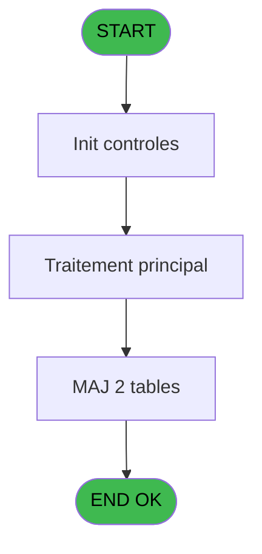

# LOG IDE 23 - Init Droits Perso

> **Analyse**: Phases 1-4 2026-02-03 14:43 -> 14:43 (9s) | Assemblage 14:43
> **Pipeline**: V7.2 Enrichi
> **Structure**: 4 onglets (Resume | Ecrans | Donnees | Connexions)

<!-- TAB:Resume -->

## 1. FICHE D'IDENTITE

| Attribut | Valeur |
|----------|--------|
| Projet | LOG |
| IDE Position | 23 |
| Nom Programme | Init Droits Perso |
| Fichier source | `Prg_23.xml` |
| Dossier IDE | Menu |
| Taches | 2 (0 ecrans visibles) |
| Tables modifiees | 2 |
| Programmes appeles | 0 |

## 2. DESCRIPTION FONCTIONNELLE

**Init Droits Perso** assure la gestion complete de ce processus, accessible depuis [Start (IDE 22)](LOG-IDE-22.md).

Le flux de traitement s'organise en **2 blocs fonctionnels** :

- **Creation** (1 tache) : insertion d'enregistrements en base (mouvements, prestations)
- **Initialisation** (1 tache) : reinitialisation d'etats et de variables de travail

**Donnees modifiees** : 2 tables en ecriture (utilisateur______uti, pv_stock_movements).

Detail : phases du traitement

#### Phase 1 : Initialisation (1 tache)

- **23** - Init Droits Perso

#### Phase 2 : Creation (1 tache)

- **23.1** - Creation Droits

#### Tables impactees

| Table | Operations | Role metier |
|-------|-----------|-------------|
| pv_stock_movements | **W** (1 usages) | Articles et stock |
| utilisateur______uti | **W** (1 usages) |  |

## 3. BLOCS FONCTIONNELS

### 3.1 Initialisation (1 tache)

Reinitialisation d'etats et variables de travail.

---

#### 23 - Init Droits Perso

**Role** : Reinitialisation : Init Droits Perso.

### 3.2 Creation (1 tache)

Insertion de nouveaux enregistrements en base.

---

#### 23.1 - Creation Droits

**Role** : Creation d'enregistrement : Creation Droits.

## 5. REGLES METIER

*(Aucune regle metier identifiee)*

## 6. CONTEXTE

- **Appele par**: [Start (IDE 22)](LOG-IDE-22.md)
- **Appelle**: 0 programmes | **Tables**: 3 (W:2 R:0 L:1) | **Taches**: 2 | **Expressions**: 5

<!-- TAB:Ecrans -->

## 8. ECRANS

*(Programme sans ecran visible)*

## 9. NAVIGATION

### 9.3 Structure hierarchique (2 taches)

| Position | Tache | Type | Dimensions | Bloc |
|----------|-------|------|------------|------|
| **23.1** | [**Init Droits Perso** (23)](#t1) | MDI | - | Initialisation |
| **23.2** | [**Creation Droits** (23.1)](#t2) | MDI | - | Creation |

### 9.4 Algorigramme

> **Legende**: Vert = START/END OK | Rouge = END KO | Bleu = Decisions
> *Algorigramme auto-genere. Utiliser `/algorigramme` pour une synthese metier detaillee.*

<!-- TAB:Donnees -->

## 10. TABLES

### Tables utilisees (3)

| ID | Nom | Description | Type | R | W | L | Usages |
|----|-----|-------------|------|---|---|---|--------|
| 714 | table_modifications |  | DB |   |   | L | 1 |
| 718 | utilisateur______uti |  | DB |   | **W** |   | 1 |
| 740 | pv_stock_movements | Articles et stock | DB |   | **W** |   | 1 |

### Colonnes par table (0 / 2 tables avec colonnes identifiees)

Table 718 - utilisateur______uti (**W**) - 1 usages

*Table utilisee uniquement en Link ou aucune colonne Real identifiee dans le DataView.*

Table 740 - pv_stock_movements (**W**) - 1 usages

*Table utilisee uniquement en Link ou aucune colonne Real identifiee dans le DataView.*

## 11. VARIABLES

*(Programme sans variables locales mappees)*

## 12. EXPRESSIONS

**5 / 5 expressions decodees (100%)**

### 12.1 Repartition par type

| Type | Expressions | Regles |
|------|-------------|--------|
| OTHER | 4 | 0 |
| CAST_LOGIQUE | 1 | 0 |

### 12.2 Expressions cles par type

#### OTHER (4 expressions)

| Type | IDE | Expression | Regle |
|------|-----|------------|-------|
| OTHER | 4 | `{1,3}` | - |
| OTHER | 5 | `[B]` | - |
| OTHER | 1 | `{1,1}` | - |
| OTHER | 3 | `{1,2}` | - |

#### CAST_LOGIQUE (1 expressions)

| Type | IDE | Expression | Regle |
|------|-----|------------|-------|
| CAST_LOGIQUE | 2 | `CndRange (Trim ({1,4})='N','FALSE'LOG)` | - |

<!-- TAB:Connexions -->

## 13. GRAPHE D'APPELS

### 13.1 Chaine depuis Main (Callers)

Main -> ... -> [Start (IDE 22)](LOG-IDE-22.md) -> **Init Droits Perso (IDE 23)**

### 13.2 Callers

| IDE | Nom Programme | Nb Appels |
|-----|---------------|-----------|
| [22](LOG-IDE-22.md) | Start | 1 |

### 13.3 Callees (programmes appeles)

### 13.4 Detail Callees avec contexte

| IDE | Nom Programme | Appels | Contexte |
|-----|---------------|--------|----------|
| - | (aucun) | - | - |

## 14. RECOMMANDATIONS MIGRATION

### 14.1 Profil du programme

| Metrique | Valeur | Impact migration |
|----------|--------|-----------------|
| Lignes de logique | 16 | Programme compact |
| Expressions | 5 | Peu de logique |
| Tables WRITE | 2 | Impact faible |
| Sous-programmes | 0 | Peu de dependances |
| Ecrans visibles | 0 | Ecran unique ou traitement batch |
| Code desactive | 0% (0 / 16) | Code sain |
| Regles metier | 0 | Pas de regle identifiee |

### 14.2 Plan de migration par bloc

#### Initialisation (1 tache: 0 ecran, 1 traitement)

- **Strategie** : Constructeur/methode `InitAsync()` dans l'orchestrateur.

#### Creation (1 tache: 0 ecran, 1 traitement)

- **Strategie** : Repository pattern avec Entity Framework Core.
- Insertion via `IRepository<T>.CreateAsync()`

### 14.3 Dependances critiques

| Dependance | Type | Appels | Impact |
|------------|------|--------|--------|
| utilisateur______uti | Table WRITE (Database) | 1x | Schema + repository |
| pv_stock_movements | Table WRITE (Database) | 1x | Schema + repository |

---
*Spec DETAILED generee par Pipeline V7.2 - 2026-02-03 14:43*
