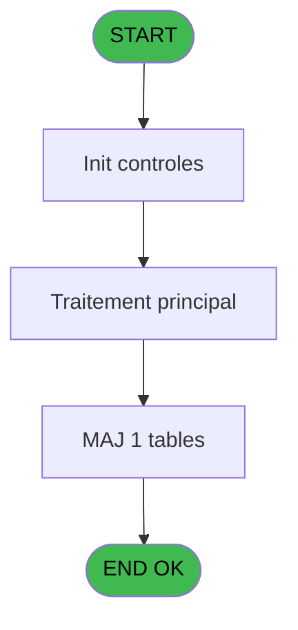
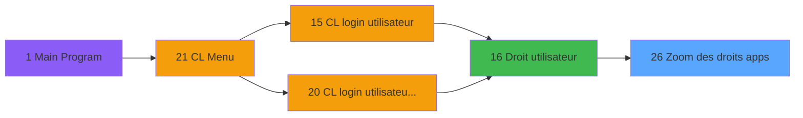
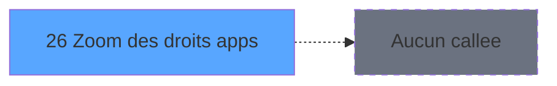

# LOG IDE 26 - Zoom des droits apps

> **Analyse**: Phases 1-4 2026-02-03 14:44 -> 14:44 (10s) | Assemblage 14:44
> **Pipeline**: V7.2 Enrichi
> **Structure**: 4 onglets (Resume | Ecrans | Donnees | Connexions)

<!-- TAB:Resume -->

## 1. FICHE D'IDENTITE

| Attribut | Valeur |
|----------|--------|
| Projet | LOG |
| IDE Position | 26 |
| Nom Programme | Zoom des droits apps |
| Fichier source | `Prg_26.xml` |
| Dossier IDE | Consultation |
| Taches | 1 (1 ecrans visibles) |
| Tables modifiees | 1 |
| Programmes appeles | 0 |

## 2. DESCRIPTION FONCTIONNELLE

**Zoom des droits apps** assure la gestion complete de ce processus, accessible depuis [   Droit / utilisateur (IDE 16)](LOG-IDE-16.md).

Le flux de traitement s'organise en **1 blocs fonctionnels** :

- **Consultation** (1 tache) : ecrans de recherche, selection et consultation

**Donnees modifiees** : 1 tables en ecriture (gm_type_millesia).

## 3. BLOCS FONCTIONNELS

### 3.1 Consultation (1 tache)

Ecrans de recherche et consultation.

---

#### 26 - Zoom des Droits [[ECRAN]](#ecran-t1)

**Role** : Selection par l'operateur : Zoom des Droits.
**Ecran** : 596 x 168 DLU (MDI) | [Voir mockup](#ecran-t1)
**Variables liees** : B (> Droits)

## 5. REGLES METIER

*(Aucune regle metier identifiee)*

## 6. CONTEXTE

- **Appele par**: [   Droit / utilisateur (IDE 16)](LOG-IDE-16.md)
- **Appelle**: 0 programmes | **Tables**: 1 (W:1 R:0 L:0) | **Taches**: 1 | **Expressions**: 3

<!-- TAB:Ecrans -->

## 8. ECRANS

### 8.1 Forms visibles (1 / 1)

| # | Position | Tache | Nom | Type | Largeur | Hauteur | Bloc |
|---|----------|-------|-----|------|---------|---------|------|
| 1 | 26 | 26 | Zoom des Droits | MDI | 596 | 168 | Consultation |

### 8.2 Mockups Ecrans

---

#### 26 - Zoom des Droits
**Tache** : [26](#t1) | **Type** : MDI | **Dimensions** : 596 x 168 DLU
**Bloc** : Consultation | **Titre IDE** : Zoom des Droits

<!-- FORM-DATA:
{
    "width":  596,
    "vFactor":  8,
    "type":  "MDI",
    "hFactor":  8,
    "controls":  [
                     {
                         "x":  4,
                         "type":  "label",
                         "var":  "",
                         "y":  142,
                         "w":  589,
                         "fmt":  "",
                         "name":  "",
                         "h":  24,
                         "color":  "",
                         "text":  "",
                         "parent":  null
                     },
                     {
                         "x":  37,
                         "type":  "table",
                         "var":  "",
                         "name":  "",
                         "titleH":  12,
                         "color":  "196",
                         "w":  523,
                         "y":  6,
                         "fmt":  "",
                         "parent":  null,
                         "text":  "",
                         "rowH":  11,
                         "h":  103,
                         "cols":  [
                                      {
                                          "title":  "Droit",
                                          "layer":  1,
                                          "w":  132
                                      },
                                      {
                                          "title":  "Description",
                                          "layer":  2,
                                          "w":  359
                                      }
                                  ],
                         "rows":  2
                     },
                     {
                         "x":  43,
                         "type":  "edit",
                         "var":  "",
                         "y":  22,
                         "w":  120,
                         "fmt":  "",
                         "name":  "",
                         "h":  8,
                         "color":  "196",
                         "text":  "",
                         "parent":  21
                     },
                     {
                         "x":  174,
                         "type":  "edit",
                         "var":  "",
                         "y":  22,
                         "w":  344,
                         "fmt":  "",
                         "name":  "",
                         "h":  8,
                         "color":  "196",
                         "text":  "",
                         "parent":  21
                     },
                     {
                         "x":  82,
                         "type":  "button",
                         "var":  "",
                         "y":  145,
                         "w":  160,
                         "fmt":  "\u0026Selectionner",
                         "name":  "",
                         "h":  18,
                         "color":  "",
                         "text":  "",
                         "parent":  7
                     },
                     {
                         "x":  360,
                         "type":  "button",
                         "var":  "",
                         "y":  145,
                         "w":  160,
                         "fmt":  "\u0026Quitter",
                         "name":  "",
                         "h":  18,
                         "color":  "",
                         "text":  "",
                         "parent":  7
                     },
                     {
                         "x":  266,
                         "type":  "image",
                         "var":  "",
                         "y":  116,
                         "w":  58,
                         "fmt":  "",
                         "name":  "",
                         "h":  18,
                         "color":  "",
                         "text":  "",
                         "parent":  null
                     }
                 ],
    "taskId":  "26",
    "height":  168
}
-->

<strong>Champs : 2 champs</strong>

| Pos (x,y) | Nom | Variable | Type |
|-----------|-----|----------|------|
| 43,22 | (sans nom) | - | edit |
| 174,22 | (sans nom) | - | edit |

<strong>Boutons : 2 boutons</strong>

| Bouton | Pos (x,y) | Action |
|--------|-----------|--------|
| Selectionner | 82,145 | Ouvre la selection |
| Quitter | 360,145 | Quitte le programme |

## 9. NAVIGATION

Ecran unique: **Zoom des Droits**

### 9.3 Structure hierarchique (1 tache)

| Position | Tache | Type | Dimensions | Bloc |
|----------|-------|------|------------|------|
| **26.1** | [**Zoom des Droits** (26)](#t1) [mockup](#ecran-t1) | MDI | 596x168 | Consultation |

### 9.4 Algorigramme

> **Legende**: Vert = START/END OK | Rouge = END KO | Bleu = Decisions
> *Algorigramme auto-genere. Utiliser `/algorigramme` pour une synthese metier detaillee.*

<!-- TAB:Donnees -->

## 10. TABLES

### Tables utilisees (1)

| ID | Nom | Description | Type | R | W | L | Usages |
|----|-----|-------------|------|---|---|---|--------|
| 716 | gm_type_millesia |  | DB |   | **W** |   | 1 |

### Colonnes par table (1 / 1 tables avec colonnes identifiees)

Table 716 - gm_type_millesia (**W**) - 1 usages

| Lettre | Variable | Acces | Type |
|--------|----------|-------|------|
| A | > Application | W | Alpha |
| B | > Droits | W | Alpha |

## 11. VARIABLES

### 11.1 Autres (2)

Variables diverses.

| Lettre | Nom | Type | Usage dans |
|--------|-----|------|-----------|
| A | > Application | Alpha | 1x refs |
| B | > Droits | Alpha | [26](#t1) |

## 12. EXPRESSIONS

**3 / 3 expressions decodees (100%)**

### 12.1 Repartition par type

| Type | Expressions | Regles |
|------|-------------|--------|
| CONDITION | 2 | 0 |
| OTHER | 1 | 0 |

### 12.2 Expressions cles par type

#### CONDITION (2 expressions)

| Type | IDE | Expression | Regle |
|------|-----|------------|-------|
| CONDITION | 2 | `> Droits [B]` | - |
| CONDITION | 1 | `> Application [A]` | - |

#### OTHER (1 expressions)

| Type | IDE | Expression | Regle |
|------|-----|------------|-------|
| OTHER | 3 | `[D]` | - |

<!-- TAB:Connexions -->

## 13. GRAPHE D'APPELS

### 13.1 Chaine depuis Main (Callers)

Main -> ... -> [   Droit / utilisateur (IDE 16)](LOG-IDE-16.md) -> **Zoom des droits apps (IDE 26)**

### 13.2 Callers

| IDE | Nom Programme | Nb Appels |
|-----|---------------|-----------|
| [16](LOG-IDE-16.md) |    Droit / utilisateur | 1 |

### 13.3 Callees (programmes appeles)

### 13.4 Detail Callees avec contexte

| IDE | Nom Programme | Appels | Contexte |
|-----|---------------|--------|----------|
| - | (aucun) | - | - |

## 14. RECOMMANDATIONS MIGRATION

### 14.1 Profil du programme

| Metrique | Valeur | Impact migration |
|----------|--------|-----------------|
| Lignes de logique | 8 | Programme compact |
| Expressions | 3 | Peu de logique |
| Tables WRITE | 1 | Impact faible |
| Sous-programmes | 0 | Peu de dependances |
| Ecrans visibles | 1 | Ecran unique ou traitement batch |
| Code desactive | 0% (0 / 8) | Code sain |
| Regles metier | 0 | Pas de regle identifiee |

### 14.2 Plan de migration par bloc

#### Consultation (1 tache: 1 ecran, 0 traitement)

- **Strategie** : Composants de recherche/selection en modales.
- 1 ecran : Zoom des Droits

### 14.3 Dependances critiques

| Dependance | Type | Appels | Impact |
|------------|------|--------|--------|
| gm_type_millesia | Table WRITE (Database) | 1x | Schema + repository |

---
*Spec DETAILED generee par Pipeline V7.2 - 2026-02-03 14:44*
