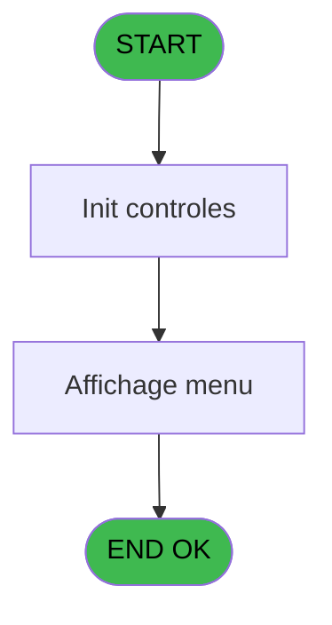
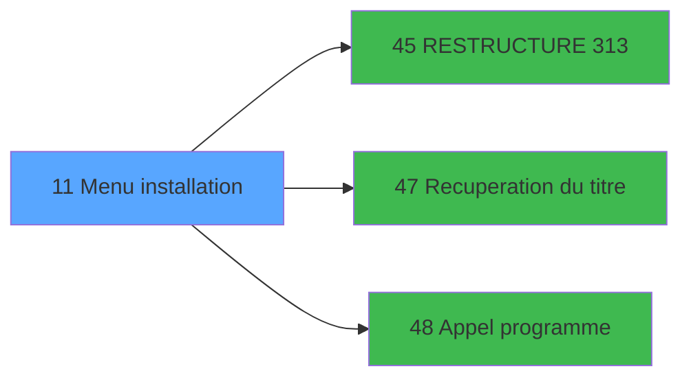

# MAI IDE 11 - Menu installation

> **Analyse**: Phases 1-4 2026-02-03 14:46 -> 14:46 (10s) | Assemblage 14:46
> **Pipeline**: V7.2 Enrichi
> **Structure**: 4 onglets (Resume | Ecrans | Donnees | Connexions)

<!-- TAB:Resume -->

## 1. FICHE D'IDENTITE

| Attribut | Valeur |
|----------|--------|
| Projet | MAI |
| IDE Position | 11 |
| Nom Programme | Menu installation |
| Fichier source | `Prg_11.xml` |
| Dossier IDE | Caisse |
| Taches | 4 (1 ecrans visibles) |
| Tables modifiees | 0 |
| Programmes appeles | 3 |

## 2. DESCRIPTION FONCTIONNELLE

**Menu installation** assure la gestion complete de ce processus, accessible depuis [Menu paramètres (IDE 23)](MAI-IDE-23.md).

Le flux de traitement s'organise en **2 blocs fonctionnels** :

- **Traitement** (3 taches) : traitements metier divers
- **Calcul** (1 tache) : calculs de montants, stocks ou compteurs

Detail : phases du traitement

#### Phase 1 : Traitement (3 taches)

- **11** - CV  Menu parametrage cam **[[ECRAN]](#ecran-t1)**
- **11.1** - Menu installations **[[ECRAN]](#ecran-t2)**
- **11.3** - Nom village

Delegue a : [RESTRUCTURE 313 (IDE 45)](MAI-IDE-45.md), [Recuperation du titre (IDE 47)](MAI-IDE-47.md), [Appel programme (IDE 48)](MAI-IDE-48.md)

#### Phase 2 : Calcul (1 tache)

- **11.2** - Date comptable

## 3. BLOCS FONCTIONNELS

### 3.1 Traitement (3 taches)

Traitements internes.

---

#### 11 - CV  Menu parametrage cam [[ECRAN]](#ecran-t1)

**Role** : Traitement : CV  Menu parametrage cam.
**Ecran** : 640 x 9 DLU (MDI) | [Voir mockup](#ecran-t1)
**Delegue a** : [RESTRUCTURE 313 (IDE 45)](MAI-IDE-45.md), [Recuperation du titre (IDE 47)](MAI-IDE-47.md), [Appel programme (IDE 48)](MAI-IDE-48.md)

---

#### 11.1 - Menu installations [[ECRAN]](#ecran-t2)

**Role** : Traitement : Menu installations.
**Ecran** : 850 x 243 DLU (MDI) | [Voir mockup](#ecran-t2)
**Delegue a** : [RESTRUCTURE 313 (IDE 45)](MAI-IDE-45.md), [Recuperation du titre (IDE 47)](MAI-IDE-47.md), [Appel programme (IDE 48)](MAI-IDE-48.md)

---

#### 11.3 - Nom village

**Role** : Traitement : Nom village.
**Variables liees** : E (W0 Nom village)
**Delegue a** : [RESTRUCTURE 313 (IDE 45)](MAI-IDE-45.md), [Recuperation du titre (IDE 47)](MAI-IDE-47.md), [Appel programme (IDE 48)](MAI-IDE-48.md)

### 3.2 Calcul (1 tache)

Calculs metier : montants, stocks, compteurs.

---

#### 11.2 - Date comptable

**Role** : Traitement : Date comptable.
**Variables liees** : D (W0 Date comptable)

## 5. REGLES METIER

*(Aucune regle metier identifiee)*

## 6. CONTEXTE

- **Appele par**: [Menu paramètres (IDE 23)](MAI-IDE-23.md)
- **Appelle**: 3 programmes | **Tables**: 2 (W:0 R:2 L:0) | **Taches**: 4 | **Expressions**: 9

<!-- TAB:Ecrans -->

## 8. ECRANS

### 8.1 Forms visibles (1 / 4)

| # | Position | Tache | Nom | Type | Largeur | Hauteur | Bloc |
|---|----------|-------|-----|------|---------|---------|------|
| 1 | 11.1 | 11.1 | Menu installations | MDI | 850 | 243 | Traitement |

### 8.2 Mockups Ecrans

---

#### 11.1 - Menu installations
**Tache** : [11.1](#t2) | **Type** : MDI | **Dimensions** : 850 x 243 DLU
**Bloc** : Traitement | **Titre IDE** : Menu installations

<!-- FORM-DATA:
{
    "width":  850,
    "vFactor":  8,
    "type":  "MDI",
    "hFactor":  8,
    "controls":  [
                     {
                         "x":  0,
                         "type":  "label",
                         "var":  "",
                         "y":  0,
                         "w":  842,
                         "fmt":  "",
                         "name":  "",
                         "h":  18,
                         "color":  "",
                         "text":  "",
                         "parent":  null
                     },
                     {
                         "x":  25,
                         "type":  "label",
                         "var":  "",
                         "y":  33,
                         "w":  791,
                         "fmt":  "",
                         "name":  "",
                         "h":  168,
                         "color":  "",
                         "text":  "",
                         "parent":  null
                     },
                     {
                         "x":  271,
                         "type":  "label",
                         "var":  "",
                         "y":  47,
                         "w":  512,
                         "fmt":  "",
                         "name":  "",
                         "h":  131,
                         "color":  "",
                         "text":  "",
                         "parent":  4
                     },
                     {
                         "x":  274,
                         "type":  "label",
                         "var":  "",
                         "y":  48,
                         "w":  48,
                         "fmt":  "",
                         "name":  "",
                         "h":  129,
                         "color":  "",
                         "text":  "",
                         "parent":  4
                     },
                     {
                         "x":  335,
                         "type":  "label",
                         "var":  "",
                         "y":  52,
                         "w":  421,
                         "fmt":  "",
                         "name":  "",
                         "h":  8,
                         "color":  "7",
                         "text":  "Mise à jour fichier TPE",
                         "parent":  4
                     },
                     {
                         "x":  335,
                         "type":  "label",
                         "var":  "",
                         "y":  66,
                         "w":  421,
                         "fmt":  "",
                         "name":  "",
                         "h":  8,
                         "color":  "7",
                         "text":  "",
                         "parent":  4
                     },
                     {
                         "x":  335,
                         "type":  "label",
                         "var":  "",
                         "y":  80,
                         "w":  421,
                         "fmt":  "",
                         "name":  "",
                         "h":  8,
                         "color":  "7",
                         "text":  "",
                         "parent":  4
                     },
                     {
                         "x":  335,
                         "type":  "label",
                         "var":  "",
                         "y":  94,
                         "w":  421,
                         "fmt":  "",
                         "name":  "",
                         "h":  8,
                         "color":  "7",
                         "text":  "",
                         "parent":  4
                     },
                     {
                         "x":  335,
                         "type":  "label",
                         "var":  "",
                         "y":  108,
                         "w":  421,
                         "fmt":  "",
                         "name":  "",
                         "h":  8,
                         "color":  "7",
                         "text":  "",
                         "parent":  4
                     },
                     {
                         "x":  335,
                         "type":  "label",
                         "var":  "",
                         "y":  122,
                         "w":  421,
                         "fmt":  "",
                         "name":  "",
                         "h":  8,
                         "color":  "7",
                         "text":  "",
                         "parent":  4
                     },
                     {
                         "x":  335,
                         "type":  "label",
                         "var":  "",
                         "y":  136,
                         "w":  421,
                         "fmt":  "",
                         "name":  "",
                         "h":  8,
                         "color":  "7",
                         "text":  "",
                         "parent":  4
                     },
                     {
                         "x":  335,
                         "type":  "label",
                         "var":  "",
                         "y":  150,
                         "w":  421,
                         "fmt":  "",
                         "name":  "",
                         "h":  8,
                         "color":  "7",
                         "text":  "",
                         "parent":  4
                     },
                     {
                         "x":  335,
                         "type":  "label",
                         "var":  "",
                         "y":  165,
                         "w":  421,
                         "fmt":  "",
                         "name":  "",
                         "h":  8,
                         "color":  "7",
                         "text":  "",
                         "parent":  4
                     },
                     {
                         "x":  441,
                         "type":  "label",
                         "var":  "",
                         "y":  184,
                         "w":  123,
                         "fmt":  "",
                         "name":  "",
                         "h":  10,
                         "color":  "",
                         "text":  "Votre choix",
                         "parent":  4
                     },
                     {
                         "x":  0,
                         "type":  "label",
                         "var":  "",
                         "y":  215,
                         "w":  841,
                         "fmt":  "",
                         "name":  "",
                         "h":  24,
                         "color":  "",
                         "text":  "",
                         "parent":  null
                     },
                     {
                         "x":  575,
                         "type":  "edit",
                         "var":  "",
                         "y":  184,
                         "w":  26,
                         "fmt":  "",
                         "name":  "",
                         "h":  10,
                         "color":  "6",
                         "text":  "",
                         "parent":  4
                     },
                     {
                         "x":  6,
                         "type":  "edit",
                         "var":  "",
                         "y":  4,
                         "w":  267,
                         "fmt":  "20",
                         "name":  "",
                         "h":  8,
                         "color":  "",
                         "text":  "",
                         "parent":  null
                     },
                     {
                         "x":  563,
                         "type":  "edit",
                         "var":  "",
                         "y":  5,
                         "w":  268,
                         "fmt":  "WWW DD MMM YYYYT",
                         "name":  "",
                         "h":  8,
                         "color":  "",
                         "text":  "",
                         "parent":  null
                     },
                     {
                         "x":  65,
                         "type":  "image",
                         "var":  "",
                         "y":  83,
                         "w":  147,
                         "fmt":  "",
                         "name":  "",
                         "h":  62,
                         "color":  "",
                         "text":  "",
                         "parent":  null
                     },
                     {
                         "x":  274,
                         "type":  "edit",
                         "var":  "",
                         "y":  222,
                         "w":  541,
                         "fmt":  "",
                         "name":  "",
                         "h":  10,
                         "color":  "143",
                         "text":  "",
                         "parent":  19
                     },
                     {
                         "x":  285,
                         "type":  "button",
                         "var":  "",
                         "y":  51,
                         "w":  26,
                         "fmt":  "1",
                         "name":  "1",
                         "h":  8,
                         "color":  "",
                         "text":  "",
                         "parent":  null
                     },
                     {
                         "x":  285,
                         "type":  "button",
                         "var":  "",
                         "y":  66,
                         "w":  26,
                         "fmt":  "2",
                         "name":  "2",
                         "h":  8,
                         "color":  "",
                         "text":  "",
                         "parent":  null
                     },
                     {
                         "x":  285,
                         "type":  "button",
                         "var":  "",
                         "y":  80,
                         "w":  26,
                         "fmt":  "3",
                         "name":  "3",
                         "h":  8,
                         "color":  "",
                         "text":  "",
                         "parent":  null
                     },
                     {
                         "x":  285,
                         "type":  "button",
                         "var":  "",
                         "y":  94,
                         "w":  26,
                         "fmt":  "4",
                         "name":  "4",
                         "h":  8,
                         "color":  "",
                         "text":  "",
                         "parent":  null
                     },
                     {
                         "x":  285,
                         "type":  "button",
                         "var":  "",
                         "y":  108,
                         "w":  26,
                         "fmt":  "5",
                         "name":  "5",
                         "h":  8,
                         "color":  "",
                         "text":  "",
                         "parent":  null
                     },
                     {
                         "x":  285,
                         "type":  "button",
                         "var":  "",
                         "y":  122,
                         "w":  26,
                         "fmt":  "6",
                         "name":  "6",
                         "h":  8,
                         "color":  "",
                         "text":  "",
                         "parent":  null
                     },
                     {
                         "x":  285,
                         "type":  "button",
                         "var":  "",
                         "y":  136,
                         "w":  26,
                         "fmt":  "7",
                         "name":  "7",
                         "h":  8,
                         "color":  "",
                         "text":  "",
                         "parent":  null
                     },
                     {
                         "x":  285,
                         "type":  "button",
                         "var":  "",
                         "y":  150,
                         "w":  26,
                         "fmt":  "8",
                         "name":  "8",
                         "h":  8,
                         "color":  "",
                         "text":  "",
                         "parent":  null
                     },
                     {
                         "x":  285,
                         "type":  "button",
                         "var":  "",
                         "y":  165,
                         "w":  26,
                         "fmt":  "9",
                         "name":  "9",
                         "h":  8,
                         "color":  "",
                         "text":  "",
                         "parent":  null
                     },
                     {
                         "x":  7,
                         "type":  "button",
                         "var":  "",
                         "y":  218,
                         "w":  168,
                         "fmt":  "\u0026Quitter",
                         "name":  "",
                         "h":  18,
                         "color":  "",
                         "text":  "",
                         "parent":  null
                     }
                 ],
    "taskId":  "11.1",
    "height":  243
}
-->

<strong>Champs : 4 champs</strong>

| Pos (x,y) | Nom | Variable | Type |
|-----------|-----|----------|------|
| 575,184 | (sans nom) | - | edit |
| 6,4 | 20 | - | edit |
| 563,5 | WWW DD MMM YYYYT | - | edit |
| 274,222 | (sans nom) | - | edit |

<strong>Boutons : 10 boutons</strong>

| Bouton | Pos (x,y) | Action |
|--------|-----------|--------|
| 1 | 285,51 | Bouton fonctionnel |
| 2 | 285,66 | Bouton fonctionnel |
| 3 | 285,80 | Bouton fonctionnel |
| 4 | 285,94 | Bouton fonctionnel |
| 5 | 285,108 | Bouton fonctionnel |
| 6 | 285,122 | Bouton fonctionnel |
| 7 | 285,136 | Bouton fonctionnel |
| 8 | 285,150 | Bouton fonctionnel |
| 9 | 285,165 | Bouton fonctionnel |
| Quitter | 7,218 | Quitte le programme |

## 9. NAVIGATION

Ecran unique: **Menu installations**

### 9.3 Structure hierarchique (4 taches)

| Position | Tache | Type | Dimensions | Bloc |
|----------|-------|------|------------|------|
| **11.1** | [**CV  Menu parametrage cam** (11)](#t1) [mockup](#ecran-t1) | MDI | 640x9 | Traitement |
| 11.1.1 | [Menu installations (11.1)](#t2) [mockup](#ecran-t2) | MDI | 850x243 | |
| 11.1.2 | [Nom village (11.3)](#t4) | MDI | - | |
| **11.2** | [**Date comptable** (11.2)](#t3) | MDI | - | Calcul |

### 9.4 Algorigramme

> **Legende**: Vert = START/END OK | Rouge = END KO | Bleu = Decisions
> *Algorigramme auto-genere. Utiliser `/algorigramme` pour une synthese metier detaillee.*

<!-- TAB:Donnees -->

## 10. TABLES

### Tables utilisees (2)

| ID | Nom | Description | Type | R | W | L | Usages |
|----|-----|-------------|------|---|---|---|--------|
| 69 | initialisation___ini |  | DB | R |   |   | 1 |
| 70 | date_comptable___dat |  | DB | R |   |   | 1 |

### Colonnes par table (1 / 2 tables avec colonnes identifiees)

Table 69 - initialisation___ini (R) - 1 usages

*Table utilisee uniquement en Link ou aucune colonne Real identifiee dans le DataView.*

Table 70 - date_comptable___dat (R) - 1 usages

| Lettre | Variable | Acces | Type |
|--------|----------|-------|------|
| D | W0 Date comptable | R | Date |

## 11. VARIABLES

### 11.1 Parametres entrants (2)

Variables recues du programme appelant ([Menu paramètres (IDE 23)](MAI-IDE-23.md)).

| Lettre | Nom | Type | Usage dans |
|--------|-----|------|-----------|
| A | P0 societe | Alpha | 1x parametre entrant |
| B | P0 devise locale | Alpha | 1x parametre entrant |

### 11.2 Variables de travail (4)

Variables internes au programme.

| Lettre | Nom | Type | Usage dans |
|--------|-----|------|-----------|
| C | W0 choix action | Alpha | 2x calcul interne |
| D | W0 Date comptable | Date | - |
| E | W0 Nom village | Alpha | - |
| F | W0 Libelle instal | Alpha | - |

## 12. EXPRESSIONS

**9 / 9 expressions decodees (100%)**

### 12.1 Repartition par type

| Type | Expressions | Regles |
|------|-------------|--------|
| CALCULATION | 1 | 0 |
| CONSTANTE | 4 | 0 |
| CONDITION | 4 | 0 |

### 12.2 Expressions cles par type

#### CALCULATION (1 expressions)

| Type | IDE | Expression | Regle |
|------|-----|------------|-------|
| CALCULATION | 9 | `CallProg('{323,-1}'PROG,DbName('{261,2}'DSOURCE))` | - |

#### CONSTANTE (4 expressions)

| Type | IDE | Expression | Regle |
|------|-----|------------|-------|
| CONSTANTE | 7 | `''` | - |
| CONSTANTE | 8 | `'Mise à niveau terminee'` | - |
| CONSTANTE | 3 | `'C'` | - |
| CONSTANTE | 4 | `'EUR'` | - |

#### CONDITION (4 expressions)

| Type | IDE | Expression | Regle |
|------|-----|------------|-------|
| CONDITION | 5 | `W0 choix action [C]='1'` | - |
| CONDITION | 6 | `W0 choix action [C]='' OR W0 choix action [C]='F'` | - |
| CONDITION | 1 | `P0 societe [A]=''` | - |
| CONDITION | 2 | `P0 devise locale [B]=''` | - |

<!-- TAB:Connexions -->

## 13. GRAPHE D'APPELS

### 13.1 Chaine depuis Main (Callers)

Main -> ... -> [Menu paramètres (IDE 23)](MAI-IDE-23.md) -> **Menu installation (IDE 11)**

### 13.2 Callers

| IDE | Nom Programme | Nb Appels |
|-----|---------------|-----------|
| [23](MAI-IDE-23.md) | Menu paramètres | 1 |

### 13.3 Callees (programmes appeles)

### 13.4 Detail Callees avec contexte

| IDE | Nom Programme | Appels | Contexte |
|-----|---------------|--------|----------|
| [45](MAI-IDE-45.md) | RESTRUCTURE 313 | 1 | Sous-programme |
| [47](MAI-IDE-47.md) | Recuperation du titre | 1 | Recuperation donnees |
| [48](MAI-IDE-48.md) | Appel programme | 1 | Sous-programme |

## 14. RECOMMANDATIONS MIGRATION

### 14.1 Profil du programme

| Metrique | Valeur | Impact migration |
|----------|--------|-----------------|
| Lignes de logique | 44 | Programme compact |
| Expressions | 9 | Peu de logique |
| Tables WRITE | 0 | Impact faible |
| Sous-programmes | 3 | Peu de dependances |
| Ecrans visibles | 1 | Ecran unique ou traitement batch |
| Code desactive | 0% (0 / 44) | Code sain |
| Regles metier | 0 | Pas de regle identifiee |

### 14.2 Plan de migration par bloc

#### Traitement (3 taches: 2 ecrans, 1 traitement)

- **Strategie** : Orchestrateur avec 2 ecrans (Razor/React) et 1 traitements backend (services).
- Les ecrans deviennent des composants UI, les traitements invisibles deviennent des services injectables.
- 3 sous-programme(s) a migrer ou a reutiliser depuis les services existants.
- Decomposer les taches en services unitaires testables.

#### Calcul (1 tache: 0 ecran, 1 traitement)

- **Strategie** : Services de calcul purs (Domain Services).
- Migrer la logique de calcul (stock, compteurs, montants)

### 14.3 Dependances critiques

| Dependance | Type | Appels | Impact |
|------------|------|--------|--------|
| [Appel programme (IDE 48)](MAI-IDE-48.md) | Sous-programme | 1x | Normale - Sous-programme |
| [Recuperation du titre (IDE 47)](MAI-IDE-47.md) | Sous-programme | 1x | Normale - Recuperation donnees |
| [RESTRUCTURE 313 (IDE 45)](MAI-IDE-45.md) | Sous-programme | 1x | Normale - Sous-programme |

---
*Spec DETAILED generee par Pipeline V7.2 - 2026-02-03 14:46*
