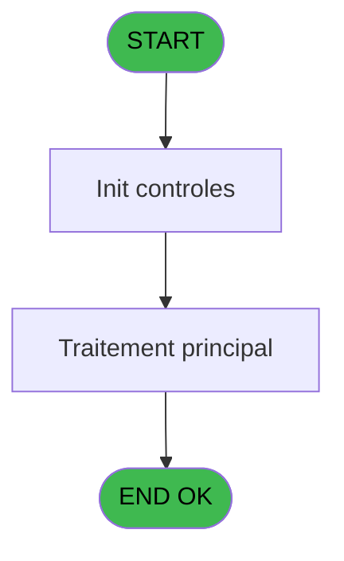
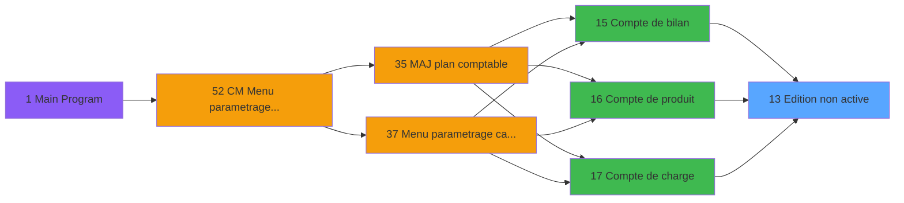

# MAI IDE 13 - Edition non active

> **Analyse**: Phases 1-4 2026-02-03 14:47 -> 14:47 (9s) | Assemblage 14:47
> **Pipeline**: V7.2 Enrichi
> **Structure**: 4 onglets (Resume | Ecrans | Donnees | Connexions)

<!-- TAB:Resume -->

## 1. FICHE D'IDENTITE

| Attribut | Valeur |
|----------|--------|
| Projet | MAI |
| IDE Position | 13 |
| Nom Programme | Edition non active |
| Fichier source | `Prg_13.xml` |
| Dossier IDE | Caisse |
| Taches | 1 (1 ecrans visibles) |
| Tables modifiees | 0 |
| Programmes appeles | 0 |

## 2. DESCRIPTION FONCTIONNELLE

**Edition non active** assure la gestion complete de ce processus, accessible depuis [Compte de bilan (IDE 15)](MAI-IDE-15.md), [Compte de produit (IDE 16)](MAI-IDE-16.md), [Compte de charge (IDE 17)](MAI-IDE-17.md).

Le flux de traitement s'organise en **1 blocs fonctionnels** :

- **Impression** (1 tache) : generation de tickets et documents

## 3. BLOCS FONCTIONNELS

### 3.1 Impression (1 tache)

Generation des documents et tickets.

---

#### 13 - Edition non active [[ECRAN]](#ecran-t1)

**Role** : Generation du document : Edition non active.
**Ecran** : 250 x 96 DLU (MDI) | [Voir mockup](#ecran-t1)

## 5. REGLES METIER

*(Aucune regle metier identifiee)*

## 6. CONTEXTE

- **Appele par**: [Compte de bilan (IDE 15)](MAI-IDE-15.md), [Compte de produit (IDE 16)](MAI-IDE-16.md), [Compte de charge (IDE 17)](MAI-IDE-17.md)
- **Appelle**: 0 programmes | **Tables**: 0 (W:0 R:0 L:0) | **Taches**: 1 | **Expressions**: 0

<!-- TAB:Ecrans -->

## 8. ECRANS

### 8.1 Forms visibles (1 / 1)

| # | Position | Tache | Nom | Type | Largeur | Hauteur | Bloc |
|---|----------|-------|-----|------|---------|---------|------|
| 1 | 13 | 13 | Edition non active | MDI | 250 | 96 | Impression |

### 8.2 Mockups Ecrans

---

#### 13 - Edition non active
**Tache** : [13](#t1) | **Type** : MDI | **Dimensions** : 250 x 96 DLU
**Bloc** : Impression | **Titre IDE** : Edition non active

<!-- FORM-DATA:
{
    "width":  250,
    "vFactor":  8,
    "type":  "MDI",
    "hFactor":  4,
    "controls":  [
                     {
                         "x":  88,
                         "type":  "label",
                         "var":  "",
                         "y":  32,
                         "w":  76,
                         "fmt":  "",
                         "name":  "",
                         "h":  16,
                         "color":  "144",
                         "text":  "Non actif",
                         "parent":  null
                     },
                     {
                         "x":  88,
                         "type":  "button",
                         "var":  "",
                         "y":  72,
                         "w":  77,
                         "fmt":  "Quitter",
                         "name":  "bouton",
                         "h":  14,
                         "color":  "",
                         "text":  "",
                         "parent":  null
                     }
                 ],
    "taskId":  "13",
    "height":  96
}
-->

<strong>Boutons : 1 boutons</strong>

| Bouton | Pos (x,y) | Action |
|--------|-----------|--------|
| Quitter | 88,72 | Quitte le programme |

## 9. NAVIGATION

Ecran unique: **Edition non active**

### 9.3 Structure hierarchique (1 tache)

| Position | Tache | Type | Dimensions | Bloc |
|----------|-------|------|------------|------|
| **13.1** | [**Edition non active** (13)](#t1) [mockup](#ecran-t1) | MDI | 250x96 | Impression |

### 9.4 Algorigramme

> **Legende**: Vert = START/END OK | Rouge = END KO | Bleu = Decisions
> *Algorigramme auto-genere. Utiliser `/algorigramme` pour une synthese metier detaillee.*

<!-- TAB:Donnees -->

## 10. TABLES

### Tables utilisees (0)

| ID | Nom | Description | Type | R | W | L | Usages |
|----|-----|-------------|------|---|---|---|--------|

### Colonnes par table (0 / 0 tables avec colonnes identifiees)

## 11. VARIABLES

*(Programme sans variables locales mappees)*

## 12. EXPRESSIONS

**0 / 0 expressions decodees (0%)**

### 12.1 Repartition par type

| Type | Expressions | Regles |
|------|-------------|--------|

### 12.2 Expressions cles par type

<!-- TAB:Connexions -->

## 13. GRAPHE D'APPELS

### 13.1 Chaine depuis Main (Callers)

Main -> ... -> [Compte de bilan (IDE 15)](MAI-IDE-15.md) -> **Edition non active (IDE 13)**

Main -> ... -> [Compte de produit (IDE 16)](MAI-IDE-16.md) -> **Edition non active (IDE 13)**

Main -> ... -> [Compte de charge (IDE 17)](MAI-IDE-17.md) -> **Edition non active (IDE 13)**

### 13.2 Callers

| IDE | Nom Programme | Nb Appels |
|-----|---------------|-----------|
| [15](MAI-IDE-15.md) | Compte de bilan | 1 |
| [16](MAI-IDE-16.md) | Compte de produit | 1 |
| [17](MAI-IDE-17.md) | Compte de charge | 1 |

### 13.3 Callees (programmes appeles)

### 13.4 Detail Callees avec contexte

| IDE | Nom Programme | Appels | Contexte |
|-----|---------------|--------|----------|
| - | (aucun) | - | - |

## 14. RECOMMANDATIONS MIGRATION

### 14.1 Profil du programme

| Metrique | Valeur | Impact migration |
|----------|--------|-----------------|
| Lignes de logique | 4 | Programme compact |
| Expressions | 0 | Peu de logique |
| Tables WRITE | 0 | Impact faible |
| Sous-programmes | 0 | Peu de dependances |
| Ecrans visibles | 1 | Ecran unique ou traitement batch |
| Code desactive | 0% (0 / 4) | Code sain |
| Regles metier | 0 | Pas de regle identifiee |

### 14.2 Plan de migration par bloc

#### Impression (1 tache: 1 ecran, 0 traitement)

- **Strategie** : Templates HTML -> PDF via wkhtmltopdf ou Puppeteer.
- `PrintService` injectable avec choix imprimante

### 14.3 Dependances critiques

| Dependance | Type | Appels | Impact |
|------------|------|--------|--------|

---
*Spec DETAILED generee par Pipeline V7.2 - 2026-02-03 14:47*
