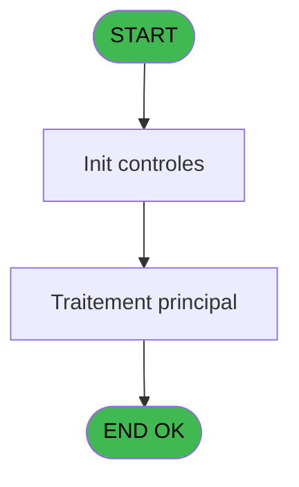

# MAI IDE 14 - Imp articles à modifier WS

> **Analyse**: Phases 1-4 2026-02-03 14:47 -> 14:47 (10s) | Assemblage 14:47
> **Pipeline**: V7.2 Enrichi
> **Structure**: 4 onglets (Resume | Ecrans | Donnees | Connexions)

<!-- TAB:Resume -->

## 1. FICHE D'IDENTITE

| Attribut | Valeur |
|----------|--------|
| Projet | MAI |
| IDE Position | 14 |
| Nom Programme | Imp articles à modifier WS |
| Fichier source | `Prg_14.xml` |
| Dossier IDE | Caisse |
| Taches | 1 (1 ecrans visibles) |
| Tables modifiees | 0 |
| Programmes appeles | 0 |

## 2. DESCRIPTION FONCTIONNELLE

**Imp articles à modifier WS** assure la gestion complete de ce processus, accessible depuis [Menu parametrage caisse (IDE 37)](MAI-IDE-37.md), [MAJ plan comptable (IDE 35)](MAI-IDE-35.md).

Le flux de traitement s'organise en **1 blocs fonctionnels** :

- **Traitement** (1 tache) : traitements metier divers

## 3. BLOCS FONCTIONNELS

### 3.1 Traitement (1 tache)

Traitements internes.

---

#### 14 - Veuillez patienter ..... [[ECRAN]](#ecran-t1)

**Role** : Traitement : Veuillez patienter ......
**Ecran** : 427 x 58 DLU (MDI) | [Voir mockup](#ecran-t1)

## 5. REGLES METIER

*(Aucune regle metier identifiee)*

## 6. CONTEXTE

- **Appele par**: [Menu parametrage caisse (IDE 37)](MAI-IDE-37.md), [MAJ plan comptable (IDE 35)](MAI-IDE-35.md)
- **Appelle**: 0 programmes | **Tables**: 2 (W:0 R:1 L:1) | **Taches**: 1 | **Expressions**: 9

<!-- TAB:Ecrans -->

## 8. ECRANS

### 8.1 Forms visibles (1 / 1)

| # | Position | Tache | Nom | Type | Largeur | Hauteur | Bloc |
|---|----------|-------|-----|------|---------|---------|------|
| 1 | 14 | 14 | Veuillez patienter ..... | MDI | 427 | 58 | Traitement |

### 8.2 Mockups Ecrans

---

#### 14 - Veuillez patienter .....
**Tache** : [14](#t1) | **Type** : MDI | **Dimensions** : 427 x 58 DLU
**Bloc** : Traitement | **Titre IDE** : Veuillez patienter .....

<!-- FORM-DATA:
{
    "width":  427,
    "vFactor":  8,
    "type":  "MDI",
    "hFactor":  8,
    "controls":  [
                     {
                         "x":  0,
                         "type":  "label",
                         "var":  "",
                         "y":  0,
                         "w":  423,
                         "fmt":  "",
                         "name":  "",
                         "h":  29,
                         "color":  "",
                         "text":  "",
                         "parent":  null
                     },
                     {
                         "x":  117,
                         "type":  "label",
                         "var":  "",
                         "y":  10,
                         "w":  275,
                         "fmt":  "",
                         "name":  "",
                         "h":  8,
                         "color":  "7",
                         "text":  "Impression en cours",
                         "parent":  null
                     },
                     {
                         "x":  0,
                         "type":  "label",
                         "var":  "",
                         "y":  29,
                         "w":  423,
                         "fmt":  "",
                         "name":  "",
                         "h":  27,
                         "color":  "",
                         "text":  "",
                         "parent":  null
                     },
                     {
                         "x":  70,
                         "type":  "label",
                         "var":  "",
                         "y":  39,
                         "w":  282,
                         "fmt":  "",
                         "name":  "",
                         "h":  8,
                         "color":  "",
                         "text":  "Impression listing comptable",
                         "parent":  null
                     },
                     {
                         "x":  1,
                         "type":  "image",
                         "var":  "",
                         "y":  2,
                         "w":  72,
                         "fmt":  "",
                         "name":  "",
                         "h":  25,
                         "color":  "",
                         "text":  "",
                         "parent":  null
                     }
                 ],
    "taskId":  "14",
    "height":  58
}
-->

## 9. NAVIGATION

Ecran unique: **Veuillez patienter .....**

### 9.3 Structure hierarchique (1 tache)

| Position | Tache | Type | Dimensions | Bloc |
|----------|-------|------|------------|------|
| **14.1** | [**Veuillez patienter .....** (14)](#t1) [mockup](#ecran-t1) | MDI | 427x58 | Traitement |

### 9.4 Algorigramme

> **Legende**: Vert = START/END OK | Rouge = END KO | Bleu = Decisions
> *Algorigramme auto-genere. Utiliser `/algorigramme` pour une synthese metier detaillee.*

<!-- TAB:Donnees -->

## 10. TABLES

### Tables utilisees (2)

| ID | Nom | Description | Type | R | W | L | Usages |
|----|-----|-------------|------|---|---|---|--------|
| 65 | comptes_recette__cre | Comptes GM (generaux) | DB | R |   |   | 1 |
| 77 | articles_________art | Articles et stock | DB |   |   | L | 1 |

### Colonnes par table (1 / 1 tables avec colonnes identifiees)

Table 65 - comptes_recette__cre (R) - 1 usages

| Lettre | Variable | Acces | Type |
|--------|----------|-------|------|
| A | P0 societe | R | Alpha |
| B | P0 date comptable | R | Date |
| C | P0 nom village | R | Alpha |
| D | P0 from MAJ | R | Logical |
| E | EXISTE IMPUTATION | R | Logical |

## 11. VARIABLES

### 11.1 Parametres entrants (4)

Variables recues du programme appelant ([Menu parametrage caisse (IDE 37)](MAI-IDE-37.md)).

| Lettre | Nom | Type | Usage dans |
|--------|-----|------|-----------|
| A | P0 societe | Alpha | - |
| B | P0 date comptable | Date | - |
| C | P0 nom village | Alpha | - |
| D | P0 from MAJ | Logical | 1x parametre entrant |

### 11.2 Autres (1)

Variables diverses.

| Lettre | Nom | Type | Usage dans |
|--------|-----|------|-----------|
| E | EXISTE IMPUTATION | Logical | 1x refs |

## 12. EXPRESSIONS

**9 / 9 expressions decodees (100%)**

### 12.1 Repartition par type

| Type | Expressions | Regles |
|------|-------------|--------|
| CONCATENATION | 2 | 0 |
| OTHER | 4 | 0 |
| CONDITION | 2 | 0 |
| NEGATION | 1 | 0 |

### 12.2 Expressions cles par type

#### CONCATENATION (2 expressions)

| Type | IDE | Expression | Regle |
|------|-----|------------|-------|
| CONCATENATION | 1 | `DStr (Date (),'DD/MM/YYYY')&' - '&TStr (Time (),'HH:MM:SS')` | - |
| CONCATENATION | 5 | `'- '&Str (Page (0,1),'3P0Z0')&' -'` | - |

#### OTHER (4 expressions)

| Type | IDE | Expression | Regle |
|------|-----|------------|-------|
| OTHER | 6 | `[I]` | - |
| OTHER | 7 | `CndRange (NOT (P0 from MAJ [D]),[J])` | - |
| OTHER | 2 | `SetCrsr (1)` | - |
| OTHER | 3 | `SetCrsr (2)` | - |

#### CONDITION (2 expressions)

| Type | IDE | Expression | Regle |
|------|-----|------------|-------|
| CONDITION | 8 | `EXISTE IMPUTATION [E]<>999999` | - |
| CONDITION | 4 | `INIGet ('[MAGIC_LOGICAL_NAMES]preview')='O'` | - |

#### NEGATION (1 expressions)

| Type | IDE | Expression | Regle |
|------|-----|------------|-------|
| NEGATION | 9 | `NOT ([Q])` | - |

<!-- TAB:Connexions -->

## 13. GRAPHE D'APPELS

### 13.1 Chaine depuis Main (Callers)

Main -> ... -> [Menu parametrage caisse (IDE 37)](MAI-IDE-37.md) -> **Imp articles à modifier WS (IDE 14)**

Main -> ... -> [MAJ plan comptable (IDE 35)](MAI-IDE-35.md) -> **Imp articles à modifier WS (IDE 14)**

### 13.2 Callers

| IDE | Nom Programme | Nb Appels |
|-----|---------------|-----------|
| [37](MAI-IDE-37.md) | Menu parametrage caisse | 2 |
| [35](MAI-IDE-35.md) | MAJ plan comptable | 1 |

### 13.3 Callees (programmes appeles)

### 13.4 Detail Callees avec contexte

| IDE | Nom Programme | Appels | Contexte |
|-----|---------------|--------|----------|
| - | (aucun) | - | - |

## 14. RECOMMANDATIONS MIGRATION

### 14.1 Profil du programme

| Metrique | Valeur | Impact migration |
|----------|--------|-----------------|
| Lignes de logique | 31 | Programme compact |
| Expressions | 9 | Peu de logique |
| Tables WRITE | 0 | Impact faible |
| Sous-programmes | 0 | Peu de dependances |
| Ecrans visibles | 1 | Ecran unique ou traitement batch |
| Code desactive | 0% (0 / 31) | Code sain |
| Regles metier | 0 | Pas de regle identifiee |

### 14.2 Plan de migration par bloc

#### Traitement (1 tache: 1 ecran, 0 traitement)

- **Strategie** : 1 composant(s) UI (Razor/React) avec formulaires et validation.
- Decomposer les taches en services unitaires testables.

### 14.3 Dependances critiques

| Dependance | Type | Appels | Impact |
|------------|------|--------|--------|

---
*Spec DETAILED generee par Pipeline V7.2 - 2026-02-03 14:47*
