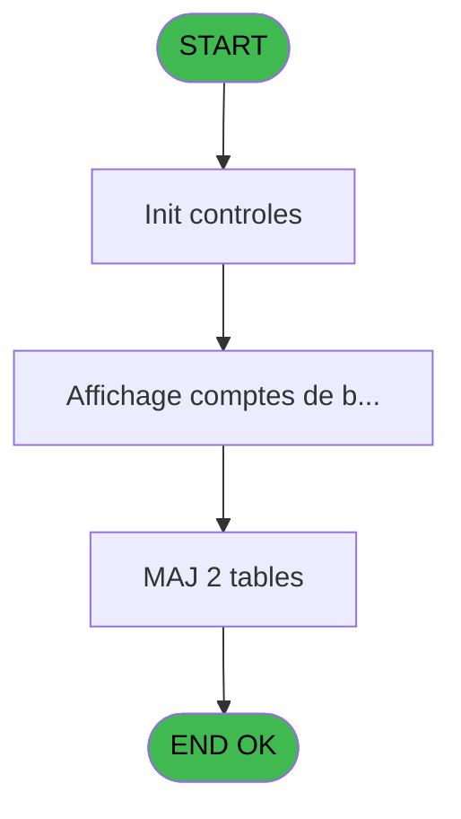
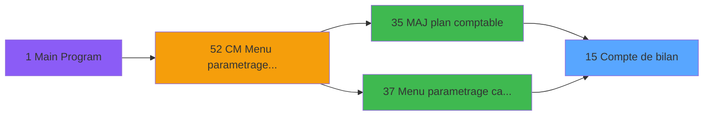
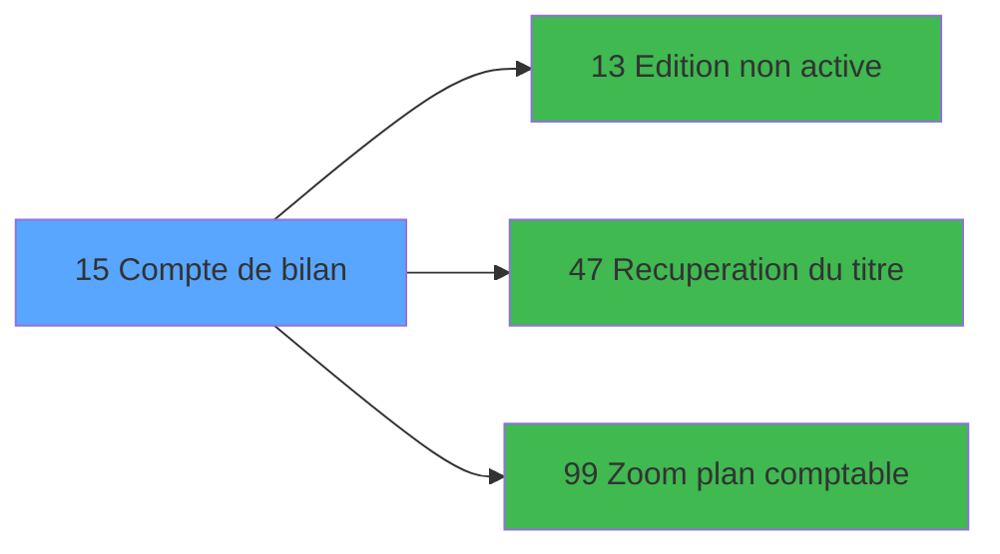

# MAI IDE 15 - Compte de bilan

> **Analyse**: Phases 1-4 2026-02-03 14:47 -> 14:47 (10s) | Assemblage 14:47
> **Pipeline**: V7.2 Enrichi
> **Structure**: 4 onglets (Resume | Ecrans | Donnees | Connexions)

<!-- TAB:Resume -->

## 1. FICHE D'IDENTITE

| Attribut | Valeur |
|----------|--------|
| Projet | MAI |
| IDE Position | 15 |
| Nom Programme | Compte de bilan |
| Fichier source | `Prg_15.xml` |
| Dossier IDE | Caisse |
| Taches | 9 (1 ecrans visibles) |
| Tables modifiees | 2 |
| Programmes appeles | 3 |

## 2. DESCRIPTION FONCTIONNELLE

**Compte de bilan** assure la gestion complete de ce processus, accessible depuis [Menu parametrage caisse (IDE 37)](MAI-IDE-37.md), [MAJ plan comptable (IDE 35)](MAI-IDE-35.md).

Le flux de traitement s'organise en **4 blocs fonctionnels** :

- **Traitement** (3 taches) : traitements metier divers
- **Calcul** (3 taches) : calculs de montants, stocks ou compteurs
- **Creation** (2 taches) : insertion d'enregistrements en base (mouvements, prestations)
- **Validation** (1 tache) : controles et verifications de coherence

**Donnees modifiees** : 2 tables en ecriture (comptes_bilan_central, comptes_bilan).

Detail : phases du traitement

#### Phase 1 : Calcul (3 taches)

- **15** - Compte de bilan **[[ECRAN]](#ecran-t1)**
- **15.1** - Comptes de bilan **[[ECRAN]](#ecran-t2)**
- **15.3** - Comptes

Delegue a : [Zoom plan comptable (IDE 99)](MAI-IDE-99.md)

#### Phase 2 : Traitement (3 taches)

- **15.1.1** - Abandon
- **15.1.3** - Action
- **15.4** - Update Local

Delegue a : [Recuperation du titre (IDE 47)](MAI-IDE-47.md)

#### Phase 3 : Validation (1 tache)

- **15.1.2** - Validation

#### Phase 4 : Creation (2 taches)

- **15.2** - Abandon creation
- **15.4.1** - creation

#### Tables impactees

| Table | Operations | Role metier |
|-------|-----------|-------------|
| comptes_bilan_central | R/**W**/L (4 usages) | Comptes GM (generaux) |
| comptes_bilan | **W** (1 usages) | Comptes GM (generaux) |

## 3. BLOCS FONCTIONNELS

### 3.1 Calcul (3 taches)

Calculs metier : montants, stocks, compteurs.

---

#### 15 - Compte de bilan [[ECRAN]](#ecran-t1)

**Role** : Traitement : Compte de bilan.
**Ecran** : 439 x 256 DLU (MDI) | [Voir mockup](#ecran-t1)
**Variables liees** : G (compte pour zoom)
**Delegue a** : [Zoom plan comptable (IDE 99)](MAI-IDE-99.md)

---

#### 15.1 - Comptes de bilan [[ECRAN]](#ecran-t2)

**Role** : Traitement : Comptes de bilan.
**Ecran** : 1040 x 271 DLU (MDI) | [Voir mockup](#ecran-t2)
**Delegue a** : [Zoom plan comptable (IDE 99)](MAI-IDE-99.md)

---

#### 15.3 - Comptes

**Role** : Traitement : Comptes.
**Delegue a** : [Zoom plan comptable (IDE 99)](MAI-IDE-99.md)

### 3.2 Traitement (3 taches)

Traitements internes.

---

#### 15.1.1 - Abandon

**Role** : Traitement : Abandon.
**Variables liees** : F (Abandon)
**Delegue a** : [Recuperation du titre (IDE 47)](MAI-IDE-47.md)

---

#### 15.1.3 - Action

**Role** : Traitement : Action.
**Variables liees** : E (Action)
**Delegue a** : [Recuperation du titre (IDE 47)](MAI-IDE-47.md)

---

#### 15.4 - Update Local

**Role** : Traitement : Update Local.
**Variables liees** : C (Param devise locale)
**Delegue a** : [Recuperation du titre (IDE 47)](MAI-IDE-47.md)

### 3.3 Validation (1 tache)

Controles de coherence : 1 tache verifie les donnees et conditions.

---

#### 15.1.2 - Validation

**Role** : Verification : Validation.

### 3.4 Creation (2 taches)

Insertion de nouveaux enregistrements en base.

---

#### 15.2 - Abandon creation

**Role** : Creation d'enregistrement : Abandon creation.
**Variables liees** : F (Abandon)

---

#### 15.4.1 - creation

**Role** : Creation d'enregistrement : creation.

## 5. REGLES METIER

*(Aucune regle metier identifiee)*

## 6. CONTEXTE

- **Appele par**: [Menu parametrage caisse (IDE 37)](MAI-IDE-37.md), [MAJ plan comptable (IDE 35)](MAI-IDE-35.md)
- **Appelle**: 3 programmes | **Tables**: 3 (W:2 R:2 L:1) | **Taches**: 9 | **Expressions**: 13

<!-- TAB:Ecrans -->

## 8. ECRANS

### 8.1 Forms visibles (1 / 9)

| # | Position | Tache | Nom | Type | Largeur | Hauteur | Bloc |
|---|----------|-------|-----|------|---------|---------|------|
| 1 | 15.1 | 15.1 | Comptes de bilan | MDI | 1040 | 271 | Calcul |

### 8.2 Mockups Ecrans

---

#### 15.1 - Comptes de bilan
**Tache** : [15.1](#t2) | **Type** : MDI | **Dimensions** : 1040 x 271 DLU
**Bloc** : Calcul | **Titre IDE** : Comptes de bilan

<!-- FORM-DATA:
{
    "width":  1040,
    "vFactor":  8,
    "type":  "MDI",
    "hFactor":  8,
    "controls":  [
                     {
                         "x":  0,
                         "type":  "label",
                         "var":  "",
                         "y":  0,
                         "w":  1040,
                         "fmt":  "",
                         "name":  "",
                         "h":  19,
                         "color":  "",
                         "text":  "",
                         "parent":  null
                     },
                     {
                         "x":  12,
                         "type":  "table",
                         "var":  "",
                         "name":  "",
                         "titleH":  12,
                         "color":  "110",
                         "w":  707,
                         "y":  24,
                         "fmt":  "",
                         "parent":  null,
                         "text":  "",
                         "rowH":  15,
                         "h":  219,
                         "cols":  [
                                      {
                                          "title":  "Imputation",
                                          "layer":  1,
                                          "w":  192
                                      },
                                      {
                                          "title":  "Sous-imputation",
                                          "layer":  2,
                                          "w":  146
                                      },
                                      {
                                          "title":  "Libellé",
                                          "layer":  3,
                                          "w":  331
                                      }
                                  ],
                         "rows":  3
                     },
                     {
                         "x":  735,
                         "type":  "label",
                         "var":  "",
                         "y":  147,
                         "w":  297,
                         "fmt":  "",
                         "name":  "",
                         "h":  97,
                         "color":  "",
                         "text":  "",
                         "parent":  null
                     },
                     {
                         "x":  740,
                         "type":  "label",
                         "var":  "",
                         "y":  150,
                         "w":  45,
                         "fmt":  "",
                         "name":  "",
                         "h":  78,
                         "color":  "",
                         "text":  "",
                         "parent":  null
                     },
                     {
                         "x":  799,
                         "type":  "label",
                         "var":  "",
                         "y":  156,
                         "w":  224,
                         "fmt":  "",
                         "name":  "",
                         "h":  9,
                         "color":  "7",
                         "text":  "Creation",
                         "parent":  null
                     },
                     {
                         "x":  799,
                         "type":  "label",
                         "var":  "",
                         "y":  171,
                         "w":  224,
                         "fmt":  "",
                         "name":  "",
                         "h":  8,
                         "color":  "7",
                         "text":  "Modification",
                         "parent":  null
                     },
                     {
                         "x":  799,
                         "type":  "label",
                         "var":  "",
                         "y":  185,
                         "w":  224,
                         "fmt":  "",
                         "name":  "",
                         "h":  8,
                         "color":  "7",
                         "text":  "Suppression",
                         "parent":  null
                     },
                     {
                         "x":  799,
                         "type":  "label",
                         "var":  "",
                         "y":  199,
                         "w":  224,
                         "fmt":  "",
                         "name":  "",
                         "h":  8,
                         "color":  "7",
                         "text":  "Annulation",
                         "parent":  null
                     },
                     {
                         "x":  799,
                         "type":  "label",
                         "var":  "",
                         "y":  213,
                         "w":  224,
                         "fmt":  "",
                         "name":  "",
                         "h":  8,
                         "color":  "7",
                         "text":  "Edition",
                         "parent":  null
                     },
                     {
                         "x":  798,
                         "type":  "label",
                         "var":  "",
                         "y":  233,
                         "w":  131,
                         "fmt":  "",
                         "name":  "",
                         "h":  10,
                         "color":  "",
                         "text":  "Votre choix",
                         "parent":  null
                     },
                     {
                         "x":  0,
                         "type":  "label",
                         "var":  "",
                         "y":  247,
                         "w":  1037,
                         "fmt":  "",
                         "name":  "",
                         "h":  24,
                         "color":  "",
                         "text":  "",
                         "parent":  null
                     },
                     {
                         "x":  173,
                         "type":  "label",
                         "var":  "",
                         "y":  256,
                         "w":  76,
                         "fmt":  "",
                         "name":  "",
                         "h":  8,
                         "color":  "144",
                         "text":  "vide",
                         "parent":  null
                     },
                     {
                         "x":  951,
                         "type":  "edit",
                         "var":  "",
                         "y":  233,
                         "w":  26,
                         "fmt":  "",
                         "name":  "v choix",
                         "h":  10,
                         "color":  "6",
                         "text":  "",
                         "parent":  null
                     },
                     {
                         "x":  19,
                         "type":  "edit",
                         "var":  "",
                         "y":  39,
                         "w":  183,
                         "fmt":  "",
                         "name":  "BIL imputation",
                         "h":  10,
                         "color":  "110",
                         "text":  "",
                         "parent":  4
                     },
                     {
                         "x":  211,
                         "type":  "edit",
                         "var":  "",
                         "y":  39,
                         "w":  137,
                         "fmt":  "",
                         "name":  "BIL sous-imputation",
                         "h":  10,
                         "color":  "110",
                         "text":  "",
                         "parent":  4
                     },
                     {
                         "x":  360,
                         "type":  "edit",
                         "var":  "",
                         "y":  39,
                         "w":  323,
                         "fmt":  "",
                         "name":  "BIL libelle",
                         "h":  10,
                         "color":  "110",
                         "text":  "",
                         "parent":  4
                     },
                     {
                         "x":  6,
                         "type":  "edit",
                         "var":  "",
                         "y":  5,
                         "w":  323,
                         "fmt":  "20",
                         "name":  "",
                         "h":  8,
                         "color":  "",
                         "text":  "",
                         "parent":  null
                     },
                     {
                         "x":  689,
                         "type":  "edit",
                         "var":  "",
                         "y":  5,
                         "w":  342,
                         "fmt":  "WWW DD MMM YYYYT",
                         "name":  "",
                         "h":  8,
                         "color":  "",
                         "text":  "",
                         "parent":  null
                     },
                     {
                         "x":  891,
                         "type":  "image",
                         "var":  "",
                         "y":  24,
                         "w":  141,
                         "fmt":  "",
                         "name":  "",
                         "h":  59,
                         "color":  "",
                         "text":  "",
                         "parent":  null
                     },
                     {
                         "x":  749,
                         "type":  "button",
                         "var":  "",
                         "y":  156,
                         "w":  26,
                         "fmt":  "1",
                         "name":  "1",
                         "h":  9,
                         "color":  "",
                         "text":  "",
                         "parent":  null
                     },
                     {
                         "x":  749,
                         "type":  "button",
                         "var":  "",
                         "y":  170,
                         "w":  26,
                         "fmt":  "2",
                         "name":  "2",
                         "h":  9,
                         "color":  "",
                         "text":  "",
                         "parent":  null
                     },
                     {
                         "x":  749,
                         "type":  "button",
                         "var":  "",
                         "y":  184,
                         "w":  26,
                         "fmt":  "3",
                         "name":  "3",
                         "h":  9,
                         "color":  "",
                         "text":  "",
                         "parent":  null
                     },
                     {
                         "x":  749,
                         "type":  "button",
                         "var":  "",
                         "y":  198,
                         "w":  26,
                         "fmt":  "4",
                         "name":  "4",
                         "h":  9,
                         "color":  "",
                         "text":  "",
                         "parent":  null
                     },
                     {
                         "x":  749,
                         "type":  "button",
                         "var":  "",
                         "y":  212,
                         "w":  26,
                         "fmt":  "5",
                         "name":  "5",
                         "h":  9,
                         "color":  "",
                         "text":  "",
                         "parent":  null
                     },
                     {
                         "x":  7,
                         "type":  "button",
                         "var":  "",
                         "y":  251,
                         "w":  154,
                         "fmt":  "\u0026Abandon",
                         "name":  "",
                         "h":  18,
                         "color":  "",
                         "text":  "",
                         "parent":  null
                     },
                     {
                         "x":  878,
                         "type":  "button",
                         "var":  "",
                         "y":  251,
                         "w":  154,
                         "fmt":  "\u0026Validation",
                         "name":  "",
                         "h":  18,
                         "color":  "",
                         "text":  "",
                         "parent":  null
                     },
                     {
                         "x":  257,
                         "type":  "edit",
                         "var":  "",
                         "y":  256,
                         "w":  608,
                         "fmt":  "128",
                         "name":  "",
                         "h":  8,
                         "color":  "",
                         "text":  "",
                         "parent":  21
                     }
                 ],
    "taskId":  "15.1",
    "height":  271
}
-->

<strong>Champs : 7 champs</strong>

| Pos (x,y) | Nom | Variable | Type |
|-----------|-----|----------|------|
| 951,233 | v choix | - | edit |
| 19,39 | BIL imputation | - | edit |
| 211,39 | BIL sous-imputation | - | edit |
| 360,39 | BIL libelle | - | edit |
| 6,5 | 20 | - | edit |
| 689,5 | WWW DD MMM YYYYT | - | edit |
| 257,256 | 128 | - | edit |

<strong>Boutons : 7 boutons</strong>

| Bouton | Pos (x,y) | Action |
|--------|-----------|--------|
| 1 | 749,156 | Bouton fonctionnel |
| 2 | 749,170 | Bouton fonctionnel |
| 3 | 749,184 | Bouton fonctionnel |
| 4 | 749,198 | Bouton fonctionnel |
| 5 | 749,212 | Bouton fonctionnel |
| Abandon | 7,251 | Annule et retour au menu |
| Validation | 878,251 | Valide la saisie et enregistre |

## 9. NAVIGATION

Ecran unique: **Comptes de bilan**

### 9.3 Structure hierarchique (9 taches)

| Position | Tache | Type | Dimensions | Bloc |
|----------|-------|------|------------|------|
| **15.1** | [**Compte de bilan** (15)](#t1) [mockup](#ecran-t1) | MDI | 439x256 | Calcul |
| 15.1.1 | [Comptes de bilan (15.1)](#t2) [mockup](#ecran-t2) | MDI | 1040x271 | |
| 15.1.2 | [Comptes (15.3)](#t9) | MDI | - | |
| **15.2** | [**Abandon** (15.1.1)](#t3) | MDI | - | Traitement |
| 15.2.1 | [Action (15.1.3)](#t5) | MDI | - | |
| 15.2.2 | [Update Local (15.4)](#t11) | MDI | - | |
| **15.3** | [**Validation** (15.1.2)](#t4) | MDI | - | Validation |
| **15.4** | [**Abandon creation** (15.2)](#t7) | MDI | - | Creation |
| 15.4.1 | [creation (15.4.1)](#t12) | MDI | - | |

### 9.4 Algorigramme

> **Legende**: Vert = START/END OK | Rouge = END KO | Bleu = Decisions
> *Algorigramme auto-genere. Utiliser `/algorigramme` pour une synthese metier detaillee.*

<!-- TAB:Donnees -->

## 10. TABLES

### Tables utilisees (3)

| ID | Nom | Description | Type | R | W | L | Usages |
|----|-----|-------------|------|---|---|---|--------|
| 204 | comptes_bilan_central | Comptes GM (generaux) | DB | R | **W** | L | 4 |
| 209 | plan_comptable_central |  | DB | R |   |   | 2 |
| 225 | comptes_bilan | Comptes GM (generaux) | DB |   | **W** |   | 1 |

### Colonnes par table (1 / 3 tables avec colonnes identifiees)

Table 204 - comptes_bilan_central (R/**W**/L) - 4 usages

*Table utilisee uniquement en Link ou aucune colonne Real identifiee dans le DataView.*

Table 209 - plan_comptable_central (R) - 2 usages

| Lettre | Variable | Acces | Type |
|--------|----------|-------|------|
| A | CURSEUR | R | Logical |
| B | v choix | R | Alpha |
| C | EXISTE COMPTE | R | Logical |
| D | V Titre | R | Alpha |
| E | classe mini pour zoom | R | Numeric |
| F | classe maxi pour zoom | R | Numeric |
| G | compte pour zoom | R | Numeric |
| H | activite pour zoom | R | Numeric |

Table 225 - comptes_bilan (**W**) - 1 usages

*Table utilisee uniquement en Link ou aucune colonne Real identifiee dans le DataView.*

## 11. VARIABLES

### 11.1 Autres (8)

Variables diverses.

| Lettre | Nom | Type | Usage dans |
|--------|-----|------|-----------|
| A | Param Automatique | Logical | 2x refs |
| B | Param societe | Alpha | 1x refs |
| C | Param devise locale | Alpha | - |
| D | Fin | Logical | 1x refs |
| E | Action | Numeric | [15.1.3](#t5) |
| F | Abandon | Logical | [15.1.1](#t3), [15.2](#t7) |
| G | compte pour zoom | Numeric | - |
| H | activite pour zoom | Numeric | - |

## 12. EXPRESSIONS

**13 / 13 expressions decodees (100%)**

### 12.1 Repartition par type

| Type | Expressions | Regles |
|------|-------------|--------|
| CONDITION | 4 | 0 |
| CALCULATION | 2 | 0 |
| CONSTANTE | 2 | 0 |
| OTHER | 2 | 0 |
| NEGATION | 2 | 0 |
| CAST_LOGIQUE | 1 | 0 |

### 12.2 Expressions cles par type

#### CONDITION (4 expressions)

| Type | IDE | Expression | Regle |
|------|-----|------------|-------|
| CONDITION | 7 | `Action [E]<>5` | - |
| CONDITION | 8 | `Action [E]=5` | - |
| CONDITION | 6 | `CallProg('{324,-1}'PROG,DbName('{204,2}'DSOURCE))=0` | - |
| CONDITION | 4 | `Param societe [B]=''` | - |

#### CALCULATION (2 expressions)

| Type | IDE | Expression | Regle |
|------|-----|------------|-------|
| CALCULATION | 13 | `CallProg('{323,-1}'PROG,DbName('{225,2}'DSOURCE))` | - |
| CALCULATION | 12 | `CallProg('{323,-1}'PROG,DbName('{204,2}'DSOURCE))` | - |

#### CONSTANTE (2 expressions)

| Type | IDE | Expression | Regle |
|------|-----|------------|-------|
| CONSTANTE | 9 | `0` | - |
| CONSTANTE | 3 | `'C'` | - |

#### OTHER (2 expressions)

| Type | IDE | Expression | Regle |
|------|-----|------------|-------|
| OTHER | 5 | `Fin [D]` | - |
| OTHER | 1 | `Param Automatique [A]` | - |

#### NEGATION (2 expressions)

| Type | IDE | Expression | Regle |
|------|-----|------------|-------|
| NEGATION | 10 | `NOT (Abandon [F])` | - |
| NEGATION | 2 | `NOT (Param Automatique [A])` | - |

#### CAST_LOGIQUE (1 expressions)

| Type | IDE | Expression | Regle |
|------|-----|------------|-------|
| CAST_LOGIQUE | 11 | `'TRUE'LOG` | - |

<!-- TAB:Connexions -->

## 13. GRAPHE D'APPELS

### 13.1 Chaine depuis Main (Callers)

Main -> ... -> [Menu parametrage caisse (IDE 37)](MAI-IDE-37.md) -> **Compte de bilan (IDE 15)**

Main -> ... -> [MAJ plan comptable (IDE 35)](MAI-IDE-35.md) -> **Compte de bilan (IDE 15)**

### 13.2 Callers

| IDE | Nom Programme | Nb Appels |
|-----|---------------|-----------|
| [37](MAI-IDE-37.md) | Menu parametrage caisse | 2 |
| [35](MAI-IDE-35.md) | MAJ plan comptable | 1 |

### 13.3 Callees (programmes appeles)

### 13.4 Detail Callees avec contexte

| IDE | Nom Programme | Appels | Contexte |
|-----|---------------|--------|----------|
| [13](MAI-IDE-13.md) | Edition non active | 1 | Impression ticket/document |
| [47](MAI-IDE-47.md) | Recuperation du titre | 1 | Recuperation donnees |
| [99](MAI-IDE-99.md) | Zoom plan comptable | 1 | Selection/consultation |

## 14. RECOMMANDATIONS MIGRATION

### 14.1 Profil du programme

| Metrique | Valeur | Impact migration |
|----------|--------|-----------------|
| Lignes de logique | 149 | Programme compact |
| Expressions | 13 | Peu de logique |
| Tables WRITE | 2 | Impact faible |
| Sous-programmes | 3 | Peu de dependances |
| Ecrans visibles | 1 | Ecran unique ou traitement batch |
| Code desactive | 0% (0 / 149) | Code sain |
| Regles metier | 0 | Pas de regle identifiee |

### 14.2 Plan de migration par bloc

#### Calcul (3 taches: 2 ecrans, 1 traitement)

- **Strategie** : Services de calcul purs (Domain Services).
- Migrer la logique de calcul (stock, compteurs, montants)

#### Traitement (3 taches: 0 ecran, 3 traitements)

- **Strategie** : 3 service(s) backend injectable(s) (Domain Services).
- 3 sous-programme(s) a migrer ou a reutiliser depuis les services existants.
- Decomposer les taches en services unitaires testables.

#### Validation (1 tache: 0 ecran, 1 traitement)

- **Strategie** : FluentValidation avec validators specifiques.
- Chaque tache de validation -> un validator injectable

#### Creation (2 taches: 0 ecran, 2 traitements)

- **Strategie** : Repository pattern avec Entity Framework Core.
- Insertion via `IRepository<T>.CreateAsync()`

### 14.3 Dependances critiques

| Dependance | Type | Appels | Impact |
|------------|------|--------|--------|
| comptes_bilan_central | Table WRITE (Database) | 1x | Schema + repository |
| comptes_bilan | Table WRITE (Database) | 1x | Schema + repository |
| [Zoom plan comptable (IDE 99)](MAI-IDE-99.md) | Sous-programme | 1x | Normale - Selection/consultation |
| [Recuperation du titre (IDE 47)](MAI-IDE-47.md) | Sous-programme | 1x | Normale - Recuperation donnees |
| [Edition non active (IDE 13)](MAI-IDE-13.md) | Sous-programme | 1x | Normale - Impression ticket/document |

---
*Spec DETAILED generee par Pipeline V7.2 - 2026-02-03 14:47*
